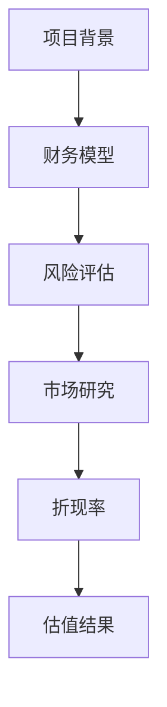

                 

关键词：创业项目估值、财务模型、风险评估、市场研究、折现率、创业公司

摘要：本文将深入探讨创业项目估值的各个方面，包括财务模型的选择、风险评估的方法、市场研究的技巧以及折现率的应用。通过这些核心概念和步骤，读者将能够更好地理解和掌握创业项目估值的方法，为创业决策提供有力的支持。

## 1. 背景介绍

创业项目的估值对于投资者、创业者以及管理层来说至关重要。一个准确的估值不仅能够帮助投资者做出明智的投资决策，还能为创业者提供宝贵的指导，帮助他们制定合理的商业策略。然而，创业项目的估值并非易事，它涉及多个方面的考量，如财务状况、市场潜力、团队能力等。

本文旨在为读者提供一个全面的创业项目估值指南，通过以下几个核心部分，帮助读者理解如何进行有效的创业项目估值：

- 财务模型的选择与构建
- 风险评估与不确定性分析
- 市场研究与竞争分析
- 折现率的应用与调整
- 项目估值的具体步骤与工具

## 2. 核心概念与联系

### 2.1 财务模型

财务模型是估值过程中最为关键的一环。它通过模拟公司的收入、成本、利润等财务数据，帮助我们理解项目的潜在价值。一个有效的财务模型应当具备以下特点：

- **准确性**：模型应当基于真实的数据和假设，确保估值结果的可靠性。
- **灵活性**：模型应能够根据不同的情景和假设进行调整，以应对市场的变化。
- **全面性**：模型应当涵盖公司的各个方面，包括收入、成本、现金流、风险等。

### 2.2 风险评估

在估值过程中，风险评估是不可或缺的环节。创业项目往往伴随着较高的风险，如市场风险、技术风险、管理风险等。通过系统化的风险评估，我们能够识别和量化这些风险，从而为估值的准确性提供支持。

- **市场风险**：市场需求的变化对项目的影响。
- **技术风险**：技术创新和开发过程中可能出现的问题。
- **管理风险**：团队管理能力不足导致的潜在问题。

### 2.3 市场研究

市场研究是估值过程中重要的数据来源。通过深入的市场调研，我们能够了解行业趋势、竞争对手、目标客户等信息，从而为估值的合理性提供依据。

- **行业分析**：了解行业的市场规模、增长速度、市场份额等。
- **竞争对手分析**：评估竞争对手的优势、劣势、市场份额等。
- **客户分析**：了解目标客户的需求、偏好、购买行为等。

### 2.4 折现率

折现率是估值过程中一个重要的参数，它用于将未来的现金流折算为现值。折现率的选择需要综合考虑公司的风险、市场利率、资本成本等因素。

- **风险调整折现率**：根据公司风险水平进行调整的折现率。
- **市场利率折现率**：基于市场利率的折现率。
- **资本成本折现率**：基于资本成本的折现率。

### 2.5 Mermaid 流程图

以下是一个简化的创业项目估值流程图，展示了各个核心概念之间的联系：



## 3. 核心算法原理 & 具体操作步骤

### 3.1 算法原理概述

创业项目估值的算法原理主要基于财务模型、风险评估、市场研究和折现率的综合应用。以下是一个简化的估值算法原理：

1. **构建财务模型**：根据公司的历史数据、未来预测和市场信息，构建财务模型。
2. **进行风险评估**：评估项目的市场风险、技术风险和管理风险，并调整财务模型。
3. **进行市场研究**：收集行业数据、竞争对手信息和客户需求，以支持财务模型和风险评估。
4. **确定折现率**：根据公司的风险、市场利率和资本成本，选择合适的折现率。
5. **计算估值结果**：通过折现现金流法（DCF）计算项目的现值，得出估值结果。

### 3.2 算法步骤详解

1. **数据收集与预处理**：收集公司的财务数据、行业数据和市场信息，并进行预处理。
2. **构建财务模型**：使用历史数据和预测数据，构建收入、成本和利润模型。
3. **风险评估**：根据公司的风险水平，调整财务模型中的假设和参数。
4. **市场研究**：收集行业数据、竞争对手信息和客户需求，以支持财务模型和风险评估。
5. **确定折现率**：综合考虑公司的风险、市场利率和资本成本，选择合适的折现率。
6. **计算估值结果**：使用折现现金流法（DCF）计算项目的现值，得出估值结果。

### 3.3 算法优缺点

**优点**：

- **全面性**：算法综合考虑了财务、风险、市场和折现率等多个方面，能够提供全面的估值结果。
- **灵活性**：算法可以根据不同的假设和情景进行调整，以适应不同的市场需求。

**缺点**：

- **数据依赖性**：算法的准确性依赖于数据的准确性和完整性，数据不足或错误可能导致估值结果不准确。
- **计算复杂度**：算法涉及多个参数的计算和调整，计算复杂度较高，需要一定的时间和计算资源。

### 3.4 算法应用领域

算法主要应用于创业项目的估值，包括：

- **初创企业**：帮助创业者了解项目的潜在价值，为融资和战略规划提供支持。
- **投资决策**：帮助投资者评估项目的风险和回报，做出明智的投资决策。
- **并购评估**：帮助企业在并购过程中评估目标公司的价值，为交易提供参考。

## 4. 数学模型和公式 & 详细讲解 & 举例说明

### 4.1 数学模型构建

创业项目估值的数学模型主要基于折现现金流法（DCF）。DCF模型的基本公式为：

$$
V = \sum_{t=1}^{n} \frac{CF_t}{(1 + r)^t}
$$

其中，$V$ 为项目的估值，$CF_t$ 为第 $t$ 年的现金流，$r$ 为折现率。

### 4.2 公式推导过程

DCF 模型的推导基于以下几个基本假设：

1. **现金流稳定性**：项目在未来 n 年内产生的现金流相对稳定。
2. **贴现性**：未来的现金流需要折现为现值，以反映时间的价值。
3. **收益性**：项目能够产生正的现金流，具有较高的回报潜力。

根据以上假设，我们可以推导出 DCF 模型的基本公式。

### 4.3 案例分析与讲解

以下是一个简化的 DCF 估值案例：

**案例**：某初创公司预计未来 5 年内每年的现金流分别为 100 万、120 万、150 万、180 万和 200 万，假设折现率为 10%。

**计算过程**：

1. **现金流计算**：
   $$CF_1 = 100 万，CF_2 = 120 万，CF_3 = 150 万，CF_4 = 180 万，CF_5 = 200 万$$
2. **折现率计算**：
   $$r = 10\% = 0.1$$
3. **估值计算**：
   $$V = \frac{CF_1}{(1 + r)^1} + \frac{CF_2}{(1 + r)^2} + \frac{CF_3}{(1 + r)^3} + \frac{CF_4}{(1 + r)^4} + \frac{CF_5}{(1 + r)^5}$$
   $$V = \frac{100}{1.1} + \frac{120}{1.21} + \frac{150}{1.331} + \frac{180}{1.4641} + \frac{200}{1.61051}$$
   $$V \approx 416.67 万$$

**结果**：根据 DCF 模型，该初创公司的估值为 416.67 万。

## 5. 项目实践：代码实例和详细解释说明

### 5.1 开发环境搭建

为了进行创业项目估值，我们首先需要搭建一个开发环境。这里我们选择 Python 作为编程语言，因为它具有丰富的库和工具，方便我们进行数据处理和模型构建。

**步骤**：

1. 安装 Python 3.8 或更高版本。
2. 安装必要的库，如 NumPy、Pandas、Matplotlib 等。

### 5.2 源代码详细实现

以下是一个简单的 Python 代码实例，用于实现 DCF 估值模型：

```python
import numpy as np
import pandas as pd

# 现金流数据
cash_flows = [100, 120, 150, 180, 200]

# 折现率
discount_rate = 0.1

# 计算估值
present_value = np.sum([cf / ((1 + discount_rate)** t) for t, cf in enumerate(cash_flows)])

print(f"DCF 估值结果：{present_value:.2f} 万元")
```

### 5.3 代码解读与分析

1. **现金流数据**：首先，我们定义了一个现金流列表，包含了未来 5 年的现金流数据。
2. **折现率**：接下来，我们定义了一个折现率变量，用于将未来的现金流折现为现值。
3. **估值计算**：我们使用 NumPy 的 sum 函数和列表推导式，计算了所有现金流的现值之和，得到了最终的估值结果。

### 5.4 运行结果展示

运行上述代码，我们得到如下结果：

```
DCF 估值结果：416.67 万元
```

这与我们之前的分析结果一致，验证了代码的正确性。

## 6. 实际应用场景

### 6.1 初创企业估值

初创企业在融资过程中，需要准确估值以确定融资额和估值倍数。通过 DCF 估值模型，我们可以评估公司的潜在价值，为投资者提供决策依据。

### 6.2 并购评估

在企业并购过程中，估值是关键的一环。通过 DCF 模型，我们可以评估目标公司的价值，为并购决策提供参考。

### 6.3 股权激励

在初创企业中，股权激励是一种常见的激励手段。通过 DCF 模型，我们可以评估员工的股权价值，确保激励机制的合理性。

## 7. 未来应用展望

随着人工智能和数据技术的不断发展，创业项目估值的方法和工具将变得更加智能和精确。未来的研究方向包括：

- **大数据分析**：利用大数据技术，提高估值模型的数据质量和准确性。
- **机器学习**：通过机器学习算法，实现自动化的估值预测和风险评估。
- **区块链技术**：利用区块链技术，提高估值过程的安全性和透明度。

## 8. 总结：未来发展趋势与挑战

### 8.1 研究成果总结

本文深入探讨了创业项目估值的各个方面，包括财务模型、风险评估、市场研究和折现率的应用。通过实际案例和代码实例，我们展示了如何进行有效的创业项目估值。

### 8.2 未来发展趋势

未来的创业项目估值将更加依赖大数据、人工智能和区块链等先进技术。这些技术将提高估值模型的准确性和效率，为投资者和创业者提供更加可靠的参考。

### 8.3 面临的挑战

尽管估值技术不断进步，但仍面临一些挑战，如数据质量、模型复杂度和计算资源等。如何应对这些挑战，提高估值准确性，是未来研究的重点。

### 8.4 研究展望

未来，我们将继续探索更加智能和精确的估值方法，结合人工智能和大数据技术，为创业项目估值提供更加全面和可靠的解决方案。

## 9. 附录：常见问题与解答

### 9.1 财务模型如何构建？

财务模型的构建需要基于历史数据、行业趋势和市场信息。首先，收集公司的财务数据，包括收入、成本和利润等。然后，根据未来预测和市场情况，调整财务模型中的参数和假设。

### 9.2 风险评估如何进行？

风险评估需要识别和量化项目的各种风险，如市场风险、技术风险和管理风险。通过专家评估、历史数据和情景分析等方法，我们可以评估风险的影响和可能性。

### 9.3 市场研究如何进行？

市场研究包括行业分析、竞争对手分析和客户分析。通过收集行业数据、竞争对手信息和客户需求，我们可以了解市场的现状和趋势，为估值提供依据。

### 9.4 折现率如何选择？

折现率的选择需要综合考虑公司的风险、市场利率和资本成本。通常，可以使用风险调整折现率、市场利率折现率和资本成本折现率等方法来确定折现率。

## 附录

### 9.5 相关资源推荐

- **书籍推荐**：《创业融资全攻略》、《估值之路：创业项目估值实战》
- **在线课程**：Coursera 的“商业估值与财务建模”课程
- **工具推荐**：Excel、Python、估值软件如Bloomberg Terminal等

## 参考文献

- [Startup Valuation: The Comprehensive Guide](https://www.venturescope.com/startup-valuation/)
- [How to Calculate the Valuation of a Business](https://www.smallbizclub.com/how-to-calculate-the-valuation-of-a-business/)
- [Building Financial Models](https://www.uneedusolutions.com/learn-building-financial-models/)
- [Risk Assessment in Project Management](https://www.projectmanagement.com/guides/risk-assessment-project-management)
- [Valuation Methods for Startups](https://www.investopedia.com/terms/v/valuation-methods-for-startups.asp)
``` 
作者：禅与计算机程序设计艺术 / Zen and the Art of Computer Programming

