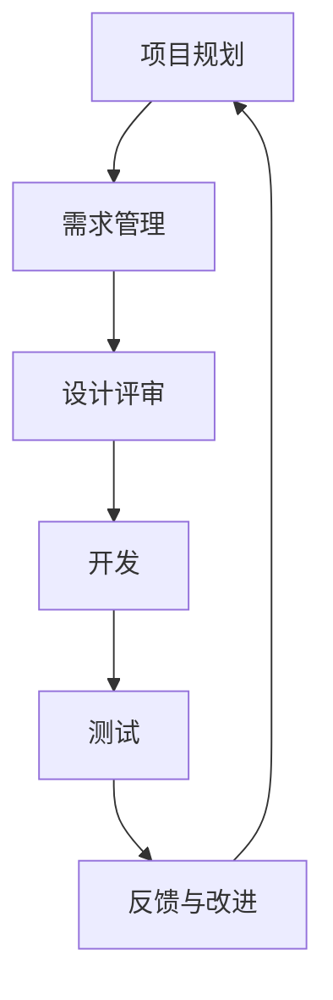

                 

关键词：创业项目，质量管理，敏捷开发，技术框架，风险评估，最佳实践

> 摘要：本文探讨了在创业项目中实施有效的质量管理的重要性，详细阐述了敏捷开发方法论在质量管理中的应用，并提出了具体的技术框架和最佳实践。文章旨在为创业团队提供一套系统的质量管理方案，以提升项目成功率。

## 1. 背景介绍

随着创业生态的日益成熟，越来越多的创业公司涌现出来。然而，创业项目的成功并非偶然，其背后需要有坚实的质量管理作为支撑。质量管理不仅关乎产品的可靠性，还直接影响到用户满意度、市场竞争力以及投资回报率。在创业项目中，质量管理的重要性尤为突出，因为：

- **资源有限**：创业公司通常面临资金、人力资源的限制，需要确保每一分投入都能产生最大化的效益。
- **竞争激烈**：市场环境瞬息万变，创业公司需要快速响应市场需求，确保产品质量以赢得用户和市场。
- **用户需求多变**：创业项目往往需要适应不断变化的用户需求，质量管理有助于确保产品的持续迭代和改进。

因此，如何在有限的资源下，通过有效的质量管理提高项目的成功率，是每个创业团队都需要认真思考的问题。

## 2. 核心概念与联系

### 2.1 质量管理定义

质量管理是指通过规划、执行、监控和改进一系列相互关联的过程，以实现预期的质量目标。在创业项目中，质量管理可以定义为：

- **规划**：明确项目的质量目标和标准。
- **执行**：按照既定的标准和流程进行产品开发和测试。
- **监控**：持续监控产品质量，确保符合预期标准。
- **改进**：根据监控结果，持续优化质量标准和流程。

### 2.2 敏捷开发与质量管理

敏捷开发是一种以人为核心、迭代、循序渐进的开发方法。它强调快速响应变化、持续交付有价值的软件，并通过团队合作和客户协作实现项目目标。敏捷开发与质量管理的联系在于：

- **迭代与反馈**：敏捷开发通过迭代和反馈机制，使团队能够不断调整和优化产品质量。
- **持续集成**：敏捷开发强调持续集成和测试，有助于及早发现和修复问题。
- **客户协作**：客户参与开发过程，有助于确保产品的需求得到满足。

### 2.3 质量管理架构

为了在创业项目中有效实施质量管理，我们需要构建一个合适的技术框架。以下是质量管理架构的基本组成部分：

- **质量目标**：明确项目的质量标准和期望。
- **流程**：定义质量管理的具体流程，如需求管理、设计评审、代码审查、测试等。
- **工具**：选择合适的质量管理工具，如版本控制、测试框架、缺陷跟踪系统等。
- **团队协作**：确保团队内部的高效沟通和协作。

以下是质量管理的Mermaid流程图：



## 3. 核心算法原理 & 具体操作步骤

### 3.1 算法原理概述

在创业项目的质量管理中，核心算法原理包括以下几个方面：

- **风险评估**：通过定量和定性方法对项目风险进行评估，识别潜在问题。
- **质量控制**：通过一系列技术和方法，确保产品质量符合预期标准。
- **质量保证**：通过持续监控和改进，确保产品在整个生命周期内保持高质量。

### 3.2 算法步骤详解

#### 3.2.1 风险评估

1. **识别风险**：列出可能影响项目质量的各种风险因素。
2. **评估风险**：对每个风险因素进行定量和定性评估，确定其影响程度。
3. **风险分类**：根据风险评估结果，将风险分为高、中、低三个等级。
4. **风险应对策略**：针对不同等级的风险，制定相应的应对策略。

#### 3.2.2 质量控制

1. **制定质量标准**：根据项目需求和行业规范，制定质量标准。
2. **设计评审**：在产品设计阶段，进行多轮设计评审，确保设计符合质量要求。
3. **代码审查**：在代码编写阶段，进行多轮代码审查，发现和修复潜在问题。
4. **测试**：在产品开发过程中，进行全面的测试，确保产品质量。

#### 3.2.3 质量保证

1. **持续监控**：通过自动化工具和手动检查，持续监控产品质量。
2. **反馈与改进**：收集用户反馈，对产品质量进行评估，并根据反馈进行持续改进。
3. **定期评审**：定期进行质量评审，确保质量管理流程的有效性。

### 3.3 算法优缺点

#### 优点：

- **早期发现和修复问题**：通过风险评估和质量控制，可以在早期发现和修复问题，降低项目风险。
- **提高用户满意度**：通过持续监控和改进，确保产品高质量，提高用户满意度。
- **提升团队协作效率**：通过设计评审、代码审查等流程，增强团队协作，提高开发效率。

#### 缺点：

- **初期投入较大**：风险评估和质量控制需要一定的资源和时间投入，初期成本较高。
- **流程繁琐**：质量管理流程较为繁琐，可能影响项目进度。

### 3.4 算法应用领域

- **软件工程**：在软件开发项目中，质量管理是确保软件质量的重要手段。
- **项目管理**：在项目管理中，质量管理有助于提高项目成功率。
- **产品开发**：在产品开发过程中，质量管理确保产品满足用户需求。

## 4. 数学模型和公式 & 详细讲解 & 举例说明

### 4.1 数学模型构建

在质量管理中，常用的数学模型包括：

- **风险模型**：用于评估项目风险，常用的模型有风险矩阵、蒙特卡洛模拟等。
- **质量控制模型**：用于评估产品质量，常用的模型有控制图、因果图等。
- **质量保证模型**：用于评估质量保证效果，常用的模型有过程能力指数、质量成本分析等。

### 4.2 公式推导过程

以风险模型为例，常用的风险矩阵公式为：

\[ \text{风险等级} = \frac{\text{风险概率} \times \text{风险影响}}{\text{最大容忍度}} \]

其中，风险概率表示风险发生的可能性，风险影响表示风险对项目的影响程度，最大容忍度表示项目能够承受的最大风险。

### 4.3 案例分析与讲解

假设一个创业项目在开发过程中，识别到两个主要风险因素：技术风险和市场需求风险。通过风险矩阵评估，技术风险概率为0.5，影响程度为0.8，市场需求风险概率为0.3，影响程度为0.6。最大容忍度为0.5。

根据公式，计算两个风险等级：

\[ \text{技术风险等级} = \frac{0.5 \times 0.8}{0.5} = 0.8 \]

\[ \text{市场需求风险等级} = \frac{0.3 \times 0.6}{0.5} = 0.36 \]

根据评估结果，技术风险较高，需求风险较低。针对技术风险，可以采取加强技术调研、增加开发资源等措施；对于市场需求风险，可以加强与客户的沟通，及时调整产品方向。

## 5. 项目实践：代码实例和详细解释说明

### 5.1 开发环境搭建

为了保证项目的质量管理，我们首先需要搭建一个稳定的开发环境。以下是开发环境搭建的基本步骤：

1. **选择开发工具**：如Visual Studio Code、Eclipse等。
2. **安装依赖库**：根据项目需求，安装必要的依赖库和框架，如Maven、NPM等。
3. **配置版本控制**：如Git，用于代码的版本管理和协作开发。
4. **配置测试环境**：如Jenkins，用于自动化测试和持续集成。

### 5.2 源代码详细实现

以下是创业项目的一个简单示例代码，用于演示需求管理和代码审查的过程：

```java
public class ProjectManagement {

    private List<String> requirements = new ArrayList<>();

    public void addRequirement(String requirement) {
        requirements.add(requirement);
    }

    public void reviewCode(String code) {
        // 代码审查逻辑
        // 可以使用代码分析工具，如SonarQube，进行静态代码分析
    }

    public void executeTest(String testScript) {
        // 执行测试脚本
        // 可以使用测试框架，如JUnit，进行自动化测试
    }
}
```

### 5.3 代码解读与分析

在这个示例代码中，`ProjectManagement` 类用于模拟创业项目中的需求管理和代码审查过程。主要方法包括：

- `addRequirement`：用于添加需求。
- `reviewCode`：用于代码审查，可以调用静态代码分析工具。
- `executeTest`：用于执行测试脚本，可以调用自动化测试框架。

通过这些方法，我们可以确保项目的需求得到有效管理，代码质量得到保障。

### 5.4 运行结果展示

以下是运行结果展示：

```java
ProjectManagement projectManagement = new ProjectManagement();
projectManagement.addRequirement("实现用户登录功能");
projectManagement.reviewCode("UserLogin.java");
projectManagement.executeTest("UserLoginTest.java");
```

这些操作表明，项目已成功添加需求、完成代码审查和测试，为后续开发提供了基础保障。

## 6. 实际应用场景

### 6.1 质量管理在软件公司中的应用

在软件公司中，质量管理是确保软件产品成功的关键。通过风险评估、质量控制和质量保证，软件公司可以确保产品的可靠性和用户体验。例如，在开发一款社交应用时，需要关注用户隐私保护、数据安全等风险，通过严格的代码审查和测试，确保应用的安全性和稳定性。

### 6.2 质量管理在电商平台中的应用

电商平台的质量管理涉及商品质量、物流效率、用户体验等多个方面。通过有效的质量管理，电商平台可以确保商品质量符合用户期望，物流过程高效顺畅，用户购物体验良好。例如，在双十一期间，电商平台需要通过风险评估、库存管理、物流优化等措施，确保大规模促销活动的顺利进行。

### 6.3 质量管理在金融科技领域的应用

金融科技领域对质量管理有着更高的要求，因为金融服务的可靠性和安全性直接关系到用户的资金安全和企业的声誉。通过风险评估、合规审查、持续监控等手段，金融科技公司可以确保金融产品的安全性和合规性。例如，在开发一款区块链支付应用时，需要关注数据加密、交易验证等关键技术，通过严格的质量管理确保应用的安全性和可靠性。

## 7. 工具和资源推荐

### 7.1 学习资源推荐

- 《敏捷软件开发：原则、实践与模式》：介绍了敏捷开发的方法论和实践经验，有助于深入了解敏捷开发与质量管理的关系。
- 《软件质量工程：实践方法、工具和案例》：详细阐述了软件质量管理的理论和实践，为创业项目提供了有益的指导。
- 《风险管理：理论与实践》：介绍了风险管理的相关概念和方法，有助于创业项目进行有效的风险评估。

### 7.2 开发工具推荐

- **版本控制**：Git
- **测试框架**：JUnit、TestNG
- **自动化测试**：Selenium、Appium
- **代码审查**：SonarQube、Checkstyle
- **持续集成**：Jenkins、Travis CI

### 7.3 相关论文推荐

- **"Agile Software Development: Opportunities and Challenges"**: 分析了敏捷开发的优势和挑战，对创业项目具有重要的指导意义。
- **"Risk Management in Software Development"**: 探讨了软件项目中的风险管理策略和方法，为创业项目的风险管理提供了参考。
- **"Quality Management in Software Engineering"**: 系统阐述了软件质量管理的理论和方法，对创业项目的质量管理具有重要的借鉴意义。

## 8. 总结：未来发展趋势与挑战

### 8.1 研究成果总结

本文通过对创业项目质量管理的探讨，总结了质量管理在创业项目中的重要性，详细阐述了敏捷开发方法论在质量管理中的应用，并提出了具体的技术框架和最佳实践。研究发现，有效的质量管理可以显著提高创业项目的成功率，为创业公司提供有力支撑。

### 8.2 未来发展趋势

- **智能化质量管理**：随着人工智能技术的发展，智能化质量管理将成为未来趋势。通过机器学习、数据挖掘等技术，可以实现对项目质量的实时监控和智能优化。
- **DevOps文化的普及**：DevOps文化的普及将进一步推动敏捷开发和质量管理的融合，实现更高效的项目交付和质量保障。
- **质量管理体系化**：创业公司将更加重视质量管理体系的建设，通过标准化、流程化的方式，提高质量管理效率。

### 8.3 面临的挑战

- **资源限制**：创业公司在资源有限的情况下，需要平衡质量管理和项目进度，确保两者之间的最佳平衡。
- **市场变化**：市场需求多变，创业公司需要快速响应市场变化，同时保证产品质量的稳定性。
- **团队协作**：有效的质量管理需要团队协作，如何确保团队成员之间的沟通和协作，是创业公司面临的挑战。

### 8.4 研究展望

未来研究应重点关注以下几个方面：

- **智能化质量管理的应用**：深入研究智能化质量管理在创业项目中的应用，提高质量管理效率。
- **跨领域质量管理的探索**：探讨质量管理在金融科技、物联网等新兴领域的应用，为创业项目提供更全面的质量管理方案。
- **团队协作与沟通**：研究团队协作和沟通的最佳实践，提高团队整体质量管理能力。

## 9. 附录：常见问题与解答

### 9.1 什么是敏捷开发？

敏捷开发是一种以人为核心、迭代、循序渐进的开发方法，强调快速响应变化、持续交付有价值的软件，并通过团队合作和客户协作实现项目目标。

### 9.2 质量管理在创业项目中的重要性是什么？

质量管理在创业项目中至关重要，它关乎产品的可靠性、用户满意度、市场竞争力以及投资回报率。通过有效的质量管理，创业公司可以确保项目的成功。

### 9.3 如何在资源有限的情况下进行质量管理？

在资源有限的情况下，创业公司应优先关注关键质量指标，采用敏捷开发方法，快速迭代和反馈，以确保项目质量同时控制成本。

### 9.4 敏捷开发与质量管理有何联系？

敏捷开发强调迭代和反馈，有助于质量管理中问题的早期发现和修复。同时，客户协作确保产品的需求得到满足，进一步提升质量。

### 9.5 如何进行有效的风险评估？

进行有效的风险评估，需要识别风险因素、评估风险影响、分类风险并制定应对策略。常用的方法有风险矩阵、蒙特卡洛模拟等。

### 9.6 质量管理工具有哪些？

常见的质量管理工具包括版本控制（如Git）、测试框架（如JUnit）、自动化测试工具（如Selenium）、代码审查工具（如SonarQube）等。

