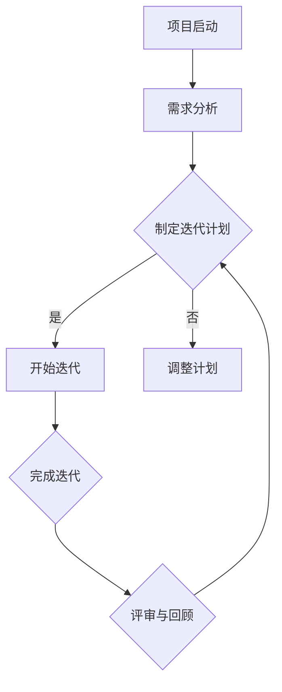

                 

关键词：创业项目、进度管理、敏捷方法、项目管理、团队协作、风险评估

摘要：本文旨在探讨创业项目进度管理的有效方法。通过分析敏捷方法和项目管理工具，本文提供了具体的操作步骤和案例分析，以帮助创业团队更好地掌控项目进度，提高项目成功率。

## 1. 背景介绍

在当今快速变化的市场环境中，创业项目面临着诸多挑战。如何有效地管理项目进度，确保项目按时交付，是创业团队成功的关键因素之一。传统的项目管理方法虽然提供了一系列规范和流程，但在应对复杂、动态的创业环境时，往往显得力不从心。因此，本文将介绍一种更为灵活和有效的进度管理方法——敏捷方法，并结合实际案例，展示如何在实际创业项目中应用这一方法。

## 2. 核心概念与联系

### 2.1 敏捷方法的核心理念

敏捷方法是一种以人为核心、迭代式和增量的软件开发方法。它的核心理念包括：

- **用户优先**：关注用户需求，持续交付有价值的产品。
- **迭代开发**：通过短周期迭代，快速响应变化，持续改进产品。
- **团队协作**：强调跨职能团队的紧密协作，共同承担责任。
- **适应性管理**：面对不确定性，灵活调整计划，持续优化流程。

### 2.2 敏捷方法的架构

下面是敏捷方法的 Mermaid 流程图，展示了其关键环节和流程：



### 2.3 敏捷方法与传统项目管理的关系

敏捷方法并非完全抛弃传统项目管理，而是在其基础上进行了优化和调整。传统项目管理强调规范和流程，而敏捷方法则更注重灵活性和适应性。两者之间的关键区别在于：

- **目标导向**：传统项目管理侧重于计划和控制，而敏捷方法强调用户价值和迭代改进。
- **风险管理**：传统项目管理通过风险评估和应对措施来控制风险，而敏捷方法通过持续反馈和调整来降低风险。
- **团队协作**：传统项目管理中，项目经理是核心角色，而敏捷方法强调团队成员的平等协作。

## 3. 核心算法原理 & 具体操作步骤

### 3.1 算法原理概述

敏捷方法的核心理念可以通过以下算法原理来概括：

- **迭代循环**：每次迭代都包括需求分析、设计、编码、测试和评审等环节，通过快速迭代，逐步完善产品。
- **增量交付**：每次迭代都交付一个可用的产品版本，逐步实现项目目标。
- **用户反馈**：通过用户反馈，不断调整产品方向和功能，确保产品符合用户需求。

### 3.2 算法步骤详解

#### 3.2.1 需求分析

在开始迭代之前，团队需要对项目需求进行详细分析，确保所有需求都被明确和优先级排序。这可以通过用户故事地图、故事地图等方法来完成。

#### 3.2.2 制定迭代计划

根据需求分析的结果，团队需要制定一个详细的迭代计划，包括迭代周期、任务分配、资源需求等。这可以通过迭代规划会议来完成。

#### 3.2.3 开始迭代

在迭代开始后，团队成员按照计划执行任务。这包括设计、编码、测试等环节。

#### 3.2.4 完成迭代

在每个迭代结束时，团队需要完成以下任务：

- **测试和验证**：确保所有任务都被完成，并且产品功能符合预期。
- **用户评审**：与用户进行评审，收集反馈，并根据反馈调整产品方向。
- **迭代总结**：回顾本次迭代的过程和结果，识别问题和改进点。

#### 3.2.5 评审与回顾

在每次迭代结束后，团队需要召开评审与回顾会议，总结本次迭代的经验教训，并制定改进计划。这有助于团队不断优化工作流程，提高工作效率。

### 3.3 算法优缺点

#### 优点：

- **快速响应变化**：敏捷方法通过短周期迭代，能够快速响应市场需求变化，降低项目风险。
- **用户参与**：用户在整个开发过程中都有参与，确保产品符合用户需求。
- **团队协作**：强调团队成员的平等协作，提高团队凝聚力。

#### 缺点：

- **计划和控制难度大**：由于迭代周期较短，计划和控制难度增加。
- **文档化不足**：敏捷方法强调口头交流和协作，可能导致文档化不足。

### 3.4 算法应用领域

敏捷方法主要应用于软件开发领域，尤其适合以下场景：

- **需求频繁变化**：市场需求变化快，需要快速调整产品方向。
- **高复杂性**：项目复杂度高，需要灵活应对变化。
- **用户参与度高**：用户需求多变，需要用户全程参与。

## 4. 数学模型和公式 & 详细讲解 & 举例说明

### 4.1 数学模型构建

在敏捷方法中，常用的数学模型包括：

- **时间模型**：用于估算每个迭代的时间周期。
- **成本模型**：用于估算每个迭代的人力、资源和成本。
- **质量模型**：用于评估每次迭代的产品质量。

### 4.2 公式推导过程

假设每个迭代的时间周期为 \( T \)，成本为 \( C \)，质量评估分数为 \( Q \)。则：

- **时间模型**：\( T = \frac{D}{R} \)，其中 \( D \) 为任务总数，\( R \) 为迭代次数。
- **成本模型**：\( C = k \times T \)，其中 \( k \) 为单位时间成本。
- **质量模型**：\( Q = \frac{N}{D} \)，其中 \( N \) 为已完成的任务数。

### 4.3 案例分析与讲解

假设一个创业项目需要完成 100 个任务，每个任务的平均难度为中等，迭代周期为 2 周。单位时间成本为 1000 美元。则：

- **时间模型**：\( T = \frac{100}{2} = 50 \) 周。
- **成本模型**：\( C = 1000 \times 50 = 50000 \) 美元。
- **质量模型**：\( Q = \frac{100}{100} = 1 \)。

这意味着，该项目需要 50 周时间完成，总成本为 50000 美元，产品质量为 100%。

通过调整迭代周期、任务难度和资源投入，可以优化项目的时间、成本和质量。

## 5. 项目实践：代码实例和详细解释说明

### 5.1 开发环境搭建

为了更好地理解敏捷方法在实际项目中的应用，我们将以一个简单的 Web 应用项目为例，介绍开发环境的搭建。以下是项目的开发环境要求：

- **开发工具**：Visual Studio Code
- **编程语言**：Python
- **数据库**：MySQL
- **前端框架**：Django
- **后端框架**：Flask

### 5.2 源代码详细实现

以下是项目的核心代码实现：

```python
# app.py

from flask import Flask, render_template, request
import MySQLdb

app = Flask(__name__)

@app.route('/')
def index():
    return render_template('index.html')

@app.route('/add', methods=['POST'])
def add():
    data = request.form
    name = data['name']
    age = data['age']
    
    db = MySQLdb.connect("localhost", "root", "password", "test_db")
    cursor = db.cursor()
    
    sql = "INSERT INTO users (name, age) VALUES ('%s', %s)" % (name, age)
    cursor.execute(sql)
    db.commit()
    
    db.close()
    
    return 'User added successfully!'

if __name__ == '__main__':
    app.run()
```

### 5.3 代码解读与分析

这段代码是一个简单的 Web 应用，用于添加用户信息到 MySQL 数据库。以下是代码的主要部分及其功能：

- **导入模块**：引入 Flask 框架和 MySQLdb 模块。
- **创建应用对象**：创建一个 Flask 应用对象。
- **定义路由**：定义两个路由，一个是主页路由（/），用于展示主页；另一个是添加用户路由（/add），用于处理用户提交的表单数据。
- **数据库操作**：连接 MySQL 数据库，执行 SQL 插入操作。

### 5.4 运行结果展示

在运行该应用后，用户可以通过 Web 表单提交用户信息，应用会接收并处理表单数据，将用户信息保存到 MySQL 数据库。

## 6. 实际应用场景

敏捷方法不仅适用于软件开发项目，还可以广泛应用于其他类型的创业项目，如：

- **市场营销**：通过敏捷营销，快速调整营销策略，提高市场响应速度。
- **产品开发**：通过敏捷开发，快速迭代产品，确保产品符合用户需求。
- **项目管理**：通过敏捷项目管理，提高项目进度控制能力，降低项目风险。

## 7. 工具和资源推荐

### 7.1 学习资源推荐

- **《敏捷软件开发：实践指南》**：提供敏捷方法的详细实践指南。
- **《Scrum 敏捷开发实践指南》**：介绍 Scrum 方法，适用于项目管理。

### 7.2 开发工具推荐

- **JIRA**：用于项目管理，支持敏捷开发方法。
- **Trello**：用于任务管理，支持迭代式开发。

### 7.3 相关论文推荐

- **"Agile Software Development: Principles, Patterns, and Practices"**：介绍敏捷开发方法的经典论文。
- **"Scrum: The Art of Doing Twice the Work in Half the Time"**：介绍 Scrum 方法的实践和效果。

## 8. 总结：未来发展趋势与挑战

### 8.1 研究成果总结

敏捷方法在创业项目中的成功应用，证明了其灵活性和适应性。通过用户参与和迭代改进，敏捷方法能够更好地应对市场变化，提高项目成功率。

### 8.2 未来发展趋势

随着创业环境的日益复杂，敏捷方法将继续发挥重要作用。未来，敏捷方法将更加智能化，结合大数据分析和人工智能技术，实现更高效的项目管理。

### 8.3 面临的挑战

敏捷方法在实施过程中，仍面临一些挑战，如团队协作、计划控制等。未来，需要进一步研究如何优化敏捷方法，提高其适用性和可操作性。

### 8.4 研究展望

未来的研究将集中在如何将敏捷方法与其他管理方法相结合，探索适用于不同类型创业项目的最佳实践。同时，研究如何将敏捷方法应用于更广泛的领域，如供应链管理、人力资源管理等。

## 9. 附录：常见问题与解答

### 9.1 什么是敏捷方法？

敏捷方法是一种以人为核心、迭代式和增量的软件开发方法，强调快速响应变化、持续交付价值和用户参与。

### 9.2 敏捷方法适用于哪些项目？

敏捷方法适用于需求频繁变化、项目复杂度高的项目，如软件开发、产品开发等。

### 9.3 敏捷方法和传统项目管理有什么区别？

敏捷方法强调快速响应变化、持续交付价值和用户参与，而传统项目管理侧重于计划和控制。两者之间的关键区别在于目标导向、风险管理方式和团队协作方式。

### 9.4 如何实施敏捷方法？

实施敏捷方法需要团队协作、用户参与和持续改进。具体步骤包括需求分析、迭代计划、任务执行、迭代总结和评审与回顾。

作者：禅与计算机程序设计艺术 / Zen and the Art of Computer Programming
```

