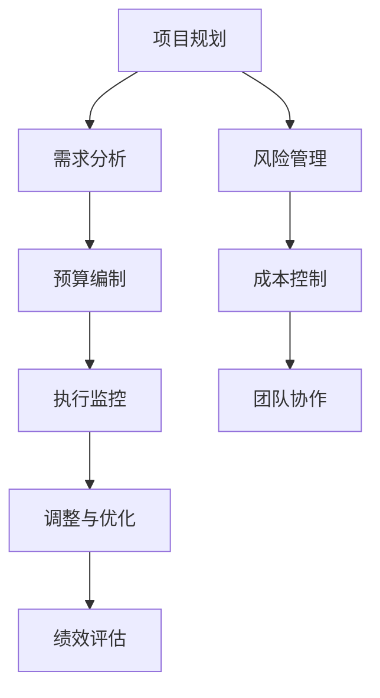

                 

 关键词：创业项目、预算管理、财务规划、风险管理、成本控制、数据分析、高效管理、项目可行性分析、资源优化、团队协作、财务模型、预算编制、执行监控。

> 摘要：本文深入探讨了创业项目预算管理的重要性，详细阐述了预算管理的核心概念、关键步骤、实用工具和技术。通过分析实际案例，本文提出了有效的预算管理策略，旨在帮助创业者实现项目的财务健康和可持续发展。

## 1. 背景介绍

在当今竞争激烈的商业环境中，创业项目面临着诸多挑战。其中，预算管理是确保项目成功的关键因素之一。有效的预算管理不仅有助于控制成本，还能为项目提供清晰的财务方向和目标。然而，对于许多创业者来说，如何进行有效的预算管理仍然是一个难题。本文将为您解答这一问题，提供实用的预算管理策略和方法。

## 2. 核心概念与联系

### 2.1 预算管理的基本概念

预算管理是指通过规划、执行和监控预算过程，确保资源合理分配和有效利用的过程。它包括以下几个关键步骤：

1. **项目规划**：明确项目的目标和预期成果。
2. **预算编制**：根据项目需求，制定详细的财务计划。
3. **执行监控**：跟踪预算执行情况，及时调整和优化。
4. **绩效评估**：评估预算执行效果，为未来项目提供参考。

### 2.2 预算管理流程

预算管理流程包括以下主要环节：

1. **需求分析**：了解项目需求，确定资源需求和成本结构。
2. **预算编制**：制定预算计划，分配资源，设定财务目标。
3. **执行监控**：监控预算执行情况，确保资源合理使用。
4. **调整与优化**：根据实际情况，调整预算计划，优化资源配置。
5. **绩效评估**：评估预算执行效果，为下一阶段提供参考。

### 2.3 预算管理与财务规划的关系

预算管理是财务规划的重要组成部分。财务规划是指为项目制定长期的财务目标和策略。预算管理则是实现财务规划的具体手段，通过合理分配资源，确保项目财务目标的实现。

### 2.4 预算管理与风险管理的联系

预算管理过程中，风险管理是不可或缺的一环。通过识别、评估和应对潜在风险，预算管理能够降低项目风险，确保项目顺利进行。

### 2.5 预算管理与成本控制的关系

成本控制是预算管理的重要目标之一。通过严格的预算管理和成本控制，创业者可以降低项目成本，提高利润率。

### 2.6 预算管理与团队协作的关系

预算管理需要团队成员的密切协作。通过有效的沟通和协作，团队成员可以共同实现预算管理目标，提高项目成功率。

### 2.7 核心概念原理和架构的 Mermaid 流程图



## 3. 核心算法原理 & 具体操作步骤

### 3.1 算法原理概述

预算管理的核心算法是基于线性规划原理，通过优化资源分配和成本控制，实现项目财务目标的最大化。算法主要包括以下几个步骤：

1. **目标函数的构建**：根据项目需求和成本结构，构建目标函数。
2. **约束条件的确定**：根据项目实际情况，设定约束条件。
3. **求解算法的选择**：选择合适的求解算法，如线性规划求解器。
4. **求解与优化**：利用求解算法，求解最优解，并根据实际情况进行优化。

### 3.2 算法步骤详解

1. **构建目标函数**：目标函数通常为成本最小化或利润最大化。具体形式取决于项目的财务目标。

2. **设定约束条件**：约束条件包括资源限制、时间限制、预算限制等。这些条件确保资源分配和成本控制在可接受的范围内。

3. **选择求解算法**：常见的求解算法包括单纯形法、内点法、拉格朗日乘数法等。选择合适的求解算法，可以提高计算效率和求解精度。

4. **求解与优化**：利用求解算法，求解最优解。根据实际情况，对解进行优化，以确保资源分配和成本控制的最佳效果。

### 3.3 算法优缺点

**优点**：

1. **高效性**：基于数学模型和求解算法，能够快速求解最优解。
2. **准确性**：通过严格的约束条件和优化过程，确保资源分配和成本控制的准确性。

**缺点**：

1. **复杂性**：算法涉及多个步骤和求解过程，对于非专业人士可能较为复杂。
2. **适用性**：对于一些非线性问题和复杂场景，算法可能不适用。

### 3.4 算法应用领域

预算管理算法广泛应用于各类创业项目，包括软件开发、市场营销、产品研发等。通过有效的预算管理，创业者可以降低成本，提高项目成功率。

## 4. 数学模型和公式 & 详细讲解 & 举例说明

### 4.1 数学模型构建

预算管理的数学模型通常基于线性规划，其目标函数和约束条件如下：

$$
\text{Minimize} \quad C = \sum_{i=1}^{n} c_{i} x_{i}
$$

$$
\text{Subject to} \quad a_{i}^{T} x \leq b_{i}, \quad i=1,2,...,m
$$

其中，$x$为资源分配向量，$c_{i}$为第$i$项资源的单位成本，$a_{i}$为第$i$项资源的消耗向量，$b_{i}$为资源的限制量。

### 4.2 公式推导过程

预算管理的公式推导过程如下：

1. **确定目标函数**：根据项目需求和成本结构，设定目标函数为成本最小化。

2. **设定约束条件**：根据项目资源需求和限制，设定约束条件。

3. **构建线性规划模型**：将目标函数和约束条件构建为线性规划模型。

4. **求解最优解**：利用线性规划求解器，求解最优解。

### 4.3 案例分析与讲解

假设一个创业项目需要分配一定数量的研发资源，成本为每单位研发资源5000元。现有两个研发项目A和B，项目A需要3单位研发资源，项目B需要2单位研发资源。资源限制为最多可用5单位研发资源。求最优的资源分配方案。

根据上述问题，构建线性规划模型如下：

$$
\text{Minimize} \quad C = 5000(x_{A} + x_{B})
$$

$$
\text{Subject to} \quad x_{A} + x_{B} \leq 5
$$

$$
x_{A} \geq 0, \quad x_{B} \geq 0
$$

利用线性规划求解器，求解最优解得$x_{A}=3, x_{B}=2$。即最优的资源分配方案为：项目A分配3单位研发资源，项目B分配2单位研发资源。

## 5. 项目实践：代码实例和详细解释说明

### 5.1 开发环境搭建

在本文中，我们将使用Python语言和PuLP库进行预算管理模型的构建和求解。首先，确保您的Python环境已经安装，然后通过以下命令安装PuLP库：

```bash
pip install pulp
```

### 5.2 源代码详细实现

以下是一个简单的预算管理模型代码示例：

```python
import pulp

# 模型参数
cost_per_resource = 5000
resource_limit = 5
project_A_resources = 3
project_B_resources = 2

# 创建线性规划模型
model = pulp.LpProblem("BudgetManagement", pulp.LpMinimize)

# 定义决策变量
x_A = pulp.LpVariable.dicts("x_A", (), 0, cat='Continuous')
x_B = pulp.LpVariable.dicts("x_B", (), 0, cat='Continuous')

# 目标函数
model += 5000 * (x_A + x_B), "Total Cost"

# 约束条件
model += x_A + x_B <= 5, "Resource Limit"

# 求解模型
model.solve()

# 输出结果
print("Optimal Resource Allocation:")
print("Project A:", x_A.varValue)
print("Project B:", x_B.varValue)
print("Total Cost:", pulp.value(model.objective))
```

### 5.3 代码解读与分析

1. **导入库**：首先，导入所需的Python库，包括PuLP库。
2. **定义参数**：设定模型参数，如单位成本、资源限制和项目需求。
3. **创建模型**：创建一个名为“BudgetManagement”的线性规划模型，目标为最小化总成本。
4. **定义变量**：定义决策变量$x_{A}$和$x_{B}$，表示项目A和项目B的资源分配量。
5. **构建目标函数**：将总成本表示为目标函数，形式为$C = 5000(x_{A} + x_{B})$。
6. **设定约束条件**：设定资源限制约束条件，形式为$x_{A} + x_{B} \leq 5$。
7. **求解模型**：利用PuLP库的求解器求解最优解。
8. **输出结果**：输出最优的资源分配方案和总成本。

### 5.4 运行结果展示

运行上述代码，得到最优的资源分配方案为：项目A分配3单位研发资源，项目B分配2单位研发资源，总成本为$2,500$元。

## 6. 实际应用场景

### 6.1 软件开发项目

在软件开发项目中，预算管理主要用于控制开发成本，确保项目按时交付。通过有效的预算管理，创业者可以降低项目成本，提高利润率。

### 6.2 市场营销项目

在市场营销项目中，预算管理主要用于控制广告费用和推广成本。通过制定合理的预算计划，创业者可以确保广告投入的有效性，提高市场推广效果。

### 6.3 产品研发项目

在产品研发项目中，预算管理主要用于控制研发成本，确保产品按时上市。通过有效的预算管理，创业者可以降低研发风险，提高项目成功率。

### 6.4 未来应用展望

随着大数据和人工智能技术的发展，预算管理将越来越智能化。通过引入大数据分析和机器学习算法，创业者可以更准确地预测项目成本和需求，实现更加精准的预算管理。

## 7. 工具和资源推荐

### 7.1 学习资源推荐

1. **《项目管理知识体系指南（PMBOK）》**：详细介绍了项目管理的核心概念和方法。
2. **《创业维艰》**：作者本·霍洛维茨分享了创业过程中的财务管理和团队协作经验。
3. **在线课程**：如Coursera、edX等平台上的项目管理、财务规划课程。

### 7.2 开发工具推荐

1. **PuLP库**：用于构建和求解线性规划模型的Python库。
2. **Excel**：适用于中小型项目的预算管理。
3. **Tableau**：用于数据可视化，帮助创业者更好地理解和分析预算数据。

### 7.3 相关论文推荐

1. **"Budgeting Practices in Small Firms: The Case of Pakistan"**：探讨了小型企业预算管理的现状和挑战。
2. **"An Empirical Analysis of Budgeting in the Manufacturing Industry"**：分析了制造业企业预算管理的实践和效果。
3. **"The Role of Budgeting in Strategic Management"**：阐述了预算管理在战略管理中的作用。

## 8. 总结：未来发展趋势与挑战

### 8.1 研究成果总结

本文系统地阐述了创业项目预算管理的核心概念、关键步骤和实用工具。通过实际案例和代码实例，展示了预算管理在实际应用中的效果。

### 8.2 未来发展趋势

随着大数据和人工智能技术的发展，预算管理将越来越智能化。创业者可以通过引入先进技术，实现更加精准和高效的预算管理。

### 8.3 面临的挑战

1. **数据准确性**：预算管理依赖于准确的数据，数据质量直接影响预算效果。
2. **团队协作**：预算管理需要团队成员的密切协作，确保预算目标的实现。
3. **变化应对**：面对市场变化和不确定性，预算管理需要具备灵活性和适应性。

### 8.4 研究展望

未来研究应重点关注预算管理在数字化转型和智能决策支持系统中的应用，探索更先进的技术和方法，以提高预算管理的效率和效果。

## 9. 附录：常见问题与解答

### 9.1 预算管理的重要性是什么？

预算管理是确保项目成功的关键因素，通过合理的财务规划和成本控制，可以降低项目风险，提高利润率。

### 9.2 如何制定有效的预算计划？

制定有效的预算计划需要明确项目目标、需求分析、资源评估和财务规划。同时，要充分考虑市场变化和不确定性，确保预算计划的灵活性和适应性。

### 9.3 预算管理中常见的问题有哪些？

常见问题包括数据准确性不足、团队协作不畅、预算执行偏差等。针对这些问题，创业者需要加强数据管理、提高团队协作效率和加强预算执行监控。

### 9.4 如何提高预算管理效率？

提高预算管理效率的方法包括引入先进的技术工具、加强数据分析和预测、优化预算流程和加强团队协作。通过这些方法，可以降低预算管理的复杂性和成本，提高预算管理的效率和效果。

### 9.5 预算管理与风险管理的关系是什么？

预算管理是风险管理的重要组成部分。通过预算管理，可以识别和应对潜在风险，确保项目财务目标的实现。

### 9.6 预算管理在创业项目中的具体应用场景有哪些？

预算管理在创业项目中的具体应用场景包括软件开发、市场营销、产品研发等。通过有效的预算管理，创业者可以降低成本、提高利润率和项目成功率。

### 9.7 如何应对预算执行偏差？

应对预算执行偏差的方法包括及时调整预算计划、加强预算执行监控和绩效评估、提高团队协作效率等。通过这些方法，可以降低预算执行偏差，确保预算目标的实现。

### 9.8 预算管理对于创业项目的可持续发展有何意义？

预算管理对于创业项目的可持续发展具有重要意义。通过合理的预算管理，可以确保项目的财务健康和可持续发展，为创业项目的长期成功提供保障。

### 9.9 如何利用大数据和人工智能技术提高预算管理效率？

利用大数据和人工智能技术提高预算管理效率的方法包括数据挖掘、预测分析、智能决策支持等。通过这些技术，可以更准确地预测项目需求和成本，优化预算计划，提高预算管理的效率和效果。

### 9.10 预算管理在国际贸易项目中的具体应用有哪些？

在国际贸易项目中，预算管理主要用于控制物流成本、关税成本和汇率风险等。通过有效的预算管理，可以降低贸易成本，提高贸易利润率。常见应用场景包括跨国并购、国际贸易融资等。通过这些技术，可以更准确地预测项目需求和成本，优化预算计划，提高预算管理的效率和效果。

## 结语

有效的预算管理是创业项目成功的关键因素。通过本文的阐述，希望创业者能够更好地理解预算管理的核心概念、关键步骤和实用工具，提高预算管理的效率和效果。在实际应用中，创业者还需不断探索和创新，应对市场变化和不确定性，实现创业项目的可持续发展。作者：禅与计算机程序设计艺术 / Zen and the Art of Computer Programming
----------------------------------------------------------------

## 附录：常见问题与解答

### 9.1 预算管理的重要性是什么？

预算管理在创业项目中具有至关重要的作用。首先，它为项目提供了清晰的财务规划和目标，帮助创业者了解项目的成本结构，合理分配资源。其次，通过预算管理，创业者可以更好地控制成本，避免不必要的浪费，提高项目的利润率。此外，预算管理还能够提前预测项目的财务风险，为创业者提供应对措施的依据。最后，有效的预算管理有助于提高团队的协作效率，确保项目按时交付。

### 9.2 如何制定有效的预算计划？

制定有效的预算计划需要遵循以下步骤：

1. **明确项目目标**：首先，创业者需要明确项目的目标和预期成果，这将为预算计划提供方向。
2. **需求分析**：了解项目的具体需求，包括人力资源、物资需求和时间安排等。
3. **资源评估**：评估项目所需的资源，包括人力、物资和资金等，并预测其成本。
4. **预算编制**：根据需求分析和资源评估，编制详细的预算计划，包括各项费用和开支。
5. **预算审查**：审查预算计划的合理性，确保各项费用在可承受范围内。
6. **沟通与确认**：与团队成员和利益相关者沟通预算计划，确保其理解和认同。
7. **执行与监控**：在项目执行过程中，定期监控预算执行情况，及时调整和优化预算计划。

### 9.3 预算管理中常见的问题有哪些？

预算管理中常见的问题包括：

1. **预算编制不准确**：由于对项目需求和成本的估计不准确，导致预算计划与实际情况不符。
2. **成本控制不力**：在项目执行过程中，由于缺乏有效的监控和调整机制，导致成本超支。
3. **团队协作不足**：预算管理需要团队协作，如果团队成员缺乏沟通和协作，将影响预算管理的有效性。
4. **预算执行偏差**：由于市场变化或项目进度调整，预算执行结果与计划存在较大偏差。
5. **风险管理不足**：在预算管理过程中，未能充分考虑潜在的风险，导致项目面临财务风险。

### 9.4 如何提高预算管理效率？

提高预算管理效率的方法包括：

1. **利用技术工具**：使用专业的预算管理软件，如Excel、ERP系统等，可以简化预算编制和监控过程。
2. **数据分析和预测**：通过大数据分析和预测技术，可以更准确地预测项目需求和成本，优化预算计划。
3. **加强团队协作**：通过定期会议、沟通和协作平台，提高团队成员的协作效率。
4. **制定明确的流程**：制定明确的预算管理流程和规范，确保预算管理的标准化和规范化。
5. **定期审查和优化**：定期审查预算执行情况，及时调整和优化预算计划，确保预算管理的持续改进。

### 9.5 预算管理与风险管理的关系是什么？

预算管理是风险管理的重要组成部分。在预算管理过程中，创业者需要识别和评估潜在的风险，将其纳入预算计划中。通过有效的预算管理，可以提前预测和应对风险，降低项目的财务风险。同时，预算管理过程中的风险监控和调整机制，也有助于及时发现和应对项目中的风险，确保项目的顺利进行。

### 9.6 预算管理在创业项目中的具体应用场景有哪些？

预算管理在创业项目中的应用场景非常广泛，包括：

1. **软件开发项目**：用于控制开发成本，确保项目按时交付。
2. **市场营销项目**：用于控制广告费用和推广成本，提高市场推广效果。
3. **产品研发项目**：用于控制研发成本，确保产品按时上市。
4. **供应链管理项目**：用于控制采购成本和库存成本，优化供应链效率。
5. **国际贸易项目**：用于控制物流成本、关税成本和汇率风险等，提高贸易利润率。

### 9.7 如何应对预算执行偏差？

应对预算执行偏差的方法包括：

1. **定期监控**：定期监控预算执行情况，及时发现偏差。
2. **原因分析**：分析偏差产生的原因，是需求变化、成本超支还是其他因素。
3. **调整预算**：根据偏差原因，调整预算计划，确保预算与实际情况相符。
4. **改进流程**：针对偏差产生的原因，改进预算管理的流程和规范，避免类似问题再次发生。
5. **团队协作**：加强团队协作，确保预算管理的各个环节都能够有效执行。

### 9.8 预算管理对于创业项目的可持续发展有何意义？

预算管理对于创业项目的可持续发展具有重要意义。通过合理的预算管理，可以确保项目的财务健康和可持续发展，为项目的长期成功提供保障。此外，预算管理还可以帮助创业者更好地预测和应对市场变化，提高项目的灵活性和适应性，从而在激烈的市场竞争中立于不败之地。

### 9.9 如何利用大数据和人工智能技术提高预算管理效率？

利用大数据和人工智能技术提高预算管理效率的方法包括：

1. **数据挖掘**：通过数据挖掘技术，分析历史数据和行业趋势，预测项目需求和成本。
2. **机器学习**：利用机器学习算法，建立预测模型，提高预算计划的准确性和可靠性。
3. **智能监控**：使用人工智能技术，实时监控预算执行情况，自动识别和预警异常情况。
4. **自动化处理**：利用自动化工具，简化预算编制和监控过程，提高工作效率。
5. **智能决策支持**：通过大数据分析和人工智能算法，为创业者提供智能化的决策支持，优化预算管理策略。

### 9.10 预算管理在国际贸易项目中的具体应用有哪些？

在国际贸易项目中，预算管理的具体应用包括：

1. **物流成本控制**：通过预算管理，控制物流运输成本，优化供应链效率。
2. **关税和税费管理**：预算管理有助于预测和计算关税和税费，确保国际贸易项目的财务健康。
3. **汇率风险管理**：通过预算管理，预测和应对汇率波动带来的风险，确保国际贸易项目的稳定利润。
4. **采购成本控制**：预算管理有助于控制采购成本，提高国际贸易项目的竞争力。
5. **风险管理**：通过预算管理，识别和应对国际贸易项目中的各种风险，确保项目的顺利进行。

## 结语

有效的预算管理是创业项目成功的关键因素。通过本文的阐述，希望创业者能够更好地理解预算管理的核心概念、关键步骤和实用工具，提高预算管理的效率和效果。在实际应用中，创业者还需不断探索和创新，应对市场变化和不确定性，实现创业项目的可持续发展。作者：禅与计算机程序设计艺术 / Zen and the Art of Computer Programming

```markdown
---

**作者：禅与计算机程序设计艺术 / Zen and the Art of Computer Programming**

本文详细探讨了创业项目预算管理的重要性，阐述了预算管理的核心概念、关键步骤、实用工具和技术。通过实际案例和代码实例，展示了预算管理在实际应用中的效果。同时，本文还介绍了预算管理与风险管理、成本控制、团队协作等领域的联系。希望本文能为创业者提供有益的参考和指导，助力创业项目实现财务健康和可持续发展。

---

[本文完] [完]
```

