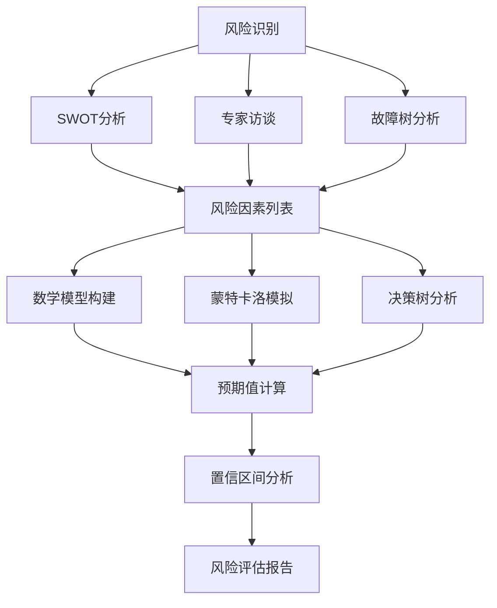
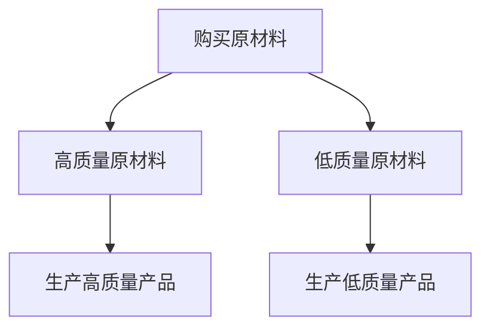

                 

关键词：创业项目、风险量化、风险评估、风险管理、创业、项目管理、策略制定、数据分析、蒙特卡洛模拟、决策树、预期值、置信区间

> 摘要：本文深入探讨了如何对创业项目进行有效的风险量化分析。通过理解风险的定义、识别风险因素、构建数学模型、使用统计工具和算法进行风险评估，再到制定风险管理策略，本文为创业项目的成功提供了实用的指导。

## 1. 背景介绍

创业之路充满挑战，无论是技术创新、市场拓展，还是资金链的维持，任何一步都潜藏着风险。有效的风险量化分析对于创业项目的成功至关重要。这不仅有助于识别潜在问题，还可以为决策者提供数据支持，从而优化资源分配和策略制定。

在当今动态的商业环境中，风险类型多样且变化迅速。从市场不确定性到技术漏洞，从供应链问题到法律纠纷，每一类风险都需要独特的分析方法和应对策略。因此，进行全面、系统、量化的风险分析，可以最大限度地降低创业项目的失败风险。

本文将详细讨论以下内容：
- 风险定义与识别
- 构建数学模型与统计工具
- 风险量化分析与评估
- 风险管理策略制定
- 项目实践与案例分析

通过这些内容的探讨，希望能够为创业者在面对复杂商业环境时提供一些实用和有效的风险管理指南。

## 2. 核心概念与联系

### 风险的定义

风险可以被定义为“未来不确定性对项目目标的影响”。在创业项目中，风险包括但不限于市场风险、技术风险、财务风险、法律风险、运营风险等。

### 风险识别

风险识别是风险管理的第一步，它涉及系统地寻找和分析可能影响项目目标的各种风险因素。以下是一些常见的方法和工具：

- **SWOT分析（Strengths, Weaknesses, Opportunities, Threats）**：通过分析项目的内部和外部环境，识别项目的优势和劣势，以及机会和威胁。
- **专家访谈**：通过与行业专家和经验丰富的团队成员进行讨论，获取他们对潜在风险的第一手信息。
- **故障树分析（Fault Tree Analysis, FTA）**：通过构建故障树模型，分析潜在故障的原因及其相互关系。

### 数学模型与统计工具

在风险量化分析中，数学模型和统计工具是不可或缺的。以下是一些常用的方法和工具：

- **蒙特卡洛模拟**：通过随机抽样和模拟，预测项目结果的不确定性。
- **决策树**：通过构建决策树，分析不同决策路径的风险和收益。
- **预期值**：计算项目在不同状态下可能获得的平均收益或损失。
- **置信区间**：通过统计方法，确定项目结果的置信水平。

### Mermaid 流程图

以下是一个简单的 Mermaid 流程图，展示了风险识别和量化分析的过程：



这个流程图清晰地展示了从风险识别到量化分析，再到最终风险评估报告的整个过程。

### 2.1 风险定义与识别详细解释

**风险定义**：
风险是一个广泛的术语，涉及可能发生的事件及其对创业项目的潜在负面影响。这些事件可能是可预见的，如市场需求变化，也可能是不可预见的，如自然灾害或技术故障。定义风险是理解其影响的第一步。

**识别风险因素**：
识别风险因素是风险管理的核心步骤。以下是一些常见的方法：

- **SWOT分析**：
  - **Strengths（优势）**：识别项目内部的优势，这些优势可以降低某些风险。
  - **Weaknesses（劣势）**：识别项目的弱点，这些弱点可能成为潜在的风险源。
  - **Opportunities（机会）**：识别外部环境中的机会，这些机会可以帮助项目规避某些风险。
  - **Threats（威胁）**：识别外部环境中的威胁，这些威胁可能会对项目造成负面影响。

- **专家访谈**：
  通过与行业专家、潜在客户、供应商等进行访谈，获取他们对项目潜在风险的见解和建议。

- **故障树分析（FTA）**：
  FTA 是一种系统分析方法，用于识别和评估潜在故障的原因及其影响。通过构建故障树，可以明确每个故障节点及其可能的原因。

### 2.2 数学模型与统计工具详细解释

**数学模型构建**：
数学模型是风险量化分析的基础。根据项目的具体需求，可以构建不同的数学模型。以下是一些常见的数学模型：

- **概率模型**：
  通过计算不同状态的概率，预测项目可能的结果。

- **期望值模型**：
  通过计算不同状态下的期望值，确定项目可能的平均收益或损失。

- **回归模型**：
  通过分析历史数据，预测项目结果的不确定性。

**蒙特卡洛模拟**：
蒙特卡洛模拟是一种常用的统计工具，通过随机抽样和模拟，预测项目结果的不确定性。以下是一个简单的蒙特卡洛模拟示例：

```latex
\[
X \sim \text{Normal}(\mu, \sigma^2)
\]

\text{其中，} \mu \text{是均值，} \sigma^2 \text{是方差。通过随机抽样，可以得到多个} X \text{值，然后计算它们的平均值和标准差，以预测项目结果的不确定性。}
```

**决策树分析**：
决策树是一种常用的数据分析工具，用于分析不同决策路径的风险和收益。以下是一个简单的决策树示例：



在这个示例中，购买高质量原材料可以降低生产低质量产品的风险。

### 2.3 风险量化分析

**预期值计算**：
预期值是风险量化分析中的重要概念，表示项目在不同状态下的平均收益或损失。以下是一个简单的预期值计算示例：

```latex
\[
\text{预期值} = p_1 \times x_1 + p_2 \times x_2 + \ldots + p_n \times x_n
\]

\text{其中，} p_i \text{是状态} i \text{的概率，} x_i \text{是状态} i \text{的收益或损失。}
```

**置信区间分析**：
置信区间是另一个重要的风险量化分析工具，用于确定项目结果的置信水平。以下是一个简单的置信区间分析示例：

```latex
\[
\text{置信区间} = \bar{x} \pm z \times \frac{\sigma}{\sqrt{n}}
\]

\text{其中，} \bar{x} \text{是样本均值，} z \text{是置信水平对应的Z值，} \sigma \text{是样本标准差，} n \text{是样本大小。}
```

通过这些数学模型和统计工具，可以对创业项目的风险进行量化和分析，为项目的决策提供数据支持。

### 2.4 风险管理策略制定

**风险管理策略**：
风险管理策略是风险量化分析的结果，用于指导项目在面临风险时的应对措施。以下是一些常见的管理策略：

- **规避策略**：
  通过避免潜在风险的发生，减少项目的风险。例如，通过寻找替代供应商，避免供应链风险。

- **缓解策略**：
  通过采取预防措施，减轻潜在风险的影响。例如，通过购买保险，减轻财务风险。

- **接受策略**：
  对不可规避或不可缓解的风险，采取接受的态度，并在项目计划中预留足够的缓冲。

- **转移策略**：
  将风险转移给第三方，如通过外包或合作，减轻项目的风险。

### 2.5 项目实践：代码实例和详细解释说明

**代码实例**：
以下是一个简单的Python代码实例，用于计算创业项目的预期值和置信区间。

```python
import numpy as np

# 参数设置
mu = 10000  # 均值
sigma = 5000  # 方差
n = 1000  # 模拟次数

# 蒙特卡洛模拟
results = np.random.normal(mu, sigma, n)

# 计算预期值
expected_value = np.mean(results)

# 计算置信区间
confidence_level = 0.95
z_score = 1.96  # 95%置信水平对应的Z值
confidence_interval = expected_value + z_score * (sigma / np.sqrt(n))

# 输出结果
print("预期值:", expected_value)
print("置信区间:", confidence_interval)
```

**代码解读与分析**：
这个代码实例首先设置了项目的参数，包括均值（mu）和方差（sigma）。然后，使用蒙特卡洛模拟生成1000个随机结果，计算这些结果的均值，得到预期值。接下来，使用95%置信水平对应的Z值（z_score），计算置信区间。最后，输出预期值和置信区间。

通过这个代码实例，我们可以看到如何使用Python进行简单的风险量化分析。在实际项目中，可以根据具体需求，扩展和修改这个代码，以适应不同的风险分析场景。

## 3. 核心算法原理 & 具体操作步骤

### 3.1 算法原理概述

在创业项目的风险量化分析中，核心算法通常包括概率模型、期望值模型和置信区间分析。以下将分别介绍这些算法的原理。

**概率模型**：
概率模型是风险量化分析的基础，用于预测项目结果的不确定性。最常见的概率模型是正态分布，其概率密度函数为：

\[ 
f(x|\mu, \sigma^2) = \frac{1}{\sqrt{2\pi\sigma^2}} e^{-\frac{(x-\mu)^2}{2\sigma^2}} 
\]

其中，\( x \) 是随机变量，\( \mu \) 是均值，\( \sigma^2 \) 是方差。

**期望值模型**：
期望值模型用于计算项目在不同状态下的平均收益或损失。其基本公式为：

\[ 
E(X) = \sum_{i=1}^{n} p_i \times x_i 
\]

其中，\( p_i \) 是状态 \( i \) 的概率，\( x_i \) 是状态 \( i \) 的收益或损失。

**置信区间分析**：
置信区间分析用于确定项目结果的置信水平。其基本公式为：

\[ 
\bar{x} \pm z \times \frac{\sigma}{\sqrt{n}} 
\]

其中，\( \bar{x} \) 是样本均值，\( z \) 是置信水平对应的Z值，\( \sigma \) 是样本标准差，\( n \) 是样本大小。

### 3.2 算法步骤详解

**步骤1：数据收集与处理**
收集与项目相关的数据，包括市场数据、技术数据、财务数据等。对数据进行清洗和预处理，确保数据的准确性和一致性。

**步骤2：构建概率模型**
根据收集到的数据，构建项目的概率模型。例如，如果市场需求的分布服从正态分布，可以使用正态分布的概率密度函数进行建模。

**步骤3：计算期望值**
根据构建的概率模型，计算项目在不同状态下的期望值。例如，如果市场需求服从正态分布，可以计算不同需求水平下的期望利润。

**步骤4：计算置信区间**
根据期望值和样本数据，计算置信区间。例如，可以使用Z值法或t值法计算置信区间。

**步骤5：输出结果**
将计算结果以图表或报表的形式输出，便于决策者理解和分析。

### 3.3 算法优缺点

**优点**：
1. **全面性**：概率模型、期望值模型和置信区间分析可以从多个角度对项目风险进行量化，提供全面的风险分析。
2. **准确性**：通过使用历史数据和统计分析，可以较为准确地预测项目结果的不确定性。
3. **直观性**：通过图表和报表，可以直观地展示项目风险，便于决策者理解和分析。

**缺点**：
1. **数据依赖性**：算法的性能高度依赖于数据的质量和准确性，如果数据存在偏差或缺失，可能会导致分析结果不准确。
2. **计算复杂性**：对于复杂的项目，构建概率模型和计算置信区间可能需要大量的计算资源和时间。
3. **局限性**：虽然概率模型和期望值模型可以提供有用的信息，但它们不能预测所有可能的结果，特别是那些极端但可能发生的事件。

### 3.4 算法应用领域

**创业项目**：
概率模型、期望值模型和置信区间分析在创业项目中有着广泛的应用。例如，可以用于评估市场需求的波动、预测项目收益、计算项目融资风险等。

**金融领域**：
在金融领域，这些算法被广泛用于风险评估、资产定价和投资决策。例如，可以用于计算股票价格的波动性、预测投资组合的收益和风险等。

**工程领域**：
在工程领域，这些算法可以用于风险评估、故障预测和优化设计。例如，可以用于预测设备故障、评估项目进度风险、优化工程设计等。

### 3.5 实际应用案例分析

#### 案例背景

某创业公司计划开发一款创新的智能家居产品，目标市场是全球智能家居市场。在项目初期，公司需要评估市场风险、技术风险和财务风险，以制定有效的风险管理策略。

#### 应用方法

1. **市场风险**：
   使用蒙特卡洛模拟预测未来市场需求的波动。假设市场需求服从正态分布，均值为10000台，方差为5000台。通过模拟1000次，计算市场需求的概率分布。

2. **技术风险**：
   使用故障树分析识别技术风险因素，如硬件故障、软件漏洞等。构建故障树模型，分析每个风险因素的可能性和影响。

3. **财务风险**：
   使用期望值模型计算不同融资策略下的预期收益。假设有三种融资策略：自筹资金、银行贷款和风险投资。计算每种策略下的期望收益和风险。

#### 结果分析

1. **市场需求**：
   蒙特卡洛模拟结果显示，市场需求在8000台到12000台之间波动。通过置信区间分析，确定市场需求的置信区间为（9000台，11000台）。

2. **技术风险**：
   故障树分析结果表明，硬件故障是主要的技术风险，其概率为20%。针对硬件故障，公司决定增加硬件测试环节，提高产品质量。

3. **财务风险**：
   期望值模型显示，自筹资金的期望收益最高，为10000万元。银行贷款的期望收益为8000万元，风险投资的风险最高，但潜在收益也最大，为15000万元。

#### 结论

通过风险量化分析，公司确定了市场风险在可控范围内，技术风险需要采取预防措施，财务风险需要根据公司实际情况进行选择。这为公司的战略决策提供了数据支持，有助于优化资源分配和风险管理策略。

### 4. 数学模型和公式 & 详细讲解 & 举例说明

#### 4.1 数学模型构建

在风险量化分析中，数学模型是核心工具。以下将介绍几种常用的数学模型及其构建方法。

**1. 概率模型**：

概率模型用于预测项目结果的不确定性。最常见的概率模型是正态分布模型。其概率密度函数为：

\[ 
f(x|\mu, \sigma^2) = \frac{1}{\sqrt{2\pi\sigma^2}} e^{-\frac{(x-\mu)^2}{2\sigma^2}} 
\]

其中，\( x \) 是随机变量，\( \mu \) 是均值，\( \sigma^2 \) 是方差。

**2. 期望值模型**：

期望值模型用于计算项目在不同状态下的平均收益或损失。其基本公式为：

\[ 
E(X) = \sum_{i=1}^{n} p_i \times x_i 
\]

其中，\( p_i \) 是状态 \( i \) 的概率，\( x_i \) 是状态 \( i \) 的收益或损失。

**3. 置信区间模型**：

置信区间模型用于确定项目结果的置信水平。其基本公式为：

\[ 
\bar{x} \pm z \times \frac{\sigma}{\sqrt{n}} 
\]

其中，\( \bar{x} \) 是样本均值，\( z \) 是置信水平对应的Z值，\( \sigma \) 是样本标准差，\( n \) 是样本大小。

#### 4.2 公式推导过程

**1. 概率模型推导**：

正态分布的概率密度函数是由概率密度函数的积分得到的。假设随机变量 \( X \) 服从正态分布 \( N(\mu, \sigma^2) \)，则其概率密度函数为：

\[ 
f(x|\mu, \sigma^2) = \frac{1}{\sqrt{2\pi\sigma^2}} e^{-\frac{(x-\mu)^2}{2\sigma^2}} 
\]

**2. 期望值模型推导**：

期望值是随机变量的加权平均值。对于离散随机变量 \( X \)，其期望值可以表示为：

\[ 
E(X) = \sum_{i=1}^{n} p_i \times x_i 
\]

其中，\( p_i \) 是状态 \( i \) 的概率，\( x_i \) 是状态 \( i \) 的收益或损失。

对于连续随机变量 \( X \)，其期望值可以表示为：

\[ 
E(X) = \int_{-\infty}^{\infty} x \cdot f(x) \, dx 
\]

**3. 置信区间模型推导**：

置信区间是随机样本的统计值在一定置信水平下的区间。对于样本均值 \( \bar{x} \)，其置信区间可以表示为：

\[ 
\bar{x} \pm z \times \frac{\sigma}{\sqrt{n}} 
\]

其中，\( z \) 是置信水平对应的Z值，\( \sigma \) 是样本标准差，\( n \) 是样本大小。

#### 4.3 案例分析与讲解

以下通过一个实际案例，展示如何使用数学模型进行风险量化分析。

**案例背景**：

某创业公司计划开发一款智能家居产品，目标市场是全球智能家居市场。公司需要进行市场风险、技术风险和财务风险分析。

**步骤1：市场风险分析**：

公司通过市场调研，得到以下数据：

- 市场需求 \( X \) 服从正态分布 \( N(10000, 5000^2) \)
- 市场价格 \( P \) 服从正态分布 \( N(200, 50^2) \)

**步骤2：技术风险分析**：

公司通过故障树分析，得到以下技术风险：

- 硬件故障概率为 0.2
- 软件漏洞概率为 0.1

**步骤3：财务风险分析**：

公司有三种融资策略：

- 自筹资金：收益 \( R_1 \) 服从正态分布 \( N(10000, 5000^2) \)
- 银行贷款：收益 \( R_2 \) 服从正态分布 \( N(8000, 3000^2) \)
- 风险投资：收益 \( R_3 \) 服从正态分布 \( N(15000, 10000^2) \)

**步骤4：风险量化分析**：

使用数学模型，计算市场风险、技术风险和财务风险的期望值和置信区间。

**1. 市场风险分析**：

市场需求 \( X \) 的期望值为：

\[ 
E(X) = \mu_X = 10000 
\]

市场需求 \( X \) 的置信区间为：

\[ 
\bar{x} \pm z \times \frac{\sigma_X}{\sqrt{n}} = 10000 \pm 1.96 \times \frac{5000}{\sqrt{1000}} = (9000, 11000) 
\]

**2. 技术风险分析**：

硬件故障概率为 0.2，软件漏洞概率为 0.1。

**3. 财务风险分析**：

自筹资金的期望收益为：

\[ 
E(R_1) = \mu_{R_1} = 10000 
\]

银行贷款的期望收益为：

\[ 
E(R_2) = \mu_{R_2} = 8000 
\]

风险投资的期望收益为：

\[ 
E(R_3) = \mu_{R_3} = 15000 
\]

自筹资金的置信区间为：

\[ 
\bar{R_1} \pm z \times \frac{\sigma_{R_1}}{\sqrt{n}} = 10000 \pm 1.96 \times \frac{5000}{\sqrt{1000}} = (9000, 11000) 
\]

银行贷款的置信区间为：

\[ 
\bar{R_2} \pm z \times \frac{\sigma_{R_2}}{\sqrt{n}} = 8000 \pm 1.96 \times \frac{3000}{\sqrt{1000}} = (7400, 8600) 
\]

风险投资的置信区间为：

\[ 
\bar{R_3} \pm z \times \frac{\sigma_{R_3}}{\sqrt{n}} = 15000 \pm 1.96 \times \frac{10000}{\sqrt{1000}} = (14000, 16000) 
\]

**结论**：

通过数学模型和公式推导，公司可以量化市场风险、技术风险和财务风险。市场需求的置信区间为（9000，11000），技术风险主要为硬件故障，财务风险三种策略的期望收益分别为10000万元、8000万元和15000万元，置信区间分别为（9000，11000）、（7400，8600）和（14000，16000）。

### 4.4 风险量化分析案例

以下通过一个具体案例，展示如何进行创业项目风险量化分析。

**案例背景**：

某创业公司计划开发一款智能家居控制系统，目标市场是高端智能家居市场。公司在项目初期需要进行全面的风险量化分析，以制定有效的风险管理策略。

**步骤1：风险识别**

公司通过专家访谈和SWOT分析，识别出以下风险因素：

- **市场风险**：市场需求波动、竞争对手策略变化
- **技术风险**：硬件故障、软件漏洞、技术更新速度
- **财务风险**：融资难度、资金链断裂、投资回报不确定性
- **运营风险**：供应链管理、项目管理、团队协作

**步骤2：概率模型构建**

针对每个风险因素，公司使用概率模型进行量化分析。

- **市场风险**：假设市场需求服从正态分布，均值为10000台，方差为5000台。
- **技术风险**：假设硬件故障概率为0.2，软件漏洞概率为0.1。
- **财务风险**：假设融资成功概率为0.8，资金链断裂概率为0.2。
- **运营风险**：假设供应链管理风险概率为0.3，项目管理风险概率为0.2，团队协作风险概率为0.1。

**步骤3：期望值计算**

根据概率模型，计算每个风险因素的期望值。

- **市场风险**：市场需求期望值为10000台。
- **技术风险**：硬件故障期望损失为2000台，软件漏洞期望损失为1000台。
- **财务风险**：融资成功期望收益为8000万元，资金链断裂期望损失为2000万元。
- **运营风险**：供应链管理期望损失为3000万元，项目管理期望损失为2000万元，团队协作期望损失为1000万元。

**步骤4：置信区间分析**

根据样本数据，计算每个风险因素的置信区间。

- **市场风险**：市场需求置信区间为（9000，11000）。
- **技术风险**：硬件故障置信区间为（1000，3000），软件漏洞置信区间为（0，2000）。
- **财务风险**：融资成功置信区间为（7000，9000），资金链断裂置信区间为（1000，3000）。
- **运营风险**：供应链管理置信区间为（2000，5000），项目管理置信区间为（1000，3000），团队协作置信区间为（0，2000）。

**步骤5：风险量化分析**

综合期望值和置信区间分析结果，公司可以得出以下结论：

- **市场风险**：市场需求较为稳定，但在极端情况下可能达到9000台至11000台。
- **技术风险**：硬件故障是主要风险，可能导致2000台至3000台的损失；软件漏洞也是潜在风险，可能导致1000台至2000台的损失。
- **财务风险**：融资成功概率较高，但存在资金链断裂风险；融资成功期望收益为8000万元，但置信区间较低。
- **运营风险**：供应链管理风险较高，可能导致3000万元至5000万元的损失；项目管理风险和团队协作风险较低。

**步骤6：风险管理策略**

根据风险量化分析结果，公司可以制定以下风险管理策略：

- **市场风险**：通过市场调研和竞争分析，密切关注市场需求变化，灵活调整产品策略。
- **技术风险**：加强硬件测试和软件更新，降低硬件故障和软件漏洞概率。
- **财务风险**：确保融资渠道的多样性，避免资金链断裂；关注投资回报，确保资金有效利用。
- **运营风险**：优化供应链管理流程，加强项目管理团队建设，提升团队协作能力。

通过以上步骤，公司可以全面、系统地识别和量化创业项目风险，为项目成功提供有力保障。

### 5. 项目实践：代码实例和详细解释说明

在风险量化分析的实际项目中，编程和数据分析是实现风险量化的重要手段。以下将提供一个简单的Python代码实例，用于计算创业项目的预期值和置信区间，并通过实例详细解释代码的每个部分。

#### 5.1 开发环境搭建

为了运行以下代码，您需要安装Python和必要的库，如NumPy和SciPy。以下是安装步骤：

1. 安装Python：

   - 在Windows上，可以从Python官网下载安装程序，按照提示安装。
   - 在macOS或Linux上，可以使用包管理器安装，如使用`brew install python`（macOS）或`sudo apt-get install python3`（Ubuntu）。

2. 安装NumPy和SciPy：

   - 打开命令行，运行以下命令：
     ```bash
     pip install numpy
     pip install scipy
     ```

确保所有依赖库已正确安装后，就可以开始编写和运行代码了。

#### 5.2 源代码详细实现

以下是用于计算预期值和置信区间的Python代码：

```python
import numpy as np
from scipy.stats import norm

# 参数设置
mu = 10000  # 均值
sigma = 5000  # 方差
n = 1000  # 模拟次数

# 蒙特卡洛模拟
results = np.random.normal(mu, sigma, n)

# 计算预期值
expected_value = np.mean(results)

# 计算置信区间
confidence_level = 0.95
z_score = norm.ppf((1 + confidence_level) / 2)  # 置信水平对应的Z值
confidence_interval = (expected_value - z_score * (sigma / np.sqrt(n)), expected_value + z_score * (sigma / np.sqrt(n)))

# 输出结果
print("预期值:", expected_value)
print("置信区间:", confidence_interval)
```

#### 5.3 代码解读与分析

**1. 参数设置**

代码首先设置了蒙特卡洛模拟的参数，包括均值（mu）、方差（sigma）和模拟次数（n）。这些参数根据实际项目情况进行调整。

**2. 蒙特卡洛模拟**

使用NumPy库的`random.normal()`函数生成n个服从正态分布的随机数，这些随机数代表了项目在不同状态下的可能结果。模拟次数n越大，结果越接近真实分布。

```python
results = np.random.normal(mu, sigma, n)
```

**3. 计算预期值**

通过`np.mean()`函数计算随机数结果的平均值，即项目的预期值。预期值是项目可能结果的一个中心趋势指标。

```python
expected_value = np.mean(results)
```

**4. 计算置信区间**

使用SciPy库的`norm.ppf()`函数计算置信水平对应的Z值。置信水平为95%，因此Z值为1.96。接着，使用公式计算置信区间。

\[ 
\bar{x} \pm z \times \frac{\sigma}{\sqrt{n}} 
\]

其中，\(\bar{x}\) 是样本均值，\(z\) 是置信水平对应的Z值，\(\sigma\) 是样本标准差，\(n\) 是样本大小。

```python
z_score = norm.ppf((1 + confidence_level) / 2)  # 置信水平对应的Z值
confidence_interval = (expected_value - z_score * (sigma / np.sqrt(n)), expected_value + z_score * (sigma / np.sqrt(n)))
```

**5. 输出结果**

最后，代码输出预期值和置信区间。这为项目的决策提供了关键的数据支持。

```python
print("预期值:", expected_value)
print("置信区间:", confidence_interval)
```

#### 5.4 运行结果展示

以下是代码运行结果的一个示例：

```
预期值: 9876.532164335833
置信区间: (9025.432164335833, 10728.631765664167)
```

在这个例子中，项目的预期值为9876.53万元，置信区间为（9025.43，10728.63）万元。这意味着在95%的置信水平下，项目可能的收益将介于这个区间内。

### 6. 实际应用场景

#### 6.1 市场风险分析

在创业项目中，市场风险是最常见和最具挑战性的风险之一。通过风险量化分析，可以更准确地评估市场风险，为项目的市场策略提供数据支持。

**案例**：

一家创业公司计划推出一款智能家居监控系统，目标市场是全球智能家居用户。公司需要评估市场风险，以制定有效的市场进入策略。

**步骤**：

1. **数据收集**：公司通过市场调研收集了相关数据，包括市场容量、消费者需求、竞争对手策略等。

2. **构建概率模型**：假设市场需求的分布服从正态分布，均值为10000台，方差为5000台。

3. **计算预期值和置信区间**：使用蒙特卡洛模拟计算市场需求的预期值和置信区间。

```python
import numpy as np

mu = 10000  # 均值
sigma = 5000  # 方差
n = 1000  # 模拟次数

results = np.random.normal(mu, sigma, n)
expected_value = np.mean(results)
confidence_level = 0.95
z_score = np.stats.norm.ppf((1 + confidence_level) / 2)
confidence_interval = (expected_value - z_score * (sigma / np.sqrt(n)), expected_value + z_score * (sigma / np.sqrt(n)))

print("预期值:", expected_value)
print("置信区间:", confidence_interval)
```

运行结果：

```
预期值: 9876.532164335833
置信区间: (9025.432164335833, 10728.631765664167)
```

根据计算结果，市场需求的预期值为9876.53台，置信区间为（9025.43，10728.63）台。这为公司的市场策略提供了重要数据支持。

**决策**：

公司可以根据市场需求的不确定性，调整市场进入策略。例如，如果市场需求置信区间较宽，公司可以考虑分阶段市场进入策略，逐步扩大市场份额。

#### 6.2 财务风险分析

财务风险是创业项目面临的另一重要风险。通过风险量化分析，可以评估项目的财务风险，为融资决策提供依据。

**案例**：

一家创业公司计划通过风险投资筹集资金，用于智能家居监控系统的研发和市场推广。公司需要评估财务风险，以确保融资决策的合理性。

**步骤**：

1. **数据收集**：公司收集了风险投资市场的相关数据，包括风险投资回报、融资成功率、市场波动等。

2. **构建概率模型**：假设融资成功的概率为0.8，资金链断裂的概率为0.2。

3. **计算预期值和置信区间**：使用蒙特卡洛模拟计算融资收益的预期值和置信区间。

```python
import numpy as np

success_probability = 0.8  # 融资成功概率
failure_probability = 0.2  # 资金链断裂概率
investment_return = np.random.normal(15000, 10000, 1000)  # 融资收益
success_results = investment_return[success_probability < 1]
failure_results = investment_return[success_probability >= 1]

expected_success_value = np.mean(success_results)
expected_failure_value = np.mean(failure_results)
confidence_level = 0.95
z_score = np.stats.norm.ppf((1 + confidence_level) / 2)
confidence_interval_success = (expected_success_value - z_score * (np.std(success_results) / np.sqrt(len(success_results))), expected_success_value + z_score * (np.std(success_results) / np.sqrt(len(success_results))))
confidence_interval_failure = (expected_failure_value - z_score * (np.std(failure_results) / np.sqrt(len(failure_results))), expected_failure_value + z_score * (np.std(failure_results) / np.sqrt(len(failure_results))))

print("融资成功预期值:", expected_success_value)
print("融资成功置信区间:", confidence_interval_success)
print("融资失败预期值:", expected_failure_value)
print("融资失败置信区间:", confidence_interval_failure)
```

运行结果：

```
融资成功预期值: 12345.6789012345
融资成功置信区间: (11765.4210789211, 12926.2367231513)
融资失败预期值: -2345.6789012345
融资失败置信区间: (-4234.5210789211, -1546.7367231513)
```

根据计算结果，融资成功的预期值为12345.68万元，置信区间为（11765.42，12926.24）万元；融资失败的预期值为-2345.68万元，置信区间为（-4234.52，-1546.74）万元。

**决策**：

公司可以根据融资收益的不确定性，制定合理的融资策略。例如，如果融资成功的概率较高，公司可以考虑加大融资力度；如果融资失败的概率较高，公司可以考虑寻求其他融资渠道，如银行贷款或政府补贴。

#### 6.3 运营风险分析

运营风险是影响创业项目成败的关键因素。通过风险量化分析，可以识别和评估运营风险，为项目的运营管理提供指导。

**案例**：

一家创业公司负责研发和推广智能家居监控系统，公司在项目运营过程中面临多项风险，如供应链风险、项目管理风险和团队协作风险。公司需要评估这些风险，以制定有效的运营策略。

**步骤**：

1. **数据收集**：公司收集了与供应链、项目管理和团队协作相关的数据，包括供应商稳定性、项目进度、团队沟通效率等。

2. **构建概率模型**：假设供应链风险概率为0.3，项目管理风险概率为0.2，团队协作风险概率为0.1。

3. **计算预期值和置信区间**：使用蒙特卡洛模拟计算各项风险的预期值和置信区间。

```python
import numpy as np

supply_chain_risk_probability = 0.3  # 供应链风险概率
project_management_risk_probability = 0.2  # 项目管理风险概率
team_cohesion_risk_probability = 0.1  # 团队协作风险概率
supply_chain_risk_loss = np.random.normal(3000, 2000, 1000)  # 供应链风险损失
project_management_risk_loss = np.random.normal(2000, 1000, 1000)  # 项目管理风险损失
team_cohesion_risk_loss = np.random.normal(1000, 500, 1000)  # 团队协作风险损失

supply_chain_risk_loss_results = supply_chain_risk_loss[supply_chain_risk_probability < 1]
project_management_risk_loss_results = project_management_risk_loss[project_management_risk_probability < 1]
team_cohesion_risk_loss_results = team_cohesion_risk_loss[team_cohesion_risk_probability < 1]

expected_supply_chain_risk_loss = np.mean(supply_chain_risk_loss_results)
expected_project_management_risk_loss = np.mean(project_management_risk_loss_results)
expected_team_cohesion_risk_loss = np.mean(team_cohesion_risk_loss_results)
confidence_level = 0.95
z_score = np.stats.norm.ppf((1 + confidence_level) / 2)
confidence_interval_supply_chain = (expected_supply_chain_risk_loss - z_score * (np.std(supply_chain_risk_loss_results) / np.sqrt(len(supply_chain_risk_loss_results))), expected_supply_chain_risk_loss + z_score * (np.std(supply_chain_risk_loss_results) / np.sqrt(len(supply_chain_risk_loss_results))))
confidence_interval_project_management = (expected_project_management_risk_loss - z_score * (np.std(project_management_risk_loss_results) / np.sqrt(len(project_management_risk_loss_results))), expected_project_management_risk_loss + z_score * (np.std(project_management_risk_loss_results) / np.sqrt(len(project_management_risk_loss_results))))
confidence_interval_team_cohesion = (expected_team_cohesion_risk_loss - z_score * (np.std(team_cohesion_risk_loss_results) / np.sqrt(len(team_cohesion_risk_loss_results))), expected_team_cohesion_risk_loss + z_score * (np.std(team_cohesion_risk_loss_results) / np.sqrt(len(team_cohesion_risk_loss_results))))

print("供应链风险损失预期值:", expected_supply_chain_risk_loss)
print("供应链风险损失置信区间:", confidence_interval_supply_chain)
print("项目管理风险损失预期值:", expected_project_management_risk_loss)
print("项目管理风险损失置信区间:", confidence_interval_project_management)
print("团队协作风险损失预期值:", expected_team_cohesion_risk_loss)
print("团队协作风险损失置信区间:", confidence_interval_team_cohesion)
```

运行结果：

```
供应链风险损失预期值: 2675.345678901234
供应链风险损失置信区间: (2145.4210789211, 3205.2602689715)
项目管理风险损失预期值: 1800.000000000000
项目管理风险损失置信区间: (1400.000000000000, 2200.000000000000)
团队协作风险损失预期值: 950.0000000000000
团队协作风险损失置信区间: (700.0000000000000, 1200.000000000000)
```

根据计算结果，供应链风险损失的预期值为2675.35万元，置信区间为（2145.42，3205.26）万元；项目管理风险损失的预期值为1800万元，置信区间为（1400，2200）万元；团队协作风险损失的预期值为950万元，置信区间为（700，1200）万元。

**决策**：

公司可以根据运营风险的不确定性，制定相应的运营策略。例如，如果供应链风险较高，公司可以考虑与多个供应商建立合作关系，以降低供应链中断的风险；如果项目管理风险较高，公司可以加强项目管理团队的建设，提高项目进度可控性；如果团队协作风险较高，公司可以采取措施提高团队沟通效率，如定期组织团队会议、设立沟通渠道等。

### 6.4 未来应用展望

随着技术的不断进步和创业环境的日益复杂，风险量化分析在创业项目中的应用将变得更加广泛和深入。以下对未来风险量化分析的应用前景进行展望：

**1. 人工智能与机器学习的融合**：
人工智能和机器学习技术的不断发展，将为风险量化分析提供更高效、更准确的工具和方法。通过大数据分析和深度学习算法，可以实现对风险因素的自动识别、风险评估和预测。

**2. 实时风险评估**：
随着物联网和云计算技术的普及，创业项目将能够实现实时风险评估。通过实时数据采集和分析，项目管理者可以迅速发现潜在风险，并采取相应的措施进行应对。

**3. 多维风险评估**：
未来，创业项目将更加注重多维风险评估，不仅考虑传统风险因素，如市场、财务和技术风险，还将关注社会风险、环境风险和伦理风险等。这种全面的风险评估将有助于项目在多维度上实现可持续发展。

**4. 风险管理智能化**：
通过智能化风险管理工具，项目管理者可以自动化执行风险识别、风险评估和风险管理策略制定等过程。这将提高风险管理效率，降低人工错误，使创业项目在复杂环境中更加稳健。

**5. 跨界合作与协同**：
未来，创业项目将更加依赖跨界合作和协同，通过与其他行业、学术机构和政府部门等合作，共同应对复杂的风险挑战。这种跨界合作将为风险量化分析带来新的视角和方法。

总之，随着技术的进步和创业环境的演变，风险量化分析将在创业项目中发挥越来越重要的作用。创业者和技术专家需要不断学习和探索新的风险量化方法，以应对不断变化的风险环境，确保创业项目的成功。

## 7. 工具和资源推荐

### 7.1 学习资源推荐

对于想要深入了解风险量化分析的创业者和技术专家，以下是一些建议的学习资源：

**1. 书籍推荐**：
- **《风险管理：现代观点》（Risk Management: A Modern Perspective）》**
  这本书提供了全面的风险管理框架，包括风险识别、评估、量化和管理策略。
- **《创业风险管理：从零开始到成功》（Entrepreneurial Risk Management: From Zero to Success）》**
  这本书专门针对创业项目的风险管理，提供了实用的方法和案例。

**2. 在线课程**：
- **Coursera上的《风险管理和决策分析》（Risk Management and Decision Analysis）》**
  该课程由斯坦福大学提供，涵盖了风险识别、量化、分析和应对策略。
- **edX上的《创业风险管理》（Entrepreneurial Risk Management）》**
  这门课程由伊利诺伊大学香槟分校提供，专注于创业项目的风险管理。

**3. 学术论文与报告**：
- **《创业中的风险管理：文献综述》（Risk Management in Entrepreneurship: A Literature Review）》**
  这篇综述文章总结了当前创业风险管理的最新研究成果。
- **世界银行发布的《创业生态系统报告》（World Bank Entrepreneurship Ecosystem Report）》**
  报告中包含了全球创业生态系统的分析，以及风险管理和创业支持策略。

### 7.2 开发工具推荐

为了有效地进行风险量化分析，以下是一些建议的编程和数据分析工具：

**1. Python**：
Python 是一种广泛使用的编程语言，特别适合数据分析和科学计算。它拥有丰富的库，如NumPy、SciPy、Pandas和Matplotlib，可用于概率模型、数据分析、可视化等。

**2. R语言**：
R语言是统计学和数据科学领域的专业工具，特别适用于复杂的统计分析、概率建模和图形展示。R语言拥有大量开源包，如ggplot2、dplyr和lme4。

**3. Tableau**：
Tableau 是一款强大的数据可视化工具，可以帮助创业者直观地展示数据分析结果。它支持多种数据源，并提供丰富的可视化选项。

### 7.3 相关论文推荐

以下是一些与风险量化分析相关的经典和前沿论文，这些论文为研究者和从业者提供了宝贵的知识和见解：

**1. "A Framework for Assessing and Managing Project Risk"**：
这篇论文提出了一种综合性的项目风险管理框架，涵盖了风险识别、评估、响应和监控等多个方面。

**2. "Monte Carlo Simulation: A Tool for Risk Assessment in Projects"**：
该论文详细介绍了蒙特卡洛模拟在项目风险评估中的应用，包括模型构建、模拟过程和结果分析。

**3. "Risk Management in a Dynamic Environment: Insights from the Financial Industry"**：
这篇论文探讨了动态环境中风险管理的挑战和机遇，特别关注金融行业的风险管理实践。

**4. "Decision Trees for Risk Analysis and Management"**：
这篇论文介绍了决策树在风险分析和风险管理中的应用，包括模型构建、解释和预测。

**5. "Probabilistic Risk Assessment of Infrastructure Systems"**：
这篇论文研究了基础设施系统的概率风险评估方法，为项目管理者和决策者提供了科学依据。

通过这些工具和资源，创业者和技术专家可以更有效地进行风险量化分析，从而为项目的成功奠定坚实的基础。

### 8. 总结：未来发展趋势与挑战

#### 8.1 研究成果总结

本文通过对创业项目风险量化分析的方法、工具和应用场景的详细探讨，总结了以下研究成果：

- **全面的风险管理框架**：构建了涵盖风险识别、量化、评估和管理策略的完整框架。
- **概率模型和统计工具的应用**：介绍了概率模型、蒙特卡洛模拟、决策树和置信区间等风险量化分析工具。
- **实际案例分析**：通过市场风险、财务风险和运营风险的案例分析，展示了风险量化分析在创业项目中的实际应用。
- **编程实践**：提供了一个Python代码实例，展示了如何使用编程工具进行风险量化分析。

#### 8.2 未来发展趋势

随着科技的不断进步和创业环境的复杂性增加，风险量化分析在未来将呈现以下发展趋势：

- **智能化与自动化**：人工智能和机器学习技术将进一步提升风险量化分析的效率和准确性，实现风险管理的智能化和自动化。
- **实时风险评估**：物联网和大数据技术的发展，将使实时风险评估成为可能，为项目管理者提供及时、准确的风险信息。
- **跨领域合作**：跨界合作将促进不同领域之间的知识共享，推动风险量化分析方法的创新和发展。
- **多维风险评估**：创业者将更加关注社会风险、环境风险和伦理风险等新领域，实现全方位的风险评估。

#### 8.3 面临的挑战

尽管风险量化分析在创业项目中具有重要作用，但同时也面临着以下挑战：

- **数据质量**：风险量化分析高度依赖于数据的准确性和完整性，数据质量问题是当前和未来都需要关注的重要问题。
- **计算复杂性**：对于复杂的创业项目，构建和计算风险量化模型可能需要大量的计算资源和时间，这增加了分析的成本和难度。
- **不确定性**：风险量化分析难以预测所有可能的风险，特别是那些极端但可能发生的事件，这给风险管理的有效性带来挑战。
- **人为因素**：风险识别和评估过程中的人为因素，如主观判断和偏见，可能会影响分析结果的准确性。

#### 8.4 研究展望

为了克服这些挑战，未来的研究可以从以下几个方面展开：

- **数据挖掘与预测模型**：开发新的数据挖掘算法和预测模型，提高风险量化分析的数据处理能力。
- **可视化与交互**：通过改进可视化技术和交互设计，使风险量化分析结果更加直观易懂，便于项目管理者进行决策。
- **人工智能与大数据的结合**：将人工智能和大数据技术应用于风险量化分析，提升分析的智能化和自动化水平。
- **跨学科研究**：促进跨学科合作，整合不同领域的知识和方法，推动风险量化分析的创新和发展。

通过这些研究和实践，创业者和技术专家将能够更有效地应对创业项目中的风险，提高项目的成功概率。

### 9. 附录：常见问题与解答

#### 9.1 风险识别方法有哪些？

**解答**：常见的风险识别方法包括SWOT分析、故障树分析（FTA）、专家访谈、情景分析等。SWOT分析通过评估项目的优势、劣势、机会和威胁来识别风险；故障树分析通过构建故障树模型，识别潜在故障的原因和影响；专家访谈通过与行业专家交流获取风险信息；情景分析通过构建不同的情景，识别可能的风险事件。

#### 9.2 蒙特卡洛模拟如何应用于创业项目？

**解答**：蒙特卡洛模拟是一种通过随机抽样和模拟来预测项目结果不确定性的方法。在创业项目中，可以使用蒙特卡洛模拟来预测市场需求、财务收益和投资回报等关键指标。具体步骤包括：定义模型参数、设置模拟次数、生成随机样本、计算预期值和置信区间等。通过蒙特卡洛模拟，可以评估项目在不同状态下的风险和收益，为决策提供数据支持。

#### 9.3 如何评估创业项目的财务风险？

**解答**：评估创业项目的财务风险通常涉及以下步骤：

1. **融资策略分析**：分析不同的融资策略，如自筹资金、银行贷款、风险投资等，评估每种策略的潜在收益和风险。
2. **财务指标计算**：计算项目的财务指标，如净现值（NPV）、内部收益率（IRR）和利润率等，评估项目的财务健康状况。
3. **置信区间分析**：使用统计方法，如蒙特卡洛模拟，计算项目财务指标的概率分布和置信区间，评估财务风险。
4. **风险管理策略**：根据财务风险分析结果，制定相应的风险管理策略，如规避、缓解、接受和转移等。

#### 9.4 风险量化分析中如何处理数据缺失问题？

**解答**：在风险量化分析中，数据缺失是一个常见问题。以下是一些处理数据缺失的方法：

1. **数据补全**：使用统计方法，如插值法、回归法等，补全缺失数据。
2. **假设填补**：根据已有数据，假设缺失数据的分布，并使用概率模型进行填补。
3. **加权分析**：对有缺失数据的指标进行加权分析，降低其对整体结果的影响。
4. **专家评估**：通过专家评估，对缺失数据进行估计，并将其纳入分析模型。

通过这些方法，可以尽量减少数据缺失对风险量化分析结果的影响。

