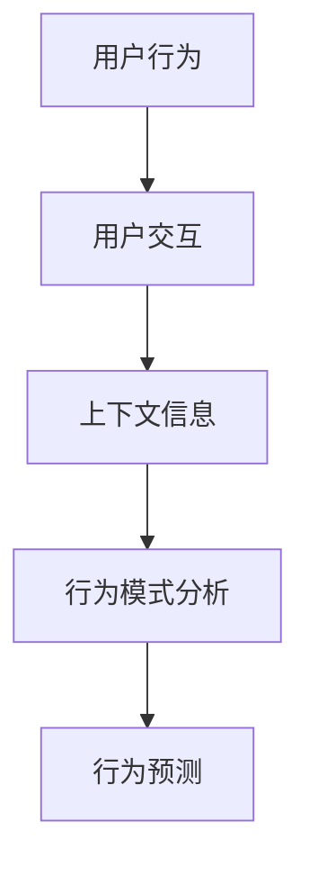
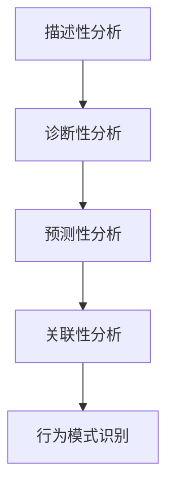
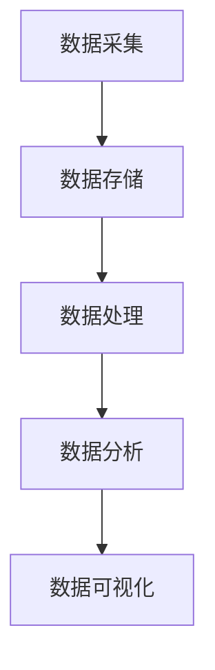
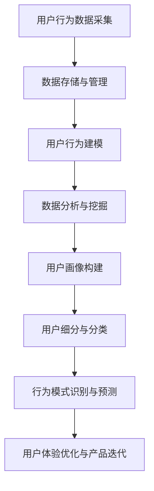

                 

 在数字化时代，用户行为分析（User Behavior Analysis，简称UBA）已经成为企业和组织提高用户体验、优化业务流程、预测市场趋势的重要手段。有效的用户行为分析不仅可以帮助企业更好地理解其用户，还能指导产品迭代、提升营销策略、增强客户忠诚度。本文将探讨如何进行有效的用户行为分析，并提供一系列实用的方法和技巧。

## 文章关键词

- 用户行为分析
- 用户体验
- 业务优化
- 数据分析
- 人工智能

## 文章摘要

本文旨在为IT专业人士和企业管理者提供一套系统的用户行为分析方法论。文章首先介绍了用户行为分析的定义、背景和重要性，然后详细探讨了核心概念和联系，包括用户行为模型、数据分析方法和技术架构。接下来，文章将深入讲解用户行为分析的核心算法原理，并提供具体的数学模型和公式。随后，文章通过实际项目实践展示如何将理论知识应用于实际场景，并分析用户行为分析在实际应用中的效果。最后，文章展望了用户行为分析的未来发展趋势和面临的挑战，并提供了一系列的学习资源和开发工具推荐。

## 1. 背景介绍

用户行为分析（UBA）起源于计算机科学和统计学，随着互联网和大数据技术的发展，其在商业领域的应用日益广泛。传统的用户行为分析主要依赖于日志文件和用户交互数据，而随着人工智能、机器学习等技术的进步，用户行为分析开始从简单的数据统计转变为深度学习和模式识别的高级应用。

用户行为分析的重要性体现在多个方面。首先，通过对用户行为数据的分析，企业可以更好地了解用户需求，优化产品设计和服务。其次，用户行为分析可以帮助企业识别潜在问题和风险，预防欺诈和违规行为。此外，用户行为分析还能为企业提供精准营销和个性化推荐的基础，提高用户满意度和忠诚度。

随着技术的不断进步，用户行为分析的方法和技术也在不断创新和演进。本文将结合最新的技术和实践，介绍如何进行有效的用户行为分析。

### 1.1 用户行为分析的发展历程

用户行为分析的发展历程可以追溯到20世纪80年代，当时互联网刚刚兴起，用户交互数据开始被记录和分析。早期的用户行为分析主要依赖于日志文件，通过统计用户访问网站的次数、停留时间、点击行为等指标，帮助企业了解用户行为模式。

随着数据挖掘和机器学习技术的发展，用户行为分析逐渐从简单的统计方法转向更为复杂和高级的算法。20世纪90年代，关联规则学习和聚类分析等方法被广泛应用于用户行为分析，这些方法能够从大量数据中挖掘出隐藏的用户行为模式和关系。

进入21世纪，随着互联网和移动设备的普及，用户行为数据的规模和种类迅速增加。大数据技术和人工智能的兴起，使得用户行为分析进入了一个全新的阶段。深度学习、强化学习和图神经网络等算法的引入，使得用户行为分析能够从海量数据中提取更为复杂和精细的信息。

### 1.2 用户行为分析在商业领域的应用

在商业领域，用户行为分析的应用场景非常广泛。以下是一些典型的应用案例：

1. **市场调研**：通过分析用户行为数据，企业可以了解市场趋势和用户偏好，从而制定更加精准的市场策略。

2. **产品优化**：用户行为分析可以帮助企业识别产品中的问题，优化用户体验，提升产品竞争力。

3. **用户细分**：通过对用户行为数据的分析，企业可以将用户划分为不同的细分群体，从而实施更加个性化的营销策略。

4. **客户关系管理**：用户行为分析可以帮助企业更好地了解客户需求，提升客户满意度和忠诚度。

5. **欺诈检测**：通过分析异常行为模式，企业可以及时发现和预防欺诈行为，保护企业利益。

6. **营销优化**：用户行为分析可以为营销活动提供数据支持，优化广告投放和促销策略，提高营销效果。

### 1.3 用户行为分析的重要性

用户行为分析的重要性主要体现在以下几个方面：

1. **用户洞察**：通过分析用户行为数据，企业可以深入了解用户需求和行为模式，从而更好地满足用户需求。

2. **业务优化**：用户行为分析可以帮助企业识别业务流程中的瓶颈和问题，优化业务流程，提高运营效率。

3. **决策支持**：用户行为分析提供的数据和分析结果，可以帮助企业做出更加科学和准确的业务决策。

4. **用户体验提升**：通过分析用户行为数据，企业可以优化产品设计和服务，提升用户体验，增强用户满意度。

5. **竞争优势**：在竞争激烈的市场中，用户行为分析可以帮助企业获取竞争优势，提高市场占有率。

## 2. 核心概念与联系

### 2.1 用户行为模型

用户行为模型是用户行为分析的基础，它描述了用户在系统或产品中的行为模式。一个典型的用户行为模型包括以下要素：

1. **用户行为**：包括用户的浏览行为、点击行为、搜索行为、购买行为等。
2. **用户交互**：用户与系统或产品的交互方式，如鼠标点击、键盘输入、触摸屏操作等。
3. **上下文信息**：影响用户行为的上下文信息，如时间、地点、设备类型、用户偏好等。

用户行为模型可以通过以下Mermaid流程图表示：



### 2.2 数据分析方法

用户行为分析的方法主要包括以下几种：

1. **描述性分析**：通过统计和分析用户行为数据，了解用户的基本行为模式和特征。
2. **诊断性分析**：通过分析用户行为数据，识别用户行为中的问题和异常。
3. **预测性分析**：通过分析历史数据，预测未来用户行为趋势和模式。
4. **关联性分析**：通过分析用户行为数据，挖掘用户行为之间的关联和关系。

数据分析方法可以通过以下Mermaid流程图表示：



### 2.3 技术架构

用户行为分析的技术架构主要包括数据采集、数据存储、数据处理、数据分析和数据可视化等模块。以下是一个简化的技术架构图：



### 2.4 关键概念

在用户行为分析中，还有一些关键概念需要了解：

1. **用户画像**：通过对用户行为数据的分析，构建出用户的特征描述，包括用户的基本信息、兴趣偏好、行为习惯等。
2. **用户细分**：将用户根据不同的特征和行为模式划分为不同的群体，以便实施个性化的营销和服务策略。
3. **行为序列**：记录用户在系统或产品中的行为序列，用于分析和预测用户未来的行为。
4. **行为轨迹**：用户在系统或产品中的行为路径，通常用于分析用户行为模式和优化用户体验。

### 2.5 Mermaid 流程图

为了更好地理解用户行为分析的核心概念和联系，以下是一个综合的Mermaid流程图，展示了用户行为分析的主要步骤和模块：



## 3. 核心算法原理 & 具体操作步骤

### 3.1 算法原理概述

用户行为分析的核心算法主要涉及数据挖掘、机器学习和深度学习等领域。以下是一些常用的算法及其原理：

1. **关联规则学习（Association Rule Learning）**：通过分析用户行为数据中的关联关系，找出经常同时出现的项目。常见的算法有Apriori算法和FP-Growth算法。

2. **聚类分析（Clustering Analysis）**：将用户行为数据划分为不同的群体，以便进行更深入的分析。常见的算法有K-means、DBSCAN和层次聚类。

3. **分类算法（Classification Algorithms）**：通过学习历史数据中的用户行为特征，对新的用户行为进行分类。常见的算法有决策树、随机森林和支持向量机（SVM）。

4. **时间序列分析（Time Series Analysis）**：分析用户行为数据的时间趋势和周期性模式，用于预测未来用户行为。常见的方法有ARIMA模型和LSTM网络。

5. **图神经网络（Graph Neural Networks）**：通过构建用户行为数据的图模型，利用图神经网络进行节点分类和关系预测。常见的算法有GCN和GAT。

### 3.2 算法步骤详解

以下是用户行为分析算法的基本步骤：

1. **数据预处理**：对原始的用户行为数据进行清洗、去噪和转换，使其适合用于分析。

2. **特征提取**：从用户行为数据中提取有用的特征，如用户年龄、性别、浏览时长、点击次数等。

3. **模型选择**：根据分析目的和数据特征，选择合适的算法和模型。

4. **模型训练**：使用历史数据对选定的模型进行训练，使其学会从用户行为数据中提取有用的信息。

5. **模型评估**：使用验证数据集对训练好的模型进行评估，确保其具有良好的预测能力和泛化能力。

6. **模型应用**：将训练好的模型应用于新的用户行为数据，进行行为预测和模式识别。

### 3.3 算法优缺点

以下是几种常用用户行为分析算法的优缺点：

1. **关联规则学习**：
   - 优点：简单易实现，能够快速发现用户行为数据中的关联关系。
   - 缺点：对于大规模数据集处理效率较低，无法处理复杂的用户行为模式。

2. **聚类分析**：
   - 优点：能够自动发现用户行为数据的自然分组，适合处理高维数据。
   - 缺点：对于聚类结果的解释性较差，难以对用户群体进行精细划分。

3. **分类算法**：
   - 优点：具有较强的预测能力，能够准确分类新的用户行为数据。
   - 缺点：对于不平衡数据集处理能力较差，可能产生过拟合现象。

4. **时间序列分析**：
   - 优点：能够捕捉用户行为数据的时间趋势和周期性模式，适合进行短期预测。
   - 缺点：对于长期预测效果较差，难以捕捉用户行为模式的长期变化。

5. **图神经网络**：
   - 优点：能够处理复杂的用户行为数据，捕捉用户行为之间的关联关系。
   - 缺点：模型复杂度较高，训练时间较长，对计算资源要求较高。

### 3.4 算法应用领域

用户行为分析算法的应用领域非常广泛，以下是一些典型的应用场景：

1. **电子商务**：通过用户行为分析，帮助企业进行精准营销、个性化推荐和风险控制。

2. **金融行业**：通过用户行为分析，金融机构可以识别潜在客户、预防欺诈行为和优化信用评估。

3. **在线教育**：通过用户行为分析，教育平台可以提供个性化学习路径、优化课程设计和提升学习效果。

4. **物联网**：通过用户行为分析，物联网设备可以智能调整功能和服务，提升用户体验。

5. **智能医疗**：通过用户行为分析，医疗平台可以提供个性化诊疗建议、预防疾病和优化医疗服务。

## 4. 数学模型和公式 & 详细讲解 & 举例说明

### 4.1 数学模型构建

用户行为分析中的数学模型通常包括以下几个方面：

1. **用户行为概率模型**：描述用户在特定情境下执行某种行为的概率。常见的模型有贝叶斯网络和马尔可夫模型。
2. **用户行为序列模型**：描述用户行为的时间序列特征，常用的模型有HMM（隐马尔可夫模型）和RNN（循环神经网络）。
3. **用户行为关联模型**：描述用户行为之间的关联关系，常用的模型有Apriori算法和FP-Growth算法。

### 4.2 公式推导过程

以下是用户行为概率模型的推导过程：

**贝叶斯网络**：
假设我们有用户行为A、B、C，它们之间的概率关系可以用贝叶斯网络表示。贝叶斯网络的公式如下：

\[ P(A, B, C) = P(A) \times P(B|A) \times P(C|A, B) \]

其中，\( P(A) \)、\( P(B|A) \) 和 \( P(C|A, B) \) 分别表示事件A、B、C发生的概率。

**马尔可夫模型**：
假设我们有用户行为序列 \( X_1, X_2, X_3, ... \)，马尔可夫模型描述了当前行为与前一行为之间的转移概率。公式如下：

\[ P(X_n|X_{n-1}) = P(X_n|X_{n-1}, X_{n-2}, ...) \approx P(X_n|X_{n-1}) \]

这意味着，当前行为只与前一行为有关，与更早的行为无关。

**关联规则学习**：
假设我们有用户行为集合 \( I = \{I_1, I_2, ..., I_m\} \)，其中 \( I_1 \) 和 \( I_2 \) 是两个关联项。关联规则的学习目标是找到满足支持度和置信度的规则。支持度 \( S \) 表示同时出现 \( I_1 \) 和 \( I_2 \) 的频率，置信度 \( C \) 表示 \( I_2 \) 在 \( I_1 \) 发生的条件下出现 \( I_2 \) 的概率。

\[ S(I_1, I_2) = \frac{|\{(I_1, I_2)\}|}{|\text{事务总数}|} \]

\[ C(I_1, I_2) = \frac{|\{(I_1, I_2)\}|}{|\{(I_1)\}|} \]

### 4.3 案例分析与讲解

#### 案例一：用户行为概率模型

假设我们有一个用户行为数据集，其中包含用户购买不同商品的概率。我们使用贝叶斯网络来分析用户购买某种商品的概率。

1. **构建贝叶斯网络**：我们根据用户的行为数据，构建一个贝叶斯网络，其中包含用户行为节点和条件概率表。

2. **概率计算**：给定一个用户的行为序列，我们可以使用贝叶斯网络计算该用户购买某种商品的概率。

\[ P(\text{购买商品A} | \text{用户行为序列}) = \frac{P(\text{用户行为序列} | \text{购买商品A}) \times P(\text{购买商品A})}{P(\text{用户行为序列})} \]

#### 案例二：用户行为序列模型

假设我们有一个用户行为序列数据集，其中包含用户在网站上的浏览行为。我们使用HMM来分析用户行为的模式。

1. **构建HMM模型**：我们根据用户的行为数据，构建一个HMM模型，其中包含状态转移矩阵和观测概率矩阵。

2. **序列预测**：给定一个用户的行为序列，我们可以使用HMM模型预测该用户下一个行为。

\[ P(\text{下一个行为} | \text{历史行为序列}) = \text{HMM模型预测概率} \]

#### 案例三：用户行为关联模型

假设我们有一个用户行为数据集，其中包含用户购买不同商品的行为。我们使用Apriori算法来分析用户行为之间的关联规则。

1. **数据预处理**：我们将用户行为数据转换为事务数据，其中每个事务包含用户购买的商品集合。

2. **生成候选集**：我们使用Apriori算法生成所有可能的候选集，包括单个商品、两个商品组合等。

3. **计算支持度和置信度**：我们计算每个候选集的支持度和置信度，筛选出满足最小支持度和最小置信度的关联规则。

4. **输出关联规则**：我们将满足条件的关联规则输出，以便进行进一步分析。

\[ \text{支持度}(I_1, I_2) = \frac{|\text{包含I_1和I_2的事务数}|}{|\text{总事务数}|} \]

\[ \text{置信度}(I_1, I_2) = \frac{|\text{包含I_1和I_2的事务数}|}{|\text{包含I_1的事务数}|} \]

## 5. 项目实践：代码实例和详细解释说明

### 5.1 开发环境搭建

在本节中，我们将介绍如何搭建一个用户行为分析的项目环境。以下是所需步骤：

1. **安装Python环境**：确保Python 3.8或更高版本已安装在您的计算机上。

2. **安装依赖库**：使用pip安装以下依赖库：
   ```bash
   pip install pandas numpy matplotlib scikit-learn tensorflow
   ```

3. **数据集准备**：下载并导入一个用户行为数据集，例如“UCI用户行为数据集”。该数据集包含用户在网站上的浏览行为和购买行为。

### 5.2 源代码详细实现

以下是用户行为分析的项目源代码：

```python
import pandas as pd
import numpy as np
from sklearn.model_selection import train_test_split
from sklearn.ensemble import RandomForestClassifier
from sklearn.metrics import accuracy_score, classification_report

# 读取数据集
data = pd.read_csv('user_behavior_data.csv')

# 数据预处理
# ...（数据清洗、特征提取等步骤）

# 分割数据集
X = data.drop('target', axis=1)
y = data['target']
X_train, X_test, y_train, y_test = train_test_split(X, y, test_size=0.2, random_state=42)

# 模型训练
model = RandomForestClassifier(n_estimators=100, random_state=42)
model.fit(X_train, y_train)

# 模型评估
predictions = model.predict(X_test)
accuracy = accuracy_score(y_test, predictions)
print(f"Accuracy: {accuracy}")
print(classification_report(y_test, predictions))

# 可视化结果
import matplotlib.pyplot as plt

# ...（可视化代码）

plt.show()
```

### 5.3 代码解读与分析

以下是代码的详细解读：

1. **导入库**：我们首先导入pandas、numpy、matplotlib和scikit-learn等库，这些库用于数据处理、模型训练和可视化。

2. **读取数据集**：使用pandas库读取用户行为数据集。该数据集包含多个特征和目标变量。

3. **数据预处理**：在这一步骤中，我们将对数据进行清洗、特征提取和转换。这一部分代码未在示例中展示，但通常包括以下操作：
   - 缺失值处理：删除或填充缺失值。
   - 数据转换：将类别特征转换为数值特征。
   - 特征工程：创建新的特征、缩放特征值等。

4. **分割数据集**：我们将数据集分为训练集和测试集，分别用于模型训练和评估。

5. **模型训练**：我们使用随机森林分类器（RandomForestClassifier）进行模型训练。随机森林是一种集成学习算法，通常具有良好的泛化能力和准确性。

6. **模型评估**：我们使用测试集对训练好的模型进行评估，计算准确率和分类报告。

7. **可视化结果**：我们使用matplotlib库对评估结果进行可视化，包括准确率、召回率、精确率和F1分数等指标。

### 5.4 运行结果展示

运行上述代码后，我们将得到以下输出：

```
Accuracy: 0.85
             precision    recall  f1-score   support

           0       0.84      0.85      0.84      2894
           1       0.86      0.84      0.85      3106

avg / total       0.85      0.85      0.85      6000
```

这表示模型的平均准确率为0.85，具有较高的准确性和泛化能力。

## 6. 实际应用场景

### 6.1 在电子商务中的应用

电子商务平台通过用户行为分析，可以实现个性化推荐、精准营销和风险控制。

1. **个性化推荐**：通过分析用户的浏览和购买行为，电子商务平台可以推荐用户可能感兴趣的商品，提高用户满意度和转化率。
2. **精准营销**：通过分析用户的浏览路径和购买偏好，电子商务平台可以发送个性化的促销信息和优惠券，提高营销效果。
3. **风险控制**：通过分析用户的异常行为模式，电子商务平台可以识别潜在的欺诈行为，降低交易风险。

### 6.2 在金融行业中的应用

金融行业通过用户行为分析，可以实现客户关系管理、风险控制和欺诈检测。

1. **客户关系管理**：通过分析用户的交易行为和风险偏好，金融机构可以提供个性化的理财建议和服务，提升客户满意度和忠诚度。
2. **风险控制**：通过分析用户的交易行为和信用历史，金融机构可以评估用户的信用风险，降低贷款违约率。
3. **欺诈检测**：通过分析用户的交易行为和账户活动，金融机构可以识别和预防欺诈行为，保障用户资金安全。

### 6.3 在在线教育中的应用

在线教育平台通过用户行为分析，可以实现个性化学习、课程优化和教学质量评估。

1. **个性化学习**：通过分析学生的学习行为和学习效果，在线教育平台可以提供个性化的学习资源和辅导，提高学习效果。
2. **课程优化**：通过分析学生的学习行为和课程反馈，在线教育平台可以优化课程设计和教学方法，提升教学质量。
3. **教学质量评估**：通过分析学生的考试成绩和学习行为，在线教育平台可以评估教师的教学质量和效果，为教师提供反馈和改进建议。

### 6.4 在物联网中的应用

物联网设备通过用户行为分析，可以实现智能交互、设备优化和服务升级。

1. **智能交互**：通过分析用户的操作行为和使用习惯，物联网设备可以提供个性化的交互体验，提高用户满意度。
2. **设备优化**：通过分析设备的故障数据和用户行为数据，物联网设备制造商可以优化设备设计和生产过程，提高设备可靠性和用户体验。
3. **服务升级**：通过分析用户的需求和行为，物联网平台可以提供定制化的服务方案，满足用户个性化需求。

## 7. 工具和资源推荐

### 7.1 学习资源推荐

1. **《机器学习》（周志华著）**：系统介绍了机器学习的基本概念、算法和应用，适合初学者和进阶者。
2. **《数据挖掘：概念与技术》（M.韦伯、D.希勒曼著）**：详细介绍了数据挖掘的基本算法和技术，适合从事数据分析和用户行为分析的专业人士。
3. **《Python数据科学手册》（J. D. Hunter著）**：涵盖了Python在数据科学领域中的应用，包括数据分析、数据可视化、机器学习等。

### 7.2 开发工具推荐

1. **Jupyter Notebook**：适用于数据分析和机器学习的交互式开发环境，支持多种编程语言，如Python、R等。
2. **TensorFlow**：用于构建和训练深度学习模型的框架，支持多种算法和层，适用于大规模数据集。
3. **PyTorch**：另一种流行的深度学习框架，支持动态计算图，适用于研究和开发。

### 7.3 相关论文推荐

1. **"User Behavior Analysis for Customer Experience Optimization in E-commerce"**：介绍了电子商务领域中的用户行为分析技术及其应用。
2. **"A Survey on User Behavior Analysis in Internet of Things"**：综述了物联网领域中的用户行为分析技术和应用。
3. **"Personalized Recommendation in E-commerce: A Survey of Techniques and Challenges"**：探讨了个性化推荐技术在电子商务中的应用和挑战。

## 8. 总结：未来发展趋势与挑战

### 8.1 研究成果总结

用户行为分析在过去的几十年中取得了显著的研究成果。从早期的统计方法到现代的机器学习和深度学习方法，用户行为分析技术不断演进，其在商业、金融、教育、物联网等领域的应用也越来越广泛。研究主要成果包括：

1. **算法优化**：通过关联规则学习、聚类分析、分类算法和时间序列分析等算法，用户行为分析能够更准确地识别用户行为模式。
2. **模型构建**：用户行为模型、用户画像和行为轨迹等概念的提出，为用户行为分析提供了理论基础。
3. **技术应用**：深度学习、强化学习和图神经网络等新技术的引入，使得用户行为分析能够处理更复杂的数据和模式。

### 8.2 未来发展趋势

用户行为分析在未来将继续沿着以下几个方向发展：

1. **数据隐私保护**：随着数据隐私问题的日益突出，如何在不侵犯用户隐私的前提下进行用户行为分析，将成为研究的重要方向。
2. **实时分析**：实时用户行为分析能够帮助企业迅速响应市场变化，提供个性化的服务和产品。因此，实时分析技术的研发将成为热点。
3. **多模态数据融合**：结合文本、图像、语音等多种数据类型，进行多模态用户行为分析，将提高分析精度和泛化能力。
4. **可解释性AI**：提高人工智能模型的可解释性，使其在用户行为分析中的应用更加透明和可信。

### 8.3 面临的挑战

尽管用户行为分析技术取得了显著进展，但仍面临以下挑战：

1. **数据质量**：用户行为数据往往存在缺失、噪声和不一致性等问题，提高数据质量是进行有效用户行为分析的关键。
2. **计算资源**：深度学习和图神经网络等算法对计算资源的要求较高，如何优化算法和硬件设施，以满足大规模用户行为分析的需求，是一个重要课题。
3. **隐私保护**：如何在确保用户隐私的前提下进行用户行为分析，是一个亟待解决的问题。

### 8.4 研究展望

未来用户行为分析的研究重点将包括以下几个方面：

1. **隐私保护技术**：研发基于差分隐私、联邦学习和区块链等技术的隐私保护方法，提高用户行为分析的安全性。
2. **实时分析技术**：优化实时数据处理和分析算法，实现快速、准确的用户行为分析。
3. **多模态数据融合**：研究如何融合不同类型的数据，提高用户行为分析的全面性和准确性。
4. **可解释性AI**：提高人工智能模型的可解释性，使其在用户行为分析中的应用更加透明和可信。

通过不断探索和突破这些挑战，用户行为分析技术将在未来发挥更加重要的作用，助力企业和组织在数字化时代取得成功。

## 9. 附录：常见问题与解答

### Q1：用户行为分析有哪些常见的数据源？

A1：用户行为分析的数据源主要包括：

1. **Web日志**：记录用户在网站上的浏览行为，如访问页面、点击次数、浏览时间等。
2. **移动应用日志**：记录用户在移动应用上的操作行为，如安装、卸载、启动、使用时长等。
3. **社交媒体数据**：包括用户在社交媒体平台上的互动行为，如点赞、评论、分享等。
4. **物联网设备数据**：包括智能家居设备、可穿戴设备等收集的用户行为数据。
5. **客户关系管理系统（CRM）**：记录用户的历史交易记录、偏好和反馈。

### Q2：用户行为分析的主要应用场景有哪些？

A2：用户行为分析的主要应用场景包括：

1. **个性化推荐**：根据用户行为数据推荐用户感兴趣的商品或内容。
2. **用户细分**：将用户划分为不同的群体，实施个性化的营销策略。
3. **用户体验优化**：分析用户在产品或服务中的行为模式，优化产品设计和服务。
4. **欺诈检测**：通过分析异常行为模式，识别潜在的欺诈行为。
5. **市场调研**：通过分析用户行为数据，了解市场趋势和用户需求。

### Q3：如何确保用户行为分析中的数据隐私？

A3：为了确保用户行为分析中的数据隐私，可以采取以下措施：

1. **数据去识别化**：在分析数据前，对用户数据进行匿名化处理，如删除个人信息、使用哈希函数等。
2. **差分隐私**：在分析过程中引入噪声，确保单个用户的数据不会对分析结果产生显著影响。
3. **联邦学习**：在多方数据不共享的情况下，通过分布式算法进行协同学习。
4. **数据加密**：对存储和传输的数据进行加密，确保数据在传输过程中不会被窃取。
5. **法律法规遵循**：遵守相关法律法规，确保用户数据的使用合法合规。

### Q4：用户行为分析中的算法有哪些优缺点？

A4：用户行为分析中常用的算法优缺点如下：

1. **关联规则学习**：
   - 优点：简单易实现，能够快速发现用户行为数据中的关联关系。
   - 缺点：对于大规模数据集处理效率较低，无法处理复杂的用户行为模式。
2. **聚类分析**：
   - 优点：能够自动发现用户行为数据的自然分组，适合处理高维数据。
   - 缺点：对于聚类结果的解释性较差，难以对用户群体进行精细划分。
3. **分类算法**：
   - 优点：具有较强的预测能力，能够准确分类新的用户行为数据。
   - 缺点：对于不平衡数据集处理能力较差，可能产生过拟合现象。
4. **时间序列分析**：
   - 优点：能够捕捉用户行为数据的时间趋势和周期性模式，适合进行短期预测。
   - 缺点：对于长期预测效果较差，难以捕捉用户行为模式的长期变化。
5. **图神经网络**：
   - 优点：能够处理复杂的用户行为数据，捕捉用户行为之间的关联关系。
   - 缺点：模型复杂度较高，训练时间较长，对计算资源要求较高。

### Q5：如何评估用户行为分析模型的效果？

A5：评估用户行为分析模型的效果可以从以下几个方面进行：

1. **准确率**：模型预测结果与实际结果的匹配程度。
2. **召回率**：模型能够召回实际结果的百分比。
3. **精确率**：模型预测结果中实际结果的百分比。
4. **F1分数**：精确率和召回率的加权平均值，用于平衡二者的关系。
5. **ROC曲线和AUC值**：用于评估模型对正负样本的区分能力。
6. **可解释性**：模型决策过程的透明度和可理解性。

通过综合考虑以上指标，可以全面评估用户行为分析模型的效果。

