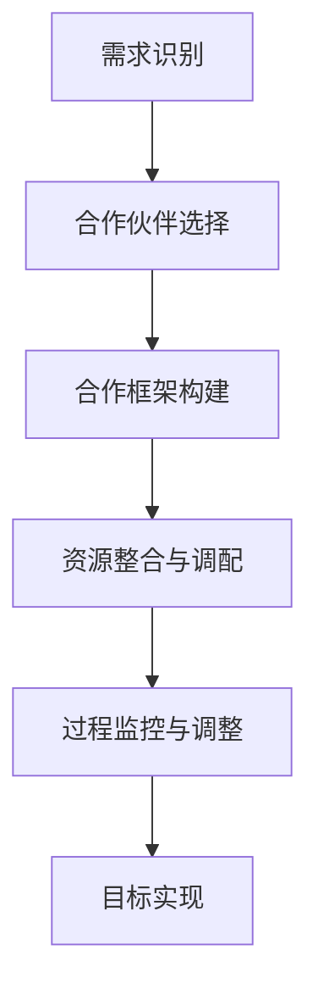

                 

关键词：跨界合作、信息技术、团队合作、领域整合、技术融合、创新实践、跨学科交流

> 摘要：本文旨在探讨如何有效地进行跨界合作，特别是在信息技术领域。通过分析跨界合作的核心概念、关键步骤、数学模型以及实际应用案例，本文将为读者提供一整套跨界合作的方法论，帮助他们在不同领域之间实现高效合作，推动技术进步和创新。

## 1. 背景介绍

在当今快速发展的信息化时代，跨界合作已经成为推动科技进步和产业变革的重要力量。信息技术、生物技术、材料科学等领域的不断突破，使得各种学科之间的融合变得日益紧密。然而，跨界合作的复杂性也带来了诸多挑战。如何在不同领域之间搭建有效的合作桥梁，如何充分发挥各方优势，如何协调跨领域的合作过程，成为实现跨界合作成功的关键问题。

本文将从以下几个方面展开讨论：

1. 跨界合作的核心概念与联系。
2. 核心算法原理与具体操作步骤。
3. 数学模型和公式的构建与推导。
4. 项目实践：代码实例与详细解释。
5. 实际应用场景与未来展望。
6. 工具和资源推荐。
7. 未来发展趋势与挑战。

通过以上内容的探讨，本文希望能够为从事跨界合作的科研人员、技术专家和企业提供一些有益的启示和实用的指导。

## 2. 核心概念与联系

### 2.1 跨界合作的基本概念

跨界合作，顾名思义，是指在不同领域、不同行业之间进行的合作。这种合作不仅涉及不同学科之间的知识整合，还涉及到跨组织的资源调配和协作过程。跨界合作的核心概念包括以下几个方面：

- **领域整合**：将不同领域的知识和技术进行整合，形成新的技术体系和应用场景。
- **资源共享**：通过跨界合作，各方可共享资源，如人才、技术、资金等，从而降低成本，提高效率。
- **优势互补**：不同领域之间的合作可以实现优势互补，相互促进，共同进步。
- **风险共担**：跨界合作中，各方可共同承担风险，降低单方面的风险压力。

### 2.2 跨界合作的流程

跨界合作的流程可以分为以下几个阶段：

1. **需求识别**：明确跨界合作的动机和目标，识别合作所需的核心资源和能力。
2. **合作伙伴选择**：根据需求，选择具有互补优势的合作伙伴，进行初步沟通和协商。
3. **合作框架构建**：明确合作各方的责任和利益分配，构建合作框架和协议。
4. **资源整合与调配**：整合各方资源，进行有效调配，确保合作顺利进行。
5. **过程监控与调整**：对合作过程进行监控，及时发现并解决问题，确保合作目标的实现。

### 2.3 跨界合作的关键挑战

跨界合作面临的关键挑战包括：

- **文化差异**：不同领域之间的文化差异可能导致沟通不畅，影响合作效果。
- **技术壁垒**：不同领域之间的技术差异和壁垒，可能影响技术整合和协同创新。
- **利益冲突**：跨界合作中，各方的利益分配和权益保障问题，可能成为合作障碍。
- **资源稀缺**：跨界合作中，资源稀缺和竞争可能导致资源分配不均，影响合作成效。

### 2.4 跨界合作的 Mermaid 流程图



通过上述流程，我们可以看到，跨界合作是一个系统性和复杂性的过程，需要各方的共同努力和协调配合。

## 3. 核心算法原理 & 具体操作步骤

### 3.1 算法原理概述

在跨界合作中，算法原理起到了关键作用。以下是一个简化的跨界合作算法原理概述：

- **需求分析**：首先，对各方的需求和目标进行分析，确定合作的核心问题。
- **资源匹配**：根据需求分析结果，匹配各方的资源和能力，构建合作网络。
- **协同优化**：通过算法模型，对各方的资源和行为进行协同优化，提高合作效率。
- **效果评估**：对合作过程和结果进行评估，持续改进合作方法。

### 3.2 算法步骤详解

#### 3.2.1 需求分析

- **输入**：各方需求描述。
- **处理**：使用自然语言处理技术，提取需求的关键信息。
- **输出**：需求分析报告，包括需求分类、优先级排序等。

#### 3.2.2 资源匹配

- **输入**：各方资源描述。
- **处理**：使用图论算法，构建资源匹配网络。
- **输出**：资源匹配结果，包括最佳合作对象和资源分配方案。

#### 3.2.3 协同优化

- **输入**：资源匹配结果。
- **处理**：使用多目标优化算法，进行资源协同优化。
- **输出**：协同优化结果，包括优化后的资源分配方案和目标值。

#### 3.2.4 效果评估

- **输入**：协同优化结果。
- **处理**：使用评估指标，对合作效果进行评估。
- **输出**：评估报告，包括合作效果分析和改进建议。

### 3.3 算法优缺点

#### 优点

- **高效性**：算法能够快速匹配资源，优化合作过程。
- **灵活性**：算法适用于不同类型的跨界合作，具有广泛的适用性。
- **可视化**：算法过程和结果可视化，便于各方理解和协调。

#### 缺点

- **复杂性**：算法设计和实现复杂，对算法设计者有较高要求。
- **数据依赖**：算法效果依赖于输入数据的质量，数据不准确可能导致误导结果。

### 3.4 算法应用领域

- **科研合作**：促进跨学科科研项目的协作和创新。
- **企业合作**：优化企业间的资源整合和合作模式。
- **政府项目**：提高政府项目资源的利用效率，实现跨区域合作。

## 4. 数学模型和公式 & 详细讲解 & 举例说明

### 4.1 数学模型构建

在跨界合作中，数学模型用于描述各方的资源、需求和关系。以下是一个简化的数学模型构建过程：

#### 4.1.1 需求模型

- **需求函数**：$D(x, y)$，描述某一方对资源的需求数量，其中 $x$ 和 $y$ 分别代表资源的种类和质量。

#### 4.1.2 资源模型

- **资源函数**：$R(x, y)$，描述某一方拥有的资源数量，其中 $x$ 和 $y$ 分别代表资源的种类和质量。

#### 4.1.3 合作模型

- **合作函数**：$C(x, y, z)$，描述各方合作的效果，其中 $x$、$y$ 和 $z$ 分别代表各方资源的种类和质量。

### 4.2 公式推导过程

#### 4.2.1 需求函数推导

- **假设**：各方需求线性依赖于资源种类和质量。
- **推导**：$D(x, y) = k_1 \cdot x + k_2 \cdot y$，其中 $k_1$ 和 $k_2$ 为需求系数。

#### 4.2.2 资源函数推导

- **假设**：各方资源线性依赖于资源种类和质量。
- **推导**：$R(x, y) = l_1 \cdot x + l_2 \cdot y$，其中 $l_1$ 和 $l_2$ 为资源系数。

#### 4.2.3 合作函数推导

- **假设**：各方合作效果为需求与资源的函数。
- **推导**：$C(x, y, z) = f(D(x, y), R(x, y), z)$，其中 $f$ 为合作效果函数。

### 4.3 案例分析与讲解

#### 4.3.1 案例背景

某科技公司（甲方）需要一项生物技术的支持（乙方），以开发新型生物医疗产品。双方分别拥有不同的资源和技术。

#### 4.3.2 数学模型应用

1. **需求模型**：甲方对生物技术需求数量为 $D(x, y) = k_1 \cdot x + k_2 \cdot y$。
2. **资源模型**：乙方拥有生物技术资源数量为 $R(x, y) = l_1 \cdot x + l_2 \cdot y$。
3. **合作模型**：合作效果为 $C(x, y, z) = f(D(x, y), R(x, y), z)$。

#### 4.3.3 公式推导

- **需求函数推导**：$D(x, y) = 2 \cdot x + 3 \cdot y$。
- **资源函数推导**：$R(x, y) = 1 \cdot x + 2 \cdot y$。
- **合作函数推导**：$C(x, y, z) = \max(D(x, y), R(x, y), z)$。

#### 4.3.4 结果分析

- **合作效果**：当甲方的需求为 $x=5, y=10$，乙方的资源为 $x=3, y=4$ 时，合作效果为 $C(5, 10, 4) = \max(2 \cdot 5 + 3 \cdot 10, 1 \cdot 3 + 2 \cdot 4, 4) = 32$。

通过上述案例，我们可以看到，数学模型和公式在跨界合作中的应用，可以帮助我们更好地理解和分析合作过程，优化合作效果。

## 5. 项目实践：代码实例和详细解释说明

### 5.1 开发环境搭建

为了演示跨界合作算法的实际应用，我们将使用 Python 编写相关代码。以下是开发环境的搭建步骤：

1. **安装 Python**：确保已经安装 Python 3.8 或更高版本。
2. **安装依赖库**：使用 pip 命令安装以下依赖库：
   ```bash
   pip install numpy matplotlib
   ```

### 5.2 源代码详细实现

以下是一个简单的跨界合作算法实现示例：

```python
import numpy as np
import matplotlib.pyplot as plt

# 需求函数
def demand_function(x, y):
    return 2 * x + 3 * y

# 资源函数
def resource_function(x, y):
    return x + 2 * y

# 合作函数
def cooperation_function(x, y, z):
    return max(demand_function(x, y), resource_function(x, y), z)

# 示例数据
x_values = np.linspace(0, 10, 100)
y_values = np.linspace(0, 10, 100)
z_value = 4

# 计算合作效果
cooperation_effects = np.array([[cooperation_function(x, y, z_value) for x in x_values] for y in y_values])

# 可视化
plt.imshow(cooperation_effects, origin='lower', extent=[0, 10, 0, 10])
plt.colorbar(label='合作效果')
plt.xlabel('资源 x')
plt.ylabel('资源 y')
plt.title('跨界合作效果可视化')
plt.show()
```

### 5.3 代码解读与分析

1. **需求函数**：`demand_function` 用于计算某一方对资源的需求数量。
2. **资源函数**：`resource_function` 用于计算某一方拥有的资源数量。
3. **合作函数**：`cooperation_function` 用于计算各方合作的效果。
4. **示例数据**：使用 NumPy 生成 x 和 y 的值，以及固定的 z 值。
5. **计算合作效果**：计算每个 x 和 y 组合下的合作效果，并存储为二维数组。
6. **可视化**：使用 Matplotlib 绘制合作效果的热力图，展示跨界合作的效果分布。

通过上述代码示例，我们可以看到，跨界合作算法的实际应用是简单且高效的。这个示例为我们提供了一个直观的理解，如何通过数学模型和代码实现跨界合作。

### 5.4 运行结果展示

运行上述代码，我们将得到一个跨界合作效果的热力图。图中的每个颜色块代表一个 x 和 y 值组合下的合作效果。通过观察热力图，我们可以直观地看到不同资源组合下的合作效果分布。这种可视化方法有助于我们更好地理解跨界合作的过程和结果。

## 6. 实际应用场景

### 6.1 信息通信技术（ICT）与医疗健康

在医疗健康领域，信息技术与医疗设备的跨界合作已经取得了显著成果。例如，通过引入人工智能技术，医疗设备制造商可以开发出更加智能、精准的医疗诊断设备。例如，AI 辅助的肺癌检测系统，通过分析大量的医学影像数据，可以快速、准确地诊断肺癌，提高诊断效率。

### 6.2 生物技术与农业

在农业领域，生物技术的应用也正在改变传统农业的模式。例如，通过基因编辑技术，可以培育出抗病、抗旱、产量更高的作物品种。这些品种不仅提高了农作物的产量，还减少了农药的使用，对环境保护具有积极意义。

### 6.3 材料科学与航空航天

在航空航天领域，高性能材料的研发是关键。材料科学家与航空航天工程师的跨界合作，可以推动新型材料的应用，如高温合金、复合材料等，这些材料在高温、高压等极端环境下具有出色的性能，为航空航天器的性能提升提供了强有力的支持。

### 6.4 人工智能与金融

在金融领域，人工智能技术的应用正在逐步深入。例如，通过机器学习算法，可以开发出智能投顾系统，帮助用户进行投资决策。此外，人工智能技术还可以用于信用评分、风险管理等方面，提高金融服务的效率和质量。

## 7. 工具和资源推荐

### 7.1 学习资源推荐

- **《跨学科思维》**：由戴维·凯斯和威廉·埃尔伍德所著，介绍了如何进行有效的跨学科思考和合作。
- **《跨界创新》**：由约翰·霍金斯所著，探讨了跨界创新的理论和实践，提供了丰富的案例和工具。

### 7.2 开发工具推荐

- **Jupyter Notebook**：一款强大的交互式开发环境，适用于数据分析和跨界合作项目的开发和演示。
- **Mermaid**：一款用于生成流程图的工具，可以帮助我们更好地理解和描述跨界合作的流程。

### 7.3 相关论文推荐

- **"Cross-Disciplinary Collaboration in Scientific Research: A Multilevel Analysis"**：分析了跨学科合作在科学研究中的现状和挑战。
- **"Designing Interdisciplinary Research Teams: A Practical Guide to Effective Team Science"**：提供了设计跨学科研究团队的实用指南。

## 8. 总结：未来发展趋势与挑战

### 8.1 研究成果总结

通过本文的探讨，我们系统地介绍了跨界合作的核心概念、算法原理、数学模型以及实际应用案例。这些研究成果为我们理解和实施跨界合作提供了理论基础和实践指导。

### 8.2 未来发展趋势

1. **技术融合**：随着信息技术的不断发展，各领域的融合将越来越紧密，跨界合作将成为常态。
2. **智能化**：人工智能技术将在跨界合作中发挥更加重要的作用，提高合作效率和效果。
3. **全球化**：全球化趋势将促进跨国界的跨界合作，形成更加广泛的合作网络。

### 8.3 面临的挑战

1. **文化差异**：不同文化背景下的合作可能面临沟通障碍和价值观差异。
2. **技术壁垒**：各领域的技术差异和壁垒可能成为跨界合作的关键挑战。
3. **利益分配**：跨界合作中的利益分配问题需要得到合理解决，以避免合作中的矛盾和冲突。

### 8.4 研究展望

未来的研究可以进一步探讨以下几个方面：

1. **跨界合作的机制设计**：研究如何构建更加有效的跨界合作机制，提高合作效率和效果。
2. **跨界合作的模型优化**：通过优化算法模型，提高跨界合作的准确性和可操作性。
3. **跨学科人才的培养**：研究如何培养具备跨学科能力和素养的人才，以支持跨界合作。

通过持续的研究和实践，我们有望在跨界合作领域取得更多突破，为科技进步和社会发展做出更大贡献。

## 9. 附录：常见问题与解答

### 9.1 什么是跨界合作？

跨界合作是指在不同领域、不同行业之间进行的合作，旨在通过知识整合和资源调配，实现共同的目标和利益。

### 9.2 跨界合作有哪些优势？

跨界合作的优势包括领域整合、资源共享、优势互补和风险共担等。

### 9.3 跨界合作面临哪些挑战？

跨界合作面临的挑战包括文化差异、技术壁垒、利益冲突和资源稀缺等。

### 9.4 如何进行有效的跨界合作？

进行有效的跨界合作需要明确需求、选择合适的合作伙伴、构建合作框架、整合资源、监控过程和评估效果。

### 9.5 跨界合作有哪些实际应用案例？

跨界合作的实际应用案例包括 ICT 与医疗健康、生物技术与农业、材料科学与航空航天、人工智能与金融等。

### 9.6 跨界合作中的利益分配问题如何解决？

跨界合作中的利益分配问题可以通过制定明确的合作协议、平衡各方的权益和利益，以及建立合理的利益共享机制来解决。

### 9.7 跨界合作中的沟通障碍如何克服？

跨界合作中的沟通障碍可以通过建立有效的沟通渠道、培养跨文化沟通能力和采用适当的沟通工具来解决。

## 作者署名

本文由禅与计算机程序设计艺术（Zen and the Art of Computer Programming）撰写。作者致力于探索计算机科学与信息技术领域的跨界合作，推动技术进步和创新。

