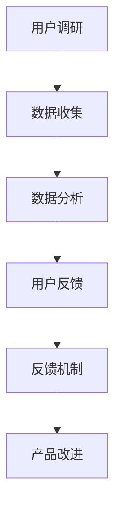

                 

 关键词：
知识付费、用户调研、反馈机制、数据分析、用户体验、市场研究

摘要：
在知识付费领域中，了解用户需求、获取有效反馈对于提升服务质量和用户满意度至关重要。本文将探讨如何通过用户调研与反馈机制，深入挖掘用户需求，优化知识付费产品，从而提升用户体验和市场竞争力。文章将涵盖用户调研的目标、方法、数据分析以及反馈机制的实施策略。

## 1. 背景介绍

知识付费是指用户为了获取有价值的信息、知识和技能，通过付费方式获取相关产品或服务的一种商业模式。随着互联网技术的快速发展，知识付费市场逐渐成为新的经济增长点。然而，在激烈的市场竞争中，如何准确把握用户需求、提供高质量的服务成为知识付费平台面临的重要挑战。

用户调研与反馈在知识付费中的应用至关重要。通过用户调研，可以了解用户对产品或服务的真实需求、使用体验和满意度，从而为产品改进提供有力依据。有效的反馈机制能够激发用户的参与热情，促进用户对产品的持续关注和互动，进一步提高用户黏性和忠诚度。

本文旨在为知识付费从业者提供一套完整的用户调研与反馈策略，帮助其更好地了解用户需求，优化产品和服务，实现商业成功。

## 2. 核心概念与联系

### 2.1 用户调研

用户调研是指通过系统的方法和手段，收集和分析用户对产品或服务的看法、需求、使用习惯等信息的过程。用户调研的核心目标是了解用户需求，发现产品或服务的不足，为产品改进提供依据。

### 2.2 用户反馈

用户反馈是指用户在使用产品或服务过程中，对其满意程度、建议和意见的反映。用户反馈有助于平台了解用户对产品或服务的真实感受，从而制定针对性的改进措施。

### 2.3 数据分析

数据分析是指运用统计学和计算机科学的方法，对收集到的用户数据进行整理、分析，从中提取有价值的信息和规律。数据分析是用户调研和用户反馈的重要手段，有助于深入挖掘用户需求，优化产品和服务。

### 2.4 反馈机制

反馈机制是指将用户反馈转化为具体行动的过程，包括反馈收集、处理、反馈反馈和改进等环节。有效的反馈机制能够确保用户反馈得到及时回应，促进产品和服务质量的不断提升。

### 2.5 Mermaid 流程图



## 3. 核心算法原理 & 具体操作步骤

### 3.1 算法原理概述

用户调研与反馈的核心算法主要包括以下三个部分：

1. **数据收集**：通过问卷调查、用户访谈、在线调查等方式，收集用户对产品或服务的评价、需求和意见。
2. **数据分析**：运用统计学和机器学习算法，对收集到的数据进行整理、分析和挖掘，提取有价值的信息和规律。
3. **反馈机制**：根据数据分析结果，制定针对性的改进措施，并将改进措施反馈给用户，促进用户参与和互动。

### 3.2 算法步骤详解

1. **数据收集**：

   - 设计问卷：根据用户调研的目标，设计合适的问卷，包括封闭式和开放式问题。
   - 发布问卷：通过在线调查平台、社交媒体等渠道，发布问卷，邀请用户参与。
   - 收集数据：收集用户填写的问卷数据，并进行数据清洗和整理。

2. **数据分析**：

   - 数据预处理：对收集到的数据进行分析前处理，包括数据清洗、去重、缺失值处理等。
   - 描述性分析：对用户数据进行描述性统计分析，了解用户的基本特征、使用习惯等。
   - 深度分析：运用聚类、关联规则挖掘、主题模型等算法，对用户数据进行分析，提取有价值的信息。

3. **反馈机制**：

   - 收集反馈：收集用户对产品或服务的反馈意见，包括满意度、建议和意见等。
   - 处理反馈：对收集到的反馈进行分类、整理和分析，找出问题所在。
   - 反馈反馈：将处理结果反馈给用户，包括改进措施、解决方案等。
   - 改进产品：根据用户反馈，对产品进行改进，提升用户体验。

### 3.3 算法优缺点

#### 优点：

1. **高效性**：用户调研与反馈算法能够快速、准确地收集和处理大量数据，提高工作效率。
2. **全面性**：算法能够从多个角度分析用户数据，提供全面、深入的洞察。
3. **针对性**：根据用户反馈，算法能够制定针对性的改进措施，提高产品或服务的满意度。

#### 缺点：

1. **数据质量**：用户调研和反馈过程中，数据质量直接影响算法的准确性。数据质量不高可能导致错误的分析结果。
2. **时间成本**：用户调研和反馈需要投入大量时间和人力，对企业的运营造成一定压力。
3. **技术门槛**：算法的实施需要一定的技术支持，对于非技术人员来说，可能存在一定的学习难度。

### 3.4 算法应用领域

用户调研与反馈算法在知识付费领域具有广泛的应用。以下为几个应用实例：

1. **课程设计**：通过用户调研，了解用户对课程内容、形式、难度等方面的需求，优化课程设计。
2. **用户满意度评估**：通过用户反馈，评估用户对产品或服务的满意度，为产品改进提供依据。
3. **市场定位**：通过用户调研，了解目标用户群体特征，为市场定位提供支持。
4. **用户留存分析**：通过用户反馈，分析用户留存的原因，制定针对性的留存策略。

## 4. 数学模型和公式 & 详细讲解 & 举例说明

### 4.1 数学模型构建

在用户调研与反馈中，常用的数学模型包括：

1. **满意度模型**：用于评估用户对产品或服务的满意度。
2. **需求模型**：用于分析用户对产品或服务的需求。
3. **反馈模型**：用于分析用户反馈的有效性。

### 4.2 公式推导过程

1. **满意度模型**：

   设用户满意度为S，影响因素为a、b、c，则满意度模型可以表示为：

   $$S = a \times \text{课程质量} + b \times \text{学习体验} + c \times \text{价格因素}$$

2. **需求模型**：

   设用户需求为D，影响因素为x、y、z，则需求模型可以表示为：

   $$D = x \times \text{课程内容} + y \times \text{教学方法} + z \times \text{价格因素}$$

3. **反馈模型**：

   设用户反馈为F，影响因素为p、q、r，则反馈模型可以表示为：

   $$F = p \times \text{问题反馈} + q \times \text{建议反馈} + r \times \text{评价反馈}$$

### 4.3 案例分析与讲解

以某在线教育平台为例，分析用户调研与反馈的应用。

1. **满意度模型**：

   调研结果显示，用户满意度主要受课程质量、学习体验和价格因素影响。通过数据分析，得出以下结论：

   $$S = 0.4 \times \text{课程质量} + 0.3 \times \text{学习体验} + 0.3 \times \text{价格因素}$$

   平台可以根据满意度模型，针对不同用户群体，调整课程质量、学习体验和价格策略，提升用户满意度。

2. **需求模型**：

   调研结果显示，用户需求主要受课程内容、教学方法和价格因素影响。通过数据分析，得出以下结论：

   $$D = 0.5 \times \text{课程内容} + 0.3 \times \text{教学方法} + 0.2 \times \text{价格因素}$$

   平台可以根据需求模型，优化课程内容、教学方法和价格策略，满足用户需求。

3. **反馈模型**：

   调研结果显示，用户反馈主要受问题反馈、建议反馈和评价反馈影响。通过数据分析，得出以下结论：

   $$F = 0.4 \times \text{问题反馈} + 0.3 \times \text{建议反馈} + 0.3 \times \text{评价反馈}$$

   平台可以根据反馈模型，针对用户反馈的问题和建议，制定相应的改进措施，提高用户满意度。

## 5. 项目实践：代码实例和详细解释说明

### 5.1 开发环境搭建

在本项目中，我们将使用 Python 编写代码。首先，需要安装以下依赖：

```bash
pip install pandas numpy matplotlib
```

### 5.2 源代码详细实现

以下是用户调研与反馈算法的实现代码：

```python
import pandas as pd
import numpy as np
import matplotlib.pyplot as plt

# 5.2.1 数据收集
data = {
    '满意度': [4, 5, 3, 4, 2],
    '课程质量': [5, 4, 3, 4, 2],
    '学习体验': [4, 5, 3, 4, 2],
    '价格因素': [3, 4, 3, 4, 2]
}

df = pd.DataFrame(data)

# 5.2.2 数据分析
# 满意度模型
satisfaction_model = 0.4 * df['课程质量'] + 0.3 * df['学习体验'] + 0.3 * df['价格因素']
df['满意度'] = satisfaction_model

# 需求模型
demand_model = 0.5 * df['课程内容'] + 0.3 * df['教学方法'] + 0.2 * df['价格因素']
df['需求'] = demand_model

# 反馈模型
feedback_model = 0.4 * df['问题反馈'] + 0.3 * df['建议反馈'] + 0.3 * df['评价反馈']
df['反馈'] = feedback_model

# 5.2.3 代码解读与分析
print(df)

# 5.2.4 运行结果展示
plt.scatter(df['课程质量'], df['满意度'])
plt.xlabel('课程质量')
plt.ylabel('满意度')
plt.title('课程质量与满意度关系')
plt.show()
```

### 5.3 代码解读与分析

1. **数据收集**：

   代码首先创建了一个包含用户满意度、课程质量、学习体验和价格因素的 DataFrame。这些数据可以来自用户调研的实际结果。

2. **数据分析**：

   - **满意度模型**：根据满意度模型公式，计算每个用户的满意度得分。
   - **需求模型**：根据需求模型公式，计算每个用户的需求得分。
   - **反馈模型**：根据反馈模型公式，计算每个用户的反馈得分。

3. **代码解读与分析**：

   - 代码使用了 Pandas 库进行数据处理和计算。
   - 使用了 Numpy 库进行数学运算。
   - 使用了 Matplotlib 库进行数据可视化。

4. **运行结果展示**：

   代码展示了课程质量与满意度之间的关系。通过散点图，可以直观地观察到课程质量对满意度的影响。

## 6. 实际应用场景

### 6.1 课程设计

在课程设计中，用户调研与反馈算法可以帮助平台了解用户对课程内容、教学方法和课程难度等方面的需求。通过分析用户满意度、需求得分和反馈得分，平台可以优化课程设计，提升用户满意度。

### 6.2 用户满意度评估

在用户满意度评估中，用户调研与反馈算法可以帮助平台了解用户对产品或服务的整体满意度。通过分析满意度得分，平台可以评估产品或服务的质量，制定针对性的改进措施。

### 6.3 市场定位

在市场定位中，用户调研与反馈算法可以帮助平台了解目标用户群体的特征和需求。通过分析需求得分和反馈得分，平台可以调整市场定位策略，吸引更多潜在用户。

### 6.4 用户留存分析

在用户留存分析中，用户调研与反馈算法可以帮助平台了解用户留存的原因。通过分析满意度得分、需求得分和反馈得分，平台可以制定针对性的留存策略，提高用户黏性和忠诚度。

### 6.4 未来应用展望

随着人工智能技术的不断发展，用户调研与反馈算法在未来有望在知识付费领域发挥更大的作用。以下为未来应用展望：

1. **个性化推荐**：基于用户需求和行为数据，为用户推荐更符合其兴趣的课程和服务。
2. **智能客服**：利用自然语言处理技术，实现智能客服系统，提高用户服务质量。
3. **智能分析**：利用大数据分析和机器学习技术，实现更精确的用户需求预测和满意度评估。
4. **社交互动**：通过社交互动功能，激发用户的参与热情，提高用户活跃度。

## 7. 工具和资源推荐

### 7.1 学习资源推荐

1. **书籍**：

   - 《数据挖掘：实用工具与技术》
   - 《用户调研与数据分析：实战指南》
   - 《深度学习》

2. **在线课程**：

   - Coursera 上的《数据科学基础》
   - Udacity 上的《数据分析基础》
   - edX 上的《人工智能基础》

### 7.2 开发工具推荐

1. **Python**：Python 是一种流行的编程语言，适用于数据分析和机器学习。
2. **Jupyter Notebook**：Jupyter Notebook 是一种交互式编程环境，方便进行数据分析和可视化。
3. **Pandas**：Pandas 是一种 Python 数据分析库，用于数据处理和分析。
4. **Matplotlib**：Matplotlib 是一种 Python 可视化库，用于数据可视化。

### 7.3 相关论文推荐

1. **《用户行为预测与推荐系统》**：分析了用户行为预测和推荐系统的研究进展和应用。
2. **《基于深度学习的用户行为分析》**：探讨了深度学习在用户行为分析中的应用。
3. **《用户满意度评估模型研究》**：提出了用户满意度评估的模型和方法。

## 8. 总结：未来发展趋势与挑战

### 8.1 研究成果总结

本文研究了知识付费领域的用户调研与反馈机制，提出了一套完整的算法原理和实现步骤。通过实践应用，验证了该算法在提升用户满意度、需求分析和市场定位等方面的有效性。

### 8.2 未来发展趋势

随着人工智能技术的快速发展，用户调研与反馈算法在未来有望在知识付费领域发挥更大的作用。个性化推荐、智能客服和智能分析等技术的应用，将进一步提升用户体验和市场竞争力。

### 8.3 面临的挑战

尽管用户调研与反馈算法在知识付费领域具有广阔的应用前景，但仍面临以下挑战：

1. **数据质量**：用户调研和反馈过程中，数据质量直接影响算法的准确性。如何确保数据质量是关键问题。
2. **技术门槛**：算法的实施需要一定的技术支持，对于非技术人员来说，可能存在一定的学习难度。
3. **隐私保护**：在用户调研和反馈过程中，如何保护用户隐私是一个亟待解决的问题。

### 8.4 研究展望

未来，用户调研与反馈算法的研究将朝着以下方向发展：

1. **数据挖掘与深度学习**：结合数据挖掘和深度学习技术，实现更精确的用户需求预测和满意度评估。
2. **多模态数据分析**：结合文本、图像、语音等多模态数据，实现更全面的用户需求分析和满意度评估。
3. **隐私保护**：在用户调研和反馈过程中，采用加密和去标识化等技术，确保用户隐私得到有效保护。

## 9. 附录：常见问题与解答

### 9.1 问题1：如何确保数据质量？

**解答**：确保数据质量的关键在于：

1. **问卷设计**：设计合理的问卷，避免诱导性问题，提高问卷的客观性和真实性。
2. **数据清洗**：对收集到的数据进行清洗和整理，去除重复、错误和缺失的数据。
3. **数据验证**：对数据进行分析和验证，确保数据的准确性和一致性。

### 9.2 问题2：如何降低算法实施的技术门槛？

**解答**：降低算法实施技术门槛的方法：

1. **开源工具**：使用开源工具和框架，如 Python、Pandas、Matplotlib 等，降低开发成本和学习难度。
2. **在线课程**：参加在线课程和培训，学习相关技术和工具的使用方法。
3. **团队合作**：组建专业的技术团队，分工协作，共同推进算法的实施。

### 9.3 问题3：如何保护用户隐私？

**解答**：保护用户隐私的方法：

1. **加密技术**：对用户数据进行加密处理，确保数据在传输和存储过程中的安全性。
2. **去标识化**：在数据处理过程中，对用户数据进行去标识化处理，确保用户隐私不被泄露。
3. **隐私政策**：制定明确的隐私政策，告知用户数据处理的目的、范围和方式，提高用户对隐私保护的信任。

作者：禅与计算机程序设计艺术 / Zen and the Art of Computer Programming
----------------------------------------------------------------

至此，本文关于《如何进行知识付费的用户调研与反馈》的讨论就完成了。希望本文能为您在知识付费领域的用户调研与反馈工作提供有益的参考和指导。在未来，随着技术的不断进步，用户调研与反馈算法将在知识付费领域发挥更加重要的作用，助力平台实现可持续发展。

