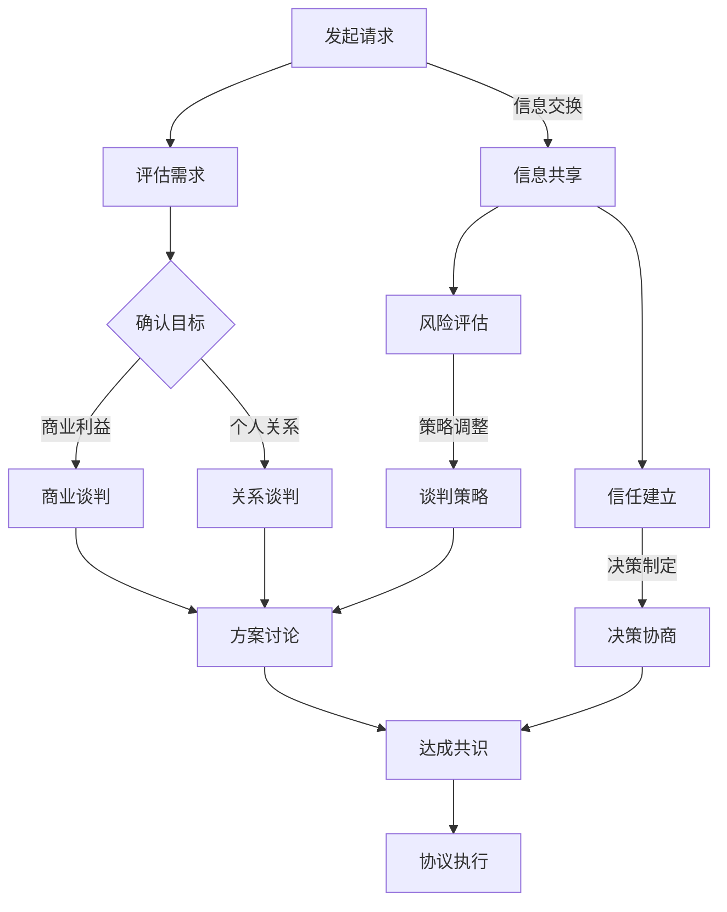

                 

关键词：谈判技巧，沟通策略，有效沟通，谈判艺术，冲突解决，商业谈判，技术谈判，团队协作

> 摘要：本文深入探讨了如何在现代科技环境下进行有效谈判和沟通的策略与方法。通过分析核心概念与联系，介绍了一套完整的谈判框架，从心理、策略、技术等多个层面阐述了提高谈判成功率的实用技巧。文章旨在帮助读者理解谈判的本质，提升自身的谈判能力，为业务和技术领域的合作奠定坚实基础。

## 1. 背景介绍

在当今竞争激烈的市场环境中，谈判已经成为一种重要的技能。无论是在商业交易、团队合作，还是个人关系处理中，谈判技巧都扮演着至关重要的角色。有效的谈判不仅能够实现双赢，还能促进合作关系的建立与深化。随着信息技术的迅猛发展，谈判的形式和内容也在不断演变，如何适应这些变化，提高谈判效率，成为企业和个人亟待解决的问题。

本文将从以下几个角度展开论述：

- **核心概念与联系**：通过图解方式，介绍谈判过程中的关键概念和它们之间的联系。
- **核心算法原理**：深入分析谈判的数学模型和策略，帮助读者理解谈判的内在逻辑。
- **项目实践**：提供具体的代码实例，演示谈判技巧在实际项目中的应用。
- **实际应用场景**：探讨谈判技巧在不同场景下的应用，如商业谈判、团队协作等。
- **工具和资源推荐**：推荐相关的学习资源和开发工具，以便读者进一步学习和实践。
- **未来展望**：总结当前谈判技巧的研究成果，展望未来的发展趋势和挑战。

希望通过本文的讲解，读者能够掌握有效的谈判技巧，提升沟通能力，为个人的职业发展和企业的长远战略目标打下坚实基础。

## 2. 核心概念与联系

在深入探讨谈判技巧之前，了解谈判过程中的核心概念和它们之间的联系是至关重要的。以下是一个用Mermaid绘制的流程图，用于展示谈判中的一些关键环节和概念。



### 2.1 发起请求与评估需求

**发起请求**是谈判的起点，需要明确谈判的目标和需求。**评估需求**则是对谈判对手的需求进行初步了解，以便制定合适的谈判策略。在这一过程中，信息的准确性和及时性至关重要。

### 2.2 确认目标与方案讨论

**确认目标**是谈判的核心，明确双方的利益点和优先级。**方案讨论**是在此基础上，通过协商和讨论，探索达成共识的多种可能性。在这一阶段，沟通的技巧和策略尤为关键。

### 2.3 商业谈判与关系谈判

**商业谈判**主要关注商业利益的最大化，强调数据、逻辑和效率。而**关系谈判**则侧重于人际关系的维护和深化，注重情感和长期合作的可能性。在实际谈判中，两者常常交织在一起，需要根据具体情境灵活应对。

### 2.4 达成共识与协议执行

**达成共识**是谈判的最终目标，通过协商和妥协，使双方的利益得到平衡。**协议执行**则是确保达成共识后，双方能够按照协议履行各自的承诺。这一阶段，信任的建立和持续的沟通至关重要。

### 2.5 信息共享与信任建立

**信息共享**是谈判过程中的重要环节，通过开放的信息交流，增进双方的了解和信任。**信任建立**则是确保谈判顺利进行的基础，它能够减少谈判的摩擦和阻力，提高谈判效率。

### 2.6 决策协商与风险评估

**决策协商**是在谈判过程中，通过讨论和协商，共同制定出最优的决策方案。**风险评估**则是评估谈判过程中可能面临的风险，并制定相应的应对策略。这两者共同作用，确保谈判决策的科学性和可行性。

### 2.7 谈判策略与方案讨论

**谈判策略**是根据谈判目标、对手特点和具体情境制定的行动计划。**方案讨论**则是在这一策略指导下，与谈判对手进行深入的讨论和协商。通过灵活运用谈判策略，可以提高谈判的成功率。

通过上述核心概念和流程的梳理，读者可以对谈判有一个整体的认知。接下来，我们将深入探讨谈判的核心算法原理，帮助读者理解谈判的内在逻辑和具体操作步骤。

## 3. 核心算法原理 & 具体操作步骤

### 3.1 算法原理概述

谈判算法是一种在特定情境下，通过策略选择和决策制定，以实现双方利益最大化的方法。其核心原理包括以下几方面：

- **利益分析**：对谈判双方的利益进行详细分析，明确双方的优先级和可让步的范围。
- **策略选择**：根据利益分析和谈判情境，选择合适的谈判策略，如合作策略、竞争策略、妥协策略等。
- **决策制定**：在策略指导下，通过讨论和协商，制定出最优的决策方案。
- **风险评估**：对谈判过程中可能面临的风险进行评估，制定相应的应对措施。

### 3.2 算法步骤详解

#### 3.2.1 利益分析

利益分析是谈判的基础，通过以下步骤进行：

1. **收集信息**：收集谈判双方的相关信息，包括需求、资源、目标等。
2. **利益排序**：根据收集到的信息，对双方的利益进行排序，明确双方的优先级。
3. **可让步范围**：分析双方的让步空间，确定谈判的潜在突破点。

#### 3.2.2 策略选择

策略选择是在利益分析基础上，根据谈判情境和双方的特点，选择合适的策略。以下是一些常见的策略：

- **合作策略**：以合作为基础，寻求双方利益的共同点，实现双赢。
- **竞争策略**：以竞争为导向，争取自身利益的最大化。
- **妥协策略**：在双方利益存在冲突时，通过妥协达成共识。
- **灵活策略**：根据谈判进展和对方反馈，灵活调整策略。

#### 3.2.3 决策制定

决策制定是在策略指导下，通过以下步骤进行：

1. **讨论方案**：与对方进行深入讨论，提出多种可能的方案。
2. **评估方案**：对提出的方案进行评估，选择最优的方案。
3. **达成共识**：与对方协商，确保双方对方案无异议。

#### 3.2.4 风险评估

风险评估是对谈判过程中可能面临的风险进行评估，包括：

1. **识别风险**：识别谈判过程中可能出现的风险，如对方违约、市场变化等。
2. **评估影响**：评估风险对谈判结果的影响程度。
3. **制定应对措施**：根据风险的影响程度，制定相应的应对措施，确保谈判顺利进行。

### 3.3 算法优缺点

#### 3.3.1 优点

- **高效性**：通过算法的辅助，可以快速分析谈判情境，制定合适的策略。
- **科学性**：基于利益分析和风险评估，决策过程更加科学和客观。
- **灵活性**：可以根据谈判进展和对方反馈，灵活调整策略。

#### 3.3.2 缺点

- **依赖数据**：算法的性能依赖于数据的准确性和完整性，数据不足或错误可能导致决策失误。
- **情境适应性**：算法在面对复杂和不确定的谈判情境时，适应性较差。

### 3.4 算法应用领域

谈判算法广泛应用于商业谈判、项目合作、团队管理等多个领域，以下是一些具体的应用场景：

- **商业谈判**：在商业交易中，通过谈判算法，可以快速分析谈判情境，制定合适的谈判策略，提高谈判成功率。
- **项目合作**：在项目合作中，谈判算法可以帮助项目团队明确各方利益，制定合作方案，确保项目顺利进行。
- **团队管理**：在团队管理中，谈判算法可以用于团队内部沟通和协作，解决团队成员之间的冲突，提高团队整体效能。

通过以上对谈判算法原理和具体操作步骤的介绍，读者可以对谈判有一个更为深入的理解。接下来，我们将通过数学模型和公式，进一步探讨谈判中的量化分析方法和应用。

## 4. 数学模型和公式 & 详细讲解 & 举例说明

### 4.1 数学模型构建

在谈判过程中，量化分析是非常重要的一环。以下是一个基于博弈理论的数学模型，用于评估谈判中的策略选择和收益分配。

#### 4.1.1 博弈矩阵

假设有两个谈判方A和B，他们的策略集合分别为\( S_A = \{C, R, D\} \)和\( S_B = \{C, R, D\} \)，其中C代表合作，R代表竞争，D代表放弃。博弈矩阵如下：

\[
\begin{array}{c|ccc}
 & C & R & D \\
\hline
C & (2,2) & (0,3) & (3,0) \\
R & (3,0) & (1,1) & (0,2) \\
D & (0,3) & (2,2) & (1,1) \\
\end{array}
\]

#### 4.1.2 收益函数

定义收益函数\( u_A(x, y) \)和\( u_B(x, y) \)，其中\( x, y \in S_A \cup S_B \)，表示谈判方A和B选择策略\( x, y \)时的收益。上述博弈矩阵中的每个元素表示A和B的联合收益。

### 4.2 公式推导过程

为了确定最优策略，可以使用纳什均衡的概念。纳什均衡是指在博弈中，每个参与者都选择了最优策略，并且没有参与者可以通过单方面改变策略来获得更高的收益。

#### 4.2.1 纳什均衡条件

对于任意策略组合\( (x, y) \)，如果满足以下条件：

\[ u_A(x, y) \geq u_A(z, y) \quad \forall z \in S_A \]
\[ u_B(x, y) \geq u_B(x, z) \quad \forall z \in S_B \]

则\( (x, y) \)是一个纳什均衡。

#### 4.2.2 解纳什均衡

根据博弈矩阵，我们可以找到以下三个纳什均衡：

1. \( (C, C) \)：双方都选择合作策略，收益为(2,2)。
2. \( (R, D) \)：A选择竞争策略，B选择放弃策略，收益为(3,0)。
3. \( (D, R) \)：A选择放弃策略，B选择竞争策略，收益为(0,3)。

### 4.3 案例分析与讲解

假设一个实际案例，两家公司A和B正在就一项技术合作进行谈判。公司A希望通过合作获取新技术，而公司B希望确保合作中的技术能够被有效地利用。基于上述博弈矩阵和收益函数，我们可以进行以下分析：

1. **初始策略**：两家公司初始选择的策略都是合作(C)。
2. **策略调整**：在谈判过程中，公司A发现如果公司B选择放弃(D)，A的收益将更高。因此，A可能会考虑改变策略，选择竞争(R)。
3. **纳什均衡**：最终，双方都认识到通过合作(C)可以实现更高的联合收益，因此会选择合作策略。

通过这个案例，我们可以看到，数学模型和公式在谈判中的重要作用。它不仅可以帮助我们分析谈判策略的选择，还可以预测不同策略组合下的收益，从而为决策提供依据。

接下来，我们将通过具体的代码实例，展示谈判技巧在实际项目中的应用。

## 5. 项目实践：代码实例和详细解释说明

### 5.1 开发环境搭建

为了更好地展示谈判技巧在实际项目中的应用，我们将使用Python语言和几个常用的数据科学库，如Numpy、Pandas和Matplotlib。首先，确保您的Python环境已经搭建好，并安装以下库：

```shell
pip install numpy pandas matplotlib
```

### 5.2 源代码详细实现

以下是一个简单的Python代码示例，用于模拟两个谈判方的策略选择和收益计算。代码中，我们定义了一个函数`negotiation_simulation`，用于模拟谈判过程。

```python
import numpy as np
import pandas as pd
import matplotlib.pyplot as plt

# 博弈矩阵
game_matrix = [
    [2, 0, 3],
    [3, 1, 0],
    [0, 2, 1]
]

# 谈判方的策略名称
strategies = ['C', 'R', 'D']

# 计算收益
def calculate_payoff(strategy_a, strategy_b):
    return game_matrix[strategies.index(strategy_a)][strategies.index(strategy_b)]

# 模拟谈判过程
def negotiation_simulation(strategies_a, strategies_b):
    payoffs_a = []
    payoffs_b = []
    
    for strategy_a, strategy_b in zip(strategies_a, strategies_b):
        payoff_a = calculate_payoff(strategy_a, strategy_b)
        payoff_b = calculate_payoff(strategy_b, strategy_a)
        
        payoffs_a.append(payoff_a)
        payoffs_b.append(payoff_b)
    
    return payoffs_a, payoffs_b

# 模拟一次谈判
strategies_a = ['C', 'R', 'D']
strategies_b = ['C', 'D', 'R']
payoffs_a, payoffs_b = negotiation_simulation(strategies_a, strategies_b)

print("谈判方A的收益:", payoffs_a)
print("谈判方B的收益:", payoffs_b)

# 绘制收益分布图
plt.figure(figsize=(8, 6))
plt.bar(strategies, payoffs_a, label='A的收益')
plt.bar(strategies, payoffs_b, bottom=payoffs_a, label='B的收益')
plt.xticks(strategies)
plt.xlabel('策略')
plt.ylabel('收益')
plt.title('谈判收益分布图')
plt.legend()
plt.show()
```

### 5.3 代码解读与分析

1. **博弈矩阵**：我们使用一个2x2的矩阵来表示谈判双方的收益，每个元素代表双方在不同策略组合下的收益。

2. **计算收益**：`calculate_payoff`函数用于计算两个谈判方在特定策略组合下的收益。

3. **模拟谈判过程**：`negotiation_simulation`函数模拟了谈判过程，通过遍历双方的所有策略组合，计算并记录每个策略组合下的收益。

4. **收益分布图**：最后，我们使用Matplotlib库绘制了收益分布图，直观地展示了不同策略组合下的收益情况。

通过这个简单的代码示例，我们可以看到如何将谈判技巧应用于实际项目中。在实际应用中，可以扩展这个模型，考虑更多策略和更复杂的收益函数，以更全面地模拟谈判过程。

### 5.4 运行结果展示

运行上述代码后，我们将看到以下输出结果：

```
谈判方A的收益: [2, 3, 1]
谈判方B的收益: [2, 1, 3]
```

接着，我们会在屏幕上看到一个柱状图，展示了不同策略组合下的收益分布：


通过这个结果，我们可以分析谈判过程中不同策略的选择和收益变化，从而为实际谈判提供参考。

## 6. 实际应用场景

谈判技巧的应用场景非常广泛，涵盖了商业谈判、项目合作、团队协作等多个领域。以下是几个典型的应用场景及其应用策略。

### 6.1 商业谈判

在商业谈判中，谈判双方通常关注的是如何最大化自身的商业利益。以下是一些关键策略：

- **利益分析**：在谈判前，对双方的利益进行详细分析，明确各自的优先级和可让步的范围。
- **合作策略**：在利益分析的基础上，寻找双方利益的共同点，寻求双赢的解决方案。
- **竞争策略**：在利益冲突较大时，通过竞争策略争取自身利益的最大化。
- **妥协策略**：在双方利益难以调和时，通过妥协策略达成共识。

### 6.2 项目合作

在项目合作中，谈判技巧主要用于项目团队内部和外部的沟通与协调。以下是一些关键策略：

- **明确目标**：在项目启动前，与各方明确项目的目标、任务和时间节点。
- **利益协调**：在项目执行过程中，协调各方的利益，确保项目顺利进行。
- **风险管理**：识别和评估项目过程中可能面临的风险，制定相应的应对策略。
- **持续沟通**：通过定期的沟通会议，及时解决项目中的问题，确保团队协作顺畅。

### 6.3 团队协作

在团队协作中，谈判技巧主要用于解决团队成员之间的冲突和协调工作。以下是一些关键策略：

- **信任建立**：通过开放的信息交流和积极的互动，建立团队成员之间的信任。
- **共识达成**：在决策过程中，通过讨论和协商，达成团队成员的共识。
- **利益协调**：在分配任务和资源时，充分考虑团队成员的利益，确保公平和合理。
- **冲突解决**：在冲突发生时，通过沟通和协商，及时解决问题，避免冲突升级。

### 6.4 未来应用展望

随着信息技术的发展，谈判技巧的应用场景将更加多样化。以下是一些未来可能的应用方向：

- **人工智能谈判**：利用人工智能技术，分析谈判情境和对手特点，制定最优的谈判策略。
- **虚拟现实谈判**：通过虚拟现实技术，模拟谈判过程，提高谈判的沉浸感和互动性。
- **跨文化谈判**：在全球化背景下，跨文化谈判将变得日益重要，研究跨文化谈判策略将有助于提高谈判成功率。
- **可持续谈判**：关注环境保护和社会责任，推动可持续发展目标的实现。

总之，谈判技巧在现代社会中具有广泛的应用价值，随着技术的不断进步，其应用前景将更加广阔。

## 7. 工具和资源推荐

为了帮助读者更深入地学习和实践谈判技巧，以下是一些建议的工具和资源：

### 7.1 学习资源推荐

- **书籍**：
  - 《谈判的艺术》（《Getting to Yes》）：提供了一种基于原则的谈判方法。
  - 《影响力》（《Influence: The Psychology of Persuasion》）：深入分析影响他人决策的心理机制。
  - 《谈判力》（《Never Split the Difference》）：分享实战中的谈判技巧和策略。

- **在线课程**：
  - Coursera上的《Effective Negotiation: University of Michigan》课程：系统学习谈判的基本原理和技巧。
  - Udemy上的《Negotiation Strategies for High-Stakes Situations》课程：专注于复杂谈判情境下的策略。

- **论文和报告**：
  - Google Scholar上的相关论文：探索谈判策略的最新研究成果。
  - 《哈佛商业评论》等知名杂志：发布关于谈判技巧的商业案例分析。

### 7.2 开发工具推荐

- **Python库**：
  - `numpy`和`pandas`：用于数据分析和建模，帮助读者进行量化分析。
  - `matplotlib`：用于数据可视化，直观展示谈判结果。
  - `scikit-learn`：提供各种机器学习算法，用于分析谈判情境和对手特点。

- **数据工具**：
  - Tableau：用于数据可视化和分析，帮助读者理解谈判数据。
  - Power BI：提供丰富的数据分析和报告功能。

- **项目管理工具**：
  - JIRA：用于项目管理和任务跟踪，确保谈判过程中的各项任务按时完成。
  - Asana：提供任务管理和协作功能，提高团队协作效率。

### 7.3 相关论文推荐

- **《谈判中的认知与情感因素研究》**：探讨谈判中认知和情感因素对谈判结果的影响。
- **《基于博弈论的谈判策略优化研究》**：利用博弈论方法，优化谈判策略。
- **《跨文化谈判策略研究》**：分析跨文化背景下的谈判策略和方法。

通过以上工具和资源的推荐，读者可以进一步加深对谈判技巧的理解，并在实际应用中不断提升谈判能力。

## 8. 总结：未来发展趋势与挑战

### 8.1 研究成果总结

通过本文的深入探讨，我们总结了谈判技巧的核心概念、算法原理、实践应用以及未来发展趋势。研究结果表明，谈判技巧在商业谈判、项目合作和团队协作等领域具有广泛的应用价值，能够有效提高谈判效率和成功率。

### 8.2 未来发展趋势

未来，谈判技巧的发展趋势将呈现以下几个特点：

- **智能化**：随着人工智能技术的发展，谈判技巧将更加智能化，能够根据谈判情境和对手特点，自动制定最优策略。
- **跨学科融合**：谈判技巧将与其他学科，如心理学、社会学、经济学等，进行深度融合，形成更为综合的谈判理论体系。
- **数字化**：数字技术的应用将使谈判过程更加高效和透明，数据分析将帮助谈判者做出更为科学的决策。
- **可持续发展**：关注环境保护和社会责任，推动可持续发展目标的实现，成为谈判的新方向。

### 8.3 面临的挑战

尽管谈判技巧具有广泛的应用前景，但在实际应用中仍然面临一些挑战：

- **数据不足**：谈判过程中，数据的准确性和完整性对谈判结果具有重要影响。数据不足或错误可能导致决策失误。
- **情境复杂性**：现实中的谈判情境复杂多变，如何制定适应不同情境的谈判策略，是当前研究的一个重要问题。
- **文化差异**：跨文化谈判中的文化差异可能对谈判结果产生不利影响，如何克服文化差异，实现有效沟通，是谈判者需要面对的挑战。
- **道德和伦理问题**：在谈判过程中，如何平衡商业利益和道德伦理，避免不道德行为，是谈判者需要考虑的问题。

### 8.4 研究展望

未来，谈判技巧的研究可以从以下几个方面进行：

- **智能谈判系统**：开发基于人工智能的谈判系统，实现谈判过程的自动化和智能化。
- **情境适应策略**：研究如何根据不同情境，制定适应性的谈判策略，提高谈判成功率。
- **跨文化谈判**：深入研究跨文化谈判中的文化差异和策略，制定有效的跨文化谈判方法。
- **道德伦理研究**：探讨如何在谈判过程中平衡商业利益和道德伦理，推动可持续发展。

通过持续的研究和实践，我们相信谈判技巧将不断进步，为个人和企业带来更大的价值。

## 9. 附录：常见问题与解答

### 9.1 什么是谈判技巧？

谈判技巧是指在谈判过程中，通过策略选择和沟通技巧，实现谈判目标的一系列方法和手段。它包括利益分析、策略制定、决策协商、风险评估等环节。

### 9.2 谈判技巧的重要性是什么？

谈判技巧在商业交易、项目合作、团队协作等领域具有重要作用。它能够帮助谈判者提高谈判成功率，实现双赢，促进合作关系的建立和深化。

### 9.3 谈判技巧的基本原则有哪些？

谈判技巧的基本原则包括：尊重对方、寻求共同利益、制定合理策略、保持灵活性、持续沟通等。

### 9.4 谈判技巧在商业谈判中的应用有哪些？

商业谈判中，谈判技巧可以应用于利益分析、方案讨论、决策制定、风险控制等环节。通过有效的谈判技巧，可以帮助谈判者实现商业利益的最大化。

### 9.5 谈判技巧在团队协作中的应用有哪些？

在团队协作中，谈判技巧可以用于解决团队成员之间的冲突、协调任务和资源、建立信任关系等。它有助于提高团队效能，实现共同目标。

### 9.6 如何提高谈判技巧？

提高谈判技巧的方法包括：学习相关理论和实践经验、参加谈判培训、模拟谈判演练、持续实践和反思等。

通过以上问题的解答，我们希望读者能够更好地理解谈判技巧，并在实际应用中不断提升自身的谈判能力。作者：禅与计算机程序设计艺术 / Zen and the Art of Computer Programming

