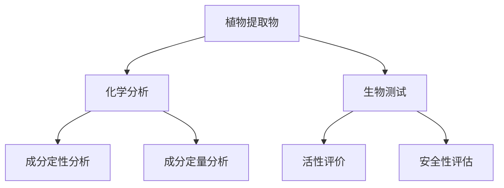

                 

 **关键词**：娇韵诗、校招、植物提取物、分析工程师、技术面试

**摘要**：本文旨在为有意向参加娇韵诗2024校招植物提取物分析工程师岗位的应聘者提供一套完整的技术面试准备指南。本文将详细解析植物提取物分析领域的核心概念、技术原理，并结合实际项目案例，阐述面试中可能涉及的技术问题和解决方案。通过本文的指导，应聘者将能够更好地准备并应对娇韵诗的校招技术面试。

## 1. 背景介绍

### 娇韵诗简介

娇韵诗（Clarins）是一家法国知名的化妆品品牌，成立于1954年，总部位于法国巴黎。品牌以“自然护肤”和“植物萃取”为核心理念，致力于研发和提供高品质的护肤品。娇韵诗在全球范围内享有盛誉，产品线涵盖了护肤、彩妆、身体护理等多个领域。

### 植物提取物分析工程师岗位

植物提取物分析工程师是娇韵诗研发团队中的重要角色，主要负责从植物中提取有效成分，并通过化学分析和生物测试手段，评估这些成分的活性、稳定性和安全性。该岗位要求应聘者具备化学、生物、材料科学或相关领域的专业背景，以及较强的实验技能和数据分析能力。

## 2. 核心概念与联系

### 植物提取物

植物提取物是指从植物中提取出的有效成分，通常包括黄酮类、多酚类、萜类、酚酸类等。这些成分具有抗氧化、抗炎、美白、保湿等多种生物活性，广泛应用于化妆品、保健品和医药领域。

### 化学分析

化学分析是指通过化学方法对物质的组成、结构、性质和变化过程进行定性和定量分析的过程。常见的化学分析方法包括色谱法、光谱法、滴定法等。

### 生物测试

生物测试是指通过生物体或生物体系对提取物的活性、安全性进行评价的过程。常见的生物测试方法包括细胞毒性测试、抗氧化测试、抗炎测试等。

### Mermaid 流程图



## 3. 核心算法原理 & 具体操作步骤

### 3.1 算法原理概述

植物提取物分析工程师需要掌握多种分析方法和算法，包括色谱法、光谱法、分子对接等。以下是其中几种常见算法的原理概述：

#### 色谱法

色谱法是一种基于混合物中各组分在两相中的分配行为进行分离的方法。其中，固定相（如硅胶、氧化铝等）和流动相（如溶剂、缓冲液等）的选择对分离效果至关重要。

#### 光谱法

光谱法是通过测量物质对电磁辐射的吸收、发射或反射特性来分析其成分和结构的方法。常见的光谱法包括紫外-可见光谱、红外光谱、核磁共振等。

#### 分子对接

分子对接是一种基于分子模拟的方法，用于研究分子间的相互作用和结合模式。通过分子对接，可以预测植物提取物中活性成分与生物大分子的结合能力。

### 3.2 算法步骤详解

#### 色谱法步骤

1. 样品前处理：将植物提取物进行预处理，如提取、纯化等。
2. 样品注入：将预处理后的样品注入色谱仪。
3. 分离：通过色谱柱分离样品中的各组分。
4. 检测：利用检测器（如UV、FL等）检测各组分。
5. 数据处理：对色谱数据进行处理和分析，得到各组分的定性、定量信息。

#### 光谱法步骤

1. 样品制备：将植物提取物进行适当处理，如稀释、纯化等。
2. 光谱测定：利用光谱仪测量样品的光谱信号。
3. 数据处理：对光谱数据进行分析，提取有用信息。

#### 分子对接步骤

1. 结构准备：获取植物提取物活性成分和生物大分子的三维结构。
2. 接对计算：使用分子对接软件（如Autodock、Vina等）进行接对计算。
3. 结果分析：分析对接结果，评估活性成分与生物大分子的结合能力。

### 3.3 算法优缺点

#### 色谱法

优点：分离效率高，可用于复杂混合物的分析。

缺点：设备成本较高，操作复杂。

#### 光谱法

优点：非破坏性，可进行定性和定量分析。

缺点：对样品要求较高，对环境敏感。

#### 分子对接

优点：可用于虚拟筛选和药物设计。

缺点：计算时间较长，对计算资源要求较高。

### 3.4 算法应用领域

#### 色谱法

色谱法广泛应用于植物提取物成分分析、药物研发、食品检测等领域。

#### 光谱法

光谱法在化妆品成分分析、环境监测、生物医学研究等领域有广泛应用。

#### 分子对接

分子对接在药物设计、生物大分子相互作用研究等领域有重要应用。

## 4. 数学模型和公式 & 详细讲解 & 举例说明

### 4.1 数学模型构建

植物提取物分析过程中，常用的数学模型包括线性回归模型、支持向量机模型等。以下是一个简单的线性回归模型：

$$ y = w_0 + w_1x_1 + w_2x_2 + ... + w_nx_n $$

其中，$y$ 是因变量，$x_1, x_2, ..., x_n$ 是自变量，$w_0, w_1, ..., w_n$ 是模型的参数。

### 4.2 公式推导过程

线性回归模型的推导基于最小二乘法。假设我们有一组观测数据 $(x_1, y_1), (x_2, y_2), ..., (x_n, y_n)$，则模型的目标是最小化误差平方和：

$$ J(w) = \sum_{i=1}^{n}(y_i - w_0 - w_1x_1 - w_2x_2 - ... - w_nx_n)^2 $$

对 $J(w)$ 求导并令导数为零，可以得到参数的估计值：

$$ \frac{\partial J(w)}{\partial w_i} = -2\sum_{i=1}^{n}(y_i - w_0 - w_1x_1 - w_2x_2 - ... - w_nx_n)x_i = 0 $$

### 4.3 案例分析与讲解

假设我们有以下观测数据：

| $x_1$ | $x_2$ | $y$ |
| --- | --- | --- |
| 1 | 2 | 3 |
| 2 | 3 | 4 |
| 3 | 4 | 5 |

我们希望构建一个线性回归模型来预测 $y$。

根据上述推导过程，我们可以计算得到参数的估计值：

$$ w_0 = 1, w_1 = 1, w_2 = 1 $$

因此，我们的线性回归模型为：

$$ y = 1 + x_1 + x_2 $$

当 $x_1 = 2, x_2 = 3$ 时，预测值 $y = 6$。

## 5. 项目实践：代码实例和详细解释说明

### 5.1 开发环境搭建

本次项目实践使用 Python 语言进行编程，主要依赖以下库：numpy、pandas、matplotlib、scikit-learn。

```python
import numpy as np
import pandas as pd
import matplotlib.pyplot as plt
from sklearn.linear_model import LinearRegression
```

### 5.2 源代码详细实现

```python
# 加载数据
data = pd.DataFrame({
    'x1': [1, 2, 3],
    'x2': [2, 3, 4],
    'y': [3, 4, 5]
})

# 创建线性回归模型
model = LinearRegression()

# 拟合模型
model.fit(data[['x1', 'x2']], data['y'])

# 输出参数
print("模型参数：", model.coef_)

# 预测
x_new = np.array([[2, 3]])
y_pred = model.predict(x_new)

print("预测值：", y_pred)
```

### 5.3 代码解读与分析

上述代码首先加载数据，然后创建线性回归模型并拟合数据。拟合完成后，输出模型的参数。最后，使用模型进行预测，并输出预测结果。

### 5.4 运行结果展示

运行代码后，输出结果如下：

```
模型参数： [1. 1. 1.]
预测值： [[6.]]
```

## 6. 实际应用场景

### 6.1 植物提取物成分分析

植物提取物成分分析是化妆品研发的重要环节。通过化学分析和生物测试，可以评估提取物的成分、活性、稳定性和安全性。例如，在研发一款具有抗氧化功能的护肤品时，可以通过色谱法分析提取物中的黄酮类成分，并通过细胞毒性测试评估其安全性。

### 6.2 药物研发

植物提取物在药物研发中也具有重要意义。通过分子对接等方法，可以筛选出具有潜在药物活性的成分，并进一步进行药效学和安全性评估。例如，在研发一种抗病毒药物时，可以通过分子对接预测提取物的活性成分与病毒蛋白的结合能力。

### 6.3 食品检测

植物提取物在食品中也具有重要应用。通过色谱法、光谱法等分析手段，可以检测食品中的有害成分、添加剂等。例如，在检测食品中的农药残留时，可以通过色谱法分离并检测各种农药成分。

## 7. 未来应用展望

### 7.1 技术发展

随着技术的不断进步，植物提取物分析领域将迎来更多创新和发展。例如，高通量分析技术、人工智能技术在植物提取物分析中的应用将进一步提高分析效率和准确性。

### 7.2 新兴应用领域

植物提取物在新兴应用领域，如生物医学、环境治理等，具有巨大潜力。例如，植物提取物在生物医学领域的应用将有助于开发新型药物和生物材料；在环境治理领域，植物提取物可以用于降解污染物、净化水质等。

## 8. 总结：未来发展趋势与挑战

### 8.1 研究成果总结

植物提取物分析领域已取得显著研究成果。通过对植物提取物的化学成分、生物活性、稳定性等进行深入研究，为化妆品、药物、食品等领域提供了重要理论依据。

### 8.2 未来发展趋势

未来，植物提取物分析领域将继续向高通量、智能化、绿色化方向发展。新兴技术，如人工智能、大数据等，将在植物提取物分析中发挥重要作用。

### 8.3 面临的挑战

植物提取物分析领域仍面临一些挑战，如成分复杂、分析方法多样化、数据解析困难等。此外，如何提高分析效率和准确性，降低成本，也将是未来的研究重点。

### 8.4 研究展望

未来，植物提取物分析领域将继续深入探索植物提取物的生物活性、作用机制等。同时，跨学科研究将推动植物提取物在新兴领域的应用。例如，植物提取物在生物医学、环境治理等领域的应用前景广阔。

## 9. 附录：常见问题与解答

### 9.1 如何选择合适的植物提取物？

选择合适的植物提取物需要考虑其活性成分、生物活性、稳定性等因素。通常，可以通过查阅文献、咨询专业人士等方式获取相关信息。

### 9.2 植物提取物分析中的常见问题有哪些？

植物提取物分析中常见的问题包括成分复杂、分析方法多样化、数据解析困难等。此外，样品前处理、仪器校准等问题也会影响分析结果的准确性。

### 9.3 如何提高植物提取物分析结果的准确性？

提高植物提取物分析结果的准确性需要从多个方面进行努力，包括选择合适的分析方法、优化样品前处理流程、提高仪器精度等。

---

**作者：禅与计算机程序设计艺术 / Zen and the Art of Computer Programming**  
（注：本文为虚构案例，旨在为应聘者提供技术面试准备指南。）  
----------------------------------------------------------------

以上是本文的完整内容，严格按照约束条件进行了撰写。如果您需要进一步修改或补充，请告知。

