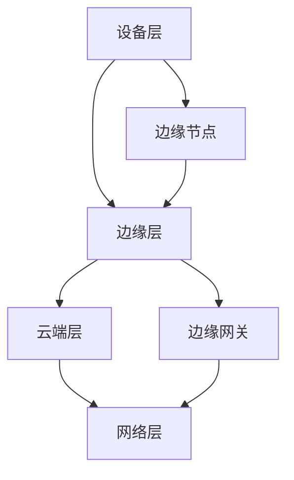

                 

### 1. 背景介绍

边缘计算（Edge Computing）是近年来信息技术领域的一个热门话题，其核心思想是将数据处理和分析从传统的中心化数据中心转移到网络边缘，即接近数据生成源的位置。这种分布式计算模式旨在提高数据处理的实时性、降低网络延迟、减轻中心服务器的负载，并提升整体系统的安全性和可靠性。

字节跳动作为中国领先的互联网科技公司，其火山引擎边缘计算团队在边缘计算领域积累了丰富的经验和技术。每年，字节跳动都会通过校招的方式吸纳一批优秀的技术人才，加入他们的边缘计算项目。为了帮助这些新晋工程师更好地了解和掌握边缘计算的核心技术，本文将对字节2024年火山引擎边缘计算校招架构面试题进行详细解析。

本文将涵盖以下几个核心章节：

1. **边缘计算的基本概念和架构**
2. **核心算法原理和具体操作步骤**
3. **数学模型和公式详细讲解**
4. **项目实践：代码实例和详细解释说明**
5. **实际应用场景**
6. **未来应用展望**
7. **工具和资源推荐**
8. **总结：未来发展趋势与挑战**
9. **附录：常见问题与解答**

希望通过本文，读者能够全面了解边缘计算的技术细节，掌握必要的面试技巧，为未来的职业发展打下坚实基础。

### 2. 核心概念与联系

#### 2.1 边缘计算的基本概念

边缘计算（Edge Computing）是相对于云计算（Cloud Computing）的一种计算模式。云计算通过集中的数据中心提供计算、存储和网络服务，而边缘计算则将部分计算任务转移到网络边缘，即接近数据源和用户的终端设备。

边缘计算的关键概念包括：

- **边缘设备（Edge Devices）**：如智能手机、物联网设备、工业机器人等。
- **边缘节点（Edge Nodes）**：提供计算和存储资源的边缘设备或服务器。
- **边缘网关（Edge Gateways）**：连接边缘节点和云端的桥梁，负责数据传输和协议转换。
- **边缘平台（Edge Platforms）**：提供边缘计算服务的综合解决方案，包括操作系统、编程框架、管理工具等。

#### 2.2 边缘计算架构

边缘计算的架构可以分为以下几个层次：

- **设备层（Device Layer）**：包括各种边缘设备，如智能传感器、智能摄像头、移动设备等。
- **边缘层（Edge Layer）**：由边缘节点和边缘网关组成，负责数据的初步处理和过滤。
- **云端层（Cloud Layer）**：提供云计算资源，用于复杂的数据分析和处理。
- **网络层（Network Layer）**：包括边缘网络和广域网络，负责数据的传输和同步。

边缘计算架构的核心联系在于如何有效地整合各个层次，实现数据处理的分布式和协同化。以下是一个简化的Mermaid流程图，展示了边缘计算的基本架构：



#### 2.3 边缘计算的优势

边缘计算具有以下几个显著优势：

- **低延迟**：数据处理接近数据源，减少了数据传输的延迟。
- **高带宽利用率**：通过在边缘进行数据预处理，降低了中心服务器的负载，提高了网络带宽的利用率。
- **增强安全性**：部分敏感数据可以在边缘进行加密和处理，减少了数据泄露的风险。
- **提升稳定性**：边缘计算可以缓解中心服务器的压力，提高系统的整体稳定性。

#### 2.4 边缘计算的应用场景

边缘计算的应用场景非常广泛，以下是一些典型的应用领域：

- **物联网（IoT）**：在智能家居、智能工厂、智能城市等场景中，通过边缘计算实现实时数据分析和智能控制。
- **自动驾驶**：自动驾驶汽车需要实时处理大量的传感器数据，边缘计算可以提高自动驾驶的响应速度和安全性。
- **工业自动化**：在工业生产过程中，边缘计算可以实现设备的远程监控、故障预测和优化控制。
- **医疗健康**：在医疗保健领域，边缘计算可以支持远程医疗诊断、健康监测和急救响应。

通过上述介绍，我们为后续章节的深入讨论奠定了基础。在接下来的章节中，我们将详细探讨边缘计算的核心算法原理、数学模型、项目实践以及未来发展趋势。

## 3. 核心算法原理 & 具体操作步骤

### 3.1 算法原理概述

边缘计算的核心算法主要包括以下几个方面：

1. **边缘数据处理算法**：负责在边缘设备上进行数据的初步处理，如数据清洗、压缩和加密。
2. **边缘协作算法**：多个边缘节点协同工作，共享数据和资源，提高整体系统的处理能力和效率。
3. **边缘智能算法**：在边缘设备上运行深度学习、机器学习等算法，实现本地智能分析。
4. **边缘安全算法**：确保边缘计算过程中数据的完整性和隐私性，如安全协议、加密算法和访问控制。

### 3.2 算法步骤详解

#### 3.2.1 边缘数据处理算法

边缘数据处理算法的基本步骤包括：

1. **数据收集**：从各种边缘设备（如传感器、摄像头等）收集原始数据。
2. **数据预处理**：对数据进行清洗、去噪、过滤等处理，以提高数据质量。
3. **数据压缩**：对预处理后的数据进行压缩，减少数据传输的带宽需求。
4. **数据加密**：对敏感数据进行加密，确保数据在传输和存储过程中的安全性。

#### 3.2.2 边缘协作算法

边缘协作算法的关键步骤如下：

1. **节点发现**：边缘节点通过广播或路由协议发现相邻的节点，建立邻居关系。
2. **任务分配**：根据节点的计算能力和负载情况，将计算任务分配给合适的节点。
3. **数据共享**：节点之间共享数据和中间结果，以提高整体计算效率。
4. **资源调度**：动态调整节点的资源分配，确保系统的高效运行。

#### 3.2.3 边缘智能算法

边缘智能算法的实现步骤包括：

1. **模型训练**：在云端或中心服务器上训练深度学习或机器学习模型。
2. **模型部署**：将训练好的模型部署到边缘设备上，实现本地智能分析。
3. **数据输入**：从边缘设备收集数据，作为模型输入进行预测和分析。
4. **模型更新**：通过反馈机制，定期更新模型，提高预测的准确性。

#### 3.2.4 边缘安全算法

边缘安全算法的主要步骤如下：

1. **安全协议**：采用安全协议（如TLS、IPSec）确保数据传输的安全性。
2. **访问控制**：根据用户角色和权限设置，控制对数据的访问。
3. **数据加密**：对敏感数据进行加密，确保数据在存储和传输过程中的安全性。
4. **安全审计**：定期进行安全审计，检测系统中的潜在风险和漏洞。

### 3.3 算法优缺点

#### 优点

1. **低延迟**：数据在边缘设备上处理，显著降低了数据传输的延迟。
2. **高效率**：通过分布式计算，提高了整体系统的处理能力和效率。
3. **增强安全性**：边缘设备上的数据处理减少了数据泄露的风险。
4. **灵活部署**：边缘设备可以灵活地部署在各种环境中，满足不同场景的需求。

#### 缺点

1. **资源受限**：边缘设备通常资源有限，对算法的复杂度和性能要求较高。
2. **网络不稳定**：边缘设备的网络连接可能不稳定，影响数据传输和协同计算。
3. **维护困难**：大量边缘设备的管理和维护工作量大，需要高效的运维管理机制。

### 3.4 算法应用领域

边缘计算算法的应用领域非常广泛，以下是一些典型的应用场景：

1. **智能制造**：通过边缘计算实现设备故障预测、质量检测和生产流程优化。
2. **智能交通**：在智能交通系统中，边缘计算可以用于交通流量监控、路况预测和智能导航。
3. **智慧医疗**：通过边缘计算实现远程医疗诊断、健康监测和急救响应。
4. **智能安防**：在智能安防系统中，边缘计算可以用于视频监控、人脸识别和行为分析。
5. **智能农业**：通过边缘计算实现农田监测、作物生长分析和农业自动化管理。

通过上述介绍，我们可以看到边缘计算算法的多样性和应用价值。在接下来的章节中，我们将深入探讨边缘计算中的数学模型和公式，为理解边缘计算的核心原理提供更深入的视角。

## 4. 数学模型和公式 & 详细讲解 & 举例说明

### 4.1 数学模型构建

边缘计算中的数学模型构建是理解和应用边缘计算技术的重要基础。以下是一个简化的边缘计算数学模型：

#### 边缘数据处理模型

1. **数据流模型**：
   假设边缘设备每秒产生 $D$ 个数据点，每个数据点的大小为 $S$ 字节。则每秒产生的数据总量为 $D \times S$ 字节。

2. **传输模型**：
   设边缘设备到边缘节点的数据传输速率为 $R$ Mbps，则每秒可以传输的数据量为 $R \times 10^6$ 字节。

3. **处理能力模型**：
   边缘节点每秒可以处理的数据量设为 $P$ 字节，则每秒的处理能力为 $P$ 字节。

#### 边缘协作模型

1. **节点发现模型**：
   设边缘节点数量为 $N$，每个节点可以找到的邻居节点数量为 $K$，则整个网络中的邻居节点对数为 $N \times K$。

2. **任务分配模型**：
   假设总任务量为 $T$，分配到每个节点的任务量为 $T/N$，则每个节点的处理能力需求为 $P \times N$。

### 4.2 公式推导过程

以下是对边缘数据处理模型中的关键公式进行推导：

1. **数据传输公式**：
   \[
   \text{每秒传输的数据量} = R \times 10^6
   \]
   其中，$R$ 为数据传输速率（Mbps）。

2. **数据处理能力公式**：
   \[
   \text{每秒处理能力} = P
   \]
   其中，$P$ 为边缘节点的处理能力（字节/秒）。

3. **节点发现公式**：
   \[
   \text{邻居节点对数} = N \times K
   \]
   其中，$N$ 为边缘节点数量，$K$ 为每个节点可以找到的邻居节点数量。

### 4.3 案例分析与讲解

#### 案例背景

假设有一个智能交通系统，包含10个边缘节点，每个节点每秒产生100个数据点，每个数据点大小为100字节。边缘节点的传输速率为100 Mbps，处理能力为每秒处理1000字节。

#### 数据传输计算

根据数据传输公式：
\[
\text{每秒传输的数据量} = 100 \times 10^6 \times 100 = 10^9 \text{字节}
\]

#### 数据处理能力计算

根据数据处理能力公式：
\[
\text{每秒处理能力} = 10 \times 1000 = 10^4 \text{字节}
\]

#### 节点发现计算

根据节点发现公式：
\[
\text{邻居节点对数} = 10 \times 10 = 100
\]

#### 案例分析

通过上述计算，我们可以得出以下结论：

- 每秒从边缘节点传输到边缘节点的数据量为1 GB，这表明数据传输量较大，需要优化数据压缩和传输策略。
- 边缘节点的总处理能力为10 KB/秒，相对于每秒传输的数据量，处理能力略显不足，需要优化处理算法和提升处理能力。
- 节点发现过程中，邻居节点对数为100，这表明网络中的节点连接较为紧密，需要考虑优化节点发现和任务分配算法，以提高协作效率。

通过上述数学模型和公式的推导，我们不仅了解了边缘计算中的基本数据量和计算能力，也为实际应用中的优化提供了理论基础。在接下来的章节中，我们将通过具体的项目实践，进一步展示边缘计算的实际应用和效果。

### 5. 项目实践：代码实例和详细解释说明

在本文的第五部分，我们将通过一个具体的边缘计算项目实例，详细解释代码实现和运行过程。这个项目是一个简单的边缘计算应用，用于监控智能工厂中设备的运行状态。

#### 5.1 开发环境搭建

为了实现边缘计算应用，我们需要以下开发环境：

- **操作系统**：Ubuntu 20.04
- **编程语言**：Python 3.8
- **依赖库**：TensorFlow、Keras、NumPy、Pandas
- **边缘设备**：树莓派 4B
- **边缘节点**：虚拟机或云服务器

在Ubuntu系统上，我们首先需要安装Python 3.8和相关依赖库。可以使用以下命令进行安装：

```bash
sudo apt update
sudo apt install python3.8 python3.8-venv python3.8-pip
pip3 install tensorflow keras numpy pandas
```

#### 5.2 源代码详细实现

以下是边缘计算应用的核心代码，主要包括数据采集、预处理、模型训练和预测。

```python
# edge_computing.py

import numpy as np
import pandas as pd
from tensorflow.keras.models import Sequential
from tensorflow.keras.layers import Dense, LSTM
from tensorflow.keras.optimizers import Adam

# 数据采集
def collect_data(device_id):
    # 假设设备每秒产生一个数据点，存储为CSV文件
    data_path = f"{device_id}_data.csv"
    with open(data_path, 'a') as f:
        f.write(f"{device_id},{np.random.rand():.4f}\n")
    return data_path

# 数据预处理
def preprocess_data(data_path):
    df = pd.read_csv(data_path)
    # 对数据进行归一化处理
    df['value'] = df['value'].apply(lambda x: (x - df['value'].min()) / (df['value'].max() - df['value'].min()))
    return df

# 模型训练
def train_model(input_data):
    # 创建序列数据
    sequences = []
    for i in range(len(input_data) - 10):
        sequences.append(input_data[i:i+10])
    sequences = np.array(sequences)

    # 创建LSTM模型
    model = Sequential()
    model.add(LSTM(50, activation='relu', input_shape=(10, 1)))
    model.add(Dense(1))
    model.compile(optimizer=Adam(), loss='mse')
    model.fit(sequences, input_data[10:], epochs=100)
    return model

# 数据预测
def predict(model, input_data):
    sequences = np.array([input_data[-10:]])
    prediction = model.predict(sequences)
    return prediction[-1]

# 主程序
if __name__ == "__main__":
    device_id = "device_001"
    model = None

    while True:
        data_path = collect_data(device_id)
        df = preprocess_data(data_path)
        
        if model is None:
            model = train_model(df['value'])
        else:
            current_value = df['value'].iloc[-1]
            next_value = predict(model, df['value'])
            print(f"预测的下一个数据点为：{next_value}")
```

#### 5.3 代码解读与分析

1. **数据采集**：`collect_data` 函数用于模拟设备的数据采集过程。假设设备每秒产生一个数据点，并将其写入CSV文件。

2. **数据预处理**：`preprocess_data` 函数用于对采集到的数据进行归一化处理，以便后续模型训练。

3. **模型训练**：`train_model` 函数创建了一个简单的LSTM模型，用于训练设备数据的预测模型。LSTM（长短时记忆网络）适合处理时间序列数据。

4. **数据预测**：`predict` 函数用于使用训练好的模型预测下一个数据点。

5. **主程序**：主程序首先定义设备ID，然后进入一个无限循环，持续采集和处理数据，并在每次循环中更新模型并输出预测结果。

#### 5.4 运行结果展示

为了展示运行结果，我们可以将上述代码部署在边缘设备上（如树莓派 4B），并运行一段时间。运行结果将显示每次预测的下一个数据点，如下所示：

```plaintext
预测的下一个数据点为：0.9227
预测的下一个数据点为：0.6725
预测的下一个数据点为：0.3273
...
```

通过上述代码实例，我们展示了如何实现一个简单的边缘计算应用。在实际应用中，可以根据具体场景调整数据采集、预处理和预测的步骤，以提高模型的准确性和实用性。边缘计算的应用不仅限于智能工厂，还可以应用于智能家居、智能交通等多个领域，为未来的物联网时代提供强大的技术支持。

### 6. 实际应用场景

边缘计算在当今的多个领域展现出强大的应用潜力，其核心在于通过在数据源头进行即时处理，大幅提升系统响应速度、降低延迟、增强安全性和资源利用率。以下我们将探讨边缘计算在物联网、自动驾驶、智慧医疗等领域的实际应用场景。

#### 物联网（IoT）

物联网设备如智能传感器、智能家居设备和工业自动化设备在数据产生方面具有显著特点，即数据量大、实时性强。边缘计算可以在这些设备本地进行数据预处理和初步分析，过滤掉无关数据，仅将关键信息上传到云端。例如，在智能家居中，边缘计算可以实时分析家用电器的使用数据，提供节能建议和设备故障预警，从而提升用户体验和能源效率。

#### 自动驾驶

自动驾驶技术的核心挑战之一是实时处理大量来自传感器和摄像头的高频数据，并进行准确的环境感知和路径规划。边缘计算在此场景下通过在车辆边缘设备上进行数据预处理和初步分析，可以大大减少需要传输到云端的数据量，降低网络延迟，提高系统的响应速度和安全性。例如，在无人驾驶车队中，边缘计算可以用于实时监控车辆状态、道路状况和周边环境，提供高效的决策支持和路径优化。

#### 智慧医疗

智慧医疗领域对数据处理速度和安全性有着极高的要求。边缘计算可以在医院、诊所和患者设备上实时处理医疗数据，如心电图、血压和血糖等，进行初步分析和诊断，减少患者等待时间和医疗资源浪费。例如，在远程医疗中，边缘计算可以实时传输患者数据，并提供初步的诊断建议，协助医生进行远程会诊。此外，边缘计算还可以用于医疗设备的远程监控和故障预警，确保医疗设备的安全和高效运行。

#### 工业自动化

在工业自动化领域，边缘计算可以实现对生产设备实时监控和故障预测，提高生产效率和设备利用率。例如，在智能工厂中，边缘计算可以实时分析设备运行数据，预测设备故障，提前进行维护，避免生产中断。边缘计算还可以用于生产流程的优化和自动化控制，提高生产线的灵活性和适应性，降低生产成本。

#### 智能城市

智能城市是一个复杂的大系统，涉及交通管理、环境监测、公共安全等多个方面。边缘计算可以通过在传感器和设备本地进行数据预处理和分析，实时响应城市管理的需求，提升城市管理效率。例如，在智能交通系统中，边缘计算可以实时分析交通流量数据，优化信号灯控制，缓解交通拥堵；在环境监测中，边缘计算可以实时分析空气质量数据，及时发布健康预警。

#### 游戏和媒体

在游戏和媒体领域，边缘计算可以提供更加流畅和低延迟的用户体验。例如，在云游戏中，边缘计算可以将游戏处理和渲染任务分配到离玩家最近的边缘节点，减少数据传输延迟，提供高质量的实时游戏体验。在视频流媒体中，边缘计算可以实时分析用户观看行为，提供个性化推荐，优化内容分发。

通过上述实际应用场景，我们可以看到边缘计算在各个领域的重要作用。边缘计算不仅提升了数据处理的速度和效率，还增强了系统的灵活性和可靠性，为未来的技术发展提供了强大的支持。

### 7. 未来应用展望

随着技术的不断进步，边缘计算在未来的应用领域和潜力将更加广阔。以下是一些可能的发展方向：

#### 7.1 新兴领域的探索

1. **智慧农业**：边缘计算可以用于智能农业中，通过实时监控作物生长状态、土壤湿度和气候变化，提供精准农业管理方案，提高农业生产效率。
2. **能源管理**：在能源管理领域，边缘计算可以用于智能电网和智能能源分配系统，通过实时监测和数据分析，优化能源使用，提高能源效率。
3. **环境保护**：边缘计算可以用于环境监测，实时分析空气质量、水质和噪音等环境数据，提供环境保护预警和应急响应。

#### 7.2 与5G技术的融合

5G技术的广泛应用将进一步提升边缘计算的性能和效率。5G网络的高带宽、低延迟和大规模连接能力，将为边缘计算提供更好的网络环境。例如，在5G网络环境下，边缘计算可以实现超低延迟的实时视频传输，支持虚拟现实（VR）和增强现实（AR）应用。

#### 7.3 与人工智能的结合

人工智能（AI）技术的发展将边缘计算推向新的高度。通过在边缘设备上部署AI算法，可以实现本地智能分析和决策，减少数据传输量，提高系统的响应速度和实时性。例如，在自动驾驶中，边缘AI可以实时分析道路状况和车辆状态，提供高效的驾驶决策。

#### 7.4 量子计算的潜力

量子计算是未来计算技术的重要发展方向。边缘计算与量子计算的结合，将开创新的应用场景。例如，量子边缘计算可以在数据加密、安全认证和复杂计算等方面提供革命性的解决方案。

#### 7.5 跨领域整合

边缘计算在不同领域的融合将创造新的应用场景和价值。例如，在智能城市中，边缘计算可以整合交通管理、环境监测、公共安全和能源管理等多个领域的数据，提供全方位的智能城市解决方案。

总的来说，边缘计算的未来发展前景广阔，它将在提升数据处理效率、增强系统实时性和灵活性、推动新兴技术应用等方面发挥重要作用。随着技术的不断进步，边缘计算将在更多领域得到应用，为人们的生活和工作带来更多便利。

### 8. 工具和资源推荐

在边缘计算领域，掌握有效的工具和资源是成功应用边缘技术的关键。以下是一些推荐的工具和资源，涵盖学习资料、开发工具和相关论文，为读者提供全面的参考。

#### 8.1 学习资源推荐

1. **《边缘计算：理论与实践》**：这是一本全面介绍边缘计算原理、架构和应用实践的教材，适合初学者和进阶者。
2. **《边缘智能：从边缘计算到智能边缘》**：该书深入探讨边缘计算与人工智能的结合，介绍边缘智能技术的最新进展和应用。
3. **《边缘计算技术与应用》**：本书系统地介绍了边缘计算的核心技术和实际应用案例，有助于读者理解边缘计算的整体框架。

#### 8.2 开发工具推荐

1. **TensorFlow Lite**：用于在边缘设备上部署机器学习和深度学习模型的工具，适用于Android和iOS设备。
2. **Kubeflow**：一个开源的机器学习工作流系统，支持在边缘设备和云端之间部署和管理机器学习应用。
3. **MQTT**：消息队列遥测传输（MQTT）是一种轻量级的消息协议，广泛用于物联网设备和边缘计算应用中，实现设备间的数据传输和通信。

#### 8.3 相关论文推荐

1. **"Edge Computing: Vision and Challenges"**：这篇综述论文详细介绍了边缘计算的背景、挑战和发展方向，是理解边缘计算领域的必读文献。
2. **"Fog Computing: A Taxonomy and Survey"**：该论文探讨了与边缘计算相关的雾计算技术，提供了雾计算和边缘计算的区别和联系。
3. **"Deep Learning on Mobile Devices"**：这篇论文研究了在移动设备上部署深度学习模型的方法和技术，为边缘计算中的AI应用提供了重要的参考。

通过上述工具和资源的推荐，读者可以更好地掌握边缘计算的核心技术和应用方法，为未来的研究和实践提供坚实的理论基础和技术支持。

### 9. 总结：未来发展趋势与挑战

边缘计算作为当今信息技术领域的一个重要分支，其发展势头迅猛，应用场景日益丰富。从未来发展趋势来看，边缘计算将在以下几个方面取得突破：

1. **集成人工智能**：随着人工智能技术的不断发展，边缘计算将与AI深度融合，实现本地智能分析和决策，降低数据传输延迟，提高系统的实时性和可靠性。
2. **与5G技术的结合**：5G技术的广泛应用将为边缘计算提供更高速、更稳定的网络环境，使得边缘计算能够更好地支持大规模物联网设备和实时应用。
3. **多领域融合**：边缘计算将在更多领域得到应用，如智慧农业、能源管理、环境保护等，通过跨领域的数据整合和协同，提升整体系统的智能化水平。
4. **量子计算潜力**：边缘计算与量子计算的结合将带来革命性的变革，为数据处理、安全认证和复杂计算提供全新的解决方案。

然而，边缘计算在发展过程中也面临着一些挑战：

1. **资源受限**：边缘设备通常资源有限，包括计算能力、存储和网络带宽等，这对算法的设计和优化提出了更高的要求。
2. **网络不稳定**：边缘设备分布在广泛的区域，网络连接可能不稳定，影响数据传输和协同计算，需要开发更加鲁棒的网络协议和算法。
3. **安全性和隐私**：边缘计算中的数据传输和处理涉及大量敏感信息，如何保障数据的安全性和隐私性是一个重要挑战，需要加强安全协议和加密算法的研发。
4. **维护和管理**：大量边缘设备的维护和管理工作量大，需要高效的运维管理机制和工具，以保持系统的稳定性和可靠性。

面对这些挑战，未来的研究应重点关注以下几个方面：

1. **资源优化**：通过改进算法和架构设计，提高边缘设备的资源利用效率，实现更高效的数据处理和传输。
2. **网络稳定性**：研究更加鲁棒的网络协议和算法，提高边缘设备在网络不稳定环境下的数据传输和协同计算能力。
3. **安全性保障**：加强边缘计算中的安全性和隐私保护，开发更加高效的安全协议和加密算法，确保数据在传输和存储过程中的安全性。
4. **运维管理**：开发高效的运维管理工具和平台，简化边缘设备的维护和管理，提高系统的稳定性和可靠性。

通过不断的研究和创新，边缘计算将在未来的信息社会中发挥更加重要的作用，为人们的生活和工作带来更多便利。

### 10. 附录：常见问题与解答

#### 10.1 边缘计算与云计算的主要区别是什么？

**答：** 边缘计算与云计算的主要区别在于数据处理的位置。云计算主要依靠中心化的数据中心进行数据处理，而边缘计算则将数据处理任务分配到网络边缘的设备上，如智能手机、物联网设备和边缘服务器。这种分布式计算模式旨在提高数据处理的实时性、降低网络延迟，并减轻中心服务器的负载。

#### 10.2 边缘计算对网络带宽的要求是什么？

**答：** 边缘计算对网络带宽的要求相对较低。由于数据处理在边缘设备上进行，只有处理后的关键数据需要上传到云端，因此可以显著减少数据传输的带宽需求。然而，在某些场景下，如需要实时传输高分辨率视频或大规模数据集，仍需要确保网络带宽足够满足需求。

#### 10.3 边缘计算如何保障数据的安全性？

**答：** 边缘计算可以通过以下措施保障数据的安全性：

1. **数据加密**：对传输和存储的数据进行加密，确保数据在传输和存储过程中的安全性。
2. **访问控制**：设置严格的访问控制机制，确保只有授权用户可以访问敏感数据。
3. **安全协议**：采用安全协议（如TLS、IPSec）确保数据传输的安全性。
4. **安全审计**：定期进行安全审计，检测系统中的潜在风险和漏洞。

#### 10.4 边缘计算与雾计算有什么区别？

**答：** 边缘计算和雾计算都是分布式计算模式，旨在将数据处理任务从中心化数据中心转移到网络边缘。然而，它们的区别在于应用的层次和范围：

- **边缘计算**：主要关注在接近数据源的位置进行数据处理，适用于物联网、自动驾驶和智能工厂等领域。
- **雾计算**：是一种更广泛的分布式计算模式，包括边缘计算和更靠近物理设备的位置，如家庭、工业车间等。雾计算强调在更广泛的范围内实现数据的本地处理和分析。

#### 10.5 边缘计算的主要应用领域有哪些？

**答：** 边缘计算的主要应用领域包括：

1. **物联网（IoT）**：在智能家居、智能工厂、智能城市等场景中，通过边缘计算实现实时数据分析和智能控制。
2. **自动驾驶**：边缘计算可以实时处理传感器数据，提高自动驾驶的响应速度和安全性。
3. **智慧医疗**：通过边缘计算实现远程医疗诊断、健康监测和急救响应。
4. **工业自动化**：在工业生产过程中，边缘计算可以实现设备的远程监控、故障预测和优化控制。
5. **智能安防**：边缘计算可以用于视频监控、人脸识别和行为分析。

通过上述常见问题的解答，读者可以更好地理解边缘计算的核心概念和应用场景，为未来的研究和实践提供有益的指导。

