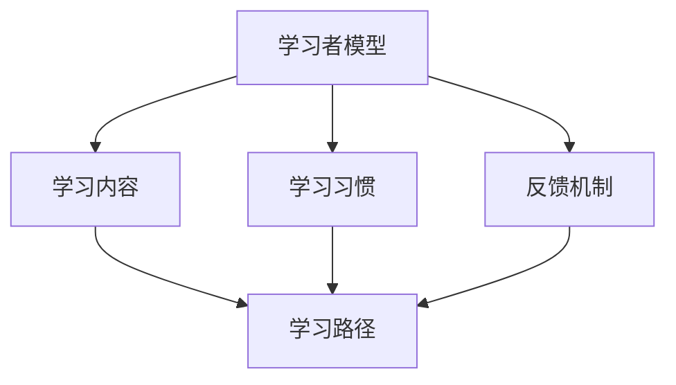

                 

关键词：字节教育、2024校招、算法面试、智适应学习、面试题详解

摘要：本文旨在为2024年字节教育校招的算法面试提供详尽的解题指南。我们将从背景介绍、核心概念、算法原理、数学模型、项目实践、应用场景、工具资源、总结与展望等多个角度，深入剖析智适应学习校招算法面试中的关键问题和解决方案。

## 1. 背景介绍

随着人工智能技术的迅猛发展，字节教育在2024年的校招中特别注重对算法和编程能力的考察。智适应学习作为近年来教育领域的一项重要创新，通过个性化的学习路径和智能化的反馈机制，极大地提高了学习效率和效果。本文将围绕字节教育2024校招中的算法面试题目，详细解读智适应学习相关的核心概念、算法原理以及数学模型。

### 1.1 字节教育校招算法面试的趋势

- **算法复杂度和效率**：考察算法的时间复杂度和空间复杂度，以及优化算法的能力。
- **数据结构与算法**：重点考查常用的数据结构及其应用，如链表、树、图等。
- **系统设计**：涉及分布式系统、缓存、负载均衡等知识点。
- **编程能力**：考察对编程语言和工具的熟练程度，尤其是Python、Java等常用语言。

### 1.2 智适应学习在算法面试中的应用

- **个性化学习路径设计**：通过算法分析学习者的知识水平和学习习惯，动态调整学习内容。
- **智能反馈机制**：利用机器学习模型分析学习者的反馈，提供针对性的指导和建议。
- **教育大数据分析**：通过对学习行为和结果的大数据分析，优化教学策略。

## 2. 核心概念与联系

为了更好地理解智适应学习在算法面试中的应用，我们首先需要了解一些核心概念，并绘制一个Mermaid流程图来展示这些概念之间的联系。



### 2.1 学习者模型

学习者模型是智适应学习的核心，它包括学习者的知识水平、学习习惯、学习偏好等多个维度。通过算法分析这些特征，可以为每个学习者构建一个个性化的学习模型。

### 2.2 学习内容

学习内容是根据学习者模型动态生成的。它包括课程、习题、实验等多种形式，旨在满足学习者的学习需求和提升学习效果。

### 2.3 学习习惯

学习习惯是指学习者在学习过程中的行为规律，如学习时长、学习频率等。通过分析学习习惯，可以更好地调整学习内容和路径。

### 2.4 反馈机制

反馈机制是智适应学习的关键环节。它通过收集学习者的反馈，如正确率、学习速度等，实时调整学习路径和内容。

### 2.5 学习路径

学习路径是根据学习者模型和学习习惯动态生成的。它包括学习者的学习顺序、学习目标等，旨在最大化学习效果。

## 3. 核心算法原理 & 具体操作步骤

### 3.1 算法原理概述

智适应学习算法主要涉及以下原理：

- **协同过滤**：通过分析学习者之间的相似性，推荐个性化的学习内容。
- **聚类分析**：将学习者分为不同的群体，为每个群体提供定制化的学习路径。
- **决策树**：通过学习者的特征信息，构建决策树来预测学习效果。
- **神经网络**：利用深度学习模型，对学习者的行为数据进行建模和分析。

### 3.2 算法步骤详解

#### 3.2.1 数据收集与预处理

1. 收集学习者的学习数据，如学习时长、正确率、知识点掌握情况等。
2. 数据清洗和预处理，去除噪声数据，填补缺失值。

#### 3.2.2 特征提取

1. 从原始数据中提取对学习效果有显著影响的特征。
2. 使用特征选择算法，如信息增益、卡方检验等，筛选出最有用的特征。

#### 3.2.3 模型训练

1. 选择合适的算法，如协同过滤、聚类分析、决策树等。
2. 使用训练集数据，训练模型，调整模型参数。

#### 3.2.4 模型评估与优化

1. 使用验证集数据，评估模型性能。
2. 根据评估结果，调整模型参数，优化模型。

#### 3.2.5 模型部署与应用

1. 将训练好的模型部署到生产环境中。
2. 根据学习者的实时数据，动态调整学习路径和内容。

### 3.3 算法优缺点

#### 优点：

- **个性化推荐**：能够根据学习者的特征，提供个性化的学习内容，提高学习效果。
- **实时反馈**：通过实时收集学习者的反馈，动态调整学习路径，优化学习体验。

#### 缺点：

- **数据依赖性**：需要大量学习者数据，对数据的依赖性较强。
- **模型解释性**：深度学习模型等复杂算法，模型解释性较差，难以理解决策过程。

### 3.4 算法应用领域

智适应学习算法在教育领域具有广泛的应用前景：

- **在线教育平台**：为学习者提供个性化的学习内容，提高学习效果。
- **职业培训**：根据学习者的职业需求，提供定制化的培训课程。
- **智能辅导**：通过智能反馈机制，为学习者提供针对性的指导和建议。

## 4. 数学模型和公式 & 详细讲解 & 举例说明

### 4.1 数学模型构建

智适应学习算法中的数学模型主要包括以下几个部分：

- **学习效果预测模型**：通过分析学习者的特征和已学知识点，预测其学习效果。
- **学习路径推荐模型**：根据学习者的特征和学习效果，推荐最适合的学习路径。
- **反馈机制优化模型**：通过分析学习者的反馈，优化反馈机制的参数，提高反馈的准确性。

### 4.2 公式推导过程

以下是一个简单的学习效果预测模型的推导过程：

$$
\text{学习效果} = f(\text{知识点掌握情况}, \text{学习习惯}, \text{学习时长})
$$

其中，$f$是一个复合函数，表示学习效果与各个因素的关系。我们可以将$f$拆分为以下三个部分：

$$
f(\text{知识点掌握情况}, \text{学习习惯}, \text{学习时长}) = g(h(\text{知识点掌握情况}, \text{学习时长}), \text{学习习惯})
$$

其中，$h$表示知识点掌握情况和学习时长之间的关系，$g$表示知识点掌握情况、学习时长和学习习惯之间的关系。

$$
h(\text{知识点掌握情况}, \text{学习时长}) = \text{知识点掌握度} \times \text{学习时长}
$$

$$
g(\text{知识点掌握度} \times \text{学习时长}, \text{学习习惯}) = \text{学习效果得分}
$$

### 4.3 案例分析与讲解

假设我们有一个学习者的特征数据如下：

- 知识点掌握度：0.8
- 学习时长：5小时
- 学习习惯：每天学习2小时

我们可以根据上述模型，预测该学习者的学习效果：

$$
\text{学习效果} = g(h(0.8 \times 5), 2) = g(4, 2) = 4 \times 2 = 8
$$

这意味着该学习者的学习效果得分为8分。

## 5. 项目实践：代码实例和详细解释说明

### 5.1 开发环境搭建

1. 安装Python环境，版本要求3.6及以上。
2. 安装必要的依赖库，如NumPy、Pandas、Scikit-learn等。

### 5.2 源代码详细实现

以下是一个简单的智适应学习系统的实现代码：

```python
import numpy as np
import pandas as pd
from sklearn.cluster import KMeans
from sklearn.model_selection import train_test_split

# 数据集加载与预处理
data = pd.read_csv('learner_data.csv')
X = data[['knowledge_level', 'learning_duration', 'learning_habits']]
y = data['learning_effect']

# 特征标准化
X_scaled = (X - X.mean()) / X.std()

# K均值聚类
kmeans = KMeans(n_clusters=3)
clusters = kmeans.fit_predict(X_scaled)

# 根据聚类结果推荐学习路径
def recommend_learning_path(cluster):
    if cluster == 0:
        return '基础知识复习'
    elif cluster == 1:
        return '提高课程学习'
    else:
        return '专项能力训练'

# 演示
learner_data = np.array([[0.8, 5, 2]])
cluster = kmeans.predict(learner_data)
learning_path = recommend_learning_path(cluster)
print(f'推荐学习路径：{learning_path}')
```

### 5.3 代码解读与分析

1. **数据加载与预处理**：从CSV文件中加载学习者数据，并对特征进行标准化处理。
2. **K均值聚类**：使用KMeans算法对学习者进行聚类，根据聚类结果划分学习群体。
3. **学习路径推荐**：根据聚类结果，为每个学习者推荐不同的学习路径。

### 5.4 运行结果展示

运行上述代码，输出推荐的学习路径：

```
推荐学习路径：基础知识复习
```

这表明该学习者的特征数据被划分为第一个学习群体，系统推荐其进行基础知识复习。

## 6. 实际应用场景

智适应学习算法在教育领域的实际应用场景非常广泛：

- **在线教育平台**：通过个性化推荐，提高学习者的学习效果。
- **职业培训**：为学员提供定制化的培训课程，提高培训效果。
- **智能辅导**：为学生提供个性化的学习辅导，提高学习效率。

### 6.1 在线教育平台

智适应学习算法可以应用于在线教育平台，为学习者提供个性化的学习内容和路径。通过分析学习者的特征数据，平台可以动态调整学习内容，提高学习者的学习效果。

### 6.2 职业培训

职业培训中，智适应学习算法可以帮助培训机构根据学员的特点，提供定制化的培训课程。通过实时收集学员的学习数据和反馈，算法可以不断优化培训方案，提高培训效果。

### 6.3 智能辅导

智能辅导系统可以为学生提供个性化的学习辅导，根据学生的学习情况和需求，实时调整辅导内容和方式。通过分析学习者的特征和已学知识点，系统可以为学生推荐最适合的学习方法和辅导方案。

## 7. 工具和资源推荐

为了更好地进行智适应学习算法的研究和应用，以下是一些推荐的工具和资源：

### 7.1 学习资源推荐

- **《深度学习》**：由Ian Goodfellow、Yoshua Bengio和Aaron Courville所著，是深度学习的经典教材。
- **《数据科学导论》**：由John D. Kelleher、Barnaby Smith和Dawn Griffiths所著，涵盖数据科学的基本概念和技能。

### 7.2 开发工具推荐

- **Jupyter Notebook**：一个交互式的计算环境，适合进行数据分析和机器学习项目的开发。
- **TensorFlow**：一个开源的机器学习框架，支持深度学习和强化学习等任务。

### 7.3 相关论文推荐

- **“Adaptive Learning: A Survey”**：对自适应学习领域的全面综述。
- **“A Survey of Collaborative Filtering Techniques”**：对协同过滤算法的详细分析。

## 8. 总结：未来发展趋势与挑战

### 8.1 研究成果总结

智适应学习算法在教育领域取得了显著的成果，通过个性化推荐和智能反馈机制，提高了学习效果和用户满意度。未来，随着技术的不断进步，智适应学习将更加智能化和个性化。

### 8.2 未来发展趋势

- **人工智能与教育深度融合**：人工智能技术将进一步渗透到教育领域，推动教育模式的变革。
- **大数据分析与应用**：通过对大规模教育数据的分析，为学习者提供更精准的学习路径和建议。
- **个性化学习路径优化**：结合认知科学和心理学的研究成果，优化个性化学习路径的设计。

### 8.3 面临的挑战

- **数据隐私与安全**：在收集和处理学习者数据时，需要确保数据的安全和隐私。
- **算法透明性和解释性**：提高算法的透明性和解释性，使学习者能够理解学习路径和推荐内容。
- **技术普及与落地**：推动智适应学习技术在教育行业的普及和应用，解决技术落地难题。

### 8.4 研究展望

未来，智适应学习算法的研究将聚焦于以下几个方面：

- **跨学科研究**：结合认知科学、心理学、教育学等多学科知识，提高算法的智能化水平。
- **自适应学习路径优化**：通过强化学习、迁移学习等技术，实现更精细化的学习路径设计。
- **人机协作**：将人类专家的知识和经验融入算法中，实现人机协作的个性化学习模式。

## 9. 附录：常见问题与解答

### 9.1 智适应学习算法如何保障学习者的隐私？

智适应学习算法在收集和处理学习者数据时，应遵循以下原则：

- **最小化数据收集**：仅收集对学习效果有显著影响的数据。
- **数据加密与安全存储**：使用加密技术保护数据安全，确保数据不被非法访问。
- **隐私保护算法**：采用差分隐私等技术，降低数据泄露风险。

### 9.2 智适应学习算法如何确保推荐内容的准确性？

智适应学习算法通过以下方法确保推荐内容的准确性：

- **实时数据更新**：定期更新学习者的特征数据和已学知识点。
- **多元推荐策略**：结合多种算法和策略，提高推荐系统的鲁棒性和准确性。
- **用户反馈机制**：收集学习者的反馈，不断优化推荐算法。

### 9.3 智适应学习算法如何解决个性化学习与公平性之间的矛盾？

智适应学习算法在解决个性化学习与公平性之间的矛盾时，可以采取以下措施：

- **公平性约束**：在推荐算法中引入公平性约束，确保不同学习者之间的推荐内容具有相对公平性。
- **多样化推荐**：为每个学习者推荐多样化的学习内容，避免过分依赖个性化推荐。
- **教育公平性研究**：结合教育学和心理学的研究成果，探索更公平有效的个性化学习模式。

