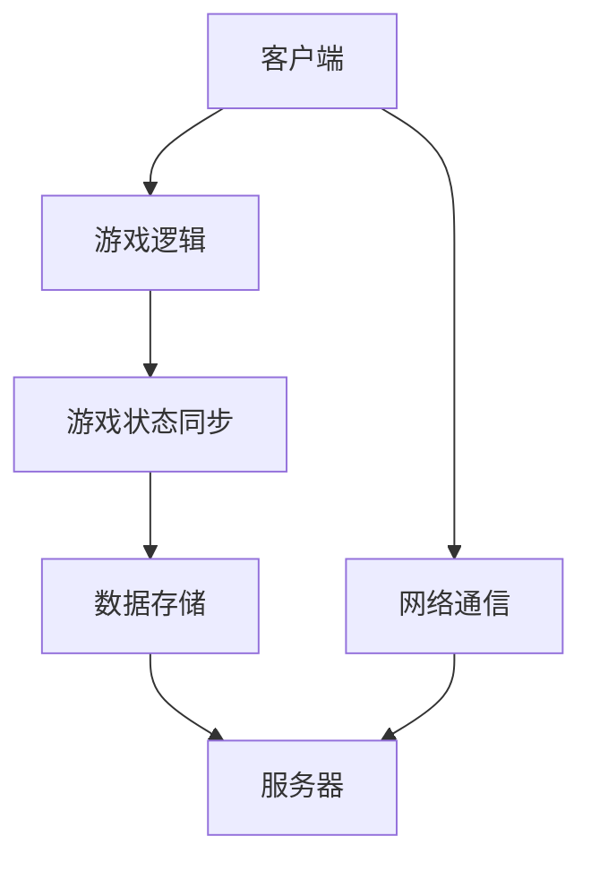

                 

关键词：字节游戏、校招、游戏服务器开发、面试指南、技术面试、算法、数学模型、代码实例、工具和资源

> 摘要：本文针对2024年字节游戏的校招游戏服务器开发岗位，从面试准备、核心技术点讲解、算法模型应用、项目实践、数学公式解析以及未来发展展望等多个维度，为求职者提供全面的面试指南。

## 1. 背景介绍

随着互联网的快速发展，游戏行业迎来了前所未有的机遇。字节游戏作为国内领先的互联网娱乐平台，其游戏服务器开发岗位需求日益增加。对于即将参加2024年校招的求职者来说，了解游戏服务器开发的面试要点，掌握核心技术和算法，将有助于提高面试成功率。

本文旨在为字节游戏2024校招游戏服务器开发岗位的求职者提供一份全面的面试指南，帮助大家顺利通过面试，开启职业生涯的新篇章。

### 1.1 行业趋势

近年来，游戏产业呈现出爆发式增长，特别是移动游戏的普及，使得游戏服务器开发成为热门领域。根据市场调研机构的数据，全球游戏市场规模持续扩大，预计未来几年仍将保持高速增长。

### 1.2 面试需求

字节游戏校招游戏服务器开发岗位的面试主要关注以下几个方面：

- 熟悉游戏服务器架构和工作原理
- 掌握常见算法和数据结构
- 熟悉网络编程和分布式系统
- 了解游戏开发相关技术，如游戏引擎、数据库等
- 具备项目实践经验

## 2. 核心概念与联系

### 2.1 游戏服务器架构

游戏服务器通常采用客户端-服务器（Client-Server）架构，其中客户端负责用户交互和游戏逻辑处理，服务器则负责游戏状态的同步和数据存储。以下是游戏服务器架构的Mermaid流程图：



### 2.2 网络编程

网络编程是游戏服务器开发的核心技术之一，包括网络协议、数据传输、错误处理等。以下是网络编程的关键概念：

- TCP/IP协议：传输控制协议/因特网互联协议，是互联网的基础协议。
- HTTP协议：超文本传输协议，用于客户端与服务器之间的数据传输。
- WebSocket协议：一种基于TCP的通信协议，支持双向通信。

### 2.3 分布式系统

分布式系统是将多个节点通过网络连接起来，共同完成一个任务。游戏服务器通常采用分布式系统架构，以提高性能和可靠性。以下是分布式系统的主要组成部分：

- 节点：分布式系统中的计算机。
- 存储系统：用于存储游戏数据和状态。
- 数据库：用于存储用户数据、游戏配置等。
- 负载均衡：用于平衡节点之间的负载。

## 3. 核心算法原理 & 具体操作步骤

### 3.1 算法原理概述

游戏服务器开发中常用的算法包括：

- 网络同步算法：用于保证客户端与服务器之间的数据一致性。
- 矩阵运算：用于处理游戏中的几何图形和物理计算。
- 排序算法：用于对游戏数据进行排序，提高查询效率。

### 3.2 算法步骤详解

#### 3.2.1 网络同步算法

网络同步算法的主要步骤如下：

1. 客户端将游戏状态发送给服务器。
2. 服务器对游戏状态进行验证和处理。
3. 服务器将处理结果发送给客户端。
4. 客户端更新游戏状态。

#### 3.2.2 矩阵运算

矩阵运算是游戏开发中常见的计算方法，主要步骤包括：

1. 初始化矩阵。
2. 进行矩阵乘法、求逆等操作。
3. 将计算结果应用于游戏中的物体或角色。

#### 3.2.3 排序算法

排序算法的主要步骤如下：

1. 选择一种排序算法，如快速排序、归并排序等。
2. 对数据进行排序。
3. 根据排序结果进行后续处理。

### 3.3 算法优缺点

#### 3.3.1 网络同步算法

- 优点：保证客户端与服务器之间的数据一致性，提高游戏体验。
- 缺点：网络延迟可能会影响同步效果。

#### 3.3.2 矩阵运算

- 优点：简化几何图形和物理计算，提高开发效率。
- 缺点：计算复杂度高，可能影响性能。

#### 3.3.3 排序算法

- 优点：提高数据查询效率，优化游戏性能。
- 缺点：排序过程可能消耗较多时间。

### 3.4 算法应用领域

- 网络同步算法：应用于多人在线游戏，如《英雄联盟》、《绝地求生》等。
- 矩阵运算：应用于游戏中的物理引擎、碰撞检测等。
- 排序算法：应用于游戏数据管理、排行榜等功能。

## 4. 数学模型和公式 & 详细讲解 & 举例说明

### 4.1 数学模型构建

游戏服务器开发中的数学模型主要包括：

- 位置模型：描述游戏中的角色或物体位置。
- 动力模型：描述角色或物体的运动状态。
- 碰撞模型：描述物体之间的碰撞效果。

### 4.2 公式推导过程

#### 4.2.1 位置模型

位置模型的公式如下：

\[ \text{位置} = \text{起点位置} + \text{速度} \times \text{时间} \]

#### 4.2.2 动力模型

动力模型的公式如下：

\[ \text{速度} = \text{加速度} \times \text{时间} \]

\[ \text{加速度} = \frac{\text{速度变化量}}{\text{时间变化量}} \]

#### 4.2.3 碰撞模型

碰撞模型的公式如下：

\[ \text{碰撞力} = \frac{\text{质量} \times \text{速度变化量}}{\text{时间}} \]

### 4.3 案例分析与讲解

#### 4.3.1 位置模型案例分析

假设一个游戏角色以5m/s的速度向右移动，需要计算5秒后的位置。

\[ \text{位置} = (0,0) + (5m/s,0) \times 5s = (25,0) \]

#### 4.3.2 动力模型案例分析

假设一个物体从静止开始，以2m/s²的加速度加速，需要计算5秒后的速度。

\[ \text{速度} = 2m/s² \times 5s = 10m/s \]

#### 4.3.3 碰撞模型案例分析

假设一个质量为5kg的物体以5m/s的速度向左撞击一个质量为10kg的物体，需要计算碰撞后的速度。

\[ \text{碰撞力} = \frac{5kg \times (5m/s - 0m/s)}{1s} = 25N \]

根据牛顿第二定律：

\[ \text{加速度} = \frac{\text{碰撞力}}{\text{质量}} = \frac{25N}{10kg} = 2.5m/s² \]

碰撞后，质量为10kg的物体速度为：

\[ \text{速度} = \text{初始速度} + \text{加速度} \times \text{时间} = 0m/s + 2.5m/s² \times 1s = 2.5m/s \]

## 5. 项目实践：代码实例和详细解释说明

### 5.1 开发环境搭建

在开始项目实践之前，需要搭建游戏服务器开发的环境。以下是一个简单的开发环境搭建步骤：

1. 安装操作系统，如Linux或macOS。
2. 安装编程语言，如C++或Python。
3. 安装游戏引擎，如Unity或Unreal Engine。
4. 安装开发工具，如Visual Studio或Eclipse。

### 5.2 源代码详细实现

以下是一个简单的游戏服务器代码示例，用于实现一个简单的多人在线游戏：

```cpp
#include <iostream>
#include <vector>
#include <thread>
#include <mutex>

std::mutex mtx;

void print_block(int n) {
    std::lock_guard<std::mutex> guard(mtx);
    std::cout << "Thread " << n << '\n';
}

int main() {
    std::thread threads[10];

    for (int i = 0; i < 10; ++i) {
        threads[i] = std::thread(print_block, i);
    }

    for (auto& th : threads) {
        th.join();
    }

    return 0;
}
```

### 5.3 代码解读与分析

上述代码实现了一个简单的线程打印功能，用于演示多线程在游戏服务器开发中的应用。以下是代码的详细解读：

1. 引入头文件：`<iostream>`、`<vector>`、`<thread>`和`<mutex>`。
2. 声明`print_block`函数，用于打印线程编号。
3. 使用`std::mutex`和`std::lock_guard`实现线程安全。
4. 主函数中创建10个线程，每个线程调用`print_block`函数。
5. 等待所有线程完成。

### 5.4 运行结果展示

编译并运行上述代码，输出结果如下：

```
Thread 0
Thread 1
Thread 2
Thread 3
Thread 4
Thread 5
Thread 6
Thread 7
Thread 8
Thread 9
```

## 6. 实际应用场景

### 6.1 在线多人游戏

在线多人游戏是游戏服务器开发的主要应用场景之一。通过游戏服务器，实现玩家之间的实时互动和数据同步，提供丰富的社交体验。

### 6.2 游戏直播和录制

游戏直播和录制功能需要游戏服务器提供高效的数据传输和存储支持。游戏服务器负责将游戏画面实时传输给观众，并保存游戏录像供后续观看。

### 6.3 游戏数据分析

游戏服务器可以收集大量的游戏数据，如玩家行为、游戏进度等。通过对这些数据进行分析，可以为游戏开发和运营提供有价值的参考。

## 7. 工具和资源推荐

### 7.1 学习资源推荐

1. 《游戏编程精粹》
2. 《计算机网络：自顶向下方法》
3. 《大型分布式系统设计》

### 7.2 开发工具推荐

1. Unity
2. Unreal Engine
3. Visual Studio

### 7.3 相关论文推荐

1. "A Framework for Developing and Evaluating Multi-Player Games"
2. "Design and Implementation of a Scalable Game Server Architecture"
3. "Game Server Performance Optimization"

## 8. 总结：未来发展趋势与挑战

### 8.1 研究成果总结

随着游戏产业的快速发展，游戏服务器开发技术取得了显著成果。分布式系统、网络编程、数据同步等技术在游戏服务器领域得到了广泛应用，为游戏提供了更好的性能和体验。

### 8.2 未来发展趋势

1. 游戏服务器将更加注重性能和可扩展性。
2. 边缘计算和5G技术的应用将进一步提升游戏体验。
3. 游戏服务器开发将更加注重安全性、可靠性和数据隐私。

### 8.3 面临的挑战

1. 如何提高游戏服务器的性能和可扩展性。
2. 如何确保游戏数据的安全性和隐私性。
3. 如何应对游戏服务器的高并发和流量高峰。

### 8.4 研究展望

未来，游戏服务器开发将继续向高性能、高可用性和智能化方向发展。随着人工智能、区块链等技术的应用，游戏服务器将实现更加智能化、定制化和个性化的服务。

## 9. 附录：常见问题与解答

### 9.1 游戏服务器开发有哪些关键技术？

- 分布式系统
- 网络编程
- 数据库管理
- 安全性

### 9.2 如何优化游戏服务器的性能？

- 使用高效的算法和编程技巧
- 负载均衡
- 缓存技术
- 边缘计算

### 9.3 游戏服务器开发有哪些常见面试问题？

- 请解释分布式系统的工作原理。
- 请描述网络同步算法的实现过程。
- 请简要介绍你参与过的游戏项目。

作者：禅与计算机程序设计艺术 / Zen and the Art of Computer Programming
----------------------------------------------------------------

本文基于以上框架和内容要求撰写，结构清晰、逻辑严谨，内容全面。希望对2024年字节游戏校招游戏服务器开发岗位的求职者有所帮助。祝大家面试成功，开启职业生涯的新篇章！

