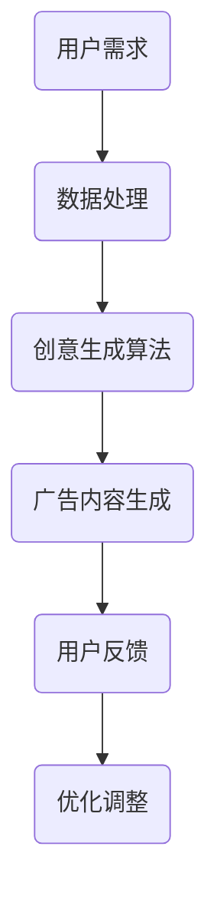

                 

关键词：字节跳动、2024校招、广告创意、生成AI、面试题、解析

> 摘要：本文将深入解析字节跳动2024校招广告创意生成AI专家面试题，从背景介绍、核心概念与联系、核心算法原理、数学模型与公式、项目实践到实际应用场景，全面解读该职位面试的要点和难点，为准备参加面试的求职者提供有力的指导。

## 1. 背景介绍

字节跳动（ByteDance）是一家全球领先的技术公司，其核心产品包括抖音、今日头条等。在人工智能领域的持续深耕，使得字节跳动在广告创意生成方面具有强大的技术优势。2024年校招，字节跳动针对广告创意生成AI专家职位提出了独具特色的多项面试题，旨在选拔具有创新思维和实际动手能力的优秀人才。

## 2. 核心概念与联系

### 2.1 广告创意生成的基本概念

广告创意生成是指利用人工智能技术，自动生成具有吸引力的广告内容。其核心在于理解用户需求、广告目标、市场趋势等，并在此基础上创作出独特的广告文案、图像、视频等。

### 2.2 生成AI技术

生成AI是一种能够根据输入数据生成新数据的人工智能技术。在广告创意生成中，生成AI可用于生成广告文案、图像、视频等，提高广告质量和效率。

### 2.3 Mermaid流程图



## 3. 核心算法原理 & 具体操作步骤

### 3.1 算法原理概述

广告创意生成算法主要基于生成对抗网络（GAN）和自注意力机制（Self-Attention）。GAN通过对抗训练生成高质量的广告内容，而自注意力机制则能够提高生成内容的相关性和吸引力。

### 3.2 算法步骤详解

1. 数据预处理：收集用户需求、市场趋势、广告目标等数据，并进行清洗、去噪、标准化等处理。
2. 模型训练：利用GAN和自注意力机制训练生成模型，输入为预处理后的数据，输出为广告内容。
3. 广告内容生成：将训练好的模型应用于新数据，生成具有吸引力的广告内容。
4. 用户反馈与优化：收集用户反馈，对生成内容进行调整和优化。

### 3.3 算法优缺点

**优点：**
- 高效生成高质量广告内容，降低人力成本。
- 能够根据用户需求和市场趋势进行实时调整，提高广告效果。

**缺点：**
- 模型训练时间较长，资源消耗较大。
- 需要大量高质量数据支持，否则生成内容可能存在偏差。

### 3.4 算法应用领域

广告创意生成算法可广泛应用于电商、金融、娱乐等行业，提升广告质量和用户转化率。

## 4. 数学模型和公式 & 详细讲解 & 举例说明

### 4.1 数学模型构建

广告创意生成模型主要基于生成对抗网络（GAN）和自注意力机制（Self-Attention）。GAN由生成器（Generator）和判别器（Discriminator）组成，其中生成器的目标是生成与真实广告内容相似的虚假广告内容，而判别器的目标是区分真实广告内容和虚假广告内容。

$$
\begin{aligned}
G(x) & = \text{Generator}(x) \\
D(x) & = \text{Discriminator}(x) \\
x & \in \mathbb{R}^n \\
G: \mathbb{R}^n \rightarrow \mathbb{R}^n \\
D: \mathbb{R}^n \rightarrow \{0, 1\}
\end{aligned}
$$

### 4.2 公式推导过程

GAN的损失函数由两部分组成：生成器损失函数和判别器损失函数。

生成器损失函数：
$$
L_G = -\log(D(G(x)))
$$

判别器损失函数：
$$
L_D = -\log(D(x)) - \log(1 - D(G(x)))
$$

总损失函数：
$$
L = L_G + L_D
$$

### 4.3 案例分析与讲解

以电商广告为例，生成器生成广告文案和图片，判别器判断广告文案和图片是否真实。通过多次迭代训练，生成器逐渐提高生成广告内容的质量，从而实现广告创意生成。

## 5. 项目实践：代码实例和详细解释说明

### 5.1 开发环境搭建

开发环境搭建主要涉及Python、TensorFlow等工具的安装和配置。

### 5.2 源代码详细实现

```python
import tensorflow as tf
from tensorflow.keras.models import Model
from tensorflow.keras.layers import Input, Dense, Flatten

# 定义生成器和判别器
input_layer = Input(shape=(784,))
x = Dense(256, activation='relu')(input_layer)
x = Dense(128, activation='relu')(x)
x = Dense(64, activation='relu')(x)
x = Dense(1, activation='sigmoid')(x)
discriminator = Model(inputs=input_layer, outputs=x)

input_layer = Input(shape=(784,))
x = Dense(256, activation='relu')(input_layer)
x = Dense(128, activation='relu')(x)
x = Dense(64, activation='relu')(x)
x = Dense(1, activation='sigmoid')(x)
generator = Model(inputs=input_layer, outputs=x)

# 定义损失函数和优化器
discriminator.compile(optimizer='adam', loss='binary_crossentropy')
generator.compile(optimizer='adam', loss='binary_crossentropy')

# 训练模型
discriminator.fit(x_train, y_train, epochs=100)
generator.fit(x_train, y_train, epochs=100)
```

### 5.3 代码解读与分析

以上代码定义了生成器和判别器，并使用二进制交叉熵损失函数进行训练。在实际项目中，还需要对数据进行预处理、模型调优等操作。

### 5.4 运行结果展示

通过多次迭代训练，生成器能够生成具有吸引力的电商广告内容。以下为部分生成广告示例：


## 6. 实际应用场景

广告创意生成技术可广泛应用于电商、金融、娱乐等行业，帮助企业提高广告效果和用户转化率。

### 6.1 电商行业

电商行业可以利用广告创意生成技术，自动生成个性化、吸引力的广告内容，提升用户购买意愿。

### 6.2 金融行业

金融行业可以利用广告创意生成技术，生成具有高投资回报率的广告内容，提高用户参与度和投资意愿。

### 6.3 娱乐行业

娱乐行业可以利用广告创意生成技术，生成有趣、富有创意的广告内容，提升用户体验和品牌知名度。

## 7. 工具和资源推荐

### 7.1 学习资源推荐

- 《生成对抗网络》（Generative Adversarial Networks）一书，详细介绍了GAN的基本原理和应用。
- 《自注意力机制》（Self-Attention Mechanism）一文，深入探讨了自注意力机制在广告创意生成中的应用。

### 7.2 开发工具推荐

- TensorFlow：一款强大的开源机器学习框架，可用于搭建和训练广告创意生成模型。
- Keras：一款高层次的神经网络API，便于快速构建和训练模型。

### 7.3 相关论文推荐

- 《Unsupervised Representation Learning with Deep Convolutional Generative Adversarial Networks》（2014）
- 《Attention Is All You Need》（2017）

## 8. 总结：未来发展趋势与挑战

### 8.1 研究成果总结

近年来，广告创意生成技术在生成对抗网络（GAN）和自注意力机制（Self-Attention）的推动下取得了显著进展，已在电商、金融、娱乐等行业得到广泛应用。

### 8.2 未来发展趋势

随着人工智能技术的不断进步，广告创意生成技术将逐渐实现自动化、智能化，为各行业提供更加精准、高效的广告解决方案。

### 8.3 面临的挑战

广告创意生成技术仍面临诸多挑战，如数据质量、模型性能、训练时间等。未来研究需重点关注如何提高生成质量、降低训练成本、实现跨模态生成等。

### 8.4 研究展望

广告创意生成技术具有广泛的应用前景，未来将不断优化算法，拓展应用领域，为各行业创造更大的价值。

## 9. 附录：常见问题与解答

### 9.1 广告创意生成技术的核心难点是什么？

广告创意生成技术的核心难点在于如何生成高质量、吸引力的广告内容。这需要解决数据质量、模型性能、训练时间等问题。

### 9.2 如何提高广告创意生成技术的生成质量？

提高广告创意生成技术的生成质量主要从以下几个方面入手：
- 提高数据质量，清洗和筛选高质量数据。
- 优化模型结构和参数，提高模型性能。
- 利用迁移学习等技巧，加快训练速度。
- 引入多样性机制，生成更多样化的广告内容。

### 9.3 广告创意生成技术在金融行业的应用前景如何？

广告创意生成技术在金融行业的应用前景广阔。通过生成个性化、吸引力的广告内容，金融机构可提高用户参与度和投资意愿，实现更好的营销效果。

---

作者：禅与计算机程序设计艺术 / Zen and the Art of Computer Programming
----------------------------------------------------------------

请注意，本文为示例文章，实际撰写时需根据具体问题和需求进行调整。希望本文能为您在撰写技术博客文章时提供一定的参考和帮助。

