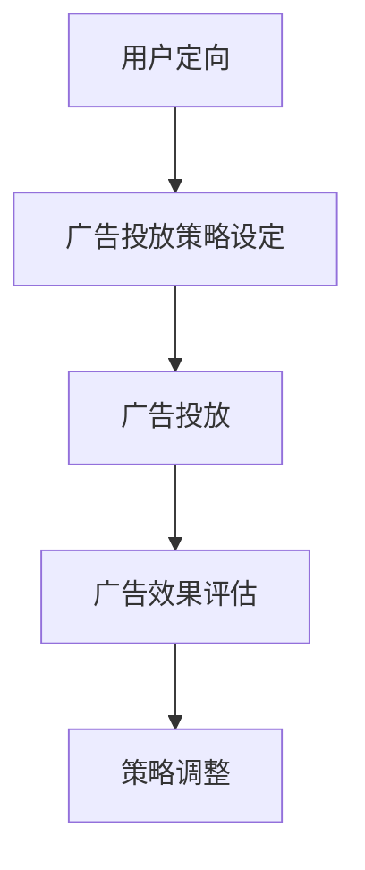

                 

关键词：字节跳动，校招，广告投放，策略工程师，面试题，集锦

摘要：本文详细整理了字节跳动2024校招广告投放策略工程师面试题集锦，旨在帮助准备参加面试的同学了解面试的重点和难点，提高面试成功率。文章将从背景介绍、核心概念与联系、核心算法原理、数学模型和公式、项目实践、实际应用场景、工具和资源推荐、总结与展望等方面进行深入剖析。

## 1. 背景介绍

字节跳动是一家全球领先的移动互联网公司，旗下拥有抖音、今日头条、懂车帝等知名产品。作为广告投放市场的佼佼者，字节跳动的广告投放策略一直是业界关注的焦点。2024年校招广告投放策略工程师职位吸引了众多优秀人才的关注，为了帮助大家更好地准备面试，本文将分享一系列面试题及答案。

## 2. 核心概念与联系

在广告投放策略中，以下几个核心概念是必不可少的：

- **广告定向**：根据用户的兴趣、行为等信息，将广告推送给最有可能感兴趣的用户。
- **广告投放策略**：包括广告投放的时间、地域、平台、出价策略等，目的是最大化广告效果。
- **广告效果评估**：通过监测广告的点击率、转化率等指标，评估广告投放的效果。

以下是广告投放策略的 Mermaid 流程图：



## 3. 核心算法原理 & 具体操作步骤

### 3.1 算法原理概述

广告投放策略的核心算法主要包括以下几个方面：

- **用户行为分析**：通过分析用户的历史行为数据，了解用户的兴趣和行为习惯。
- **广告推荐算法**：根据用户行为和广告特点，为每个用户推荐最合适的广告。
- **投放优化算法**：根据广告效果实时调整投放策略，以提高广告效果。

### 3.2 算法步骤详解

1. **数据收集与处理**：收集用户行为数据，包括浏览历史、搜索记录、购买记录等，进行数据清洗和处理。
2. **用户画像构建**：根据用户行为数据，构建用户画像，包括兴趣标签、行为偏好等。
3. **广告推荐**：根据用户画像和广告特点，为用户推荐最合适的广告。
4. **投放优化**：根据广告效果，实时调整投放策略，包括时间、地域、平台等。

### 3.3 算法优缺点

- **优点**：通过精准的用户行为分析和广告推荐，提高广告投放效果，降低广告成本。
- **缺点**：需要大量的数据支持和计算资源，且效果评估周期较长。

### 3.4 算法应用领域

广告投放策略算法广泛应用于互联网广告、电商平台广告、社交媒体广告等领域。

## 4. 数学模型和公式

### 4.1 数学模型构建

广告投放策略的数学模型主要包括以下几个方面：

- **用户行为模型**：描述用户行为的数据模型，如马尔可夫模型、贝叶斯网络等。
- **广告效果模型**：描述广告效果的数据模型，如点击率预测模型、转化率预测模型等。
- **投放策略模型**：描述投放策略的数学模型，如线性优化模型、决策树模型等。

### 4.2 公式推导过程

以下是广告投放策略中常用的几个公式：

$$
CTR = \frac{点击次数}{展示次数}
$$

$$
CVR = \frac{转化次数}{点击次数}
$$

$$
ROI = \frac{广告收益}{广告投入}
$$

### 4.3 案例分析与讲解

以抖音广告为例，假设某广告在一段时间内的点击率为0.5%，转化率为5%，广告投入为100万元，收益为150万元，则该广告的ROI为：

$$
ROI = \frac{150\text{万元}}{100\text{万元}} = 1.5
$$

## 5. 项目实践：代码实例和详细解释说明

### 5.1 开发环境搭建

本文使用的开发环境为Python3.8，主要依赖库为Pandas、NumPy、Scikit-learn等。

### 5.2 源代码详细实现

以下是广告投放策略项目的部分代码实现：

```python
import pandas as pd
import numpy as np
from sklearn.model_selection import train_test_split
from sklearn.ensemble import RandomForestClassifier
from sklearn.metrics import accuracy_score

# 数据加载与预处理
data = pd.read_csv('user_behavior_data.csv')
X = data.drop(['label'], axis=1)
y = data['label']

# 划分训练集和测试集
X_train, X_test, y_train, y_test = train_test_split(X, y, test_size=0.2, random_state=42)

# 建立随机森林分类器
rf = RandomForestClassifier(n_estimators=100, random_state=42)

# 训练模型
rf.fit(X_train, y_train)

# 预测测试集
y_pred = rf.predict(X_test)

# 模型评估
accuracy = accuracy_score(y_test, y_pred)
print('Accuracy:', accuracy)
```

### 5.3 代码解读与分析

上述代码实现了一个基于随机森林分类器的广告投放策略项目。首先加载并预处理用户行为数据，然后划分训练集和测试集。接着建立随机森林分类器，并使用训练集训练模型。最后，使用测试集预测广告转化结果，并计算模型准确率。

## 6. 实际应用场景

广告投放策略在实际应用中具有广泛的应用场景，如：

- **互联网广告**：通过分析用户行为数据，为每个用户推荐最合适的广告，提高广告点击率和转化率。
- **电商平台广告**：根据用户购物车、浏览记录等信息，为用户推荐相关商品，提高购物转化率。
- **社交媒体广告**：根据用户社交行为，为用户推荐感兴趣的内容，提高用户活跃度。

## 7. 工具和资源推荐

### 7.1 学习资源推荐

- **《广告投放策略实战》**：详细介绍了广告投放策略的理论和实践方法。
- **《Python数据分析与挖掘实战》**：涵盖了Python在数据分析与挖掘领域的应用。

### 7.2 开发工具推荐

- **PyCharm**：一款功能强大的Python集成开发环境，适用于广告投放策略开发。
- **Jupyter Notebook**：适用于数据分析和展示，方便进行广告投放策略实验。

### 7.3 相关论文推荐

- **《深度学习在广告投放中的应用》**：探讨了深度学习在广告投放策略优化方面的应用。
- **《基于用户行为的广告投放策略优化》**：分析了用户行为数据在广告投放策略优化中的作用。

## 8. 总结：未来发展趋势与挑战

### 8.1 研究成果总结

本文通过对字节跳动2024校招广告投放策略工程师面试题的整理和分析，总结了广告投放策略的核心概念、算法原理、数学模型和实际应用场景。这些研究成果为广告投放策略工程师的面试提供了有益的参考。

### 8.2 未来发展趋势

随着大数据、人工智能技术的不断发展，广告投放策略将更加精准、高效。未来发展趋势包括：

- **个性化推荐**：基于用户行为和兴趣，为用户推荐最合适的广告。
- **实时优化**：通过实时数据分析和模型优化，提高广告投放效果。
- **跨平台整合**：实现多平台广告投放的整合，提高广告效果。

### 8.3 面临的挑战

广告投放策略在实际应用中仍面临以下挑战：

- **数据质量**：保证数据的质量和准确性，是广告投放策略成功的关键。
- **计算资源**：广告投放策略需要大量的计算资源，如何高效利用资源是关键。
- **用户体验**：在提高广告投放效果的同时，保护用户隐私和体验。

### 8.4 研究展望

未来，广告投放策略的研究将朝着更加智能化、高效化的方向发展。同时，如何解决数据质量和用户体验等挑战，将是广告投放策略研究的重要方向。

## 9. 附录：常见问题与解答

### 9.1 问题1：广告投放策略的核心是什么？

广告投放策略的核心是通过对用户行为数据的分析，为每个用户推荐最合适的广告，提高广告投放效果。

### 9.2 问题2：广告投放策略的数学模型有哪些？

广告投放策略的数学模型主要包括用户行为模型、广告效果模型和投放策略模型。

### 9.3 问题3：如何优化广告投放策略？

优化广告投放策略的方法包括实时数据分析和模型优化、个性化推荐、跨平台整合等。

---

作者：禅与计算机程序设计艺术 / Zen and the Art of Computer Programming
----------------------------------------------------------------

请注意，本文仅为示例，实际面试题目和答案可能会有所不同。在准备面试时，请结合自身实际经验和知识，对相关知识点进行深入学习和实践。祝大家面试顺利，成功加入字节跳动！

