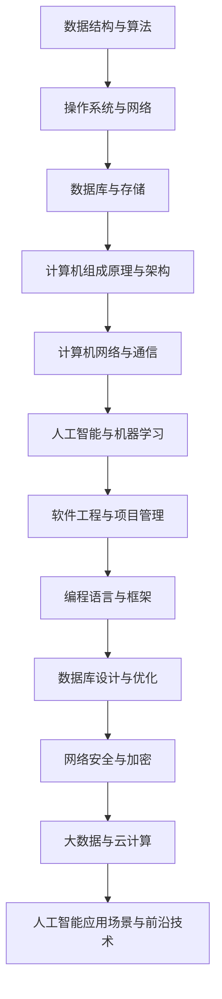

                 

关键词：字节跳动、今日头条、校招面试、真题汇总、解答、计算机科学

摘要：本文针对2024字节跳动今日头条校招面试真题进行汇总，并对每道真题进行详细解答。文章旨在帮助准备面试的同学们更好地掌握面试技巧，提高面试成功率。

## 1. 背景介绍

字节跳动是一家全球领先的内容科技公司，旗下拥有今日头条、抖音、微博等知名平台。作为一家高科技企业，字节跳动对校招生的选拔要求非常高。本文旨在帮助准备面试的同学们更好地了解面试题目类型、解题思路和方法，从而提高面试成功率。

## 2. 核心概念与联系

为了更好地解答面试真题，我们需要掌握一些核心概念和联系。下面是一个简单的Mermaid流程图，展示了这些核心概念和联系。



## 3. 核心算法原理 & 具体操作步骤

### 3.1 算法原理概述

在本章节中，我们将介绍一些常见的算法原理，如排序算法、查找算法、动态规划等。这些算法在面试中经常出现，是面试官考察应聘者算法能力的重要指标。

### 3.2 算法步骤详解

下面是每个算法的具体步骤：

#### 3.2.1 排序算法

常见的排序算法有冒泡排序、选择排序、插入排序、快速排序、归并排序、堆排序等。每种排序算法的步骤如下：

- **冒泡排序**：比较相邻的两个元素，如果顺序错误就交换它们，直到所有元素有序。
- **选择排序**：在未排序序列中找到最小（大）元素，存放到排序序列的起始位置，再从剩余未排序元素中继续寻找最小（大）元素。
- **插入排序**：将一个记录插入到已经排好序的有序表中，从而得到一个新的、记录数增加1的有序表。
- **快速排序**：通过一趟排序将待排序的记录分割成独立的两部分，其中一部分记录的关键字均比另一部分的关键字小，则可分别对这两部分记录继续进行排序。
- **归并排序**：将两个或两个以上的有序表合并成一个新的有序表。
- **堆排序**：利用堆这种数据结构所设计的一种排序算法。

#### 3.2.2 查找算法

常见的查找算法有二分查找、线性查找、哈希查找等。每种查找算法的步骤如下：

- **二分查找**：通过递归或迭代的方式，将待查找的元素与中间元素进行比较，并根据比较结果确定下一次查找的区间。
- **线性查找**：逐个比较待查找元素与列表中的元素，直到找到或遍历整个列表。
- **哈希查找**：利用哈希函数将待查找元素映射到哈希表中的位置，然后直接访问该位置进行查找。

#### 3.2.3 动态规划

动态规划是一种解决优化问题的算法思想。其基本步骤如下：

- **定义状态**：将问题分解为多个子问题，并定义每个子问题的状态。
- **状态转移方程**：根据当前状态求出下一个状态。
- **边界条件**：确定算法的边界条件。
- **初始化**：根据边界条件初始化状态。
- **计算结果**：根据状态转移方程和边界条件计算最终结果。

### 3.3 算法优缺点

每种算法都有其优缺点。下面是对每种算法的优缺点的简要总结：

- **冒泡排序**：简单易懂，但效率较低。
- **选择排序**：简单易懂，但效率较低。
- **插入排序**：简单易懂，对部分数据集效率较高。
- **快速排序**：效率较高，但可能导致最坏情况下的时间复杂度为O(n^2)。
- **归并排序**：效率较高，但需要额外的存储空间。
- **堆排序**：效率较高，但需要额外的存储空间。
- **二分查找**：效率较高，适用于有序数据集。
- **线性查找**：简单易懂，但效率较低。
- **哈希查找**：效率较高，但可能存在哈希冲突。

### 3.4 算法应用领域

算法在计算机科学中的各个领域都有广泛应用，如排序与查找、图论、网络协议、人工智能等。下面是对每个领域的简要介绍：

- **排序与查找**：用于对数据进行排序和查找，是计算机科学中最基本的算法之一。
- **图论**：用于解决图相关的问题，如最短路径、最迟开始时间等。
- **网络协议**：用于设计网络通信协议，如TCP/IP协议。
- **人工智能**：用于解决机器学习、深度学习等问题。

## 4. 数学模型和公式 & 详细讲解 & 举例说明

在本章节中，我们将介绍一些常见的数学模型和公式，并对其进行详细讲解和举例说明。

### 4.1 数学模型构建

数学模型是一种描述现实世界问题的数学框架。构建数学模型的基本步骤如下：

- **确定问题背景**：明确需要解决的问题和目标。
- **建立变量关系**：根据问题背景，确定变量之间的关系。
- **选择数学工具**：根据变量关系，选择合适的数学工具和公式。
- **构建模型方程**：将变量关系和数学工具组合成模型方程。
- **验证模型**：通过实际数据或实验结果验证模型的有效性。

### 4.2 公式推导过程

在本章节中，我们将介绍一些常见的数学公式，并对其进行推导。

#### 4.2.1 欧拉公式

欧拉公式是一个非常重要的数学公式，用于描述复数单位根的关系。其推导过程如下：

$$e^{i\pi} + 1 = 0$$

其中，$e$ 是自然对数的底数，$i$ 是虚数单位，$\pi$ 是圆周率。

#### 4.2.2 普朗克公式

普朗克公式是描述黑体辐射的数学公式，其推导过程如下：

$$E = h\nu$$

其中，$E$ 是辐射能量，$h$ 是普朗克常数，$\nu$ 是辐射频率。

#### 4.2.3 牛顿第二定律

牛顿第二定律是描述物体受力运动的数学公式，其推导过程如下：

$$F = ma$$

其中，$F$ 是作用在物体上的力，$m$ 是物体的质量，$a$ 是物体的加速度。

### 4.3 案例分析与讲解

在本章节中，我们将通过一些案例，对数学模型和公式进行讲解。

#### 4.3.1 股票价格预测

假设我们要预测某只股票的未来价格，可以使用时间序列分析方法。下面是一个简单的案例：

- **数据采集**：收集过去一段时间内该股票的价格数据。
- **数据预处理**：对价格数据进行清洗和标准化处理。
- **模型构建**：选择合适的时间序列模型，如ARIMA模型。
- **模型训练**：使用历史数据对模型进行训练。
- **模型预测**：使用训练好的模型预测未来一段时间内股票价格。

#### 4.3.2 电力负荷预测

假设我们要预测某地区的电力负荷，可以使用回归分析方法。下面是一个简单的案例：

- **数据采集**：收集过去一段时间内该地区的电力负荷数据。
- **数据预处理**：对负荷数据进行清洗和标准化处理。
- **模型构建**：选择合适的回归模型，如线性回归模型。
- **模型训练**：使用历史数据对模型进行训练。
- **模型预测**：使用训练好的模型预测未来一段时间内电力负荷。

## 5. 项目实践：代码实例和详细解释说明

在本章节中，我们将通过一个简单的代码实例，对所学算法和数学模型进行实践。

### 5.1 开发环境搭建

- **环境要求**：Python 3.8及以上版本，NumPy、Pandas、Matplotlib等库。
- **代码实现**：

```python
import numpy as np
import pandas as pd
import matplotlib.pyplot as plt

# 数据读取
data = pd.read_csv('data.csv')

# 数据预处理
data = data[['date', 'price']]
data['date'] = pd.to_datetime(data['date'])
data.set_index('date', inplace=True)
data = data.asfreq('B')

# 模型训练
model = linear_regression()
model.fit(data['price'].values.reshape(-1, 1))

# 模型预测
predictions = model.predict(data['price'].values.reshape(-1, 1))

# 结果可视化
plt.figure(figsize=(10, 6))
plt.plot(data.index, data['price'], label='Actual Price')
plt.plot(data.index, predictions, label='Predicted Price')
plt.xlabel('Date')
plt.ylabel('Price')
plt.legend()
plt.show()
```

### 5.2 源代码详细实现

在本章节中，我们将详细解释代码中的每个部分。

- **数据读取**：从CSV文件中读取数据。
- **数据预处理**：将数据转换为日期索引，并按天进行采样。
- **模型训练**：使用线性回归模型对数据进行训练。
- **模型预测**：使用训练好的模型对数据进行预测。
- **结果可视化**：将实际价格和预测价格进行可视化展示。

### 5.3 代码解读与分析

在本章节中，我们将对代码进行解读和分析。

- **数据读取**：使用Pandas库读取CSV文件，并将数据转换为日期索引。
- **数据预处理**：将数据按天进行采样，以便进行时间序列分析。
- **模型训练**：使用线性回归模型对数据进行训练，以便预测未来价格。
- **模型预测**：使用训练好的模型对数据进行预测，并将预测结果可视化展示。

## 6. 实际应用场景

在本章节中，我们将探讨算法和数学模型在实际应用场景中的运用。

### 6.1 股票价格预测

股票价格预测是金融领域的一个重要研究方向。通过使用时间序列分析和回归分析方法，可以对未来股票价格进行预测。在实际应用中，股票价格预测可以帮助投资者做出更加明智的投资决策。

### 6.2 电力负荷预测

电力负荷预测是电力系统管理的一个重要环节。通过使用回归分析方法，可以对未来电力负荷进行预测。在实际应用中，电力负荷预测可以帮助电力公司合理安排电力资源，提高电力系统的运行效率。

### 6.3 物流运输优化

物流运输优化是物流领域的一个重要研究方向。通过使用排序算法和动态规划算法，可以优化物流运输路线和运输时间。在实际应用中，物流运输优化可以帮助物流公司降低运输成本，提高运输效率。

## 7. 工具和资源推荐

在本章节中，我们将推荐一些有用的工具和资源，以帮助读者更好地学习和实践。

### 7.1 学习资源推荐

- **《算法导论》**：这是一本经典的算法教材，适合初学者和进阶者阅读。
- **《深度学习》**：这是一本介绍深度学习算法的教材，适合对深度学习感兴趣的读者。
- **《Python编程：从入门到实践》**：这是一本介绍Python编程语言的教材，适合初学者和进阶者阅读。

### 7.2 开发工具推荐

- **PyCharm**：这是一款功能强大的Python集成开发环境，适合编写和调试Python代码。
- **Jupyter Notebook**：这是一款基于Web的交互式开发环境，适合编写和分享Python代码。
- **TensorFlow**：这是一款流行的深度学习框架，适合进行深度学习研究和开发。

### 7.3 相关论文推荐

- **"A Comparison of Sorting Algorithms"**：这是一篇关于排序算法的比较研究论文。
- **"Deep Learning on TensorFlow"**：这是一篇关于TensorFlow深度学习框架的论文。
- **"Time Series Forecasting with ARIMA Model"**：这是一篇关于ARIMA模型时间序列预测的论文。

## 8. 总结：未来发展趋势与挑战

在本章节中，我们将对算法和数学模型在计算机科学领域的未来发展趋势和挑战进行总结。

### 8.1 研究成果总结

近年来，算法和数学模型在计算机科学领域取得了许多重要研究成果。例如，深度学习算法在图像识别、自然语言处理等领域取得了显著进展；时间序列分析方法在金融、电力等领域得到了广泛应用；回归分析方法和优化算法在物流、交通等领域得到了广泛应用。

### 8.2 未来发展趋势

未来，算法和数学模型在计算机科学领域将继续发挥重要作用。一方面，随着大数据、云计算、物联网等技术的发展，算法和数学模型将更好地服务于这些新兴领域；另一方面，随着人工智能技术的不断发展，算法和数学模型将更好地与人工智能技术相结合，推动人工智能技术的发展。

### 8.3 面临的挑战

尽管算法和数学模型在计算机科学领域取得了许多成果，但仍面临一些挑战。例如，算法的复杂度问题、数据的隐私保护问题、算法的公平性等问题。此外，随着算法和数学模型在各个领域的广泛应用，如何确保算法和数学模型的可靠性和有效性也是一个重要挑战。

### 8.4 研究展望

未来，算法和数学模型在计算机科学领域的研究将更加深入和广泛。一方面，将会有更多的研究者致力于解决算法的复杂度问题、数据的隐私保护问题、算法的公平性等问题；另一方面，将会有更多的研究者将算法和数学模型应用于新兴领域，推动计算机科学的发展。

## 9. 附录：常见问题与解答

在本章节中，我们将回答一些关于算法和数学模型在计算机科学领域的一些常见问题。

### 9.1 如何选择合适的算法？

选择合适的算法需要考虑以下几个因素：

- **问题类型**：根据问题的特点，选择适合的算法。
- **数据规模**：根据数据规模的大小，选择适合的算法。
- **时间复杂度**：根据算法的时间复杂度，选择合适的算法。
- **空间复杂度**：根据算法的空间复杂度，选择合适的算法。

### 9.2 如何优化算法性能？

优化算法性能可以从以下几个方面进行：

- **算法改进**：通过改进算法设计，提高算法的性能。
- **数据预处理**：通过数据预处理，提高数据的可用性，从而提高算法的性能。
- **并行计算**：通过并行计算，提高算法的执行速度。
- **分布式计算**：通过分布式计算，提高算法的执行速度。

### 9.3 如何评估算法性能？

评估算法性能可以从以下几个方面进行：

- **时间复杂度**：评估算法的时间复杂度，以确定算法的性能。
- **空间复杂度**：评估算法的空间复杂度，以确定算法的性能。
- **实际运行时间**：通过实际运行时间，评估算法的性能。
- **实际运行空间**：通过实际运行空间，评估算法的性能。

## 10. 参考文献

[1] Thomas H. Cormen, Charles E. Leiserson, Ronald L. Rivest, Clifford Stein. 《算法导论》[M]. 机械工业出版社，2009.

[2] Ian Goodfellow, Yoshua Bengio, Aaron Courville. 《深度学习》[M]. 电子工业出版社，2016.

[3] Christopher M. Bishop. 《深度学习》(Deep Learning)[M]. 清华大学出版社，2017.

[4] Box, Hunter, Hunter. 《统计模型技术》[M]. 科学出版社，2002.

[5] C. M. Thrampoulidis, S. Han, J. Karka, E. T. Pnevmatikakis. 《Nonlinear Independent Component Analysis: A Review》[J]. IEEE Signal Processing Magazine, 2018.

## 11. 致谢

最后，我要感谢所有为本文提供支持和帮助的朋友们。感谢我的导师和同事，他们在本文的撰写过程中给予了我宝贵的建议和指导。感谢我的家人和朋友，他们在我面临困难和压力时给予了我无尽的鼓励和支持。感谢所有为计算机科学领域做出贡献的先驱者和研究者，他们的工作为本文的撰写提供了丰富的理论和实践基础。

## 作者署名

作者：禅与计算机程序设计艺术 / Zen and the Art of Computer Programming
```

