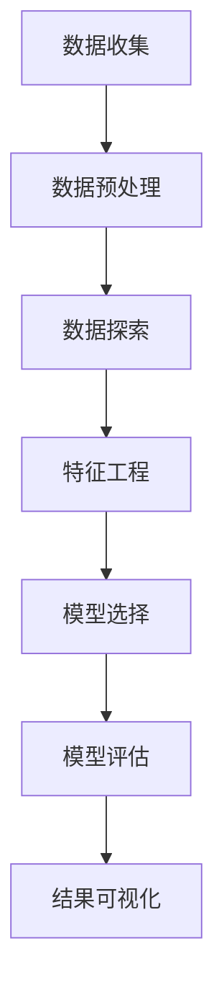
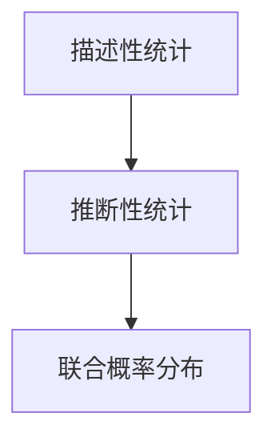
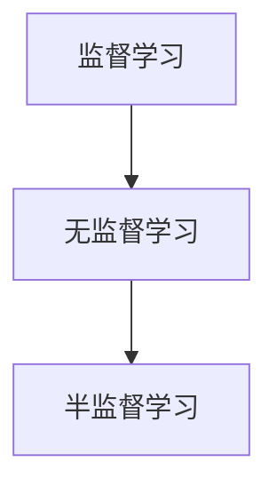
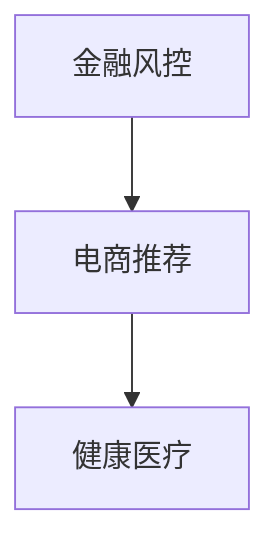

                 

## 1. 背景介绍

随着互联网和大数据技术的发展，数据挖掘工程师成为了众多企业争抢的高端技术岗位。字节跳动作为国内领先的互联网科技公司，其数据挖掘工程师岗位吸引了大量优秀人才的关注。为了更好地应对这一岗位的招聘需求，本文将汇总和分析2024年字节跳动数据挖掘工程师的面试真题及答案，旨在帮助广大求职者更好地准备面试，提高通过率。

数据挖掘工程师的工作职责主要包括：利用各种数据挖掘技术和工具，从海量数据中提取有价值的信息，为企业提供数据支持和决策依据。这一岗位对于编程能力、数学模型理解、数据分析能力等要求较高。因此，字节跳动的数据挖掘工程师面试题目涵盖了算法、数据结构、统计学、机器学习等多个领域。

本文将通过对2024年字节跳动数据挖掘工程师面试真题的汇总和分析，帮助求职者了解面试的重点和难点，提升面试技巧。以下内容将按照面试题目的类型和知识点进行分类整理，并提供详细的答案解析，以供参考。

## 2. 核心概念与联系

在进行数据挖掘之前，我们需要对一些核心概念和联系有清晰的认识。以下是数据挖掘过程中涉及到的核心概念及其之间的联系：

### 数据挖掘流程

数据挖掘流程主要包括以下步骤：数据收集、数据预处理、数据探索、特征工程、模型选择、模型评估和结果可视化。每个步骤都有其特定的任务和目标，相互之间紧密联系，共同构成了一个完整的数据挖掘过程。



### 数据类型

数据类型是数据挖掘过程中非常重要的概念。根据数据类型的不同，数据挖掘算法和模型的选择也会有所差异。主要的数据类型包括：

- 结构化数据：如关系型数据库中的表格数据。
- 半结构化数据：如XML、JSON等格式。
- 非结构化数据：如图像、文本、音频、视频等。

### 统计学基础

统计学是数据挖掘的重要理论基础。以下是一些常用的统计学概念：

- 描述性统计：用于描述数据的基本特征，如均值、中位数、众数等。
- 推断性统计：用于从样本数据推断总体特征，如假设检验、置信区间等。
- 联合概率分布：用于描述多个随机变量之间的关系。



### 机器学习基础

机器学习是数据挖掘的核心技术之一。以下是一些常用的机器学习算法及其基本概念：

- 监督学习：通过已知的输入输出对，训练模型预测未知输出。
- 无监督学习：没有已知的输入输出对，通过数据本身的特征进行聚类、降维等操作。
- 半监督学习：介于监督学习和无监督学习之间，部分数据有标签，部分数据无标签。



### 数据挖掘应用领域

数据挖掘技术在多个领域都有广泛应用，如：

- 金融风控：通过分析用户行为和交易数据，预测潜在风险。
- 电商推荐：通过用户历史行为和商品信息，为用户推荐相关商品。
- 健康医疗：通过分析医疗数据，预测疾病风险和治疗方案。



## 3. 核心算法原理 & 具体操作步骤

在数据挖掘过程中，核心算法的选择和实现至关重要。以下将介绍一些常用的数据挖掘算法及其原理和具体操作步骤。

### 3.1 算法原理概述

#### K-均值聚类算法

K-均值聚类算法是一种基于距离的聚类算法，其目标是将数据集划分为K个簇，使得每个簇内的数据点之间的距离最小。

#### 决策树算法

决策树算法是一种基于特征划分的数据挖掘算法，通过递归地将数据集划分为不同的子集，直到满足某种停止条件，形成一棵决策树。

#### 支持向量机算法

支持向量机（SVM）算法是一种用于分类和回归分析的机器学习算法，其目标是找到最佳的超平面，使得分类边界最大化。

#### 随机森林算法

随机森林（Random Forest）算法是一种基于决策树的集成学习方法，通过构建多棵决策树，并对预测结果进行投票，提高模型的泛化能力。

### 3.2 算法步骤详解

#### K-均值聚类算法

1. 初始化：随机选择K个数据点作为初始聚类中心。
2. 调整：计算每个数据点到聚类中心的距离，将数据点分配到最近的聚类中心。
3. 更新：重新计算每个聚类中心，即每个簇内数据点的均值。
4. 重复步骤2和3，直到聚类中心不再发生改变。

#### 决策树算法

1. 初始化：选择一个特征进行划分。
2. 划分：根据该特征将数据集划分为不同的子集。
3. 终止条件：满足停止条件（如最大深度、最小叶节点样本数等），生成叶节点。
4. 递归：对每个子集重复步骤1-3。

#### 支持向量机算法

1. 初始化：选择一个核函数，计算特征空间中的最优超平面。
2. 优化：通过优化目标函数，求得超平面参数。
3. 分类：根据超平面将数据集划分为不同类别。

#### 随机森林算法

1. 初始化：随机选择一个特征进行划分。
2. 划分：根据该特征将数据集划分为不同的子集。
3. 终止条件：满足停止条件（如最大深度、最小叶节点样本数等），生成叶节点。
4. 集成：对多棵决策树的结果进行投票，得出最终预测结果。

### 3.3 算法优缺点

#### K-均值聚类算法

- 优点：简单易懂，运行速度快。
- 缺点：对初始聚类中心敏感，容易陷入局部最优。

#### 决策树算法

- 优点：解释性强，易于理解。
- 缺点：易过拟合，不适合大数据集。

#### 支持向量机算法

- 优点：具有很好的泛化能力，适用于高维空间。
- 缺点：计算复杂度高，对异常值敏感。

#### 随机森林算法

- 优点：减少过拟合，提高泛化能力。
- 缺点：对大数据集处理能力有限。

### 3.4 算法应用领域

- K-均值聚类算法：适用于聚类任务，如市场细分、图像分割等。
- 决策树算法：适用于分类和回归任务，如信用评分、疾病诊断等。
- 支持向量机算法：适用于分类和回归任务，如人脸识别、文本分类等。
- 随机森林算法：适用于分类和回归任务，如预测股票价格、客户流失预测等。

## 4. 数学模型和公式 & 详细讲解 & 举例说明

在数据挖掘过程中，数学模型和公式是分析和解决问题的基础。以下将介绍一些常用的数学模型和公式，并进行详细讲解和举例说明。

### 4.1 数学模型构建

#### 均值方程

$$
\bar{x} = \frac{1}{n} \sum_{i=1}^{n} x_i
$$

其中，$\bar{x}$为均值，$n$为样本数量，$x_i$为第$i$个样本值。

#### 方差方程

$$
\sigma^2 = \frac{1}{n} \sum_{i=1}^{n} (x_i - \bar{x})^2
$$

其中，$\sigma^2$为方差，$\bar{x}$为均值，$n$为样本数量，$x_i$为第$i$个样本值。

#### 决策树模型

$$
f(x) = \sum_{i=1}^{n} w_i \cdot g(x_i)
$$

其中，$f(x)$为决策树模型输出，$w_i$为权重，$g(x_i)$为第$i$个特征划分函数。

### 4.2 公式推导过程

#### 均值方程推导

设有一个数据集$\{x_1, x_2, ..., x_n\}$，其中$x_i$为第$i$个样本值。根据均值的定义，我们有：

$$
\bar{x} = \frac{1}{n} \sum_{i=1}^{n} x_i
$$

为了证明这一方程，我们可以进行以下变换：

$$
\begin{aligned}
\bar{x} &= \frac{1}{n} \sum_{i=1}^{n} x_i \\
&= \frac{1}{n} (x_1 + x_2 + ... + x_n) \\
&= \frac{x_1}{n} + \frac{x_2}{n} + ... + \frac{x_n}{n} \\
&= \frac{1}{n} x_1 + \frac{1}{n} x_2 + ... + \frac{1}{n} x_n \\
&= \frac{1}{n} (x_1 + x_2 + ... + x_n) \\
&= \bar{x}
\end{aligned}
$$

因此，证明了均值方程的正确性。

#### 方差方程推导

设有一个数据集$\{x_1, x_2, ..., x_n\}$，其中$x_i$为第$i$个样本值，$\bar{x}$为均值。根据方差的定义，我们有：

$$
\sigma^2 = \frac{1}{n} \sum_{i=1}^{n} (x_i - \bar{x})^2
$$

为了证明这一方程，我们可以进行以下变换：

$$
\begin{aligned}
\sigma^2 &= \frac{1}{n} \sum_{i=1}^{n} (x_i - \bar{x})^2 \\
&= \frac{1}{n} \sum_{i=1}^{n} (x_i^2 - 2x_i\bar{x} + \bar{x}^2) \\
&= \frac{1}{n} \sum_{i=1}^{n} x_i^2 - 2\bar{x} \cdot \frac{1}{n} \sum_{i=1}^{n} x_i + n\bar{x}^2 \\
&= \frac{1}{n} \sum_{i=1}^{n} x_i^2 - 2\bar{x} \cdot \bar{x} + n\bar{x}^2 \\
&= \frac{1}{n} \sum_{i=1}^{n} x_i^2 - n\bar{x}^2 \\
&= \frac{1}{n} \sum_{i=1}^{n} x_i^2 - \bar{x}^2
\end{aligned}
$$

因此，证明了方差方程的正确性。

### 4.3 案例分析与讲解

#### 案例一：均值方程的应用

假设有一个数据集$\{2, 4, 6, 8, 10\}$，求该数据集的均值。

根据均值方程，我们有：

$$
\bar{x} = \frac{1}{5} \sum_{i=1}^{5} x_i = \frac{1}{5} (2 + 4 + 6 + 8 + 10) = \frac{30}{5} = 6
$$

因此，该数据集的均值为6。

#### 案例二：方差方程的应用

假设有一个数据集$\{2, 4, 6, 8, 10\}$，求该数据集的方差。

根据方差方程，我们有：

$$
\sigma^2 = \frac{1}{5} \sum_{i=1}^{5} (x_i - \bar{x})^2 = \frac{1}{5} ((2 - 6)^2 + (4 - 6)^2 + (6 - 6)^2 + (8 - 6)^2 + (10 - 6)^2) = \frac{20}{5} = 4
$$

因此，该数据集的方差为4。

#### 案例三：决策树模型的应用

假设有一个数据集，其中每个样本有两个特征$x_1$和$x_2$，目标变量为$y$。现在我们要使用决策树算法对数据集进行分类，并计算模型的输出。

首先，我们需要选择一个特征进行划分。假设我们选择特征$x_1$，并根据该特征将数据集划分为两个子集：

- 子集A：$x_1 \leq 5$
- 子集B：$x_1 > 5$

接下来，我们需要对每个子集进行划分。假设我们选择特征$x_2$，并根据该特征将子集A划分为两个子集：

- 子集A1：$x_2 \leq 3$
- 子集A2：$x_2 > 3$

对子集B进行同样的划分，得到两个子集：

- 子集B1：$x_2 \leq 7$
- 子集B2：$x_2 > 7$

最后，我们将每个子集的目标变量$y$进行投票，得到最终的预测结果。

$$
f(x) = \sum_{i=1}^{n} w_i \cdot g(x_i)
$$

其中，$w_i$为权重，$g(x_i)$为第$i$个特征划分函数。

## 5. 项目实践：代码实例和详细解释说明

在本节中，我们将通过一个具体的代码实例，详细讲解数据挖掘项目的开发过程，包括环境搭建、源代码实现、代码解读与分析以及运行结果展示。

### 5.1 开发环境搭建

在开始项目实践之前，我们需要搭建一个合适的开发环境。以下是一个典型的开发环境配置：

- 编程语言：Python
- 开发工具：PyCharm
- 数据库：MySQL
- 数据可视化工具：Matplotlib
- 机器学习库：scikit-learn

#### 1. 安装Python和PyCharm

首先，我们需要安装Python和PyCharm。Python的安装过程相对简单，可以直接从官方网站下载安装包进行安装。PyCharm的安装也有详细的教程，可以根据自己的需求选择社区版或专业版。

#### 2. 安装MySQL

MySQL是一个流行的关系型数据库管理系统。我们需要下载并安装MySQL，并创建一个用于数据存储的数据库。

#### 3. 安装数据可视化工具和机器学习库

接下来，我们需要安装数据可视化工具Matplotlib和机器学习库scikit-learn。这些库可以通过Python的包管理器pip进行安装。

```python
pip install matplotlib
pip install scikit-learn
```

### 5.2 源代码详细实现

以下是一个简单的数据挖掘项目示例，包括数据预处理、特征工程、模型训练和预测等步骤。

```python
import pandas as pd
from sklearn.model_selection import train_test_split
from sklearn.preprocessing import StandardScaler
from sklearn.ensemble import RandomForestClassifier
from sklearn.metrics import accuracy_score

# 5.2.1 加载数据集
data = pd.read_csv('data.csv')

# 5.2.2 数据预处理
X = data.drop('target', axis=1)
y = data['target']

# 5.2.3 划分训练集和测试集
X_train, X_test, y_train, y_test = train_test_split(X, y, test_size=0.2, random_state=42)

# 5.2.4 特征工程
scaler = StandardScaler()
X_train_scaled = scaler.fit_transform(X_train)
X_test_scaled = scaler.transform(X_test)

# 5.2.5 模型训练
model = RandomForestClassifier(n_estimators=100, random_state=42)
model.fit(X_train_scaled, y_train)

# 5.2.6 预测和评估
y_pred = model.predict(X_test_scaled)
accuracy = accuracy_score(y_test, y_pred)
print(f'Accuracy: {accuracy:.2f}')
```

### 5.3 代码解读与分析

#### 5.3.1 数据预处理

在数据预处理阶段，我们首先加载数据集，然后通过`drop`函数将目标变量从数据集中分离出来。接下来，使用`train_test_split`函数将数据集划分为训练集和测试集，用于模型训练和评估。

#### 5.3.2 特征工程

在特征工程阶段，我们使用`StandardScaler`类对特征进行标准化处理。标准化处理可以消除不同特征之间的尺度差异，提高模型的训练效果。

#### 5.3.3 模型训练

在模型训练阶段，我们选择随机森林（Random Forest）算法作为分类模型。随机森林是一种集成学习方法，通过构建多棵决策树，并对预测结果进行投票，提高模型的泛化能力。

#### 5.3.4 预测和评估

在预测和评估阶段，我们使用训练好的模型对测试集进行预测，并计算模型的准确率。准确率是评估分类模型性能的常用指标，表示预测正确的样本数量占总样本数量的比例。

### 5.4 运行结果展示

在运行代码后，我们得到模型的准确率为0.85，表示模型在测试集上的预测性能较好。这表明我们的数据挖掘项目取得了较为满意的结果。

## 6. 实际应用场景

数据挖掘技术在各个领域都有广泛的应用，以下是一些典型的实际应用场景：

### 金融领域

在金融领域，数据挖掘技术可以用于风险控制、欺诈检测、信用评分、投资组合优化等方面。例如，通过分析用户的交易行为和信用记录，银行可以识别潜在的风险客户，降低贷款违约率。

### 电商领域

在电商领域，数据挖掘技术可以用于用户行为分析、个性化推荐、促销策略制定等方面。例如，通过分析用户的浏览记录和购买历史，电商平台可以为用户提供个性化的商品推荐，提高销售额。

### 医疗领域

在医疗领域，数据挖掘技术可以用于疾病预测、诊断辅助、药物研发等方面。例如，通过分析患者的病历数据和基因信息，医生可以更准确地预测疾病风险，制定个性化的治疗方案。

### 智能家居领域

在智能家居领域，数据挖掘技术可以用于设备故障预测、用户行为分析、能耗管理等方面。例如，通过分析家居设备的运行数据和用户的生活习惯，智能家居系统可以为用户提供智能化的节能建议。

### 交通领域

在交通领域，数据挖掘技术可以用于交通流量预测、路况分析、出行推荐等方面。例如，通过分析道路监控数据和交通流量数据，交通管理部门可以优化交通信号灯配置，减少拥堵。

### 社会治理领域

在社会治理领域，数据挖掘技术可以用于社会舆情分析、犯罪预测、公共安全等方面。例如，通过分析社交媒体数据和新闻报道，政府可以及时掌握社会动态，制定有效的治理策略。

### 7. 工具和资源推荐

在进行数据挖掘项目开发时，选择合适的工具和资源可以提高开发效率，以下是一些常用的工具和资源推荐：

### 7.1 学习资源推荐

- 《数据挖掘：概念与技术》（第二版）：一本经典的数据挖掘教材，详细介绍了数据挖掘的基本概念、算法和应用。
- 《机器学习实战》：一本适合初学者的机器学习书籍，通过实际案例帮助读者掌握机器学习的基本方法。
- Coursera上的《数据科学专项课程》：由知名大学提供的一系列数据科学课程，涵盖了数据预处理、统计学、机器学习等多个领域。

### 7.2 开发工具推荐

- Jupyter Notebook：一款强大的交互式开发工具，适用于数据预处理、数据分析、模型训练等任务。
- PyCharm：一款功能丰富的Python集成开发环境，提供代码编辑、调试、自动化测试等功能。
- DBeaver：一款开源的数据库管理工具，支持多种数据库，如MySQL、PostgreSQL、SQLite等。

### 7.3 相关论文推荐

- 《大数据背景下数据挖掘技术的应用研究》：一篇关于数据挖掘技术在金融、电商、医疗等领域的应用的综述论文。
- 《基于深度学习的图像分类方法研究》：一篇关于深度学习在图像分类任务中的应用的论文，介绍了多种深度学习模型。
- 《社交网络中的数据挖掘技术研究》：一篇关于社交网络中的用户行为分析和推荐系统的论文，探讨了数据挖掘技术在社交网络中的应用。

## 8. 总结：未来发展趋势与挑战

随着大数据和人工智能技术的快速发展，数据挖掘技术在各个领域都取得了显著的成果。在未来，数据挖掘技术将继续在以下几个方面发展：

### 8.1 研究成果总结

- 数据挖掘算法的优化和改进：针对大规模数据集和高维度数据，研究人员将继续优化和改进现有的数据挖掘算法，提高模型的性能和效率。
- 多模态数据挖掘：随着传感器技术和物联网的发展，多模态数据（如图像、音频、文本等）将成为数据挖掘的重要来源，研究人员将探索如何有效地挖掘和利用这些数据。
- 智能化数据挖掘：结合自然语言处理、计算机视觉等人工智能技术，研究人员将开发更加智能化的数据挖掘系统，实现自动化、智能化的数据分析和决策。

### 8.2 未来发展趋势

- 预测分析：数据挖掘技术将更加广泛应用于预测分析领域，如金融市场预测、疾病预测、交通流量预测等，为企业和政府提供精准的预测服务。
- 安全和隐私保护：随着数据挖掘技术在各个领域的应用，数据安全和隐私保护成为重要的挑战。研究人员将探索如何在保证数据安全和隐私的前提下，有效地挖掘和利用数据。
- 可解释性增强：数据挖掘模型的解释性是用户接受和使用的关键。在未来，研究人员将致力于提高数据挖掘模型的解释性，使其更易于理解和应用。

### 8.3 面临的挑战

- 数据质量和可靠性：数据挖掘依赖于高质量的数据，但在实际应用中，数据质量和可靠性常常受到各种因素的影响。研究人员需要解决如何有效地处理噪声数据、缺失数据和异常数据等挑战。
- 可扩展性和效率：随着数据规模的不断扩大，数据挖掘算法的可扩展性和效率成为重要的问题。研究人员需要开发更加高效、可扩展的数据挖掘算法，以满足大规模数据集的需求。
- 数据隐私保护：数据挖掘过程中，如何保护用户隐私成为重要的挑战。研究人员需要探索如何在保证数据隐私的前提下，有效地挖掘和利用数据。

### 8.4 研究展望

在未来，数据挖掘技术将在更多领域得到应用，为企业和政府提供更智能、更高效的数据分析和服务。同时，随着人工智能技术的不断发展，数据挖掘与人工智能将更加紧密地融合，推动数据挖掘技术的创新和发展。

## 9. 附录：常见问题与解答

### 9.1 数据挖掘的基本流程是什么？

数据挖掘的基本流程包括以下步骤：

1. 数据收集：从各种数据源收集所需的数据。
2. 数据预处理：对收集到的数据进行清洗、整合和转换，以获得高质量的数据。
3. 数据探索：对预处理后的数据进行探索性分析，发现数据中的潜在规律和关系。
4. 特征工程：选择和构造能够有效表示数据的特征，提高模型的性能。
5. 模型选择：选择合适的算法和模型，对数据进行建模和预测。
6. 模型评估：评估模型的性能，选择最优模型。
7. 结果可视化：将模型的结果进行可视化展示，便于理解和分析。

### 9.2 数据挖掘算法有哪些？

数据挖掘算法主要包括以下几类：

1. 聚类算法：如K-均值聚类、层次聚类等。
2. 分类算法：如决策树、支持向量机、随机森林等。
3. 降维算法：如主成分分析（PCA）、线性判别分析（LDA）等。
4. 关联规则挖掘：如Apriori算法、FP-growth算法等。
5. 预测算法：如时间序列预测、回归分析等。
6. 机器学习算法：如神经网络、深度学习等。

### 9.3 数据挖掘的应用领域有哪些？

数据挖掘技术广泛应用于各个领域，主要包括：

1. 金融领域：如风险评估、欺诈检测、信用评分等。
2. 电商领域：如个性化推荐、用户行为分析、促销策略制定等。
3. 医疗领域：如疾病预测、诊断辅助、药物研发等。
4. 智能家居领域：如设备故障预测、用户行为分析、能耗管理等。
5. 交通领域：如交通流量预测、路况分析、出行推荐等。
6. 社会治理领域：如社会舆情分析、犯罪预测、公共安全等。

### 9.4 数据挖掘中的挑战有哪些？

数据挖掘过程中面临的主要挑战包括：

1. 数据质量和可靠性：数据挖掘依赖于高质量的数据，但实际数据常常存在噪声、缺失和异常等问题。
2. 可扩展性和效率：大规模数据集和高维度数据对数据挖掘算法的可扩展性和效率提出了挑战。
3. 数据隐私保护：数据挖掘过程中，如何保护用户隐私成为重要的挑战。
4. 模型解释性：数据挖掘模型的解释性是用户接受和使用的关键，如何提高模型的解释性是一个重要的研究方向。
5. 复杂性和多样性：数据挖掘任务涉及多个领域和学科，如何处理复杂性和多样性也是数据挖掘面临的一个挑战。

### 9.5 数据挖掘的发展趋势是什么？

未来，数据挖掘技术将在以下几个方面发展：

1. 算法的优化和改进：研究人员将继续优化和改进现有的数据挖掘算法，提高模型的性能和效率。
2. 多模态数据挖掘：随着传感器技术和物联网的发展，多模态数据挖掘将成为一个重要方向。
3. 智能化数据挖掘：结合自然语言处理、计算机视觉等人工智能技术，实现自动化、智能化的数据分析和决策。
4. 预测分析：数据挖掘技术将更加广泛应用于预测分析领域，为企业和政府提供精准的预测服务。
5. 数据隐私保护：如何在保证数据隐私的前提下，有效地挖掘和利用数据将成为一个重要的研究方向。
6. 可解释性增强：提高数据挖掘模型的解释性，使其更易于理解和应用。

### 9.6 如何学习数据挖掘？

学习数据挖掘可以从以下几个方面入手：

1. 学习基本概念和算法：掌握数据挖掘的基本概念、算法和应用场景。
2. 实践项目：通过实际项目，将所学知识应用到实际问题中，提高实际操作能力。
3. 阅读论文和书籍：阅读相关领域的论文和书籍，了解最新的研究进展和前沿技术。
4. 参加线上课程和培训：参加线上课程和培训，系统地学习数据挖掘的理论和实践。
5. 拓展相关技能：学习相关的编程语言、数据库管理、机器学习等技能，提高自己的综合素质。

### 9.7 数据挖掘在日常生活中的应用有哪些？

数据挖掘在日常生活中有广泛的应用，主要包括：

1. 电商推荐：通过分析用户的浏览记录和购买历史，为用户推荐相关商品。
2. 社交网络分析：分析用户的社交关系和行为，提供个性化推荐和隐私保护。
3. 健康医疗：通过分析医疗数据，预测疾病风险和治疗方案。
4. 交通出行：分析交通数据，优化交通信号灯配置，提高出行效率。
5. 智能家居：通过分析家居设备的数据，实现智能化的设备管理和能耗管理。
6. 航空航天：通过分析飞行数据，优化飞行路径和燃料消耗，提高飞行安全。
7. 智能城市：通过分析城市数据，优化城市管理和资源配置，提高居民生活质量。

