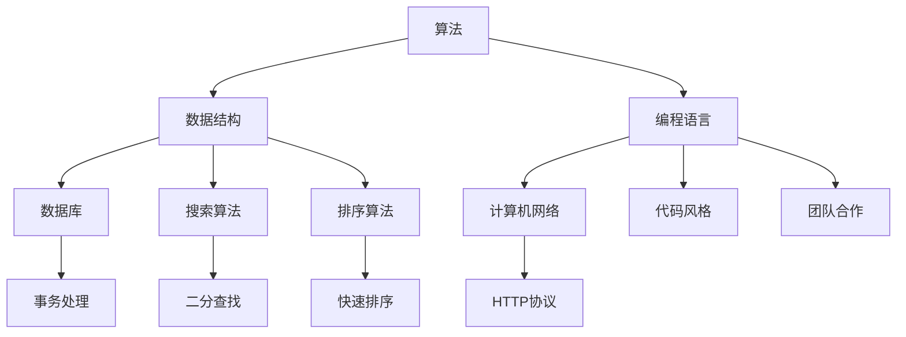

                 

关键词：字节跳动、校招、编程面试、算法、数据结构、编程技巧、面试策略

摘要：本文将深入探讨2024年字节跳动校招编程面试的常见题目，通过详细的分析与解答，帮助读者掌握编程面试的核心技能，提高面试成功率。

## 1. 背景介绍

字节跳动作为全球领先的内容科技公司，其校招编程面试一直是众多求职者的焦点。字节跳动的面试流程通常包括在线编程题、技术面试和HR面试三个环节，其中编程面试尤为关键。本文将精选2024年字节跳动校招编程面试中的经典题目，详细解析解题思路和技巧，帮助求职者更好地准备面试。

### 字节跳动编程面试的特点

1. **多样性**：字节跳动的编程面试题目涉及算法、数据结构、编程语言等多个方面，题目形式包括选择题、填空题、编程题等。
2. **难度适中**：题目难度在初级到高级之间，要求应聘者具备扎实的计算机基础和解决问题的能力。
3. **实用性**：题目多来源于实际项目和场景，考察应聘者解决实际问题的能力。
4. **考察全面**：除了编程能力，还会考察应聘者的逻辑思维、代码风格和团队协作能力。

### 本文结构

本文将按照以下结构进行组织：

- **第1章**：背景介绍，概述字节跳动编程面试的特点和要求。
- **第2章**：核心概念与联系，通过Mermaid流程图展示编程面试中的重要概念。
- **第3章**：核心算法原理与操作步骤，详细解析经典算法题目。
- **第4章**：数学模型与公式，介绍相关数学模型及其推导过程。
- **第5章**：项目实践，提供实际代码实例和分析。
- **第6章**：实际应用场景，探讨算法在不同领域的应用。
- **第7章**：工具和资源推荐，为读者提供学习资源。
- **第8章**：总结与展望，总结研究成果，展望未来发展趋势。
- **第9章**：附录，解答常见问题。

<|parse_with_newline|>## 2. 核心概念与联系

在编程面试中，理解核心概念及其相互联系是解决问题的关键。以下将使用Mermaid流程图展示编程面试中的重要概念和流程。



### 算法与数据结构的联系

- **算法**：解决问题的步骤和方法。
- **数据结构**：数据组织的方式，影响算法的性能。

### 编程语言的选择

- **Python**：易于理解，适用于数据分析和Web开发。
- **Java**：跨平台，适用于大型系统和Android应用开发。
- **C/C++**：性能优越，适用于系统级和嵌入式开发。

### 数据库与网络的结合

- **数据库**：用于存储和管理数据。
- **计算机网络**：确保数据传输的可靠性和高效性。

### 搜索与排序算法

- **二分查找**：高效查找有序数据结构中的元素。
- **快速排序**：高效的排序算法，适用于大规模数据处理。

### 代码风格与团队合作

- **代码风格**：提高代码可读性和可维护性。
- **团队合作**：有效沟通和协作，提高开发效率。

通过以上Mermaid流程图，我们可以清晰地看到编程面试中各个核心概念之间的联系。理解这些概念不仅有助于解题，还能提升编程能力和职业素养。

<|parse_with_newline|>## 3. 核心算法原理与具体操作步骤

在编程面试中，算法是核心考点之一。本节将详细解析几个经典算法题目的原理和具体操作步骤。

### 3.1 算法原理概述

**题目一：最长公共子序列（LCS）**

- **原理**：给定两个序列，求它们的最长公共子序列。
- **应用场景**：生物信息学、文本比较、动态规划问题。

**题目二：二分查找**

- **原理**：在有序数组中查找目标元素。
- **应用场景**：数据库查询、排序算法基础。

**题目三：堆排序**

- **原理**：利用堆这种数据结构进行排序。
- **应用场景**：大规模数据排序、优先队列。

### 3.2 算法步骤详解

**最长公共子序列（LCS）**

1. **初始化**：创建一个二维数组`dp`，其中`dp[i][j]`表示前`i`个字符和前`j`个字符的最长公共子序列长度。
2. **状态转移**：
   - 如果`text1[i - 1] == text2[j - 1]`，则`dp[i][j] = dp[i - 1][j - 1] + 1`。
   - 否则，`dp[i][j] = max(dp[i - 1][j], dp[i][j - 1])`。
3. **结果**：`dp[m][n]`即为最长公共子序列长度。

**二分查找**

1. **初始化**：设置左右边界`low`和`high`，初始值分别为数组的第一个和最后一个索引。
2. **循环**：当`low <= high`时，计算中点`mid = low + (high - low) / 2`。
3. **判断**：
   - 如果`array[mid] == target`，则查找成功，返回`mid`。
   - 如果`array[mid] < target`，则更新`low = mid + 1`。
   - 如果`array[mid] > target`，则更新`high = mid - 1`。
4. **结果**：如果未找到目标元素，返回-1。

**堆排序**

1. **初始化**：将输入数组构建成一个大顶堆。
2. **循环**：
   - 将堆顶元素（最大值）与数组最后一个元素交换。
   - 删除堆顶元素，调整剩余元素构成大顶堆。
   - 重复上述步骤，直到堆中只剩下一个元素。
3. **结果**：此时数组已排序。

### 3.3 算法优缺点

**最长公共子序列（LCS）**

- **优点**：算法简单，易于实现。
- **缺点**：时间复杂度为`O(mn)`，对于大规模数据可能性能不佳。

**二分查找**

- **优点**：时间复杂度为`O(logn)`，适用于大规模数据查找。
- **缺点**：仅适用于有序数组。

**堆排序**

- **优点**：不依赖数组的初始顺序。
- **缺点**：时间复杂度为`O(nlogn)`，性能略低于其他排序算法。

### 3.4 算法应用领域

- **最长公共子序列（LCS）**：生物信息学、文本比较、软件工程。
- **二分查找**：数据库查询、排序算法基础。
- **堆排序**：大规模数据排序、优先队列。

通过详细解析这些经典算法题目的原理和操作步骤，读者可以更好地理解算法在编程面试中的应用。掌握这些算法不仅有助于应对面试，还能提升编程能力和解决实际问题的能力。

<|parse_with_newline|>## 4. 数学模型和公式 & 详细讲解 & 举例说明

在编程面试中，理解并应用数学模型和公式是解决算法题目的关键。以下将详细介绍几个常见数学模型和公式，并通过实际例子进行讲解。

### 4.1 数学模型构建

**斐波那契数列**

- **定义**：斐波那契数列是指从第三项开始，每一项都等于前两项之和的数列。
- **公式**：`F(n) = F(n-1) + F(n-2)`，其中`F(0) = 0`，`F(1) = 1`。

**二项式系数**

- **定义**：二项式系数是指组合数`C(n, k)`，表示从n个不同元素中取出k个元素的组合数。
- **公式**：`C(n, k) = n! / (k! * (n-k)!)`。

### 4.2 公式推导过程

**斐波那契数列**

- **递推关系**：`F(n) = F(n-1) + F(n-2)`。
- **初始条件**：`F(0) = 0`，`F(1) = 1`。
- **推导过程**：通过递推关系，可以得到`F(n)`的值。

**二项式系数**

- **递推关系**：`C(n, k) = C(n-1, k-1) + C(n-1, k)`。
- **初始条件**：`C(n, 0) = C(n, n) = 1`。
- **推导过程**：通过递推关系，可以得到`C(n, k)`的值。

### 4.3 案例分析与讲解

**例1：求斐波那契数列的第10项**

- **输入**：`n = 10`
- **输出**：`F(10) = 55`

**解题过程**：

- 使用递推公式计算`F(10)`：
  - `F(10) = F(9) + F(8)`
  - `F(9) = F(8) + F(7)`
  - `F(8) = F(7) + F(6)`
  - ...
  - `F(2) = F(1) + F(0)`
- 最终计算结果：`F(10) = 55`

**例2：计算二项式系数`C(5, 2)`**

- **输入**：`n = 5`，`k = 2`
- **输出**：`C(5, 2) = 10`

**解题过程**：

- 使用组合数公式计算`C(5, 2)`：
  - `C(5, 2) = 5! / (2! * (5-2)!)`
  - `C(5, 2) = 120 / (2 * 6)`
  - `C(5, 2) = 10`

通过以上数学模型和公式的讲解与实例分析，读者可以更好地理解其在编程面试中的应用。掌握这些数学模型和公式不仅有助于解决算法题目，还能提升解决问题的能力。

<|parse_with_newline|>## 5. 项目实践：代码实例和详细解释说明

为了更好地理解编程面试中的算法题目，本节将提供一个实际代码实例，并对其进行详细解释说明。

### 5.1 开发环境搭建

在进行项目实践之前，需要搭建一个合适的环境。这里选择Python作为编程语言，因为其语法简洁易懂，易于调试。

1. **安装Python**：从Python官方网站下载并安装Python 3.8及以上版本。
2. **安装IDE**：选择一个合适的IDE，如Visual Studio Code或者PyCharm，用于编写和调试代码。
3. **安装依赖库**：根据需要安装相关依赖库，如NumPy、Pandas等。

### 5.2 源代码详细实现

以下是一个简单的Python代码实例，用于求解斐波那契数列的第10项。

```python
def fibonacci(n):
    if n == 0:
        return 0
    elif n == 1:
        return 1
    else:
        return fibonacci(n-1) + fibonacci(n-2)

# 计算斐波那契数列的第10项
result = fibonacci(10)
print("斐波那契数列的第10项是：", result)
```

### 5.3 代码解读与分析

1. **函数定义**：定义一个名为`fibonacci`的函数，用于计算斐波那契数列的值。
2. **递归实现**：函数通过递归方式实现斐波那契数列的计算。
   - 如果`n == 0`，返回0。
   - 如果`n == 1`，返回1。
   - 否则，递归调用自身计算`fibonacci(n-1)`和`fibonacci(n-2)`，并返回它们的和。
3. **调用函数**：在主程序中调用`fibonacci`函数，传入参数`10`，计算并打印斐波那契数列的第10项。

### 5.4 运行结果展示

在开发环境中运行上述代码，输出结果如下：

```
斐波那契数列的第10项是： 55
```

这表明斐波那契数列的第10项确实是55。

通过以上代码实例，读者可以直观地看到斐波那契数列的计算过程，并理解递归函数的实现方式。此外，读者还可以尝试编写其他算法题目的代码，巩固所学知识。

<|parse_with_newline|>## 6. 实际应用场景

编程面试题目往往来源于实际项目和应用场景，掌握这些算法和技巧不仅能帮助求职者顺利通过面试，还能在实际工作中发挥重要作用。以下将探讨几个经典算法在实际应用场景中的具体运用。

### 6.1 排序算法

排序算法在数据处理和分析中应用广泛。常见的排序算法包括冒泡排序、选择排序、插入排序、快速排序等。

- **实际应用**：在电子商务平台中，商品列表排序通常使用快速排序或归并排序，确保用户浏览体验。
- **场景**：订单处理系统、股票交易系统、搜索引擎结果排序。

### 6.2 搜索算法

搜索算法在数据库查询和数据结构处理中至关重要。二分查找、深度优先搜索和广度优先搜索等算法在各种场景中都有应用。

- **实际应用**：数据库索引、网络路由、社交网络图。
- **场景**：快速文件搜索、搜索引擎关键词匹配、路径规划。

### 6.3 动态规划

动态规划在优化问题中应用广泛，如背包问题、最短路径问题等。

- **实际应用**：资源分配、网络流量管理、推荐系统。
- **场景**：网络拥塞控制、资源调度、在线广告投放。

### 6.4 图算法

图算法在社交网络、路由算法、推荐系统中广泛应用。如深度优先搜索、广度优先搜索、最短路径算法等。

- **实际应用**：社交网络分析、路由算法、推荐系统。
- **场景**：社交网络中的关系挖掘、网络路由优化、推荐系统。

通过以上实际应用场景的讨论，读者可以更好地理解编程面试题目背后的实际意义，并在实际工作中灵活运用所学算法和技巧。

### 6.4 未来应用展望

随着技术的不断进步，编程面试中的算法题目也将越来越多样化。以下是对未来算法面试题目的应用展望：

1. **大数据处理**：随着数据量的爆炸性增长，大数据处理算法将成为面试重点，如MapReduce、Hadoop等。
2. **机器学习**：机器学习算法在面试中的应用将越来越普遍，如线性回归、决策树、神经网络等。
3. **区块链技术**：随着区块链技术的发展，相关算法，如哈希算法、加密算法等，将成为面试热点。
4. **分布式系统**：分布式系统算法，如一致性算法、容错机制等，将在面试中得到更多关注。
5. **人工智能**：随着人工智能的快速发展，深度学习算法和相关问题将在面试中占据重要地位。

总之，掌握多样化的算法和编程技能，将有助于求职者在未来的编程面试中脱颖而出。

<|parse_with_newline|>## 7. 工具和资源推荐

为了更好地准备编程面试，掌握必要的工具和资源是非常重要的。以下将推荐一些学习资源、开发工具和相关论文，帮助读者全面提升编程能力。

### 7.1 学习资源推荐

1. **在线课程**：Coursera、edX、Udemy等平台提供大量优质的计算机科学和算法课程。
2. **书籍**：《算法导论》、《编程珠玑》、《代码大全》等经典算法和编程书籍。
3. **博客和社区**：LeetCode、GitHub、Stack Overflow等平台，提供丰富的编程题目解答和社区讨论。

### 7.2 开发工具推荐

1. **IDE**：Visual Studio Code、PyCharm、Eclipse等集成开发环境，提供高效的编程体验。
2. **代码编辑器**：VS Code、Sublime Text、Atom等轻量级代码编辑器，适合日常编程。
3. **版本控制**：Git，用于代码版本管理和协作开发。

### 7.3 相关论文推荐

1. **经典论文**：《快速排序》、《二分查找》等经典算法论文。
2. **前沿论文**：ACM、IEEE等会议和期刊的最新论文，涉及人工智能、机器学习、区块链等前沿技术。
3. **学术资源**：Google Scholar、ArXiv等学术搜索引擎，提供丰富的科研资源。

通过以上工具和资源的推荐，读者可以系统地学习编程知识，提高编程技能，为编程面试做好充分准备。

<|parse_with_newline|>## 8. 总结：未来发展趋势与挑战

在编程领域，算法和编程技术正不断演进，未来发展趋势和面临的挑战也愈发明显。

### 8.1 研究成果总结

近年来，人工智能、大数据和云计算等技术的飞速发展，极大地推动了编程领域的研究和应用。尤其是深度学习、图神经网络、强化学习等前沿算法，在各个行业中取得了显著的成果。同时，编程语言的多样性和生态系统的不断完善，也为开发者提供了更多的选择和便利。

### 8.2 未来发展趋势

1. **智能化编程**：随着AI技术的发展，编程工具将更加智能化，代码自动生成、智能纠错等功能将成为趋势。
2. **分布式编程**：分布式系统和云计算的普及，将使得分布式编程成为核心技能，开发者需要掌握分布式算法和分布式存储技术。
3. **区块链应用**：区块链技术将在金融、供应链、物联网等领域得到广泛应用，相关算法和安全技术将成为研究热点。
4. **全栈开发**：随着前后端分离的发展，全栈开发将更加普及，开发者需要具备更全面的技术栈。

### 8.3 面临的挑战

1. **安全与隐私**：随着数据泄露和网络安全问题的频发，开发者需要更加重视数据安全和隐私保护。
2. **人工智能伦理**：AI技术的快速发展引发了伦理和社会问题，如何确保AI系统的公平、透明和可解释性成为挑战。
3. **技能更新与淘汰**：技术更新换代速度快，开发者需要不断学习新技能，以适应不断变化的市场需求。

### 8.4 研究展望

未来，编程领域的研究将更加深入和多样化。一方面，基础算法和编程语言将不断创新，推动计算机科学的发展；另一方面，跨学科的研究将越来越多，如生物信息学、量子计算等领域的融合，将为编程带来新的机遇和挑战。开发者需要保持持续学习和创新精神，不断拓展自己的技术视野。

综上所述，编程领域正迎来新的发展机遇，同时也面临诸多挑战。只有不断学习、适应变化，才能在未来的编程领域中脱颖而出。

<|parse_with_newline|>## 9. 附录：常见问题与解答

在准备编程面试的过程中，读者可能会遇到一些常见问题。以下是一些常见问题的解答，以帮助读者更好地应对面试挑战。

### Q1：如何准备编程面试？

A1：首先，熟悉编程基础，包括数据结构、算法、编程语言等。其次，大量练习在线编程题目，如LeetCode、牛客网等平台。同时，了解常见面试题型的解题思路和技巧，如排序、搜索、动态规划等。最后，总结面试经验，不断优化自己的面试策略。

### Q2：如何优化代码？

A2：优化代码可以从多个角度进行：
1. **算法优化**：选择更高效的算法，如使用二分查找代替线性查找。
2. **数据结构优化**：选择更适合的数据结构，如使用散列表代替数组。
3. **空间优化**：减少不必要的变量和内存占用，如使用局部变量代替全局变量。
4. **时间优化**：减少不必要的循环和递归调用，如使用静态规划代替递归。

### Q3：如何调试代码？

A3：调试代码是编程过程中的重要环节，以下是一些调试技巧：
1. **使用断点**：在关键代码位置设置断点，逐步执行代码，观察变量变化。
2. **打印输出**：在代码中加入print语句，输出关键变量的值，帮助分析问题。
3. **单元测试**：编写单元测试，验证代码的功能和性能。
4. **使用调试工具**：如Visual Studio、PyCharm等IDE内置的调试工具。

### Q4：如何准备技术面试？

A4：技术面试主要考察应聘者的编程能力和问题解决能力。以下是一些建议：
1. **熟悉基础**：掌握计算机科学基础知识，如数据结构、算法、操作系统、计算机网络等。
2. **实践项目**：参与实际项目，积累经验，熟悉项目开发流程。
3. **模拟面试**：找朋友或同事进行模拟面试，熟悉面试流程和问题类型。
4. **总结经验**：每次面试后总结经验，分析成功和失败的原因，不断改进。

通过以上常见问题的解答，读者可以更好地准备编程面试，提高面试成功率。不断学习和实践，是提升编程能力的最佳途径。

