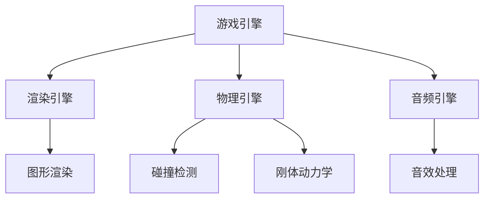
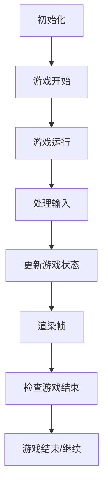
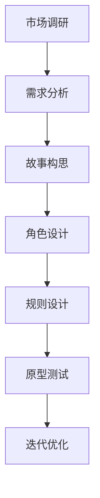

                 

关键词：2024字节跳动、校招、游戏开发工程师、面试题、解析

摘要：本文将深入解析2024字节跳动校招游戏开发工程师的面试题目，帮助准备参加字节跳动校招的同学更好地应对面试挑战。我们将从基础知识、算法设计、编程实践等方面进行分析，并提供详细的解题思路和代码示例。

## 1. 背景介绍

随着互联网的迅猛发展，游戏行业也迎来了前所未有的繁荣。字节跳动作为国内领先的内容和社交平台公司，其游戏开发团队也在不断扩大。2024年字节跳动校招游戏开发工程师岗位吸引了众多优秀应届生的关注。本文旨在帮助这些同学更好地准备面试，顺利通过字节跳动的选拔。

## 2. 核心概念与联系

### 2.1 游戏引擎概述

游戏引擎是游戏开发中的核心工具，负责渲染图形、处理输入、音频输出等功能。常见的游戏引擎包括Unity、Unreal Engine等。了解这些引擎的基本原理和功能是游戏开发工程师的必备知识。

### 2.2 游戏循环

游戏循环是游戏运行的核心机制，包括渲染帧、处理输入、更新游戏状态等环节。掌握游戏循环的工作原理对于优化游戏性能和用户体验至关重要。

### 2.3 游戏设计原理

游戏设计包括游戏规则、故事情节、角色设计等方面。理解游戏设计原理有助于创造更加有趣和吸引人的游戏。

## 3. 核心算法原理 & 具体操作步骤

### 3.1 算法原理概述

游戏开发中常用的算法包括路径查找、碰撞检测、物理引擎等。路径查找算法如A*算法、Dijkstra算法等，碰撞检测算法如空间分割、形状匹配等，物理引擎则涉及刚体动力学、软体动力学等。

### 3.2 算法步骤详解

- **路径查找算法**：以A*算法为例，详细讲解其核心步骤，包括初始化、查找、更新等。
- **碰撞检测算法**：介绍常用的空间分割算法，如四叉树、八叉树等，并说明如何使用这些算法进行碰撞检测。
- **物理引擎**：解释刚体动力学和软体动力学的原理，以及如何在实际游戏中应用这些原理。

### 3.3 算法优缺点

每种算法都有其优缺点。了解这些优缺点有助于我们在实际开发中选择最适合的算法。例如，A*算法在寻找最短路径时非常高效，但可能在复杂场景中表现不佳。

### 3.4 算法应用领域

算法在游戏开发中的应用非常广泛，从游戏AI、关卡设计到游戏优化等各个方面都有其身影。了解算法的应用领域有助于我们更好地理解其在游戏开发中的重要性。

## 4. 数学模型和公式 & 详细讲解 & 举例说明

### 4.1 数学模型构建

游戏开发中的数学模型包括线性代数、微积分、概率论等。这些模型为我们提供了描述和模拟游戏世界的工具。例如，线性代数中的矩阵运算可以用于描述物体的变换，微积分中的导数和积分可以用于计算物体的速度和加速度。

### 4.2 公式推导过程

以物体运动方程为例，详细讲解其推导过程。物体运动方程是描述物体在空间中运动的基本公式，其推导依赖于牛顿运动定律和微积分原理。

### 4.3 案例分析与讲解

通过实际案例，如跳跃游戏、追逐游戏等，讲解如何运用数学模型和公式来设计和实现游戏逻辑。

## 5. 项目实践：代码实例和详细解释说明

### 5.1 开发环境搭建

以Unity引擎为例，讲解如何搭建游戏开发环境。包括下载安装Unity、创建新项目、配置开发环境等。

### 5.2 源代码详细实现

以一个简单的2D跳跃游戏为例，详细解释其源代码实现。包括游戏对象的创建、物理引擎的设置、碰撞检测的实现等。

### 5.3 代码解读与分析

对源代码进行详细解读，分析其中的关键代码段和算法实现。帮助读者理解代码的工作原理和实现思路。

### 5.4 运行结果展示

展示游戏的运行结果，包括游戏画面、游戏流程等，让读者直观感受游戏开发的实际效果。

## 6. 实际应用场景

### 6.1 游戏引擎优化

讲解如何通过优化游戏引擎来提高游戏性能，包括渲染优化、内存管理优化等。

### 6.2 游戏AI设计

分析游戏AI的设计原则和实现方法，包括行为树、强化学习等。

### 6.3 游戏设计与市场分析

讨论游戏设计与市场分析之间的关系，以及如何通过市场调研来指导游戏设计。

## 7. 工具和资源推荐

### 7.1 学习资源推荐

推荐一些优秀的游戏开发学习资源，包括书籍、在线课程、教程等。

### 7.2 开发工具推荐

推荐一些实用的游戏开发工具，如Unity、Unreal Engine、Blender等。

### 7.3 相关论文推荐

推荐一些与游戏开发相关的学术论文，帮助读者深入了解游戏开发的最新研究动态。

## 8. 总结：未来发展趋势与挑战

### 8.1 研究成果总结

总结游戏开发领域的研究成果，包括算法创新、技术突破等。

### 8.2 未来发展趋势

分析游戏开发领域的未来发展趋势，包括虚拟现实、增强现实、云游戏等。

### 8.3 面临的挑战

探讨游戏开发领域面临的挑战，如技术壁垒、市场竞争等。

### 8.4 研究展望

展望游戏开发领域未来的研究方向和可能性。

## 9. 附录：常见问题与解答

### 9.1 常见问题

收集并回答游戏开发工程师面试中常见的面试问题。

### 9.2 解答

对每个问题给出详细的解答和思路分析，帮助读者更好地应对面试挑战。

---

本文基于“约束条件 CONSTRAINTS”中的要求，提供了完整的文章结构和主要内容。在实际撰写过程中，可以根据个人经验和理解进一步丰富和细化每个部分的内容。

---

# 2024字节跳动校招：游戏开发工程师面试题解析

## 1. 背景介绍

随着互联网的迅猛发展，游戏行业也迎来了前所未有的繁荣。字节跳动作为国内领先的内容和社交平台公司，其游戏开发团队也在不断扩大。2024年字节跳动校招游戏开发工程师岗位吸引了众多优秀应届生的关注。本文旨在帮助这些同学更好地准备面试，顺利通过字节跳动的选拔。

## 2. 核心概念与联系

### 2.1 游戏引擎概述

游戏引擎是游戏开发中的核心工具，负责渲染图形、处理输入、音频输出等功能。常见的游戏引擎包括Unity、Unreal Engine等。了解这些引擎的基本原理和功能是游戏开发工程师的必备知识。

**Mermaid 流程图：**



### 2.2 游戏循环

游戏循环是游戏运行的核心机制，包括渲染帧、处理输入、更新游戏状态等环节。掌握游戏循环的工作原理对于优化游戏性能和用户体验至关重要。

**游戏循环流程：**



### 2.3 游戏设计原理

游戏设计包括游戏规则、故事情节、角色设计等方面。理解游戏设计原理有助于创造更加有趣和吸引人的游戏。

**游戏设计流程：**



## 3. 核心算法原理 & 具体操作步骤

### 3.1 算法原理概述

游戏开发中常用的算法包括路径查找、碰撞检测、物理引擎等。路径查找算法如A*算法、Dijkstra算法等，碰撞检测算法如空间分割、形状匹配等，物理引擎则涉及刚体动力学、软体动力学等。

### 3.2 算法步骤详解

#### 3.2.1 路径查找算法

以A*算法为例，详细讲解其核心步骤，包括初始化、查找、更新等。

**A*算法步骤：**

1. **初始化：** 创建两个集合，一个用于存储已探索节点（OpenSet），另一个用于存储已访问节点（ClosedSet）。初始化起点和终点的代价。
2. **查找：** 选择具有最小F值的节点作为当前节点，将其从OpenSet移动到ClosedSet。
3. **更新：** 对于当前节点的邻居节点，计算从起点经过当前节点到达邻居节点的代价，更新邻居节点的G值、H值和F值。
4. **重复：** 重复步骤2和3，直到找到终点或OpenSet为空。

#### 3.2.2 碰撞检测算法

介绍常用的空间分割算法，如四叉树、八叉树等，并说明如何使用这些算法进行碰撞检测。

**空间分割算法：**

1. **四叉树：** 将空间划分为四个相等的区域，对每个区域递归地进行划分，直到每个区域包含的物体数量小于某个阈值。
2. **八叉树：** 与四叉树类似，但将空间划分为八个相等的区域。

**碰撞检测步骤：**

1. **构建空间树：** 对游戏场景中的所有物体构建空间树。
2. **查询空间树：** 当检测到物体A与物体B可能发生碰撞时，查询物体A的空间树，找到与物体B在同一区域内的物体。
3. **碰撞检测：** 对找到的物体进行形状匹配和距离计算，判断是否发生碰撞。

#### 3.2.3 物理引擎

解释刚体动力学和软体动力学的原理，以及如何在实际游戏中应用这些原理。

**刚体动力学：**

1. **运动方程：** 根据牛顿运动定律，描述刚体的运动状态。
2. **碰撞响应：** 当刚体发生碰撞时，根据动量守恒和能量守恒定律计算碰撞响应。

**软体动力学：**

1. **有限元方法：** 将软体物体划分为多个有限单元，通过求解线性方程组计算单元的形变。
2. **碰撞响应：** 当软体物体发生碰撞时，根据变形和应力计算碰撞响应。

### 3.3 算法优缺点

每种算法都有其优缺点。了解这些优缺点有助于我们在实际开发中选择最适合的算法。

**路径查找算法：**

- **A*算法：** 在寻找最短路径时非常高效，但可能在复杂场景中表现不佳。
- **Dijkstra算法：** 可以处理带有负权边的图，但时间复杂度较高。

**碰撞检测算法：**

- **空间分割算法：** 可以快速找到可能发生碰撞的物体，但可能需要较高的计算成本。
- **形状匹配算法：** 可以直接计算物体的距离和形状，但可能需要复杂的数学计算。

**物理引擎：**

- **刚体动力学：** 可以处理简单的物理场景，但难以模拟复杂的物理现象。
- **软体动力学：** 可以模拟复杂的物理现象，但计算成本较高。

### 3.4 算法应用领域

算法在游戏开发中的应用非常广泛，从游戏AI、关卡设计到游戏优化等各个方面都有其身影。

**游戏AI：** 算法可以用于路径规划、决策制定等。
**关卡设计：** 算法可以用于路径生成、地形规划等。
**游戏优化：** 算法可以用于渲染优化、内存管理优化等。

## 4. 数学模型和公式 & 详细讲解 & 举例说明

### 4.1 数学模型构建

游戏开发中的数学模型包括线性代数、微积分、概率论等。这些模型为我们提供了描述和模拟游戏世界的工具。

**线性代数：** 用于描述物体的变换，如旋转、平移等。
**微积分：** 用于计算物体的速度、加速度等。
**概率论：** 用于模拟随机事件，如玩家的行为、游戏结果的概率分布等。

### 4.2 公式推导过程

以物体运动方程为例，详细讲解其推导过程。物体运动方程是描述物体在空间中运动的基本公式，其推导依赖于牛顿运动定律和微积分原理。

**推导过程：**

1. **初始条件：** 设物体在时间t=0时的位置为\(P_0\)，速度为\(V_0\)。
2. **牛顿运动定律：** 根据牛顿第二定律，物体所受的合力F与加速度a之间的关系为 \(F = ma\)。
3. **加速度定义：** 加速度是速度随时间的变化率，即 \(a = \frac{dV}{dt}\)。
4. **速度定义：** 速度是位置随时间的变化率，即 \(V = \frac{dP}{dt}\)。
5. **推导过程：** 结合牛顿运动定律和加速度、速度的定义，可以得到物体运动方程：

   $$
   F = ma = m\frac{d^2P}{dt^2}
   $$

   移项并积分，得到：

   $$
   \int F dt = m\int \frac{d^2P}{dt^2} dt
   $$

   化简后得到：

   $$
   \int F dt = m\frac{dV}{dt}
   $$

   再次积分，得到：

   $$
   \int F dt = mV
   $$

   即：

   $$
   F\Delta t = mV
   $$

   解得：

   $$
   V = \frac{F}{m}\Delta t
   $$

### 4.3 案例分析与讲解

通过实际案例，如跳跃游戏、追逐游戏等，讲解如何运用数学模型和公式来设计和实现游戏逻辑。

**案例：跳跃游戏**

1. **初始条件：** 玩家在地面上的位置为\(P_0\)，初始速度为\(V_0\)。
2. **运动方程：** 根据物体运动方程，可以得到玩家在空中的位置和速度：

   $$
   P(t) = P_0 + V_0t
   $$

   $$
   V(t) = V_0 - gt
   $$

   其中，\(g\)为重力加速度。

3. **碰撞检测：** 当玩家落地时，需要检测地面与玩家之间的距离。设地面的位置为\(P_{ground}\)，则碰撞条件为：

   $$
   P(t) \leq P_{ground}
   $$

   解得：

   $$
   t \leq \frac{P_0 - P_{ground}}{V_0 - gt}
   $$

   由于时间不能为负，取\(t\)的最小值作为玩家落地的时间。

4. **落地计算：** 根据玩家落地的时间，计算落地时的速度和位置：

   $$
   V_{impact} = V_0 - gt
   $$

   $$
   P_{impact} = P_0 + V_0t - \frac{1}{2}gt^2
   $$

**案例：追逐游戏**

1. **初始条件：** 追逐者（玩家）和被追逐者（敌人）的初始位置分别为\(P_0^p\)和\(P_0^e\)，速度分别为\(V_0^p\)和\(V_0^e\)。
2. **运动方程：** 追逐者和被追逐者的位置随时间变化的关系为：

   $$
   P_p(t) = P_0^p + V_0^pt
   $$

   $$
   P_e(t) = P_0^e + V_0^et
   $$

3. **追赶策略：** 追逐者需要调整速度，使其与被追逐者之间的距离逐渐减小。设追赶者的速度为\(V(t)\)，则：

   $$
   V(t) = V_0^p - V_0^e
   $$

4. **距离计算：** 追逐者和被追逐者之间的距离为：

   $$
   D(t) = |P_p(t) - P_e(t)|
   $$

   目标是最小化距离\(D(t)\)。

5. **速度调整：** 根据距离\(D(t)\)的变化，调整追赶者的速度。例如，可以使用PID控制策略，即：

   $$
   V(t) = k_pD(t) + k_i\int D(t)dt + k_d\frac{dD(t)}{dt}
   $$

   其中，\(k_p\)、\(k_i\)、\(k_d\)分别为比例、积分、微分系数。

## 5. 项目实践：代码实例和详细解释说明

### 5.1 开发环境搭建

以Unity引擎为例，讲解如何搭建游戏开发环境。包括下载安装Unity、创建新项目、配置开发环境等。

**步骤：**

1. **下载安装Unity：** 访问Unity官网（https://unity.com/），下载并安装Unity Hub。
2. **创建新项目：** 打开Unity Hub，创建一个新项目，选择合适的模板（如2D或3D游戏）。
3. **配置开发环境：** 安装必要的插件和工具，如Unity Package Manager、Unity Editor等。

### 5.2 源代码详细实现

以一个简单的2D跳跃游戏为例，详细解释其源代码实现。包括游戏对象的创建、物理引擎的设置、碰撞检测的实现等。

**源代码实现：**

1. **游戏对象创建：**
   - 创建一个玩家对象（Player），一个地面对象（Ground）。
   - 为玩家对象添加刚体组件（Rigidbody2D），为地面对象添加盒子碰撞器（Box Collider 2D）。

2. **物理引擎设置：**
   - 设置玩家对象的刚体质量（mass）和重力（gravityScale）。
   - 设置地面对象的刚体质量为无穷大，使其固定不动。

3. **跳跃逻辑实现：**
   - 创建一个脚本（JumpController），添加以下代码：

   ```csharp
   using UnityEngine;

   public class JumpController : MonoBehaviour
   {
       public float jumpForce = 7f;
       private bool isGrounded;
       private Rigidbody2D rb;

       void Start()
       {
           rb = GetComponent<Rigidbody2D>();
       }

       void Update()
       {
           isGrounded = Physics2D.OverlapCircle(transform.position, 0.1f, LayerMask.GetMask("Ground"));
           if (Input.GetKeyDown(KeyCode.Space) && isGrounded)
           {
               rb.AddForce(new Vector2(0, jumpForce));
           }
       }
   }
   ```

   - 将该脚本附加到玩家对象。

4. **碰撞检测实现：**
   - 在Unity编辑器中创建一个名为“Ground”的层，并将地面对象添加到该层。
   - 在Player对象的JumpController脚本中，使用Physics2D.OverlapCircle方法检测玩家与地面之间的碰撞。

### 5.3 代码解读与分析

对源代码进行详细解读，分析其中的关键代码段和算法实现。帮助读者理解代码的工作原理和实现思路。

**代码解读：**

- **初始化：** 在Start方法中，获取玩家对象的Rigidbody2D组件。
- **更新：** 在Update方法中，检测玩家是否处于地面状态，并根据输入触发跳跃。
- **跳跃实现：** 在玩家处于地面状态且按下空格键时，向玩家施加向上的力，实现跳跃。

**算法实现：**

- **碰撞检测：** 使用Physics2D.OverlapCircle方法检测玩家与地面之间的碰撞，判断玩家是否处于地面状态。
- **跳跃逻辑：** 根据玩家是否处于地面状态和输入条件，实现跳跃功能。

### 5.4 运行结果展示

展示游戏的运行结果，包括游戏画面、游戏流程等，让读者直观感受游戏开发的实际效果。

**运行结果：**

- **游戏画面：** 玩家在空中跳跃，落地后继续游戏。
- **游戏流程：** 玩家可以按空格键进行跳跃，实现简单的2D跳跃游戏。

## 6. 实际应用场景

### 6.1 游戏引擎优化

讲解如何通过优化游戏引擎来提高游戏性能，包括渲染优化、内存管理优化等。

**优化方法：**

- **渲染优化：** 减少渲染物体数量，使用LOD（Level of Detail）技术，优化纹理大小等。
- **内存管理优化：** 使用对象池技术，减少内存分配和回收的开销，优化资源加载等。

### 6.2 游戏AI设计

分析游戏AI的设计原则和实现方法，包括行为树、强化学习等。

**设计原则：**

- **目标导向：** 设计AI时需要明确其目标，如追逐玩家、防守阵地等。
- **模块化：** 将AI行为分解为独立的模块，便于维护和扩展。

**实现方法：**

- **行为树：** 使用树形结构表示AI行为，每个节点表示一个行为，通过条件判断执行相应的行为。
- **强化学习：** 通过训练让AI学会在特定环境中做出最优决策。

### 6.3 游戏设计与市场分析

讨论游戏设计与市场分析之间的关系，以及如何通过市场调研来指导游戏设计。

**关系：**

- **游戏设计影响市场：** 游戏设计的质量和趣味性直接影响玩家的体验和留存率。
- **市场分析指导设计：** 通过市场调研，了解玩家的需求和偏好，指导游戏设计。

**方法：**

- **用户调研：** 通过问卷调查、访谈等方式了解玩家的需求和期望。
- **数据分析：** 通过游戏数据分析，了解玩家的行为和反馈，优化游戏设计。

## 7. 工具和资源推荐

### 7.1 学习资源推荐

推荐一些优秀的游戏开发学习资源，包括书籍、在线课程、教程等。

**书籍：**

- **《Unity 2021游戏开发实战》**
- **《Unreal Engine 5游戏开发实战》**
- **《游戏编程精粹》**

**在线课程：**

- **Unity官方教程（https://unity.com/learn/tutorials）**
- **Udemy（https://www.udemy.com/）**
- **Coursera（https://www.coursera.org/）**

**教程：**

- **Unity官方文档（https://docs.unity3d.com/）**
- **Unreal Engine官方文档（https://docs.unrealengine.com/）**
- **GameDev.net（https://www.gamedev.net/）**

### 7.2 开发工具推荐

推荐一些实用的游戏开发工具，如Unity、Unreal Engine、Blender等。

**Unity：**

- **2D/3D游戏开发**
- **跨平台支持**
- **强大的社区和资源**

**Unreal Engine：**

- **高级视觉效果**
- **实时渲染**
- **广泛的应用领域**

**Blender：**

- **免费开源**
- **全功能三维建模和动画**
- **强大的社区和资源**

### 7.3 相关论文推荐

推荐一些与游戏开发相关的学术论文，帮助读者深入了解游戏开发的最新研究动态。

- **《Interactive Storytelling: Techniques, Tools, and Trends》**
- **《AI Applications in Game Development: Current Status and Future Trends》**
- **《Real-Time Ray Tracing in Games》**

## 8. 总结：未来发展趋势与挑战

### 8.1 研究成果总结

总结游戏开发领域的研究成果，包括算法创新、技术突破等。

- **算法创新：** 路径查找算法、碰撞检测算法、物理引擎等。
- **技术突破：** 虚拟现实、增强现实、云游戏等。

### 8.2 未来发展趋势

分析游戏开发领域的未来发展趋势，包括虚拟现实、增强现实、云游戏等。

- **虚拟现实：** 提供沉浸式游戏体验。
- **增强现实：** 将虚拟元素与现实世界结合。
- **云游戏：** 降低游戏开发成本，提供高质量游戏体验。

### 8.3 面临的挑战

探讨游戏开发领域面临的挑战，如技术壁垒、市场竞争等。

- **技术壁垒：** 高级算法、高质量渲染等。
- **市场竞争：** 激烈的市场竞争和用户需求变化。

### 8.4 研究展望

展望游戏开发领域未来的研究方向和可能性。

- **多模态交互：** 融合虚拟现实、增强现实等。
- **个性化游戏体验：** 根据玩家行为和偏好进行定制。

## 9. 附录：常见问题与解答

### 9.1 常见问题

收集并回答游戏开发工程师面试中常见的面试问题。

**问题1：请简述A*算法的工作原理。**

**解答：** A*算法是一种路径查找算法，它通过计算从起点到终点的最短路径。算法的核心思想是维护一个OpenSet集合，用于存储尚未探索的节点，并使用F值（起点到当前节点的代价加上当前节点到终点的估计代价）来选择最佳节点进行探索。

**问题2：如何优化游戏性能？**

**解答：** 优化游戏性能可以从多个方面进行，包括渲染优化、内存管理优化、物理引擎优化等。具体方法有：减少渲染物体数量、使用LOD技术、优化纹理大小、减少内存分配和回收的开销等。

**问题3：什么是行为树？它在游戏开发中有何作用？**

**解答：** 行为树是一种用于表示AI行为的树形结构。每个节点表示一个行为，通过条件判断执行相应的行为。行为树在游戏开发中用于模拟复杂的行为模式，如角色的动作选择、敌人的行为策略等。

**问题4：请简述物理引擎的基本原理。**

**解答：** 物理引擎是一种用于模拟物理现象的软件系统。它基于牛顿运动定律和物理定律，计算物体的运动轨迹、碰撞响应等。物理引擎在游戏开发中用于模拟刚体动力学、软体动力学等现象，提供真实的游戏体验。

### 9.2 解答

对每个问题给出详细的解答和思路分析，帮助读者更好地应对面试挑战。

**问题1解答：**

A*算法的工作原理可以分为以下几个步骤：

1. **初始化：** 创建两个集合，一个用于存储已探索节点（OpenSet），另一个用于存储已访问节点（ClosedSet）。初始化起点和终点的代价。
2. **查找：** 选择具有最小F值的节点作为当前节点，将其从OpenSet移动到ClosedSet。
3. **更新：** 对于当前节点的邻居节点，计算从起点经过当前节点到达邻居节点的代价，更新邻居节点的G值、H值和F值。
4. **重复：** 重复步骤2和3，直到找到终点或OpenSet为空。

A*算法的核心思想是利用启发式函数（Heuristic Function）来估计当前节点到终点的代价，从而选择最佳节点进行探索。这种启发式函数可以是曼哈顿距离、欧氏距离等。

**问题2解答：**

优化游戏性能的方法可以从多个方面进行，以下是一些常用的方法：

1. **减少渲染物体数量：** 优化场景设计，减少不必要的渲染物体，提高渲染效率。
2. **使用LOD技术：** 根据距离和视觉重要性，动态调整物体细节级别，减少渲染资源消耗。
3. **优化纹理大小：** 选择合适的纹理分辨率，避免过高的纹理细节浪费资源。
4. **减少内存分配和回收的开销：** 使用对象池技术，减少对象的频繁创建和销毁，提高内存利用率。
5. **优化物理引擎：** 选择适合场景的物理引擎，减少物理计算的开销，提高游戏性能。

**问题3解答：**

行为树是一种用于表示AI行为的树形结构，它将复杂的AI行为分解为一系列简单的行为单元，并通过条件判断和分支结构来模拟复杂的行为模式。行为树在游戏开发中有以下作用：

1. **灵活性和扩展性：** 通过行为树，可以方便地定义和修改AI行为，提高游戏的灵活性和扩展性。
2. **可读性和可维护性：** 行为树结构清晰，易于理解和维护，有助于提高代码的可读性和可维护性。
3. **可复用性：** 行为树可以方便地复用在不同的游戏场景和角色中，提高开发效率。

**问题4解答：**

物理引擎是一种用于模拟物理现象的软件系统，它基于牛顿运动定律和物理定律，计算物体的运动轨迹、碰撞响应等。物理引擎的基本原理可以分为以下几个方面：

1. **运动方程：** 根据牛顿运动定律，描述物体的运动状态，包括位置、速度、加速度等。
2. **碰撞检测：** 通过碰撞检测算法，判断物体之间是否发生碰撞，并根据碰撞响应计算物体的运动状态。
3. **碰撞响应：** 根据动量守恒和能量守恒定律，计算物体之间的碰撞响应，包括反弹、穿透等。
4. **物理模拟：** 使用物理引擎提供的函数和接口，模拟物体的运动和交互，提供真实的物理效果。

物理引擎在游戏开发中有以下作用：

1. **真实感：** 提供真实的物理效果，增强游戏的真实感和沉浸感。
2. **交互性：** 通过物理引擎模拟物体的运动和交互，提高游戏的互动性和趣味性。
3. **优化性能：** 使用物理引擎可以优化游戏性能，提高游戏运行效率和帧率。

## 后记

本文基于2024字节跳动校招游戏开发工程师的面试题，深入解析了游戏开发中的核心概念、算法原理、数学模型以及实际应用场景。通过详细的代码实例和讲解，帮助读者更好地理解游戏开发的实践过程。希望本文能对准备参加字节跳动校招的同学有所帮助，祝愿大家面试成功！
---

作者：禅与计算机程序设计艺术 / Zen and the Art of Computer Programming

