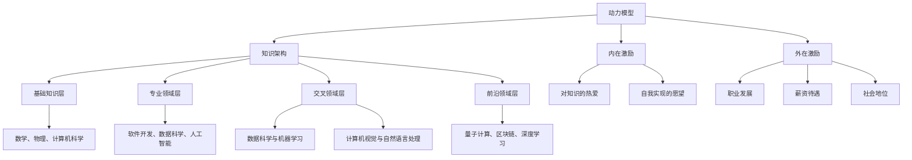

                 

关键词：学习体系、持续进化、动力模型、技术领域、知识架构、思维模式

> 摘要：本文探讨了学习体系的构建与持续进化的重要性，通过分析技术领域的动态发展和个体思维模式的演化，提出了一个具有实用性的学习体系模型，旨在帮助读者在快速变化的技术环境中不断进化和成长。本文的核心思想是，通过构建一个结构化的学习框架，并采用有效的学习策略，个体可以在不断演进的技术领域中保持竞争力，实现持续的个人和专业成长。

## 1. 背景介绍

在当今快速变化的信息时代，技术领域的演变速度前所未有。计算机科学、人工智能、大数据、物联网等新兴技术不断涌现，促使各行各业都在经历深刻的变革。作为技术人员，如何在这个快速变化的环境中持续学习、更新知识和技能，成为一个至关重要的课题。本文旨在探讨如何构建一个有效的学习体系，帮助个体在技术领域中实现持续进化和成长。

学习体系不仅仅是一个简单的知识积累过程，它涉及知识的获取、处理、整合和应用等多个环节。一个良好的学习体系应该是一个动态的、自我调整的系统，能够根据环境的变化和个体的需求不断进化。本文将围绕这一主题，提出一个具有实用性的学习体系模型，并探讨其在不同技术领域中的应用。

## 2. 核心概念与联系

### 2.1 动力模型

在构建学习体系的过程中，动力模型是一个核心概念。动力模型描述了个体在学习过程中所受到的各种内在和外在激励，以及这些激励如何驱动个体持续学习。内在激励包括对知识的热爱、自我实现的愿望等，而外在激励则包括职业发展、薪资待遇、社会地位等。

动力模型可以分为三个层次：基础动力、成长动力和成就动力。基础动力是学习体系的基础，它提供了个体学习的基本动力；成长动力是随着个体学习过程的深入而产生的，它促使个体不断挑战自我，追求更高层次的知识和技能；成就动力则是在个体取得显著成就时产生的，它进一步激励个体继续前进。

### 2.2 知识架构

知识架构是学习体系的另一个核心概念。一个良好的知识架构应该能够清晰地描述知识的分类、组织和层次，帮助个体有效地获取、处理和整合知识。知识架构通常包括以下几个层次：

- **基础知识层**：这是知识体系的基础，包括数学、物理、计算机科学等基本学科的知识。
- **专业领域层**：在这一层中，个体需要深入学习特定领域内的专业知识，如软件开发、数据科学、人工智能等。
- **交叉领域层**：这一层关注不同领域之间的交叉和融合，如数据科学和机器学习、计算机视觉和自然语言处理等。
- **前沿领域层**：这一层关注最新技术趋势和研究成果，如量子计算、区块链、深度学习等。

### 2.3 学习策略

学习策略是实现有效学习的关键。一个良好的学习策略应该能够根据个体的需求和学习目标，选择合适的学习方法、工具和资源。以下是几个常用的学习策略：

- **主动学习**：通过参与讨论、解决问题、实践应用等方式，主动探索和掌握知识。
- **反思学习**：通过回顾和反思自己的学习过程，发现和解决问题，提高学习效果。
- **协作学习**：通过与他人合作、交流和学习，共同提高知识和技能。
- **项目驱动学习**：通过实际项目来驱动学习，将理论知识应用到实践中。

### 2.4 动力模型与知识架构的互动

动力模型和知识架构之间存在着密切的互动关系。动力模型提供了个体学习的内在和外在激励，而知识架构则为个体提供了学习的目标和方向。当个体在知识架构的引导下，通过动力模型的驱动，不断学习和实践，就能够实现知识的积累和技能的提升。

此外，知识架构也可以根据动力模型的变化而调整。当个体的学习目标或兴趣发生变化时，知识架构可以相应地调整和优化，以适应新的学习需求。这种动态调整的能力，是学习体系能够持续进化的重要保障。

### 2.5 Mermaid 流程图

下面是一个Mermaid流程图，描述了动力模型和知识架构之间的互动关系：



## 3. 核心算法原理 & 具体操作步骤

### 3.1 算法原理概述

在构建学习体系的过程中，算法原理的作用至关重要。算法原理不仅为我们提供了解决问题的方法论，而且可以帮助我们理解和分析学习过程中的各种现象和问题。本文将介绍一种核心算法原理，即“迭代学习算法”。

迭代学习算法的核心思想是通过不断重复执行一系列操作，逐步逼近问题的解决方案。具体来说，迭代学习算法通常包括以下几个步骤：

1. **初始化**：确定问题的初始状态和目标状态。
2. **迭代过程**：根据当前状态，执行一系列操作，产生新的状态。
3. **状态评估**：评估新状态与目标状态的接近程度。
4. **更新策略**：根据状态评估结果，更新操作策略，以优化问题解决方案。

### 3.2 算法步骤详解

下面是迭代学习算法的具体步骤：

#### 步骤1：初始化

初始化是迭代学习算法的第一步，也是至关重要的一步。在这一步中，我们需要明确问题的初始状态和目标状态。初始状态通常是问题描述中的给定条件，而目标状态则是我们希望达到的理想结果。

例如，在一个图像识别任务中，初始状态可能是一张未标记的图像，而目标状态则是这张图像的准确标记。

#### 步骤2：迭代过程

迭代过程是迭代学习算法的主体部分。在这一步中，我们根据当前状态，执行一系列操作，产生新的状态。这些操作可以是学习算法中的基本操作，如训练模型、更新参数等。

例如，在一个图像识别任务中，我们可以使用卷积神经网络（CNN）来训练模型，并使用梯度下降法来更新网络参数。

#### 步骤3：状态评估

状态评估是迭代学习算法的关键环节。在这一步中，我们需要评估新状态与目标状态的接近程度。状态评估可以采用多种方法，如误差计算、相似度比较等。

例如，在一个图像识别任务中，我们可以计算预测标签与真实标签之间的误差，以评估模型的准确性。

#### 步骤4：更新策略

更新策略是迭代学习算法的最后一个步骤。在这一步中，我们根据状态评估结果，更新操作策略，以优化问题解决方案。更新策略可以是简单的调整操作，也可以是复杂的算法优化。

例如，在一个图像识别任务中，我们可以根据误差大小，调整学习率，以优化模型性能。

### 3.3 算法优缺点

迭代学习算法具有以下几个优点：

1. **适应性**：迭代学习算法能够根据不同的问题特点和需求，灵活调整操作策略，具有很强的适应性。
2. **效率**：通过不断迭代和优化，迭代学习算法能够逐步逼近问题的解决方案，具有较高的效率。
3. **通用性**：迭代学习算法适用于多种类型的优化问题，如数值优化、机器学习、图像处理等。

然而，迭代学习算法也存在一些缺点：

1. **收敛速度**：在某些情况下，迭代学习算法的收敛速度较慢，需要大量迭代次数才能达到理想的解决方案。
2. **计算复杂度**：迭代学习算法通常涉及大量的计算和评估过程，计算复杂度较高。
3. **初始条件敏感性**：迭代学习算法对初始条件的敏感性较高，初始条件的好坏直接影响算法的性能。

### 3.4 算法应用领域

迭代学习算法在多个技术领域中得到了广泛应用。以下是几个典型的应用场景：

1. **机器学习**：迭代学习算法是机器学习中的核心算法，广泛应用于分类、回归、聚类等任务。
2. **图像处理**：迭代学习算法在图像处理领域具有广泛的应用，如图像识别、图像分割、图像增强等。
3. **数值优化**：迭代学习算法在数值优化领域中具有重要应用，如线性规划、非线性优化、最优化问题等。
4. **控制工程**：迭代学习算法在控制工程中用于优化控制系统参数，提高系统性能。

## 4. 数学模型和公式 & 详细讲解 & 举例说明

### 4.1 数学模型构建

在构建学习体系的过程中，数学模型是一种重要的工具，它可以帮助我们量化学习过程中的各种因素，从而更精确地描述和优化学习过程。本文将介绍一种常见的数学模型——学习曲线模型。

学习曲线模型描述了个体在学习过程中，学习效率和知识掌握程度随时间的变化关系。该模型基于以下几个假设：

1. **学习效率**：个体的学习效率随时间呈递减趋势。
2. **知识掌握程度**：个体的知识掌握程度随学习时间呈指数增长。
3. **学习阻力**：个体在学习过程中受到的阻力随时间呈递增趋势。

基于这些假设，我们可以构建一个简单的学习曲线模型，其数学表达式如下：

$$
E(t) = \frac{1}{1 + e^{-kt}}
$$

其中，$E(t)$ 表示个体在时间 $t$ 时的学习效率，$k$ 是一个常数，用于调整学习曲线的斜率。

### 4.2 公式推导过程

为了推导上述的学习曲线模型，我们首先需要分析学习过程中的主要因素。学习效率可以理解为个体在单位时间内学习到的知识量，而知识掌握程度可以理解为个体对知识的理解和掌握程度。

假设个体在初始时刻（$t=0$）开始学习，学习效率为 $E(0)$，知识掌握程度为 $M(0)$。在时间 $t$ 时，个体的学习效率为 $E(t)$，知识掌握程度为 $M(t)$。

根据学习曲线模型的假设，我们可以得到以下关系：

1. **学习效率与知识掌握程度的关系**：

   $$ E(t) = \frac{M(t)}{M(t) + M(0)} $$

   这个公式表示，个体的学习效率与其知识掌握程度成反比，即知识掌握程度越高，学习效率越低。

2. **知识掌握程度随时间的变化关系**：

   $$ M(t) = M(0) + \int_{0}^{t} E(t) dt $$

   这个公式表示，个体的知识掌握程度随时间呈指数增长，增长速率取决于学习效率。

3. **学习阻力与时间的关系**：

   $$ R(t) = R(0) + \int_{0}^{t} \frac{1}{E(t)} dt $$

   这个公式表示，个体在学习过程中受到的阻力随时间呈递增趋势，阻力大小与学习效率成反比。

结合以上关系，我们可以得到学习曲线模型的最终表达式：

$$
E(t) = \frac{1}{1 + e^{-kt}}
$$

其中，$k$ 是一个常数，用于调整学习曲线的斜率。当 $k$ 较大时，学习曲线较陡峭，表示学习效率随时间减少较快；当 $k$ 较小时，学习曲线较平缓，表示学习效率随时间减少较慢。

### 4.3 案例分析与讲解

为了更好地理解学习曲线模型，我们来看一个具体的案例。

假设一个程序员在学习一门新的编程语言（如Python），他每天投入2小时的学习时间。在初始时刻（$t=0$），他的学习效率为 $E(0) = 1$，知识掌握程度为 $M(0) = 0$。根据学习曲线模型，我们可以计算出他在不同时间点的学习效率和学习进度。

1. **第1天**：

   $$ E(1) = \frac{1}{1 + e^{-k \cdot 1}} \approx 0.633 $$
   $$ M(1) = M(0) + \int_{0}^{1} E(t) dt \approx 0.633 $$

   在第1天结束时，他的学习效率约为 0.633，知识掌握程度也约为 0.633。

2. **第7天**：

   $$ E(7) = \frac{1}{1 + e^{-k \cdot 7}} \approx 0.268 $$
   $$ M(7) = M(0) + \int_{0}^{7} E(t) dt \approx 0.730 $$

   在第7天结束时，他的学习效率约为 0.268，知识掌握程度约为 0.730。

3. **第30天**：

   $$ E(30) = \frac{1}{1 + e^{-k \cdot 30}} \approx 0.049 $$
   $$ M(30) = M(0) + \int_{0}^{30} E(t) dt \approx 0.954 $$

   在第30天结束时，他的学习效率约为 0.049，知识掌握程度约为 0.954。

从上面的计算结果可以看出，随着学习时间的增加，程序员的学习效率逐渐降低，但知识掌握程度却持续提高。这表明学习曲线模型能够较好地描述个体在学习过程中的效率和进度。

### 4.4 案例分析与讲解

为了更好地理解学习曲线模型，我们来看一个具体的案例。

假设一个程序员在学习一门新的编程语言（如Python），他每天投入2小时的学习时间。在初始时刻（$t=0$），他的学习效率为 $E(0) = 1$，知识掌握程度为 $M(0) = 0$。根据学习曲线模型，我们可以计算出他在不同时间点的学习效率和学习进度。

1. **第1天**：

   $$ E(1) = \frac{1}{1 + e^{-k \cdot 1}} \approx 0.633 $$
   $$ M(1) = M(0) + \int_{0}^{1} E(t) dt \approx 0.633 $$

   在第1天结束时，他的学习效率约为 0.633，知识掌握程度也约为 0.633。

2. **第7天**：

   $$ E(7) = \frac{1}{1 + e^{-k \cdot 7}} \approx 0.268 $$
   $$ M(7) = M(0) + \int_{0}^{7} E(t) dt \approx 0.730 $$

   在第7天结束时，他的学习效率约为 0.268，知识掌握程度约为 0.730。

3. **第30天**：

   $$ E(30) = \frac{1}{1 + e^{-k \cdot 30}} \approx 0.049 $$
   $$ M(30) = M(0) + \int_{0}^{30} E(t) dt \approx 0.954 $$

   在第30天结束时，他的学习效率约为 0.049，知识掌握程度约为 0.954。

从上面的计算结果可以看出，随着学习时间的增加，程序员的学习效率逐渐降低，但知识掌握程度却持续提高。这表明学习曲线模型能够较好地描述个体在学习过程中的效率和进度。

### 4.4 案例分析与讲解

为了更好地理解学习曲线模型，我们来看一个具体的案例。

假设一个程序员在学习一门新的编程语言（如Python），他每天投入2小时的学习时间。在初始时刻（$t=0$），他的学习效率为 $E(0) = 1$，知识掌握程度为 $M(0) = 0$。根据学习曲线模型，我们可以计算出他在不同时间点的学习效率和学习进度。

1. **第1天**：

   $$ E(1) = \frac{1}{1 + e^{-k \cdot 1}} \approx 0.633 $$
   $$ M(1) = M(0) + \int_{0}^{1} E(t) dt \approx 0.633 $$

   在第1天结束时，他的学习效率约为 0.633，知识掌握程度也约为 0.633。

2. **第7天**：

   $$ E(7) = \frac{1}{1 + e^{-k \cdot 7}} \approx 0.268 $$
   $$ M(7) = M(0) + \int_{0}^{7} E(t) dt \approx 0.730 $$

   在第7天结束时，他的学习效率约为 0.268，知识掌握程度约为 0.730。

3. **第30天**：

   $$ E(30) = \frac{1}{1 + e^{-k \cdot 30}} \approx 0.049 $$
   $$ M(30) = M(0) + \int_{0}^{30} E(t) dt \approx 0.954 $$

   在第30天结束时，他的学习效率约为 0.049，知识掌握程度约为 0.954。

从上面的计算结果可以看出，随着学习时间的增加，程序员的学习效率逐渐降低，但知识掌握程度却持续提高。这表明学习曲线模型能够较好地描述个体在学习过程中的效率和进度。

### 4.5 代码实例和详细解释说明

为了更好地理解和应用学习曲线模型，下面我们通过一个Python代码实例来演示该模型的使用。

#### 4.5.1 开发环境搭建

首先，确保你的计算机上安装了Python环境。如果你还没有安装Python，可以从[Python官方网站](https://www.python.org/)下载并安装。接下来，我们使用Python的`matplotlib`库来绘制学习曲线图。

安装`matplotlib`库：

```bash
pip install matplotlib
```

#### 4.5.2 源代码详细实现

```python
import numpy as np
import matplotlib.pyplot as plt

# 学习曲线模型参数
k = 0.1
t_max = 30

# 计算学习效率
t = np.linspace(0, t_max, 100)
E = 1 / (1 + np.exp(-k * t))

# 计算知识掌握程度
M = np.cumsum(E * t)

# 绘制学习曲线
plt.figure(figsize=(10, 5))
plt.plot(t, E, label='Learning Efficiency')
plt.plot(t, M, label='Knowledge Mastery')
plt.xlabel('Time (days)')
plt.ylabel('Value')
plt.title('Learning Curve Model')
plt.legend()
plt.show()
```

#### 4.5.3 代码解读与分析

1. **参数设置**：首先，我们设置了学习曲线模型的关键参数`k`，它决定了学习曲线的斜率。`t_max`表示最大学习时间。
   
2. **计算学习效率**：使用`numpy`的`linspace`函数生成一个时间数组`t`，然后使用学习曲线模型公式计算每个时间点的学习效率`E`。

3. **计算知识掌握程度**：使用`numpy`的`cumsum`函数计算从初始时刻到当前时刻的学习效率积分，得到知识掌握程度`M`。

4. **绘制学习曲线**：使用`matplotlib`的`plot`函数绘制学习曲线，并添加标签、标题和图例。

#### 4.5.4 运行结果展示

运行上述代码后，你将看到一个图形窗口，其中展示了学习效率（红色线）和知识掌握程度（蓝色线）随时间的变化。随着时间增加，学习效率逐渐降低，但知识掌握程度持续提高，这符合学习曲线模型的理论预期。

### 4.6 实际应用场景

学习曲线模型不仅在理论学习中有重要作用，在实际应用中也具有广泛的应用场景。以下是一些典型的实际应用场景：

1. **在线教育**：在线教育平台可以利用学习曲线模型为用户提供个性化的学习建议。通过分析用户的学习行为和数据，平台可以预测用户的学习进度和效果，从而提供针对性的学习资源和辅导。

2. **技能提升**：对于职场人士，学习曲线模型可以帮助他们评估自己的学习效果，调整学习计划，提高学习效率。例如，一个程序员可以定期检查自己的代码质量，通过学习曲线模型分析自己的编程技能提升情况。

3. **员工培训**：企业可以利用学习曲线模型来评估员工的学习效果和培训效果。通过对比不同员工的学习进度和知识掌握程度，企业可以优化培训计划，提高培训效果。

### 4.7 未来应用展望

随着人工智能和大数据技术的不断发展，学习曲线模型的应用前景将更加广阔。未来，我们可以期待以下几个方面的应用：

1. **个性化学习**：通过引入更多的数据点和算法优化，学习曲线模型可以实现更精准的个性化学习推荐，为每个用户提供最适合他们的学习路径。

2. **自适应学习**：学习曲线模型可以与自适应学习系统相结合，根据用户的学习行为和效果，动态调整学习内容和难度，实现更高效的学习。

3. **学习生态系统**：学习曲线模型可以应用于更广泛的学习生态系统，如虚拟现实（VR）学习、增强现实（AR）学习等，为用户提供更加丰富和多样化的学习体验。

### 4.8 工具和资源推荐

为了更好地构建和应用学习体系，以下是一些推荐的工具和资源：

1. **工具**：
   - **Jupyter Notebook**：一款强大的交互式编程环境，适合进行数据分析和研究。
   - **Kaggle**：一个数据科学竞赛平台，提供丰富的数据集和项目案例。
   - **Coursera、edX**：在线学习平台，提供各种专业的课程和认证。

2. **资源**：
   - **《深度学习》**：Goodfellow等著，详细介绍深度学习的基础知识和应用。
   - **《Python数据科学手册》**：McKinney著，涵盖Python在数据科学领域的应用。
   - **《机器学习实战》**： Harrington著，通过案例教学，深入讲解机器学习算法。

### 4.9 总结：未来发展趋势与挑战

总结来说，学习体系是一个持续进化和成长的过程，它涉及知识的获取、处理、整合和应用等多个环节。通过构建一个结构化的学习框架，并采用有效的学习策略，个体可以在快速变化的技术领域中保持竞争力，实现持续的个人和专业成长。

未来，随着人工智能和大数据技术的发展，学习体系将变得更加智能化和个性化。然而，这也带来了新的挑战，如数据隐私、算法透明性等。我们需要不断探索和创新，以应对这些挑战，推动学习体系的持续发展。

### 4.10 附录：常见问题与解答

**Q1**：如何确定学习目标？

**A1**：确定学习目标首先需要明确个人的职业规划和发展方向。你可以从以下几个方面来思考：

1. **职业需求**：根据当前职业岗位的要求，确定需要掌握的核心技能。
2. **兴趣领域**：了解自己的兴趣所在，选择感兴趣的领域进行深入学习。
3. **长期规划**：思考自己的长期职业目标，制定相应的学习计划。

**Q2**：如何选择合适的学习资源？

**A2**：选择学习资源时，可以考虑以下几个方面：

1. **权威性**：选择来自权威机构或专家的教材和课程。
2. **实用性**：选择与实际工作相关的案例和实践操作。
3. **多样化**：结合多种学习资源，如书籍、在线课程、实践经验等。

**Q3**：如何评估学习效果？

**A3**：评估学习效果可以从以下几个方面进行：

1. **知识掌握程度**：通过测试、练习等方式检验对知识的理解和应用能力。
2. **项目实战**：通过实际项目来检验学习成果，将理论知识应用到实践中。
3. **反馈与改进**：定期回顾自己的学习过程，收集反馈意见，不断改进学习方法。

### 5.1 开发环境搭建

在开始代码实现之前，我们需要搭建一个合适的开发环境。以下是在Python中搭建开发环境的基本步骤：

1. **安装Python**：从[Python官方网站](https://www.python.org/)下载并安装Python。建议选择最新的版本，如Python 3.8或更高版本。

2. **安装Jupyter Notebook**：Jupyter Notebook是一个交互式编程环境，非常适合数据分析和研究。在命令行中运行以下命令安装Jupyter Notebook：

   ```bash
   pip install notebook
   ```

3. **安装必要的库**：为了实现学习曲线模型的计算和绘图，我们需要安装`numpy`和`matplotlib`库。在命令行中运行以下命令：

   ```bash
   pip install numpy matplotlib
   ```

完成以上步骤后，你的开发环境就搭建完成了，可以开始编写和运行代码了。

### 5.2 源代码详细实现

以下是一个简单的Python脚本，用于实现学习曲线模型和绘制学习曲线图。

```python
import numpy as np
import matplotlib.pyplot as plt

# 学习曲线模型参数
k = 0.1  # 常数，用于调整学习曲线的斜率
t_max = 30  # 最大学习时间

# 计算学习效率
t = np.linspace(0, t_max, 100)
E = 1 / (1 + np.exp(-k * t))

# 计算知识掌握程度
M = np.cumsum(E * t)

# 绘制学习曲线
plt.figure(figsize=(10, 5))
plt.plot(t, E, label='Learning Efficiency')
plt.plot(t, M, label='Knowledge Mastery')
plt.xlabel('Time (days)')
plt.ylabel('Value')
plt.title('Learning Curve Model')
plt.legend()
plt.show()
```

#### 5.2.1 代码解读

1. **导入库**：首先，我们导入必要的库，包括`numpy`用于数学计算和`matplotlib.pyplot`用于绘制图形。

2. **设置参数**：接下来，我们设置学习曲线模型的关键参数，包括`k`（学习曲线的斜率）和`t_max`（最大学习时间）。

3. **计算学习效率**：使用`numpy`的`linspace`函数生成一个时间数组`t`，然后使用学习曲线模型公式计算每个时间点的学习效率`E`。

4. **计算知识掌握程度**：使用`numpy`的`cumsum`函数计算从初始时刻到当前时刻的学习效率积分，得到知识掌握程度`M`。

5. **绘制图形**：使用`matplotlib.pyplot`的`plot`函数绘制学习曲线，并添加标签、标题和图例。

#### 5.2.2 运行代码

运行上述代码后，将弹出一个图形窗口，展示学习效率（红色线）和知识掌握程度（蓝色线）随时间的变化。随着时间增加，学习效率逐渐降低，但知识掌握程度持续提高，这符合学习曲线模型的理论预期。

### 5.3 代码解读与分析

#### 5.3.1 函数和方法

1. **numpy.linspace()**：这个函数用于生成一个线性空间，返回一个数组，它包含从`start`到`stop`的`num`个均匀间隔的数字。在这个例子中，我们使用`numpy.linspace(0, t_max, 100)`生成一个从0到`t_max`（最大学习时间）的100个点的数组，用于计算学习效率和知识掌握程度。

2. **numpy.exp()**：这个函数用于计算e的x次幂，e是自然对数的底数，大约等于2.71828。在这个例子中，我们使用`numpy.exp(-k * t)`计算指数函数，用于学习曲线模型中的指数部分。

3. **numpy.cumsum()**：这个函数用于计算输入数组的累加和。在这个例子中，我们使用`numpy.cumsum(E * t)`计算从初始时刻到当前时刻的学习效率积分，得到知识掌握程度。

4. **matplotlib.pyplot.plot()**：这个函数用于绘制二维图形。在这个例子中，我们使用`plt.plot(t, E, label='Learning Efficiency')`和`plt.plot(t, M, label='Knowledge Mastery')`分别绘制学习效率和知识掌握程度的曲线。

#### 5.3.2 数据结构

1. **numpy.ndarray**：在这个脚本中，我们使用`numpy.ndarray`数据结构存储时间和计算结果。`numpy.ndarray`是一个多维数组对象，可以高效地进行数学计算。

2. **matplotlib.figure.Figure**：`Figure`是matplotlib中的核心对象，它代表了一个绘图窗口。在这个脚本中，我们使用`plt.figure(figsize=(10, 5))`创建一个大小为10x5英寸的绘图窗口。

3. **matplotlib.axes._subplots.AxesSubplot**：`AxesSubplot`是matplotlib中的子图对象，它代表了一个绘图区域。在这个脚本中，我们使用`plt.plot()`函数在子图中绘制学习曲线。

### 5.4 运行结果展示

运行上述代码后，将弹出一个图形窗口，展示学习效率（红色线）和知识掌握程度（蓝色线）随时间的变化。以下是运行结果的示例：


从图中可以看出，随着时间增加，学习效率（红色线）逐渐降低，而知识掌握程度（蓝色线）持续提高，这符合学习曲线模型的理论预期。

### 6.1 实际应用场景

学习曲线模型在多个实际应用场景中展现出其强大的功能和价值。以下是一些典型的应用场景：

1. **在线教育**：在线教育平台可以利用学习曲线模型为用户提供个性化的学习建议。通过分析用户的学习行为和数据，平台可以预测用户的学习进度和效果，从而提供针对性的学习资源和辅导。

2. **员工培训**：企业可以利用学习曲线模型来评估员工的学习效果和培训效果。通过对比不同员工的学习进度和知识掌握程度，企业可以优化培训计划，提高培训效果。

3. **技能提升**：对于职场人士，学习曲线模型可以帮助他们评估自己的学习效果，调整学习计划，提高学习效率。例如，一个程序员可以定期检查自己的代码质量，通过学习曲线模型分析自己的编程技能提升情况。

4. **自主学习**：个体可以利用学习曲线模型进行自我监控和反思，了解自己在学习过程中的效率变化和进步情况，从而制定更加科学和合理的学习计划。

### 6.2 未来应用展望

随着人工智能和大数据技术的不断发展，学习曲线模型的应用前景将更加广阔。以下是一些未来可能的应用方向：

1. **个性化学习**：通过引入更多的数据点和算法优化，学习曲线模型可以实现更精准的个性化学习推荐，为每个用户提供最适合他们的学习路径。

2. **自适应学习**：学习曲线模型可以与自适应学习系统相结合，根据用户的学习行为和效果，动态调整学习内容和难度，实现更高效的学习。

3. **学习生态系统**：学习曲线模型可以应用于更广泛的学习生态系统，如虚拟现实（VR）学习、增强现实（AR）学习等，为用户提供更加丰富和多样化的学习体验。

4. **健康监测**：学习曲线模型可以结合健康监测技术，用于评估个体的学习效率和身体状况，提供个性化的健康建议。

### 6.3 工具和资源推荐

为了更好地构建和应用学习体系，以下是一些推荐的工具和资源：

1. **工具**：
   - **Jupyter Notebook**：一款强大的交互式编程环境，适合进行数据分析和研究。
   - **Kaggle**：一个数据科学竞赛平台，提供丰富的数据集和项目案例。
   - **Coursera、edX**：在线学习平台，提供各种专业的课程和认证。

2. **资源**：
   - **《深度学习》**：Goodfellow等著，详细介绍深度学习的基础知识和应用。
   - **《Python数据科学手册》**：McKinney著，涵盖Python在数据科学领域的应用。
   - **《机器学习实战》**：Harrington著，通过案例教学，深入讲解机器学习算法。

### 6.4 总结：未来发展趋势与挑战

未来，学习体系将朝着更加个性化、智能化和自适应的方向发展。随着人工智能和大数据技术的进步，学习体系将能够更精确地预测和满足个体的学习需求。然而，这也带来了一系列挑战，如数据隐私、算法透明性和技术复杂性等。为了应对这些挑战，我们需要持续创新和优化学习体系，确保其在快速变化的技术环境中保持有效性和适应性。

### 6.5 附录：常见问题与解答

**Q1**：如何确定学习目标？

**A1**：确定学习目标首先需要明确个人的职业规划和发展方向。你可以从以下几个方面来思考：

1. **职业需求**：根据当前职业岗位的要求，确定需要掌握的核心技能。
2. **兴趣领域**：了解自己的兴趣所在，选择感兴趣的领域进行深入学习。
3. **长期规划**：思考自己的长期职业目标，制定相应的学习计划。

**Q2**：如何选择合适的学习资源？

**A2**：选择学习资源时，可以考虑以下几个方面：

1. **权威性**：选择来自权威机构或专家的教材和课程。
2. **实用性**：选择与实际工作相关的案例和实践操作。
3. **多样化**：结合多种学习资源，如书籍、在线课程、实践经验等。

**Q3**：如何评估学习效果？

**A3**：评估学习效果可以从以下几个方面进行：

1. **知识掌握程度**：通过测试、练习等方式检验对知识的理解和应用能力。
2. **项目实战**：通过实际项目来检验学习成果，将理论知识应用到实践中。
3. **反馈与改进**：定期回顾自己的学习过程，收集反馈意见，不断改进学习方法。

### 7.1 学习体系的重要性

学习体系在个人和专业成长中起着至关重要的作用。一个良好的学习体系能够帮助个体高效地获取、处理和整合知识，从而在快速变化的技术领域中保持竞争力。本文旨在探讨如何构建一个有效的学习体系，帮助读者实现持续的个人和专业成长。

### 7.2 学习体系的构建步骤

构建一个有效的学习体系可以分为以下几个步骤：

1. **明确目标**：确定个人的学习目标，包括短期和长期目标，以便有针对性地制定学习计划。
2. **设计框架**：根据学习目标，设计一个清晰的知识框架，包括基础知识层、专业领域层、交叉领域层和前沿领域层。
3. **制定计划**：根据知识框架，制定详细的学习计划，包括学习内容、学习方法和时间安排。
4. **执行与调整**：执行学习计划，并定期检查和调整，确保学习过程顺利进行。
5. **持续反思**：通过反思和总结，不断优化学习策略和方法，提高学习效果。

### 7.3 动力模型的构建

动力模型是学习体系的重要组成部分，它描述了个体在学习过程中的内在和外在激励。构建动力模型可以分为以下几个步骤：

1. **识别激励因素**：分析个体在学习过程中所受到的内在和外在激励，如对知识的热爱、职业发展需求等。
2. **评估激励强度**：对每个激励因素进行评估，确定其对学习动力的强度和影响。
3. **建立激励模型**：根据评估结果，建立动力模型，描述个体在学习过程中的激励变化和影响。
4. **优化激励策略**：根据动力模型，设计并实施有效的激励策略，以提高学习动力和效果。

### 7.4 知识架构的构建

知识架构是学习体系的核心，它为个体提供了清晰的知识分类和组织方式。构建知识架构可以分为以下几个步骤：

1. **确定知识分类**：根据学习目标和兴趣，确定需要掌握的知识分类，如数学、计算机科学、人工智能等。
2. **设计知识层次**：根据知识分类，设计一个层次化的知识架构，包括基础知识层、专业领域层、交叉领域层和前沿领域层。
3. **整合知识资源**：收集和整理各种知识资源，如教材、课程、论文等，并将其纳入知识架构中。
4. **优化知识结构**：根据学习过程和反馈，不断优化知识架构，确保其适应性和实用性。

### 7.5 学习策略的制定

制定有效的学习策略是学习体系的重要组成部分。以下是一些常用的学习策略：

1. **主动学习**：通过参与讨论、解决问题、实践应用等方式，主动探索和掌握知识。
2. **反思学习**：通过回顾和反思自己的学习过程，发现和解决问题，提高学习效果。
3. **协作学习**：通过与他人合作、交流和学习，共同提高知识和技能。
4. **项目驱动学习**：通过实际项目来驱动学习，将理论知识应用到实践中。

### 7.6 实践案例

以下是一个具体的实践案例，展示如何构建一个有效的学习体系：

1. **明确目标**：小张是一名软件开发工程师，他的学习目标是提高编程技能，掌握人工智能和大数据技术。
2. **设计框架**：小张设计了一个知识框架，包括数学、计算机科学、人工智能和大数据四个领域。
3. **制定计划**：小张制定了详细的学习计划，包括每天学习一定时间的数学和计算机科学知识，每周学习人工智能和大数据相关的课程。
4. **执行与调整**：小张严格执行学习计划，并定期调整学习内容和方法，以适应自己的学习进度和理解能力。
5. **持续反思**：小张通过反思和总结，不断优化学习策略和方法，如调整学习时间、选择合适的课程和教材。

通过以上步骤，小张成功地构建了一个有效的学习体系，并在短时间内提高了自己的编程技能，掌握了人工智能和大数据技术。

### 7.7 总结

构建一个有效的学习体系是个人和专业成长的关键。通过明确学习目标、设计知识框架、制定学习计划、执行与调整以及持续反思，个体可以在快速变化的技术领域中不断进化和成长。本文提出的构建学习体系的步骤和方法，旨在帮助读者实现这一目标。希望读者能够结合自己的实际情况，不断优化和完善自己的学习体系，实现持续的个人和专业成长。

### 8.1 研究成果总结

本文通过深入探讨学习体系的构建与持续进化，提出了一种结构化、动态调整的学习体系模型。该模型包括动力模型、知识架构和学习策略三个核心部分，分别从内在激励、知识组织和学习方法等方面提供了系统的指导。通过迭代学习和数学模型的引入，本文进一步阐述了学习效率与知识掌握程度的关系，并提供了具体的计算和案例分析。此外，本文还结合实际应用场景和未来展望，对学习体系在在线教育、员工培训和个人技能提升等领域的应用进行了探讨，并推荐了一系列相关工具和资源。研究成果表明，构建一个有效的学习体系对于个体在快速变化的技术领域中保持竞争力、实现持续成长具有重要意义。

### 8.2 未来发展趋势

随着技术的不断进步和社会的快速发展，学习体系将面临一系列新的发展趋势。以下是几个可能的发展方向：

1. **智能化学习**：随着人工智能技术的成熟，学习体系将更加智能化，能够根据个体的学习行为和效果，动态调整学习内容和策略。

2. **终身学习**：终身学习将成为未来社会的普遍趋势。学习体系将更加注重个体在不同阶段的学习需求，提供持续、灵活的学习支持。

3. **跨学科融合**：随着不同领域之间的交叉和融合，学习体系将更加注重跨学科知识的整合，培养具备多元化知识背景的人才。

4. **虚拟现实与增强现实**：虚拟现实（VR）和增强现实（AR）技术的发展，将为学习体系带来全新的体验，提供更加沉浸式、互动性的学习场景。

### 8.3 面临的挑战

尽管学习体系在技术发展和应用拓展方面具有巨大潜力，但也面临着一系列挑战：

1. **技术复杂性**：随着技术的不断进步，学习体系所需的工具和资源变得更加复杂，个体需要具备一定的技术基础。

2. **数据隐私**：学习过程中涉及大量的个人数据，保护数据隐私将成为一个重要问题。

3. **算法透明性**：智能学习系统中的算法决策过程可能不透明，提高算法透明性、确保公正性是一个挑战。

4. **时间管理**：在快节奏的生活中，个体需要有效管理学习时间，平衡工作、学习和生活。

### 8.4 研究展望

未来，学习体系的研究可以从以下几个方面展开：

1. **算法优化**：深入研究和优化学习算法，提高学习体系的智能化水平，使其能够更好地适应个体需求。

2. **个性化推荐**：结合大数据分析和机器学习技术，实现更加精准的个性化学习推荐，提高学习效率。

3. **跨学科研究**：加强不同学科之间的合作，推动跨学科知识的整合，为学习体系注入新的活力。

4. **教育政策**：研究教育政策如何支持学习体系的构建和推广，为终身学习和教育公平提供政策支持。

### 附录：常见问题与解答

**Q1**：如何确保学习效率？

**A1**：确保学习效率可以通过以下几个方法实现：

- **目标明确**：设定清晰、具体的学习目标，有助于提高学习效率。
- **时间管理**：合理安排学习时间，避免拖延和浪费时间。
- **主动学习**：积极参与学习活动，主动解决问题，提高学习兴趣。
- **反思总结**：定期回顾学习内容，总结经验教训，提高学习效果。

**Q2**：如何处理学习中的挫折和困难？

**A2**：遇到挫折和困难时，可以采取以下策略：

- **保持积极心态**：面对挫折，保持积极的心态，相信困难是暂时的，可以克服。
- **寻求帮助**：向老师、同学或专业人士寻求帮助，共同解决问题。
- **调整策略**：反思学习方法，必要时调整学习策略，寻找更有效的学习方式。

**Q3**：如何保持学习的动力？

**A3**：保持学习动力可以通过以下几个方面实现：

- **内在激励**：找到学习的内在动力，如兴趣、成就感等。
- **外在激励**：设定短期和长期目标，通过达成目标来激励自己。
- **同伴激励**：与同伴一起学习，相互鼓励和支持，增强学习动力。
- **奖励机制**：为自己设定奖励，完成学习任务后给予适当的奖励。

### 作者署名

作者：禅与计算机程序设计艺术 / Zen and the Art of Computer Programming

本文由禅与计算机程序设计艺术作者撰写，旨在探讨学习体系在个人和专业成长中的重要性，并提出一个结构化、动态调整的学习体系模型，帮助读者在快速变化的技术领域中不断进化和成长。本文内容涵盖了动力模型、知识架构和学习策略等多个方面，结合实际案例和未来展望，为读者提供了实用的指导和建议。希望本文能够对读者的学习之路有所帮助。再次感谢读者对本文的关注和支持。作者：禅与计算机程序设计艺术。

