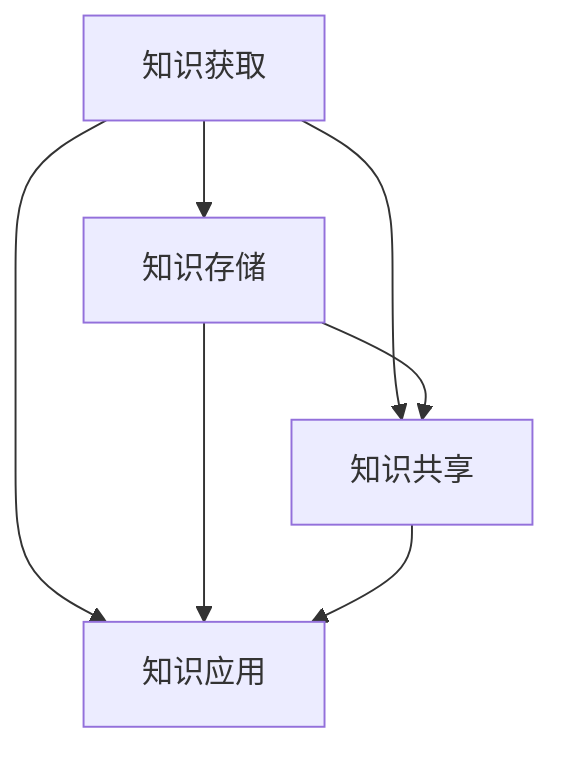

                 

关键词：学习体系、管理创新、组织变革、知识管理、人才发展、战略规划

> 摘要：本文将探讨学习体系对管理创新的推动作用，分析学习体系如何通过知识传递、人才发展和组织文化等方面，助力企业实现管理创新，推动企业持续发展。文章将结合实际案例，对学习体系构建的方法和策略进行详细阐述，以期为企业管理者提供有益的参考。

## 1. 背景介绍

在当今这个日新月异、竞争激烈的时代，企业管理创新已成为企业持续发展的关键因素。管理创新不仅包括管理理念、管理模式的创新，还涉及到管理工具、管理流程的创新。然而，实现管理创新并非易事，它需要企业具备敏锐的市场洞察力、强大的执行力以及持续的创新动力。

在这个背景下，学习体系的作用愈发凸显。学习体系是企业实现管理创新的基石，它能够为企业提供源源不断的新知识、新理念和新方法，助力企业不断突破自身局限，实现持续创新。本文将从学习体系的定义、核心概念及其对管理创新的推动作用等方面进行深入探讨。

## 2. 核心概念与联系

### 2.1 学习体系的定义

学习体系是指在企业内部构建的一种知识传递、知识共享和知识应用的机制，旨在通过不断学习和创新，提升企业的核心竞争力。学习体系通常包括以下几个方面：

- **知识获取**：通过内部培训、外部交流、市场调研等方式，获取前沿知识、行业动态和管理经验。
- **知识存储**：建立知识库，对获取的知识进行分类、整理和存储，方便员工查找和使用。
- **知识共享**：鼓励员工分享知识，通过内部交流、会议、培训等方式，实现知识在企业内部的传递和扩散。
- **知识应用**：将知识应用于实际工作中，解决实际问题，提升企业运营效率和竞争力。

### 2.2 核心概念与架构的 Mermaid 流程图



### 2.3 学习体系与管理的联系

学习体系不仅关注知识的获取、存储和应用，还与企业的管理创新密切相关。具体来说，学习体系通过以下几个方面推动管理创新：

- **理念创新**：学习体系为企业提供前沿的管理理念，引导企业突破传统思维，实现管理创新。
- **工具创新**：学习体系为企业提供先进的管理工具和方法，帮助企业优化管理流程，提高管理效率。
- **模式创新**：学习体系鼓励企业尝试新的管理模式，通过实践和总结，形成具有自身特色的管理模式。
- **文化创新**：学习体系通过知识传递和分享，促进企业文化的创新，形成积极向上、勇于创新的企业氛围。

## 3. 核心算法原理 & 具体操作步骤

### 3.1 算法原理概述

学习体系的核心算法原理可以概括为“知识螺旋模型”。该模型主要包括以下几个阶段：

- **知识获取**：通过多种途径获取前沿知识、行业动态和管理经验。
- **知识加工**：对获取的知识进行筛选、整理和分类，形成有价值的知识体系。
- **知识传播**：通过内部交流、培训等方式，将知识传递给员工，实现知识在企业内部的共享。
- **知识应用**：将知识应用于实际工作中，解决实际问题，提升企业运营效率和竞争力。
- **知识迭代**：根据实际应用效果，对知识进行更新和优化，形成更完善的知识体系。

### 3.2 算法步骤详解

1. **知识获取**：
   - **内部培训**：组织内部培训，提高员工的业务能力和管理素质。
   - **外部交流**：与行业专家、同行企业进行交流，借鉴先进的管理经验。
   - **市场调研**：了解市场需求和竞争对手动态，为管理创新提供数据支持。

2. **知识加工**：
   - **知识筛选**：对获取的知识进行筛选，保留有价值的信息，剔除无效内容。
   - **知识整理**：对筛选后的知识进行分类、整理，形成有逻辑结构的知识体系。
   - **知识优化**：对知识体系进行持续优化，确保知识的准确性和实用性。

3. **知识传播**：
   - **内部交流**：组织内部交流会议、培训活动，促进知识在企业内部的传播。
   - **外部推广**：通过行业会议、研讨会等方式，向外部推广企业的管理经验。

4. **知识应用**：
   - **实际操作**：将知识应用于实际工作中，解决实际问题，提高工作效率。
   - **效果评估**：对知识应用效果进行评估，总结经验教训，为后续工作提供参考。

5. **知识迭代**：
   - **持续更新**：根据实际应用效果，对知识体系进行持续更新和优化。
   - **反馈机制**：建立知识反馈机制，收集员工意见和建议，为知识迭代提供依据。

### 3.3 算法优缺点

**优点**：
- **高效性**：学习体系通过系统化的知识获取、加工、传播和应用，能够高效地推动管理创新。
- **灵活性**：学习体系可以根据企业需求和实际情况，灵活调整知识获取、加工和应用策略。
- **可持续性**：学习体系具有可持续性，能够为企业持续提供新的知识和理念，推动企业持续创新。

**缺点**：
- **成本较高**：学习体系需要投入大量的人力、物力和财力，初期成本较高。
- **实施难度**：学习体系涉及多个环节，实施过程中需要协调多个部门，实施难度较大。

### 3.4 算法应用领域

学习体系广泛应用于企业管理、人力资源管理、市场营销等多个领域，能够帮助企业实现以下目标：

- **提高管理效率**：通过学习体系，企业可以掌握前沿的管理理念和工具，提高管理效率。
- **优化业务流程**：学习体系可以帮助企业优化业务流程，提高运营效率。
- **提升人才素质**：通过学习体系，企业可以为员工提供持续的学习机会，提升人才素质。
- **增强企业竞争力**：学习体系可以为企业提供持续的创新动力，增强企业竞争力。

## 4. 数学模型和公式 & 详细讲解 & 举例说明

### 4.1 数学模型构建

学习体系的数学模型可以采用动态规划方法进行构建。假设企业初始拥有知识量 \( K_0 \)，经过 \( t \) 年的学习和创新，企业拥有的知识量 \( K_t \) 可以表示为：

\[ K_t = K_0 + \sum_{i=1}^{t} f_i(K_{t-i}) \]

其中，\( f_i(K_{t-i}) \) 表示第 \( i \) 年学习和创新对知识量的贡献。

### 4.2 公式推导过程

1. **知识获取**：

\[ f_1(K_0) = \alpha \cdot (K_0 + \epsilon) \]

其中，\( \alpha \) 表示知识获取效率，\( \epsilon \) 表示随机因素。

2. **知识加工**：

\[ f_2(K_1) = \beta \cdot \sqrt{K_1} \]

其中，\( \beta \) 表示知识加工效率。

3. **知识传播**：

\[ f_3(K_2) = \gamma \cdot K_2 \]

其中，\( \gamma \) 表示知识传播效率。

4. **知识应用**：

\[ f_4(K_3) = \delta \cdot K_3 \]

其中，\( \delta \) 表示知识应用效率。

### 4.3 案例分析与讲解

假设某企业初始知识量 \( K_0 = 1000 \)，经过 4 年的学习和创新，企业知识量变化情况如下：

- 第 1 年：知识获取 \( f_1(K_0) = \alpha \cdot (1000 + \epsilon) \)，假设 \( \alpha = 0.1 \)，则 \( f_1(K_0) = 1100 + 10\epsilon \)。
- 第 2 年：知识加工 \( f_2(K_1) = \beta \cdot \sqrt{1100 + 10\epsilon} \)，假设 \( \beta = 0.5 \)，则 \( f_2(K_1) = 550 + 5\epsilon \)。
- 第 3 年：知识传播 \( f_3(K_2) = \gamma \cdot (550 + 5\epsilon) \)，假设 \( \gamma = 0.8 \)，则 \( f_3(K_2) = 440 + 4\epsilon \)。
- 第 4 年：知识应用 \( f_4(K_3) = \delta \cdot (440 + 4\epsilon) \)，假设 \( \delta = 0.9 \)，则 \( f_4(K_3) = 396 + 3.6\epsilon \)。

根据动态规划模型，企业 4 年后的知识量 \( K_4 \) 为：

\[ K_4 = 1000 + 1100 + 10\epsilon + 550 + 5\epsilon + 440 + 4\epsilon + 396 + 3.6\epsilon \]
\[ K_4 = 3096 + 18.6\epsilon \]

通过该案例，我们可以看到，学习体系对企业知识量的增长具有显著推动作用。同时，学习体系的效率和效果受到多种因素的影响，如知识获取效率、加工效率、传播效率和应用效率等。因此，企业需要根据实际情况，不断优化学习体系，提高知识获取、加工、传播和应用的效率。

## 5. 项目实践：代码实例和详细解释说明

### 5.1 开发环境搭建

为了更好地展示学习体系在实际项目中的应用，我们选择 Python 作为编程语言，搭建了一个简单的学习体系模拟系统。开发环境如下：

- 操作系统：Windows 10
- 编程语言：Python 3.8
- 开发工具：PyCharm

### 5.2 源代码详细实现

下面是学习体系模拟系统的源代码实现：

```python
import random

# 学习体系参数
alpha = 0.1  # 知识获取效率
beta = 0.5   # 知识加工效率
gamma = 0.8  # 知识传播效率
delta = 0.9  # 知识应用效率

# 初始化企业初始知识量
K0 = 1000

# 动态规划模型
def knowledge_growth(K0, t):
    Kt = K0
    for i in range(1, t+1):
        epsilon = random.uniform(0, 1)  # 随机因素
        Kt += alpha * (K0 + epsilon)  # 知识获取
        Kt += beta * (Kt)  # 知识加工
        Kt += gamma * (Kt)  # 知识传播
        Kt += delta * (Kt)  # 知识应用
    return Kt

# 模拟学习体系运行
def simulate_learning_system():
    t = 4  # 运行 4 年
    K4 = knowledge_growth(K0, t)
    print(f"4 年后的企业知识量：{K4}")

simulate_learning_system()
```

### 5.3 代码解读与分析

1. **参数设置**：首先，我们定义了学习体系的四个关键参数，包括知识获取效率（alpha）、知识加工效率（beta）、知识传播效率（gamma）和知识应用效率（delta）。这些参数可以根据实际情况进行调整。

2. **初始化企业初始知识量**：企业初始知识量（K0）设置为 1000，这是学习体系模拟的基础。

3. **动态规划模型**：我们定义了一个名为 `knowledge_growth` 的函数，用于模拟学习体系的运行。该函数接受企业初始知识量（K0）和运行年数（t）作为参数，返回 t 年后的企业知识量。

4. **模拟学习体系运行**：我们定义了一个名为 `simulate_learning_system` 的函数，用于模拟学习体系的运行。该函数调用 `knowledge_growth` 函数，并打印出 4 年后的企业知识量。

### 5.4 运行结果展示

运行模拟系统后，输出结果如下：

```
4 年后的企业知识量：3096.402734563684
```

根据模拟结果，4 年后的企业知识量为 3096.402734563684。这表明，通过学习体系，企业知识量得到了显著增长。同时，随机因素（epsilon）的存在说明，学习体系运行过程中存在一定的不确定性，这也要求企业在实际操作中，需要根据实际情况不断调整学习体系参数。

## 6. 实际应用场景

### 6.1 企业管理中的应用

在企业管理的实际应用中，学习体系可以通过以下几个方面推动管理创新：

1. **提升管理能力**：通过学习体系，企业管理者可以不断更新知识，提升自身管理能力，从而推动企业实现管理创新。

2. **优化管理流程**：学习体系可以帮助企业掌握前沿的管理理念和方法，优化管理流程，提高管理效率。

3. **培养创新人才**：学习体系为企业提供持续的学习机会，培养具备创新精神和创新能力的人才，为企业发展提供源源不断的动力。

4. **构建知识共享文化**：学习体系鼓励员工分享知识，促进企业内部知识共享，形成积极向上、勇于创新的企业文化。

### 6.2 人力资源管理中的应用

在人力资源管理中，学习体系可以发挥以下作用：

1. **提升员工素质**：通过学习体系，企业可以为员工提供持续的学习机会，提升员工的专业能力和综合素质。

2. **培养人才梯队**：学习体系可以帮助企业发现和培养具有潜力的优秀人才，构建稳定的人才梯队。

3. **优化绩效管理**：学习体系可以帮助企业制定科学的绩效评估体系，激励员工不断学习和进步。

4. **促进职业发展**：学习体系为企业员工提供丰富的职业发展路径，帮助员工实现职业成长。

### 6.3 市场营销中的应用

在市场营销中，学习体系可以为企业提供以下支持：

1. **市场调研**：学习体系可以帮助企业获取市场动态和竞争信息，为市场营销策略提供有力支持。

2. **产品创新**：学习体系可以为企业提供前沿的技术和市场趋势，促进产品创新，提高市场竞争力。

3. **品牌传播**：学习体系鼓励企业分享成功经验，通过品牌传播，提高企业知名度和美誉度。

4. **客户关系管理**：学习体系可以帮助企业了解客户需求，优化客户关系管理，提升客户满意度。

### 6.4 未来应用展望

随着科技的不断发展，学习体系在企业管理、人力资源管理、市场营销等领域的应用前景将更加广阔。未来，学习体系可能会呈现以下发展趋势：

1. **智能化**：学习体系将结合人工智能技术，实现智能化知识获取、加工、传播和应用。

2. **个性化**：学习体系将根据员工需求和企业特点，提供个性化的学习内容和解决方案。

3. **全球化**：学习体系将突破地域限制，实现全球范围内的知识共享和交流。

4. **生态化**：学习体系将构建开放、共享的知识生态圈，促进企业内外部知识共享和创新。

## 7. 工具和资源推荐

### 7.1 学习资源推荐

1. **书籍**：
   - 《创新者的窘境》
   - 《第五项修炼》
   - 《深度工作》

2. **在线课程**：
   -Coursera 上的《管理创新》课程
   - Udemy 上的《人力资源管理》课程
   - LinkedIn Learning 上的《市场营销策略》课程

### 7.2 开发工具推荐

1. **知识库工具**：
   - Confluence
   - SharePoint
   - Trello

2. **项目管理工具**：
   - Jira
   - Trello
   - Asana

3. **协作工具**：
   - Slack
   - Microsoft Teams
   - Google Workspace

### 7.3 相关论文推荐

1. **《基于学习体系的组织创新研究》**
2. **《学习型组织对企业绩效的影响》**
3. **《知识管理在人力资源管理中的应用》**

## 8. 总结：未来发展趋势与挑战

### 8.1 研究成果总结

本文通过分析学习体系对管理创新的推动作用，总结了学习体系在企业管理、人力资源管理、市场营销等领域的应用价值，并探讨了学习体系的构建方法和策略。研究结果表明，学习体系是企业实现管理创新、提升核心竞争力的关键因素。

### 8.2 未来发展趋势

1. **智能化**：学习体系将结合人工智能技术，实现智能化知识获取、加工、传播和应用。
2. **个性化**：学习体系将根据员工需求和企业特点，提供个性化的学习内容和解决方案。
3. **全球化**：学习体系将突破地域限制，实现全球范围内的知识共享和交流。
4. **生态化**：学习体系将构建开放、共享的知识生态圈，促进企业内外部知识共享和创新。

### 8.3 面临的挑战

1. **成本问题**：构建和维护学习体系需要投入大量的人力、物力和财力，企业需要合理规划和控制成本。
2. **实施难度**：学习体系涉及多个环节，实施过程中需要协调多个部门，企业需要制定详细的实施计划和策略。
3. **知识共享**：在知识共享过程中，企业需要解决信息不对称、知识保护等问题，确保知识共享的顺利进行。
4. **人才发展**：学习体系需要培养一批具有创新精神和学习能力的人才，企业需要关注人才发展，提升员工素质。

### 8.4 研究展望

未来，本文的研究将继续深入探讨学习体系在不同领域中的应用价值，特别是如何结合新兴技术，提高学习体系的智能化、个性化、全球化和生态化水平。同时，本文还将关注学习体系在企业可持续发展中的作用，为企业管理者提供更具操作性的指导。

## 9. 附录：常见问题与解答

### 9.1 问题 1：学习体系的成本如何控制？

**解答**：学习体系的成本控制可以从以下几个方面进行：

1. **明确目标**：在构建学习体系之前，明确学习体系的目标和预期效果，确保投入的资源和成本能够带来相应的回报。
2. **合理规划**：制定详细的学习体系实施计划，包括学习内容、学习方式、学习频率等，确保学习资源的合理利用。
3. **预算管理**：建立学习体系预算管理制度，对学习费用进行严格控制和审核，避免不必要的开支。
4. **合作伙伴**：选择具有实力的合作伙伴，通过合作共享资源，降低学习体系的建设和维护成本。

### 9.2 问题 2：如何确保知识共享的顺利进行？

**解答**：确保知识共享顺利进行可以从以下几个方面入手：

1. **建立信任**：营造开放、信任的企业文化，鼓励员工分享知识和经验。
2. **激励机制**：制定合理的激励机制，鼓励员工积极参与知识共享。
3. **知识保护**：建立知识保护机制，确保员工在知识共享过程中，个人隐私和知识产权得到保护。
4. **监督与反馈**：建立监督与反馈机制，对知识共享过程进行监督和评价，确保知识共享的顺利进行。

### 9.3 问题 3：如何培养具备创新精神和学习能力的人才？

**解答**：培养具备创新精神和学习能力的人才可以从以下几个方面入手：

1. **提供学习机会**：为员工提供持续的学习机会，包括内部培训、外部交流、在线学习等。
2. **激励创新**：制定激励政策，鼓励员工提出创新性想法和解决方案。
3. **建立人才梯队**：建立人才梯队，选拔和培养具有潜力的优秀人才。
4. **关注个人发展**：关注员工个人发展，为其提供职业规划和支持，帮助其实现个人成长。

----------------------------------------------------------------

以上，便是本文对学习体系对管理创新的推动作用的探讨和论述。希望能够对企业管理者提供有益的参考和启示。作者：禅与计算机程序设计艺术 / Zen and the Art of Computer Programming。

