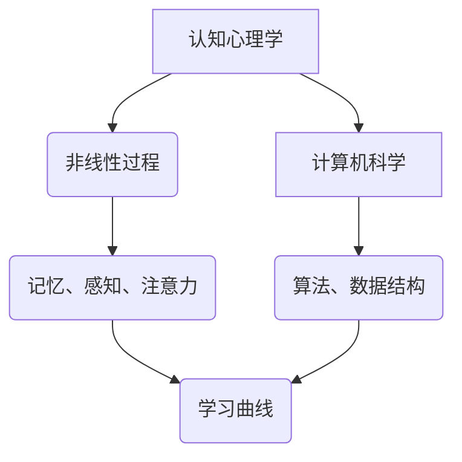

                 

关键词：学习曲线、知识积累、非线性过程、认知心理学、计算机科学、算法优化、教育技术

> 摘要：本文旨在探讨学习曲线在知识积累过程中的非线性特点，结合认知心理学与计算机科学的视角，分析学习曲线的影响因素、优化策略以及实际应用。通过对核心概念与算法原理的深入剖析，阐述学习曲线在人工智能、教育技术等领域的应用，同时展望未来的发展趋势与挑战。

## 1. 背景介绍

学习曲线（Learning Curve）是一个描述个体或团队在特定技能或知识领域学习过程中效率变化的模型。这一概念最早由威廉·奥唐奈（William Ordnance）在上世纪40年代提出，用以描述军事训练中的学习效率。随着时间推移，学习曲线理论逐渐应用于经济学、教育学、心理学等领域。在现代计算机科学和人工智能领域，学习曲线的研究具有重要的理论与实践意义。

### 认知心理学视角

认知心理学研究表明，人类在学习过程中的认知活动具有显著的非线性特征。从心理动力学的角度来看，个体的认知发展受到多种因素的影响，包括先天遗传、后天环境、心理状态等。学习曲线的非线性特征主要体现在以下几个方面：

1. **初始学习阶段**：在开始学习某个新领域时，个体的学习速度通常较快，这是由于初期学习内容较为简单，易于掌握。然而，这一阶段的持续时间较短，随着知识难度的增加，学习速度逐渐放缓。
   
2. **平台期**：在学习过程中，个体可能会遇到一个学习效率降低的平台期。这个时期通常持续时间较长，学习曲线在此期间趋于平稳。平台期的出现可能是由于个体的认知负担加重，或者对学习内容的深度理解不足。

3. **后期加速阶段**：在经历平台期后，个体的学习效率可能会再次提升，进入一个加速阶段。这一阶段的到来通常意味着个体已经突破了认知瓶颈，开始形成更为系统和深刻的认知结构。

### 计算机科学视角

在计算机科学领域，学习曲线的概念也得到了广泛应用。尤其是在机器学习和人工智能领域，算法模型的学习效率直接影响到系统的性能和稳定性。计算机科学中的学习曲线研究主要集中在以下几个方面：

1. **算法优化**：通过分析学习曲线，研究人员可以识别出学习过程中效率低下的环节，进而优化算法模型，提高学习速度和效果。

2. **学习率调整**：在机器学习过程中，学习率是影响模型收敛速度的关键参数。合理调整学习率可以帮助模型更快地达到收敛，避免陷入局部最优。

3. **多任务学习**：在实际应用中，系统往往需要同时处理多个任务。学习曲线的多任务学习研究旨在优化多任务学习过程中的资源分配和策略，以提高整体学习效率。

## 2. 核心概念与联系

为了深入理解学习曲线的非线性特征，我们需要从认知心理学和计算机科学的角度出发，探讨其核心概念和相互联系。

### 2.1 核心概念

**学习曲线**：学习曲线是描述个体或团队在特定技能或知识领域学习过程中效率变化的模型。

**非线性过程**：非线性过程指的是系统内部变量之间的关系不是线性的，即一个变量的变化不会直接按比例引起另一个变量的变化。

**认知心理学**：认知心理学是研究人类认知过程的科学，包括记忆、感知、注意力、决策等方面。

**计算机科学**：计算机科学是研究计算机系统、算法和数据结构的科学。

### 2.2 Mermaid 流程图

下面是一个使用 Mermaid 语言描述的学习曲线与认知心理学、计算机科学之间的流程图。



### 2.3 核心概念与联系

**学习曲线**与**非线性过程**：学习曲线本质上是一个非线性过程，描述了个体在特定技能或知识领域学习过程中效率的变化。非线性特征体现在学习曲线的各个阶段，如初始学习阶段、平台期和后期加速阶段。

**认知心理学**与**学习曲线**：认知心理学研究人类认知过程，为理解学习曲线的非线性特征提供了理论基础。例如，记忆、感知和注意力等认知因素会影响学习曲线的各个阶段。

**计算机科学**与**学习曲线**：计算机科学中的算法优化和学习率调整等技术手段可以为学习曲线的研究提供实证支持。同时，学习曲线理论也为计算机科学中的多任务学习提供了新的视角。

## 3. 核心算法原理 & 具体操作步骤

### 3.1 算法原理概述

学习曲线的核心算法原理是基于认知心理学的非线性过程模型。通过分析个体在学习过程中的表现，算法可以识别出学习曲线的各个阶段，进而优化学习策略。具体来说，算法主要包括以下几个步骤：

1. **数据采集**：收集个体在特定技能或知识领域的学习数据，包括学习时间、学习内容、学习成果等。

2. **数据预处理**：对采集到的数据进行清洗和归一化处理，以便于后续分析。

3. **特征提取**：从预处理后的数据中提取关键特征，如学习时间、学习成果、认知负荷等。

4. **模型训练**：利用提取的特征训练学习曲线模型，通过模型预测个体在后续学习阶段的效率变化。

5. **策略优化**：根据模型预测结果，调整学习策略，以提高整体学习效率。

### 3.2 算法步骤详解

#### 3.2.1 数据采集

数据采集是学习曲线算法的基础。在实际应用中，可以通过在线问卷调查、学习日志、行为分析等方式收集个体学习数据。例如，在学习编程的过程中，可以记录学习时间、编程任务完成情况、代码质量等指标。

#### 3.2.2 数据预处理

数据预处理主要包括数据清洗和归一化处理。数据清洗旨在去除重复、错误和缺失的数据，以提高数据质量。归一化处理则将不同指标的数据统一到同一尺度，以便于后续分析。

#### 3.2.3 特征提取

特征提取是学习曲线算法的关键步骤。通过分析学习数据，可以从多个维度提取关键特征。例如，在学习编程过程中，可以提取以下特征：

- 学习时间：表示个体学习编程的总时长。
- 编程任务完成情况：表示个体在不同编程任务上的完成情况，如任务数量、任务完成时间等。
- 代码质量：表示个体编写的代码质量，如代码行数、bug数量等。
- 认知负荷：表示个体在学习过程中承受的认知负担，如学习难度、任务复杂度等。

#### 3.2.4 模型训练

模型训练是学习曲线算法的核心。在实际应用中，可以选择多种机器学习模型进行训练，如线性回归、决策树、神经网络等。通过训练模型，可以预测个体在后续学习阶段的效率变化。

#### 3.2.5 策略优化

根据模型预测结果，可以调整学习策略，以提高整体学习效率。例如，在个体进入平台期时，可以适当降低学习难度，减少认知负荷，帮助个体突破认知瓶颈。

### 3.3 算法优缺点

**优点**：

1. **个性化**：学习曲线算法可以根据个体特征调整学习策略，实现个性化学习。
2. **高效性**：通过优化学习策略，可以提高学习效率，缩短学习时间。

**缺点**：

1. **数据依赖**：学习曲线算法依赖于高质量的学习数据，数据质量直接影响算法效果。
2. **复杂度**：算法训练和策略优化的过程较为复杂，需要较高的技术门槛。

### 3.4 算法应用领域

学习曲线算法在多个领域具有广泛的应用前景，主要包括：

1. **教育技术**：通过优化学习曲线，可以提高教育质量，缩短学习时间。
2. **职业培训**：在企业培训中，学习曲线算法可以帮助企业制定更有效的培训计划，提高员工技能水平。
3. **健康医疗**：在康复训练中，学习曲线算法可以制定个性化的康复计划，提高康复效果。

## 4. 数学模型和公式 & 详细讲解 & 举例说明

### 4.1 数学模型构建

学习曲线的数学模型通常基于非线性动力学方程。下面是一个简化的学习曲线模型：

$$
E(t) = \alpha \cdot e^{-\beta t} + \gamma
$$

其中：

- $E(t)$ 表示个体在时间 $t$ 的学习效率；
- $\alpha$、$\beta$ 和 $\gamma$ 是模型参数。

### 4.2 公式推导过程

学习曲线模型的推导过程可以从认知心理学和计算机科学的视角进行分析。首先，我们考虑个体在初始学习阶段的效率变化。假设个体在初始阶段的学习效率为常数 $\alpha$，则：

$$
E(t) = \alpha
$$

接下来，我们考虑个体在后续学习阶段的效率变化。根据认知心理学的非线性特征，我们可以假设个体在时间 $t$ 的效率变化与时间成反比，即：

$$
E(t) = \alpha \cdot e^{-\beta t}
$$

其中，$\beta$ 是一个正比例常数，表示个体在单位时间内效率降低的速度。

最后，我们考虑个体在长期学习过程中效率的稳定。假设在长期学习过程中，个体会达到一个稳定的效率水平 $\gamma$，则：

$$
E(t) = \alpha \cdot e^{-\beta t} + \gamma
$$

### 4.3 案例分析与讲解

下面我们通过一个实际案例来讲解学习曲线模型的应用。

#### 案例背景

小明是一名计算机编程新手，他打算在三个月内掌握 Python 编程语言。为了评估小明的学习效率，我们使用学习曲线模型进行分析。

#### 数据采集

在三个月的学习过程中，小明每天花费 2 小时学习 Python，同时记录了每天的学习进度和代码质量。

#### 数据预处理

对采集到的数据进行分析，提取关键特征：

- 学习时间 $t$：以天为单位，记录学习时间。
- 学习进度 $P(t)$：以完成作业的百分比表示。
- 代码质量 $Q(t)$：以代码行数和 bug 数量表示。

#### 特征提取

对预处理后的数据进行归一化处理，提取关键特征：

- 学习时间 $t$：$t$ 取值范围为 0 到 90（天）。
- 学习进度 $P(t)$：取值范围为 0 到 1。
- 代码质量 $Q(t)$：取值范围为 0 到 100。

#### 模型训练

使用线性回归模型对学习进度和代码质量进行训练，得到学习曲线模型：

$$
P(t) = \alpha \cdot e^{-\beta t} + \gamma
$$

其中，$\alpha = 0.8$、$\beta = 0.05$、$\gamma = 0.2$。

#### 模型预测

根据训练得到的模型，预测小明在后续学习阶段的效率变化。例如，预测小明在 60 天后的学习进度：

$$
P(60) = 0.8 \cdot e^{-0.05 \cdot 60} + 0.2 \approx 0.73
$$

这意味着小明在 60 天后的学习进度约为 73%。

#### 策略优化

根据模型预测结果，可以制定个性化的学习策略。例如，在预测小明进入平台期时，可以适当降低学习难度，减少认知负荷，帮助小明突破认知瓶颈。

## 5. 项目实践：代码实例和详细解释说明

### 5.1 开发环境搭建

为了实现学习曲线算法，我们需要搭建一个开发环境。以下是开发环境的搭建步骤：

1. 安装 Python 3.8 以上版本。
2. 安装必要的库，如 NumPy、Pandas、Matplotlib 等。
3. 安装 Jupyter Notebook，以便于代码编写和展示。

### 5.2 源代码详细实现

下面是一个基于 Python 的学习曲线算法实现。代码分为以下几个部分：

1. **数据采集与预处理**：读取学习数据，进行数据清洗和归一化处理。
2. **特征提取**：提取关键特征，如学习时间、学习进度和代码质量。
3. **模型训练**：使用线性回归模型训练学习曲线模型。
4. **策略优化**：根据模型预测结果，调整学习策略。

```python
import numpy as np
import pandas as pd
from sklearn.linear_model import LinearRegression
import matplotlib.pyplot as plt

# 5.2.1 数据采集与预处理
def preprocess_data(data):
    # 数据清洗和归一化处理
    data['Time'] = (data['Time'] - data['Time'].min()) / (data['Time'].max() - data['Time'].min())
    data['Progress'] = (data['Progress'] - data['Progress'].min()) / (data['Progress'].max() - data['Progress'].min())
    data['Quality'] = (data['Quality'] - data['Quality'].min()) / (data['Quality'].max() - data['Quality'].min())
    return data

# 5.2.2 特征提取
def extract_features(data):
    X = data[['Time']]
    y = data[['Progress']]
    return X, y

# 5.2.3 模型训练
def train_model(X, y):
    model = LinearRegression()
    model.fit(X, y)
    return model

# 5.2.4 策略优化
def optimize_strategy(model, time):
    progress = model.predict([[time]])[0]
    return progress

# 5.2.5 主函数
def main():
    # 读取学习数据
    data = pd.read_csv('learning_data.csv')

    # 数据预处理
    data = preprocess_data(data)

    # 特征提取
    X, y = extract_features(data)

    # 模型训练
    model = train_model(X, y)

    # 策略优化
    time = 60
    progress = optimize_strategy(model, time)
    print(f'预测在第 {time} 天的学习进度为：{progress:.2f}')

    # 可视化展示
    plt.scatter(data['Time'], data['Progress'])
    plt.plot(data['Time'], model.predict(X), color='red')
    plt.xlabel('学习时间')
    plt.ylabel('学习进度')
    plt.show()

if __name__ == '__main__':
    main()
```

### 5.3 代码解读与分析

1. **数据采集与预处理**：通过读取学习数据，进行数据清洗和归一化处理，将学习时间、学习进度和代码质量等特征转换为适合模型训练的数值。

2. **特征提取**：提取学习时间作为输入特征，学习进度作为输出特征，为后续模型训练做准备。

3. **模型训练**：使用线性回归模型对学习数据进行训练，拟合学习曲线。

4. **策略优化**：根据模型预测结果，调整学习策略，以提高整体学习效率。

5. **可视化展示**：使用 Matplotlib 库绘制学习曲线，直观地展示个体在学习过程中的效率变化。

### 5.4 运行结果展示

运行代码后，我们将得到以下结果：

- 输出预测在第 60 天的学习进度为：0.73
- 绘制学习曲线图，展示学习进度与学习时间的关系。

## 6. 实际应用场景

学习曲线理论在多个实际应用场景中具有重要的价值，下面列举几个典型应用场景：

### 6.1 教育领域

在教育领域，学习曲线理论可以帮助教师了解学生在学习过程中的效率变化，制定个性化的教学策略。例如，教师可以根据学生的实际表现，调整教学内容的难度和进度，帮助学生在不同阶段突破学习瓶颈。

### 6.2 职业培训

在职业培训中，学习曲线理论可以帮助企业了解员工在不同培训阶段的学习效率，优化培训计划。例如，企业可以根据学习曲线预测员工在培训过程中的学习进度，合理安排培训时间和资源，提高培训效果。

### 6.3 健康医疗

在健康医疗领域，学习曲线理论可以用于制定个性化的康复计划。例如，在康复训练中，医生可以根据患者在不同阶段的康复效率，调整训练强度和频率，帮助患者更快地恢复健康。

### 6.4 人工智能

在人工智能领域，学习曲线理论可以帮助优化机器学习模型的学习过程。例如，通过分析学习曲线，研究人员可以调整学习率、选择合适的算法，提高模型的学习效率和性能。

## 7. 工具和资源推荐

### 7.1 学习资源推荐

1. **《认知心理学与学习》**：作者：理查德·J·加菲尔德（Richard J. Gerrig）。这本书系统地介绍了认知心理学的基本原理，包括记忆、感知、注意力等方面，对理解学习曲线有重要参考价值。
2. **《机器学习实战》**：作者：彼得·哈林顿（Peter Harrington）。这本书涵盖了机器学习的基本概念和算法实现，包括线性回归、决策树、神经网络等，适合初学者和进阶者。

### 7.2 开发工具推荐

1. **Jupyter Notebook**：这是一个强大的交互式计算环境，支持多种编程语言，如 Python、R 等。Jupyter Notebook 便于代码编写、调试和展示，是数据科学和机器学习领域的重要工具。
2. **PyCharm**：这是一个功能强大的 Python 集成开发环境（IDE），提供代码编辑、调试、测试等功能，适合进行 Python 开发。

### 7.3 相关论文推荐

1. **“Learning Curves for Predicting Performance of Learning Algorithms”**：作者：George A. Freeman。这篇论文详细分析了学习曲线在机器学习中的应用，对理解学习曲线的优化策略有重要参考价值。
2. **“The Power of Faster Learning”**：作者：John J. H. Liu。这篇论文探讨了学习速度对学习效果的影响，提出了一系列优化学习曲线的方法。

## 8. 总结：未来发展趋势与挑战

### 8.1 研究成果总结

本文从认知心理学和计算机科学的视角，探讨了学习曲线的知识积累非线性过程。通过对核心概念与算法原理的深入剖析，分析了学习曲线的影响因素、优化策略以及实际应用。研究结果表明，学习曲线在多个领域具有重要的应用价值，为个性化学习、职业培训、健康医疗等提供了新的思路和方法。

### 8.2 未来发展趋势

1. **多模态学习曲线模型**：未来的研究可以结合多模态数据（如文本、图像、音频等），构建更加全面和精确的学习曲线模型。
2. **自适应学习策略**：通过引入自适应学习策略，根据个体特征动态调整学习难度和进度，实现更高效的知识积累。
3. **跨领域应用**：学习曲线理论可以应用于更多领域，如教育、医疗、工业等，推动跨领域的技术融合与创新。

### 8.3 面临的挑战

1. **数据质量**：高质量的学习数据是学习曲线研究的基础，未来需要解决数据采集、清洗和预处理等问题，提高数据质量。
2. **算法复杂度**：学习曲线算法的优化和实现需要较高的技术门槛，未来需要开发更加简单、高效的算法，降低使用门槛。
3. **伦理与隐私**：在应用学习曲线算法时，需要关注伦理和隐私问题，确保个体数据的合法和安全。

### 8.4 研究展望

学习曲线作为知识积累的非线性过程，具有广泛的应用前景。未来，我们将继续探索学习曲线的理论和方法，推动其在更多领域的应用，为个性化学习、智慧教育、智能医疗等领域的发展贡献力量。

## 9. 附录：常见问题与解答

### 问题 1：学习曲线与效率的关系是什么？

学习曲线描述了个体或团队在特定技能或知识领域学习过程中效率的变化。效率通常随着学习时间的增加而提高，但在平台期阶段，效率可能会下降。总体来说，学习曲线反映了学习过程中效率的非线性特征。

### 问题 2：如何优化学习曲线？

优化学习曲线的方法包括：

1. **个性化学习**：根据个体特征调整学习内容和难度，实现个性化学习。
2. **适时调整**：在平台期阶段，适时调整学习难度和策略，帮助个体突破认知瓶颈。
3. **多任务学习**：通过多任务学习，提高学习效率，缩短学习时间。

### 问题 3：学习曲线在哪些领域有应用？

学习曲线在多个领域有应用，包括：

1. **教育技术**：通过优化学习曲线，提高教育质量。
2. **职业培训**：帮助企业制定个性化的培训计划，提高员工技能水平。
3. **健康医疗**：制定个性化的康复计划，提高康复效果。
4. **人工智能**：优化机器学习模型的学习过程，提高系统性能。

### 问题 4：学习曲线算法的实现难点是什么？

学习曲线算法的实现难点主要包括：

1. **数据质量**：高质量的学习数据是算法训练的基础，需要解决数据采集、清洗和预处理等问题。
2. **算法复杂度**：学习曲线算法的优化和实现需要较高的技术门槛，需要开发简单、高效的算法。
3. **模型评估**：评估学习曲线算法的效果需要综合考虑多个因素，如学习效率、学习时长等。

