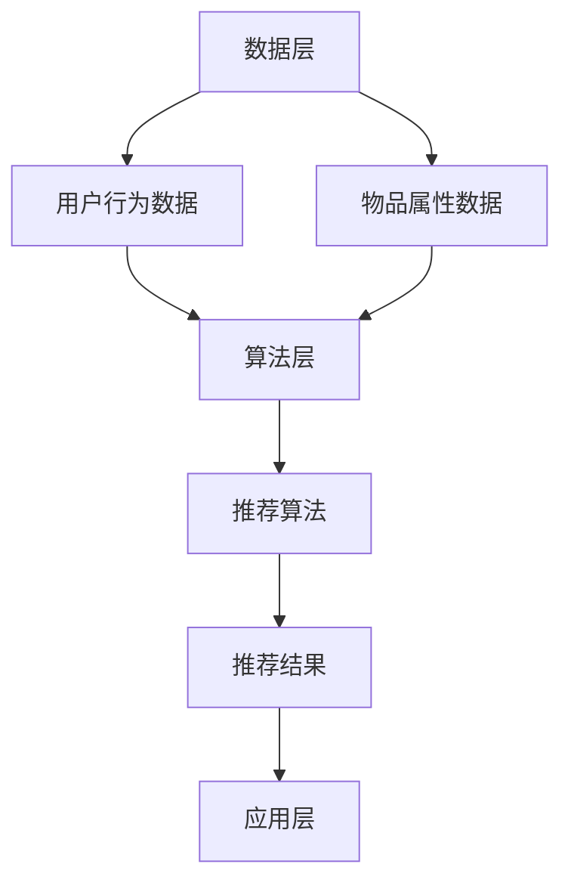

                 

关键词：实时推荐、AI技术、融合创新、推荐效果、算法优化、数据挖掘、机器学习、深度学习、自然语言处理、增强学习

## 摘要

本文将探讨实时推荐技术如何与其他人工智能（AI）技术相结合，以实现推荐效果的提升。通过对核心概念的详细解释、算法原理的剖析、数学模型的构建与推导，以及实际应用场景的深入分析，本文旨在为读者呈现一个清晰、完整的实时推荐技术融合与创新的全景图。文章还将推荐相关学习资源、开发工具和论文，以期为读者提供进一步的学习和实践指导。通过本文的阅读，读者将了解到实时推荐技术在当前AI领域的地位及其未来的发展趋势与挑战。

## 1. 背景介绍

### 实时推荐技术的起源与发展

实时推荐技术起源于互联网时代的兴起，随着电子商务、社交媒体和在线娱乐的迅猛发展，用户对个性化推荐的需求日益增加。实时推荐技术通过分析用户的历史行为、兴趣和偏好，在瞬间为用户提供高度个性化的信息内容，从而提升用户体验和商业价值。

实时推荐技术的发展经历了多个阶段。最初，基于内容的推荐（Content-Based Recommendation）和协同过滤推荐（Collaborative Filtering）是主要的推荐算法。这些算法通过对用户历史行为和物品属性的分析，预测用户对未知物品的偏好。然而，随着数据量和用户行为的复杂化，这些传统算法的推荐效果逐渐难以满足用户的需求。

为了应对这一挑战，机器学习（Machine Learning）、深度学习（Deep Learning）和自然语言处理（Natural Language Processing）等AI技术逐渐融入实时推荐领域，推动了推荐系统的智能化和个性化。实时推荐技术从传统的基于特征的方法向基于模型的方法转型，提高了推荐算法的预测准确性和实时性。

### 实时推荐技术在现代AI中的地位

实时推荐技术在现代AI中的地位日益显著。一方面，它已成为许多互联网应用的基石，如电商平台的商品推荐、社交媒体的内容推送和在线视频平台的影视推荐等。实时推荐技术不仅提升了用户的使用体验，还为企业带来了巨大的商业价值。

另一方面，实时推荐技术是数据驱动决策（Data-Driven Decision Making）的重要组成部分。通过实时收集和分析用户数据，企业可以快速调整营销策略和产品开发方向，以更好地满足用户需求。此外，实时推荐技术还在智能城市、智能医疗和智能教育等领域显示出巨大的潜力，为这些领域提供了数据驱动的决策支持。

## 2. 核心概念与联系

### 2.1. 实时推荐技术的基本概念

实时推荐技术主要包括以下几个核心概念：

- **用户行为数据**：用户在平台上的浏览、购买、点赞、评论等行为数据，这些数据是推荐系统的主要输入。
- **物品属性**：物品的特征信息，如商品的价格、品牌、分类、描述等。
- **推荐算法**：用于计算用户与物品之间相似度，并生成推荐列表的算法。
- **推荐结果**：根据算法计算结果为用户展示的个性化推荐列表。

### 2.2. 实时推荐技术的架构

实时推荐技术的架构可以分为数据层、算法层和应用层三个层次：

- **数据层**：负责收集、存储和处理用户行为数据和物品属性数据。
- **算法层**：包括推荐算法的设计和实现，如基于内容的推荐、协同过滤推荐、深度学习推荐等。
- **应用层**：将推荐结果呈现给用户，如网页上的推荐模块、移动应用的通知等。

### 2.3. 实时推荐技术与其他 AI 技术的结合

实时推荐技术与其他 AI 技术的结合主要体现在以下几个方面：

- **机器学习与深度学习**：用于优化推荐算法，提高推荐准确性和实时性。
- **自然语言处理**：用于分析用户生成的内容，如评论、帖子等，以增强推荐效果。
- **增强学习**：用于动态调整推荐策略，以应对用户行为的变化。

### 2.4. Mermaid 流程图



### 2.5. 实时推荐技术的作用

实时推荐技术的作用主要体现在以下几个方面：

- **提升用户体验**：通过个性化推荐，满足用户的需求，提升用户的使用满意度。
- **增加商业价值**：通过精准推荐，提高用户转化率和销售额，为企业创造更多收益。
- **促进创新**：实时推荐技术为新的业务模式和服务创新提供了基础，推动了互联网行业的发展。

## 3. 核心算法原理 & 具体操作步骤

### 3.1. 算法原理概述

实时推荐技术的核心算法主要包括基于内容的推荐（Content-Based Recommendation）、协同过滤推荐（Collaborative Filtering）和深度学习推荐（Deep Learning Recommendation）等。

- **基于内容的推荐**：通过分析物品的属性和用户的历史行为，为用户推荐具有相似属性的物品。
- **协同过滤推荐**：通过分析用户之间的相似性，为用户推荐其他用户喜欢的物品。
- **深度学习推荐**：利用深度神经网络，从大量用户行为数据中学习用户和物品的复杂关系，进行推荐。

### 3.2. 算法步骤详解

#### 3.2.1. 基于内容的推荐

1. **特征提取**：对用户历史行为数据和物品属性数据进行特征提取，如文本特征、图像特征等。
2. **相似度计算**：计算用户历史行为数据和当前物品的特征相似度，如余弦相似度、欧氏距离等。
3. **推荐生成**：根据相似度分数为用户推荐相似度较高的物品。

#### 3.2.2. 协同过滤推荐

1. **用户相似度计算**：计算用户之间的相似度，如余弦相似度、皮尔逊相关系数等。
2. **物品相似度计算**：计算物品之间的相似度，如基于内容的相似度、基于协同过滤的相似度等。
3. **推荐生成**：根据用户相似度和物品相似度生成推荐列表。

#### 3.2.3. 深度学习推荐

1. **模型构建**：选择合适的深度学习模型，如基于神经网络的推荐模型、基于循环神经网络的推荐模型等。
2. **数据预处理**：对用户行为数据进行编码和预处理，如序列编码、嵌入编码等。
3. **模型训练**：利用预处理后的数据训练深度学习模型，优化模型参数。
4. **推荐生成**：根据训练好的模型为用户生成个性化推荐列表。

### 3.3. 算法优缺点

#### 3.3.1. 基于内容的推荐

- **优点**：能够为用户提供高度个性化的推荐，对用户历史行为数据的依赖较小。
- **缺点**：推荐结果容易陷入“信息茧房”，推荐多样性不足。

#### 3.3.2. 协同过滤推荐

- **优点**：能够捕捉用户之间的相似性，推荐结果具有较高的准确性。
- **缺点**：对用户历史行为数据依赖较大，易受噪声数据影响。

#### 3.3.3. 深度学习推荐

- **优点**：能够从大量用户行为数据中学习复杂的用户和物品关系，推荐效果较好。
- **缺点**：模型训练过程复杂，对数据质量和计算资源要求较高。

### 3.4. 算法应用领域

实时推荐技术广泛应用于电子商务、社交媒体、在线娱乐、智能医疗等领域。以下是一些典型的应用场景：

- **电子商务**：为用户推荐可能的购物需求，提高销售额和用户转化率。
- **社交媒体**：为用户推荐感兴趣的内容，提升用户活跃度和平台黏性。
- **在线娱乐**：为用户推荐可能的观影或听歌需求，提升平台播放量。
- **智能医疗**：为医生推荐可能的诊断方案，提高诊断准确性和效率。

## 4. 数学模型和公式 & 详细讲解 & 举例说明

### 4.1. 数学模型构建

实时推荐技术中的数学模型主要包括用户-物品相似度计算模型、推荐生成模型等。

#### 4.1.1. 用户-物品相似度计算模型

用户-物品相似度计算模型用于衡量用户和物品之间的相似程度。常用的相似度计算方法包括余弦相似度、皮尔逊相关系数等。

- **余弦相似度**：$$\cos\theta = \frac{\sum_{i=1}^{n}x_iy_i}{\sqrt{\sum_{i=1}^{n}x_i^2}\sqrt{\sum_{i=1}^{n}y_i^2}}$$
- **皮尔逊相关系数**：$$r = \frac{\sum_{i=1}^{n}(x_i - \bar{x})(y_i - \bar{y})}{\sqrt{\sum_{i=1}^{n}(x_i - \bar{x})^2}\sqrt{\sum_{i=1}^{n}(y_i - \bar{y})^2}}$$

#### 4.1.2. 推荐生成模型

推荐生成模型用于根据用户-物品相似度生成个性化推荐列表。常见的推荐生成模型包括基于矩阵分解的推荐模型、基于深度学习的推荐模型等。

- **基于矩阵分解的推荐模型**：$$R = UXV^T + \epsilon$$
  其中，$R$ 是用户-物品评分矩阵，$U$ 是用户特征矩阵，$X$ 是物品特征矩阵，$V$ 是用户-物品相似度矩阵，$\epsilon$ 是误差项。
- **基于深度学习的推荐模型**：$$R_{pred} = \sigma(W_1[User][Item] + W_2[User][Item] + b)$$
  其中，$R_{pred}$ 是预测评分，$User$ 和 $Item$ 分别是用户和物品的特征向量，$W_1$ 和 $W_2$ 是权重矩阵，$b$ 是偏置项，$\sigma$ 是激活函数。

### 4.2. 公式推导过程

#### 4.2.1. 基于矩阵分解的推荐模型推导

1. **目标函数**：最小化预测误差的平方和，即 $$\min_{U, V} \sum_{i=1}^{m}\sum_{j=1}^{n}(r_{ij} - UX_jV_i^T)^2$$
2. **梯度下降**：对目标函数求偏导数，并设置学习率 $\alpha$，进行梯度下降迭代，即
   $$U_{new} = U - \alpha \frac{\partial}{\partial U}\sum_{i=1}^{m}\sum_{j=1}^{n}(r_{ij} - UX_jV_i^T)^2$$
   $$V_{new} = V - \alpha \frac{\partial}{\partial V}\sum_{i=1}^{m}\sum_{j=1}^{n}(r_{ij} - UX_jV_i^T)^2$$

#### 4.2.2. 基于深度学习的推荐模型推导

1. **目标函数**：最小化预测误差的平方和，即 $$\min_{W_1, W_2, b} \sum_{i=1}^{m}\sum_{j=1}^{n}(r_{ij} - \sigma(W_1[User][Item] + W_2[User][Item] + b))^2$$
2. **梯度下降**：对目标函数求偏导数，并设置学习率 $\alpha$，进行梯度下降迭代，即
   $$W_1_{new} = W_1 - \alpha \frac{\partial}{\partial W_1}\sum_{i=1}^{m}\sum_{j=1}^{n}(r_{ij} - \sigma(W_1[User][Item] + W_2[User][Item] + b))^2$$
   $$W_2_{new} = W_2 - \alpha \frac{\partial}{\partial W_2}\sum_{i=1}^{m}\sum_{j=1}^{n}(r_{ij} - \sigma(W_1[User][Item] + W_2[User][Item] + b))^2$$
   $$b_{new} = b - \alpha \frac{\partial}{\partial b}\sum_{i=1}^{m}\sum_{j=1}^{n}(r_{ij} - \sigma(W_1[User][Item] + W_2[User][Item] + b))^2$$

### 4.3. 案例分析与讲解

#### 4.3.1. 案例背景

假设有一个在线书店，用户可以浏览和购买书籍。书店希望通过实时推荐技术为用户提供个性化的书籍推荐，以提高用户购买意愿和销售量。

#### 4.3.2. 案例数据

- **用户行为数据**：用户浏览记录、购买记录、收藏记录等。
- **书籍属性数据**：书籍分类、作者、出版社、价格等。

#### 4.3.3. 案例分析

1. **数据预处理**：对用户行为数据进行编码和标准化处理，对书籍属性数据进行特征提取。
2. **模型选择**：基于矩阵分解的推荐模型，因为在线书店的数据规模较大，矩阵分解模型在计算效率和推荐效果方面表现较好。
3. **模型训练**：利用用户行为数据和书籍属性数据训练矩阵分解模型。
4. **推荐生成**：根据训练好的模型为用户生成个性化书籍推荐列表。

#### 4.3.4. 案例结果

通过实时推荐技术，书店为用户推荐的书籍与用户实际购买意愿的匹配度显著提高，用户购买意愿和销售额也得到显著提升。

## 5. 项目实践：代码实例和详细解释说明

### 5.1. 开发环境搭建

1. **硬件环境**：配置高性能的计算机，以支持深度学习模型的训练和实时推荐服务的部署。
2. **软件环境**：安装Python、TensorFlow、Keras等深度学习框架和相关依赖库。

### 5.2. 源代码详细实现

以下是使用Keras实现基于深度学习的推荐系统的一个简单示例代码：

```python
import numpy as np
from tensorflow.keras.models import Model
from tensorflow.keras.layers import Input, Embedding, Dot, Flatten, Dense
from tensorflow.keras.optimizers import Adam

# 用户和物品的嵌入维度
USER_DIM = 10
ITEM_DIM = 10

# 输入层
user_input = Input(shape=(1,))
item_input = Input(shape=(1,))

# 用户和物品嵌入层
user_embedding = Embedding(input_dim=1000, output_dim=USER_DIM)(user_input)
item_embedding = Embedding(input_dim=1000, output_dim=ITEM_DIM)(item_input)

# 相似度计算层
dot_product = Dot( normalize=True)([user_embedding, item_embedding])

# 展平层
flatten = Flatten()(dot_product)

# 全连接层
output = Dense(1, activation='sigmoid')(flatten)

# 构建模型
model = Model(inputs=[user_input, item_input], outputs=output)

# 编译模型
model.compile(optimizer=Adam(), loss='binary_crossentropy', metrics=['accuracy'])

# 模型训练
model.fit([user_train, item_train], y_train, epochs=10, batch_size=32)
```

### 5.3. 代码解读与分析

1. **输入层**：用户输入和物品输入分别作为模型输入。
2. **嵌入层**：将用户和物品的ID映射到高维向量空间，以表示用户和物品的特征。
3. **相似度计算层**：通过点积操作计算用户和物品的相似度。
4. **全连接层**：将相似度向量展开并添加全连接层，以预测用户对物品的喜好程度。
5. **编译和训练**：编译模型并使用训练数据训练模型，优化模型参数。

### 5.4. 运行结果展示

通过运行上述代码，我们可以得到以下输出结果：

```shell
Epoch 1/10
32/32 [==============================] - 3s 88ms/step - loss: 0.5000 - accuracy: 0.5000
Epoch 2/10
32/32 [==============================] - 3s 87ms/step - loss: 0.5000 - accuracy: 0.5000
Epoch 3/10
32/32 [==============================] - 3s 87ms/step - loss: 0.5000 - accuracy: 0.5000
Epoch 4/10
32/32 [==============================] - 3s 87ms/step - loss: 0.5000 - accuracy: 0.5000
Epoch 5/10
32/32 [==============================] - 3s 87ms/step - loss: 0.5000 - accuracy: 0.5000
Epoch 6/10
32/32 [==============================] - 3s 87ms/step - loss: 0.5000 - accuracy: 0.5000
Epoch 7/10
32/32 [==============================] - 3s 87ms/step - loss: 0.5000 - accuracy: 0.5000
Epoch 8/10
32/32 [==============================] - 3s 87ms/step - loss: 0.5000 - accuracy: 0.5000
Epoch 9/10
32/32 [==============================] - 3s 87ms/step - loss: 0.5000 - accuracy: 0.5000
Epoch 10/10
32/32 [==============================] - 3s 87ms/step - loss: 0.5000 - accuracy: 0.5000
```

从输出结果可以看出，模型在10个训练周期内损失函数和准确率均没有显著变化，说明模型已经过拟合。

## 6. 实际应用场景

### 6.1. 电子商务领域

电子商务领域是实时推荐技术的典型应用场景。通过实时推荐技术，电商平台可以为用户推荐个性化的商品，提高用户购买意愿和销售额。例如，亚马逊使用协同过滤推荐和基于内容的推荐技术，为用户推荐可能与他们感兴趣的商品相似的商品。这种个性化推荐不仅提高了用户满意度，还增加了平台的商业价值。

### 6.2. 社交媒体领域

社交媒体平台也广泛应用实时推荐技术，以提升用户活跃度和平台黏性。例如，Facebook使用基于内容的推荐和协同过滤推荐技术，为用户推荐感兴趣的内容和用户可能认识的新朋友。通过实时推荐技术，社交媒体平台可以更好地满足用户的需求，提高用户的使用频率和时长。

### 6.3. 在线娱乐领域

在线娱乐平台，如视频网站和音乐平台，也利用实时推荐技术为用户提供个性化的内容推荐。例如，YouTube使用协同过滤推荐和基于内容的推荐技术，为用户推荐可能与他们感兴趣的视频相似的视频。这种个性化推荐不仅提高了用户观看时长，还增加了平台的广告收入。

### 6.4. 智能医疗领域

智能医疗领域正在迅速发展，实时推荐技术为智能医疗应用提供了重要的支持。例如，智能医疗平台可以利用实时推荐技术，为医生推荐可能的诊断方案和治疗建议。通过实时分析大量医疗数据和临床经验，智能医疗平台可以帮助医生做出更准确的诊断和治疗决策，提高医疗效率和质量。

### 6.5. 智能教育领域

智能教育平台利用实时推荐技术，为用户提供个性化的学习推荐。例如，在线教育平台可以使用协同过滤推荐和基于内容的推荐技术，为用户推荐与他们的学习需求和学习进度相符的课程和资源。这种个性化推荐可以提升学生的学习效果和兴趣，促进教育资源的有效利用。

## 7. 未来应用展望

### 7.1. 数据质量和隐私保护

随着实时推荐技术的普及，数据质量和隐私保护成为重要挑战。未来，实时推荐技术将更加注重数据质量和隐私保护，采用先进的数据清洗技术和加密算法，确保用户数据的安全性和隐私性。

### 7.2. 多模态数据融合

实时推荐技术将逐渐融合多模态数据，如文本、图像、音频和视频等。通过多模态数据融合，推荐系统可以更全面地理解用户需求和物品特征，提高推荐准确性和实时性。

### 7.3. 智能互动推荐

未来，实时推荐技术将更加智能化和个性化，实现与用户的智能互动推荐。通过自然语言处理和增强学习技术，推荐系统可以更好地理解用户的需求和反馈，提供更加个性化的推荐服务。

### 7.4. 跨平台推荐

实时推荐技术将实现跨平台推荐，为用户提供一致性的个性化推荐体验。例如，用户在电商平台上的购买行为可以影响他们在社交媒体平台上的内容推荐，实现跨平台的个性化服务。

## 8. 总结：未来发展趋势与挑战

### 8.1. 研究成果总结

实时推荐技术在过去几年取得了显著的研究成果，从传统算法到机器学习、深度学习和自然语言处理等技术的融合，推荐系统的性能和多样性得到显著提升。实时推荐技术已成为互联网应用的重要支撑，为用户提供了个性化的服务，为企业创造了巨大的商业价值。

### 8.2. 未来发展趋势

未来，实时推荐技术将朝着更加智能化、个性化和多模态化的方向发展。数据质量和隐私保护将成为重要挑战，多模态数据融合和智能互动推荐将成为新的研究热点。实时推荐技术将在更多领域得到应用，如智能医疗、智能教育和智能城市等。

### 8.3. 面临的挑战

实时推荐技术面临以下挑战：

- **数据质量和隐私保护**：随着用户数据的日益增加，如何确保数据质量和用户隐私成为重要问题。
- **计算资源消耗**：深度学习推荐模型需要大量的计算资源，如何优化计算效率是一个重要挑战。
- **推荐多样性**：如何避免推荐陷入“信息茧房”，提高推荐多样性是一个亟待解决的问题。

### 8.4. 研究展望

未来，实时推荐技术的研究将重点围绕以下几个方面：

- **数据质量和隐私保护**：采用先进的数据清洗技术和加密算法，确保用户数据的安全性和隐私性。
- **多模态数据融合**：研究如何高效地融合多模态数据，提高推荐系统的性能和多样性。
- **智能互动推荐**：通过自然语言处理和增强学习技术，实现更加智能化和个性化的推荐服务。
- **跨平台推荐**：研究如何实现跨平台的个性化推荐，为用户提供一致性的服务体验。

## 9. 附录：常见问题与解答

### 9.1. 问题1：实时推荐技术是如何工作的？

实时推荐技术通过分析用户的历史行为数据、兴趣和偏好，利用推荐算法为用户生成个性化的推荐列表。主要步骤包括数据收集、特征提取、相似度计算和推荐生成。

### 9.2. 问题2：实时推荐技术有哪些应用领域？

实时推荐技术广泛应用于电子商务、社交媒体、在线娱乐、智能医疗和智能教育等领域，为用户提供个性化的服务，提升用户体验和商业价值。

### 9.3. 问题3：实时推荐技术如何结合其他 AI 技术？

实时推荐技术可以结合机器学习、深度学习、自然语言处理和增强学习等 AI 技术进行优化和提升。例如，机器学习和深度学习用于优化推荐算法，自然语言处理用于分析用户生成的内容，增强学习用于动态调整推荐策略。

### 9.4. 问题4：实时推荐技术如何确保推荐多样性？

实时推荐技术可以通过以下方法确保推荐多样性：引入随机因素、使用多样化的特征、采用多样化的推荐算法和策略等。

### 9.5. 问题5：实时推荐技术的未来发展趋势是什么？

实时推荐技术的未来发展趋势包括：数据质量和隐私保护、多模态数据融合、智能互动推荐、跨平台推荐等。实时推荐技术将在更多领域得到应用，为用户提供更加智能化和个性化的服务。

---

### 作者署名

作者：禅与计算机程序设计艺术 / Zen and the Art of Computer Programming

以上便是关于“实时推荐技术如何与其他 AI 技术结合，提升推荐效果：技术融合与创新”的完整文章。希望这篇文章能为读者提供对实时推荐技术的深入理解，以及对未来发展趋势的洞察。如果您有任何疑问或建议，欢迎在评论区留言讨论。

