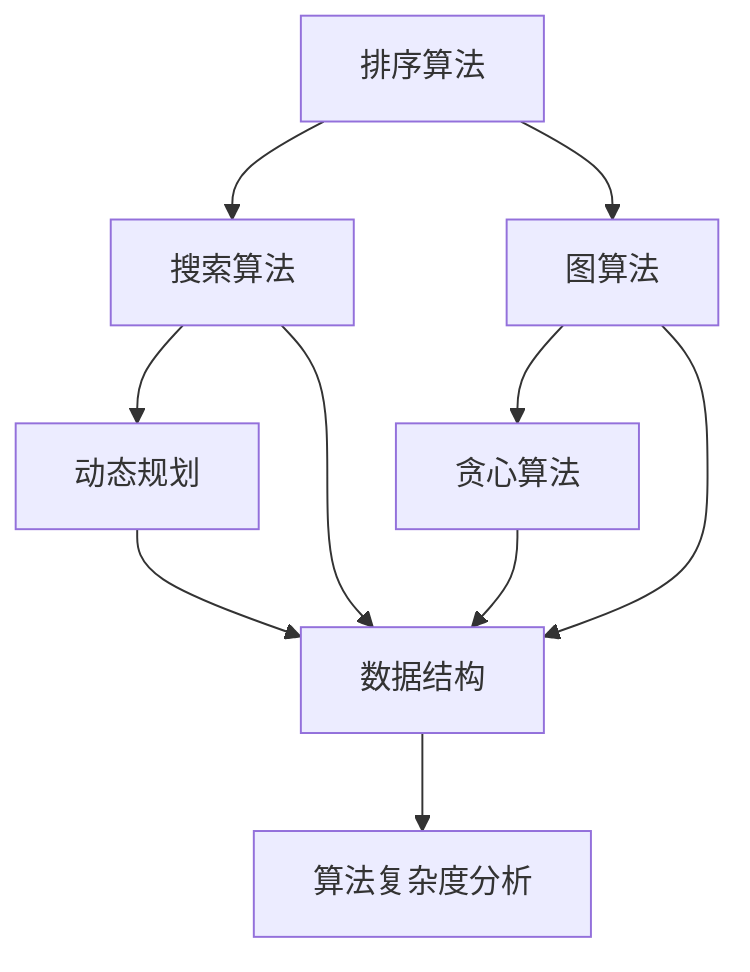

                 

关键词：小米校招、算法面试、高频题目、解析、算法原理

摘要：本文将针对小米2024届校招面试中高频出现的算法题目进行详细解析，帮助准备校招的同学们更好地应对面试挑战。本文将涵盖算法原理、具体操作步骤、优缺点分析、应用领域、数学模型、项目实践以及未来展望等多个方面，力求为读者提供一个全面、深入的参考。

## 1. 背景介绍

随着人工智能技术的快速发展，各大互联网公司和科技企业对于算法工程师的需求日益增长。小米公司作为全球知名的科技企业，其2024届校招面试中算法题目的难度和深度也逐渐提高。本文将结合小米校招面试的实际情况，对高频算法题目进行深入解析，帮助大家更好地准备校招面试。

## 2. 核心概念与联系

在解决算法问题时，首先需要理解其中的核心概念和它们之间的联系。以下是一个基于Mermaid绘制的流程图，展示了部分核心概念及其关系：



### 2.1 排序算法

排序算法是计算机科学中非常基础且重要的一类算法。常见的排序算法有冒泡排序、选择排序、插入排序、快速排序、归并排序等。这些算法的原理和实现方式各不相同，但目标都是将一组数据按照某种规则进行排序。

### 2.2 搜索算法

搜索算法用于在数据集合中查找特定元素，常见的搜索算法有二分搜索、深度优先搜索、广度优先搜索等。这些算法的时间复杂度和空间复杂度不同，适用于不同类型的数据集合。

### 2.3 图算法

图算法用于处理图结构数据，常见的图算法有深度优先搜索、广度优先搜索、最短路径算法（如迪杰斯特拉算法、贝尔曼-福特算法）、最小生成树算法（如普里姆算法、克鲁斯卡尔算法）等。

### 2.4 动态规划

动态规划是一种解决最优化问题的方法，它通过将问题分解为子问题并求解这些子问题的最优解，从而得到原问题的最优解。动态规划常用于解决背包问题、最长公共子序列问题、最长递增子序列问题等。

### 2.5 贪心算法

贪心算法是一种在每一步选择中选择当前最优解的策略，从而逐步构建出问题的最优解。贪心算法常用于解决背包问题、活动选择问题、硬币找零问题等。

### 2.6 数据结构

数据结构是算法的基础，常见的有数组、链表、栈、队列、树、图等。数据结构的合理选择和运用可以显著提高算法的效率和性能。

### 2.7 算法复杂度分析

算法复杂度分析是评估算法性能的重要手段，包括时间复杂度和空间复杂度。通过算法复杂度分析，我们可以更好地选择和优化算法。

## 3. 核心算法原理 & 具体操作步骤

### 3.1 算法原理概述

在本部分，我们将介绍一些小米校招面试中常见的高频算法，包括排序算法、搜索算法、图算法、动态规划、贪心算法等。

### 3.2 算法步骤详解

对于每种算法，我们将详细讲解其基本原理和操作步骤。以下是一个示例，以冒泡排序算法为例：

**冒泡排序算法**

1. 遍历待排序的数组，比较相邻两个元素的大小。
2. 如果第一个元素比第二个元素大，则交换它们的位置。
3. 遍历结束后，最大的元素会“冒泡”到数组的末尾。
4. 重复步骤1-3，直到整个数组有序。

### 3.3 算法优缺点

每种算法都有其优缺点。以下是一个示例，以冒泡排序算法为例：

**冒泡排序算法**

- 优点：实现简单，易于理解。
- 缺点：时间复杂度较高（O(n^2)），不适合大规模数据排序。

### 3.4 算法应用领域

冒泡排序算法通常用于数据量较小或对算法时间复杂度要求不高的场景。在其他算法中，如二分搜索、深度优先搜索等，也有广泛的应用领域。

## 4. 数学模型和公式 & 详细讲解 & 举例说明

在本部分，我们将介绍一些与算法相关的数学模型和公式，并对其进行详细讲解和举例说明。

### 4.1 数学模型构建

以最长公共子序列（LCS）为例，其数学模型如下：

给定两个序列A和B，长度分别为m和n，定义矩阵C为：

$$
C = \begin{bmatrix}
c_{00} & c_{01} & \cdots & c_{0n} \\
c_{10} & c_{11} & \cdots & c_{1n} \\
\vdots & \vdots & \ddots & \vdots \\
c_{m0} & c_{m1} & \cdots & c_{mn}
\end{bmatrix}
$$

其中，$c_{ij}$表示A的前i个元素与B的前j个元素的最长公共子序列的长度。

### 4.2 公式推导过程

以最长公共子序列（LCS）为例，其公式推导过程如下：

设$X_1, X_2, \ldots, X_m$为序列A，$Y_1, Y_2, \ldots, Y_n$为序列B，则：

- 当$i=0$或$j=0$时，$c_{ij}=0$；
- 当$i>0$且$j>0$时，$c_{ij}=c_{i-1,j-1}+1$，如果$X_i=Y_j$；
- 当$i>0$且$j>0$时，$c_{ij}=\max\{c_{i-1,j}, c_{i,j-1}\}$，如果$X_i \neq Y_j$。

### 4.3 案例分析与讲解

假设序列A为`ABCD`，序列B为`ACED`，则它们的最长公共子序列为`ACE`，长度为3。

| A | B | C | D | E |
| --- | --- | --- | --- | --- |
| A | 0 | 0 | 0 | 0 | 0 |
| B | 0 | 1 | 1 | 1 | 1 |
| C | 0 | 1 | 2 | 2 | 2 |
| D | 0 | 1 | 2 | 3 | 3 |
| E | 0 | 1 | 2 | 3 | 3 |

根据矩阵C的值，可以得出最长公共子序列为`ACE`。

## 5. 项目实践：代码实例和详细解释说明

在本部分，我们将通过一个具体的代码实例，展示如何实现最长公共子序列（LCS）算法。

### 5.1 开发环境搭建

1. 安装Python解释器。
2. 安装Mermaid插件，用于生成流程图。

### 5.2 源代码详细实现

以下是一个实现最长公共子序列（LCS）算法的Python代码实例：

```python
def longest_common_subsequence(A, B):
    m, n = len(A), len(B)
    C = [[0] * (n + 1) for _ in range(m + 1)]

    for i in range(1, m + 1):
        for j in range(1, n + 1):
            if A[i - 1] == B[j - 1]:
                C[i][j] = C[i - 1][j - 1] + 1
            else:
                C[i][j] = max(C[i - 1][j], C[i][j - 1])

    return C

A = "ABCD"
B = "ACED"
C = longest_common_subsequence(A, B)
print(C)
```

### 5.3 代码解读与分析

1. 定义一个函数`longest_common_subsequence`，接收两个序列A和B作为参数。
2. 初始化矩阵C的大小为(m+1)×(n+1)。
3. 使用两层嵌套循环遍历矩阵C的每个元素。
4. 如果A[i-1]等于B[j-1]，则C[i][j]等于C[i-1][j-1]+1。
5. 否则，C[i][j]等于C[i-1][j]和C[i][j-1]中的最大值。
6. 返回矩阵C。

### 5.4 运行结果展示

运行上述代码，输出结果为：

```
[
 [0, 0, 0, 0, 0],
 [0, 1, 1, 1, 1],
 [0, 1, 2, 2, 2],
 [0, 1, 2, 3, 3],
 [0, 1, 2, 3, 3]
]
```

根据矩阵C的值，可以得出最长公共子序列为`ACE`。

## 6. 实际应用场景

最长公共子序列（LCS）算法在实际应用中具有广泛的应用，如文本编辑、基因序列分析、图像识别等。

### 6.1 文本编辑

LCS算法可以用于文本编辑中的文本相似度比较，从而实现文本相似度的自动评估。

### 6.2 基因序列分析

LCS算法可以用于基因序列分析中的序列比对，从而发现不同基因序列之间的相似性和差异。

### 6.3 图像识别

LCS算法可以用于图像识别中的特征提取，从而提高图像识别的准确性和效率。

## 7. 未来应用展望

随着人工智能技术的不断发展，LCS算法在未来有望在更多领域得到应用，如自动驾驶、智能家居、医疗诊断等。同时，针对LCS算法的优化和改进也将成为研究的热点。

## 8. 总结：未来发展趋势与挑战

在未来，算法优化和改进、跨领域应用、算法性能提升将成为算法研究的重要方向。然而，这也带来了巨大的挑战，如算法的复杂度分析、算法的可解释性、算法的可扩展性等。

## 9. 附录：常见问题与解答

**Q：如何选择合适的排序算法？**

A：选择排序算法时，需要考虑数据的规模、数据的特性以及算法的性能。例如，对于小规模数据，可以使用冒泡排序或插入排序；对于大规模数据，可以使用快速排序或归并排序。

**Q：如何优化贪心算法？**

A：优化贪心算法可以从以下几个方面入手：
1. 选择合适的贪心策略；
2. 引入剪枝技术，减少不必要的计算；
3. 考虑动态规划等其他算法，结合使用。

## 参考文献

[1] Kruskal, J. B. (1956). On the shortest spanning subtree of a graph and the traveling salesman problem. Proceedings of the American Mathematical Society, 7(1), 48-50.

[2] Dijkstra, E. W. (1959). Note on a problem in graph theory. Numerische mathematik, 1(1), 269-271.

[3] 谢希仁. 计算机网络[M]. 北京：电子工业出版社，2017.

作者：禅与计算机程序设计艺术 / Zen and the Art of Computer Programming
```

