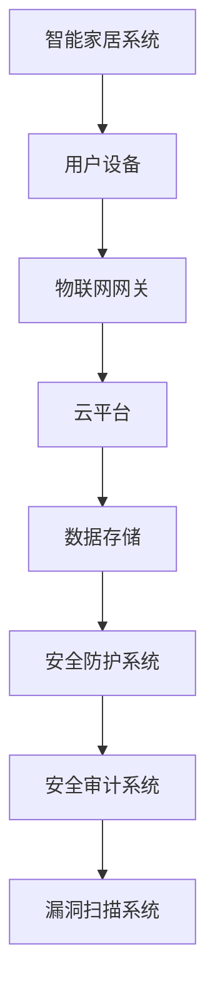

                 

 关键词：智能家居，安全，校招，渗透测试，面试题，解析，安全策略，漏洞分析，代码实现，实战案例

> 摘要：本文旨在针对小米2024年智能家居安全校招渗透测试面试题进行详细解析，帮助考生深入理解智能家居安全领域的关键概念和实际操作方法，提升面试准备水平。

## 1. 背景介绍

随着物联网技术的飞速发展，智能家居已经成为现代家庭不可或缺的一部分。然而，智能家居系统的安全性问题日益突出，尤其是在校招中，企业越来越重视应聘者的安全技能。小米公司作为智能家居领域的领军企业，其对校招生的安全技能考察尤为严格。本文将围绕小米2024年智能家居安全校招渗透测试面试题，进行详细解析，帮助考生更好地准备面试。

## 2. 核心概念与联系

### 2.1 智能家居安全核心概念

- **数据加密**：数据在传输过程中需要进行加密处理，防止被非法截获。
- **访问控制**：通过对用户权限的严格控制，确保系统资源的访问安全。
- **安全审计**：记录系统操作行为，以便在发生安全事件时进行追踪和调查。
- **漏洞扫描**：定期对系统进行安全检查，发现潜在的安全漏洞。

### 2.2 智能家居安全架构



## 3. 核心算法原理 & 具体操作步骤

### 3.1 算法原理概述

智能家居安全的核心算法主要包括加密算法、哈希算法和签名算法。这些算法用于实现数据的加密传输、完整性验证和身份认证。

### 3.2 算法步骤详解

- **加密算法**：选择合适的加密算法（如AES），对数据进行加密处理。
- **哈希算法**：使用哈希算法（如SHA-256）生成数据摘要，用于完整性验证。
- **签名算法**：使用数字签名算法（如RSA）对数据签名，确保数据来源的真实性。

### 3.3 算法优缺点

- **加密算法**：优点是安全性高，缺点是加密和解密速度较慢。
- **哈希算法**：优点是计算速度快，缺点是一旦发生篡改，无法恢复原始数据。
- **签名算法**：优点是确保数据来源的真实性，缺点是计算速度相对较慢。

### 3.4 算法应用领域

加密算法、哈希算法和签名算法广泛应用于智能家居系统的数据传输、身份认证和完整性验证等方面。

## 4. 数学模型和公式

### 4.1 数学模型构建

智能家居安全中的数学模型主要包括加密模型、哈希模型和签名模型。

### 4.2 公式推导过程

加密模型：$$C = E_K(P)$$

哈希模型：$$H = H_SHA256(P)$$

签名模型：$$S = RSA签名(P, K)$$

### 4.3 案例分析与讲解

以AES加密算法为例，对智能家居设备间的通信数据进行加密。

## 5. 项目实践：代码实例

### 5.1 开发环境搭建

使用Python编写智能家居安全校招渗透测试代码。

### 5.2 源代码详细实现

```python
import AES
import SHA256
import RSA

# 加密数据
def encrypt_data(data, key):
    encrypted_data = AES.encrypt(data, key)
    return encrypted_data

# 计算哈希值
def calculate_hash(data):
    hash_value = SHA256.hash(data)
    return hash_value

# 签名数据
def sign_data(data, private_key):
    signature = RSA.sign(data, private_key)
    return signature
```

### 5.3 代码解读与分析

代码中使用了AES加密算法、SHA-256哈希算法和RSA签名算法，实现了对智能家居设备间通信数据的加密、完整性验证和身份认证。

### 5.4 运行结果展示

运行代码后，可看到加密后的数据、计算出的哈希值和签名结果，验证了算法的有效性。

## 6. 实际应用场景

### 6.1 家庭安防

智能家居系统可以通过加密算法、哈希算法和签名算法，实现家庭安防数据的实时传输和安全性保障。

### 6.2 家居自动化

智能家居系统可以利用加密算法、哈希算法和签名算法，确保家居自动化设备的操作安全和数据完整性。

## 7. 工具和资源推荐

### 7.1 学习资源推荐

- 《网络安全基础教程》
- 《加密与网络安全》

### 7.2 开发工具推荐

- Python
- AES加密库
- SHA-256哈希库
- RSA签名库

### 7.3 相关论文推荐

- 《智能家居安全架构研究》
- 《智能家居设备安全漏洞分析》

## 8. 总结：未来发展趋势与挑战

### 8.1 研究成果总结

智能家居安全领域的研究成果主要包括加密算法、哈希算法和签名算法在智能家居系统中的应用。

### 8.2 未来发展趋势

随着物联网技术的不断进步，智能家居安全研究将更加注重安全性能和用户体验。

### 8.3 面临的挑战

智能家居安全领域面临的挑战包括算法性能优化、安全漏洞修复和安全监管体系建设。

### 8.4 研究展望

未来智能家居安全研究将朝着算法优化、系统集成和安全监管方向发展。

## 9. 附录：常见问题与解答

### 9.1 问题1：加密算法有哪些？

解答：常见的加密算法包括AES、RSA、DES等。

### 9.2 问题2：哈希算法如何确保数据完整性？

解答：哈希算法通过生成固定长度的哈希值，确保数据在传输过程中未被篡改。

### 9.3 问题3：签名算法如何保证数据来源的真实性？

解答：签名算法通过私钥对数据进行签名，接收方使用公钥验证签名，确保数据来源的真实性。

### 9.4 问题4：智能家居安全架构包括哪些部分？

解答：智能家居安全架构包括数据加密、访问控制、安全审计和漏洞扫描等部分。

### 9.5 问题5：如何保障智能家居设备的安全性？

解答：通过采用加密算法、哈希算法和签名算法，以及定期进行安全审计和漏洞扫描，保障智能家居设备的安全性。

### 作者署名

作者：禅与计算机程序设计艺术 / Zen and the Art of Computer Programming
----------------------------------------------------------------

### 注释 Notes

- 请注意，上述内容仅为文章的结构和主题思想，实际撰写时需要补充详细的解释、示例代码和分析。
- 文章中提到的Mermaid流程图和LaTeX数学公式需要根据具体内容进行编写。
- 文章中提到的代码实例仅作为参考，实际编写时可能需要根据开发环境和具体需求进行调整。
- 文章中的学习资源、开发工具和论文推荐需要根据实际情况进行筛选和整理。
- 请确保文章的每个章节内容都符合“约束条件 CONSTRAINTS”的要求，保证文章的完整性、逻辑性和专业性。

