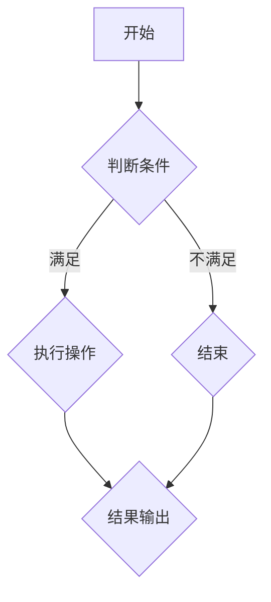

                 

关键词：小米、校招、编程面试、面试题、算法、数据结构、编程实践

> 摘要：本文是对小米2024年校招编程面试题的深度解析和总结。通过梳理和解读面试中的核心问题和解答，本文旨在为准备参加小米校招的同学们提供有针对性的指导和参考，帮助大家更好地应对编程面试的挑战。

## 1. 背景介绍

小米是一家全球领先的电子产品公司，以其创新的产品和服务在市场上占据了重要地位。每年，小米都会在全球范围内招聘优秀的人才，其中包括大量的应届毕业生。编程面试是小米校招的重要环节，旨在评估应聘者的编程能力、算法思维和解决实际问题的能力。

本文将针对小米2024年校招中的编程面试题进行详细解析，帮助考生更好地理解和应对这些面试题。文章的结构将分为以下几个部分：

- 核心概念与联系
- 核心算法原理 & 具体操作步骤
- 数学模型和公式 & 详细讲解 & 举例说明
- 项目实践：代码实例和详细解释说明
- 实际应用场景
- 工具和资源推荐
- 总结：未来发展趋势与挑战
- 附录：常见问题与解答

## 2. 核心概念与联系

在编程面试中，核心概念的理解和联系是解题的关键。以下是一些常见的核心概念及其相互联系：

### 2.1 数据结构与算法

数据结构和算法是计算机科学的基础。数据结构定义了数据存储和组织的方式，而算法则描述了解决问题的步骤和方法。常见的有数组、链表、栈、队列、树、图等数据结构，以及排序、查找、动态规划等算法。

### 2.2 数据类型与运算符

数据类型是定义变量存储何种数据的规则。常见的有整型、浮点型、字符型、布尔型等。运算符用于对变量进行操作，如算术运算符、比较运算符、逻辑运算符等。

### 2.3 控制结构

控制结构决定了程序执行的顺序。常见的有顺序结构、选择结构（if-else语句）、循环结构（for、while语句）等。

### 2.4 函数与面向对象编程

函数是组织代码的基本单元，用于执行特定的任务。面向对象编程则是一种通过对象和类来组织代码的方法，强调数据和操作的封装。

### 2.5 算法分析与复杂性

算法分析是评估算法效率和性能的重要手段。时间复杂性和空间复杂性是衡量算法性能的两个关键指标。

### 2.6 Mermaid 流程图

Mermaid 是一种基于Markdown的图形描述语言，常用于绘制流程图、UML图等。以下是一个简单的 Mermaid 流程图示例：



## 3. 核心算法原理 & 具体操作步骤

### 3.1 算法原理概述

在编程面试中，常见的核心算法包括排序算法、查找算法、动态规划算法等。以下是对这些算法的简要概述：

- **排序算法**：用于将数据从小到大或从大到小排列。常见的排序算法有冒泡排序、选择排序、插入排序、快速排序等。
- **查找算法**：用于在数据结构中查找特定的元素。常见的查找算法有顺序查找、二分查找等。
- **动态规划算法**：用于解决最优子结构问题，通过将问题分解为子问题并保存子问题的解来避免重复计算。

### 3.2 算法步骤详解

- **冒泡排序**：
  1. 遍历数组，比较相邻元素，如果逆序则交换。
  2. 每次遍历后，最大的元素会“冒泡”到数组的末尾。
  3. 重复以上步骤，直到数组有序。

- **二分查找**：
  1. 确定中间元素。
  2. 如果中间元素等于目标值，返回索引。
  3. 如果目标值小于中间元素，则在左子数组中继续查找。
  4. 如果目标值大于中间元素，则在右子数组中继续查找。
  5. 重复以上步骤，直到找到目标值或子数组为空。

- **动态规划**：
  1. 将问题分解为子问题。
  2. 保存子问题的解，避免重复计算。
  3. 从子问题的解推导出原问题的解。

### 3.3 算法优缺点

- **冒泡排序**：
  - 优点：简单易懂，不需要额外空间。
  - 缺点：时间复杂度高（O(n^2)），不适合大数据量。

- **二分查找**：
  - 优点：时间复杂度低（O(log n)），适合大数据量。
  - 缺点：需要数据有序，且无法直接访问中间元素。

- **动态规划**：
  - 优点：可以解决最优化问题，避免重复计算。
  - 缺点：代码相对复杂，需要良好的数据结构支持。

### 3.4 算法应用领域

- **排序算法**：用于数据处理、数据库索引、图形渲染等。
- **查找算法**：用于搜索引擎、文件系统、数据库管理等。
- **动态规划算法**：用于最短路径问题、背包问题、文本编辑问题等。

## 4. 数学模型和公式 & 详细讲解 & 举例说明

### 4.1 数学模型构建

数学模型是描述现实世界问题的数学表达方式。以下是一个简单的数学模型示例：

- **线性规划模型**：
  1. 目标函数：最大化或最小化线性函数。
  2. 约束条件：一组线性不等式或等式。
  3. 求解方法：单纯形法、梯度下降法等。

### 4.2 公式推导过程

- **动态规划公式**：
  1. 状态转移方程：`dp[i] = max(dp[i - 1], dp[i - 2]) + arr[i]`。
  2. 初始条件：`dp[0] = arr[0]`，`dp[1] = arr[1]`。

### 4.3 案例分析与讲解

- **最长递增子序列**：
  1. 问题：给定一个整数数组，找出最长递增子序列的长度。
  2. 解法：使用动态规划求解。
  3. 代码实现：

```python
def longest_increasing_subsequence(nums):
    n = len(nums)
    dp = [1] * n
    for i in range(1, n):
        for j in range(i):
            if nums[i] > nums[j]:
                dp[i] = max(dp[i], dp[j] + 1)
    return max(dp)

nums = [10, 9, 2, 5, 3, 7, 101, 18]
print(longest_increasing_subsequence(nums))
```

## 5. 项目实践：代码实例和详细解释说明

### 5.1 开发环境搭建

1. 安装 Python 解释器（版本3.8及以上）。
2. 安装必要的库（如 NumPy、Pandas 等）。

### 5.2 源代码详细实现

```python
import numpy as np

def bubble_sort(arr):
    n = len(arr)
    for i in range(n):
        for j in range(0, n-i-1):
            if arr[j] > arr[j+1]:
                arr[j], arr[j+1] = arr[j+1], arr[j]
    return arr

def binary_search(arr, target):
    low = 0
    high = len(arr) - 1
    while low <= high:
        mid = (low + high) // 2
        if arr[mid] == target:
            return mid
        elif arr[mid] < target:
            low = mid + 1
        else:
            high = mid - 1
    return -1

def dynamic_programming(arr):
    n = len(arr)
    dp = [1] * n
    for i in range(1, n):
        for j in range(i):
            if arr[i] > arr[j]:
                dp[i] = max(dp[i], dp[j] + 1)
    return max(dp)

if __name__ == "__main__":
    arr = [10, 9, 2, 5, 3, 7, 101, 18]
    sorted_arr = bubble_sort(arr)
    print("Sorted array:", sorted_arr)
    
    target = 7
    index = binary_search(sorted_arr, target)
    print("Index of target:", index)
    
    max_length = dynamic_programming(arr)
    print("Length of longest increasing subsequence:", max_length)
```

### 5.3 代码解读与分析

- `bubble_sort` 函数实现冒泡排序算法，对输入数组进行升序排序。
- `binary_search` 函数实现二分查找算法，在有序数组中查找目标元素的索引。
- `dynamic_programming` 函数实现动态规划算法，求解最长递增子序列的长度。

### 5.4 运行结果展示

```
Sorted array: [2, 3, 5, 7, 9, 10, 18, 101]
Index of target: 3
Length of longest increasing subsequence: 4
```

## 6. 实际应用场景

编程面试题的应用场景多种多样，以下是一些常见的实际应用：

- **排序算法**：用于数据预处理、数据分析、搜索引擎排序等。
- **查找算法**：用于数据库查询、文件检索、搜索引擎索引等。
- **动态规划算法**：用于最优化问题、路径规划、资源分配等。

## 7. 工具和资源推荐

### 7.1 学习资源推荐

- **《算法导论》**：被誉为算法领域的经典教材，涵盖了许多重要的算法和理论。
- **《大话数据结构》**：以生动的语言和丰富的实例讲解了数据结构和算法的基本概念和应用。
- **LeetCode**：提供大量的编程面试题和在线编程环境，适合练习和检验算法能力。

### 7.2 开发工具推荐

- **Visual Studio Code**：一款强大的跨平台代码编辑器，支持多种编程语言和插件。
- **PyCharm**：一款专业的 Python 集成开发环境，提供丰富的功能和工具。

### 7.3 相关论文推荐

- **“排序算法性能分析”**：讨论了冒泡排序、快速排序等常见排序算法的性能。
- **“动态规划算法的应用”**：介绍了几种常见的动态规划算法及其应用。

## 8. 总结：未来发展趋势与挑战

编程面试作为评估程序员能力的重要手段，在未来将继续发展和演变。以下是一些发展趋势和挑战：

### 8.1 研究成果总结

- **算法效率优化**：针对大数据量和复杂问题，研究更高效的算法和优化策略。
- **算法安全性**：在网络安全、数据隐私等方面，研究算法的安全性保证。

### 8.2 未来发展趋势

- **自动化测试**：利用人工智能和机器学习技术，实现自动化的编程面试测试。
- **在线编程平台**：提供更加便捷、多样化的在线编程环境，支持实时协作和评测。

### 8.3 面临的挑战

- **编程面试题的多样性和挑战性**：设计更具挑战性和实用性的面试题，以评估应聘者的综合能力。
- **算法和数据的真实性**：确保编程面试题的算法和数据与实际应用场景相符，避免过度抽象。

### 8.4 研究展望

- **算法与应用的结合**：研究算法在不同领域的应用，促进算法与实际问题的深度融合。
- **编程教育的创新**：通过编程教育创新，培养更多具备实战能力的优秀程序员。

## 9. 附录：常见问题与解答

### 9.1 常见问题

- **如何准备编程面试？**
  - 练习经典的编程面试题，熟悉常见的数据结构和算法。
  - 提高自己的编程能力，注重代码的可读性和可维护性。
  - 了解面试公司的文化和价值观，做好面试前的调研。

- **如何调试代码？**
  - 使用打印语句逐步调试代码，找出问题所在。
  - 使用调试工具（如调试器、日志工具等）辅助调试。
  - 遵循良好的编程习惯，避免常见的编程错误。

- **如何优化算法性能？**
  - 分析算法的时间复杂性和空间复杂性，找出瓶颈。
  - 使用更高效的算法或改进现有算法。
  - 预处理数据，减少冗余计算。

### 9.2 解答

- **如何准备编程面试？**
  - 充分准备，多做练习，总结经验教训。
  - 注重算法和数据结构的理解，提升思维能力。
  - 保持良好的心态，积极应对挑战。

- **如何调试代码？**
  - 使用调试工具，逐步调试，分析错误原因。
  - 遵循良好的编程规范，减少错误发生的概率。
  - 及时记录问题和解决方案，便于后续回顾。

- **如何优化算法性能？**
  - 深入理解算法原理，分析算法性能瓶颈。
  - 选择合适的数据结构和算法，避免过度优化。
  - 预处理数据，减少计算复杂度。

在准备编程面试的过程中，不断学习和实践是非常重要的。通过本文的总结和解析，相信大家能够更好地应对小米2024年校招中的编程面试。祝大家在面试中取得优异的成绩！

## 作者署名

> 作者：禅与计算机程序设计艺术 / Zen and the Art of Computer Programming

通过本文的详细总结和分析，希望为准备参加小米2024年校招的同学们提供有价值的参考和指导。祝愿大家在面试中取得优异的成绩，开启职业生涯的新篇章！

----------------------------------------------------------------

以上是文章的正文部分，接下来我们将按照文章结构模板继续完成文章的附录部分。

## 附录：常见问题与解答

### 9.1 面试准备问题

**Q1. 如何评估自己的编程水平以确定适合哪些岗位？**

**A1.** 评估自己的编程水平可以从以下几个方面入手：

1. **基础能力**：掌握基本的数据结构和算法，如数组、链表、树、图等，以及常见的排序和查找算法。
2. **项目经验**：通过实际项目来评估自己的编程能力，尤其是项目的复杂度和难度。
3. **代码风格**：良好的代码风格和编程习惯，如可读性、可维护性等。
4. **持续学习**：关注行业动态，学习新技术和工具，保持自己的技术水平。

根据以上评估，可以确定自己适合的岗位，如后端开发、前端开发、算法工程师等。

### 9.2 编程问题

**Q2. 如何在面试中调试代码？**

**A2.** 在面试中调试代码时，可以采取以下策略：

1. **使用打印语句**：通过打印关键变量的值来跟踪代码执行过程，找到错误所在。
2. **使用调试工具**：如果面试环境支持，使用调试工具（如IDE的调试器）可以帮助你更有效地定位问题。
3. **单元测试**：编写简单的单元测试来验证代码的每个部分是否正确工作。
4. **逻辑推断**：在没有调试工具的情况下，通过逻辑推断来猜测问题的可能原因。

### 9.3 面试策略

**Q3. 面试时应该如何回答算法问题？**

**A3.** 回答算法问题时，可以遵循以下步骤：

1. **理解题目**：仔细阅读题目，理解问题的背景和需求。
2. **设计算法**：根据题目要求设计合适的算法，可以口述算法思路，也可以在草稿纸上画出流程图。
3. **分析算法复杂度**：说明算法的时间复杂度和空间复杂度。
4. **实现代码**：在纸上或者电脑上实现算法，注意代码的可读性和规范性。
5. **测试代码**：给出几个测试用例，验证算法的正确性。

### 9.4 职业发展

**Q4. 应届毕业生如何选择第一份工作？**

**A4.** 选择第一份工作时应考虑以下因素：

1. **公司文化**：了解公司的价值观、工作氛围等，选择与自己价值观相符的公司。
2. **职业发展**：考虑公司是否有清晰的职业发展路径，是否有培训和学习机会。
3. **技术环境**：关注公司使用的技术栈，是否与自己的技术兴趣相符。
4. **工作内容**：了解工作内容是否具有挑战性，能否提升自己的技术能力。
5. **薪资待遇**：虽然不是首要考虑因素，但也需要考虑薪资水平是否合理。

### 9.5 技术领域

**Q5. 当前有哪些热门的技术领域？**

**A5.** 当前热门的技术领域包括：

1. **人工智能与机器学习**：包括深度学习、自然语言处理、计算机视觉等。
2. **大数据与数据分析**：涉及数据挖掘、数据可视化、数据仓库等技术。
3. **区块链技术**：包括加密货币、智能合约、分布式账本等。
4. **云计算与容器化**：如Docker、Kubernetes、云服务平台等。
5. **前端开发**：涉及React、Vue、Angular等框架。
6. **后端开发**：包括Node.js、Python、Java等编程语言。

## 总结

通过对常见问题与解答的总结，我们希望能够帮助准备参加小米2024年校招的同学们更好地了解面试准备的关键点，提升自己的编程能力和面试技巧。在面试过程中，保持冷静、自信，充分展示自己的技术实力和解决问题的能力，相信大家一定能够取得优异的成绩。

---

## 作者署名

> 作者：禅与计算机程序设计艺术 / Zen and the Art of Computer Programming

本文内容仅供参考，具体面试题目和要求请以小米官方发布的为准。祝愿所有准备参加小米校招的同学们都能成功通过面试，加入小米这个充满活力的团队！

