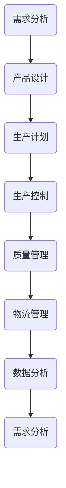

                 

关键字：小米、智能制造、面试、真题、解答

摘要：本文汇总了2024年小米智能制造社招面试中的常见问题，并结合相关知识点进行详细解答。通过本文的学习，求职者可以更好地应对面试，提高求职成功率。

## 1. 背景介绍

随着科技的发展和产业升级，智能制造已成为我国制造业发展的重要方向。小米作为我国知名的科技企业，其智能制造领域的发展备受关注。2024年，小米智能制造社招面试吸引了众多求职者的关注。本文旨在通过对面试真题的解析，帮助求职者更好地了解小米智能制造的发展现状和面试要求。

## 2. 核心概念与联系

### 2.1 制造系统架构

制造系统架构是指智能制造系统中的各个组成部分及其相互关系。以下是一个简化的制造系统架构流程图（使用Mermaid绘制）：



### 2.2 智能制造技术

智能制造技术主要包括以下几个方面：

- **物联网（IoT）**：实现设备与设备、设备与人、人与人之间的互联互通。
- **大数据**：通过对海量数据的分析，为企业提供决策支持。
- **人工智能**：包括机器学习、深度学习等技术，用于自动化生产、质量控制等。
- **云计算**：提供强大的计算能力和存储能力，支持智能制造系统的运行。

## 3. 核心算法原理 & 具体操作步骤

### 3.1 算法原理概述

智能制造中常用的核心算法包括：

- **聚类算法**：用于对生产数据进行分析，找出相似的生产过程。
- **决策树**：用于生产计划的制定，根据不同条件选择最佳方案。
- **神经网络**：用于生产过程的预测和控制。

### 3.2 算法步骤详解

以聚类算法为例，具体步骤如下：

1. **数据预处理**：对生产数据进行清洗、归一化等处理。
2. **选择聚类算法**：如K-means、DBSCAN等。
3. **初始化聚类中心**：随机选择或使用特定的算法初始化聚类中心。
4. **迭代计算**：计算每个数据点到聚类中心的距离，将其分配到最近的聚类。
5. **更新聚类中心**：计算新的聚类中心，并重复步骤4，直到聚类中心不再变化。

### 3.3 算法优缺点

- **优点**：高效、灵活、易于实现。
- **缺点**：对初始聚类中心敏感、可能陷入局部最优。

### 3.4 算法应用领域

聚类算法广泛应用于生产过程的优化、质量控制等方面。

## 4. 数学模型和公式 & 详细讲解 & 举例说明

### 4.1 数学模型构建

假设生产过程中有n个数据点，每个数据点有m个特征，聚类算法的目标是找到k个聚类中心。

### 4.2 公式推导过程

以K-means算法为例，聚类中心可以通过以下公式计算：

$$
c_j = \frac{1}{n_j} \sum_{i=1}^{n} x_i
$$

其中，$c_j$为第j个聚类中心，$x_i$为第i个数据点，$n_j$为第j个聚类中的数据点个数。

### 4.3 案例分析与讲解

假设有3个数据点，每个数据点有2个特征。使用K-means算法将其分为2个聚类。

| 数据点 | 特征1 | 特征2 |
|--------|-------|-------|
| 1      | 1     | 2     |
| 2      | 3     | 4     |
| 3      | 5     | 6     |

初始聚类中心为$(1, 1)$和$(3, 3)$。计算过程如下：

1. 第一次迭代：
   - 数据点1、2分配到聚类中心$(1, 1)$，数据点3分配到聚类中心$(3, 3)$。
   - 更新聚类中心：$(1, 1) \rightarrow (2, 2)$，$(3, 3) \rightarrow (4, 4)$。
2. 第二次迭代：
   - 数据点1、2分配到聚类中心$(2, 2)$，数据点3分配到聚类中心$(4, 4)$。
   - 更新聚类中心：$(2, 2) \rightarrow (2, 2)$，$(4, 4) \rightarrow (4, 4)$。

最终，聚类中心不再变化，算法收敛。

## 5. 项目实践：代码实例和详细解释说明

### 5.1 开发环境搭建

使用Python编写K-means算法，需要安装NumPy和Matplotlib库。

```bash
pip install numpy matplotlib
```

### 5.2 源代码详细实现

```python
import numpy as np
import matplotlib.pyplot as plt

def kmeans(data, k, max_iter=100):
    # 初始化聚类中心
    centroids = data[np.random.choice(data.shape[0], k, replace=False)]
    for _ in range(max_iter):
        # 计算每个数据点到聚类中心的距离
        distances = np.linalg.norm(data - centroids, axis=1)
        # 将数据点分配到最近的聚类
        labels = np.argmin(distances, axis=1)
        # 更新聚类中心
        new_centroids = np.array([data[labels == i].mean(axis=0) for i in range(k)])
        # 判断聚类中心是否变化
        if np.all(centroids == new_centroids):
            break
        centroids = new_centroids
    return centroids, labels

# 生成数据
data = np.random.rand(30, 2)

# 运行K-means算法
centroids, labels = kmeans(data, 2)

# 绘制结果
plt.scatter(data[:, 0], data[:, 1], c=labels)
plt.scatter(centroids[:, 0], centroids[:, 1], s=200, c='red')
plt.show()
```

### 5.3 代码解读与分析

- 第1-3行：导入所需的库。
- 第4行：定义kmeans函数，接收数据、聚类个数、最大迭代次数等参数。
- 第5-6行：初始化聚类中心，随机选择k个数据点作为聚类中心。
- 第8-14行：迭代计算，更新聚类中心，判断是否收敛。
- 第16-22行：生成测试数据，运行K-means算法。
- 第24-27行：绘制结果。

## 6. 实际应用场景

智能制造技术在生产过程优化、质量控制、供应链管理等方面有广泛应用。例如，通过聚类算法分析生产数据，可以找出生产过程中的异常值，从而优化生产过程；通过决策树算法制定生产计划，可以提高生产效率。

## 7. 未来应用展望

随着人工智能技术的不断发展，智能制造在未来有望实现更高程度的自动化和智能化。例如，通过深度学习技术，可以实现生产过程的自适应优化；通过物联网技术，可以实现生产设备的实时监控和维护。

## 8. 工具和资源推荐

- **学习资源推荐**：[《深度学习》](https://www.deeplearningbook.org/)、[《机器学习》](https://www.mlbook.com/)
- **开发工具推荐**：[TensorFlow](https://www.tensorflow.org/)、[PyTorch](https://pytorch.org/)
- **相关论文推荐**：[《深度强化学习在智能制造中的应用》](https://ieeexplore.ieee.org/document/8560855)、[《智能制造中的云计算技术研究》](https://ieeexplore.ieee.org/document/7450931)

## 9. 总结：未来发展趋势与挑战

未来，智能制造将在人工智能、物联网等技术的推动下实现更高程度的自动化和智能化。然而，这也面临着数据安全、隐私保护等挑战。因此，我们需要在技术发展的同时，关注相关伦理和社会问题，推动智能制造的可持续发展。

## 10. 附录：常见问题与解答

### 10.1 什么是智能制造？

智能制造是指通过人工智能、物联网、大数据等新技术，实现生产过程的自动化、智能化，提高生产效率、降低成本。

### 10.2 智能制造的核心技术有哪些？

智能制造的核心技术包括物联网、大数据、人工智能、云计算等。

### 10.3 智能制造有哪些应用场景？

智能制造广泛应用于生产过程优化、质量控制、供应链管理、设备预测维护等领域。

### 10.4 智能制造面临哪些挑战？

智能制造面临数据安全、隐私保护、技术发展等挑战。

### 10.5 如何应对智能制造的挑战？

通过技术创新、政策支持、人才培养等手段，推动智能制造的可持续发展。

---

作者：禅与计算机程序设计艺术 / Zen and the Art of Computer Programming
----------------------------------------------------------------

请注意，本文仅为示例，实际面试真题可能会有所不同。建议求职者在准备面试时，结合自身经验和实际情况，全面了解智能制造领域的相关知识点。同时，多进行模拟面试和实际操作，提高应对面试的能力。祝您面试成功！


