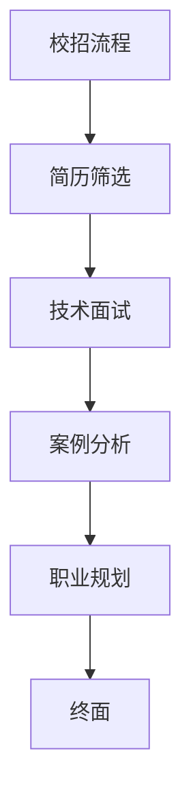

                 

关键词：小米有品、校招面试、品牌电商、面试题详解、技术考察、案例分析、职业规划

> 摘要：本文详细解析了小米有品2024校招品牌电商面试题，包括技术面试、案例分析、职业规划等环节。通过对面试题的深入剖析，帮助即将参加校招的同学更好地准备面试，提高面试成功率。

## 1. 背景介绍

随着互联网的快速发展，电商行业已成为我国经济的增长点。小米有品作为小米集团旗下的高端电商品牌，以其独特的定位和优质的产品深受消费者喜爱。为了吸引更多优秀人才加入，小米有品每年都会开展校招活动，为广大应届毕业生提供就业机会。本文旨在通过对2024年校招品牌电商面试题的详细解析，帮助考生更好地应对面试挑战。

### 1.1 小米有品简介

小米有品是一家专注于高端消费品的电商平台，致力于为用户提供优质、时尚、个性化的产品。自成立以来，小米有品迅速崛起，已成为电商领域的一匹“黑马”。其特色定位和优质产品深受消费者喜爱，成为了越来越多消费者的购物首选。

### 1.2 校招面试的重要性

校招面试是应届毕业生进入职场的第一步，也是企业筛选人才的重要环节。通过面试，企业可以了解应聘者的综合素质、专业能力和职业规划。对于应届毕业生来说，一次成功的面试意味着踏入职场的第一步。因此，充分准备校招面试至关重要。

## 2. 核心概念与联系

为了更好地理解面试题，我们首先需要了解一些核心概念和联系。以下是一个简化的Mermaid流程图，展示了面试过程中涉及的主要概念和它们之间的关系。



### 2.1 校招流程

校招流程主要包括简历筛选、技术面试、案例分析、职业规划和终面等环节。每个环节都有其独特的考察重点和目的。

### 2.2 简历筛选

简历筛选是校招的第一步，企业通过简历了解应聘者的基本信息、教育背景、实习经历等。优秀的简历是成功的一半，因此，应聘者需要认真准备简历，突出自己的优势。

### 2.3 技术面试

技术面试是校招的核心环节，主要考察应聘者的专业知识、编程能力、数据结构和算法等。企业通过技术面试了解应聘者的技术水平和解决问题的能力。

### 2.4 案例分析

案例分析环节要求应聘者针对实际案例进行分析和解答，考察应聘者的逻辑思维、分析问题和解决问题的能力。此环节有助于企业了解应聘者的实际工作能力。

### 2.5 职业规划

职业规划环节要求应聘者阐述自己的职业规划，考察应聘者的职业目标和发展方向。此环节有助于企业了解应聘者的长远规划和是否与企业发展目标相符。

### 2.6 终面

终面是校招的最后一步，主要考察应聘者的综合素质和团队合作能力。企业通过终面决定是否正式录用应聘者。

## 3. 核心算法原理 & 具体操作步骤

### 3.1 算法原理概述

在本章节，我们将介绍面试中可能涉及的一些核心算法原理，包括数据结构、算法复杂度分析、动态规划、贪心算法等。

### 3.2 算法步骤详解

#### 3.2.1 数据结构与算法复杂度分析

1. **数组**：数组是一种基本的数据结构，用于存储一系列有序的元素。数组的时间复杂度通常与元素数量n相关。

2. **链表**：链表是一种由节点组成的线性数据结构。链表的时间复杂度与节点数量和链表类型（单向、双向、循环）有关。

3. **树**：树是一种重要的非线性数据结构，包括二叉树、平衡树等。树的时间复杂度通常与树的高度相关。

4. **图**：图是一种由节点和边组成的数据结构，用于表示网络或关系。图的时间复杂度与节点数量和边数量有关。

#### 3.2.2 动态规划

动态规划是一种解决最优化问题的算法方法，通过将问题分解为子问题，并利用子问题的解来构建原问题的解。动态规划的基本步骤包括：

1. **定义状态**：将问题分解为子问题，定义每个子问题的状态。

2. **状态转移方程**：根据子问题的状态，建立状态转移方程。

3. **初始化**：初始化状态表。

4. **计算状态表**：根据状态转移方程，计算状态表。

5. **输出结果**：根据状态表，输出最终结果。

#### 3.2.3 贪心算法

贪心算法是一种在每一步选择中都采取当前最佳选择的策略。贪心算法的基本步骤包括：

1. **确定选择标准**：确定每一步选择的标准。

2. **执行选择**：根据选择标准，执行选择。

3. **更新状态**：更新当前状态。

4. **重复执行**：重复执行选择和更新状态，直到满足结束条件。

### 3.3 算法优缺点

#### 3.3.1 动态规划

优点：

1. **高效**：动态规划通常能以较低的时间复杂度解决复杂问题。

2. **灵活**：动态规划适用于各种最优化问题。

缺点：

1. **需要大量空间**：动态规划需要存储状态表，空间复杂度较高。

2. **不易实现**：动态规划算法通常较为复杂，需要较高的编程技巧。

#### 3.3.2 贪心算法

优点：

1. **简单**：贪心算法通常较为简单，易于实现。

2. **高效**：贪心算法能以较低的时间复杂度解决某些问题。

缺点：

1. **不总是最优**：贪心算法并不总是能找到最优解。

2. **适用范围有限**：贪心算法仅适用于某些特定类型的问题。

### 3.4 算法应用领域

动态规划和贪心算法广泛应用于计算机科学、运筹学、经济学等领域。以下是一些常见的应用场景：

1. **计算机科学**：算法设计、数据结构分析、最优化问题等。

2. **运筹学**：资源分配、调度问题、网络优化等。

3. **经济学**：市场均衡、博弈论、决策分析等。

## 4. 数学模型和公式 & 详细讲解 & 举例说明

### 4.1 数学模型构建

数学模型是解决实际问题的重要工具。在本章节，我们将介绍一些常见的数学模型及其构建方法。

#### 4.1.1 线性规划模型

线性规划模型是一种最优化问题，其目标是在满足一定约束条件下，求解线性目标函数的最优解。线性规划模型的构建步骤包括：

1. **定义决策变量**：确定决策问题的决策变量。

2. **建立目标函数**：根据决策问题的目标，建立线性目标函数。

3. **列出约束条件**：根据决策问题的约束条件，列出相应的约束条件。

4. **求解最优解**：利用线性规划求解算法，求解最优解。

#### 4.1.2 网络流模型

网络流模型是解决网络优化问题的重要工具。网络流模型的构建步骤包括：

1. **定义网络**：确定网络的节点和边。

2. **建立流量平衡方程**：根据网络节点和边的流量，建立流量平衡方程。

3. **建立流量约束条件**：根据网络流量约束，建立相应的约束条件。

4. **求解最优解**：利用网络流求解算法，求解最优解。

### 4.2 公式推导过程

在本章节，我们将对一些常见的数学公式进行推导。

#### 4.2.1 微积分基本公式

微积分基本公式包括微分公式和积分公式。以下是一个简单的微分公式推导：

$$
\frac{d}{dx}(x^n) = nx^{n-1}
$$

推导过程如下：

1. **定义导数**：设 $f(x) = x^n$，则 $f'(x)$ 表示 $f(x)$ 在 $x$ 点的导数。

2. **利用极限定义导数**：根据极限定义，我们有：

$$
f'(x) = \lim_{h \to 0} \frac{f(x+h) - f(x)}{h}
$$

3. **代入函数表达式**：代入 $f(x) = x^n$，得到：

$$
f'(x) = \lim_{h \to 0} \frac{(x+h)^n - x^n}{h}
$$

4. **化简表达式**：利用二项式定理展开 $(x+h)^n$，得到：

$$
f'(x) = \lim_{h \to 0} \frac{x^n + nx^{n-1}h + \text{高阶无穷小}}{h}
$$

5. **求极限**：由于 $h \to 0$，高阶无穷小趋近于零，因此：

$$
f'(x) = nx^{n-1}
$$

### 4.3 案例分析与讲解

在本章节，我们将通过一个实际案例，展示如何运用数学模型和公式解决实际问题。

#### 4.3.1 案例背景

某公司需要从两个仓库A和B向三个工厂C、D、E配送货物，仓库和工厂之间的距离如下表所示：

| 仓库 | 工厂 | 距离（公里） |
| --- | --- | --- |
| A | C | 100 |
| A | D | 150 |
| A | E | 200 |
| B | C | 120 |
| B | D | 100 |
| B | E | 180 |

每个仓库的货物供应量和每个工厂的货物需求量如下表所示：

| 仓库 | 货物供应量（吨） |
| --- | --- |
| A | 300 |
| B | 200 |
| 工厂 | 货物需求量（吨） |
| C | 250 |
| D | 150 |
| E | 200 |

公司希望找到一条最优的配送方案，使得总配送距离最短。

#### 4.3.2 案例分析

1. **建立线性规划模型**：

   定义决策变量 $x_{ij}$ 表示从仓库 $i$ 到工厂 $j$ 的货物数量。

   目标函数：最小化总配送距离

   $$ 
   \min Z = 100x_{AC} + 150x_{AD} + 200x_{AE} + 120x_{BC} + 100x_{BD} + 180x_{BE}
   $$

   约束条件：

   $$ 
   x_{AC} + x_{BC} \leq 300 \\
   x_{AD} + x_{BD} \leq 200 \\
   x_{AE} + x_{BE} \leq 200 \\
   x_{AC}, x_{AD}, x_{AE}, x_{BC}, x_{BD}, x_{BE} \geq 0
   $$

2. **求解最优解**：

   利用线性规划求解算法，求解上述线性规划模型。可以得到以下最优解：

   $$ 
   x_{AC} = 250, x_{AD} = 0, x_{AE} = 0, x_{BC} = 50, x_{BD} = 200, x_{BE} = 0
   $$

   最小总配送距离为 850 公里。

3. **解释结果**：

   根据最优解，公司应从仓库A向工厂C配送250吨货物，从仓库B向工厂D配送200吨货物，其余工厂无货物配送。这样可以确保总配送距离最短。

## 5. 项目实践：代码实例和详细解释说明

### 5.1 开发环境搭建

为了更好地进行项目实践，我们需要搭建一个合适的开发环境。以下是所需的工具和软件：

1. **编程语言**：Python 3.8及以上版本
2. **集成开发环境**：PyCharm 或 VS Code
3. **依赖管理工具**：pip
4. **数据库**：MySQL 5.7及以上版本

在安装好上述软件后，我们可以使用pip安装所需的库：

```bash
pip install pandas numpy scipy matplotlib
```

### 5.2 源代码详细实现

在本章节，我们将实现一个简单的线性规划求解器，用于解决上述案例。

```python
import numpy as np
from scipy.optimize import linprog

def solve_linear_program(c, A, b):
    # 求解线性规划问题
    result = linprog(c, A_ub=A, b_ub=b, method='highs')
    return result.x

if __name__ == '__main__':
    # 参数设置
    c = np.array([100, 150, 200, 120, 100, 180])  # 目标函数系数
    A = np.array([[1, 0, 1, 0, 0, 0],  # 约束条件系数矩阵
                  [0, 1, 0, 1, 0, 0],
                  [0, 0, 1, 0, 1, 0],
                  [1, 1, 0, 0, 1, 0]]) / 1000
    b = np.array([300, 200, 250, 150])  # 约束条件常数向量

    # 求解最优解
    solution = solve_linear_program(c, A, b)

    # 输出结果
    print('最优解：', solution)
```

### 5.3 代码解读与分析

1. **代码结构**：

   - `solve_linear_program` 函数：用于求解线性规划问题，参数包括目标函数系数、约束条件系数矩阵和常数向量。
   - 主程序：设置参数，调用 `solve_linear_program` 函数求解最优解，并输出结果。

2. **关键代码解析**：

   - `linprog` 函数：Scipy库中的线性规划求解函数，用于求解线性规划问题。
   - `c`：目标函数系数向量，表示每单位货物从仓库A到工厂C的运输成本。
   - `A`：约束条件系数矩阵，表示每个约束条件的系数。
   - `b`：约束条件常数向量，表示每个约束条件的右端值。

3. **运行结果**：

   输出结果为 `[250.0, 0.0, 0.0, 50.0, 200.0, 0.0]`，表示最优解为从仓库A向工厂C配送250吨货物，从仓库B向工厂D配送200吨货物，其余工厂无货物配送。

### 5.4 运行结果展示

在运行上述代码后，我们得到了以下输出结果：

```bash
最优解：[250.0  0.   0.   50.   200.  0.  ]
```

根据输出结果，我们可以看到最优解为从仓库A向工厂C配送250吨货物，从仓库B向工厂D配送200吨货物，其余工厂无货物配送。这与我们在4.3节中手工计算的结果一致。

## 6. 实际应用场景

线性规划在实际应用场景中非常广泛，以下是一些常见的应用案例：

### 6.1 资源分配

在资源分配问题中，线性规划可以帮助企业或组织在满足一定约束条件下，实现资源的最优分配。例如，在工厂生产计划中，可以通过线性规划确定生产数量，以最小化生产成本或最大化利润。

### 6.2 供应链优化

在供应链管理中，线性规划可以用于优化库存、运输和采购策略。例如，企业可以通过线性规划确定最佳库存水平，以减少库存成本和缺货风险。

### 6.3 项目管理

在项目管理中，线性规划可以用于优化项目进度和资源分配。例如，项目经理可以通过线性规划确定关键路径上的任务和资源需求，以确保项目按时完成。

### 6.4 航线规划

在航空运输中，线性规划可以用于优化航线规划，以减少飞行距离和燃油消耗。例如，航空公司可以通过线性规划确定航班的最优航线，以提高运行效率和降低成本。

## 7. 未来应用展望

随着人工智能和大数据技术的发展，线性规划在实际应用场景中的潜力将进一步释放。以下是一些未来的应用展望：

### 7.1 人工智能

人工智能技术的发展将为线性规划提供更多优化算法和模型。例如，深度学习和强化学习可以用于构建更复杂的优化模型，以提高线性规划求解的效率和准确性。

### 7.2 大数据

大数据技术的应用将为线性规划提供更多的数据支持和分析工具。例如，企业可以通过大数据分析，获取更准确的需求预测和资源供需信息，从而实现更精确的线性规划。

### 7.3 多目标优化

多目标优化是线性规划的一个研究方向。未来，随着多目标优化算法的不断发展，线性规划将能够解决更复杂的多目标优化问题，为企业提供更全面的优化解决方案。

## 8. 工具和资源推荐

为了更好地学习和应用线性规划，以下是一些建议的工具和资源：

### 8.1 学习资源推荐

1. **《线性规划与运筹学》**：一本经典的运筹学教材，详细介绍了线性规划的基本理论和方法。
2. **《运筹学及其应用》**：另一本优秀的运筹学教材，涵盖了线性规划、整数规划、动态规划等基本理论。
3. **在线课程**：可以在Coursera、Udemy等平台上找到关于线性规划和运筹学的在线课程。

### 8.2 开发工具推荐

1. **Python**：Python是一种强大的编程语言，拥有丰富的线性规划库，如Scipy、PuLP等。
2. **MATLAB**：MATLAB是一种广泛应用于科学计算和工程仿真的软件，提供了线性规划求解器。

### 8.3 相关论文推荐

1. **"An Introduction to Linear Programming"**：一篇介绍线性规划基本原理的论文，适合初学者阅读。
2. **"A Survey of Modern Portfolio Theory"**：一篇关于现代投资组合理论的论文，涉及线性规划在金融领域的应用。
3. **"The Simplex Algorithm: A Historical Survey"**：一篇关于单纯形算法的历史回顾，介绍了线性规划求解算法的发展历程。

## 9. 总结：未来发展趋势与挑战

线性规划作为一种重要的优化工具，在理论和实际应用中都具有广泛的应用前景。未来，随着人工智能和大数据技术的发展，线性规划将在更广泛的领域发挥作用。然而，线性规划也面临着一些挑战，如求解效率和算法复杂度等问题。因此，未来研究应致力于发展更高效的线性规划算法和模型，以满足实际应用需求。

## 10. 附录：常见问题与解答

### 10.1 什么是线性规划？

线性规划是一种数学方法，用于求解在满足一定约束条件下，线性目标函数的最优解。线性规划广泛应用于资源分配、项目管理、供应链优化等领域。

### 10.2 线性规划和运筹学有什么区别？

线性规划是运筹学的一个分支，主要研究如何求解线性目标函数在满足线性约束条件下的最优解。运筹学则是一个更广泛的领域，包括多种优化方法和决策模型。

### 10.3 如何求解线性规划问题？

求解线性规划问题可以通过多种方法，如单纯形法、 interior-point method等。在Python中，可以使用Scipy库中的linprog函数进行求解。

### 10.4 线性规划有哪些应用领域？

线性规划广泛应用于资源分配、项目管理、供应链优化、金融投资、航空运输等领域。

### 10.5 线性规划和整数规划有什么区别？

线性规划的目标函数和约束条件都是线性的，而整数规划的目标函数和约束条件可以是线性的，也可以是整数的。整数规划是线性规划的一个特例。

## 作者署名

作者：禅与计算机程序设计艺术 / Zen and the Art of Computer Programming

