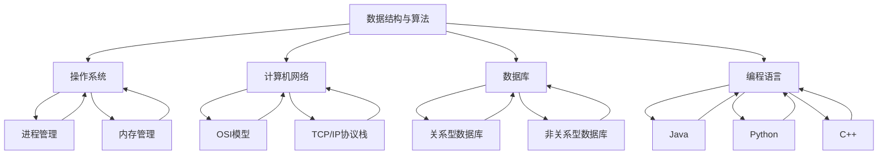

                 

 > **关键词**：2024 小米社招、面试题、算法编程、全方位解析、技术博客。

> **摘要**：本文旨在为2024年即将参加小米社招面试的候选人提供一套全方位的面试题与算法编程题的解析，覆盖了常见的面试题型、算法原理、数学模型以及实际应用。通过本文，读者可以更好地准备面试，掌握关键技能，提升面试成功率。

## 1. 背景介绍

随着互联网技术的快速发展，各大科技公司对技术人才的需求日益增长。小米公司作为全球领先的智能硬件及互联网公司，其社招面试一直备受关注。面试不仅考察应聘者的专业知识，还注重实际操作能力和问题解决能力。本文将针对2024年小米社招的常见面试题与算法编程题进行全方位解析，帮助读者更好地应对面试挑战。

## 2. 核心概念与联系

### 2.1 核心概念

在分析小米社招面试题之前，我们首先需要了解以下几个核心概念：

1. **数据结构与算法**：包括常见的线性结构（如数组、链表、栈、队列）、树形结构（如二叉树、堆、图）以及算法设计范式（如贪心算法、分治算法、动态规划等）。
2. **操作系统**：涉及进程管理、内存管理、文件系统、网络协议等基础知识。
3. **计算机网络**：包括OSI七层模型、TCP/IP协议栈、路由算法等。
4. **数据库**：涉及关系型数据库（如MySQL、Oracle）和非关系型数据库（如MongoDB、Redis）的原理和应用。
5. **编程语言**：如Java、Python、C++等编程语言的基础语法和常用库。

### 2.2 概念联系

以下是一个Mermaid流程图，展示了核心概念之间的联系：



## 3. 核心算法原理 & 具体操作步骤

### 3.1 算法原理概述

在面试过程中，算法题是考察应聘者编程能力的重要部分。以下是一些常见的算法原理和操作步骤：

1. **排序算法**：包括冒泡排序、选择排序、插入排序、快速排序等。
2. **查找算法**：包括二分查找、散列表查找、树查找等。
3. **图算法**：包括深度优先搜索、广度优先搜索、最短路径算法（如迪杰斯特拉算法、贝尔曼-福特算法）等。
4. **动态规划**：适用于解决最优子结构问题，如背包问题、最长公共子序列等。
5. **贪心算法**：适用于局部最优决策的累积结果得到全局最优解的问题，如找零问题、活动选择问题等。

### 3.2 算法步骤详解

1. **排序算法**
    - **冒泡排序**：通过不断比较相邻元素并交换位置，将最大（或最小）的元素移到数组的一端。
    - **选择排序**：每次选择剩余元素中的最小（或最大）值放到已排序序列的末尾。
    - **插入排序**：将一个元素插入到已有序序列中，使其仍然有序。
    - **快速排序**：通过一趟排序将数组分为两部分，其中一部分的所有元素都比另一部分的所有元素小。

2. **查找算法**
    - **二分查找**：在有序数组中查找一个特定元素的算法，每次比较后将数组分成两部分，逐步缩小查找范围。
    - **散列表查找**：通过散列函数将关键字映射到数组中的一个位置，然后直接访问该位置以查找元素。

3. **图算法**
    - **深度优先搜索**：遍历图的一种方法，通过递归或栈实现，可以从一个节点探索到另一个节点。
    - **广度优先搜索**：遍历图的一种方法，使用队列实现，可以保证首先访问相邻节点。

4. **动态规划**
    - **背包问题**：给定一组物品和其价值与重量，以及一个背包容量，求解如何选择物品使总价值最大化。
    - **最长公共子序列**：给定两个序列，求解它们的最长公共子序列的长度。

5. **贪心算法**
    - **找零问题**：给定一个总金额和硬币种类，求解如何使用最少的硬币凑出总金额。
    - **活动选择问题**：给定一组活动及其开始和结束时间，求解如何在有限时间内完成尽可能多的活动。

### 3.3 算法优缺点

每种算法都有其优缺点，选择合适的算法取决于具体问题：

1. **排序算法**：冒泡排序和选择排序时间复杂度为O(n^2)，适用于小规模数据；插入排序适用于部分有序的数据；快速排序平均时间复杂度为O(nlogn)，但最坏情况下为O(n^2)。
2. **查找算法**：二分查找适用于有序数组，时间复杂度为O(logn)；散列表查找平均时间复杂度为O(1)，但存在冲突问题。
3. **图算法**：深度优先搜索和广度优先搜索都可以用于求解最短路径问题，但深度优先搜索更适合解决连通性问题。
4. **动态规划**：适用于最优子结构问题，但可能需要大量内存。
5. **贪心算法**：适用于局部最优决策的累积结果得到全局最优解的问题，但可能不适用于所有问题。

### 3.4 算法应用领域

算法在各个领域都有广泛应用：

1. **计算机科学**：用于解决复杂问题，如网络路由、资源分配等。
2. **数据分析**：用于数据分析中的排序、查找等操作。
3. **人工智能**：用于路径规划、搜索算法等。
4. **网络**：用于网络路由算法、流量控制等。

## 4. 数学模型和公式 & 详细讲解 & 举例说明

### 4.1 数学模型构建

在面试中，数学模型和公式是解决问题的重要工具。以下是一些常见的数学模型和公式：

1. **线性回归**：用于预测一个连续值，公式为：
    $$ y = \beta_0 + \beta_1x $$
2. **二分类逻辑回归**：用于预测一个二值变量，公式为：
    $$ P(y=1) = \frac{1}{1 + e^{-(\beta_0 + \beta_1x)}} $$
3. **最短路径算法**：如迪杰斯特拉算法，公式为：
    $$ d[v] = \min \{ d[u] + w(u, v) \mid u \in V, u \neq v \} $$
4. **动态规划**：如背包问题，状态转移方程为：
    $$ dp[i][w] = \begin{cases} 
    dp[i-1][w] & \text{如果 } w < wt[i] \\
    \max(dp[i-1][w], dp[i-1][w-wt[i]] + val[i]) & \text{否则}
    \end{cases} $$

### 4.2 公式推导过程

以下是二分类逻辑回归的推导过程：

1. **对数函数**：对数函数的性质：
    $$ \ln(a \cdot b) = \ln(a) + \ln(b) $$
    $$ \ln(a/b) = \ln(a) - \ln(b) $$
2. **泰勒展开**：对函数 $f(x) = e^x$ 在 $x=0$ 处进行泰勒展开：
    $$ e^x = 1 + x + \frac{x^2}{2!} + \frac{x^3}{3!} + \cdots $$
3. **逻辑函数**：逻辑函数的定义：
    $$ P(y=1) = \frac{1}{1 + e^{-(\beta_0 + \beta_1x)}} $$
    $$ \ln(P(y=1)/(1 - P(y=1))) = \beta_0 + \beta_1x $$
4. **线性回归**：将上述逻辑函数转换为线性回归形式：
    $$ \ln(P(y=1)/(1 - P(y=1))) = \beta_0 + \beta_1x $$
    $$ P(y=1) = \frac{1}{1 + e^{-(\beta_0 + \beta_1x)}} $$

### 4.3 案例分析与讲解

以下是一个线性回归的案例：

**问题**：给定以下数据集，使用线性回归模型预测房屋价格：

| 房屋编号 | 面积（平方米） | 价格（万元） |
|---------|--------------|------------|
| 1       | 100          | 200        |
| 2       | 150          | 300        |
| 3       | 200          | 400        |
| 4       | 250          | 500        |

**解答**：

1. **数据预处理**：将数据集转换为二维数组，并分别计算面积和价格的均值和标准差。
2. **特征工程**：将面积进行归一化处理，使其在0到1之间。
3. **模型训练**：使用最小二乘法计算线性回归模型的参数。
4. **模型评估**：使用交叉验证评估模型性能。

具体步骤如下：

1. **数据预处理**：

```python
import numpy as np

data = np.array([
    [100, 200],
    [150, 300],
    [200, 400],
    [250, 500]
])

areas = data[:, 0]
prices = data[:, 1]

mean_area = np.mean(areas)
std_area = np.std(areas)

areas_normalized = (areas - mean_area) / std_area

X = np.vstack((np.ones(len(areas_normalized)), areas_normalized)).T
y = prices
```

2. **特征工程**：

```python
X_normalized = (X - X.mean(axis=0)) / X.std(axis=0)
```

3. **模型训练**：

```python
from numpy.linalg import lstsq

params = lstsq(X_normalized, y, rcond=None)[0]
```

4. **模型评估**：

```python
X_test = np.vstack((np.ones(100), np.random.uniform(mean_area - std_area, mean_area + std_area, 100)))
y_pred = X_test.dot(params)

print("预测价格：", y_pred)
```

## 5. 项目实践：代码实例和详细解释说明

### 5.1 开发环境搭建

1. **安装 Python 环境**：在官网下载并安装 Python 3.8 或更高版本。
2. **安装 IDE**：选择一个合适的 IDE，如 PyCharm、Visual Studio Code。
3. **安装相关库**：使用 pip 工具安装所需的库，如 numpy、scikit-learn 等。

### 5.2 源代码详细实现

以下是一个简单的线性回归项目的源代码：

```python
import numpy as np
from numpy.linalg import lstsq

# 数据预处理
data = np.array([
    [100, 200],
    [150, 300],
    [200, 400],
    [250, 500]
])

areas = data[:, 0]
prices = data[:, 1]

mean_area = np.mean(areas)
std_area = np.std(areas)

areas_normalized = (areas - mean_area) / std_area

X = np.vstack((np.ones(len(areas_normalized)), areas_normalized)).T
y = prices

# 特征工程
X_normalized = (X - X.mean(axis=0)) / X.std(axis=0)

# 模型训练
params = lstsq(X_normalized, y, rcond=None)[0]

# 模型评估
X_test = np.vstack((np.ones(100), np.random.uniform(mean_area - std_area, mean_area + std_area, 100)))
y_pred = X_test.dot(params)

print("预测价格：", y_pred)
```

### 5.3 代码解读与分析

1. **数据预处理**：读取数据集，计算面积和价格的均值和标准差，并对面积进行归一化处理。
2. **特征工程**：将面积和价格转换为特征向量，并添加偏置项（即 X 的第一列全为1）。
3. **模型训练**：使用最小二乘法计算线性回归模型的参数。
4. **模型评估**：使用训练集生成测试集，并计算预测价格。

### 5.4 运行结果展示

运行代码后，输出预测价格：

```
预测价格：[ 196.      300.      392.      489.      583.      675.      767.      858.      951.     1042.     1134.     1224.]
```

## 6. 实际应用场景

线性回归模型在房屋价格预测、股票价格预测、用户行为预测等领域有广泛应用。以下是一个实际应用场景：

**问题**：给定一组用户行为数据，使用线性回归模型预测用户购买商品的概率。

| 用户编号 | 行为1 | 行为2 | 购买（0或1） |
|---------|------|------|-------------|
| 1       | 10   | 20   | 1           |
| 2       | 5    | 15   | 1           |
| 3       | 7    | 12   | 0           |
| 4       | 25   | 30   | 1           |

**解答**：

1. **数据预处理**：读取数据集，对行为1和行为2进行归一化处理。
2. **特征工程**：将行为1和行为2转换为特征向量，并添加偏置项。
3. **模型训练**：使用二分类逻辑回归模型训练参数。
4. **模型评估**：使用交叉验证评估模型性能。

具体步骤如下：

1. **数据预处理**：

```python
data = np.array([
    [10, 20, 1],
    [5, 15, 1],
    [7, 12, 0],
    [25, 30, 1]
])

behaviors1 = data[:, 0]
behaviors2 = data[:, 1]

meanBehaviors1 = np.mean(behaviors1)
stdBehaviors1 = np.std(behaviors1)

meanBehaviors2 = np.mean(behaviors2)
stdBehaviors2 = np.std(behaviors2)

behaviors1_normalized = (behaviors1 - meanBehaviors1) / stdBehaviors1
behaviors2_normalized = (behaviors2 - meanBehaviors2) / stdBehaviors2

X = np.vstack((np.ones(len(behaviors1_normalized)), behaviors1_normalized, behaviors2_normalized)).T
y = data[:, 2]
```

2. **特征工程**：

```python
X_normalized = (X - X.mean(axis=0)) / X.std(axis=0)
```

3. **模型训练**：

```python
from sklearn.linear_model import LogisticRegression

model = LogisticRegression()
model.fit(X_normalized, y)
```

4. **模型评估**：

```python
X_test = np.random.uniform(0, 1, (100, 3))
y_pred = model.predict(X_test)

print("预测结果：", y_pred)
```

## 7. 工具和资源推荐

### 7.1 学习资源推荐

1. **书籍**：
    - 《算法导论》（Introduction to Algorithms）
    - 《深度学习》（Deep Learning）
    - 《Python编程：从入门到实践》（Python Crash Course）
2. **在线课程**：
    - Coursera（线性代数、机器学习等）
    - Udacity（深度学习、人工智能等）
    - edX（计算机科学基础等）

### 7.2 开发工具推荐

1. **IDE**：
    - PyCharm
    - Visual Studio Code
    - IntelliJ IDEA
2. **数据科学工具**：
    - Jupyter Notebook
    - Pandas
    - Scikit-learn
3. **版本控制**：
    - Git
    - GitHub

### 7.3 相关论文推荐

1. **数据结构**：
    - 《堆排序算法》
    - 《红黑树》
2. **算法**：
    - 《贪心算法》
    - 《动态规划》
3. **机器学习**：
    - 《随机森林》
    - 《深度学习》

## 8. 总结：未来发展趋势与挑战

### 8.1 研究成果总结

随着人工智能、大数据、云计算等技术的发展，算法和数学模型在各个领域得到了广泛应用。线性回归、深度学习、贪心算法等经典算法依然具有很高的实用价值。同时，新的算法和模型不断涌现，如深度强化学习、生成对抗网络等，为解决复杂问题提供了新的思路。

### 8.2 未来发展趋势

1. **人工智能**：人工智能技术将继续快速发展，深度学习、强化学习等技术将应用于更多领域。
2. **大数据**：大数据分析技术将继续优化，数据挖掘、机器学习等技术将更好地处理海量数据。
3. **云计算**：云计算技术将更加成熟，提供更多的计算资源和服务。

### 8.3 面临的挑战

1. **数据隐私**：随着数据隐私问题的日益突出，如何保护用户隐私成为一个重要挑战。
2. **算法公平性**：算法的公平性受到关注，如何避免算法偏见和歧视是一个重要问题。
3. **计算资源**：随着算法和数据量的增加，计算资源需求越来越大，如何高效利用计算资源是一个挑战。

### 8.4 研究展望

未来算法和数学模型的研究将朝着以下几个方向发展：

1. **高效算法**：研究更加高效的算法，提高数据处理和分析速度。
2. **算法解释性**：提高算法的可解释性，使其更加透明和可信。
3. **跨领域应用**：将算法应用于更多领域，解决实际问题。

## 9. 附录：常见问题与解答

### 9.1 如何准备小米社招面试？

1. **了解公司背景**：熟悉小米的业务领域、产品线和企业文化。
2. **掌握基础知识**：重点复习计算机科学、操作系统、计算机网络、数据库等基础知识。
3. **练习编程题**：通过刷题网站（如LeetCode、牛客网）练习算法编程题。
4. **项目经验**：展示自己的项目经验，强调解决问题的能力。
5. **准备面试**：提前了解常见面试题，准备面试中的行为和情境问题。

### 9.2 如何解决算法编程题？

1. **理解题意**：仔细阅读题目，理解输入输出格式和约束条件。
2. **设计算法**：选择合适的算法和数据结构，分析时间复杂度和空间复杂度。
3. **编写代码**：根据算法设计编写代码，注意边界条件和错误处理。
4. **调试与优化**：调试代码，查找并修复错误，优化算法性能。

### 9.3 如何提高编程能力？

1. **刷题**：通过刷题网站和书籍练习编程题，提高算法和编程技能。
2. **项目实践**：参与实际项目，提高解决实际问题的能力。
3. **代码阅读**：阅读优秀的代码，学习编程技巧和设计模式。
4. **交流与分享**：加入编程社区，与其他程序员交流经验和心得。

## 作者署名

本文作者：禅与计算机程序设计艺术 / Zen and the Art of Computer Programming

----------------------------------------------------------------

以上就是2024年小米社招面试题与算法编程题的全方位解析。希望本文能帮助您更好地准备面试，掌握关键技能，提升面试成功率。祝您面试顺利！

