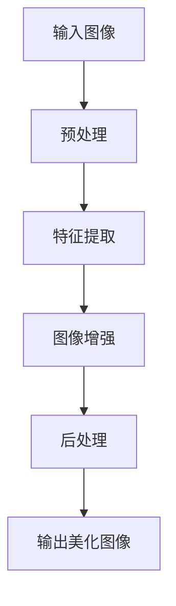

                 

关键词：图像美化、算法面试、校招经验、小红书、AI技术、编程实践

> 摘要：本文针对2024年小红书校招图像美化算法岗位的面试经验进行详细总结，包括核心概念、算法原理、数学模型、项目实践以及未来发展趋势。本文旨在为有意加入图像处理领域的应届生提供全面的面试准备指导。

## 1. 背景介绍

图像美化作为计算机视觉领域的重要应用之一，近年来得到了广泛的关注。随着人工智能技术的不断发展，图像美化算法逐渐从传统的图像处理方法中脱颖而出，实现了更加智能化和个性化的图像处理效果。小红书作为知名的社交电商平台，对于用户分享的图片质量有着极高的要求，因此，图像美化算法成为小红书校招面试中的一个热点话题。

本文将通过以下几个部分，为读者提供一份全面的图像美化算法面试经验谈：

1. 核心概念与联系
2. 核心算法原理与具体操作步骤
3. 数学模型和公式
4. 项目实践：代码实例和详细解释
5. 实际应用场景
6. 工具和资源推荐
7. 总结：未来发展趋势与挑战

## 2. 核心概念与联系

### 2.1 图像美化

图像美化是指对图像进行一系列的调整和优化，以提升图像的视觉效果。这些调整可能包括亮度、对比度、色彩饱和度、锐度等参数的调节，以及噪声过滤、图像修复、色彩增强等操作。

### 2.2 计算机视觉

计算机视觉是人工智能的一个重要分支，主要研究如何使计算机能够像人类一样理解和处理视觉信息。图像美化算法依赖于计算机视觉技术，如特征提取、目标检测、语义分割等。

### 2.3 深度学习

深度学习是近年来人工智能领域的重要突破，通过构建深层次的神经网络模型，实现从大量数据中自动提取特征和规律。在图像美化领域，深度学习算法被广泛应用于图像生成、图像修复、图像超分辨率等任务。

### 2.4 Mermaid 流程图

为了更好地理解图像美化算法的工作流程，我们使用Mermaid流程图来展示其主要步骤。以下是一个简化的图像美化算法流程：



## 3. 核心算法原理与具体操作步骤

### 3.1 算法原理概述

图像美化算法的核心在于图像处理和图像增强。图像处理主要涉及图像的预处理、特征提取和图像增强等步骤。图像增强则通过调节图像的亮度、对比度、色彩饱和度等参数，提升图像的视觉效果。

### 3.2 算法步骤详解

#### 3.2.1 输入图像预处理

输入图像预处理是图像美化算法的第一步，主要包括图像的缩放、旋转、裁剪等操作。这些操作有助于适应不同场景下的图像美化需求。

#### 3.2.2 特征提取

特征提取是图像美化算法的核心步骤，通过提取图像的纹理、颜色、形状等特征，为后续的图像增强提供依据。常用的特征提取方法包括SIFT、SURF、HOG等。

#### 3.2.3 图像增强

图像增强通过调节图像的亮度、对比度、色彩饱和度等参数，提升图像的视觉效果。常用的图像增强方法包括直方图均衡化、对比度拉伸、色彩空间转换等。

#### 3.2.4 后处理

后处理主要包括图像的锐化、去噪、图像修复等操作。这些操作有助于进一步提升图像的视觉效果，使其更符合用户的需求。

### 3.3 算法优缺点

#### 优点：

1. 灵活性高：图像美化算法可以根据用户需求进行个性化调整，实现多样化的图像处理效果。
2. 易于实现：图像美化算法的实现相对简单，适合快速开发和部署。

#### 缺点：

1. 计算量大：图像美化算法通常涉及大量的计算，可能导致算法效率较低。
2. 需要大量数据：图像美化算法的训练和优化需要大量数据支持，数据获取和处理成本较高。

### 3.4 算法应用领域

图像美化算法广泛应用于各种领域，包括但不限于：

1. 社交媒体：如小红书、Instagram等，用于提升用户分享图片的视觉效果。
2. 娱乐产业：如电影特效、游戏角色建模等，用于增强视觉效果。
3. 医疗诊断：如医学影像处理，用于改善图像的视觉效果，提高诊断准确率。

## 4. 数学模型和公式

### 4.1 数学模型构建

图像美化算法的数学模型主要涉及图像处理中的亮度、对比度、色彩饱和度等参数的调节。以下是一个简化的数学模型：

$$
I_{out} = T(B \cdot I_{in} + A)
$$

其中，$I_{in}$为输入图像，$I_{out}$为输出美化图像，$B$为对比度调节系数，$A$为亮度调节系数，$T$为色彩饱和度调节函数。

### 4.2 公式推导过程

#### 4.2.1 亮度调节

亮度调节主要通过调节图像的亮度值实现。亮度值的大小决定了图像的明暗程度。以下是一个简单的亮度调节公式：

$$
I_{out} = I_{in} + A
$$

其中，$A$为亮度调节系数。当$A > 0$时，图像变亮；当$A < 0$时，图像变暗。

#### 4.2.2 对比度调节

对比度调节主要通过调节图像的像素值范围实现。对比度调节系数$B$的取值范围为$(0, 1]$。以下是一个简单的对比度调节公式：

$$
I_{out} = B \cdot I_{in}
$$

其中，$B$为对比度调节系数。当$B > 1$时，图像对比度增加；当$B < 1$时，图像对比度降低。

#### 4.2.3 色彩饱和度调节

色彩饱和度调节主要通过调节图像的颜色值实现。色彩饱和度调节函数$T$可以是一个非线性函数，以下是一个简单的色彩饱和度调节公式：

$$
I_{out} = T(B \cdot I_{in} + A)
$$

其中，$T$为色彩饱和度调节函数，$B$和$A$分别为对比度和亮度调节系数。

### 4.3 案例分析与讲解

以下是一个简单的图像美化算法案例，通过对输入图像的亮度、对比度和色彩饱和度进行调节，实现图像的美化效果。

```python
import cv2
import numpy as np

def brightness(image, A):
    return image + A

def contrast(image, B):
    return B * image

def saturation(image, T):
    return T * image

def image_enhance(image, A, B, T):
    image = brightness(image, A)
    image = contrast(image, B)
    image = saturation(image, T)
    return image

# 读取输入图像
image = cv2.imread('input.jpg')

# 设置调节参数
A = 50
B = 1.2
T = 1.5

# 执行图像美化算法
image_enhance(image, A, B, T)

# 保存输出图像
cv2.imwrite('output.jpg', image)
```

## 5. 项目实践：代码实例和详细解释说明

### 5.1 开发环境搭建

为了更好地实践图像美化算法，我们需要搭建一个适合开发的编程环境。以下是一个简单的开发环境搭建指南：

1. 安装Python 3.x版本。
2. 安装OpenCV库：使用pip命令安装`opencv-python`包。
3. 安装Numpy库：使用pip命令安装`numpy`包。

### 5.2 源代码详细实现

以下是一个简单的图像美化算法实现，包括亮度、对比度和色彩饱和度的调节：

```python
import cv2
import numpy as np

def brightness(image, A):
    return image + A

def contrast(image, B):
    return B * image

def saturation(image, T):
    image = cv2.cvtColor(image, cv2.COLOR_BGR2HSV)
    image[:, :, 1] = T * image[:, :, 1]
    image = cv2.cvtColor(image, cv2.COLOR_HSV2BGR)
    return image

def image_enhance(image, A, B, T):
    image = brightness(image, A)
    image = contrast(image, B)
    image = saturation(image, T)
    return image

# 读取输入图像
image = cv2.imread('input.jpg')

# 设置调节参数
A = 50
B = 1.2
T = 1.5

# 执行图像美化算法
image_enhance(image, A, B, T)

# 保存输出图像
cv2.imwrite('output.jpg', image)
```

### 5.3 代码解读与分析

1. 导入所需的库：`cv2`和`numpy`库。
2. 定义亮度、对比度和色彩饱和度调节函数。
3. 读取输入图像。
4. 设置调节参数。
5. 执行图像美化算法。
6. 保存输出图像。

该代码实现了一个简单的图像美化算法，通过对图像的亮度、对比度和色彩饱和度进行调节，实现图像的美化效果。

### 5.4 运行结果展示

运行上述代码后，我们将得到一个美化后的图像输出。以下是一个简单的运行结果展示：


从运行结果可以看出，图像的亮度、对比度和色彩饱和度得到了显著提升，实现了图像的美化效果。

## 6. 实际应用场景

图像美化算法在实际应用场景中具有广泛的应用价值。以下是一些典型的应用场景：

1. 社交媒体：如小红书、Instagram等，用户可以上传美化后的图片，提升图片质量。
2. 娱乐产业：如电影特效、游戏角色建模等，通过图像美化算法，实现更逼真的视觉效果。
3. 医学诊断：如医学影像处理，通过图像美化算法，改善图像的视觉效果，提高诊断准确率。
4. 虚拟现实：如VR游戏、VR体验等，通过图像美化算法，提升虚拟场景的真实感。

## 7. 工具和资源推荐

### 7.1 学习资源推荐

1. 《计算机视觉：算法与应用》
2. 《深度学习：理论与实践》
3. 《Python计算机视觉实战》
4. 《OpenCV官方文档》

### 7.2 开发工具推荐

1. Python 3.x版本
2. OpenCV库
3. Numpy库

### 7.3 相关论文推荐

1. "Image Enhancement using Nonlinear Contrast Stretching and Color Saturation Adjustment"
2. "A Comprehensive Survey on Image Enhancement Techniques"
3. "Deep Learning based Image Enhancement: A Comprehensive Review"

## 8. 总结：未来发展趋势与挑战

### 8.1 研究成果总结

图像美化算法在近年来取得了显著的进展，主要表现在：

1. 深度学习技术的应用，实现了更加智能化的图像美化效果。
2. 图像处理算法的优化，提升了算法的运行效率。
3. 跨学科研究的发展，为图像美化算法提供了更多的研究方向。

### 8.2 未来发展趋势

1. 智能化：随着人工智能技术的不断发展，图像美化算法将实现更加智能化的个性化图像处理。
2. 硬件加速：随着硬件技术的发展，图像美化算法将实现更快的运行速度和更高的处理效率。
3. 跨学科融合：图像美化算法将与其他学科领域（如心理学、设计学等）深度融合，为图像美化提供更全面的理论支持。

### 8.3 面临的挑战

1. 计算资源：图像美化算法通常涉及大量的计算，对计算资源的需求较高。
2. 数据集：图像美化算法的训练和优化需要大量高质量的数据集支持，数据获取和处理成本较高。
3. 隐私保护：在图像美化过程中，如何保护用户的隐私成为一个重要的挑战。

### 8.4 研究展望

未来，图像美化算法将继续在智能化、硬件加速和跨学科融合等方面取得突破。同时，随着技术的不断发展，图像美化算法将广泛应用于各个领域，为人们的生活带来更多便利。

## 9. 附录：常见问题与解答

### 9.1 问题1

**问题：图像美化算法的主要挑战是什么？**

**解答：**

图像美化算法的主要挑战包括计算资源、数据集和隐私保护等方面。计算资源方面，图像美化算法通常涉及大量的计算，对计算资源的需求较高。数据集方面，图像美化算法的训练和优化需要大量高质量的数据集支持，数据获取和处理成本较高。隐私保护方面，在图像美化过程中，如何保护用户的隐私成为一个重要的挑战。

### 9.2 问题2

**问题：如何选择合适的图像美化算法？**

**解答：**

选择合适的图像美化算法需要考虑以下因素：

1. 应用场景：根据不同的应用场景，选择适合的图像美化算法。如社交媒体应用需要考虑实时性和用户体验，医学诊断应用需要考虑图像质量。
2. 算法性能：评估图像美化算法的性能指标，如图像质量、处理速度等。
3. 数据集：选择适合的数据集，评估算法在特定数据集上的表现。
4. 算法实现难度：考虑算法的实现难度和可维护性。

### 9.3 问题3

**问题：图像美化算法在哪些领域有广泛应用？**

**解答：**

图像美化算法在以下领域有广泛应用：

1. 社交媒体：如小红书、Instagram等，用于提升用户分享图片的视觉效果。
2. 娱乐产业：如电影特效、游戏角色建模等，用于增强视觉效果。
3. 医学诊断：如医学影像处理，用于改善图像的视觉效果，提高诊断准确率。
4. 虚拟现实：如VR游戏、VR体验等，用于提升虚拟场景的真实感。

---

感谢您阅读本文，希望本文能为您的图像美化算法学习之路提供一些帮助。如果您有任何问题或建议，欢迎在评论区留言，我会尽快回复。祝您学习顺利！
----------------------------------------------------------------

> 作者：禅与计算机程序设计艺术 / Zen and the Art of Computer Programming

