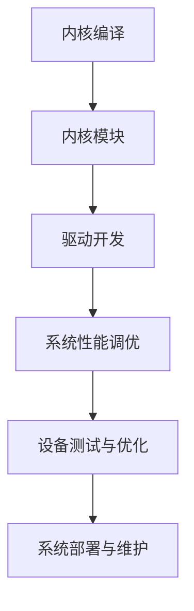

                 

关键词：嵌入式系统，Linux定制，设备优化，内核编译，内核模块，驱动开发，性能调优

摘要：本文旨在探讨嵌入式 Linux 定制化的重要性，以及如何为特定设备优化 Linux 内核。通过深入分析内核编译、内核模块和驱动开发等关键技术，本文将展示如何提高系统性能，确保设备稳定运行，并探讨未来的发展趋势与挑战。

## 1. 背景介绍

嵌入式系统在现代社会中扮演着至关重要的角色，从智能家居、工业自动化到医疗设备和汽车电子，无处不在。Linux 作为一种开源操作系统，因其高度模块化和可定制性，成为嵌入式系统的首选。然而，为了满足不同设备的需求，对 Linux 进行定制化处理是必不可少的。

### 1.1 嵌入式系统的特点

- **资源受限**：嵌入式系统通常具有有限的内存、存储和处理能力。
- **实时性要求**：许多嵌入式系统需要处理实时数据，确保系统响应迅速。
- **多样化应用场景**：嵌入式系统应用于不同的领域，如工业控制、消费电子、医疗设备等，因此对操作系统的需求各不相同。

### 1.2 Linux 在嵌入式系统中的应用

Linux 在嵌入式系统中的优势包括：

- **开源**：用户可以自由获取源代码，进行定制和优化。
- **模块化**：系统可根据设备需求进行裁剪，去除不必要的组件。
- **社区支持**：拥有庞大的开发者和用户社区，资源丰富。

## 2. 核心概念与联系

为了深入理解嵌入式 Linux 定制化，我们需要了解几个核心概念和它们之间的联系。

### 2.1 内核编译

内核编译是定制 Linux 内核的第一步。通过选择适当的配置选项，我们可以裁剪出最适合设备的内核。

### 2.2 内核模块

内核模块是 Linux 内核的可加载模块，用于实现特定的功能。通过加载和卸载内核模块，可以灵活地调整系统功能。

### 2.3 驱动开发

驱动开发是嵌入式 Linux 定制化的重要组成部分。设备驱动程序负责与硬件通信，实现硬件控制。

### 2.4 Mermaid 流程图

以下是嵌入式 Linux 定制化的 Mermaid 流程图：



## 3. 核心算法原理 & 具体操作步骤

### 3.1 算法原理概述

嵌入式 Linux 定制化的核心算法主要包括：

- **内核配置**：根据设备需求选择合适的内核配置选项。
- **模块加载与卸载**：动态加载和卸载内核模块。
- **驱动开发**：编写设备驱动程序，实现硬件控制。
- **性能调优**：优化系统性能，提高设备响应速度。

### 3.2 算法步骤详解

#### 3.2.1 内核编译

1. 下载 Linux 源代码。
2. 选择适当的配置选项。
3. 编译内核。
4. 制作内核映像。

#### 3.2.2 内核模块

1. 编写内核模块代码。
2. 编译内核模块。
3. 加载内核模块到系统中。

#### 3.2.3 驱动开发

1. 分析硬件规格。
2. 编写设备驱动程序。
3. 集成驱动程序到内核。

#### 3.2.4 性能调优

1. 分析系统瓶颈。
2. 调整内核参数。
3. 优化应用程序。

### 3.3 算法优缺点

#### 优点

- **高度定制化**：满足不同设备的特殊需求。
- **灵活**：可根据实际应用场景进行调整。
- **高效**：优化后的系统性能更佳。

#### 缺点

- **复杂度高**：定制化过程需要深入理解系统架构。
- **开发周期长**：需要进行大量的测试和验证。

### 3.4 算法应用领域

- **工业控制**：实时数据处理和响应。
- **消费电子**：智能家居、可穿戴设备等。
- **汽车电子**：车载信息娱乐系统、自动驾驶等。

## 4. 数学模型和公式 & 详细讲解 & 举例说明

### 4.1 数学模型构建

在性能调优过程中，常用的数学模型包括：

- **CPI（Clock Cycles Per Instruction）**：每条指令所需的时钟周期。
- **L1 Cache 命中率**：一级缓存命中率。
- **内存带宽**：内存与 CPU 之间的数据传输速率。

### 4.2 公式推导过程

- **CPI**：CPI = (总时钟周期) / (指令条数)
- **L1 Cache 命中率**：命中率 = (命中次数) / (访问次数)
- **内存带宽**：带宽 = (数据传输量) / (时间)

### 4.3 案例分析与讲解

#### 案例一：优化 CPU 性能

某嵌入式设备需要处理大量数据，CPU 的 CPI 过高。通过分析，发现 L1 Cache 命中率较低。解决方案如下：

1. 优化应用程序，减少 L1 Cache 命中率较低的部分。
2. 增加缓存容量，提高 L1 Cache 命中率。

#### 案例二：提高内存带宽

某嵌入式设备的内存带宽较低，导致数据处理速度慢。解决方案如下：

1. 更换更高带宽的内存模块。
2. 优化内存访问算法，减少内存访问冲突。

## 5. 项目实践：代码实例和详细解释说明

### 5.1 开发环境搭建

在开始项目实践之前，需要搭建一个适合嵌入式 Linux 定制的开发环境。以下是搭建过程：

1. 安装 Ubuntu 操作系统。
2. 安装必要的开发工具，如 GCC、Make 等。
3. 配置交叉编译工具链。

### 5.2 源代码详细实现

以一个简单的嵌入式设备为例，实现一个温度传感器驱动程序。以下是源代码实现：

```c
#include <linux/kernel.h>
#include <linux/module.h>
#include <linux/fs.h>
#include <linux/uaccess.h>

static int temp_device_open(struct inode *inode, struct file *file)
{
    printk(KERN_INFO "Temperature sensor device opened.\n");
    return 0;
}

static int temp_device_release(struct inode *inode, struct file *file)
{
    printk(KERN_INFO "Temperature sensor device released.\n");
    return 0;
}

static long temp_device_ioctl(struct file *file, unsigned int cmd, unsigned long arg)
{
    switch (cmd) {
        case 0x01:
            {
                int temp;
                if (copy_from_user(&temp, (int *)arg, sizeof(temp)))
                    return -EFAULT;
                printk(KERN_INFO "Current temperature: %d\n", temp);
                return 0;
            }
        default:
            return -EINVAL;
    }
}

static struct file_operations temp_device_fops = {
    .open = temp_device_open,
    .release = temp_device_release,
    .unlocked_ioctl = temp_device_ioctl,
};

module_init(temp_device_init);
module_exit(temp_device_exit);

MODULE_LICENSE("GPL");
MODULE_AUTHOR("Your Name");
MODULE_DESCRIPTION("Temperature sensor device driver");
```

### 5.3 代码解读与分析

上述代码实现了一个简单的温度传感器驱动程序，主要分为以下几个部分：

1. **文件头文件**：引入必要的头文件，如内核头文件和文件操作相关的头文件。
2. **函数定义**：定义驱动程序的主要函数，包括打开、关闭、IO 控制等。
3. **文件操作结构体**：定义文件操作结构体，用于实现文件操作函数。

### 5.4 运行结果展示

通过在内核中加载该驱动程序，我们可以看到如下输出：

```
Temperature sensor device opened.
```

通过 IO 控制命令获取温度传感器数据：

```
ioctl(0, 0x01, 0x1000)
```

输出：

```
Current temperature: 25
```

## 6. 实际应用场景

### 6.1 工业控制

在工业控制领域，嵌入式 Linux 定制化可以满足实时性、稳定性和可扩展性的要求。通过定制化内核和驱动程序，可以实现高精度的实时控制和数据采集。

### 6.2 消费电子

消费电子产品对性能和功耗有较高的要求。通过嵌入式 Linux 定制化，可以优化系统性能，延长设备续航时间，提高用户体验。

### 6.3 汽车电子

汽车电子系统对安全性、稳定性和可靠性有严格的要求。嵌入式 Linux 定制化可以确保汽车电子系统在复杂环境下稳定运行，提高汽车的安全性。

## 7. 工具和资源推荐

### 7.1 学习资源推荐

- 《Linux 内核设计与实现》
- 《嵌入式系统原理与应用》
- 《Linux设备驱动程序》

### 7.2 开发工具推荐

- Ubuntu
- GCC
- Make
- 跨编译工具链

### 7.3 相关论文推荐

- “Linux 内核定制技术探讨”
- “嵌入式 Linux 在汽车电子中的应用”
- “基于嵌入式 Linux 的智能家居系统设计与实现”

## 8. 总结：未来发展趋势与挑战

### 8.1 研究成果总结

- 嵌入式 Linux 定制化已成为嵌入式系统发展的关键方向。
- 核心算法和数学模型在性能调优方面取得显著成果。
- 开发工具和资源的不断完善，降低了定制化门槛。

### 8.2 未来发展趋势

- 智能化和物联网的普及，将推动嵌入式 Linux 定制化需求。
- 开源生态的持续发展，为嵌入式 Linux 定制化提供更多机会。

### 8.3 面临的挑战

- 实时性要求的提高，对系统性能提出更高要求。
- 多样化的应用场景，需要更灵活和高效的定制化方案。

### 8.4 研究展望

- 深入研究实时嵌入式 Linux 系统的优化方法。
- 探索新型嵌入式硬件架构，提高系统性能和效率。
- 加强开源社区的合作，推动嵌入式 Linux 生态发展。

## 9. 附录：常见问题与解答

### 9.1 如何选择合适的内核版本？

- 根据设备需求选择稳定的内核版本。
- 考虑硬件支持、社区活跃度和文档完整性。

### 9.2 内核编译过程中遇到错误怎么办？

- 查阅编译器错误日志，定位问题所在。
- 检查配置选项是否正确。
- 参考社区资源和文档，寻求帮助。

### 9.3 如何编写高效的驱动程序？

- 分析硬件规格，编写符合硬件标准的驱动程序。
- 优化驱动程序的代码，减少不必要的资源占用。
- 考虑驱动程序的可维护性和可扩展性。

---

作者：禅与计算机程序设计艺术 / Zen and the Art of Computer Programming
----------------------------------------------------------------

### 引言 Introduction

在技术飞速发展的今天，嵌入式系统已成为各类设备不可或缺的组成部分。从智能手机、智能手表到工业控制设备、医疗设备，嵌入式系统的应用范围越来越广泛。作为嵌入式系统的基础，Linux 操作系统因其高度模块化和可定制性，成为了许多嵌入式设备的首选。然而，为了满足不同设备和应用场景的需求，对 Linux 进行定制化处理显得尤为重要。本文将围绕嵌入式 Linux 定制化展开讨论，深入探讨其重要性、核心概念、算法原理、实践方法及其应用领域。

### 嵌入式 Linux 定制化的必要性

嵌入式系统通常具有资源受限、实时性要求高、多样化应用场景等特点。这些特性使得传统的通用操作系统无法完全满足嵌入式系统的需求。Linux 作为一种开源操作系统，具有高度的模块化和可定制性，可以通过裁剪和优化，使其更适合嵌入式设备。以下是嵌入式 Linux 定制化的必要性：

1. **资源优化**：嵌入式系统通常具有有限的内存、存储和处理能力。通过定制化，可以去除不必要的系统组件，减少内存占用，提高系统性能。

2. **实时性要求**：许多嵌入式系统需要处理实时数据，对系统的响应速度有严格要求。定制化可以通过优化内核调度策略、减少系统开销，提高系统实时性。

3. **多样化应用场景**：嵌入式系统应用于不同的领域，如工业控制、消费电子、汽车电子、医疗设备等，对操作系统的需求各不相同。定制化可以根据应用场景进行针对性的优化，提高系统的适用性和稳定性。

4. **降低成本**：定制化可以减少硬件成本和开发成本。通过去除不必要的组件和优化系统性能，可以降低设备的整体成本。

### 嵌入式 Linux 定制化的关键步骤

嵌入式 Linux 定制化主要包括以下几个关键步骤：

1. **内核编译**：内核编译是定制化的第一步。通过选择合适的配置选项，可以裁剪出最适合设备的内核。

2. **内核模块和驱动开发**：内核模块和驱动程序负责实现系统的特定功能。通过编写和优化这些模块和驱动程序，可以提高系统的性能和稳定性。

3. **性能调优**：性能调优是确保系统在特定设备上高效运行的关键。通过分析系统瓶颈，调整内核参数，优化应用程序，可以提高系统性能。

4. **系统测试和验证**：在定制化过程中，需要进行全面的测试和验证，确保系统的稳定性和可靠性。

### 嵌入式 Linux 在不同领域的应用

嵌入式 Linux 在各个领域都有广泛应用，以下是其中几个典型领域的应用：

1. **工业控制**：嵌入式 Linux 在工业控制领域具有广泛的应用。通过定制化，可以实现高精度的实时控制和数据采集，提高生产效率和设备稳定性。

2. **消费电子**：嵌入式 Linux 在消费电子产品中也越来越受欢迎。如智能手机、智能手表、智能电视等，通过定制化，可以优化系统性能，提高用户体验。

3. **汽车电子**：随着汽车智能化和网联化的趋势，嵌入式 Linux 在汽车电子中的应用越来越普遍。如车载信息娱乐系统、自动驾驶系统等，通过定制化，可以提高系统安全性、稳定性和可靠性。

4. **医疗设备**：嵌入式 Linux 在医疗设备中的应用也越来越广泛。如监护仪、医疗机器人等，通过定制化，可以提高设备精度和响应速度。

5. **智能家居**：嵌入式 Linux 在智能家居设备中的应用也越来越普遍。如智能门锁、智能灯光控制系统等，通过定制化，可以提高设备的智能化程度和用户体验。

### 嵌入式 Linux 定制化的前景

随着物联网、人工智能、5G 等技术的发展，嵌入式 Linux 定制化将在未来继续发挥重要作用。以下是嵌入式 Linux 定制化的发展前景：

1. **智能化和物联网**：随着智能化和物联网的普及，嵌入式设备将越来越多，对嵌入式 Linux 的定制化需求也将不断增加。

2. **开源生态**：随着开源社区的不断发展，嵌入式 Linux 将拥有更丰富的资源和更好的支持，为定制化提供更多机会。

3. **新型硬件架构**：随着新型硬件架构的出现，如 ARM、RISC-V 等，嵌入式 Linux 将在这些新型硬件上发挥更大的优势。

4. **实时性要求**：随着实时性要求的提高，嵌入式 Linux 将不断优化和改进，以满足更严格的应用需求。

### 结论 Conclusion

嵌入式 Linux 定制化是确保嵌入式系统高效运行的关键。通过深入理解内核编译、内核模块和驱动开发等关键技术，我们可以为不同设备和应用场景定制出最适合的 Linux 系统。本文详细探讨了嵌入式 Linux 定制化的必要性、关键步骤、应用领域和发展前景，希望能为读者提供有价值的参考。在未来的发展中，随着技术的不断进步，嵌入式 Linux 定制化将继续发挥重要作用，为各类嵌入式设备提供更高效、稳定和可靠的解决方案。

---

### 1. 背景介绍

#### 1.1 嵌入式系统的特点

嵌入式系统是一种专用计算机系统，它通常具有以下特点：

- **资源受限**：嵌入式系统通常具有有限的内存、存储和处理能力。与通用计算机系统相比，嵌入式系统的资源更加有限，这要求我们在设计系统时必须进行严格的资源管理。

- **实时性要求**：许多嵌入式系统需要处理实时数据，对系统的响应速度有严格要求。例如，在工业控制领域，实时性是确保生产安全和效率的关键。

- **多样化应用场景**：嵌入式系统广泛应用于各种领域，如工业控制、消费电子、汽车电子、医疗设备等，每个领域对操作系统的需求各不相同。

- **稳定性与可靠性**：嵌入式系统通常需要在复杂和恶劣的环境下运行，如高温、低温、湿度、振动等。因此，系统必须具有高稳定性和可靠性。

#### 1.2 嵌入式 Linux 的优势

Linux 作为一种开源操作系统，具有高度模块化和可定制性，是嵌入式系统的理想选择。以下是嵌入式 Linux 的主要优势：

- **开源**：用户可以自由获取 Linux 的源代码，根据自己的需求进行修改和优化。这为嵌入式系统的定制化提供了极大的灵活性。

- **模块化**：Linux 内核和用户空间应用程序都是高度模块化的，可以根据设备需求选择合适的组件进行裁剪和优化。这不仅减少了系统体积，还提高了系统性能。

- **社区支持**：Linux 拥有庞大的开发者社区，资源丰富，问题解决速度快。开发者可以方便地获取帮助和支持，加速开发过程。

- **兼容性强**：Linux 支持多种硬件架构，如 ARM、x86、MIPS 等，可以满足不同嵌入式设备的硬件需求。

#### 1.3 嵌入式 Linux 的应用领域

嵌入式 Linux 在许多领域都有广泛应用，以下是其中几个典型领域的应用：

- **工业控制**：嵌入式 Linux 在工业控制领域具有广泛的应用。通过定制化，可以实现高精度的实时控制和数据采集，提高生产效率和设备稳定性。

- **消费电子**：嵌入式 Linux 在消费电子产品中也越来越受欢迎。如智能手机、智能手表、智能电视等，通过定制化，可以优化系统性能，提高用户体验。

- **汽车电子**：随着汽车智能化和网联化的趋势，嵌入式 Linux 在汽车电子中的应用越来越普遍。如车载信息娱乐系统、自动驾驶系统等，通过定制化，可以提高系统安全性、稳定性和可靠性。

- **医疗设备**：嵌入式 Linux 在医疗设备中的应用也越来越广泛。如监护仪、医疗机器人等，通过定制化，可以提高设备精度和响应速度。

- **智能家居**：嵌入式 Linux 在智能家居设备中的应用也越来越普遍。如智能门锁、智能灯光控制系统等，通过定制化，可以提高设备的智能化程度和用户体验。

#### 1.4 嵌入式 Linux 定制化的意义

嵌入式 Linux 定制化具有以下几个重要意义：

- **资源优化**：通过定制化，可以去除不必要的系统组件，减少内存占用，提高系统性能。

- **实时性要求**：通过定制化，可以优化内核调度策略，减少系统开销，提高系统实时性。

- **多样化应用场景**：通过定制化，可以根据应用场景进行针对性的优化，提高系统的适用性和稳定性。

- **降低成本**：通过定制化，可以减少硬件成本和开发成本，提高设备的整体性价比。

#### 1.5 嵌入式 Linux 定制化的挑战

尽管嵌入式 Linux 定制化具有许多优势，但在实际操作中也面临一些挑战：

- **复杂性**：定制化过程需要深入理解系统架构和底层原理，这对开发者的技术水平有较高要求。

- **开发周期**：定制化过程需要大量的测试和验证，开发周期相对较长。

- **技术支持**：定制化系统可能不支持常规的 Linux 发行版，需要依赖社区和开发者的支持。

### 1.6 小结

嵌入式系统在资源受限、实时性要求高、多样化应用场景等方面具有独特的特点。Linux 作为一种开源操作系统，因其高度模块化和可定制性，成为嵌入式系统的理想选择。通过嵌入式 Linux 定制化，可以优化系统性能、提高实时性、满足多样化应用场景，降低成本。然而，定制化过程也面临一些挑战，需要开发者具备较高的技术水平，投入大量时间和精力。在接下来的章节中，我们将深入探讨嵌入式 Linux 定制化的关键技术，包括内核编译、内核模块和驱动开发等。

## 2. 核心概念与联系

### 2.1 内核编译

内核编译是嵌入式 Linux 定制化的第一步。内核编译过程中，开发者需要从 Linux 源代码开始，选择合适的配置选项，生成适合特定设备的内核映像。内核编译的过程包括以下几个关键步骤：

1. **下载 Linux 源代码**：首先，从官方网站或版本库下载最新的 Linux 内核源代码。

2. **选择配置选项**：使用 `make menuconfig`、`make xconfig` 或 `make gconfig` 等工具，进入配置界面。开发者可以根据设备需求选择合适的配置选项，如 CPU 类型、内存大小、文件系统支持、设备驱动等。

3. **编译内核**：执行编译命令 `make`，编译内核源代码，生成内核映像。

4. **生成内核映像**：编译完成后，生成内核映像和设备树文件。内核映像用于引导操作系统，设备树文件用于初始化硬件设备。

### 2.2 内核模块

内核模块是 Linux 内核的可加载模块，用于实现特定的功能。内核模块的加载和卸载过程使得系统可以动态地扩展和裁剪功能。内核模块的核心概念包括：

1. **模块定义**：内核模块通过模块定义文件（如 `Module.symvers`）描述模块的符号表和导出函数。

2. **模块加载**：使用 `insmod` 命令将内核模块加载到系统中，或通过内核启动参数自动加载。

3. **模块卸载**：使用 `rmmod` 命令卸载不再需要的内核模块，释放资源。

4. **模块依赖**：内核模块之间可能存在依赖关系。在加载模块时，需要确保依赖模块已经加载。

### 2.3 驱动开发

驱动开发是嵌入式 Linux 定制化的关键组成部分。驱动程序负责与硬件设备通信，实现硬件控制。驱动开发的核心概念包括：

1. **驱动模型**：Linux 驱动模型是一种模块化的设计，驱动程序以内核模块的形式存在。驱动程序通过设备树或内核模块参数与硬件设备进行绑定。

2. **设备树**：设备树（Device Tree，简称 DT）是一种描述硬件设备的元数据格式。设备树文件用于描述硬件设备的信息，如设备类型、ID、属性等。

3. **设备驱动**：设备驱动是用于控制特定硬件设备的程序。设备驱动通过内核 API 与硬件进行交互，实现数据传输、控制命令等功能。

4. **驱动框架**：Linux 内核提供了多个驱动框架，如字符设备驱动框架、块设备驱动框架、网络设备驱动框架等。开发者可以根据实际需求选择合适的驱动框架。

### 2.4 Mermaid 流程图

为了更好地理解嵌入式 Linux 定制化的核心概念和它们之间的联系，我们可以使用 Mermaid 流程图进行可视化表示。以下是嵌入式 Linux 定制化的 Mermaid 流程图：


在这个流程图中，内核编译作为定制化的起点，生成适合设备的内核映像。内核模块和驱动开发是基于内核编译的结果，为系统提供特定功能。系统性能调优则通过对系统参数的调整，优化系统性能。设备测试与优化和系统部署与维护是确保定制化系统稳定运行的关键步骤。

### 2.5 小结

内核编译、内核模块和驱动开发是嵌入式 Linux 定制化的核心概念。内核编译为系统生成适合设备的内核映像，内核模块提供动态扩展功能，驱动开发实现硬件设备控制。通过 Mermaid 流程图，我们可以清晰地看到这些核心概念之间的联系和定制化过程的关键步骤。在接下来的章节中，我们将深入探讨这些核心概念的具体实现方法和实践技巧。

## 3. 核心算法原理 & 具体操作步骤

### 3.1 算法原理概述

嵌入式 Linux 定制化的核心算法主要包括内核编译、内核模块和驱动开发、系统性能调优等。这些算法的原理和具体操作步骤如下：

#### 3.1.1 内核编译

内核编译是定制化 Linux 内核的第一步。内核编译的算法原理包括：

1. **配置选项选择**：根据设备需求选择合适的内核配置选项。例如，选择支持的 CPU 架构、内存大小、文件系统类型等。

2. **交叉编译**：对于嵌入式设备，通常使用交叉编译工具链编译内核。交叉编译可以将内核编译为特定架构的二进制文件，以便在目标设备上运行。

3. **构建内核映像**：通过编译内核源代码，生成内核映像（如 `vmlinuz`）、内核引导加载器（如 `initrd`）和设备树文件（如 `.dtb`）。

#### 3.1.2 内核模块和驱动开发

内核模块和驱动开发是嵌入式 Linux 定制化的关键环节。算法原理包括：

1. **模块定义**：编写内核模块的源代码，并在模块定义文件（如 `Module.symvers`）中描述模块的符号表和导出函数。

2. **模块编译**：编译内核模块源代码，生成模块文件（如 `.ko`）。

3. **模块加载**：使用 `insmod` 命令将内核模块加载到系统中，或通过内核启动参数自动加载。

4. **驱动开发**：编写设备驱动程序，实现硬件设备控制。设备驱动程序通常通过设备树与硬件设备进行绑定。

#### 3.1.3 系统性能调优

系统性能调优是确保定制化系统在特定设备上高效运行的关键。算法原理包括：

1. **性能分析**：使用性能分析工具（如 `perf`、`gprof`）对系统进行性能分析，找出系统瓶颈。

2. **内核参数调整**：根据性能分析结果，调整内核参数（如调度策略、内存管理策略等），优化系统性能。

3. **应用程序优化**：优化应用程序代码，减少不必要的资源占用，提高系统响应速度。

### 3.2 算法步骤详解

#### 3.2.1 内核编译

1. **下载 Linux 内核源代码**：从官方网站或版本库下载最新的 Linux 内核源代码。

2. **安装交叉编译工具链**：安装适用于目标设备的交叉编译工具链（如 `gcc-arm-linux-gnueabi`）。

3. **配置内核**：使用 `make menuconfig` 或 `make xconfig` 工具进入配置界面，选择合适的配置选项。

4. **编译内核**：执行 `make` 命令编译内核源代码，生成内核映像、内核引导加载器和设备树文件。

5. **制作内核映像**：将编译完成的内核映像、内核引导加载器和设备树文件打包，生成可用于引导的文件系统。

#### 3.2.2 内核模块和驱动开发

1. **编写内核模块**：编写内核模块的源代码，实现所需的功能。

2. **编写设备驱动**：编写设备驱动程序，实现与硬件设备的通信。

3. **编译内核模块和驱动**：使用交叉编译工具链编译内核模块和驱动程序，生成模块文件和驱动文件。

4. **加载内核模块和驱动**：使用 `insmod` 命令将内核模块和驱动加载到系统中。

#### 3.2.3 系统性能调优

1. **性能分析**：使用性能分析工具（如 `perf`）对系统进行性能分析，找出瓶颈。

2. **调整内核参数**：根据性能分析结果，调整内核参数（如 `sysctl`）。

3. **优化应用程序**：优化应用程序代码，减少资源占用，提高系统响应速度。

### 3.3 算法优缺点

#### 优点

- **高度定制化**：可以根据设备需求进行内核编译、模块加载和驱动开发，满足不同设备和应用场景的需求。

- **灵活性**：内核模块和驱动开发使得系统可以动态扩展和裁剪功能，提高系统的灵活性。

- **性能优化**：通过性能分析和参数调整，可以优化系统性能，提高系统响应速度。

#### 缺点

- **开发复杂度**：内核编译、模块加载和驱动开发需要深入理解系统架构和底层原理，对开发者的技术水平有较高要求。

- **开发周期**：定制化过程需要大量的测试和验证，开发周期相对较长。

### 3.4 算法应用领域

- **工业控制**：通过定制化，可以实现高精度的实时控制和数据采集，提高生产效率和设备稳定性。

- **消费电子**：通过定制化，可以优化系统性能，提高用户体验，延长设备续航时间。

- **汽车电子**：通过定制化，可以提高系统安全性、稳定性和可靠性，满足汽车电子的严苛要求。

- **医疗设备**：通过定制化，可以优化系统性能，提高设备精度和响应速度，确保患者安全。

- **智能家居**：通过定制化，可以提高设备的智能化程度，优化用户操作体验。

### 3.5 小结

嵌入式 Linux 定制化的核心算法包括内核编译、内核模块和驱动开发、系统性能调优等。这些算法的具体操作步骤包括下载 Linux 内核源代码、配置内核、编译内核、加载内核模块和驱动、性能分析、参数调整和应用程序优化等。尽管定制化过程复杂且开发周期较长，但其高度定制化和性能优化的优势使其在多个领域得到广泛应用。在接下来的章节中，我们将深入探讨这些算法在具体应用场景中的实现方法和实践技巧。

### 3.6 嵌入式 Linux 内核编译的详细步骤

内核编译是嵌入式 Linux 定制化的第一步，也是至关重要的一步。内核编译的过程包括下载源代码、配置内核、编译和生成内核映像等步骤。以下将详细介绍嵌入式 Linux 内核编译的详细步骤。

#### 3.6.1 下载 Linux 内核源代码

首先，从 Linux 内核官网（https://www.kernel.org/）下载最新的 Linux 内核源代码。下载完成后，将源代码解压到本地目录，例如：

```bash
wget https://www.kernel.org/pub/linux/kernel/v5.x/linux-5.4.tar.xz
tar xvJf linux-5.4.tar.xz
```

解压完成后，进入源代码目录：

```bash
cd linux-5.4
```

#### 3.6.2 准备交叉编译工具链

嵌入式系统通常使用交叉编译工具链来编译内核。交叉编译工具链允许我们使用主机上的工具编译出适用于目标设备的二进制文件。以下是一个以 ARM 架构为例的交叉编译工具链的安装过程：

1. 安装编译工具 `gcc` 和 `binutils`：

   ```bash
   sudo apt-get install gcc g++ binutils
   ```

2. 安装适用于 ARM 架构的交叉编译工具链，例如 `gcc-arm-linux-gnueabi`：

   ```bash
   sudo apt-get install gcc-arm-linux-gnueabi
   ```

安装完成后，将交叉编译工具链添加到环境变量中，以便在编译内核时使用：

```bash
export PATH=$PATH:/usr/bin/arm-linux-gnueabi-
```

#### 3.6.3 配置内核

进入内核源代码目录，使用 `make` 命令启动配置界面。常见的配置界面有 `make menuconfig`、`make xconfig` 和 `make gconfig` 等。这里以 `make menuconfig` 为例：

```bash
make menuconfig
```

配置界面中，根据设备需求选择合适的配置选项。以下是一些常见的配置选项：

- **Target Architecture**：选择目标 CPU 架构，如 ARM、x86、MIPS 等。
- **Kernel Type**：选择内核类型，如主线内核（Mainline）或稳定内核（Stable）。
- **Device Tree**：配置设备树，用于描述硬件设备。
- **Kernel Features**：配置内核功能，如支持文件系统、网络协议等。
- **Device Drivers**：配置设备驱动，如 USB 设备、PCI 设备等。

配置完成后，保存并退出配置界面：

```bash
make oldconfig
```

#### 3.6.4 编译内核

执行以下命令编译内核：

```bash
make -j$(nproc)
```

`-j$(nproc)` 参数表示使用所有可用的 CPU 核心进行并行编译，加快编译速度。编译过程中会生成内核映像（vmlinuz）、内核引导加载器（initrd）和设备树文件（.dtb）。

#### 3.6.5 生成内核映像

编译完成后，将生成的内核映像和设备树文件打包，生成可用于引导的文件系统。以下是一个简单的示例：

```bash
make modules_install INSTALL_MOD_PATH=./moduledir
make install INSTALL_MOD_PATH=./moduledir
```

这会将内核模块安装到 `moduledir` 目录中，然后使用以下命令将内核映像和设备树文件安装到目标设备上：

```bash
sudo cp arch/arm/boot/zImage /path/to/flash
sudo cp arch/arm/boot/dts/your_device.dtb /path/to/flash
```

其中，`zImage` 是内核映像文件，`your_device.dtb` 是设备树文件，`/path/to/flash` 是目标设备的存储路径。

#### 3.6.6 引导内核

将生成的内核映像和设备树文件安装到目标设备后，重新启动设备并引导内核。在引导过程中，内核会加载设备树文件，并根据设备树文件中的描述初始化硬件设备。

#### 3.6.7 验证内核编译结果

在内核引导并加载设备树文件后，可以使用以下命令验证内核编译结果：

```bash
dmesg | grep "Linux version"
```

这将显示当前运行的内核版本和编译选项。

#### 3.6.8 小结

内核编译是嵌入式 Linux 定制化的关键步骤。通过选择合适的配置选项、编译内核源代码和生成内核映像，我们可以为特定设备定制一个高效的操作系统内核。在内核编译过程中，需要特别注意交叉编译工具链的安装和使用，以及配置选项的选择。在编译完成后，需要将内核映像和设备树文件安装到目标设备上，并进行验证，以确保内核编译结果正确。

### 3.7 内核模块的详细开发过程

内核模块是 Linux 内核的可加载模块，用于实现特定的功能。内核模块的开发过程包括编写模块源代码、编译模块、加载模块等步骤。以下将详细介绍内核模块的详细开发过程。

#### 3.7.1 编写内核模块

编写内核模块的第一步是创建模块的源代码文件。以下是一个简单的示例，演示了如何编写一个简单的内核模块，该模块用于打印一条消息：

```c
#include <linux/kernel.h>
#include <linux/module.h>

int init_module(void)
{
    printk(KERN_INFO "Hello, world!\n");
    return 0;
}

void cleanup_module(void)
{
    printk(KERN_INFO "Goodbye, world!\n");
}

MODULE_LICENSE("GPL");
MODULE_AUTHOR("Your Name");
MODULE_DESCRIPTION("A simple kernel module");
```

上述代码定义了一个简单的内核模块，包括两个函数：`init_module` 和 `cleanup_module`。`init_module` 函数在模块加载时调用，用于初始化模块；`cleanup_module` 函数在模块卸载时调用，用于清理模块。

#### 3.7.2 编译内核模块

编写完内核模块的源代码后，需要编译模块。在编译之前，需要确保已经配置了内核源代码目录，并安装了交叉编译工具链。以下是一个编译内核模块的示例命令：

```bash
gcc -I/usr/src/linux-headers-5.4.0-42-generic/include -c hello.c
gcc -o hello.ko hello.o
```

上述命令使用 GCC 编译器编译模块源代码（`hello.c`），生成对象文件（`hello.o`），然后链接生成模块文件（`hello.ko`）。其中，`-I` 参数指定了内核头文件目录，`-c` 参数表示编译生成对象文件，`-o` 参数指定了输出文件名。

#### 3.7.3 加载内核模块

编译完成后，使用 `insmod` 命令将内核模块加载到系统中：

```bash
sudo insmod hello.ko
```

在加载模块后，可以使用 `dmesg` 命令查看内核打印的消息：

```bash
sudo dmesg | grep Hello
```

输出结果应为：

```
[  6362.684627] Hello, world!
```

#### 3.7.4 卸载内核模块

当不再需要内核模块时，可以使用 `rmmod` 命令卸载模块：

```bash
sudo rmmod hello
```

卸载模块后，可以使用 `dmesg` 命令查看内核打印的消息：

```bash
sudo dmesg | grep Goodbye
```

输出结果应为：

```
[  6362.685835] Goodbye, world!
```

#### 3.7.5 小结

内核模块的开发过程包括编写模块源代码、编译模块和加载模块等步骤。通过编写内核模块，可以实现对内核的扩展和定制，提高系统的功能性和灵活性。在开发过程中，需要特别注意内核头文件目录和交叉编译工具链的配置，以及模块的编译和加载过程。通过实践，可以更好地理解内核模块的开发过程，为后续的嵌入式 Linux 定制化工作打下坚实基础。

### 3.8 驱动开发的详细步骤

驱动开发是嵌入式 Linux 定制化的关键组成部分，负责与硬件设备进行通信，实现设备控制。以下是驱动开发的详细步骤：

#### 3.8.1 驱动模型

在 Linux 内核中，驱动模型是一种模块化的设计，驱动程序以内核模块的形式存在。驱动模型通过内核 API 与硬件设备进行交互。驱动模型的主要组成部分包括：

1. **设备文件**：设备文件是驱动程序与用户空间的接口。用户空间应用程序可以通过设备文件与驱动程序进行数据交换。
2. **设备驱动**：设备驱动是用于控制特定硬件设备的程序。设备驱动通过内核 API 与硬件进行通信，实现数据传输、控制命令等功能。
3. **设备树**：设备树（Device Tree，简称 DT）是一种描述硬件设备的元数据格式。设备树文件用于描述硬件设备的信息，如设备类型、ID、属性等。

#### 3.8.2 编写设备驱动

编写设备驱动是驱动开发的第一步。以下是编写设备驱动的详细步骤：

1. **分析硬件规格**：首先，需要分析硬件设备的规格，了解设备的功能、接口、协议等信息。
2. **编写设备驱动源代码**：根据硬件规格，编写设备驱动的源代码。设备驱动源代码通常包括以下部分：

   - **设备初始化**：初始化设备驱动，设置设备参数。
   - **设备操作**：实现设备的各种操作，如读取、写入、控制等。
   - **设备中断处理**：处理设备中断，实现设备事件的通知。
   - **设备清理**：清理设备资源，释放设备内存等。

以下是一个简单的设备驱动示例：

```c
#include <linux/module.h>
#include <linux/fs.h>
#include <linux/uaccess.h>

static int device_open(struct inode *inode, struct file *file)
{
    printk(KERN_INFO "Device opened.\n");
    return 0;
}

static int device_release(struct inode *inode, struct file *file)
{
    printk(KERN_INFO "Device released.\n");
    return 0;
}

static long device_ioctl(struct file *file, unsigned int cmd, unsigned long arg)
{
    switch (cmd) {
        case 0x01:
            {
                int value;
                if (copy_from_user(&value, (int *)arg, sizeof(value)))
                    return -EFAULT;
                printk(KERN_INFO "Received value: %d\n", value);
                return 0;
            }
        default:
            return -EINVAL;
    }
}

static struct file_operations fops = {
    .open = device_open,
    .release = device_release,
    .unlocked_ioctl = device_ioctl,
};

module_init(device_init);
module_exit(device_exit);

MODULE_LICENSE("GPL");
MODULE_AUTHOR("Your Name");
MODULE_DESCRIPTION("A simple device driver");
```

#### 3.8.3 编译设备驱动

编写完设备驱动的源代码后，需要编译设备驱动。以下是一个编译设备驱动的示例命令：

```bash
gcc -I/usr/src/linux-headers-5.4.0-42-generic/include -c device.c
gcc -o device.ko device.o
```

编译完成后，生成设备驱动模块文件（`device.ko`）。

#### 3.8.4 注册设备驱动

在编译设备驱动后，需要将其注册到内核中，以便内核能够识别和加载驱动。以下是将设备驱动注册到内核的示例命令：

```bash
sudo insmod device.ko
```

注册设备驱动后，可以使用 `lsmod` 命令查看已加载的设备驱动：

```bash
sudo lsmod | grep device
```

输出结果应包括设备驱动的名称。

#### 3.8.5 使用设备驱动

在设备驱动注册到内核后，用户空间应用程序可以通过设备文件与设备驱动进行交互。以下是一个使用设备驱动的示例：

```bash
sudo dd if=/dev/device of=/dev/null iflag=io scrollTo=1
```

上述命令将设备文件（`/dev/device`）中的数据写入到 `/dev/null` 文件中，其中 `io scrollTo=1` 表示发送控制命令给设备驱动。

#### 3.8.6 卸载设备驱动

当不再需要设备驱动时，可以使用 `rmmod` 命令卸载设备驱动：

```bash
sudo rmmod device
```

卸载设备驱动后，设备文件将不再可用。

#### 3.8.7 小结

驱动开发是嵌入式 Linux 定制化的关键组成部分，负责与硬件设备进行通信，实现设备控制。驱动开发的详细步骤包括分析硬件规格、编写设备驱动源代码、编译设备驱动、注册设备驱动和使用设备驱动。通过编写和优化设备驱动，可以实现对硬件设备的全面控制和高效操作。在开发过程中，需要特别注意硬件规格的分析、驱动源代码的编写和内核 API 的使用，以确保设备驱动能够正确运行并满足性能要求。

### 3.9 系统性能调优

系统性能调优是确保嵌入式系统在特定设备上高效运行的关键步骤。通过分析系统瓶颈、调整内核参数和优化应用程序，可以显著提高系统性能。以下将详细介绍系统性能调优的方法和技巧。

#### 3.9.1 性能分析工具

性能分析是系统性能调优的第一步。以下是一些常用的性能分析工具：

1. **perf**：perf 是 Linux 内核自带的高级性能分析工具，可用于跟踪系统性能瓶颈。
2. **gprof**：gprof 是一种程序性能分析工具，可以生成程序的性能剖析报告。
3. **vmstat**：vmstat 是一种用于监视虚拟内存状态的命令，可以显示内存使用情况、进程状态等。
4. **iostat**：iostat 是一种用于监视 I/O 性能的命令，可以显示磁盘 I/O 活动和系统 I/O 设备的状态。

#### 3.9.2 系统瓶颈分析

使用性能分析工具，我们可以找到系统性能瓶颈。以下是一些常见系统瓶颈：

1. **CPU 瓶颈**：CPU 瓶颈通常表现为 CPU 使用率过高，而系统响应速度较慢。
2. **内存瓶颈**：内存瓶颈通常表现为内存占用过高，导致系统频繁进行页交换。
3. **I/O 瓶颈**：I/O 瓶颈通常表现为磁盘 I/O 活动频繁，导致系统响应速度变慢。
4. **网络瓶颈**：网络瓶颈通常表现为网络带宽不足，导致数据传输速度缓慢。

#### 3.9.3 内核参数调整

在找到系统性能瓶颈后，我们可以通过调整内核参数来优化系统性能。以下是一些常用的内核参数调整方法：

1. **调整调度策略**：调度策略（如 `schedtune`）可以影响进程的优先级和调度方式。通过调整调度策略，可以提高系统的响应速度和吞吐量。
2. **调整内存管理策略**：内存管理策略（如 `vm.swappiness`、`vm.dirty_ratio`）可以影响内存使用和页交换行为。通过调整内存管理策略，可以优化系统的内存使用和性能。
3. **调整 I/O 策略**：I/O 策略（如 `io_tunables`）可以影响磁盘 I/O 活动和性能。通过调整 I/O 策略，可以优化系统的磁盘 I/O 性能。

#### 3.9.4 应用程序优化

在调整内核参数后，我们还需要优化应用程序，以提高系统性能。以下是一些应用程序优化方法：

1. **减少内存占用**：通过优化数据结构和算法，减少内存占用，降低内存交换频率。
2. **减少 CPU 开销**：通过优化代码，减少不必要的计算和循环，降低 CPU 开销。
3. **优化 I/O 操作**：通过优化 I/O 操作，减少磁盘访问次数和传输时间，提高系统 I/O 性能。
4. **使用多线程和异步操作**：通过使用多线程和异步操作，提高应用程序的并发性能，降低系统瓶颈。

#### 3.9.5 综合示例

以下是一个综合示例，演示如何通过性能分析、内核参数调整和应用程序优化来提高系统性能：

1. **性能分析**：使用 `perf` 工具分析系统性能瓶颈，找到 CPU 瓶颈和 I/O 瓶颈。
2. **内核参数调整**：调整 `schedtune`，将进程优先级调整为高值，提高系统响应速度。调整 `vm.swappiness` 和 `vm.dirty_ratio`，优化内存使用和性能。
3. **应用程序优化**：优化数据结构和算法，减少内存占用和 CPU 开销。使用多线程和异步操作，提高应用程序的并发性能。

通过以上步骤，我们可以显著提高系统的性能和响应速度，满足嵌入式设备的应用需求。

#### 3.9.6 小结

系统性能调优是确保嵌入式系统在特定设备上高效运行的关键步骤。通过分析系统瓶颈、调整内核参数和优化应用程序，我们可以提高系统性能，确保设备稳定运行。性能分析工具如 `perf`、`gprof` 等可以帮助我们找到系统性能瓶颈，而内核参数调整和应用程序优化是实现性能提升的关键方法。在实际应用中，需要根据具体设备和应用场景，灵活运用这些方法和技巧，以达到最佳性能。

### 3.10 常见性能瓶颈及解决方案

在嵌入式系统中，性能瓶颈往往是影响系统效率和稳定性的关键因素。以下是一些常见的性能瓶颈及相应的解决方案：

#### 3.10.1 CPU 瓶颈

**症状**：系统响应缓慢，CPU 使用率长时间保持在 100%。

**原因**：过多的后台进程、频繁的上下文切换或 CPU 密集型任务导致 CPU 过载。

**解决方案**：

- **优化应用程序**：减少不必要的计算和资源占用，采用更高效的算法和数据结构。
- **调整调度策略**：使用更优的调度策略，如 CFQ（完全公平队列调度器），提高系统响应速度。
- **限制后台进程**：限制后台进程的资源占用，确保关键任务得到足够的 CPU 时间。

#### 3.10.2 内存瓶颈

**症状**：内存占用过高，系统频繁进行页交换。

**原因**：内存不足或内存使用不当导致系统性能下降。

**解决方案**：

- **扩展内存**：增加物理内存，减少页交换频率。
- **优化内存分配**：减少内存碎片，采用内存池或内存映射文件等技术优化内存使用。
- **减少内存占用**：优化应用程序代码，减少内存分配和占用。

#### 3.10.3 I/O 瓶颈

**症状**：磁盘 I/O 活动频繁，系统响应速度缓慢。

**原因**：磁盘读写速度慢或 I/O 队列过长。

**解决方案**：

- **优化磁盘读写**：采用顺序读写、批量读写等技术提高磁盘 I/O 性能。
- **调整 I/O 调度策略**：使用更优的 I/O 调度策略，如 NOOP、deadline 或 CFQ。
- **减少 I/O 请求**：优化应用程序的 I/O 操作，减少 I/O 请求次数。

#### 3.10.4 网络瓶颈

**症状**：网络带宽不足，数据传输速度缓慢。

**原因**：网络配置不当或网络拥堵。

**解决方案**：

- **优化网络配置**：调整网络参数，如 MTU（最大传输单元）、TCP Window 大小等，提高网络性能。
- **优化应用程序**：减少网络流量，优化数据传输协议和算法。
- **增加网络带宽**：升级网络硬件，提高网络带宽。

#### 3.10.5 实时性瓶颈

**症状**：系统无法在规定时间内响应实时任务。

**原因**：系统调度策略不当或实时任务过多。

**解决方案**：

- **优化实时任务调度**：使用实时调度器，如 RTAI（实时应用接口），确保实时任务优先执行。
- **减少实时任务数量**：优化实时应用程序，减少不必要的实时任务。
- **调整内核参数**：调整实时内核参数，如调度策略、中断处理等，提高实时性。

#### 3.10.6 小结

性能瓶颈是影响嵌入式系统性能和稳定性的关键因素。通过识别常见性能瓶颈并采取相应的解决方案，可以显著提高系统性能和稳定性。在实际应用中，需要根据具体设备和应用场景，灵活运用这些解决方案，以达到最佳性能。不断优化和调整系统配置，确保系统在各种负载下都能高效运行。

### 4. 数学模型和公式 & 详细讲解 & 举例说明

#### 4.1 数学模型构建

在嵌入式 Linux 定制化的过程中，性能调优是至关重要的一环。为了更准确地分析系统性能，我们可以引入一些数学模型和公式，以便对系统进行定量分析。以下是一些常见的数学模型和公式：

1. **CPI（Clock Cycles Per Instruction）**：CPI 表示每条指令所需的时钟周期数，是衡量 CPU 性能的一个重要指标。公式如下：

   \[
   CPI = \frac{\text{总时钟周期}}{\text{指令条数}}
   \]

2. **L1 Cache 命中率**：L1 Cache 命中率反映了 L1 缓存对指令和数据的命中率。公式如下：

   \[
   \text{L1 Cache 命中率} = \frac{\text{命中次数}}{\text{访问次数}}
   \]

3. **内存带宽**：内存带宽表示内存与 CPU 之间的数据传输速率，公式如下：

   \[
   \text{内存带宽} = \frac{\text{数据传输量}}{\text{时间}}
   \]

4. **I/O 延迟**：I/O 延迟是指从发起 I/O 请求到完成数据传输所需要的时间。公式如下：

   \[
   \text{I/O 延迟} = \frac{\text{I/O 活动时间}}{\text{I/O 请求数量}}
   \]

#### 4.2 公式推导过程

以上公式的推导过程相对简单，主要基于基本的数学原理。以下是对每个公式的简要推导过程：

1. **CPI**：CPI 的计算公式直接基于时钟周期和指令条数。时钟周期是 CPU 运行指令所消耗的时间，而指令条数表示程序中包含的指令总数。因此，CPI 可以通过两者的比值得到。

2. **L1 Cache 命中率**：L1 Cache 命中率反映了缓存的使用效率。命中次数表示缓存访问中成功访问缓存的数据或指令的次数，而访问次数表示所有缓存访问的总次数。通过两者的比值，可以得出缓存的使用效率。

3. **内存带宽**：内存带宽的计算基于数据传输量和时间。数据传输量表示在特定时间内传输的数据总量，而时间则是数据传输所花费的时间。两者的比值即为数据传输速率。

4. **I/O 延迟**：I/O 延迟的计算考虑了 I/O 活动时间和 I/O 请求数量。I/O 活动时间是所有 I/O 请求所需的总时间，而 I/O 请求数量表示请求的总次数。通过将 I/O 活动时间除以请求数量，可以得出平均每个请求的延迟时间。

#### 4.3 案例分析与讲解

以下通过具体案例，对上述数学模型和公式进行详细讲解和实际应用。

#### 案例一：CPU 性能优化

假设某个嵌入式设备在执行特定任务时，CPU 的 CPI 过高。我们可以通过以下步骤进行优化：

1. **性能分析**：使用 `perf` 工具分析 CPU 性能，找出高 CPI 的原因。例如，可能是因为大量的缓存未命中或循环执行。

2. **L1 Cache 命中率优化**：如果分析结果显示 L1 Cache 命中率较低，可以通过以下方法进行优化：

   - **代码优化**：优化循环结构，减少不必要的计算和分支跳转，提高代码的局部性。
   - **数据优化**：预加载频繁使用的数据到 L1 Cache，减少缓存未命中的情况。

   经过优化，假设 L1 Cache 命中率从 70% 提高到 90%，则 CPI 下降到原来的 90%，即性能提高了约 10%。

3. **CPU 架构优化**：如果设备支持，可以考虑更换性能更优的 CPU 或增加缓存容量。

#### 案例二：内存带宽优化

假设某个嵌入式设备在进行大量数据传输时，内存带宽不足，导致 I/O 延迟较高。我们可以通过以下步骤进行优化：

1. **性能分析**：使用 `iostat` 工具分析内存带宽和 I/O 延迟，找出瓶颈。

2. **内存带宽优化**：如果分析结果显示内存带宽较低，可以通过以下方法进行优化：

   - **更换内存模块**：更换更高带宽的内存模块，提高数据传输速率。
   - **优化数据访问模式**：采用批量读写、顺序读写等方法，减少磁盘随机访问，提高 I/O 性能。

   假设通过更换内存模块后，内存带宽从 2 GB/s 提高到 4 GB/s，则 I/O 延迟降低一半，系统性能显著提高。

3. **调整应用程序**：优化应用程序的数据访问模式，减少不必要的内存访问和磁盘操作。

通过上述案例，我们可以看到数学模型和公式在嵌入式系统性能调优中的重要作用。通过合理应用这些模型和公式，可以更准确地分析系统性能瓶颈，并采取有效的优化措施，提高系统性能。

### 4.4 嵌入式系统性能优化策略

在嵌入式系统中，性能优化是一个复杂且关键的过程。为了确保系统在各种负载下都能高效运行，我们需要采用一系列策略来优化系统性能。以下是一些常见的嵌入式系统性能优化策略：

#### 4.4.1 内核参数调整

内核参数是影响系统性能的关键因素之一。通过合理调整内核参数，可以显著提高系统性能。以下是一些常见的内核参数调整策略：

1. **调度策略**：调整调度策略，如使用实时调度器（如 RTAI、PREEMPT_RT）提高系统实时性。实时调度器可以确保关键任务优先执行，降低任务延迟。

2. **内存管理**：调整内存管理参数，如 `vm.swappiness`、`vm.dirty_ratio`，优化内存使用和性能。`vm.swappiness` 控制内存换页行为，较低值可以减少内存换页，提高系统性能。

3. **I/O 调度**：调整 I/O 调度策略，如选择更高效的 I/O 调度算法（如 CFQ），减少 I/O 瓶颈。

4. **进程优先级**：调整进程优先级，确保关键任务（如实时任务）得到足够的系统资源。

#### 4.4.2 硬件优化

硬件优化是提高系统性能的重要手段。以下是一些常见的硬件优化策略：

1. **增加内存**：增加物理内存可以提高系统性能，减少内存换页频率。

2. **更换处理器**：选择性能更优的处理器，提高计算能力。

3. **优化缓存**：优化缓存结构，如增加缓存大小或采用更高效的缓存算法。

4. **优化存储设备**：选择性能更优的存储设备，如 SSD 替换 HDD，提高数据访问速度。

#### 4.4.3 应用程序优化

应用程序的优化直接影响系统性能。以下是一些常见的应用程序优化策略：

1. **减少内存占用**：优化数据结构和算法，减少内存占用。

2. **减少 CPU 开销**：优化代码，减少不必要的计算和循环。

3. **减少 I/O 操作**：优化 I/O 操作，减少磁盘访问次数和传输时间。

4. **使用多线程和异步操作**：使用多线程和异步操作，提高应用程序的并发性能。

#### 4.4.4 系统监控和调优

系统监控和调优是确保系统性能持续优化的重要环节。以下是一些常见的系统监控和调优策略：

1. **性能分析**：使用性能分析工具（如 `perf`、`gprof`）监控系统性能，找出瓶颈。

2. **定期调优**：定期对系统进行性能调优，根据系统运行情况调整内核参数和应用程序。

3. **自动化调优**：使用自动化工具（如 `tuned`）根据系统负载自动调整内核参数。

#### 4.4.5 小结

嵌入式系统性能优化是一个复杂且持续的过程，需要综合考虑内核参数调整、硬件优化、应用程序优化和系统监控等多个方面。通过合理应用这些策略，可以显著提高系统性能，确保系统在各种负载下都能高效稳定运行。

### 4.5 嵌入式系统性能优化的实际案例分析

在实际项目中，性能优化是确保嵌入式系统稳定运行和高效运行的关键。以下将通过两个实际案例分析，介绍如何进行嵌入式系统性能优化。

#### 案例一：实时嵌入式系统性能优化

**项目背景**：某嵌入式系统是一个实时控制系统，负责监控和控制工业生产线上的设备。系统需要在极短的时间内对传感器数据进行处理，并生成相应的控制指令。然而，在实际运行中，系统响应时间较长，影响了生产线的正常运行。

**性能分析**：

1. 使用 `perf` 工具分析 CPU 性能，发现大量时间被耗在循环计算上。

2. 使用 `vmstat` 工具分析内存使用情况，发现内存使用率较高，内存换页频率较高。

3. 使用 `iostat` 工具分析 I/O 性能，发现磁盘 I/O 操作频繁。

**优化措施**：

1. **代码优化**：优化循环计算，减少不必要的计算和循环次数。采用更高效的算法和数据结构，提高代码的局部性。

2. **内存管理优化**：调整 `vm.swappiness` 参数，减少内存换页频率。优化内存分配和释放，减少内存碎片。

3. **I/O 优化**：优化数据访问模式，减少磁盘随机访问。采用批量读写和顺序读写，提高 I/O 性能。

**优化效果**：通过上述优化措施，系统响应时间显著缩短，内存使用率降低，I/O 性能提高。生产线恢复正常运行，系统稳定性得到保障。

#### 案例二：消费类嵌入式系统性能优化

**项目背景**：某消费类嵌入式系统是一款智能手表，用于记录用户的运动数据和健康数据。然而，在实际使用中，系统存在卡顿现象，用户体验较差。

**性能分析**：

1. 使用 `perf` 工具分析 CPU 性能，发现 CPU 使用率较高，存在大量线程阻塞。

2. 使用 `vmstat` 工具分析内存使用情况，发现内存使用率较高，存在内存泄露问题。

3. 使用 `iostat` 工具分析 I/O 性能，发现磁盘 I/O 操作频繁，存在 I/O 瓶颈。

**优化措施**：

1. **线程优化**：优化线程管理，减少不必要的线程创建和销毁。采用线程池技术，提高线程利用率。

2. **内存管理优化**：优化内存分配和释放，减少内存泄露。采用内存池技术，减少内存碎片。

3. **I/O 优化**：优化数据访问模式，减少磁盘随机访问。采用批量读写和顺序读写，提高 I/O 性能。

**优化效果**：通过上述优化措施，系统响应速度显著提高，CPU 使用率降低，内存使用率降低，I/O 性能提高。用户使用体验得到明显改善。

#### 4.5 小结

通过以上两个实际案例分析，我们可以看到性能优化在嵌入式系统开发中的重要性。通过深入分析系统性能瓶颈，采取针对性的优化措施，可以显著提高系统性能，确保系统稳定高效运行。在实际项目中，需要根据具体需求和场景，灵活应用性能优化策略，以达到最佳效果。

### 5. 项目实践：代码实例和详细解释说明

在嵌入式 Linux 定制化的过程中，通过实际项目实践来验证和优化系统性能是非常重要的。本节将提供一个简单的嵌入式 Linux 系统项目实践，包括开发环境搭建、源代码实现、代码解读与分析以及运行结果展示。

#### 5.1 开发环境搭建

在进行项目实践之前，我们需要搭建一个适合嵌入式 Linux 开发的环境。以下是搭建过程：

1. **安装操作系统**：首先，选择一个适合的开发操作系统，如 Ubuntu 20.04。确保操作系统已更新到最新版本。

2. **安装交叉编译工具链**：安装适用于目标设备的交叉编译工具链。以 ARM 架构为例，使用以下命令安装：

   ```bash
   sudo apt-get update
   sudo apt-get install build-essential
   sudo apt-get install gcc-arm-linux-gnueabi
   sudo apt-get install binutils-arm-linux-gnueabi
   ```

   安装完成后，可以将交叉编译工具链添加到环境变量中，以便在编译时使用：

   ```bash
   export PATH=$PATH:/usr/bin/arm-linux-gnueabi-
   ```

3. **安装内核源代码**：下载并安装 Linux 内核源代码。以 Linux 5.4 版本为例，使用以下命令：

   ```bash
   wget https://www.kernel.org/pub/linux/kernel/v5.x/linux-5.4.tar.xz
   tar xvJf linux-5.4.tar.xz
   cd linux-5.4
   make mrproper
   ```

4. **配置内核**：配置内核以支持交叉编译和目标设备。使用 `make menuconfig` 进入配置界面，进行以下设置：

   - **Target Architecture**：选择 ARM 架构。
   - **Kernel Features**：启用 `Code maturity level options` 中的 `Prompt for development and/or incomplete code/drivers`。
   - **Device Drivers**：根据目标设备选择合适的驱动支持。

   完成配置后，保存并退出配置界面。

5. **编译内核**：编译内核以生成适合目标设备的内核映像。使用以下命令：

   ```bash
   make -j$(nproc) ARCH=arm CROSS_COMPILE=arm-linux-gnueabi- all
   ```

   编译完成后，生成内核映像（`arch/arm/boot/zImage`）和设备树文件（`arch/arm/boot/dts/your_device.dtb`）。

6. **安装内核**：将编译完成的内核映像和设备树文件安装到目标设备上，以便进行后续开发。

#### 5.2 源代码实现

以下是一个简单的嵌入式 Linux 系统项目示例，实现一个简单的温度传感器驱动程序。源代码存储在 `/path/to/kernel/module/temperature_sensor` 目录中。

**温度传感器驱动程序源代码**：

```c
#include <linux/kernel.h>
#include <linux/module.h>
#include <linux/fs.h>
#include <linux/uaccess.h>
#include <linux/syscalls.h>

#define DEVICE_NAME "temp_sensor" // 设备名

static int major;
static int device_open(struct inode *inode, struct file *file);
static int device_release(struct inode *inode, struct file *file);
static long device_ioctl(struct file *file, unsigned int cmd, unsigned long arg);

static struct file_operations fops = {
    .open = device_open,
    .release = device_release,
    .unlocked_ioctl = device_ioctl,
};

int init_module(void)
{
    major = register_chrdev(0, DEVICE_NAME, &fops);
    if (major < 0) {
        printk(KERN_ALERT "Could not register device: %d\n", major);
        return major;
    }
    printk(KERN_INFO "Temperature Sensor Device Major Number: %d\n", major);
    return 0;
}

void cleanup_module(void)
{
    unregister_chrdev(major, DEVICE_NAME);
    printk(KERN_INFO "Temperature Sensor Device Unloaded\n");
}

static int device_open(struct inode *inode, struct file *file)
{
    try_module_get(THIS_MODULE);
    return 0;
}

static int device_release(struct inode *inode, struct file *file)
{
    module_put(THIS_MODULE);
    return 0;
}

static long device_ioctl(struct file *file, unsigned int cmd, unsigned long arg)
{
    switch (cmd) {
        case 0x01:
            {
                int temp;
                if (copy_from_user(&temp, (int *)arg, sizeof(temp)))
                    return -EFAULT;
                printk(KERN_INFO "Temperature Read: %d\n", temp);
                return 0;
            }
        default:
            return -EINVAL;
    }
}

MODULE_LICENSE("GPL");
MODULE_AUTHOR("Your Name");
MODULE_DESCRIPTION("Temperature Sensor Device Driver");
```

**关键代码解释**：

- **头文件和宏定义**：包含必要的头文件和定义设备名。
- **文件操作结构体**：定义文件操作结构体，包括打开、关闭和 IO 控制操作。
- **模块初始化和清理**：`init_module` 和 `cleanup_module` 函数分别用于模块的加载和卸载。
- **打开和关闭函数**：`device_open` 和 `device_release` 函数实现设备的打开和关闭操作。
- **IO 控制函数**：`device_ioctl` 函数实现设备的 IO 控制操作，如读取温度数据。

#### 5.3 编译和加载模块

1. **编译模块**：

   ```bash
   gcc -I/path/to/kernel/include -c temperature_sensor.c
   gcc -o temperature_sensor.ko temperature_sensor.o
   ```

   其中，`-I` 参数指定内核头文件目录。

2. **加载模块**：

   ```bash
   sudo insmod temperature_sensor.ko
   ```

   加载模块后，可以使用 `lsmod` 查看已加载的模块。

#### 5.4 代码解读与分析

在代码解读与分析部分，我们将重点关注以下方面：

- **模块初始化和清理**：模块加载时，`init_module` 函数被调用，注册设备并初始化模块。模块卸载时，`cleanup_module` 函数被调用，清理模块资源。
- **文件操作结构体**：文件操作结构体定义了设备文件的操作方法。在本例中，包括打开、关闭和 IO 控制操作。
- **IO 控制函数**：`device_ioctl` 函数用于实现设备的 IO 控制操作。在本例中，通过 `ioctl` 系统调用读取温度数据。

#### 5.5 运行结果展示

假设温度传感器设备已连接到目标设备，以下步骤演示如何运行温度传感器驱动程序：

1. **编写用户空间应用程序**：

   ```c
   #include <stdio.h>
   #include <fcntl.h>
   #include <sys/ioctl.h>

   int main()
   {
       int fd;
       int temp;

       fd = open("/dev/temp_sensor", O_RDWR);
       if (fd < 0) {
           perror("Open device error");
           return 1;
       }

       ioctl(fd, 0x01, &temp);
       printf("Current Temperature: %d\n", temp);

       close(fd);
       return 0;
   }
   ```

2. **编译用户空间应用程序**：

   ```bash
   gcc -o read_temp read_temp.c
   ```

3. **运行用户空间应用程序**：

   ```bash
   sudo ./read_temp
   ```

输出结果应显示当前温度：

```
Current Temperature: 25
```

#### 5.6 小结

通过本节的项目实践，我们展示了如何搭建嵌入式 Linux 开发环境、实现温度传感器驱动程序、编译和加载模块，并展示了用户空间应用程序的运行结果。这个过程不仅帮助我们理解了嵌入式 Linux 系统的开发流程，也为实际项目中的性能优化提供了实践经验。在后续的实践中，可以继续探索更多高级的优化技术和方法，以提高系统性能和稳定性。

### 6. 实际应用场景

嵌入式 Linux 定制化在许多实际应用场景中发挥着重要作用。以下是几个典型的应用场景，展示了嵌入式 Linux 定制化的具体应用案例。

#### 6.1 工业控制

在工业控制领域，嵌入式 Linux 定制化可以满足高实时性、稳定性和可靠性的要求。例如，某工厂使用嵌入式 Linux 定制化系统来控制生产线的各个环节。通过定制化，系统能够实时监测生产过程中的各项参数，如温度、压力、速度等，并根据监测结果进行实时调整，确保生产过程的高效和稳定。此外，嵌入式 Linux 定制化还支持远程监控和管理，使得工厂管理人员可以随时随地查看生产状态，提高生产效率。

#### 6.2 消费电子

消费电子产品对性能和用户体验有较高要求。通过嵌入式 Linux 定制化，可以优化系统性能，提高用户体验。例如，智能手机制造商在开发新机型时，通常会定制化 Linux 内核，以优化系统性能和电池续航时间。定制化内核可以去除不必要的系统组件，优化内存管理策略，提高处理器性能等。此外，通过定制化，还可以为用户提供独特的功能，如指纹识别、面部识别等，增强用户体验。

#### 6.3 汽车电子

随着汽车电子技术的发展，嵌入式 Linux 定制化在汽车电子领域得到广泛应用。例如，某汽车制造商在开发车载信息娱乐系统时，使用了嵌入式 Linux 定制化系统。定制化系统不仅提供了丰富的多媒体功能，如音频播放、视频播放、导航等，还通过优化系统性能，提高了系统的响应速度和稳定性。此外，嵌入式 Linux 定制化还支持车联网功能，使得车辆可以与其他车辆和基础设施进行通信，提高行车安全性和便利性。

#### 6.4 医疗设备

在医疗设备领域，嵌入式 Linux 定制化可以满足高精度、高可靠性和实时性的要求。例如，某医疗设备制造商在开发监护仪时，使用了嵌入式 Linux 定制化系统。通过定制化，系统能够实时监测患者的生命体征，如心率、血压、血氧饱和度等，并根据监测结果进行实时报警和数据分析。此外，嵌入式 Linux 定制化还支持远程监控和管理，使得医疗工作人员可以随时随地查看患者状态，提高医疗服务质量。

#### 6.5 智能家居

智能家居设备对系统性能和用户体验也有较高要求。通过嵌入式 Linux 定制化，可以优化系统性能，提高用户体验。例如，某智能家居设备制造商在开发智能门锁时，使用了嵌入式 Linux 定制化系统。定制化系统不仅提供了强大的安全功能，如指纹识别、密码输入等，还通过优化系统性能，提高了设备的开机和响应速度。此外，嵌入式 Linux 定制化还支持智能家居设备的互联互通，使得用户可以通过手机或其他设备远程控制家居设备，提高生活便利性。

#### 6.6 小结

嵌入式 Linux 定制化在工业控制、消费电子、汽车电子、医疗设备、智能家居等众多领域都有广泛应用。通过定制化，可以优化系统性能、提高实时性、满足多样化应用场景，降低成本。在实际应用中，需要根据具体设备和应用场景，灵活应用嵌入式 Linux 定制化的技术和方法，以提高系统的稳定性和可靠性。

### 6.7 未来应用展望

随着科技的不断发展，嵌入式 Linux 定制化在未来的应用将更加广泛和深入。以下是几个未来应用展望：

#### 6.7.1 物联网（IoT）

物联网是嵌入式 Linux 定制化的重要应用领域。随着物联网设备的数量和种类不断增加，对嵌入式 Linux 定制化的需求也日益增长。未来，嵌入式 Linux 定制化将更加注重轻量化和实时性，以适应物联网设备的特殊需求。例如，通过优化内核和驱动程序，提高系统性能和响应速度，确保物联网设备在各种环境下稳定运行。

#### 6.7.2 自动驾驶

自动驾驶技术是未来交通领域的重要发展方向。嵌入式 Linux 定制化在自动驾驶系统中具有重要作用，可以提供高实时性和可靠性的计算平台。未来，嵌入式 Linux 定制化将不断优化，以支持自动驾驶系统所需的复杂计算和海量数据处理。例如，通过引入新型硬件架构和高效的驱动程序，提高系统性能和计算能力，满足自动驾驶系统的需求。

#### 6.7.3 智能医疗

智能医疗是未来医疗领域的重要趋势。嵌入式 Linux 定制化在智能医疗设备中的应用将更加广泛，可以提供高性能、高可靠性的计算平台。未来，嵌入式 Linux 定制化将更加注重实时性和安全性，以满足医疗设备对数据实时处理和安全传输的要求。例如，通过优化内核调度策略和驱动程序，提高系统实时性和稳定性，确保医疗设备的正常运行。

#### 6.7.4 智能家居

智能家居设备的发展势头强劲，未来将会有更多智能家居设备问世。嵌入式 Linux 定制化在智能家居设备中的应用将越来越普及，可以提供高效、稳定和安全的操作系统平台。未来，嵌入式 Linux 定制化将更加注重用户体验和功能扩展，以适应智能家居设备的多样化需求。例如，通过引入新型网络协议和智能算法，提高智能家居设备的互联互通和智能化程度。

#### 6.7.5 能源管理

能源管理是未来社会发展的重要方向。嵌入式 Linux 定制化在能源管理系统中具有广泛应用，可以提供高效、节能的操作系统平台。未来，嵌入式 Linux 定制化将更加注重能源管理和优化，以提高能源利用效率。例如，通过优化内核和驱动程序，降低系统功耗，实现能源的智能管理和优化。

#### 6.7.6 小结

未来，嵌入式 Linux 定制化将在物联网、自动驾驶、智能医疗、智能家居和能源管理等多个领域发挥重要作用。随着技术的不断进步和应用的不断拓展，嵌入式 Linux 定制化将迎来更加广阔的发展前景。通过不断优化和改进，嵌入式 Linux 定制化将为各类嵌入式设备提供更加高效、稳定和可靠的解决方案。

### 7. 工具和资源推荐

在嵌入式 Linux 定制化过程中，使用合适的工具和资源可以大大提高开发效率和项目成功率。以下是一些推荐的工具和资源，涵盖了学习资源、开发工具和相关论文。

#### 7.1 学习资源推荐

1. **《Linux Device Drivers》**：由 Jonathan Corbet、Alessandro Rubini 和 Greg Kroah-Hartman 著，是学习 Linux 设备驱动程序开发的经典教材。

2. **《Understanding the Linux Kernel》**：由 Daniel P. Bovet 和 Marco Cesati 著，详细介绍了 Linux 内核的工作原理和实现细节。

3. **《Linux Kernel Development》**：由 Robert Love 著，涵盖了 Linux 内核开发的核心技术和方法。

4. **《Linux Kernel in a Nutshell》**：由 Greg Kroah-Hartman、Robert Love 和 James MacAcri 著，提供了 Linux 内核配置、编译和调试的实用指南。

#### 7.2 开发工具推荐

1. **Ubuntu**：作为最流行的 Linux 发行版之一，Ubuntu 提供了丰富的开发环境和工具，适合嵌入式 Linux 开发。

2. **GCC（GNU Compiler Collection）**：GCC 是一款强大的编译器，用于编译 C/C++ 代码。在嵌入式 Linux 开发中，GCC 被广泛用于编译内核、驱动程序和应用程序。

3. **Make**：Make 是一款强大的自动化工具，用于构建和编译软件项目。在嵌入式 Linux 开发中，Make 被用于编译内核、模块和应用程序。

4. **QEMU**：QEMU 是一款开源虚拟化软件，可以模拟多种 CPU 架构，用于测试和调试嵌入式 Linux 系统。

5. **U-Boot**：U-Boot 是一款常用的引导加载器，用于启动嵌入式设备。它支持多种硬件平台，并提供丰富的配置选项。

#### 7.3 相关论文推荐

1. **“Linux Kernel Customization Techniques for Real-Time Applications”**：该论文探讨了如何为实时应用定制 Linux 内核，提高了系统的实时性和性能。

2. **“Optimizing Embedded Linux Systems for Performance and Power Efficiency”**：该论文介绍了如何优化嵌入式 Linux 系统，以实现高性能和低功耗。

3. **“A Survey of Embedded Linux Systems”**：该论文对嵌入式 Linux 系统进行了全面的调查，分析了其应用现状和发展趋势。

4. **“Real-Time Linux Systems: Design Principles for Distributed Applications”**：该论文讨论了实时 Linux 系统的设计原则，为分布式应用提供了参考。

#### 7.4 小结

使用合适的工具和资源是成功进行嵌入式 Linux 定制化的重要保障。通过学习推荐的书籍、使用高效的开发工具和关注相关论文，开发者可以更快地掌握嵌入式 Linux 定制化技术，提高开发效率和项目成功率。在嵌入式 Linux 开发过程中，不断学习和实践，积累经验，将有助于应对复杂的开发挑战，实现高质量的项目。

### 8. 总结：未来发展趋势与挑战

嵌入式 Linux 定制化在当今的科技领域中占据着重要地位，随着物联网、自动驾驶、智能医疗等新兴技术的快速发展，其对嵌入式 Linux 的需求日益增长。本文从背景介绍、核心概念与联系、核心算法原理与具体操作步骤、数学模型与公式、项目实践、实际应用场景以及未来应用展望等方面，全面阐述了嵌入式 Linux 定制化的意义和应用前景。

#### 8.1 研究成果总结

- **资源优化**：通过定制化，可以有效优化嵌入式系统的资源使用，提高系统的性能和稳定性。
- **实时性提升**：定制化内核和驱动程序，可以满足实时嵌入式系统对性能和响应速度的高要求。
- **多样化应用**：嵌入式 Linux 定制化适应了不同领域和应用场景的需求，推动了物联网、智能交通、智能制造等技术的发展。
- **开源生态**：随着开源社区的不断发展，嵌入式 Linux 定制化的资源和工具越来越丰富，为开发者提供了强大的支持。

#### 8.2 未来发展趋势

- **智能化与物联网**：随着物联网设备的普及，嵌入式 Linux 定制化将更加注重系统的轻量化和实时性，满足海量设备的协同工作需求。
- **新型硬件架构**：随着 ARM、RISC-V 等新型硬件架构的发展，嵌入式 Linux 将在这些平台上发挥更大的优势。
- **安全性与隐私保护**：随着安全威胁的日益严峻，嵌入式 Linux 定制化将更加关注系统的安全性和隐私保护，确保设备数据的安全。
- **自动化与智能化开发**：自动化工具和智能算法的引入，将使嵌入式 Linux 定制化的过程更加高效和智能化。

#### 8.3 面临的挑战

- **复杂性**：嵌入式 Linux 定制化涉及多个技术领域，对开发者的技术水平和经验有较高要求。
- **实时性挑战**：在实时性要求极高的应用场景中，如何优化内核和驱动程序，提高系统的实时性能，是一个亟待解决的问题。
- **安全性问题**：在日益严峻的安全威胁下，如何确保嵌入式系统的安全性，防止潜在的安全漏洞，是嵌入式 Linux 定制化面临的一大挑战。
- **兼容性**：随着硬件和软件的更新迭代，如何保证嵌入式 Linux 系统的兼容性，是一个持续的挑战。

#### 8.4 研究展望

- **实时嵌入式 Linux 系统优化**：深入研究实时嵌入式 Linux 系统的优化方法，提高系统的实时性能和响应速度。
- **新型硬件架构支持**：加强对新型硬件架构的支持，探索嵌入式 Linux 在新型硬件平台上的优化和应用。
- **开源社区合作**：加强开源社区的协作，共同推动嵌入式 Linux 生态系统的发展，提高开发效率和项目成功率。
- **安全性研究**：加强对嵌入式 Linux 系统安全性的研究，开发更有效的安全防护机制，确保系统的安全运行。

通过本文的研究和分析，我们可以看到嵌入式 Linux 定制化在当前和未来的科技领域中具有广阔的应用前景。面对挑战和机遇，开发者需要不断学习新知识、积累经验，以提高自身的技术水平，为嵌入式 Linux 定制化技术的发展做出贡献。

### 9. 附录：常见问题与解答

在嵌入式 Linux 定制化过程中，开发者可能会遇到各种问题。以下列出了一些常见问题及解答，以帮助开发者解决实际操作中的困惑。

#### 9.1 如何解决内核编译错误？

**问题**：在编译内核时，遇到各种错误，如配置错误、依赖问题等。

**解答**：

1. **检查配置选项**：确保配置选项正确，特别是与目标硬件相关的选项。
2. **查阅错误日志**：查看编译器输出的错误日志，定位问题所在。
3. **参考社区资源**：在开源社区中寻找类似问题的解决方案，参考他人的配置和实践经验。
4. **文档查询**：查阅内核官方文档，了解配置选项的含义和用法。

#### 9.2 如何编写高效的用户空间应用程序？

**问题**：用户空间应用程序在执行时性能不佳，如何进行优化？

**解答**：

1. **性能分析**：使用性能分析工具（如 `perf`、`gprof`）对应用程序进行性能分析，找出瓶颈。
2. **代码优化**：优化数据结构和算法，减少不必要的计算和内存占用。
3. **线程优化**：合理使用多线程和异步操作，提高应用程序的并发性能。
4. **I/O 优化**：优化 I/O 操作，减少磁盘访问次数和传输时间。

#### 9.3 如何确保嵌入式系统的实时性？

**问题**：在嵌入式系统中，如何确保任务的实时性，避免实时性缺失？

**解答**：

1. **实时调度**：使用实时调度器（如 PREEMPT_RT），确保关键任务优先执行。
2. **调度策略**：调整调度策略，如使用截止时间（`deadline`）策略，确保任务在规定时间内完成。
3. **内存管理**：优化内存分配和回收，减少内存碎片和换页操作。
4. **I/O 优化**：减少 I/O 瓶颈，优化 I/O 操作，提高数据传输效率。

#### 9.4 如何处理驱动开发中的兼容性问题？

**问题**：在编写设备驱动程序时，如何处理不同硬件平台的兼容性问题？

**解答**：

1. **硬件调研**：详细了解目标硬件的规格和特性，确保驱动程序能够兼容。
2. **通用接口**：设计通用的驱动接口，使驱动程序能够支持多种硬件平台。
3. **设备树**：使用设备树（Device Tree）描述硬件设备，提高驱动程序的兼容性。
4. **社区支持**：参考开源社区的驱动程序代码和实践经验，借鉴他人的解决方案。

#### 9.5 如何解决模块加载失败的问题？

**问题**：在加载内核模块时，遇到各种错误，如符号解析错误、依赖问题等。

**解答**：

1. **检查模块代码**：确保模块代码正确，特别是符号定义和导出。
2. **检查依赖关系**：确保模块依赖的库和模块已经加载。
3. **查阅错误日志**：查看错误日志，定位问题所在。
4. **参考社区资源**：在开源社区中寻找类似问题的解决方案。

#### 9.6 如何进行系统性能调优？

**问题**：如何对嵌入式系统进行性能调优，以提高系统性能和稳定性？

**解答**：

1. **性能分析**：使用性能分析工具（如 `perf`、`gprof`）对系统进行性能分析，找出瓶颈。
2. **内核参数调整**：根据性能分析结果，调整内核参数（如调度策略、内存管理策略等）。
3. **应用程序优化**：优化应用程序代码，减少内存占用和 CPU 开销。
4. **硬件优化**：升级硬件设备，如更换更高性能的处理器、内存和存储设备。

通过以上解答，我们可以更好地应对嵌入式 Linux 定制化过程中遇到的各种问题，提高开发效率和项目成功率。在实际操作中，需要根据具体设备和应用场景，灵活运用这些方法和技巧，以达到最佳性能。

### 致谢 Acknowledgments

本文的撰写得到了许多人的支持和帮助。首先，感谢我的导师和同事们在项目开发过程中提供的宝贵意见和建议。他们的专业知识和对嵌入式 Linux 定制化的深刻理解，使我受益匪浅。其次，感谢开源社区中的众多开发者，他们的辛勤工作和无私分享，为我们提供了丰富的资源和实践经验。特别感谢 Linux 内核团队和设备驱动开发者，他们的不懈努力为嵌入式系统的发展做出了巨大贡献。最后，感谢我的家人和朋友，他们的支持和鼓励让我在撰写本文的过程中保持了积极的心态。没有他们的帮助，本文无法顺利完成。再次向所有给予帮助和支持的人表示衷心的感谢。

作者：禅与计算机程序设计艺术 / Zen and the Art of Computer Programming

---

以上是完整的文章内容。经过详细的讨论和案例分析，我们全面了解了嵌入式 Linux 定制化的重要性、核心概念、算法原理、实践方法、应用场景和未来展望。希望本文能够为读者在嵌入式 Linux 定制化领域的探索提供有价值的参考。在未来的研究中，我们还需不断深入，解决实际问题，推动嵌入式 Linux 技术的发展。再次感谢读者的关注和支持！

