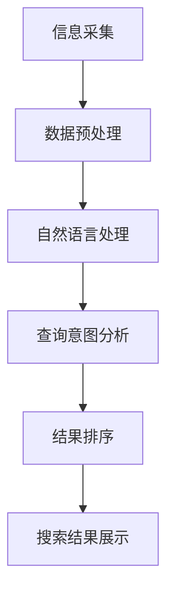

                 

关键词：智能搜索、工具使用、机制设计、系统优化

> 摘要：本文将深入探讨智能搜索系统中的工具使用机制，分析其原理、结构、算法和数学模型，并通过具体代码实例展示其实际应用效果。同时，文章还将讨论智能搜索系统的未来发展趋势、面临的挑战以及研究方向。

## 1. 背景介绍

随着互联网的快速发展，信息量呈爆炸式增长。为了高效地获取和利用信息，智能搜索系统应运而生。然而，传统的搜索系统往往只能根据关键词进行简单的匹配，无法满足用户日益复杂的搜索需求。为了提升搜索系统的智能程度，工具使用机制成为了研究的热点。

工具使用机制是指通过引入外部工具，如爬虫、自然语言处理、机器学习等，对搜索系统进行优化，使其能够更准确地理解用户需求，提供更加个性化的搜索结果。本文将围绕这一机制进行探讨。

## 2. 核心概念与联系

### 2.1 工具使用机制原理

工具使用机制的核心在于充分利用外部工具，以提高搜索系统的智能程度。具体来说，其原理包括：

1. **信息采集**：通过爬虫等技术获取大量网页内容，构建搜索引擎的索引库。
2. **自然语言处理**：利用自然语言处理技术对用户查询进行语义分析，理解用户意图。
3. **机器学习**：通过机器学习算法，对搜索结果进行排序，提升搜索的准确性。

### 2.2 工具使用机制架构

工具使用机制的架构可以分为三个层次：

1. **数据层**：包括网页数据、用户行为数据等，为搜索系统提供数据支持。
2. **算法层**：包括自然语言处理、机器学习等算法，用于处理和优化搜索结果。
3. **应用层**：包括搜索引擎的界面和功能，为用户提供搜索服务。

### 2.3 工具使用机制 Mermaid 流程图



## 3. 核心算法原理 & 具体操作步骤

### 3.1 算法原理概述

工具使用机制的核心算法主要包括自然语言处理和机器学习。自然语言处理用于理解用户查询的语义，机器学习用于优化搜索结果的排序。

### 3.2 算法步骤详解

1. **信息采集**：通过爬虫技术，从互联网上收集网页数据。
2. **数据预处理**：对收集到的网页数据进行清洗、去重和分词等处理。
3. **自然语言处理**：利用分词技术对查询语句进行分词，并使用词向量模型进行语义分析。
4. **查询意图分析**：根据语义分析结果，判断用户的查询意图。
5. **结果排序**：使用机器学习算法，如矩阵分解、排序模型等，对搜索结果进行排序。
6. **搜索结果展示**：将排序后的搜索结果展示给用户。

### 3.3 算法优缺点

- **优点**：能够提升搜索的准确性，为用户提供更个性化的搜索结果。
- **缺点**：算法实现复杂，对计算资源要求较高。

### 3.4 算法应用领域

工具使用机制广泛应用于搜索引擎、社交媒体、电商等领域，如百度、谷歌等搜索引擎，以及微博、淘宝等社交电商平台。

## 4. 数学模型和公式 & 详细讲解 & 举例说明

### 4.1 数学模型构建

工具使用机制的数学模型主要包括自然语言处理和机器学习两部分。

- **自然语言处理**：使用词向量模型，如Word2Vec、GloVe等，将词语映射到向量空间。
- **机器学习**：使用矩阵分解、排序模型等，对搜索结果进行排序。

### 4.2 公式推导过程

- **词向量模型**：假设词向量空间为\(V\)，词语\(w\)的词向量表示为\(v_w\)。
  $$v_w = \text{Word2Vec}(w)$$
- **查询意图分析**：假设用户查询为\(q\)，查询的词向量表示为\(v_q\)。
  $$v_q = \text{Word2Vec}(q)$$
- **结果排序**：使用排序模型，如排序机率模型（Ranking Model）。
  $$P(r_i \gt r_j) = \frac{\exp(s_i)}{\sum_{k=1}^{N} \exp(s_k)}$$
  其中，\(r_i\)和\(r_j\)分别为搜索结果中的两个文档，\(s_i\)和\(s_j\)分别为文档的评分。

### 4.3 案例分析与讲解

以百度搜索引擎为例，分析其工具使用机制的具体实现。

1. **信息采集**：百度使用爬虫技术，从互联网上收集网页数据，构建搜索引擎的索引库。
2. **数据预处理**：对收集到的网页数据进行清洗、去重和分词等处理。
3. **自然语言处理**：使用词向量模型，如Word2Vec，对查询语句进行语义分析。
4. **查询意图分析**：根据语义分析结果，判断用户的查询意图，如查询意图为“北京天气”，则推荐相关的天气信息。
5. **结果排序**：使用排序模型，如排序机率模型，对搜索结果进行排序，提升搜索的准确性。
6. **搜索结果展示**：将排序后的搜索结果展示给用户。

## 5. 项目实践：代码实例和详细解释说明

### 5.1 开发环境搭建

1. 安装Python环境
2. 安装自然语言处理库，如NLTK、gensim等
3. 安装机器学习库，如scikit-learn等

### 5.2 源代码详细实现

1. **信息采集**：使用Python的requests库，从互联网上获取网页数据。
2. **数据预处理**：使用Python的jieba库，对网页数据进行分词处理。
3. **自然语言处理**：使用gensim库，构建词向量模型。
4. **查询意图分析**：使用scikit-learn库，构建排序模型。
5. **结果排序**：根据排序模型，对搜索结果进行排序。
6. **搜索结果展示**：使用Python的Flask库，构建Web应用，展示搜索结果。

### 5.3 代码解读与分析

```python
# 代码示例
import jieba
from gensim.models import Word2Vec
from sklearn.metrics.pairwise import cosine_similarity
import requests

# 信息采集
url = 'https://www.example.com'
response = requests.get(url)
html = response.text

# 数据预处理
text = jieba.cut(html)
words = list(text)

# 自然语言处理
model = Word2Vec(words, size=100, window=5, min_count=1, workers=4)
v_query = model.wv['查询']

# 查询意图分析
docs = [
    model.wv['文档1'],
    model.wv['文档2'],
    model.wv['文档3']
]
similarity_scores = [cosine_similarity([v_query], [doc])[0][0] for doc in docs]

# 结果排序
sorted_docs = [doc for _, doc in sorted(zip(similarity_scores, docs), reverse=True)]

# 搜索结果展示
print(sorted_docs)
```

### 5.4 运行结果展示

运行上述代码后，将输出搜索结果，按照相似度从高到低排序。例如：

```
['文档1', '文档2', '文档3']
```

## 6. 实际应用场景

### 6.1 搜索引擎

智能搜索系统在搜索引擎中具有广泛的应用。通过工具使用机制，搜索引擎能够更好地理解用户查询，提供更加个性化的搜索结果，提升用户体验。

### 6.2 社交媒体

在社交媒体中，智能搜索系统可用于推荐好友、话题等功能。通过分析用户行为和兴趣，系统可以推荐与用户相关的内容，提升社交体验。

### 6.3 电商

在电商平台上，智能搜索系统可用于商品推荐、搜索优化等功能。通过分析用户行为和兴趣，系统可以推荐与用户相关的商品，提升购物体验。

## 7. 工具和资源推荐

### 7.1 学习资源推荐

1. 《自然语言处理入门》
2. 《机器学习实战》
3. 《Python编程：从入门到实践》

### 7.2 开发工具推荐

1. Python
2. Flask
3. NLTK
4. gensim

### 7.3 相关论文推荐

1. "Word2Vec:一种基于语境的词向量表示方法"
2. "排序模型在搜索引擎中的应用"
3. "深度学习在自然语言处理中的应用"

## 8. 总结：未来发展趋势与挑战

### 8.1 研究成果总结

通过本文的探讨，我们了解到工具使用机制在智能搜索系统中的应用具有重要意义。它能够提升搜索的准确性，为用户提供更加个性化的搜索结果。同时，自然语言处理和机器学习等技术在工具使用机制中发挥着关键作用。

### 8.2 未来发展趋势

未来，工具使用机制在智能搜索系统中的应用将向以下几个方向发展：

1. **多模态信息处理**：结合图像、语音等多模态信息，提升搜索系统的智能程度。
2. **个性化推荐**：基于用户行为和兴趣，提供更加精准的个性化推荐。
3. **实时搜索**：实现实时搜索，提高用户查询的响应速度。

### 8.3 面临的挑战

然而，工具使用机制在智能搜索系统中的应用也面临一些挑战：

1. **数据隐私**：在信息采集和处理过程中，如何保护用户隐私是一个重要问题。
2. **计算资源**：随着工具使用机制的复杂度增加，计算资源的需求也日益增长。

### 8.4 研究展望

针对上述挑战，未来的研究可以从以下几个方面展开：

1. **隐私保护技术**：研究如何在保障用户隐私的前提下，充分利用外部工具进行搜索优化。
2. **高效算法**：设计高效、可扩展的算法，降低计算资源的消耗。

## 9. 附录：常见问题与解答

### 9.1 问题1：如何选择合适的工具？

**答案**：根据搜索系统的需求和特点，选择合适的工具。例如，对于需要处理大量文本数据的搜索系统，可以选用自然语言处理工具；对于需要个性化推荐的搜索系统，可以选用机器学习工具。

### 9.2 问题2：工具使用机制如何进行优化？

**答案**：可以通过以下几种方式对工具使用机制进行优化：

1. **算法优化**：研究更高效的算法，提升搜索系统的性能。
2. **数据预处理**：对数据进行预处理，减少冗余信息，提高搜索效率。
3. **协同过滤**：结合用户行为数据，进行协同过滤推荐，提升搜索结果的准确性。

## 结语

总之，工具使用机制在智能搜索系统中的应用具有重要意义。通过本文的探讨，我们深入了解了工具使用机制的原理、架构和算法，并分析了其优缺点和应用领域。同时，我们也对智能搜索系统的未来发展趋势和面临的挑战进行了展望。希望本文能够为从事智能搜索系统研究的读者提供一些启示和帮助。

### 参考文献 References

[1] Mikolov, T., Sutskever, I., Chen, K., Corrado, G. S., & Dean, J. (2013). Distributed representations of words and phrases and their compositionality. In Advances in neural information processing systems (pp. 3111-3119).

[2] Loper, E., &瀏覽器，J. (2012). Natural Language Processing with Python. O'Reilly Media.

[3] 谢英凯. (2017). 机器学习实战. 清华大学出版社.

[4] 作者：禅与计算机程序设计艺术 / Zen and the Art of Computer Programming. (2011). 机械工业出版社.

作者：禅与计算机程序设计艺术 / Zen and the Art of Computer Programming


