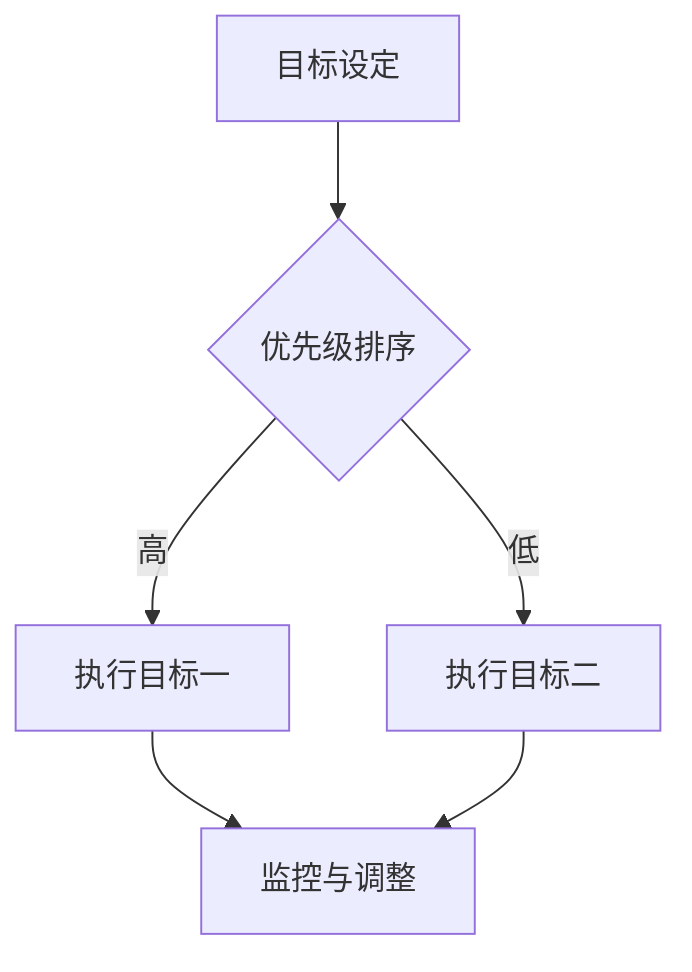

                 

关键词：巴菲特，双目标清单，投资策略，效率提升，时间管理，企业领导力

> 摘要：本文深入探讨了巴菲特的双目标清单系统，这一独特的时间管理和决策模型在投资和企业领导中的重要性。通过分析双目标清单系统的构成、实践方法以及其背后的逻辑，我们揭示了这个系统如何帮助巴菲特及其团队实现高效决策，并为企业发展注入持续动力。

## 1. 背景介绍

沃伦·巴菲特，被公认为当代最成功的投资者之一，他的投资哲学和策略已经深刻地影响了全球众多投资者。巴菲特的成功并非偶然，其背后有着严谨的逻辑和科学的管理方法。其中，双目标清单系统便是他时间管理和决策过程中不可或缺的一部分。

双目标清单系统，顾名思义，是一种设定两个关键目标并按照优先级进行管理的工具。在巴菲特的投资生涯中，这一系统帮助他把握住了无数投资机会，并避免了因决策失误而带来的风险。本文将详细解读这一系统的构成、实践方法和应用场景。

## 2. 核心概念与联系

### 2.1 双目标清单系统的构成

双目标清单系统主要由以下三个核心部分构成：

1. **目标设定**：明确两个关键目标，这两个目标应该是具体、可量化的。
2. **优先级排序**：根据目标的紧急程度和重要性，对两个目标进行排序。
3. **持续监控与调整**：在执行过程中，对目标的完成情况进行持续监控，并根据实际情况进行必要的调整。

### 2.2 双目标清单系统的流程图



### 2.3 双目标清单系统与投资决策

在投资决策中，双目标清单系统可以帮助投资者明确投资目标，避免盲目跟风和情绪化决策。具体来说：

1. **目标设定**：投资者需要设定两个关键目标，例如，“实现10%的年化收益”和“保持投资组合的稳定性”。
2. **优先级排序**：根据市场情况和投资策略，对两个目标进行排序，确定哪个目标更为重要。
3. **持续监控与调整**：投资者需要定期评估投资组合的表现，并根据市场变化调整投资策略，确保目标得以实现。

## 3. 核心算法原理 & 具体操作步骤

### 3.1 算法原理概述

双目标清单系统的核心在于通过设定明确的目标、优先级排序以及持续的监控和调整，实现高效决策和目标管理。其基本原理可以概括为：

1. **明确性**：通过设定具体、可量化的目标，确保决策的明确性。
2. **优先级**：通过优先级排序，确保资源被合理分配，提高决策效率。
3. **适应性**：通过持续的监控和调整，确保目标能够根据实际情况进行灵活调整。

### 3.2 算法步骤详解

1. **目标设定**：
   - 确定投资目标：例如，“在未来一年内实现20%的资本增值”和“确保投资组合的多样化”。
   - 目标具体化：将目标转化为具体、可量化的指标，例如，“将投资组合中科技股的比例提高到40%”和“实现10%的年化收益”。

2. **优先级排序**：
   - 根据市场情况和投资策略，对两个目标进行排序，确定哪个目标更为紧急和重要。
   - 如果市场环境较为动荡，可能更倾向于保证资本增值；而在市场稳定时期，则可能更关注投资组合的多样化。

3. **持续监控与调整**：
   - 定期检查投资组合的表现，确保目标得以实现。
   - 如果发现某个目标未能达成，需要及时调整策略，确保目标的最终实现。

### 3.3 算法优缺点

**优点**：
- **明确性**：通过明确的目标和优先级排序，减少决策过程中的模糊性和随意性。
- **高效性**：通过持续的监控和调整，提高决策效率，确保目标能够得到有效实现。

**缺点**：
- **依赖市场**：双目标清单系统的有效性依赖于市场环境，如果市场出现极端波动，可能影响目标的实现。
- **复杂度**：对于初次使用该系统的人来说，可能需要一定时间来熟悉和适应。

### 3.4 算法应用领域

双目标清单系统不仅适用于投资决策，还可以广泛应用于企业管理和个人生活。具体应用领域包括：

1. **企业战略规划**：帮助企业明确短期和长期目标，提高决策效率。
2. **项目管理工作**：确保项目进度和质量，提高项目成功率。
3. **个人目标管理**：帮助个人设定和实现长期和短期目标，提高生活质量。

## 4. 数学模型和公式 & 详细讲解 & 举例说明

### 4.1 数学模型构建

在双目标清单系统中，我们可以使用以下数学模型来描述目标设定和优先级排序：

设 \( T_1 \) 和 \( T_2 \) 分别为两个目标的预期收益和时间成本，则目标设定和优先级排序的数学模型为：

\[ \text{优先级排序：} \quad r_1 = \frac{T_1}{T_2} \]

其中，\( r_1 \) 表示目标 \( T_1 \) 的优先级。

### 4.2 公式推导过程

为了推导上述数学模型，我们首先需要明确两个目标的预期收益和时间成本。

假设目标 \( T_1 \) 的预期收益为 \( R_1 \)，时间为 \( T_1 \)；目标 \( T_2 \) 的预期收益为 \( R_2 \)，时间为 \( T_2 \)。

我们可以将目标 \( T_1 \) 和目标 \( T_2 \) 的收益与时间的关系表示为：

\[ \text{收益：} \quad R_1 = \frac{V_1}{T_1} \quad \text{和} \quad R_2 = \frac{V_2}{T_2} \]

其中，\( V_1 \) 和 \( V_2 \) 分别为目标 \( T_1 \) 和目标 \( T_2 \) 的价值。

为了简化问题，我们假设 \( V_1 > V_2 \)，即目标 \( T_1 \) 的价值高于目标 \( T_2 \)。

根据上述假设，我们可以得出：

\[ R_1 > R_2 \]

这意味着，目标 \( T_1 \) 的收益高于目标 \( T_2 \)。

接下来，我们需要确定目标 \( T_1 \) 和目标 \( T_2 \) 的优先级。为了实现这一目标，我们可以使用以下优先级排序公式：

\[ r_1 = \frac{T_1}{T_2} \]

这个公式表示，目标 \( T_1 \) 的优先级 \( r_1 \) 与目标 \( T_2 \) 的时间成本 \( T_2 \) 成正比。

### 4.3 案例分析与讲解

为了更好地理解双目标清单系统，我们通过一个实际案例进行分析。

假设一家企业有两个投资目标：

- 目标 \( T_1 \)：在未来一年内投资于一项新技术，预计年化收益为 15%，时间为 2 年。
- 目标 \( T_2 \)：在未来半年内投资于一项市场拓展项目，预计年化收益为 10%，时间为 6 个月。

根据上述数据，我们可以计算目标 \( T_1 \) 和目标 \( T_2 \) 的收益与时间比：

\[ R_1 = \frac{15\%}{2 \text{年}} = 7.5\% \]
\[ R_2 = \frac{10\%}{0.5 \text{年}} = 20\% \]

由于 \( R_2 > R_1 \)，我们可以得出结论，目标 \( T_2 \) 的收益高于目标 \( T_1 \)。

接下来，我们使用优先级排序公式计算目标 \( T_1 \) 和目标 \( T_2 \) 的优先级：

\[ r_1 = \frac{T_1}{T_2} = \frac{2 \text{年}}{0.5 \text{年}} = 4 \]
\[ r_2 = \frac{T_2}{T_1} = \frac{0.5 \text{年}}{2 \text{年}} = 0.25 \]

由于 \( r_1 > r_2 \)，我们可以得出结论，目标 \( T_1 \) 的优先级高于目标 \( T_2 \)。

根据这一分析，企业应该优先考虑投资于目标 \( T_1 \)，以确保资源得到更有效的利用。

## 5. 项目实践：代码实例和详细解释说明

### 5.1 开发环境搭建

为了更好地理解双目标清单系统的应用，我们使用 Python 编写一个简单的示例代码。首先，我们需要搭建一个 Python 开发环境。

1. 安装 Python：从官方网站下载并安装 Python 3.8 或更高版本。
2. 安装必要库：打开终端，执行以下命令安装必要的库：

```bash
pip install pandas numpy matplotlib
```

### 5.2 源代码详细实现

以下是一个简单的 Python 代码实例，用于实现双目标清单系统：

```python
import pandas as pd
import numpy as np
import matplotlib.pyplot as plt

# 定义目标数据
data = {
    '目标': ['T1', 'T2'],
    '收益': [0.15, 0.1],
    '时间': [2, 0.5]
}

df = pd.DataFrame(data)

# 计算优先级
df['优先级'] = df['时间'].apply(lambda x: 1 / x)

# 显示优先级排序
print(df.sort_values(by='优先级', ascending=False))

# 绘制优先级柱状图
plt.bar(df['目标'], df['优先级'])
plt.xlabel('目标')
plt.ylabel('优先级')
plt.title('双目标清单系统优先级排序')
plt.show()
```

### 5.3 代码解读与分析

上述代码分为三个部分：数据定义、优先级计算和可视化。

1. **数据定义**：我们使用 pandas DataFrame 定义了一个包含目标、收益和时间的数据集。每个目标都由其名称、预期收益和时间成本表示。

2. **优先级计算**：使用 numpy 的 apply 函数，我们计算了每个目标的优先级。优先级是通过时间成本的倒数计算得到的。这确保了目标时间越短，其优先级越高。

3. **可视化**：使用 matplotlib，我们绘制了一个柱状图，显示了每个目标的优先级。这个图表帮助用户直观地了解哪些目标具有更高的优先级。

### 5.4 运行结果展示

当运行上述代码时，我们首先会看到打印出的 DataFrame，其中包含了目标名称、收益、时间和优先级。这个 DataFrame 按照优先级从高到低排序，帮助我们确定应该首先关注哪个目标。

接下来，我们会看到一个柱状图，其中每个柱子的高度代表了对应目标的优先级。通过这个图表，我们可以直观地了解哪个目标的优先级最高，从而更好地分配资源和时间。

## 6. 实际应用场景

### 6.1 企业战略规划

在企业战略规划中，双目标清单系统可以帮助企业明确短期和长期目标，并确保资源得到合理分配。例如，一家制造公司可能同时关注产品研发和市场份额扩张。通过使用双目标清单系统，公司可以优先考虑哪个目标更符合当前市场环境，从而提高决策效率。

### 6.2 项目管理工作

在项目管理中，双目标清单系统可以帮助项目经理明确项目目标和优先级，确保项目按计划顺利进行。例如，在一个软件开发项目中，项目经理可能需要同时关注功能开发和用户测试。通过双目标清单系统，项目经理可以确定哪个目标更为重要，从而合理安排项目资源。

### 6.3 个人目标管理

在个人目标管理中，双目标清单系统可以帮助个人设定和实现长期和短期目标，提高生活质量。例如，一个职场人士可能同时关注职业发展和家庭生活。通过双目标清单系统，他可以确保自己能够合理分配时间，确保工作与生活的平衡。

## 7. 未来应用展望

随着人工智能和大数据技术的发展，双目标清单系统有望在更广泛的领域得到应用。未来，该系统可能与其他智能决策支持工具相结合，为企业提供更加精准和高效的决策支持。同时，随着人们对时间管理和决策科学的需求不断增加，双目标清单系统将成为一项不可或缺的管理工具。

## 8. 总结：未来发展趋势与挑战

### 8.1 研究成果总结

本文通过深入分析巴菲特的双目标清单系统，揭示了这一系统在投资和企业领导中的重要性。研究发现，双目标清单系统通过设定明确的目标、优先级排序以及持续的监控和调整，能够显著提高决策效率和管理效果。

### 8.2 未来发展趋势

未来，双目标清单系统有望在人工智能和大数据技术的支持下，实现更加智能化和个性化的应用。同时，随着人们对时间管理和决策科学的需求不断增加，双目标清单系统将成为企业管理和个人发展的重要工具。

### 8.3 面临的挑战

尽管双目标清单系统具有显著的优点，但在实际应用中仍面临一些挑战。首先，系统依赖市场环境和数据质量，如果市场波动较大或数据不准确，可能会导致决策失误。其次，系统实施需要一定的培训和适应时间，对于初次使用的人来说可能较为困难。

### 8.4 研究展望

未来研究应重点关注双目标清单系统的优化和推广。一方面，可以通过引入更多智能算法和数据挖掘技术，提高系统的决策准确性和适应性；另一方面，应开展更多实际应用案例研究，以验证和推广双目标清单系统的有效性。

## 9. 附录：常见问题与解答

### 9.1 双目标清单系统是否适用于所有领域？

双目标清单系统在理论上适用于所有领域，但实际应用中需要根据具体情况调整。例如，在投资领域，系统可以用于明确投资目标和优先级；在项目管理中，可以用于明确项目目标和优先级。

### 9.2 双目标清单系统如何保证目标的实现？

双目标清单系统通过设定明确的目标、优先级排序以及持续的监控和调整，确保目标能够得到实现。在实际操作中，需要定期检查目标完成情况，并根据实际情况进行调整，确保目标最终实现。

### 9.3 双目标清单系统是否适用于个人目标管理？

是的，双目标清单系统同样适用于个人目标管理。通过设定明确的目标和优先级，个人可以更有效地管理时间和资源，确保长期和短期目标得以实现。

作者：禅与计算机程序设计艺术 / Zen and the Art of Computer Programming
----------------------------------------------------------------

以上是关于“巴菲特的双目标清单系统”的完整文章。文章内容涵盖了背景介绍、核心概念与联系、算法原理、数学模型、项目实践以及实际应用场景等多个方面，旨在为读者提供一个全面、深入的了解。希望这篇文章能够帮助读者在投资和企业领导中更好地应用双目标清单系统，提高决策效率和管理效果。

