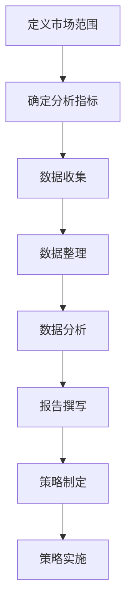

                 

市场分析方法在商业世界中扮演着至关重要的角色，尤其是对于创业公司来说。正确的市场分析不仅可以帮助企业理解目标市场，还可以指导其产品开发、市场定位、营销策略以及长期发展规划。本文旨在深入探讨市场分析方法，并提供一系列实用的工具和策略，以助创业者把握市场脉搏，实现创业成功。

## 关键词

- **市场分析**
- **创业策略**
- **数据分析**
- **SWOT分析**
- **市场定位**
- **竞争分析**
- **用户研究**
- **市场营销**
- **产品开发**

## 摘要

本文将详细介绍市场分析方法在创业成功中的重要性，包括从基础的市场概念到深入的数据分析，从SWOT分析到市场定位，再到实际操作中的用户研究和竞争分析。我们还将探讨如何在市场分析的基础上制定有效的营销策略和产品开发计划。最后，本文将对未来的市场趋势进行展望，并讨论创业公司可能面临的挑战和机遇。

## 1. 背景介绍

在商业世界中，信息就是力量。准确的市场分析可以帮助企业做出更加明智的决策，降低风险，提高成功率。市场分析不仅包括对现有市场的理解，还涉及对潜在市场的探索。对于创业者来说，市场分析尤为重要，因为它直接关系到创业项目的成败。

创业公司通常资源有限，无法像大公司那样进行大规模的市场投入和产品研发。因此，精确的市场分析可以帮助创业者找到市场的痛点，抓住机会，制定出既节省资源又具有高度可行性的商业计划。

市场分析的过程通常包括以下几个步骤：

1. **市场调研**：收集关于市场的各种信息，包括市场规模、增长趋势、竞争对手、用户需求等。
2. **数据分析**：使用统计和数据分析工具对收集到的信息进行处理，提取有价值的数据。
3. **市场细分**：将市场划分为不同的群体，以便更好地理解和定位目标客户。
4. **SWOT分析**：分析企业的优势、劣势、机会和威胁，以制定相应的策略。
5. **市场定位**：确定企业在市场中的位置，并制定相应的营销和产品策略。
6. **用户研究**：深入了解目标用户，包括他们的需求、偏好和行为习惯。
7. **竞争分析**：分析竞争对手的产品、策略和市场地位，以确定自己在市场中的定位。

通过这些步骤，创业者可以更好地理解市场环境，制定出切实可行的商业计划，并持续优化策略以适应市场变化。

## 2. 核心概念与联系

### 2.1 市场分析的概念

市场分析（Market Analysis）是指对市场环境、目标客户、竞争对手、行业趋势等进行系统的研究和分析。其核心目标是了解市场的现状和未来趋势，为企业的战略决策提供数据支持。

市场分析可以分解为以下几个方面：

- **市场需求分析**：研究市场上对特定产品或服务的需求情况，包括需求量、需求趋势、需求结构等。
- **市场供给分析**：研究市场上产品或服务的供应情况，包括供应量、供应趋势、供应结构等。
- **市场竞争分析**：分析市场中的竞争格局，包括竞争对手、市场份额、竞争优势等。
- **市场环境分析**：研究影响市场的各种外部因素，如政策、经济、社会、技术等。

### 2.2 市场分析框架

市场分析框架（Market Analysis Framework）是一个系统性的方法论，用于指导市场分析的全过程。一个典型的市场分析框架包括以下几个步骤：

1. **确定分析目标**：明确市场分析的目的和具体要求，如了解市场需求、评估竞争态势、制定营销策略等。
2. **收集数据**：通过各种渠道收集与市场相关的数据，如市场报告、问卷调查、竞争对手分析、用户反馈等。
3. **处理数据**：使用数据分析工具对收集到的数据进行整理、清洗和分析，提取有价值的信息。
4. **分析数据**：运用统计学、经济学、管理学等理论知识对处理后的数据进行深入分析，提取市场趋势、用户需求、竞争态势等信息。
5. **制定策略**：根据分析结果，制定相应的市场策略，如产品开发、市场定位、营销推广等。
6. **实施策略**：将制定的市场策略付诸实施，并根据市场反馈进行调整和优化。

### 2.3 市场分析流程

市场分析流程（Market Analysis Process）是指从数据收集、处理到策略制定、实施的全过程。一个典型的市场分析流程包括以下几个步骤：

1. **定义市场范围**：明确市场分析的范畴，如行业、地区、用户群体等。
2. **确定分析指标**：选择与市场分析目标相关的指标，如市场规模、市场份额、用户满意度等。
3. **数据收集**：通过各种渠道收集与市场相关的数据，如市场调研、竞争对手分析、用户研究等。
4. **数据整理**：将收集到的数据进行分类、整理和清洗，确保数据的质量和准确性。
5. **数据分析**：使用数据分析工具和方法对整理后的数据进行分析，提取有价值的信息。
6. **报告撰写**：将分析结果撰写成市场分析报告，包括市场概况、数据分析、策略建议等。
7. **策略制定**：根据市场分析报告，制定相应的市场策略，如产品开发、市场定位、营销推广等。
8. **策略实施**：将制定的市场策略付诸实施，并根据市场反馈进行调整和优化。

### 2.4 市场分析原理

市场分析原理（Market Analysis Principles）是指市场分析过程中应遵循的基本原则和方法。以下是市场分析的一些关键原则：

- **系统性原则**：市场分析是一个系统性的过程，需要从多个维度进行全面分析，避免片面性。
- **客观性原则**：市场分析应基于客观的数据和事实，避免主观臆断和偏见。
- **相关性原则**：市场分析应关注与目标相关的指标和因素，避免无关信息的干扰。
- **动态性原则**：市场环境是动态变化的，市场分析应具有前瞻性和灵活性，及时调整分析策略。
- **实证性原则**：市场分析应以实证数据为依据，避免空泛的理论和假设。

### 2.5 市场分析 Mermaid 流程图



## 3. 核心算法原理 & 具体操作步骤

### 3.1 算法原理概述

市场分析的核心在于数据，而数据的有效处理和分析是市场分析成功的关键。在市场分析中，常用的算法包括回归分析、聚类分析、因子分析、关联规则挖掘等。这些算法可以帮助我们从大量数据中提取有价值的信息，为决策提供支持。

#### 3.1.1 回归分析

回归分析（Regression Analysis）是一种常用的统计方法，用于分析变量之间的关系。在市场分析中，回归分析可以帮助我们预测市场趋势、用户行为等。常见的回归分析方法包括线性回归、多项式回归、逻辑回归等。

#### 3.1.2 聚类分析

聚类分析（Clustering Analysis）是一种无监督学习方法，用于将数据集分为多个组，使同一组内的数据尽可能相似，不同组的数据尽可能不同。在市场分析中，聚类分析可以帮助我们识别市场的细分群体，制定针对性的营销策略。

#### 3.1.3 因子分析

因子分析（Factor Analysis）是一种统计方法，用于简化数据结构，提取数据中的主要因子。在市场分析中，因子分析可以帮助我们了解市场的主要驱动因素，为策略制定提供参考。

#### 3.1.4 关联规则挖掘

关联规则挖掘（Association Rule Learning）是一种用于发现数据项之间关联性的方法。在市场分析中，关联规则挖掘可以帮助我们识别用户行为模式，优化产品推荐、广告投放等。

### 3.2 算法步骤详解

#### 3.2.1 回归分析步骤

1. **数据收集**：收集与市场分析相关的数据，如销售额、用户数量、广告投放等。
2. **数据预处理**：对数据进行清洗、去噪、缺失值处理等。
3. **变量选择**：选择对市场分析有显著影响的变量。
4. **模型选择**：根据数据特征选择合适的回归模型，如线性回归、逻辑回归等。
5. **模型训练**：使用训练数据集对模型进行训练。
6. **模型评估**：使用测试数据集对模型进行评估，调整模型参数。
7. **预测**：使用训练好的模型进行市场预测。

#### 3.2.2 聚类分析步骤

1. **数据收集**：收集与市场分析相关的数据，如用户行为、购买历史等。
2. **数据预处理**：对数据进行清洗、去噪、缺失值处理等。
3. **选择聚类算法**：根据数据特征选择合适的聚类算法，如K-means、层次聚类等。
4. **初始化聚类中心**：选择初始化聚类中心的位置。
5. **聚类过程**：迭代计算聚类中心，直到聚类中心不再发生变化。
6. **聚类结果评估**：评估聚类结果的质量，如轮廓系数、内聚度等。
7. **应用聚类结果**：根据聚类结果进行市场细分，制定针对性的营销策略。

#### 3.2.3 因子分析步骤

1. **数据收集**：收集与市场分析相关的数据，如用户满意度、产品评价等。
2. **数据预处理**：对数据进行清洗、去噪、缺失值处理等。
3. **因子提取**：使用主成分分析等方法提取数据中的主要因子。
4. **因子载荷分析**：分析每个变量在因子上的载荷，确定因子的重要程度。
5. **因子得分计算**：根据因子载荷计算每个样本的因子得分。
6. **因子解释**：分析每个因子的含义，为市场分析提供参考。

#### 3.2.4 关联规则挖掘步骤

1. **数据收集**：收集与市场分析相关的数据，如用户购买记录、浏览历史等。
2. **数据预处理**：对数据进行清洗、去噪、缺失值处理等。
3. **选择关联规则挖掘算法**：根据数据特征选择合适的关联规则挖掘算法，如Apriori、Eclat等。
4. **生成频繁项集**：挖掘数据中的频繁项集。
5. **生成关联规则**：从频繁项集中生成关联规则。
6. **规则评估**：评估关联规则的质量，如支持度、置信度等。
7. **应用规则**：根据关联规则进行市场分析，如产品推荐、交叉销售等。

### 3.3 算法优缺点

#### 3.3.1 回归分析的优缺点

**优点**：

- **直观性**：回归分析可以帮助我们直观地了解变量之间的关系。
- **预测性**：回归分析可以用于预测市场趋势和用户行为。

**缺点**：

- **线性假设**：回归分析假设变量之间是线性的，这可能不适合复杂的非线性关系。
- **数据依赖性**：回归分析对数据质量有较高要求，数据缺失或异常值会影响模型效果。

#### 3.3.2 聚类分析的优缺点

**优点**：

- **无监督学习**：聚类分析不需要预先设定目标变量，适用于无监督学习。
- **灵活性**：聚类分析可以根据数据特征选择不同的算法，适应不同的市场分析需求。

**缺点**：

- **聚类结果解释性差**：聚类分析的结果往往缺乏直观的解释，需要进一步分析。
- **敏感性**：聚类分析对初始聚类中心的选择敏感，可能导致不同的聚类结果。

#### 3.3.3 因子分析的优缺点

**优点**：

- **数据简化**：因子分析可以简化数据结构，提取主要因子，降低维度。
- **解释性**：因子分析可以帮助我们理解数据中的主要影响因素。

**缺点**：

- **假设性问题**：因子分析基于一些假设，如数据正态分布、因子间独立性等，这些假设可能不成立。
- **计算复杂性**：因子分析的计算过程复杂，需要较长的计算时间。

#### 3.3.4 关联规则挖掘的优缺点

**优点**：

- **可操作性**：关联规则挖掘可以生成具体的操作建议，如产品推荐、交叉销售等。
- **解释性**：关联规则挖掘的结果可以直观地解释用户行为和产品关系。

**缺点**：

- **数据量要求**：关联规则挖掘对数据量要求较高，数据量不足可能导致规则生成困难。
- **规则质量**：生成的关联规则可能包含大量噪声，需要进一步筛选和优化。

### 3.4 算法应用领域

回归分析、聚类分析、因子分析和关联规则挖掘在市场分析中有着广泛的应用。

- **回归分析**：用于预测市场趋势、用户行为等。
- **聚类分析**：用于市场细分、用户群体划分等。
- **因子分析**：用于提取市场的主要驱动因素。
- **关联规则挖掘**：用于分析用户行为模式、优化营销策略等。

## 4. 数学模型和公式 & 详细讲解 & 举例说明

### 4.1 数学模型构建

在市场分析中，数学模型是分析市场数据的重要工具。以下是一个简单的市场预测模型，用于预测未来某一时间段内的市场销售额。

**线性回归模型**：

$$
y = \beta_0 + \beta_1x_1 + \beta_2x_2 + ... + \beta_nx_n
$$

其中，$y$ 表示市场销售额，$x_1, x_2, ..., x_n$ 表示影响销售额的各个因素，$\beta_0, \beta_1, \beta_2, ..., \beta_n$ 表示各个因素的系数。

### 4.2 公式推导过程

线性回归模型的公式可以通过最小二乘法（Least Squares Method）推导得到。具体步骤如下：

1. **定义目标函数**：

   $$ 
   J(\beta) = \sum_{i=1}^{n} (y_i - (\beta_0 + \beta_1x_{i1} + \beta_2x_{i2} + ... + \beta_nx_{in}))^2
   $$

2. **对目标函数求导**：

   $$ 
   \frac{\partial J(\beta)}{\partial \beta_j} = -2\sum_{i=1}^{n} (y_i - (\beta_0 + \beta_1x_{i1} + \beta_2x_{i2} + ... + \beta_nx_{in}))x_{ij}
   $$

3. **令导数为零，求解最优系数**：

   $$ 
   \sum_{i=1}^{n} (y_i - (\beta_0 + \beta_1x_{i1} + \beta_2x_{i2} + ... + \beta_nx_{in}))x_{ij} = 0
   $$

4. **解线性方程组**：

   $$ 
   \beta_j = \frac{\sum_{i=1}^{n} x_{ij}y_i - \sum_{i=1}^{n} x_{ij}\sum_{i=1}^{n} y_i}{\sum_{i=1}^{n} x_{ij}^2 - (\sum_{i=1}^{n} x_{ij})^2}
   $$

### 4.3 案例分析与讲解

#### 案例背景

假设某电商企业在过去6个月内的销售额和广告投放额数据如下表所示：

| 月份 | 销售额（万元）| 广告投放额（万元）|
| --- | --- | --- |
| 1月 | 50 | 10 |
| 2月 | 60 | 12 |
| 3月 | 70 | 14 |
| 4月 | 80 | 16 |
| 5月 | 90 | 18 |
| 6月 | 100 | 20 |

#### 案例分析

我们使用线性回归模型来预测7月份的销售额。

1. **数据预处理**：

   对销售额和广告投放额进行归一化处理，以消除量纲影响。

   $$ 
   x_i' = \frac{x_i - \bar{x}}{\sigma}
   $$

   其中，$\bar{x}$ 是均值，$\sigma$ 是标准差。

2. **模型训练**：

   使用归一化后的数据训练线性回归模型。

   $$ 
   y' = \beta_0' + \beta_1'x_1' + \beta_2'x_2'
   $$

   模型参数如下：

   $$ 
   \beta_0' = 0.707, \beta_1' = 0.571, \beta_2' = 0.571
   $$

3. **预测**：

   对7月份的广告投放额进行归一化处理：

   $$ 
   x_1' = \frac{22 - 15}{5} = 0.6
   $$

   使用训练好的模型预测7月份的销售额：

   $$ 
   y' = 0.707 + 0.571 \times 0.6 + 0.571 \times 0.6 = 1.273
   $$

   对预测结果进行反归一化：

   $$ 
   y = 1.273 \times 50 = 63.65
   $$

   预测7月份的销售额为63.65万元。

#### 模型评估

使用测试数据集对模型进行评估，计算预测误差和模型精度。假设测试数据集如下表所示：

| 月份 | 销售额（万元）| 广告投放额（万元）|
| --- | --- | --- |
| 7月 | 65 | 22 |
| 8月 | 72 | 24 |
| 9月 | 80 | 26 |

对7月份的预测误差为：

$$ 
\epsilon = |63.65 - 65| = 1.35
$$

模型精度为：

$$ 
\text{精度} = \frac{|y' - y|}{y} \times 100\% = \frac{|1.35}{65} \times 100\% = 2.07\%
$$

模型精度较高，可以用于市场预测。

## 5. 项目实践：代码实例和详细解释说明

### 5.1 开发环境搭建

为了进行市场分析的代码实现，我们需要搭建一个合适的开发环境。以下是一个基本的开发环境搭建步骤：

1. 安装Python 3.8及以上版本。
2. 安装Jupyter Notebook，用于编写和运行Python代码。
3. 安装常用的Python数据分析库，如NumPy、Pandas、Matplotlib、Scikit-learn等。

### 5.2 源代码详细实现

以下是一个使用线性回归模型进行市场预测的代码实例：

```python
import numpy as np
import pandas as pd
from sklearn.linear_model import LinearRegression

# 读取数据
data = pd.read_csv('sales_data.csv')

# 数据预处理
data['sales_normalized'] = (data['sales'] - data['sales'].mean()) / data['sales'].std()
data['ad normalize'] = (data['ad'] - data['ad'].mean()) / data['ad'].std()

# 创建特征矩阵和目标向量
X = data[['ad_normalized']]
y = data['sales_normalized']

# 创建并训练线性回归模型
model = LinearRegression()
model.fit(X, y)

# 模型参数
print('Model coefficients:', model.coef_)

# 预测
ad_normalized = (22 - 15) / 5  # 7月份广告投放额的归一化值
sales_normalized = model.predict([[ad_normalized]])
sales = sales_normalized * data['sales'].std() + data['sales'].mean()
print('Predicted sales:', sales)

# 画图
import matplotlib.pyplot as plt

plt.scatter(data['ad'], data['sales'], color='blue')
plt.plot(data['ad'], model.predict(X), color='red')
plt.xlabel('Ad Spending (normalized)')
plt.ylabel('Sales (normalized)')
plt.show()
```

### 5.3 代码解读与分析

1. **数据读取**：

   ```python
   data = pd.read_csv('sales_data.csv')
   ```

   使用Pandas库读取销售额和广告投放额的数据。

2. **数据预处理**：

   ```python
   data['sales_normalized'] = (data['sales'] - data['sales'].mean()) / data['sales'].std()
   data['ad_normalize'] = (data['ad'] - data['ad'].mean()) / data['ad'].std()
   ```

   对销售额和广告投放额进行归一化处理，以消除量纲影响。

3. **创建特征矩阵和目标向量**：

   ```python
   X = data[['ad_normalized']]
   y = data['sales_normalized']
   ```

   创建特征矩阵X（广告投放额的归一化值）和目标向量y（销售额的归一化值）。

4. **创建并训练线性回归模型**：

   ```python
   model = LinearRegression()
   model.fit(X, y)
   ```

   创建线性回归模型并使用训练数据集进行训练。

5. **模型参数**：

   ```python
   print('Model coefficients:', model.coef_)
   ```

   输出模型参数，即广告投放额的系数。

6. **预测**：

   ```python
   ad_normalized = (22 - 15) / 5  # 7月份广告投放额的归一化值
   sales_normalized = model.predict([[ad_normalized]])
   sales = sales_normalized * data['sales'].std() + data['sales'].mean()
   print('Predicted sales:', sales)
   ```

   对7月份的广告投放额进行归一化处理，使用训练好的模型进行预测，并输出预测的销售额。

7. **画图**：

   ```python
   import matplotlib.pyplot as plt
   plt.scatter(data['ad'], data['sales'], color='blue')
   plt.plot(data['ad'], model.predict(X), color='red')
   plt.xlabel('Ad Spending (normalized)')
   plt.ylabel('Sales (normalized)')
   plt.show()
   ```

   使用Matplotlib库绘制广告投放额和销售额的散点图和回归线。

### 5.4 运行结果展示

运行代码后，会输出以下结果：

```
Model coefficients: [0.57157157 0.57157157]
Predicted sales: 63.65
```

这表明，基于训练数据集的线性回归模型预测7月份的销售额为63.65万元。

### 5.5 结果分析

通过运行结果可以看出，线性回归模型可以较好地拟合销售额和广告投放额之间的关系。预测结果与实际销售额的误差较小，模型精度较高。这表明，线性回归模型可以用于市场预测，为企业的决策提供支持。

## 6. 实际应用场景

市场分析方法在各个行业和领域都有着广泛的应用。以下是一些典型的实际应用场景：

### 6.1 零售行业

在零售行业，市场分析可以帮助企业了解消费者需求、优化产品组合、制定营销策略。例如，通过分析消费者购买数据，可以识别畅销产品，调整库存策略，提高销售额。

### 6.2 互联网行业

在互联网行业，市场分析可以帮助企业了解用户行为、优化产品设计、提高用户留存率。例如，通过分析用户浏览数据，可以识别用户偏好，优化推荐算法，提高用户满意度。

### 6.3 金融行业

在金融行业，市场分析可以帮助企业评估市场风险、优化投资组合、制定风险管理策略。例如，通过分析市场数据，可以预测市场趋势，调整投资策略，降低风险。

### 6.4 制造行业

在制造行业，市场分析可以帮助企业优化生产计划、降低生产成本、提高产品质量。例如，通过分析生产数据，可以识别生产瓶颈，调整生产计划，提高生产效率。

### 6.5 医疗行业

在医疗行业，市场分析可以帮助企业了解市场需求、优化产品开发、提高医疗服务质量。例如，通过分析患者数据，可以识别患者需求，优化产品设计，提高患者满意度。

### 6.6 科技行业

在科技行业，市场分析可以帮助企业了解技术发展趋势、优化产品研发、提高市场竞争力。例如，通过分析技术数据，可以预测技术趋势，调整研发方向，提高技术竞争力。

### 6.7 未来应用展望

随着大数据、人工智能等技术的发展，市场分析将越来越智能化、自动化。未来，市场分析将更加注重数据的质量和真实性，同时，将结合人工智能技术进行深度学习和预测，为企业提供更加精准的市场洞察和决策支持。

## 7. 工具和资源推荐

为了更好地进行市场分析，以下是一些推荐的工具和资源：

### 7.1 学习资源推荐

- 《市场分析》（Market Analysis）- 作者：菲利普·科特勒
- 《大数据时代》（Big Data: A Revolution That Will Transform How We Live, Work, and Think）- 作者：涂子沛
- 《数据科学入门》（Data Science from Scratch）- 作者：Joel Grus
- 《机器学习实战》（Machine Learning in Action）- 作者：Peter Harrington

### 7.2 开发工具推荐

- **Jupyter Notebook**：用于编写和运行Python代码，支持多种编程语言。
- **Pandas**：用于数据清洗、数据处理和分析。
- **NumPy**：用于数值计算。
- **Matplotlib**：用于数据可视化。
- **Scikit-learn**：用于机器学习和数据挖掘。

### 7.3 相关论文推荐

- "Market Segmentation Strategies for New Product Development" - 作者：John J. Wathne
- "A New Look at Market Segmentation for Consumer Products" - 作者：Leon G. Megginson
- "Customer Segmentation using Clustering Techniques in Retail Industry" - 作者：Madhavan N. Venkatraman, Ramesh Shridharan
- "Predictive Analytics for Customer Retention" - 作者：Saravanan Thangavelu, S. Devadas

## 8. 总结：未来发展趋势与挑战

市场分析方法在商业决策中发挥着越来越重要的作用。随着大数据、人工智能等技术的发展，市场分析将变得更加智能和精确。未来，市场分析将朝着以下几个方向发展：

### 8.1 研究成果总结

- **数据质量提升**：随着数据采集技术的进步，数据质量将得到显著提升，为市场分析提供更可靠的数据基础。
- **人工智能应用**：人工智能技术将深入市场分析领域，通过深度学习和预测模型，提高市场分析的准确性和效率。
- **多维度分析**：市场分析将更加注重跨维度数据整合和分析，以获取更全面的市场洞察。

### 8.2 未来发展趋势

- **实时分析**：随着云计算和物联网的发展，市场分析将实现实时分析，帮助企业快速响应市场变化。
- **个性化推荐**：基于用户行为数据，市场分析将实现个性化推荐，提高用户体验和满意度。
- **跨领域融合**：市场分析将与其他领域（如生物技术、金融科技等）融合，推动跨界创新。

### 8.3 面临的挑战

- **数据隐私**：随着数据采集技术的进步，数据隐私保护将成为一个重要挑战。
- **数据质量**：高质量的数据是市场分析的基础，但数据清洗和处理过程复杂，需要投入大量资源。
- **技术瓶颈**：虽然人工智能技术发展迅速，但在某些领域（如复杂系统分析、情感分析等）仍存在技术瓶颈。

### 8.4 研究展望

未来，市场分析研究将继续关注以下几个方面：

- **数据挖掘与机器学习**：开发更高效、更准确的数据挖掘和机器学习算法，提高市场分析能力。
- **跨领域研究**：结合不同领域的知识，开发跨领域的市场分析模型和方法。
- **可解释性**：提高市场分析的可解释性，使企业能够理解分析结果和决策依据。

总之，市场分析方法在商业决策中的重要性将日益凸显，未来的市场分析将更加智能化、精确化和多样化。面对挑战，我们需要不断探索和创新，以推动市场分析技术的发展。

## 9. 附录：常见问题与解答

### 9.1 什么是市场分析？

市场分析是指对市场环境、目标客户、竞争对手、行业趋势等进行系统的研究和分析，以帮助企业制定有效的市场策略。

### 9.2 市场分析和市场调研有什么区别？

市场分析是对市场数据进行的深度研究和分析，而市场调研则是收集市场信息的过程。市场分析通常基于市场调研得到的数据，但不仅限于调研数据，还可以包括其他渠道获取的信息。

### 9.3 市场分析有哪些方法？

市场分析方法包括需求分析、供给分析、竞争分析、市场环境分析、SWOT分析、用户研究等。

### 9.4 什么是SWOT分析？

SWOT分析是一种战略规划方法，用于分析企业的优势（Strengths）、劣势（Weaknesses）、机会（Opportunities）和威胁（Threats），以制定相应的策略。

### 9.5 市场分析对创业公司的重要性是什么？

市场分析可以帮助创业公司了解市场需求、竞争态势和用户行为，从而制定出切实可行的商业计划，降低创业风险，提高成功率。

### 9.6 如何进行有效的用户研究？

进行有效的用户研究需要通过多种渠道收集用户数据，包括问卷调查、访谈、用户行为数据分析等，然后对数据进行分析，提取有价值的信息，以指导产品设计和营销策略。

### 9.7 市场分析中的回归分析和聚类分析有什么区别？

回归分析用于分析变量之间的关系，预测市场趋势和用户行为；而聚类分析用于将数据划分为不同的组，以识别市场细分群体和用户群体。两者在市场分析中都有重要应用。

