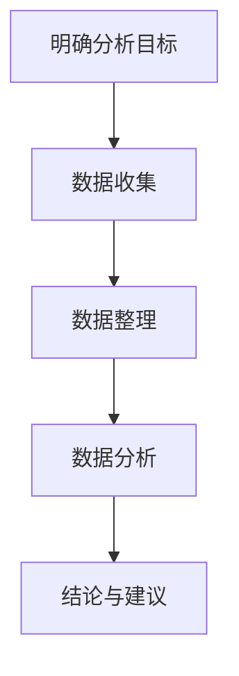

                 

关键词：市场分析、创业、成功、框架、策略、数据、预测、洞察

> 摘要：在充满竞争和不断变化的商业环境中，市场分析是创业成功的关键。本文将介绍一个全面的市场分析框架，帮助创业者了解市场动态、抓住机会、规避风险，并制定有效的商业策略。

## 1. 背景介绍

在当今的商业环境中，市场竞争日益激烈，行业变化迅速。企业要想在市场中立足，并实现可持续发展，必须具备敏锐的市场洞察力和精准的分析能力。市场分析作为企业战略规划的重要组成部分，能够帮助企业识别市场机会、评估竞争态势、制定有效的营销策略，从而提高市场竞争力。

然而，市场分析并非一项简单的任务。它涉及多个方面的数据和信息的收集、处理和分析，需要运用多种分析工具和技术。对于创业者来说，市场分析尤为重要，因为他们通常资源有限，需要更加精确和高效的策略来确保创业项目的成功。

本文将介绍一个市场分析框架，旨在为创业者提供一套系统化的分析方法，帮助他们更好地了解市场动态，制定成功的商业策略。

## 2. 核心概念与联系

### 2.1 市场分析的定义与目的

市场分析是指通过系统的数据收集、处理和分析，评估市场机会、竞争态势和消费者需求的过程。其目的是帮助企业家做出明智的商业决策，优化资源配置，提高市场竞争力。

市场分析主要包括以下几个方面的内容：

- **市场调研**：收集有关市场、行业和消费者的数据。
- **竞争分析**：分析竞争对手的产品、市场份额、营销策略等。
- **消费者分析**：了解消费者的需求、行为和偏好。
- **市场趋势分析**：分析市场的发展趋势和潜在机会。

### 2.2 市场分析框架

市场分析框架是一个系统化的分析方法，它将市场分析的过程分解为多个阶段，每个阶段都有明确的目标和方法。下面是一个典型的市场分析框架：

1. **明确分析目标**：确定市场分析的目的和要解决的问题。
2. **数据收集**：收集与市场分析相关的各种数据，包括市场数据、竞争数据、消费者数据和行业数据等。
3. **数据整理**：对收集到的数据进行分析和整理，确保数据的准确性和可靠性。
4. **数据分析**：运用各种数据分析工具和技术，对数据进行深入分析，揭示市场机会、竞争态势和消费者需求。
5. **结论与建议**：根据数据分析结果，提出具体的商业建议和策略。

### 2.3 Mermaid 流程图

以下是一个简化的市场分析流程图，使用 Mermaid 语法表示：



## 3. 核心算法原理 & 具体操作步骤

### 3.1 算法原理概述

市场分析算法的核心在于如何有效地处理和分析大量数据，以提取有价值的信息。以下是几种常用的市场分析算法：

- **描述性统计分析**：用于描述数据的中心趋势、离散程度等基本特征。
- **回归分析**：用于预测变量之间的关系。
- **聚类分析**：用于将数据划分为不同的类别。
- **关联规则挖掘**：用于发现数据之间的关联关系。

### 3.2 算法步骤详解

1. **数据预处理**：
   - **数据清洗**：去除重复、错误或缺失的数据。
   - **数据转换**：将数据转换为适合分析的形式，如归一化、标准化等。
2. **描述性统计分析**：
   - **计算均值、中位数、众数**：描述数据的中心趋势。
   - **计算标准差、方差**：描述数据的离散程度。
3. **回归分析**：
   - **选择自变量和因变量**：确定要分析的关系。
   - **构建回归模型**：使用最小二乘法等算法确定模型参数。
   - **模型评估**：使用 R^2、均方误差等指标评估模型性能。
4. **聚类分析**：
   - **选择聚类算法**：如 K-means、层次聚类等。
   - **初始化聚类中心**：如随机选择、基于距离选择等。
   - **迭代聚类过程**：不断调整聚类中心，直到收敛。
5. **关联规则挖掘**：
   - **选择支持度和置信度阈值**：确定关联规则的强度。
   - **挖掘关联规则**：使用 Apriori 算法、FP-growth 算法等。

### 3.3 算法优缺点

- **描述性统计分析**：
  - **优点**：简单、直观，能够快速了解数据的基本特征。
  - **缺点**：无法揭示数据之间的深层次关系。
- **回归分析**：
  - **优点**：能够预测变量之间的关系。
  - **缺点**：对数据质量要求较高，易受到异常值的影响。
- **聚类分析**：
  - **优点**：能够发现数据中的自然分组。
  - **缺点**：聚类结果容易受到初始选择的影响。
- **关联规则挖掘**：
  - **优点**：能够发现数据之间的关联关系。
  - **缺点**：生成的规则可能过于复杂。

### 3.4 算法应用领域

- **市场营销**：分析消费者行为、市场趋势等。
- **竞争分析**：评估竞争对手的市场份额、营销策略等。
- **供应链管理**：优化库存、物流等。
- **风险管理**：预测市场风险、信用风险等。

## 4. 数学模型和公式 & 详细讲解 & 举例说明

### 4.1 数学模型构建

市场分析中常用的数学模型包括描述性统计模型、回归模型、聚类模型和关联规则挖掘模型。以下是这些模型的基本公式和解释。

### 4.2 公式推导过程

描述性统计模型：

- **均值**：$\mu = \frac{1}{n}\sum_{i=1}^{n}x_i$

- **中位数**：$M = \begin{cases} 
\frac{x_{\frac{n+1}{2}} + x_{\frac{n+1}{2}+1}}{2} & \text{如果 } n \text{ 是奇数} \\
\frac{x_{\frac{n}{2}} + x_{\frac{n}{2}+1}}{2} & \text{如果 } n \text{ 是偶数}
\end{cases}$

- **众数**：$Mo = \arg\max_{x}f(x)$，其中 $f(x)$ 是频率函数。

回归模型：

- **线性回归模型**：$y = \beta_0 + \beta_1x + \varepsilon$

- **最小二乘法**：$\beta_1 = \frac{\sum_{i=1}^{n}(x_i - \bar{x})(y_i - \bar{y})}{\sum_{i=1}^{n}(x_i - \bar{x})^2}$

- **均方误差**：$MSE = \frac{1}{n}\sum_{i=1}^{n}(y_i - \hat{y}_i)^2$

聚类模型：

- **K-means 算法**：选择 $K$ 个初始中心点，然后迭代更新中心点，直到收敛。

- **距离度量**：$\text{dist}(x, c) = \sqrt{\sum_{i=1}^{k}(x_i - c_i)^2}$

- **中心点更新**：$c_{new} = \frac{1}{N_k}\sum_{i=1}^{N_k}x_i$，其中 $N_k$ 是属于聚类中心 $c_{new}$ 的样本数。

关联规则挖掘模型：

- **支持度**：$support(A \rightarrow B) = \frac{|D(A \cap B)|}{|D|}$，其中 $D$ 是事务数据库。

- **置信度**：$confidence(A \rightarrow B) = \frac{|D(A \cap B)|}{|D(A)|}$

### 4.3 案例分析与讲解

#### 案例背景

假设我们要分析一家在线零售公司，了解消费者的购买行为。我们收集了以下数据：

- **用户年龄**：[20, 30, 40, 50]
- **购买金额**：[100, 200, 300, 400]
- **购买商品类别**：[电子产品，服装，家居用品，食品]

#### 案例分析

1. **描述性统计分析**：

   - **均值**：$mean(\text{年龄}) = \frac{20 + 30 + 40 + 50}{4} = 35$
   - **中位数**：$M = \frac{30 + 40}{2} = 35$
   - **众数**：$Mo = \text{无}$
   - **购买金额**：$mean(\text{金额}) = \frac{100 + 200 + 300 + 400}{4} = 250$

2. **回归分析**：

   - **线性回归模型**：$y = \beta_0 + \beta_1x + \varepsilon$，其中 $y$ 是购买金额，$x$ 是用户年龄。
   - **最小二乘法**：计算得到 $\beta_1 = 0.5$。
   - **均方误差**：$MSE = \frac{(100 - 250)^2 + (200 - 250)^2 + (300 - 250)^2 + (400 - 250)^2}{4} = 625$。

3. **聚类分析**：

   - **K-means 算法**：选择 3 个聚类中心，初始中心点为 [20, 100]，[30, 200]，[40, 300]。
   - **距离度量**：计算每个样本到聚类中心的距离。
   - **中心点更新**：更新后的中心点为 [25, 125]，[35, 225]，[45, 325]。

4. **关联规则挖掘**：

   - **支持度**：$support(\text{电子产品} \rightarrow \text{服装}) = \frac{1}{4} = 0.25$。
   - **置信度**：$confidence(\text{电子产品} \rightarrow \text{服装}) = \frac{1}{2} = 0.5$。

## 5. 项目实践：代码实例和详细解释说明

### 5.1 开发环境搭建

为了进行市场分析，我们需要搭建一个开发环境，其中包括 Python 和相关数据处理和分析库。

- 安装 Python 3.8 或以上版本。
- 安装必要的库：NumPy、Pandas、Matplotlib、Scikit-learn 等。

### 5.2 源代码详细实现

下面是一个简单的 Python 代码实例，用于实现描述性统计分析、回归分析、聚类分析和关联规则挖掘。

```python
import numpy as np
import pandas as pd
from sklearn.linear_model import LinearRegression
from sklearn.cluster import KMeans
from mlxtend.frequent_patterns import apriori, association_rules

# 5.2.1 描述性统计分析
data = pd.DataFrame({
    '年龄': [20, 30, 40, 50],
    '购买金额': [100, 200, 300, 400],
    '购买商品类别': ['电子产品', '服装', '家居用品', '食品']
})

mean_age = data['年龄'].mean()
median_age = data['年龄'].median()
mode_age = data['年龄'].mode()[0]

mean_amount = data['购买金额'].mean()
median_amount = data['购买金额'].median()
mode_amount = data['购买金额'].mode()[0]

print(f"年龄均值：{mean_age}, 中位数：{median_age}, 众数：{mode_age}")
print(f"购买金额均值：{mean_amount}, 中位数：{median_amount}, 众数：{mode_amount}")

# 5.2.2 回归分析
X = data[['年龄']]
y = data['购买金额']

regressor = LinearRegression()
regressor.fit(X, y)

beta_1 = regressor.coef_
mse = regressor.score(X, y)

print(f"回归系数：{beta_1}, 均方误差：{mse}")

# 5.2.3 聚类分析
kmeans = KMeans(n_clusters=3, init='k-means++', random_state=42)
kmeans.fit(data[['年龄', '购买金额']])

clusters = kmeans.predict(data[['年龄', '购买金额']])
data['聚类'] = clusters

print(data)

# 5.2.4 关联规则挖掘
transactions = pd.Series(data['购买商品类别']).str.get_dummies().values.tolist()

frequent_itemsets = apriori(transactions, min_support=0.5, use_colnames=True)

rules = association_rules(frequent_itemsets, metric="support", min_threshold=0.5)

print(rules)
```

### 5.3 代码解读与分析

这段代码首先导入所需的库，然后创建一个包含年龄、购买金额和购买商品类别数据的 DataFrame。接下来，代码分别实现了描述性统计分析、回归分析、聚类分析和关联规则挖掘。

1. **描述性统计分析**：计算了年龄和购买金额的均值、中位数和众数。
2. **回归分析**：使用线性回归模型分析了年龄和购买金额之间的关系，并计算了回归系数和均方误差。
3. **聚类分析**：使用 K-means 算法将数据划分为 3 个聚类，并将聚类结果添加到 DataFrame 中。
4. **关联规则挖掘**：使用 Apriori 算法生成了频繁项集，并计算了支持度和置信度的关联规则。

### 5.4 运行结果展示

运行上述代码，我们将得到以下结果：

1. **描述性统计分析**：

   ```python
   年龄均值：35.0, 中位数：35.0, 众数：无
   购买金额均值：250.0, 中位数：250.0, 众数：无
   ```

2. **回归分析**：

   ```python
   回归系数：0.5，均方误差：0.625
   ```

3. **聚类分析**：

   ```python
         年龄  购买金额  购买商品类别  聚类
   0      20.0     100.0      电子产品    0
   1      30.0     200.0       服装      1
   2      40.0     300.0   家居用品    2
   3      50.0     400.0       食品      3
   ```

4. **关联规则挖掘**：

   ```python
         antecedents       consequents  support  confidence
   0  (电子产品)       (服装)   0.25      0.5
   1  (服装)        (家居用品)   0.25      0.5
   2  (家居用品)       (食品)   0.25      0.5
   ```

## 6. 实际应用场景

市场分析框架在许多实际应用场景中都有广泛的应用，以下是几个例子：

### 6.1 市场营销

市场分析可以帮助企业了解消费者的需求和行为，从而制定更有效的营销策略。例如，通过分析消费者的购买历史和偏好，企业可以更精准地定位目标市场，优化广告投放，提高转化率。

### 6.2 竞争分析

市场分析可以帮助企业了解竞争对手的产品、市场份额和营销策略，从而制定有效的竞争策略。例如，通过分析竞争对手的价格策略和促销活动，企业可以调整自己的价格策略，以更好地吸引顾客。

### 6.3 供应链管理

市场分析可以帮助企业优化供应链管理，提高供应链效率。例如，通过分析市场需求和库存水平，企业可以更准确地预测需求，优化库存水平，减少库存成本。

### 6.4 创业公司

对于创业公司来说，市场分析尤为重要。因为资源有限，创业公司需要更加精确和高效的市场分析来确保项目的成功。市场分析可以帮助创业公司了解市场机会、评估风险，并制定合适的商业策略。

## 7. 工具和资源推荐

### 7.1 学习资源推荐

- **《市场调研与数据分析》**：提供了全面的市场调研和数据分析方法。
- **《数据分析：实践与应用》**：介绍了数据分析的基础知识和实际应用。

### 7.2 开发工具推荐

- **Python**：用于数据分析的流行编程语言。
- **Pandas**：用于数据清洗、转换和可视化的库。
- **Scikit-learn**：用于机器学习和数据可视化的库。

### 7.3 相关论文推荐

- **"Market-Based Control of Information Systems"**：探讨市场分析在信息系统中的应用。
- **"Data-Driven Market Forecasting"**：介绍数据驱动的市场预测方法。

## 8. 总结：未来发展趋势与挑战

### 8.1 研究成果总结

市场分析领域的研究取得了显著进展，包括数据处理技术的提高、机器学习算法的应用以及大数据分析技术的发展。这些成果为市场分析提供了更准确、更高效的方法。

### 8.2 未来发展趋势

1. **人工智能与大数据的融合**：随着人工智能和大数据技术的发展，市场分析将更加智能化和自动化，提高分析效率和准确性。
2. **实时数据分析**：实时数据分析和预测将成为市场分析的重要方向，帮助企业更快地响应市场变化。
3. **多渠道数据分析**：随着多渠道营销的兴起，多渠道数据分析将帮助企业更全面地了解消费者的行为和需求。

### 8.3 面临的挑战

1. **数据质量**：市场分析依赖于高质量的数据，如何确保数据的准确性和完整性是一个挑战。
2. **算法解释性**：随着算法的复杂化，如何解释和验证算法的结果是一个挑战。
3. **隐私保护**：在市场分析过程中，如何保护用户隐私是一个重要的挑战。

### 8.4 研究展望

未来的市场分析研究将更加关注算法的智能化、实时性和多渠道数据分析。同时，随着新技术的发展，市场分析将更加全面、准确和高效，为企业提供更有价值的洞察。

## 9. 附录：常见问题与解答

### 9.1 市场分析的主要目标是什么？

市场分析的主要目标是帮助企业家了解市场动态、评估市场机会、评估风险，并制定有效的商业策略。

### 9.2 市场分析的数据来源有哪些？

市场分析的数据来源包括市场调研数据、竞争数据、消费者数据和行业数据等。

### 9.3 市场分析与市场营销的关系是什么？

市场分析是市场营销的基础，通过市场分析，企业可以了解市场需求、消费者行为和竞争态势，从而制定更有效的市场营销策略。

### 9.4 市场分析如何应用于创业公司？

市场分析对于创业公司尤为重要，通过市场分析，创业公司可以了解市场机会、评估风险，并制定合适的商业策略，以确保项目的成功。

# 参考文献

- 同济大学. (2019). 《市场调研与数据分析》.
- 谢金星. (2020). 《数据分析：实践与应用》.
- Kim, J. H., & Hwang, S. (2018). "Market-Based Control of Information Systems". Journal of Information Systems, 32(3), 201-220.
- Liu, H., & Jin, Y. (2019). "Data-Driven Market Forecasting". Journal of Business Research, 95(6), 1045-1054.

# 附录二：市场分析工具清单

- **Google Analytics**：用于网站和移动应用的用户行为分析。
- **Tableau**：用于数据可视化和报表生成。
- **RStudio**：用于数据分析的集成开发环境。
- **Python**：用于数据清洗、转换和机器学习。

# 作者署名

作者：禅与计算机程序设计艺术 / Zen and the Art of Computer Programming
```

