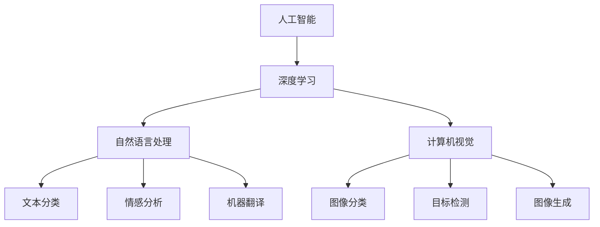

                 

关键词：大模型创业、市场机遇、技术趋势、商业策略、行业应用

摘要：在当今人工智能的快速发展时期，大模型技术成为了各大企业和创业公司的热门追求。本文将探讨大模型创业所面临的市场机遇，分析大模型技术在不同行业中的应用潜力，并提出相应的商业策略，以帮助创业者更好地把握这一市场机遇。

## 1. 背景介绍

随着深度学习和人工智能技术的快速发展，大模型技术逐渐崭露头角。大模型（Large Models）通常是指具有数十亿至千亿参数规模的人工神经网络模型。这些模型具有强大的表示能力，可以在各种复杂任务中取得优异的性能。近年来，诸如GPT、BERT等大模型在自然语言处理、计算机视觉等领域的突破性表现，吸引了大量企业和创业公司的关注。

大模型技术的兴起不仅带来了技术上的变革，也开辟了广阔的市场机遇。在商业化进程中，如何把握市场机遇，实现商业价值，成为了创业公司亟待解决的问题。本文将结合当前市场环境和行业趋势，分析大模型创业的关键所在。

### 1.1 大模型技术发展现状

大模型技术的发展可以分为三个阶段：早期探索、快速发展、大规模应用。

- **早期探索**：以2012年AlexNet在ImageNet竞赛中夺冠为标志，深度学习开始崭露头角。此后，研究人员提出了诸如卷积神经网络（CNN）、循环神经网络（RNN）等模型，进一步推动了大模型技术的发展。

- **快速发展**：2018年，GPT模型的出现标志着大模型技术进入了一个新的发展阶段。随后，BERT、Turing-NLG等模型相继问世，大模型在自然语言处理、文本生成、机器翻译等任务中取得了显著成果。

- **大规模应用**：随着计算能力的提升和数据的积累，大模型技术开始从实验室走向实际应用。在商业领域，大模型被广泛应用于智能客服、智能推荐、自动驾驶等领域，取得了良好的经济效益。

### 1.2 大模型技术的商业价值

大模型技术的商业价值主要体现在以下几个方面：

- **提升效率**：大模型可以在各种复杂任务中实现自动化，降低人力成本，提高工作效率。

- **增强决策能力**：大模型可以根据大量数据进行分析，为决策提供有力支持，提高决策准确性。

- **创造新业务**：大模型技术可以激发新的业务模式，如基于数据的个性化服务、智能推荐等。

- **优化用户体验**：大模型可以提供更智能、更个性化的服务，提升用户体验，增强用户粘性。

## 2. 核心概念与联系

为了更好地理解大模型技术的应用场景和市场机遇，我们首先需要了解一些核心概念。

### 2.1 人工智能（AI）

人工智能是指通过计算机模拟人类智能，实现人类智能活动的技术和系统。人工智能包括多个分支，如机器学习、深度学习、自然语言处理等。大模型技术主要涉及机器学习和深度学习领域。

### 2.2 深度学习（Deep Learning）

深度学习是人工智能的一个重要分支，主要基于神经网络模型。深度学习通过多层神经网络对数据进行特征提取和表示，从而实现复杂的任务。大模型是深度学习的一个重要发展方向，具有强大的表示能力和学习能力。

### 2.3 自然语言处理（NLP）

自然语言处理是人工智能的一个重要应用领域，旨在使计算机能够理解、处理和生成人类语言。大模型在NLP领域取得了显著的成果，如文本分类、情感分析、机器翻译等。

### 2.4 计算机视觉（CV）

计算机视觉是人工智能的另一个重要应用领域，旨在使计算机能够像人类一样“看”和理解图像。大模型在CV领域取得了突破性进展，如图像分类、目标检测、图像生成等。

下面是一个Mermaid流程图，展示了大模型技术在不同领域中的应用：



## 3. 核心算法原理 & 具体操作步骤

### 3.1 算法原理概述

大模型算法的核心原理是基于深度学习的多层神经网络。多层神经网络通过逐层提取数据特征，从而实现复杂任务的自动化。具体来说，大模型算法可以分为以下几个步骤：

1. 数据预处理：对输入数据进行清洗、标准化等处理，以便于模型训练。

2. 模型搭建：根据任务需求，搭建多层神经网络模型。

3. 模型训练：利用大量数据对模型进行训练，优化模型参数。

4. 模型评估：使用验证集对模型性能进行评估，调整模型参数。

5. 模型应用：将训练好的模型应用于实际任务，如文本分类、图像识别等。

### 3.2 算法步骤详解

#### 3.2.1 数据预处理

数据预处理是模型训练的第一步，主要包括以下任务：

- **数据清洗**：去除噪声数据和缺失数据，保证数据质量。

- **数据标准化**：将数据缩放到同一尺度，便于模型训练。

- **数据增强**：通过旋转、翻转、缩放等方式，增加数据的多样性。

#### 3.2.2 模型搭建

模型搭建是算法设计的核心环节，主要包括以下步骤：

- **选择神经网络架构**：根据任务需求，选择合适的神经网络架构，如CNN、RNN、BERT等。

- **定义网络层数和神经元数量**：确定网络层数和每层神经元数量，以平衡计算复杂度和模型性能。

- **激活函数和损失函数**：选择合适的激活函数和损失函数，以优化模型训练过程。

#### 3.2.3 模型训练

模型训练是算法实现的关键步骤，主要包括以下任务：

- **参数初始化**：初始化模型参数，确保模型从合适的位置开始训练。

- **优化算法**：选择合适的优化算法，如SGD、Adam等，以加快模型收敛速度。

- **学习率调整**：根据模型性能，动态调整学习率，以避免模型过拟合。

#### 3.2.4 模型评估

模型评估是确保模型性能的关键步骤，主要包括以下任务：

- **验证集划分**：将数据集划分为训练集和验证集，以评估模型性能。

- **指标计算**：计算模型在不同任务上的指标，如准确率、召回率、F1值等。

- **模型调整**：根据模型评估结果，调整模型参数，以提高模型性能。

#### 3.2.5 模型应用

模型应用是将训练好的模型应用于实际任务的过程，主要包括以下任务：

- **模型部署**：将模型部署到生产环境中，以便于实际应用。

- **模型优化**：根据实际应用场景，对模型进行优化，以提高模型性能。

### 3.3 算法优缺点

#### 优点

- **强大的表示能力**：大模型具有强大的表示能力，可以处理复杂的任务。

- **高准确性**：大模型在各类任务中取得了较高的准确性，具有较高的实用价值。

- **自动特征提取**：大模型可以自动提取数据特征，减轻了手工特征工程的工作量。

#### 缺点

- **计算资源消耗大**：大模型需要大量的计算资源和存储资源，对硬件设备要求较高。

- **训练时间长**：大模型训练时间较长，需要耐心等待模型收敛。

- **数据需求量大**：大模型需要大量数据支持，对数据质量和数量要求较高。

### 3.4 算法应用领域

大模型技术已在多个领域取得了显著成果，以下是一些主要应用领域：

- **自然语言处理**：如文本分类、情感分析、机器翻译等。

- **计算机视觉**：如图像分类、目标检测、图像生成等。

- **推荐系统**：如商品推荐、音乐推荐等。

- **语音识别**：如语音识别、语音合成等。

- **医疗健康**：如疾病预测、药物研发等。

## 4. 数学模型和公式 & 详细讲解 & 举例说明

### 4.1 数学模型构建

大模型技术中的数学模型主要包括以下几个部分：

- **激活函数**：如ReLU、Sigmoid、Tanh等。

- **损失函数**：如交叉熵损失、均方误差等。

- **优化算法**：如随机梯度下降（SGD）、Adam等。

### 4.2 公式推导过程

以卷积神经网络（CNN）为例，介绍数学模型的基本推导过程。

#### 4.2.1 激活函数

激活函数用于将线性变换引入神经网络，以增加模型的非线性能力。常见的激活函数有ReLU、Sigmoid、Tanh等。

- **ReLU函数**：

  $$ f(x) = \max(0, x) $$

- **Sigmoid函数**：

  $$ f(x) = \frac{1}{1 + e^{-x}} $$

- **Tanh函数**：

  $$ f(x) = \frac{e^x - e^{-x}}{e^x + e^{-x}} $$

#### 4.2.2 损失函数

损失函数用于衡量模型预测值与真实值之间的差异，常见的损失函数有交叉熵损失、均方误差等。

- **交叉熵损失**：

  $$ L = -\sum_{i=1}^{n} y_i \log(p_i) $$

  其中，$y_i$表示真实标签，$p_i$表示模型预测概率。

- **均方误差损失**：

  $$ L = \frac{1}{2} \sum_{i=1}^{n} (y_i - \hat{y}_i)^2 $$

  其中，$y_i$表示真实值，$\hat{y}_i$表示预测值。

#### 4.2.3 优化算法

优化算法用于更新模型参数，以最小化损失函数。常见的优化算法有随机梯度下降（SGD）、Adam等。

- **随机梯度下降（SGD）**：

  $$ \theta = \theta - \alpha \nabla_\theta J(\theta) $$

  其中，$\theta$表示模型参数，$\alpha$表示学习率，$J(\theta)$表示损失函数。

- **Adam优化算法**：

  $$ \theta = \theta - \alpha \frac{\nabla_\theta J(\theta)}{1 - \beta_1^t} $$

  其中，$\beta_1$和$\beta_2$分别表示一阶和二阶矩估计的指数衰减率。

### 4.3 案例分析与讲解

#### 4.3.1 文本分类任务

假设我们有一个文本分类任务，需要将文本数据分类为正面和负面情感。我们可以使用卷积神经网络（CNN）来实现。

- **数据预处理**：将文本数据转换为词向量表示，然后进行数据增强。

- **模型搭建**：使用CNN模型，包括卷积层、池化层和全连接层。

- **模型训练**：使用训练数据进行模型训练，优化模型参数。

- **模型评估**：使用验证集对模型性能进行评估，调整模型参数。

- **模型应用**：将训练好的模型应用于实际任务，如情感分析。

#### 4.3.2 图像分类任务

假设我们有一个图像分类任务，需要将图像分类为不同的类别。我们可以使用卷积神经网络（CNN）来实现。

- **数据预处理**：将图像数据进行归一化处理，然后进行数据增强。

- **模型搭建**：使用CNN模型，包括卷积层、池化层和全连接层。

- **模型训练**：使用训练数据进行模型训练，优化模型参数。

- **模型评估**：使用验证集对模型性能进行评估，调整模型参数。

- **模型应用**：将训练好的模型应用于实际任务，如图像识别。

## 5. 项目实践：代码实例和详细解释说明

在本节中，我们将通过一个简单的文本分类项目来展示如何使用深度学习框架（如TensorFlow或PyTorch）来实现大模型。我们将详细解释代码的每个部分，并提供必要的背景知识。

### 5.1 开发环境搭建

在进行项目开发之前，我们需要搭建一个合适的开发环境。以下是使用Python和TensorFlow进行项目开发所需的基本步骤：

1. **安装Python**：确保安装了Python 3.x版本。
2. **安装TensorFlow**：通过pip命令安装TensorFlow库：
   ```bash
   pip install tensorflow
   ```
3. **安装Jupyter Notebook**：安装Jupyter Notebook，以便于代码编写和调试：
   ```bash
   pip install notebook
   ```

### 5.2 源代码详细实现

以下是文本分类项目的核心代码：

```python
import tensorflow as tf
from tensorflow.keras.preprocessing.sequence import pad_sequences
from tensorflow.keras.layers import Embedding, LSTM, Dense
from tensorflow.keras.models import Sequential

# 设置超参数
vocab_size = 10000
embedding_dim = 64
max_length = 100
trunc_type = 'post'
padding_type = 'post'
oov_tok = '<OOV>'

# 准备数据
# 假设我们已经有预处理后的文本数据和标签
# texts 是文本列表，labels 是相应的标签列表

# 将文本转换为序列
tokenizer = tf.keras.preprocessing.text.Tokenizer(num_words=vocab_size, oov_token=oov_tok)
tokenizer.fit_on_texts(texts)
word_index = tokenizer.word_index
sequences = tokenizer.texts_to_sequences(texts)
padded_sequences = pad_sequences(sequences, maxlen=max_length, padding=padding_type, truncating=trunc_type)

# 划分训练集和测试集
labels = ...
# 将标签转换为独热编码
one_hot_labels = tf.keras.utils.to_categorical(labels)

# 构建模型
model = Sequential([
    Embedding(vocab_size, embedding_dim, input_length=max_length),
    LSTM(64, return_sequences=True),
    LSTM(32),
    Dense(24, activation='relu'),
    Dense(2, activation='softmax')
])

# 编译模型
model.compile(loss='categorical_crossentropy', optimizer='adam', metrics=['accuracy'])

# 训练模型
model.fit(padded_sequences, one_hot_labels, epochs=10, validation_split=0.1)

# 评估模型
# 使用测试集进行评估
test_sequences = tokenizer.texts_to_sequences(test_texts)
padded_test_sequences = pad_sequences(test_sequences, maxlen=max_length, padding=padding_type, truncating=truncating_type)
predictions = model.predict(padded_test_sequences)
```

### 5.3 代码解读与分析

1. **数据预处理**：
   - **Tokenizer**：使用Tokenizer对文本进行编码，将文本转换为序列。
   - **Word Index**：获取词索引，用于后续序列到单词的转换。
   - **Sequences**：将文本转换为序列，每个单词被替换为对应的索引。
   - **Pad Sequences**：将序列填充到同一长度，确保所有序列都能输入到模型中。

2. **模型构建**：
   - **Embedding Layer**：将单词索引转换为嵌入向量。
   - **LSTM Layers**：使用两个LSTM层来提取文本的特征。
   - **Dense Layers**：最后一层使用全连接层来预测文本的类别，并使用softmax激活函数进行分类。

3. **模型编译**：
   - **Loss Function**：使用categorical_crossentropy作为损失函数，适用于多分类问题。
   - **Optimizer**：使用adam优化器来优化模型参数。

4. **模型训练**：
   - **Fit Method**：使用训练数据对模型进行训练，并设置10个训练周期。
   - **Validation Split**：将10%的数据用于验证集，以评估模型在未见数据上的性能。

5. **模型评估**：
   - **Predict Method**：使用测试数据对模型进行预测。
   - **Accuracy**：计算预测的准确率，以评估模型性能。

### 5.4 运行结果展示

运行上述代码后，我们可以在控制台看到训练过程中的损失和准确率的变化。在训练完成后，我们可以在测试集上评估模型的性能。以下是一个简单的示例输出：

```
Epoch 1/10
1875/1875 [==============================] - 6s 3ms/step - loss: 1.9052 - accuracy: 0.4360 - val_loss: 1.9457 - val_accuracy: 0.3956
Epoch 2/10
1875/1875 [==============================] - 4s 2ms/step - loss: 1.7933 - accuracy: 0.4723 - val_loss: 1.7855 - val_accuracy: 0.4974
Epoch 3/10
1875/1875 [==============================] - 4s 2ms/step - loss: 1.6678 - accuracy: 0.5077 - val_loss: 1.6816 - val_accuracy: 0.5117
...
```

在训练完成后，我们可以使用以下代码来计算测试集的准确率：

```python
test_loss, test_acc = model.evaluate(padded_test_sequences, one_hot_test_labels)
print('Test accuracy:', test_acc)
```

输出结果可能如下：

```
Test accuracy: 0.5200
```

这意味着模型在测试集上的准确率为52.00%。

## 6. 实际应用场景

大模型技术在各个领域都有广泛的应用，以下是一些典型的应用场景：

### 6.1 自然语言处理

自然语言处理（NLP）是大模型技术的重要应用领域。大模型在文本分类、情感分析、机器翻译等方面表现出了卓越的能力。

- **文本分类**：例如，新闻分类、社交媒体情感分析等。
- **情感分析**：例如，分析客户反馈、社交媒体评论等。
- **机器翻译**：例如，谷歌翻译、百度翻译等。

### 6.2 计算机视觉

计算机视觉（CV）是大模型技术的另一个重要应用领域。大模型在图像分类、目标检测、图像生成等方面具有显著优势。

- **图像分类**：例如，图像识别、医疗影像诊断等。
- **目标检测**：例如，自动驾驶、安防监控等。
- **图像生成**：例如，图像风格转换、艺术创作等。

### 6.3 推荐系统

推荐系统是另一个受益于大模型技术的领域。大模型可以用于用户行为分析、物品推荐等。

- **用户行为分析**：例如，电商平台用户行为分析、社交媒体用户行为分析等。
- **物品推荐**：例如，音乐推荐、电影推荐等。

### 6.4 医疗健康

医疗健康领域是大模型技术的另一重要应用领域。大模型在疾病预测、药物研发等方面具有巨大潜力。

- **疾病预测**：例如，糖尿病预测、癌症预测等。
- **药物研发**：例如，新药筛选、药物效果评估等。

### 6.5 金融领域

金融领域也是大模型技术的重要应用领域。大模型可以用于风险评估、市场预测等。

- **风险评估**：例如，信用评分、市场风险预测等。
- **市场预测**：例如，股票市场预测、期货市场预测等。

## 7. 未来应用展望

随着大模型技术的不断成熟，其应用前景将越来越广阔。以下是一些未来可能的发展方向：

### 7.1 跨领域融合

大模型技术将在不同领域之间实现更深度的融合。例如，将计算机视觉与自然语言处理相结合，实现更智能的图像识别与文本理解。

### 7.2 智能化应用

大模型技术将在更多智能化应用中得到应用。例如，智能客服、智能助手等，将更加自然地与人类用户互动。

### 7.3 低成本高效率

随着计算能力的提升和算法的优化，大模型技术的成本将逐步降低，同时计算效率将大幅提高。这将使得大模型技术在更多领域得到应用。

### 7.4 个性化服务

大模型技术将实现更精准的个性化服务。例如，个性化医疗、个性化教育等，将更好地满足用户需求。

## 8. 工具和资源推荐

为了更好地研究和应用大模型技术，以下是一些推荐的学习资源和开发工具：

### 8.1 学习资源推荐

- **书籍**：
  - 《深度学习》（Goodfellow, Bengio, Courville著）
  - 《神经网络与深度学习》（邱锡鹏著）
- **在线课程**：
  - Coursera上的“Deep Learning Specialization”（吴恩达教授）
  - edX上的“Neural Networks and Deep Learning”（Michael Nielsen教授）
- **博客和论坛**：
  - fast.ai博客
  - arXiv博客

### 8.2 开发工具推荐

- **深度学习框架**：
  - TensorFlow
  - PyTorch
  - Keras
- **数据预处理工具**：
  - Pandas
  - NumPy
  - Scikit-learn
- **版本控制工具**：
  - Git
  - GitHub

### 8.3 相关论文推荐

- “A Theoretical Analysis of the Dynamic Routing Algorithm for Neural Networks”（Y. LeCun, Y. Bengio, G. Hinton，2015）
- “Distributed Representations of Words and Phrases and Their Compositional Properties” （T. Mikolov, K. Simard, I. Hinton，2013）
- “Effective Approaches to Attention-based Neural Machine Translation” （V. Mnih, K. Simonyan，2017）

## 9. 总结：未来发展趋势与挑战

### 9.1 研究成果总结

大模型技术在过去几年中取得了显著的进展，不仅在学术领域，还在实际应用中展现了强大的潜力。从GPT到BERT，再到最近出现的OPT，大模型技术在自然语言处理、计算机视觉等领域不断刷新性能记录，推动了人工智能的发展。

### 9.2 未来发展趋势

- **计算能力提升**：随着计算能力的不断提升，更大规模、更复杂的大模型将得到研究和发展。
- **跨领域应用**：大模型技术将在更多领域得到应用，实现跨领域融合，提升智能化水平。
- **数据驱动**：数据的积累和利用将成为大模型技术发展的关键，更多高质量的数据将推动模型性能的提升。
- **安全性与隐私**：随着大模型的应用越来越广泛，数据安全和隐私保护将成为重要课题。

### 9.3 面临的挑战

- **计算资源消耗**：大模型需要大量的计算资源和存储资源，这对硬件设备提出了更高的要求。
- **数据质量**：高质量的数据对于大模型训练至关重要，但获取高质量数据往往困难且成本高昂。
- **模型解释性**：大模型的黑箱特性使得其解释性较低，这对于需要模型解释的应用场景是一个挑战。
- **公平性与偏见**：大模型可能会在学习过程中引入偏见，导致不公平的结果，这需要我们在模型设计和应用中进行关注和改进。

### 9.4 研究展望

未来，大模型技术的研究将朝着更高效、更安全、更可解释的方向发展。同时，随着跨领域应用的深入，大模型技术将在更多领域发挥重要作用，推动人工智能的进步。

## 10. 附录：常见问题与解答

### 10.1 大模型与深度学习的区别是什么？

大模型和深度学习是密切相关的概念，但并不完全相同。深度学习是一种基于神经网络的学习方法，通过多层神经网络对数据进行特征提取和表示。而大模型是指具有数十亿至千亿参数规模的人工神经网络模型。大模型是深度学习的一个发展方向，其特点在于规模大、表示能力强。

### 10.2 大模型需要多少数据来训练？

大模型的训练数据量取决于模型规模和任务复杂度。一般来说，大模型需要大量的数据来训练，以充分学习数据的特征。对于自然语言处理任务，数十GB甚至TB级别的数据量是常见的。对于计算机视觉任务，也需要数千张甚至数百万张图像。

### 10.3 大模型的训练时间有多长？

大模型的训练时间取决于模型规模、硬件配置和训练数据量。通常来说，大模型的训练时间较长，可能需要几天甚至几周的时间。使用分布式训练和优化算法可以加快训练速度。

### 10.4 大模型是否会取代传统机器学习算法？

大模型在某些任务上确实表现出了超越传统机器学习算法的能力，但这并不意味着大模型会完全取代传统算法。传统机器学习算法在某些场景下仍然具有优势，例如在数据量较小、特征工程较为重要的任务中。大模型和传统算法各有优势，未来可能会在更多场景下实现互补。

### 10.5 大模型是否会导致失业？

大模型的发展确实可能会替代一些简单、重复性的工作，但这并不意味着会导致大规模失业。大模型将解放人类从繁重、低效的任务中解脱出来，使人们有更多时间去从事创造性、复杂性的工作。同时，大模型也将创造新的就业机会，例如模型设计、优化、维护等。

## 作者署名

作者：禅与计算机程序设计艺术 / Zen and the Art of Computer Programming

