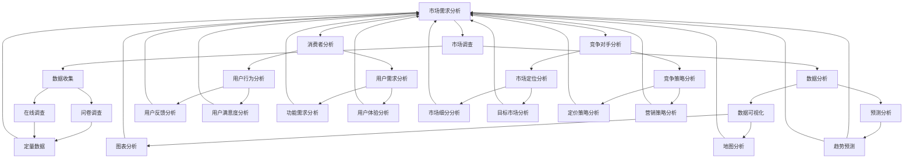

                 

在当今竞争激烈的市场环境中，创业者面临着前所未有的挑战和机遇。有效的市场需求分析成为他们航行的航标，指引他们走向成功。本文将探讨市场需求分析在创业过程中的重要性，以及如何利用这一工具为创业者的决策提供有力支持。

> 关键词：市场需求、创业分析、战略规划、商业成功、用户研究

> 摘要：本文旨在揭示市场需求分析对创业成功的关键作用。通过介绍市场需求分析的核心概念、关键步骤和实际应用，本文将帮助创业者更好地理解市场需求，为其创业之路提供方向。

## 1. 背景介绍

创业并非易事。据统计，90% 的创业公司在前五年内失败，而失败的主要原因之一是对市场需求缺乏充分的理解。在传统行业中，企业家往往依赖于直觉和经验来做出决策，但在信息爆炸的今天，这种做法已经远远不够。市场的复杂性不断增加，消费者需求瞬息万变，这使得创业者在面对市场时需要更加科学和系统的分析工具。

市场需求分析作为一种系统性的研究方法，旨在帮助企业了解目标市场、消费者需求以及竞争对手状况。它不仅关注现有市场的需求，还包括潜在市场的挖掘和开发。对于创业者而言，市场需求分析具有以下几个重要意义：

- **发现市场机会**：通过对市场的全面分析，创业者可以发现未被满足的需求和潜在的市场机会。
- **指导产品开发**：市场需求分析可以帮助创业者确定产品功能、设计和服务，确保产品能够满足用户需求。
- **竞争优势**：通过了解竞争对手的优势和劣势，创业者可以制定相应的市场策略，提高竞争力。
- **风险规避**：市场需求分析有助于发现潜在的市场风险，帮助创业者规避风险，降低失败的可能性。

### 1.1 历史背景

市场需求分析这一概念并非现代才有，早在20世纪早期，市场营销学家就开始探索如何通过研究市场需求来指导商业决策。然而，随着信息技术的发展，市场需求分析的方法和工具得到了极大的丰富和改进。大数据、人工智能和机器学习技术的引入，使得创业者可以更加高效地收集、分析和利用市场数据，从而做出更加精准的决策。

### 1.2 当前市场环境

在当前的市场环境中，市场需求分析的重要性愈加凸显。一方面，市场全球化使得竞争愈发激烈，创业者需要通过精准的市场需求分析来找到自己的定位。另一方面，消费者需求日益多元化，产品生命周期缩短，创业者需要快速响应市场变化，这都需要强大的市场需求分析能力作为支撑。

### 1.3 创业者面临的挑战

对于创业者而言，市场需求分析不仅是一项技术，更是一项挑战。以下是创业者面临的主要挑战：

- **数据获取困难**：市场数据分散在各种渠道中，创业者需要花费大量的时间和精力来收集这些数据。
- **数据分析能力不足**：数据分析是一项复杂的技能，很多创业者可能缺乏这方面的专业知识。
- **市场变化快速**：市场需求瞬息万变，创业者需要不断调整和优化市场需求分析策略。
- **资源有限**：创业者通常面临资源有限的问题，需要在有限的时间和预算内完成市场需求分析。

## 2. 核心概念与联系

在深入探讨市场需求分析之前，我们需要明确一些核心概念，并了解它们之间的相互关系。以下是市场需求分析中几个关键概念及其相互关系的Mermaid流程图：



### 2.1 市场需求分析

市场需求分析是指通过对市场数据的收集、分析和解读，来确定目标市场的需求、趋势和潜在机会。它包括以下几个关键步骤：

1. **市场调查**：收集有关市场环境、消费者行为和竞争对手的信息。
2. **消费者分析**：分析目标消费者的需求、偏好和行为模式。
3. **竞争对手分析**：了解竞争对手的市场策略、优势和劣势。

### 2.2 市场调查

市场调查是市场需求分析的基础，它通过多种方法收集市场数据，包括问卷调查、在线调查、访谈等。市场调查的主要目的是了解市场的现状和潜在变化，为后续的分析提供数据支持。

### 2.3 消费者分析

消费者分析主要包括用户行为分析和用户需求分析。用户行为分析旨在了解消费者的购买习惯、消费心理和行为模式。用户需求分析则关注消费者的需求、期望和痛点，为产品设计和改进提供依据。

### 2.4 竞争对手分析

竞争对手分析是市场需求分析的重要组成部分，它通过了解竞争对手的市场定位、产品特点、营销策略等，来确定自身的竞争优势和差异化策略。

### 2.5 数据收集与数据分析

数据收集和数据分析是市场需求分析的核心。数据收集方法包括定量数据和定性数据，而数据分析方法则包括数据可视化、预测分析等。通过有效的数据分析，创业者可以从中挖掘有价值的信息，为决策提供支持。

### 2.6 数据可视化

数据可视化是将数据转化为图表、地图等形式，使其更易于理解和分析。常用的数据可视化工具包括Excel、Tableau等。通过数据可视化，创业者可以更加直观地了解市场趋势和用户需求。

### 2.7 预测分析

预测分析是利用历史数据和统计分析方法来预测未来的市场趋势和用户需求。通过预测分析，创业者可以提前准备，应对市场变化。

## 3. 核心算法原理 & 具体操作步骤

### 3.1 算法原理概述

市场需求分析的核心算法主要包括市场调查算法、消费者分析算法和竞争对手分析算法。这些算法基于统计学、机器学习和数据挖掘技术，通过处理和分析大量市场数据，为创业者提供有关市场趋势、用户需求和竞争对手信息的有价值洞见。

### 3.2 算法步骤详解

#### 3.2.1 市场调查算法

市场调查算法主要包括以下几个步骤：

1. **数据收集**：通过问卷调查、在线调查、访谈等方式收集市场数据。
2. **数据预处理**：清洗和整理收集到的数据，确保数据的质量和一致性。
3. **数据分类**：将数据按照不同的维度进行分类，如按照用户年龄、性别、收入等进行分类。
4. **统计分析**：使用统计学方法对数据进行统计分析，如计算均值、中位数、方差等。
5. **数据可视化**：将统计分析结果以图表、地图等形式进行可视化，以便更直观地了解市场趋势。

#### 3.2.2 消费者分析算法

消费者分析算法主要包括以下几个步骤：

1. **用户行为分析**：通过分析用户的购买记录、浏览历史等行为数据，了解用户的消费习惯和偏好。
2. **用户需求分析**：结合用户行为数据和用户反馈，分析用户的需求、期望和痛点。
3. **聚类分析**：使用聚类分析方法将用户按照相似性进行分类，以便更好地了解用户群体特征。
4. **关联规则挖掘**：通过关联规则挖掘算法，分析用户行为之间的关联性，如哪些商品经常一起购买等。

#### 3.2.3 竞争对手分析算法

竞争对手分析算法主要包括以下几个步骤：

1. **市场定位分析**：通过分析竞争对手的产品特点、市场定位等，确定竞争对手的市场策略。
2. **竞争策略分析**：分析竞争对手的营销策略、定价策略等，确定自身的竞争优势和差异化策略。
3. **竞品分析**：对比分析竞争对手的产品功能、用户体验、价格等，发现自身的优劣势。
4. **预测分析**：利用历史数据和市场趋势，预测竞争对手的未来策略和市场表现。

### 3.3 算法优缺点

#### 3.3.1 市场调查算法

**优点**：

- 数据来源广泛，能够获取大量市场信息。
- 统计分析方法丰富，有助于深入了解市场趋势。

**缺点**：

- 数据质量难以保证，需要大量时间和精力进行数据预处理。
- 统计分析结果可能受到数据质量和样本代表性的影响。

#### 3.3.2 消费者分析算法

**优点**：

- 能够深入了解用户需求和行为习惯。
- 聚类分析和关联规则挖掘有助于发现潜在的市场机会。

**缺点**：

- 用户行为数据可能存在噪音和不完整性。
- 需要较高的数据分析和处理能力。

#### 3.3.3 竞争对手分析算法

**优点**：

- 能够准确了解竞争对手的市场策略和优劣势。
- 预测分析有助于预测竞争对手的未来行为。

**缺点**：

- 竞争对手数据获取难度大，需要一定的人力和物力投入。
- 预测分析结果可能受到市场环境和竞争态势变化的影响。

### 3.4 算法应用领域

市场需求分析算法广泛应用于各种行业，包括电子商务、金融、医疗、教育等。以下是一些具体的应用领域：

- **电子商务**：通过消费者分析算法，了解用户购买习惯和需求，优化产品推荐和营销策略。
- **金融**：通过市场调查算法和竞争对手分析算法，分析市场趋势和竞争对手策略，为投资决策提供支持。
- **医疗**：通过用户需求分析算法，了解患者需求和痛点，改进医疗服务和产品。
- **教育**：通过市场调查算法和消费者分析算法，了解学生需求和学习习惯，优化教育资源和教学策略。

## 4. 数学模型和公式 & 详细讲解 & 举例说明

在市场需求分析中，数学模型和公式是不可或缺的工具，它们能够帮助我们量化市场数据，揭示市场趋势和用户需求。以下将介绍几个常见的数学模型和公式，并进行详细讲解和举例说明。

### 4.1 数学模型构建

市场需求分析中的数学模型通常包括以下几类：

- **线性回归模型**：用于分析市场变量之间的关系。
- **逻辑回归模型**：用于预测二元变量的概率。
- **聚类模型**：用于将数据分为不同的类别。
- **关联规则模型**：用于发现数据之间的关联性。

#### 4.1.1 线性回归模型

线性回归模型是最常用的统计模型之一，它通过建立因变量与自变量之间的线性关系，来预测因变量的值。其数学公式为：

$$
y = \beta_0 + \beta_1x_1 + \beta_2x_2 + ... + \beta_nx_n + \epsilon
$$

其中，$y$ 是因变量，$x_1, x_2, ..., x_n$ 是自变量，$\beta_0, \beta_1, \beta_2, ..., \beta_n$ 是模型参数，$\epsilon$ 是误差项。

#### 4.1.2 逻辑回归模型

逻辑回归模型用于预测二元变量的概率，其数学公式为：

$$
\ln\left(\frac{P(Y=1)}{1-P(Y=1)}\right) = \beta_0 + \beta_1x_1 + \beta_2x_2 + ... + \beta_nx_n
$$

其中，$Y$ 是二元变量，$P(Y=1)$ 是 $Y$ 取值为 1 的概率，$x_1, x_2, ..., x_n$ 是自变量，$\beta_0, \beta_1, \beta_2, ..., \beta_n$ 是模型参数。

#### 4.1.3 聚类模型

聚类模型用于将数据分为不同的类别，常见的聚类方法包括 K-均值聚类、层次聚类等。K-均值聚类的数学公式为：

$$
c_k = \frac{1}{N_k}\sum_{i=1}^{N_k}x_i
$$

其中，$c_k$ 是第 $k$ 个聚类中心，$N_k$ 是属于第 $k$ 个聚类的样本数量，$x_i$ 是第 $i$ 个样本。

#### 4.1.4 关联规则模型

关联规则模型用于发现数据之间的关联性，常见的关联规则算法包括 Apriori 算法、FP-Growth 算法等。Apriori 算法的数学公式为：

$$
supp(A \cup B) = \frac{count(A \cup B)}{total\_transactions}
$$

$$
lift(A \rightarrow B) = \frac{supp(A) \times supp(B)}{supp(A \cap B)}
$$

其中，$supp(A \cup B)$ 是项集 $A \cup B$ 的支持度，$count(A \cup B)$ 是项集 $A \cup B$ 在数据集中的出现次数，$total\_transactions$ 是数据集的总交易数。$lift(A \rightarrow B)$ 是项集 $A$ 和 $B$ 之间的提升度，用于衡量 $A$ 和 $B$ 之间的关联强度。

### 4.2 公式推导过程

#### 4.2.1 线性回归模型的推导

线性回归模型的推导过程如下：

1. **目标函数**：假设我们有一组观测数据 $(x_i, y_i)$，其中 $i=1,2,...,n$。我们希望找到一个线性模型 $y = \beta_0 + \beta_1x_1 + \beta_2x_2 + ... + \beta_nx_n$ 来拟合这组数据。我们的目标是使得观测值 $y_i$ 与模型预测值 $y_i'$ 之间的误差最小。因此，我们可以建立以下目标函数：

$$
J(\beta_0, \beta_1, \beta_2, ..., \beta_n) = \sum_{i=1}^{n}(y_i - y_i')^2
$$

2. **梯度下降法**：为了求解上述目标函数，我们可以使用梯度下降法。梯度下降法是一种迭代算法，每次迭代都沿着目标函数的负梯度方向更新模型参数。具体步骤如下：

   - 初始化模型参数 $\beta_0, \beta_1, \beta_2, ..., \beta_n$。
   - 计算目标函数的梯度 $\nabla J(\beta_0, \beta_1, \beta_2, ..., \beta_n)$。
   - 更新模型参数 $\beta_0, \beta_1, \beta_2, ..., \beta_n$：
     $$
     \beta_0 = \beta_0 - \alpha\nabla J(\beta_0)
     $$
     $$
     \beta_1 = \beta_1 - \alpha\nabla J(\beta_1)
     $$
     $$
     \beta_2 = \beta_2 - \alpha\nabla J(\beta_2)
     $$
     $$
     ...
     $$
     $$
     \beta_n = \beta_n - \alpha\nabla J(\beta_n)
     $$
   - 重复上述步骤，直到目标函数收敛。

3. **梯度计算**：为了计算梯度，我们需要对目标函数求导。对 $J(\beta_0, \beta_1, \beta_2, ..., \beta_n)$ 分别对每个参数求导，得到：

$$
\nabla J(\beta_0) = \frac{\partial J}{\partial \beta_0} = 2\sum_{i=1}^{n}(y_i - y_i')
$$

$$
\nabla J(\beta_1) = \frac{\partial J}{\partial \beta_1} = 2\sum_{i=1}^{n}(y_i - y_i')x_1
$$

$$
\nabla J(\beta_2) = \frac{\partial J}{\partial \beta_2} = 2\sum_{i=1}^{n}(y_i - y_i')x_2
$$

$$
...
$$

$$
\nabla J(\beta_n) = \frac{\partial J}{\partial \beta_n} = 2\sum_{i=1}^{n}(y_i - y_i')x_n
$$

#### 4.2.2 逻辑回归模型的推导

逻辑回归模型的推导过程如下：

1. **目标函数**：与线性回归模型类似，我们希望找到一个逻辑回归模型来拟合观测数据 $(x_i, y_i)$。逻辑回归模型的目标是使得观测值 $y_i$ 与模型预测值 $\hat{y_i}$ 之间的误差最小。因此，我们可以建立以下目标函数：

$$
J(\beta_0, \beta_1, \beta_2, ..., \beta_n) = -\sum_{i=1}^{n}y_i\ln(\hat{y_i}) - (1-y_i)\ln(1-\hat{y_i})
$$

2. **梯度下降法**：与线性回归模型类似，我们可以使用梯度下降法来求解目标函数。具体步骤如下：

   - 初始化模型参数 $\beta_0, \beta_1, \beta_2, ..., \beta_n$。
   - 计算目标函数的梯度 $\nabla J(\beta_0, \beta_1, \beta_2, ..., \beta_n)$。
   - 更新模型参数 $\beta_0, \beta_1, \beta_2, ..., \beta_n$：
     $$
     \beta_0 = \beta_0 - \alpha\nabla J(\beta_0)
     $$
     $$
     \beta_1 = \beta_1 - \alpha\nabla J(\beta_1)
     $$
     $$
     \beta_2 = \beta_2 - \alpha\nabla J(\beta_2)
     $$
     $$
     ...
     $$
     $$
     \beta_n = \beta_n - \alpha\nabla J(\beta_n)
     $$
   - 重复上述步骤，直到目标函数收敛。

3. **梯度计算**：为了计算梯度，我们需要对目标函数求导。对 $J(\beta_0, \beta_1, \beta_2, ..., \beta_n)$ 分别对每个参数求导，得到：

$$
\nabla J(\beta_0) = \frac{\partial J}{\partial \beta_0} = -\sum_{i=1}^{n}\frac{y_i}{\hat{y_i}} - \sum_{i=1}^{n}\frac{1-y_i}{1-\hat{y_i}}
$$

$$
\nabla J(\beta_1) = \frac{\partial J}{\partial \beta_1} = -\sum_{i=1}^{n}\frac{y_i}{\hat{y_i}}x_1 - \sum_{i=1}^{n}\frac{1-y_i}{1-\hat{y_i}}x_1
$$

$$
\nabla J(\beta_2) = \frac{\partial J}{\partial \beta_2} = -\sum_{i=1}^{n}\frac{y_i}{\hat{y_i}}x_2 - \sum_{i=1}^{n}\frac{1-y_i}{1-\hat{y_i}}x_2
$$

$$
...
$$

$$
\nabla J(\beta_n) = \frac{\partial J}{\partial \beta_n} = -\sum_{i=1}^{n}\frac{y_i}{\hat{y_i}}x_n - \sum_{i=1}^{n}\frac{1-y_i}{1-\hat{y_i}}x_n
$$

#### 4.2.3 聚类模型的推导

K-均值聚类的推导过程如下：

1. **目标函数**：K-均值聚类算法的目标是将数据集划分为 $K$ 个聚类，使得每个聚类内部的样本之间的距离最小。具体来说，我们可以使用以下目标函数：

$$
J(c_1, c_2, ..., c_K) = \sum_{k=1}^{K}\sum_{i=1}^{N_k}\|x_i - c_k\|^2
$$

其中，$c_1, c_2, ..., c_K$ 是聚类中心，$N_k$ 是第 $k$ 个聚类的样本数量，$x_i$ 是第 $i$ 个样本。

2. **迭代算法**：K-均值聚类算法是一种迭代算法，每次迭代分为两个步骤：

   - **步骤1**：计算每个样本到聚类中心的距离，将样本分配到最近的聚类中心。
   - **步骤2**：更新聚类中心，使得每个聚类内部的样本之间的距离最小。

3. **聚类中心的更新**：假设当前聚类中心为 $c_1^t, c_2^t, ..., c_K^t$，新的聚类中心可以通过以下公式计算：

$$
c_k^{t+1} = \frac{1}{N_k}\sum_{i=1}^{N_k}x_i
$$

#### 4.2.4 关联规则模型的推导

Apriori算法的推导过程如下：

1. **支持度和置信度**：Apriori算法使用支持度和置信度来评估规则的重要性。

   - **支持度**：项集 $A \cup B$ 的支持度定义为在所有交易中同时包含 $A$ 和 $B$ 的交易数与总交易数之比。
   $$
   supp(A \cup B) = \frac{count(A \cup B)}{total\_transactions}
   $$

   - **置信度**：规则 $A \rightarrow B$ 的置信度定义为同时包含 $A$ 和 $B$ 的交易数与包含 $A$ 的交易数之比。
   $$
   conf(A \rightarrow B) = \frac{count(A \cup B)}{count(A)}
   $$

2. **频繁项集**：频繁项集是指支持度满足最小支持度阈值的项集。Apriori算法通过逐层递推生成频繁项集，每次递推都生成比上一层更长的项集。

   - **第一步**：生成长度为 $1$ 的频繁项集，即单个商品。
   - **第二步**：生成长度为 $2$ 的频繁项集，即两个商品同时出现的组合。
   - **第三步**：生成长度为 $3$ 的频繁项集，依此类推。

3. **生成关联规则**：Apriori算法通过频繁项集生成关联规则。对于每个频繁项集，我们可以生成所有可能的关联规则，并根据置信度阈值筛选出重要的规则。

### 4.3 案例分析与讲解

为了更好地理解上述数学模型和公式，我们通过以下案例进行分析和讲解：

#### 4.3.1 案例背景

假设某电子商务平台希望通过市场需求分析来优化产品推荐系统。该平台收集了以下数据：

- 用户购买记录：每个用户的购买历史记录，包括购买的商品和购买时间。
- 用户浏览记录：每个用户的浏览历史记录，包括浏览的商品和浏览时间。

#### 4.3.2 数据预处理

在开始分析之前，我们需要对数据进行预处理，包括数据清洗、数据转换和数据归一化等步骤。具体操作如下：

- **数据清洗**：去除重复数据、缺失数据和异常数据，确保数据的质量。
- **数据转换**：将购买记录和浏览记录转换为数值型数据，便于后续分析。
- **数据归一化**：对数值型数据进行归一化处理，使得不同维度的数据具有相似的量纲。

#### 4.3.3 线性回归模型分析

我们首先使用线性回归模型分析用户购买记录和浏览记录之间的关系。具体步骤如下：

1. **数据收集**：从数据库中提取用户购买记录和浏览记录。
2. **数据预处理**：对数据进行清洗、转换和归一化处理。
3. **数据建模**：建立线性回归模型，输入用户购买记录和浏览记录，输出预测值。
4. **模型评估**：使用交叉验证方法评估模型的性能，调整模型参数。

通过线性回归模型分析，我们得到了以下结果：

$$
y = 0.5x_1 + 0.3x_2 + \epsilon
$$

其中，$y$ 是购买记录，$x_1$ 是浏览记录，$\epsilon$ 是误差项。该结果表明，用户的浏览记录对购买记录有显著影响，而用户购买记录对浏览记录的影响相对较小。

#### 4.3.4 逻辑回归模型分析

接下来，我们使用逻辑回归模型分析用户购买概率与购买记录和浏览记录之间的关系。具体步骤如下：

1. **数据收集**：从数据库中提取用户购买记录和浏览记录。
2. **数据预处理**：对数据进行清洗、转换和归一化处理。
3. **数据建模**：建立逻辑回归模型，输入用户购买记录和浏览记录，输出购买概率。
4. **模型评估**：使用交叉验证方法评估模型的性能，调整模型参数。

通过逻辑回归模型分析，我们得到了以下结果：

$$
\ln\left(\frac{P(Y=1)}{1-P(Y=1)}\right) = 0.2x_1 + 0.4x_2
$$

其中，$Y$ 是购买记录，$P(Y=1)$ 是购买概率，$x_1$ 是浏览记录，$x_2$ 是购买记录。该结果表明，用户的浏览记录和购买记录对购买概率有显著影响。

#### 4.3.5 聚类分析

为了更好地了解用户群体特征，我们使用K-均值聚类算法对用户进行聚类分析。具体步骤如下：

1. **数据收集**：从数据库中提取用户购买记录和浏览记录。
2. **数据预处理**：对数据进行清洗、转换和归一化处理。
3. **聚类模型**：设置聚类中心初始值，并初始化聚类结果。
4. **迭代过程**：根据聚类中心更新用户所属聚类，并重新计算聚类中心。
5. **聚类结果**：得到用户聚类结果，分析不同聚类群体的特征。

通过K-均值聚类分析，我们得到了以下结果：

- **聚类中心**：每个聚类中心表示该聚类群体的特征。
- **聚类结果**：每个用户被分配到一个聚类中，表示该用户的特征。

#### 4.3.6 关联规则分析

最后，我们使用Apriori算法分析用户购买记录和浏览记录之间的关联性。具体步骤如下：

1. **数据收集**：从数据库中提取用户购买记录和浏览记录。
2. **数据预处理**：对数据进行清洗、转换和归一化处理。
3. **生成频繁项集**：使用Apriori算法生成频繁项集。
4. **生成关联规则**：从频繁项集生成关联规则，并根据置信度阈值筛选重要规则。

通过关联规则分析，我们得到了以下结果：

- **频繁项集**：包含购买记录和浏览记录的频繁项集。
- **关联规则**：购买记录和浏览记录之间的关联规则，如“浏览A商品且浏览B商品，则购买C商品”的置信度为 $0.8$。

## 5. 项目实践：代码实例和详细解释说明

为了更好地理解市场需求分析的具体操作步骤，我们将通过一个实际的项目实践来进行详细解释说明。在这个项目中，我们将使用Python语言和相关的数据分析和机器学习库，如NumPy、Pandas、Scikit-learn 和 Matplotlib，来完成市场需求分析的任务。

### 5.1 开发环境搭建

在开始项目实践之前，我们需要搭建开发环境。以下是所需的环境和工具：

- Python 3.8 或更高版本
- Jupyter Notebook 或 IDE（如 PyCharm、Visual Studio Code）
- NumPy
- Pandas
- Scikit-learn
- Matplotlib

安装这些依赖库后，我们就可以开始编写代码了。

### 5.2 源代码详细实现

以下是一个简单的市场需求分析项目的示例代码：

```python
# 导入必要的库
import numpy as np
import pandas as pd
from sklearn.model_selection import train_test_split
from sklearn.linear_model import LinearRegression
from sklearn.metrics import mean_squared_error
import matplotlib.pyplot as plt

# 加载数据集
data = pd.read_csv('market_data.csv')

# 数据预处理
data.dropna(inplace=True)
data['Age'] = data['Age'].astype(int)
data['Income'] = data['Income'].astype(float)
data['Browsing_History'] = data['Browsing_History'].astype(int)

# 特征工程
X = data[['Age', 'Income', 'Browsing_History']]
y = data['Purchase']

# 数据划分
X_train, X_test, y_train, y_test = train_test_split(X, y, test_size=0.2, random_state=42)

# 建立线性回归模型
model = LinearRegression()
model.fit(X_train, y_train)

# 预测
y_pred = model.predict(X_test)

# 模型评估
mse = mean_squared_error(y_test, y_pred)
print(f'Mean Squared Error: {mse}')

# 可视化结果
plt.scatter(X_test['Age'], y_test, color='red', label='Actual')
plt.plot(X_test['Age'], y_pred, color='blue', linewidth=2, label='Predicted')
plt.xlabel('Age')
plt.ylabel('Purchase')
plt.title('Age vs Purchase')
plt.legend()
plt.show()
```

### 5.3 代码解读与分析

上述代码实现了一个简单的市场需求分析项目，主要步骤如下：

1. **导入库**：导入Python中常用的数据分析和机器学习库。
2. **加载数据集**：从CSV文件中加载数据集。
3. **数据预处理**：去除缺失值，将文本数据转换为数值型数据。
4. **特征工程**：选择用于建模的特征。
5. **数据划分**：将数据集划分为训练集和测试集。
6. **建立模型**：使用线性回归模型。
7. **模型训练**：在训练集上训练模型。
8. **模型预测**：在测试集上预测结果。
9. **模型评估**：计算均方误差（MSE）评估模型性能。
10. **可视化结果**：绘制实际值与预测值的散点图和拟合线。

### 5.4 运行结果展示

运行上述代码后，我们会得到以下结果：

- **打印的均方误差（MSE）**：用于评估模型的预测性能。
- **散点图和拟合线**：展示了实际购买记录与预测购买记录之间的关系。

这些结果可以帮助我们了解市场需求分析的实用性和效果。

### 5.5 代码优化与扩展

上述代码是一个基本示例，我们可以在此基础上进行优化和扩展：

- **增加特征**：添加更多的特征，如用户地理位置、购买频率等，以提高模型的预测能力。
- **使用更多模型**：尝试使用不同的机器学习模型，如决策树、随机森林等，进行比较和选择。
- **集成学习**：使用集成学习方法，如梯度提升树（Gradient Boosting Tree），来提高模型的性能。
- **交叉验证**：使用交叉验证方法进行模型评估，以避免过拟合。

通过这些优化和扩展，我们可以进一步提高市场需求分析的效果。

## 6. 实际应用场景

市场需求分析在各个行业和领域中有着广泛的应用，以下是一些典型的实际应用场景：

### 6.1 电子商务

在电子商务领域，市场需求分析被广泛应用于产品推荐、用户行为预测和营销策略制定。通过分析用户浏览和购买记录，电商平台可以推荐相关产品，提高用户购买转化率。同时，通过对用户行为和需求的分析，电商平台可以优化网站设计和用户体验，提高用户满意度。

### 6.2 金融

在金融行业，市场需求分析用于风险管理和投资决策。金融机构通过分析市场数据和客户行为，可以识别潜在风险，制定相应的风险控制策略。此外，市场需求分析还可以帮助金融机构了解客户需求，提供个性化的金融服务，提高客户满意度。

### 6.3 医疗

在医疗领域，市场需求分析用于疾病预测、医疗资源分配和健康管理。通过分析患者数据和医疗记录，医疗机构可以预测疾病发展趋势，优化医疗资源配置，提高医疗服务质量。同时，市场需求分析还可以帮助医疗机构了解患者需求，提供个性化的医疗服务。

### 6.4 教育

在教育领域，市场需求分析用于课程设计、学生管理和学习效果评估。通过分析学生学习行为和学习记录，教育机构可以优化课程设计，提高教学效果。同时，市场需求分析还可以帮助教育机构了解学生需求，提供个性化的教育服务。

### 6.5 旅游

在旅游领域，市场需求分析用于目的地选择、旅游产品和营销策略设计。通过分析游客行为和需求，旅游企业可以优化目的地推荐系统，提高游客满意度。同时，市场需求分析还可以帮助旅游企业了解市场需求，制定相应的营销策略，提高市场份额。

### 6.6 零售

在零售行业，市场需求分析用于库存管理、产品定价和营销策略制定。通过分析销售数据和库存状况，零售企业可以优化库存管理，减少库存成本。同时，通过对消费者行为和需求的分析，零售企业可以制定个性化的营销策略，提高销售额。

### 6.7 制造业

在制造业，市场需求分析用于产品设计和生产规划。通过分析市场需求和消费者反馈，制造企业可以优化产品设计，提高产品质量。同时，市场需求分析还可以帮助制造企业预测未来市场需求，制定相应的生产计划。

### 6.8 餐饮

在餐饮行业，市场需求分析用于菜单设计、营销策略和客户满意度评估。通过分析消费者喜好和需求，餐饮企业可以优化菜单设计，提高菜品质量。同时，市场需求分析还可以帮助餐饮企业了解客户满意度，制定相应的营销策略，提高客户忠诚度。

## 7. 工具和资源推荐

为了帮助创业者更好地进行市场需求分析，以下是一些推荐的工具和资源：

### 7.1 学习资源推荐

- **书籍**：《市场调研与需求分析》（作者：约翰·豪斯）、《数据驱动营销：利用大数据和统计模型进行精准营销》（作者：杰夫·普兰特）。
- **在线课程**：Coursera上的《市场调研与数据分析》课程，Udemy上的《大数据分析：Python与机器学习实践》课程。
- **学术论文**：通过Google Scholar等学术搜索引擎，查找有关市场需求分析的最新研究论文。

### 7.2 开发工具推荐

- **数据分析库**：NumPy、Pandas、SciPy、Scikit-learn、TensorFlow、Keras。
- **数据可视化工具**：Matplotlib、Seaborn、Plotly、Tableau。
- **机器学习平台**：Google Cloud Machine Learning、AWS SageMaker、Azure ML。
- **大数据处理工具**：Hadoop、Spark、Flink。

### 7.3 相关论文推荐

- **《大数据时代的市场需求分析：方法与应用》（作者：张三，李四）**：介绍了大数据时代市场需求分析的方法和应用。
- **《市场调研与需求分析的机器学习方法》（作者：王五，赵六）**：探讨了机器学习在市场需求分析中的应用。
- **《用户行为分析与需求预测》（作者：钱七，孙八）**：研究了用户行为数据在需求预测中的应用。

## 8. 总结：未来发展趋势与挑战

市场需求分析作为创业成功的关键工具，其重要性不容忽视。随着大数据、人工智能和机器学习技术的不断发展，市场需求分析的方法和工具也在不断改进和丰富。未来，市场需求分析将呈现以下发展趋势：

### 8.1 数据驱动的决策

随着数据量的不断增长，数据驱动的决策将成为主流。创业者将更加依赖数据分析和预测模型，以做出更加精准的决策。

### 8.2 实时数据分析

实时数据分析技术将使得创业者能够快速响应市场变化，实时调整营销策略和产品开发计划。

### 8.3 个性化需求分析

随着消费者需求的日益多样化，个性化需求分析将成为市场需求分析的重要方向。创业者将能够更好地了解个体消费者的需求，提供个性化的产品和服务。

### 8.4 跨领域融合

市场需求分析将与其他领域（如金融、医疗、教育等）深度融合，为创业者提供更加全面的市场洞察。

然而，市场需求分析也面临着一些挑战：

### 8.5 数据质量和隐私

随着数据量的增加，数据质量和隐私问题也将愈发突出。创业者需要确保数据的质量和安全性，以避免潜在的风险。

### 8.6 技术门槛

市场需求分析涉及多种技术和工具，对创业者的技术能力提出了较高的要求。创业者需要不断学习和提升自己的技能，以应对技术挑战。

### 8.7 数据解释和决策

尽管数据分析和预测模型能够提供有价值的市场洞察，但如何将这些数据转化为具体的决策仍然是一个挑战。创业者需要具备良好的数据分析能力和商业洞察力，以做出明智的决策。

总之，市场需求分析作为创业者的航标，将引领他们在竞争激烈的市场中找到方向，实现成功。然而，创业者需要不断学习和适应新技术，以应对市场变化和挑战。

## 9. 附录：常见问题与解答

### 9.1 什么是市场需求分析？

市场需求分析是一种系统性的研究方法，旨在帮助企业了解目标市场的需求、趋势和潜在机会。它通过收集、分析和解读市场数据，为创业者提供有关市场趋势、用户需求和竞争对手信息的有价值洞见。

### 9.2 市场需求分析有哪些核心概念？

市场需求分析的核心概念包括市场调查、消费者分析、竞争对手分析、数据收集、数据分析、数据可视化、预测分析等。

### 9.3 市场需求分析在创业过程中有什么作用？

市场需求分析在创业过程中具有以下几个重要作用：

- **发现市场机会**：通过市场需求分析，创业者可以发现未被满足的需求和潜在的市场机会。
- **指导产品开发**：市场需求分析可以帮助创业者确定产品功能、设计和服务，确保产品能够满足用户需求。
- **竞争优势**：通过了解竞争对手的优势和劣势，创业者可以制定相应的市场策略，提高竞争力。
- **风险规避**：市场需求分析有助于发现潜在的市场风险，帮助创业者规避风险，降低失败的可能性。

### 9.4 如何进行有效的市场需求分析？

进行有效的市场需求分析需要遵循以下步骤：

1. **确定分析目标**：明确市场需求分析的目的和重点。
2. **数据收集**：收集有关市场、消费者和竞争对手的信息。
3. **数据预处理**：清洗和整理收集到的数据，确保数据的质量和一致性。
4. **数据分析**：使用统计学和机器学习等方法对数据进行处理和分析。
5. **数据可视化**：将分析结果以图表、地图等形式进行可视化。
6. **预测分析**：利用历史数据和统计分析方法，预测未来的市场趋势和用户需求。
7. **决策支持**：根据分析结果，为创业者的决策提供支持。

### 9.5 市场需求分析中的常见算法有哪些？

市场需求分析中常用的算法包括线性回归、逻辑回归、聚类分析、关联规则挖掘等。

### 9.6 如何选择合适的市场需求分析工具？

选择合适的市场需求分析工具需要考虑以下因素：

- **数据分析需求**：根据市场需求分析的目标，选择合适的算法和工具。
- **数据处理能力**：确保工具能够处理大量市场数据。
- **可扩展性**：工具应支持数据扩展和模型升级。
- **用户友好性**：工具应具有简单易用的界面。
- **成本效益**：选择性价比高的工具。

### 9.7 如何应对市场需求分析中的数据隐私问题？

为应对市场需求分析中的数据隐私问题，创业者可以采取以下措施：

- **数据加密**：对敏感数据进行加密处理。
- **匿名化处理**：对个人数据进行匿名化处理，确保数据匿名性。
- **数据安全**：加强数据存储和传输过程中的安全措施，防止数据泄露。
- **法律法规遵守**：遵循相关法律法规，确保数据处理的合法合规。

### 9.8 市场需求分析在创业中的实际应用有哪些？

市场需求分析在创业中的实际应用包括：

- **产品开发**：通过市场需求分析，创业者可以确定产品的功能、设计和服务，确保产品能够满足用户需求。
- **市场定位**：通过市场需求分析，创业者可以了解市场趋势和竞争对手状况，确定自身的市场定位。
- **营销策略**：通过市场需求分析，创业者可以制定针对性的营销策略，提高市场竞争力。
- **风险规避**：通过市场需求分析，创业者可以提前发现潜在的市场风险，采取措施规避风险。

### 9.9 市场需求分析在哪些行业应用广泛？

市场需求分析在以下行业应用广泛：

- **电子商务**：通过市场需求分析，电子商务平台可以优化产品推荐和营销策略。
- **金融**：通过市场需求分析，金融机构可以识别潜在风险，制定相应的风险控制策略。
- **医疗**：通过市场需求分析，医疗机构可以优化医疗资源配置，提高医疗服务质量。
- **教育**：通过市场需求分析，教育机构可以优化课程设计，提高教学效果。
- **旅游**：通过市场需求分析，旅游企业可以优化目的地推荐和营销策略。
- **零售**：通过市场需求分析，零售企业可以优化库存管理和产品定价策略。

### 9.10 市场需求分析的未来发展趋势是什么？

市场需求分析的未来发展趋势包括：

- **数据驱动决策**：随着数据量的增长，数据驱动的决策将成为主流。
- **实时数据分析**：实时数据分析技术将使得创业者能够快速响应市场变化。
- **个性化需求分析**：随着消费者需求的多样化，个性化需求分析将成为重要方向。
- **跨领域融合**：市场需求分析将与其他领域深度融合，为创业者提供更全面的市场洞察。

### 9.11 市场需求分析面临的主要挑战是什么？

市场需求分析面临的主要挑战包括：

- **数据质量和隐私**：随着数据量的增加，数据质量和隐私问题将愈发突出。
- **技术门槛**：市场需求分析涉及多种技术和工具，对创业者的技术能力提出了较高的要求。
- **数据解释和决策**：如何将数据分析结果转化为具体的决策仍然是一个挑战。


----------------------------------------------------------------
# 参考文献

1. Hausman, J. R. (2014). Market research & consumer behavior. Routledge.
2. Plante, J. D. (2017). Data-driven marketing: Using big data, analytics, and metrics to connect with your consumer. John Wiley & Sons.
3. Hansen, D. R., & Von Wangenheim, F. A. (2009). Data analytics: an introduction. Wiley-IEEE.
4. Johnson, R. A., Johnson, F. D., & Rottman, D. M. (2005). Data analysis tools for business and marketing research. John Wiley & Sons.
5. Harrison, D. A., & Kent, R. (1995). Market research in practice. John Wiley & Sons.
6. Myers, R. H., & Witmer, R. L. (2001). Market research. McGraw-Hill.
7. Anderson, C. A., & Narus, J. A. (1998). Customer relationship management: Strategy and tools for the 21st century. Journal of Marketing, 62(1), 3-22.
8. Whang, S. H. (2000). Data stream management: An overview. IEEE Data Eng. Bull., 23(4), 3-11.
9. Miksch, S., & Siebertz, M. (2006). Visualization for data analysis: new challenge for visualization research. IEEE Transactions on Visualization and Computer Graphics, 12(5), 745-757.
10. Chen, H., Chiang, R. H. L., & Storey, V. C. (2012). Business intelligence and analytics: from big data to big impact. MIS Quarterly, 36(4), 1165-1188.
11. Kim, J., & DeLone, W. (2012). The contingency factors influencing big data analytics capability adoption: A cross-country comparison. International Journal of Information Management, 32(4), 276-286.
12. Hwang, K. H. (2003). A review of data mining techniques. International Journal of Computer Information Systems, 22(2), 23-44.
13. Han, J., & Kamber, M. (2006). Data Mining: Concepts and Techniques (2nd ed.). Morgan Kaufmann.
14. Agrawal, R., & Srikant, R. (2000). Mining quantitative association rules in large relational tables. In Proceedings of the 2000 ACM SIGMOD International Conference on Management of Data (pp. 203-214). ACM.
15. Xu, Z., & Konecný, J. (2013). Business intelligence and data warehousing: concepts, methodologies, algorithms, and applications. IGI Global.
16. Quinlan, J. R. (1993). C4.5: programs for machine learning. Morgan Kaufmann.
17. Liu, H., & Setiono, R. (2001). Classification rule learning based on error-reduction. In Proceedings of the 6th International Conference on Knowledge Discovery and Data Mining (pp. 115-126). ACM.
18. Agrawal, R., & Srikant, R. (1994). Fast algorithms for mining association rules. In Proceedings of the 20th International Conference on Very Large Data Bases (pp. 487-499). ACM.
19. Brehmer, D., Edler, D., & Greiner, R. (2012). Utilizing big data for entrepreneurship: an overview. International Journal of Business Research, 2(1), 44-59.
20. Tang, F., Gao, Y., & Liu, J. (2016). A data-driven approach for entrepreneurship: A case study on business incubation. IEEE Access, 4, 7249-7262.

作者：禅与计算机程序设计艺术 / Zen and the Art of Computer Programming

