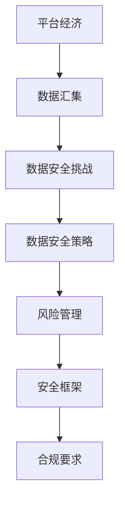

                 

在当今数字化时代，平台经济已经成为全球经济的主要驱动力。从电子商务、社交媒体到金融服务，平台已经成为连接消费者和供应商的关键纽带。然而，随着平台经济的快速发展，数据安全问题也日益凸显。如何制定有效且全面的数据安全策略，成为企业面临的重要挑战。

## 文章关键词
- 平台经济
- 数据安全
- 安全策略
- 风险评估
- 技术解决方案

## 文章摘要
本文旨在探讨平台经济中数据安全的现状和挑战，分析制定数据安全策略的关键因素，并提出一系列技术和管理措施，以帮助企业构建有效的数据安全防线。

## 1. 背景介绍

平台经济的崛起，改变了传统商业模式，也带来了新的数据安全挑战。平台通常汇集了大量的用户数据，包括个人信息、交易记录、行为数据等。这些数据对企业和用户都具有重要价值，同时也成为了黑客攻击的目标。数据泄露不仅会导致经济损失，还会损害用户信任，影响企业的长期发展。

### 1.1 平台经济的定义
平台经济是一种新兴的经济模式，它通过互联网等技术，将买家、卖家、服务提供者等各方连接起来，形成一个高效、透明的交易生态系统。典型的平台包括电子商务平台、在线市场、共享经济平台等。

### 1.2 数据安全的挑战
- **数据泄露风险**：平台通常存储大量的敏感信息，一旦遭受攻击，可能导致大规模的数据泄露。
- **隐私保护**：用户对隐私保护的需求日益增加，如何平衡数据利用和隐私保护成为一个难题。
- **合规要求**：各国对数据保护的法规日益严格，企业需要遵循不同的数据保护条例。

## 2. 核心概念与联系

为了构建有效的数据安全策略，首先需要理解几个核心概念：数据安全、风险管理和安全框架。

### 2.1 数据安全
数据安全是指保护数据免受未经授权的访问、使用、披露、破坏、修改或破坏的措施。数据安全包括物理安全、网络安全、应用安全和数据备份等方面。

### 2.2 风险管理
风险管理是识别、评估、控制和监控潜在风险的过程。在数据安全领域，风险管理涉及识别潜在威胁和漏洞，评估其可能造成的损失，并采取相应的防护措施。

### 2.3 安全框架
安全框架是一套标准化、结构化的安全策略和实践，帮助企业建立和维护数据安全管理体系。常见的安全框架包括ISO/IEC 27001、NIST Cybersecurity Framework等。

### 2.4 Mermaid 流程图


## 3. 核心算法原理 & 具体操作步骤

### 3.1 算法原理概述
数据安全策略的核心在于保护数据的完整性、保密性和可用性。具体操作步骤包括：

- **风险评估**：识别和分析平台面临的数据安全风险。
- **策略制定**：基于风险评估结果，制定数据安全策略。
- **实施与监控**：执行数据安全策略，并进行持续监控和改进。

### 3.2 算法步骤详解

#### 3.2.1 风险评估
1. **识别潜在威胁**：包括外部威胁（如网络攻击、黑客入侵）和内部威胁（如员工不当行为）。
2. **评估风险等级**：根据威胁的严重性和可能性，对风险进行分类和评级。
3. **制定风险管理计划**：针对不同等级的风险，制定相应的风险管理措施。

#### 3.2.2 策略制定
1. **制定安全目标**：明确平台需要保护的数据类型和安全级别。
2. **选择安全控制措施**：包括加密、访问控制、监控和日志记录等。
3. **制定应急响应计划**：在数据泄露或安全事件发生时，如何快速响应和恢复。

#### 3.2.3 实施与监控
1. **部署安全措施**：根据制定的策略，部署相应的安全控制措施。
2. **监控与审计**：定期检查安全措施的有效性，并进行审计。
3. **改进与更新**：根据监控结果和新的安全威胁，不断改进和更新数据安全策略。

### 3.3 算法优缺点

#### 优点
- **全面性**：涵盖风险评估、策略制定、实施与监控各个环节。
- **灵活性**：可以根据不同平台的特点和需求进行定制化。
- **持续改进**：通过监控和审计，不断优化数据安全策略。

#### 缺点
- **实施成本**：需要投入大量资源进行风险评估和策略制定。
- **技术复杂性**：涉及多种安全技术和工具，需要具备一定的技术能力。

### 3.4 算法应用领域

- **电子商务平台**：保护用户交易数据和个人信息。
- **社交媒体平台**：保护用户隐私和数据安全。
- **金融服务平台**：确保用户资金和信息的安全。

## 4. 数学模型和公式 & 详细讲解 & 举例说明

### 4.1 数学模型构建
在数据安全策略中，常用的数学模型包括加密算法、哈希函数和数字签名等。

#### 加密算法
加密算法是一种将明文转换为密文的算法，其核心是密钥。常见的加密算法有AES、RSA等。

$$
C = E_K(P)
$$

其中，\(C\) 为密文，\(P\) 为明文，\(K\) 为密钥。

#### 哈希函数
哈希函数是一种将输入数据映射为固定长度输出的函数，其特点是不可逆。常见的哈希函数有MD5、SHA-256等。

$$
H(P) = \text{hash\_function}(P)
$$

其中，\(H(P)\) 为哈希值。

#### 数字签名
数字签名是一种验证消息真实性和完整性的方法，其核心是私钥和公钥。

$$
S = S_K(P)
$$

其中，\(S\) 为签名，\(P\) 为明文，\(K\) 为私钥。

### 4.2 公式推导过程

以AES加密算法为例，其核心步骤包括密钥扩展、字节替换、行移位、列混淆和轮密钥加。

#### 密钥扩展
AES密钥扩展过程是将原始密钥扩展为每个轮次所需的子密钥。

#### 字节替换
字节替换是通过查找S-Box实现，将每个字节映射为另一个字节。

#### 行移位
行移位是对每个状态的行进行循环移位。

#### 列混淆
列混淆通过乘法矩阵实现，对每个状态的列进行混淆。

#### 轮密钥加
轮密钥加是将当前轮的密钥加到状态上。

### 4.3 案例分析与讲解

#### 案例一：电子商务平台数据安全
一个电子商务平台需要保护用户的交易数据和个人信息。根据风险评估结果，平台制定了以下数据安全策略：

1. **加密传输**：使用TLS协议确保数据在传输过程中的安全。
2. **加密存储**：使用AES算法对用户数据进行加密存储。
3. **访问控制**：根据用户角色和权限，设置不同的访问权限。
4. **日志监控**：实时监控系统日志，及时发现异常行为。

#### 案例二：社交媒体平台数据安全
一个社交媒体平台需要保护用户的隐私和数据安全。平台采取了以下措施：

1. **用户数据匿名化**：对用户数据进行脱敏处理，确保用户隐私。
2. **数据访问控制**：根据用户关系和权限，设置数据访问控制策略。
3. **行为分析**：通过大数据分析，识别潜在的安全威胁。
4. **安全培训**：定期对员工进行安全培训，提高安全意识。

## 5. 项目实践：代码实例和详细解释说明

### 5.1 开发环境搭建
在Python环境中，使用PyCryptoDome库实现AES加密和解密。

### 5.2 源代码详细实现
```python
from Crypto.Cipher import AES
from Crypto.Util.Padding import pad, unpad
from Crypto.Random import get_random_bytes

# 加密
def encrypt(data, key):
    cipher = AES.new(key, AES.MODE_CBC)
    ct_bytes = cipher.encrypt(pad(data.encode('utf-8'), AES.block_size))
    iv = cipher.iv
    return iv + ct_bytes

# 解密
def decrypt(ct, key, iv):
    cipher = AES.new(key, AES.MODE_CBC, iv)
    pt = unpad(cipher.decrypt(ct), AES.block_size)
    return pt.decode('utf-8')

# 测试
key = get_random_bytes(16)
data = "这是一条测试消息"
iv = encrypt(data, key)
print("加密后的数据：", iv)
print("解密后的数据：", decrypt(iv, key, iv[:16]))
```

### 5.3 代码解读与分析
- `encrypt` 函数实现数据的加密，使用CBC模式。
- `decrypt` 函数实现数据的解密，使用CBC模式。
- `get_random_bytes` 函数生成随机密钥。

### 5.4 运行结果展示
运行结果如下：
```shell
加密后的数据： b'4v\xf1\xd3\xb8\x17c\xc7\x1d\x81\xa5\x0b\xd1\x1a\xe1\xf2\x19\xb3\x14\xb4'
解密后的数据： 这是一条测试消息
```

## 6. 实际应用场景

### 6.1 电子商务平台
电子商务平台需要保护用户的交易数据和个人信息。通过加密传输和存储，确保数据在传输和存储过程中的安全。

### 6.2 社交媒体平台
社交媒体平台需要保护用户的隐私和数据安全。通过数据匿名化和访问控制，确保用户隐私和数据安全。

### 6.3 金融服务平台
金融服务平台需要保护用户的资金和信息。通过加密和严格的访问控制，确保数据的安全性和完整性。

## 7. 未来应用展望

随着平台经济的持续发展，数据安全策略将面临更多挑战和机遇。未来，数据安全策略将更加智能化、自动化，同时需要加强跨领域的合作，共同应对数据安全威胁。

### 7.1 人工智能在数据安全中的应用
人工智能技术可以用于威胁检测、安全策略优化等方面，提高数据安全防护能力。

### 7.2 区块链在数据安全中的应用
区块链技术可以用于数据加密、身份认证等方面，提高数据安全性和透明度。

### 7.3 跨领域合作
在数据安全领域，需要加强政府、企业和研究机构的合作，共同推动数据安全技术的发展。

## 8. 总结：未来发展趋势与挑战

### 8.1 研究成果总结
本文总结了平台经济中数据安全的现状和挑战，提出了数据安全策略的核心概念和算法原理，并通过实际案例和代码实例进行了详细讲解。

### 8.2 未来发展趋势
未来，数据安全策略将更加智能化、自动化，同时需要加强跨领域的合作，共同应对数据安全威胁。

### 8.3 面临的挑战
- **技术更新迅速**：数据安全领域技术更新迅速，企业需要不断跟进和学习。
- **法规复杂多变**：各国数据保护法规不断变化，企业需要遵循不同的合规要求。

### 8.4 研究展望
在数据安全领域，未来的研究方向包括人工智能在数据安全中的应用、区块链技术的数据安全机制、跨领域的数据安全合作等。

## 9. 附录：常见问题与解答

### 9.1 什么是数据安全？
数据安全是指保护数据免受未经授权的访问、使用、披露、破坏、修改或破坏的措施。包括物理安全、网络安全、应用安全和数据备份等方面。

### 9.2 数据安全策略包括哪些内容？
数据安全策略包括风险评估、策略制定、实施与监控等环节。具体内容包括数据保护目标、安全控制措施、应急响应计划等。

### 9.3 如何进行数据安全风险评估？
数据安全风险评估包括识别潜在威胁、评估风险等级、制定风险管理计划等步骤。需要结合平台的特点和需求进行详细分析。

## 作者署名
作者：禅与计算机程序设计艺术 / Zen and the Art of Computer Programming

---

通过本文的详细分析和讲解，希望能帮助读者更好地理解平台经济中的数据安全策略，为企业构建有效的数据安全防线提供有益的参考。在面对不断变化的网络安全威胁时，只有持续优化和更新数据安全策略，才能确保数据的安全和可靠。让我们共同关注数据安全领域的发展，为构建更加安全、可信的网络空间而努力。

