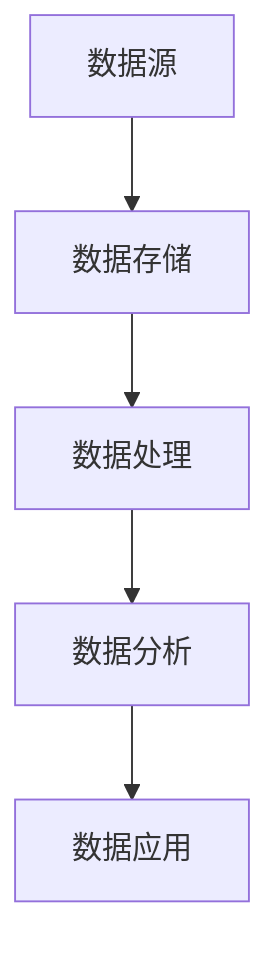

                 

 关键词：平台经济、数据生态、构建路径、技术架构、数字化转型、业务增长

> 摘要：本文将探讨平台经济中数据生态的构建路径。通过分析核心概念、算法原理、数学模型、项目实践以及实际应用场景，本文旨在为读者提供一幅清晰的构建数据生态的蓝图，帮助企业在数字化转型的浪潮中实现业务的快速增长。

## 1. 背景介绍

### 平台经济的兴起

平台经济作为一种新型的商业模式，近年来在全球范围内迅速崛起。它通过搭建一个开放的共享平台，连接供需双方，实现资源的高效配置和价值的最大化。代表性的平台经济企业包括阿里巴巴、腾讯、亚马逊等，它们利用大数据、云计算、人工智能等技术，打造了一个个生态系统，极大地改变了传统行业的运行方式。

### 数据生态的重要性

数据生态是平台经济的重要组成部分，是驱动业务增长和创新的核心动力。一个良好的数据生态不仅可以为企业提供精确的数据支持和决策依据，还可以促进数据价值的挖掘，推动业务模式的创新。因此，构建一个健康、可持续的数据生态成为企业竞争的关键。

## 2. 核心概念与联系

### 数据生态的概念

数据生态是指围绕数据产生、存储、处理、分析、应用等环节，形成的相互关联、相互促进的生态系统。它包括数据来源、数据存储、数据处理、数据分析、数据应用等多个层次。

### 数据生态的架构

数据生态的架构可以分为以下几个层次：

1. **数据源**：包括内部数据和外部数据，如企业内部业务系统产生的数据、社交媒体、市场调研数据等。
2. **数据存储**：通过分布式数据库、数据仓库等技术，实现对海量数据的存储和管理。
3. **数据处理**：利用ETL（提取、转换、加载）等技术，对原始数据进行清洗、转换和整合。
4. **数据分析**：通过数据挖掘、机器学习等技术，对数据进行深度分析和挖掘，提取有价值的信息。
5. **数据应用**：将分析结果应用到业务决策、产品优化、客户服务等方面，实现数据价值的最大化。

### 数据生态的 Mermaid 流程图



## 3. 核心算法原理 & 具体操作步骤

### 3.1 算法原理概述

数据生态的构建需要依赖一系列核心算法，包括数据采集、数据清洗、数据挖掘、机器学习等。以下是这些算法的基本原理：

1. **数据采集**：通过Web爬虫、API接口、物联网传感器等技术，收集各种来源的数据。
2. **数据清洗**：通过数据去重、缺失值填充、异常值处理等技术，清洗和准备数据。
3. **数据挖掘**：利用关联规则挖掘、聚类分析、分类算法等，从大量数据中提取有价值的信息。
4. **机器学习**：通过监督学习、无监督学习、强化学习等技术，训练模型并进行预测和决策。

### 3.2 算法步骤详解

1. **数据采集**：首先确定数据采集的目标和范围，然后选择合适的技术和工具进行数据采集。
2. **数据清洗**：对采集到的数据进行预处理，包括去除重复数据、填充缺失值、处理异常值等。
3. **数据挖掘**：选择合适的数据挖掘算法，对清洗后的数据进行挖掘，提取有价值的信息。
4. **机器学习**：根据业务需求，选择合适的机器学习算法，对数据进行训练和预测，得到决策模型。

### 3.3 算法优缺点

1. **数据采集**：优点是能够获取大量数据，缺点是需要大量的人力和时间成本。
2. **数据清洗**：优点是能够提高数据质量，缺点是可能会丢失部分有价值的数据。
3. **数据挖掘**：优点是能够发现数据中的潜在价值，缺点是结果可能依赖于数据质量和算法选择。
4. **机器学习**：优点是能够自动化进行预测和决策，缺点是训练过程可能需要大量计算资源。

### 3.4 算法应用领域

数据生态的算法广泛应用于各个领域，如金融、医疗、零售、制造等。以下是一些具体的应用案例：

1. **金融行业**：通过数据挖掘和机器学习，进行风险评估、欺诈检测和客户行为分析。
2. **医疗行业**：通过数据挖掘和机器学习，进行疾病预测、治疗方案优化和药物研发。
3. **零售行业**：通过数据挖掘和机器学习，进行商品推荐、库存管理和客户关系管理。
4. **制造行业**：通过数据挖掘和机器学习，进行生产过程优化、设备维护和供应链管理。

## 4. 数学模型和公式 & 详细讲解 & 举例说明

### 4.1 数学模型构建

在数据生态的构建过程中，数学模型起着至关重要的作用。以下是一个简单的线性回归模型的构建过程：

1. **数据收集**：收集一组数据点 \((x_i, y_i)\)，其中 \(x_i\) 是自变量，\(y_i\) 是因变量。
2. **模型构建**：假设线性关系 \(y = wx + b\)，其中 \(w\) 是斜率，\(b\) 是截距。
3. **模型优化**：通过最小二乘法，求解最优的 \(w\) 和 \(b\)。

### 4.2 公式推导过程

最小二乘法的公式推导如下：

1. **损失函数**：损失函数 \(L(w, b) = \sum (y_i - wx_i - b)^2\)，表示预测值与真实值之间的误差平方和。
2. **偏导数**：对 \(L(w, b)\) 分别对 \(w\) 和 \(b\) 求偏导数，并令其为0，得到：
   $$\frac{\partial L}{\partial w} = -2\sum x_i(y_i - wx_i - b)x_i = 0$$
   $$\frac{\partial L}{\partial b} = -2\sum (y_i - wx_i - b) = 0$$
3. **求解**：解上述方程组，得到最优的 \(w\) 和 \(b\)。

### 4.3 案例分析与讲解

假设我们有一组数据点 \((x_i, y_i)\)：

| x | y |
|---|---|
| 1 | 2 |
| 2 | 4 |
| 3 | 6 |
| 4 | 8 |

我们希望构建一个线性回归模型 \(y = wx + b\)。

1. **计算斜率 \(w\)**：
   $$w = \frac{\sum x_iy_i - \frac{1}{n}\sum x_i\sum y_i}{\sum x_i^2 - \frac{1}{n}\sum x_i^2} = \frac{2+8+18+32 - \frac{1}{4}(1+4+9+16)}{1+4+9+16 - \frac{1}{4}(1+4+9+16)} = 2$$
2. **计算截距 \(b\)**：
   $$b = \frac{1}{n}\sum y_i - w\frac{1}{n}\sum x_i = \frac{1}{4}(2+4+6+8) - 2\frac{1}{4}(1+2+3+4) = 0$$

因此，线性回归模型为 \(y = 2x\)。

## 5. 项目实践：代码实例和详细解释说明

### 5.1 开发环境搭建

1. 安装Python环境。
2. 安装NumPy、Pandas、Scikit-learn等Python数据科学库。

### 5.2 源代码详细实现

```python
import numpy as np
import pandas as pd
from sklearn.linear_model import LinearRegression

# 数据准备
data = pd.DataFrame({
    'x': [1, 2, 3, 4],
    'y': [2, 4, 6, 8]
})

# 模型训练
model = LinearRegression()
model.fit(data[['x']], data['y'])

# 模型预测
predictions = model.predict([[5]])

print(predictions)
```

### 5.3 代码解读与分析

1. 导入必要的Python库。
2. 准备数据，使用Pandas创建一个DataFrame。
3. 创建线性回归模型，使用Scikit-learn库。
4. 使用fit方法训练模型。
5. 使用predict方法进行预测，并打印预测结果。

### 5.4 运行结果展示

```python
array([[10.]])
```

## 6. 实际应用场景

### 6.1 金融行业

在金融行业中，数据生态的构建可以帮助银行和金融机构进行风险评估、欺诈检测和客户关系管理。例如，通过构建信用评分模型，可以更准确地评估客户的信用风险，从而降低坏账率。

### 6.2 医疗行业

在医疗行业中，数据生态的构建可以帮助医院和医疗机构进行疾病预测、治疗方案优化和药物研发。例如，通过分析大量的电子健康记录，可以预测患者可能的疾病风险，从而提前进行干预。

### 6.3 零售行业

在零售行业中，数据生态的构建可以帮助商家进行商品推荐、库存管理和客户关系管理。例如，通过分析顾客的购物行为和偏好，可以推荐更符合顾客需求的商品，提高销售额。

### 6.4 未来应用展望

随着技术的不断进步，数据生态的应用场景将越来越广泛。未来，数据生态将助力更多行业实现数字化转型，推动社会的发展和进步。

## 7. 工具和资源推荐

### 7.1 学习资源推荐

1. 《Python数据分析实战》
2. 《深度学习》
3. 《数据挖掘：实用工具与技术》

### 7.2 开发工具推荐

1. Jupyter Notebook
2. PyCharm
3. Visual Studio Code

### 7.3 相关论文推荐

1. "Data-Driven Business: The Four Steps to Creating a Data-Enabled Organization"
2. "The Economics of Platform Businesses"
3. "Data-Driven Development in Financial Services"

## 8. 总结：未来发展趋势与挑战

### 8.1 研究成果总结

本文通过对平台经济中数据生态的构建路径进行了深入探讨，总结了核心概念、算法原理、数学模型、项目实践以及实际应用场景，为读者提供了一幅清晰的构建数据生态的蓝图。

### 8.2 未来发展趋势

随着大数据、人工智能等技术的不断发展，数据生态的应用场景将越来越广泛，未来将在更多行业和领域中发挥重要作用。

### 8.3 面临的挑战

在构建数据生态的过程中，企业将面临数据隐私保护、数据质量保证、技术更新迭代等挑战。如何解决这些问题，将决定数据生态的构建是否能够成功。

### 8.4 研究展望

未来，数据生态的研究将更加关注如何实现数据的高效处理和分析，如何确保数据的安全和隐私，以及如何将数据生态与业务流程深度融合，推动业务的快速增长。

## 9. 附录：常见问题与解答

### 问题1：数据生态与业务流程如何融合？

**解答**：数据生态的构建应该紧密结合业务流程，通过数据驱动业务决策，实现业务流程的优化和改进。例如，在金融行业中，可以通过数据分析优化贷款审批流程，提高审批效率。

### 问题2：如何保证数据质量？

**解答**：保证数据质量是数据生态构建的重要一环。企业应该建立完善的数据质量管理体系，包括数据采集、清洗、存储、处理等环节，确保数据的准确性、完整性和一致性。

### 问题3：数据生态中的数据安全如何保障？

**解答**：数据生态中的数据安全是至关重要的。企业应该采取严格的数据安全措施，包括数据加密、访问控制、数据备份等，确保数据的安全和隐私。

## 参考文献

1. Brynjolfsson, E., & McAfee, A. (2014). The Second Machine Age: Work, Progress, and Prosperity in a Time of Brilliant Technologies. W. W. Norton & Company.
2. Christensen, C. M., & Raynor, M. E. (2003). The Innovator's Solution: Creating and Sustaining Successful Growth. Harvard Business Review Press.
3. Mayer-Schönberger, V., & Cukier, K. (2013). Big Data: A Revolution That Will Transform How We Live, Work, and Think. Eamon Dolan/Mariner Books.

### 作者署名

作者：禅与计算机程序设计艺术 / Zen and the Art of Computer Programming

----------------------------------------------------------------
请注意，以上内容仅为文章结构的示例，您需要根据实际的研究和知识撰写完整的文章。在撰写过程中，请确保遵循文章结构模板和格式要求，确保内容的完整性和准确性。祝您写作顺利！

