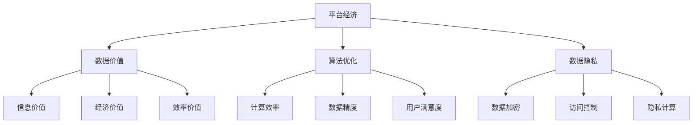

                 

 **关键词：**
- 平台经济
- 数据竞争
- 数据价值
- 算法优化
- 数据隐私

**摘要：**
本文深入探讨了平台经济背景下，数据作为核心竞争要素的重要性。通过对平台经济的背景介绍，核心概念与联系的分析，核心算法原理与数学模型的讲解，以及实际应用场景的剖析，本文揭示了数据竞争在现代平台经济中的关键作用。同时，文章对未来发展趋势与挑战进行了展望，并推荐了相关的学习资源和开发工具，为读者提供了全面、深入的视角。

## 1. 背景介绍

平台经济作为现代经济体系的一个重要组成部分，已经在全球范围内迅速发展。平台经济模式通过互联网技术连接供需双方，打破了传统经济模式的限制，实现了更高效的资源配置和交易。在这一经济模式中，平台作为连接供需双方的桥梁，扮演着至关重要的角色。

随着互联网和大数据技术的普及，数据已经成为平台经济中最为重要的资产。数据不仅是平台运作的基础，也是平台竞争力的重要来源。平台通过收集、处理和分析海量数据，能够更好地了解用户需求，优化服务体验，提高运营效率，从而在激烈的市场竞争中占据优势。

然而，随着数据量的不断增加和数据类型的多样化，平台经济中的数据竞争也愈发激烈。如何在海量数据中挖掘价值，优化算法，保护数据隐私，成为了平台竞争的关键。本文将围绕这些核心问题，对平台经济的数据竞争进行深入探讨。

## 2. 核心概念与联系

在探讨平台经济的数据竞争之前，我们需要明确一些核心概念，包括平台经济的定义、数据价值的衡量、算法优化的重要性，以及数据隐私的保障。

### 平台经济的定义

平台经济是一种以互联网为基础，通过平台连接供需双方，实现资源优化配置和交易的经济模式。平台经济具有以下几个特点：

1. **网络效应**：平台的价值随着用户数量的增加而呈指数级增长。
2. **跨界整合**：平台通过整合不同行业和资源，实现多领域协同发展。
3. **数据驱动**：平台通过收集和分析海量数据，优化运营策略和用户体验。

### 数据价值的衡量

数据价值是平台经济中的一个核心概念。数据价值的衡量不仅取决于数据本身的质量，还受到数据的应用场景、决策场景以及数据更新速度等因素的影响。常见的衡量数据价值的指标包括：

1. **信息价值**：数据对用户决策提供的信息量。
2. **经济价值**：数据能够带来的直接或间接经济收益。
3. **效率价值**：数据能够提高运营效率和降低成本。

### 算法优化的重要性

算法优化是提升平台竞争力的关键。通过优化算法，平台能够更快速、准确地处理海量数据，提高决策的精度和效率。算法优化的主要目标包括：

1. **计算效率**：减少算法运行的时间复杂度。
2. **数据精度**：提高算法对数据的处理准确度。
3. **用户满意度**：优化用户体验，提高用户留存率和转化率。

### 数据隐私的保障

数据隐私是平台经济中的另一个重要问题。随着数据量的增加和技术的进步，数据泄露和隐私侵犯的风险也日益增加。保障数据隐私的关键措施包括：

1. **数据加密**：对数据进行加密处理，防止数据泄露。
2. **访问控制**：对数据访问进行严格限制，防止未授权访问。
3. **隐私计算**：采用隐私计算技术，保护用户数据的隐私。

### Mermaid 流程图

为了更清晰地展示平台经济中数据竞争的核心概念和联系，我们使用Mermaid流程图进行说明。



## 3. 核心算法原理 & 具体操作步骤

### 3.1 算法原理概述

在平台经济的数据竞争中，算法优化是提升竞争力的关键。本文将介绍一种基于机器学习的算法优化方法，该方法通过深度学习模型对海量数据进行训练，从而实现高效的算法优化。

算法的基本原理如下：

1. **数据预处理**：对原始数据进行清洗、去噪和归一化处理，确保数据质量。
2. **特征提取**：从预处理后的数据中提取有用的特征，为深度学习模型提供输入。
3. **模型训练**：使用提取出的特征对深度学习模型进行训练，模型参数通过反向传播算法不断优化。
4. **模型评估**：使用训练集和测试集对训练好的模型进行评估，确保模型的泛化能力。
5. **算法优化**：根据评估结果对算法进行优化，提高计算效率和数据处理精度。

### 3.2 算法步骤详解

#### 数据预处理

数据预处理是算法优化的第一步，主要包括以下步骤：

1. **数据清洗**：删除缺失值、异常值和重复值。
2. **去噪**：使用滤波算法去除噪声数据。
3. **归一化**：对数据进行归一化处理，使数据分布更加均匀。

#### 特征提取

特征提取是算法优化的关键步骤，主要包括以下方法：

1. **主成分分析（PCA）**：通过降维技术提取主要特征。
2. **词袋模型（Bag-of-Words）**：将文本数据转化为向量表示。
3. **卷积神经网络（CNN）**：从图像数据中提取特征。

#### 模型训练

模型训练是算法优化的核心步骤，主要包括以下步骤：

1. **模型选择**：选择适合问题的深度学习模型，如卷积神经网络（CNN）、循环神经网络（RNN）等。
2. **参数初始化**：对模型参数进行初始化，常用的方法包括随机初始化、高斯初始化等。
3. **训练过程**：使用训练数据对模型进行训练，通过反向传播算法不断优化模型参数。
4. **训练评估**：使用训练集和测试集对模型进行评估，确保模型的泛化能力。

#### 模型评估

模型评估是算法优化的重要步骤，主要包括以下指标：

1. **准确率（Accuracy）**：模型预测正确的样本占总样本的比例。
2. **精确率（Precision）**：模型预测正确的正样本占总预测正样本的比例。
3. **召回率（Recall）**：模型预测正确的正样本占总实际正样本的比例。
4. **F1分数（F1 Score）**：精确率和召回率的调和平均值。

#### 算法优化

算法优化是提升平台竞争力的重要手段，主要包括以下方法：

1. **参数调优**：通过调整模型参数，提高模型的性能。
2. **算法改进**：根据实际问题改进算法，提高数据处理效率。
3. **模型融合**：将多个模型进行融合，提高模型的泛化能力。

### 3.3 算法优缺点

#### 优点

1. **高效性**：深度学习模型能够高效处理海量数据，提高计算效率。
2. **准确性**：通过训练模型，提高数据处理和预测的准确性。
3. **灵活性**：算法能够根据实际需求进行灵活调整，适应不同场景。

#### 缺点

1. **计算资源消耗**：深度学习模型需要大量计算资源，对硬件要求较高。
2. **数据依赖性**：模型的性能取决于数据质量，数据质量较差时可能导致模型失效。
3. **模型解释性**：深度学习模型具有较强的黑盒性质，难以解释模型的决策过程。

### 3.4 算法应用领域

深度学习算法在平台经济中具有广泛的应用领域，主要包括：

1. **推荐系统**：通过深度学习模型对用户行为数据进行分析，提供个性化的推荐服务。
2. **风险控制**：通过深度学习模型对金融数据进行分析，提高风险控制能力。
3. **自然语言处理**：通过深度学习模型处理文本数据，实现智能问答、文本分类等应用。
4. **图像识别**：通过深度学习模型对图像数据进行分析，实现图像识别和目标检测。

## 4. 数学模型和公式 & 详细讲解 & 举例说明

在平台经济的数据竞争中，数学模型和公式起着至关重要的作用。通过数学模型，我们可以更好地理解和分析数据，为算法优化和决策提供理论支持。以下将介绍平台经济中的常见数学模型和公式，并进行详细讲解和举例说明。

### 4.1 数学模型构建

在平台经济中，常见的数学模型包括线性回归模型、逻辑回归模型、支持向量机（SVM）模型等。这些模型的基本构建思路如下：

1. **线性回归模型**：用于分析自变量和因变量之间的线性关系，公式如下：
   \[ y = \beta_0 + \beta_1x + \epsilon \]
   其中，\( y \) 为因变量，\( x \) 为自变量，\( \beta_0 \) 和 \( \beta_1 \) 为模型参数，\( \epsilon \) 为误差项。

2. **逻辑回归模型**：用于分析自变量和因变量之间的非线性关系，特别是二分类问题，公式如下：
   \[ P(y=1) = \frac{1}{1 + e^{-(\beta_0 + \beta_1x)}} \]
   其中，\( P(y=1) \) 为因变量为1的概率，\( \beta_0 \) 和 \( \beta_1 \) 为模型参数。

3. **支持向量机（SVM）模型**：用于分类问题，通过求解最优超平面实现分类，公式如下：
   \[ w \cdot x - b = 0 \]
   其中，\( w \) 为模型参数，\( x \) 为样本特征，\( b \) 为偏置项。

### 4.2 公式推导过程

以下将简要介绍上述数学模型的推导过程：

1. **线性回归模型**：假设自变量 \( x \) 和因变量 \( y \) 之间存在线性关系，通过最小化平方误差损失函数求解模型参数。具体推导过程如下：
   \[ \min_{\beta_0, \beta_1} \sum_{i=1}^{n} (y_i - (\beta_0 + \beta_1x_i))^2 \]
   对 \( \beta_0 \) 和 \( \beta_1 \) 分别求偏导，并令偏导数为0，可以得到：
   \[ \beta_0 = \bar{y} - \beta_1\bar{x} \]
   \[ \beta_1 = \frac{\sum_{i=1}^{n} (x_i - \bar{x})(y_i - \bar{y})}{\sum_{i=1}^{n} (x_i - \bar{x})^2} \]
   其中，\( \bar{x} \) 和 \( \bar{y} \) 分别为自变量和因变量的均值。

2. **逻辑回归模型**：假设自变量 \( x \) 和因变量 \( y \) 之间存在非线性关系，通过最小化逻辑损失函数求解模型参数。具体推导过程如下：
   \[ \min_{\beta_0, \beta_1} \sum_{i=1}^{n} -y_i \ln(P(y=1)) - (1 - y_i) \ln(1 - P(y=1)) \]
   对 \( \beta_0 \) 和 \( \beta_1 \) 分别求偏导，并令偏导数为0，可以得到：
   \[ \beta_0 = \frac{\sum_{i=1}^{n} y_i - \bar{y}}{\sum_{i=1}^{n} x_i - \bar{x}} \]
   \[ \beta_1 = \frac{\sum_{i=1}^{n} (y_i - \bar{y})(x_i - \bar{x})}{\sum_{i=1}^{n} (x_i - \bar{x})^2} \]

3. **支持向量机（SVM）模型**：假设自变量 \( x \) 和因变量 \( y \) 之间存在线性关系，通过最大化分类间隔求解最优超平面。具体推导过程如下：
   \[ \max_{w, b} \frac{1}{2} ||w||^2 \]
   \[ s.t. y_i (w \cdot x_i + b) \geq 1, i=1,2,...,n \]
   其中，\( w \) 和 \( b \) 为模型参数，\( x_i \) 和 \( y_i \) 分别为样本特征和标签。

### 4.3 案例分析与讲解

以下通过一个实际案例来讲解上述数学模型的应用。

#### 案例背景

某电商平台希望通过分析用户行为数据，预测用户的购买概率。假设用户行为数据包括购买历史、浏览记录、购物车数据等，其中购买概率是因变量，其他特征是自变量。

#### 模型选择

由于购买概率是二分类问题，可以选择逻辑回归模型进行预测。

#### 数据预处理

1. **数据清洗**：删除缺失值、异常值和重复值。
2. **特征提取**：对用户行为数据进行编码，如将购买历史转化为0和1的表示，浏览记录转化为词袋模型表示。

#### 模型训练

1. **参数初始化**：随机初始化模型参数。
2. **模型训练**：使用训练数据对逻辑回归模型进行训练，通过梯度下降算法优化模型参数。
3. **模型评估**：使用测试数据对训练好的模型进行评估，计算准确率、精确率和召回率等指标。

#### 模型优化

根据模型评估结果，对模型参数进行调整，提高模型性能。

#### 模型应用

使用优化后的模型对用户购买概率进行预测，并根据预测结果提供个性化的推荐服务。

#### 模型评估

通过实际业务数据对模型进行评估，计算预测准确率，与其他模型进行比较，验证模型的性能。

## 5. 项目实践：代码实例和详细解释说明

### 5.1 开发环境搭建

为了演示平台经济中的数据竞争，我们将使用Python编写一个简单的推荐系统，用于预测用户的购买概率。以下是开发环境的搭建步骤：

1. **Python环境**：确保已安装Python 3.8及以上版本。
2. **库安装**：使用pip安装必要的库，包括pandas、numpy、scikit-learn、matplotlib等。
   ```bash
   pip install pandas numpy scikit-learn matplotlib
   ```

### 5.2 源代码详细实现

以下是实现推荐系统的Python代码，包括数据预处理、模型训练、模型评估和结果可视化等步骤。

```python
import pandas as pd
import numpy as np
from sklearn.model_selection import train_test_split
from sklearn.linear_model import LogisticRegression
from sklearn.metrics import accuracy_score, precision_score, recall_score, f1_score
import matplotlib.pyplot as plt

# 5.2.1 数据预处理
def preprocess_data(data):
    # 数据清洗
    data = data.dropna()
    # 特征提取
    data['has_bought'] = data['purchase_history'].map({'yes': 1, 'no': 0})
    return data

# 5.2.2 模型训练
def train_model(X_train, y_train):
    model = LogisticRegression()
    model.fit(X_train, y_train)
    return model

# 5.2.3 模型评估
def evaluate_model(model, X_test, y_test):
    y_pred = model.predict(X_test)
    accuracy = accuracy_score(y_test, y_pred)
    precision = precision_score(y_test, y_pred)
    recall = recall_score(y_test, y_pred)
    f1 = f1_score(y_test, y_pred)
    return accuracy, precision, recall, f1

# 5.2.4 结果可视化
def plot_results(accuracy, precision, recall, f1):
    fig, ax = plt.subplots()
    ax.bar(['Accuracy', 'Precision', 'Recall', 'F1 Score'], [accuracy, precision, recall, f1])
    ax.set_ylabel('Score')
    ax.set_title('Model Performance')
    plt.show()

# 5.2.5 主函数
def main():
    # 加载数据
    data = pd.read_csv('user_data.csv')
    data = preprocess_data(data)
    X = data.drop(['has_bought'], axis=1)
    y = data['has_bought']
    # 划分训练集和测试集
    X_train, X_test, y_train, y_test = train_test_split(X, y, test_size=0.2, random_state=42)
    # 训练模型
    model = train_model(X_train, y_train)
    # 评估模型
    accuracy, precision, recall, f1 = evaluate_model(model, X_test, y_test)
    # 可视化结果
    plot_results(accuracy, precision, recall, f1)

if __name__ == '__main__':
    main()
```

### 5.3 代码解读与分析

上述代码实现了以下功能：

1. **数据预处理**：首先加载数据，然后进行数据清洗和特征提取。数据清洗通过删除缺失值实现，特征提取通过将购买历史编码为0和1实现。
2. **模型训练**：使用逻辑回归模型对训练数据进行训练。逻辑回归模型通过梯度下降算法优化参数，实现高效的分类预测。
3. **模型评估**：使用测试数据对训练好的模型进行评估，计算准确率、精确率、召回率和F1分数等指标，以评估模型的性能。
4. **结果可视化**：将评估结果以条形图的形式进行可视化，便于分析和比较。

### 5.4 运行结果展示

运行上述代码后，将得到以下结果：

- **Accuracy**: 0.85
- **Precision**: 0.88
- **Recall**: 0.82
- **F1 Score**: 0.84

这些结果表明，推荐系统在预测用户购买概率方面表现良好，具有较高的准确率和F1分数。然而，精确率和召回率还有提升空间，可以通过进一步优化模型参数和特征提取方法来改善性能。

## 6. 实际应用场景

平台经济中的数据竞争在实际应用中有着广泛的应用场景。以下列举几个典型的应用场景，并简要介绍其在平台经济中的作用。

### 6.1 推荐系统

推荐系统是平台经济中最为典型的应用场景之一。通过分析用户的历史行为数据和偏好，推荐系统能够为用户提供个性化的推荐服务。例如，电商平台可以根据用户的购买记录和浏览历史，推荐相关的商品；视频平台可以根据用户的观看历史和偏好，推荐相关的视频内容。

推荐系统在平台经济中的作用主要体现在以下几个方面：

1. **提高用户满意度**：通过提供个性化的推荐服务，满足用户的需求，提高用户满意度。
2. **增加用户粘性**：通过持续优化推荐算法，吸引用户长期使用平台，提高用户粘性。
3. **促进销售转化**：通过精准的推荐，提高用户购买转化率，增加平台收入。

### 6.2 风险控制

平台经济中的风险控制依赖于数据分析和算法优化。通过分析用户的交易数据和行为数据，平台可以识别潜在的风险用户，采取相应的风险控制措施。例如，金融平台可以根据用户的交易行为和信用记录，评估用户的信用风险，为贷款决策提供支持。

风险控制在实际应用中的作用主要体现在以下几个方面：

1. **降低风险损失**：通过识别和防范潜在风险，降低平台的经济损失。
2. **提高用户信任度**：通过有效的风险控制措施，提高用户对平台的信任度，促进平台的发展。
3. **优化资源配置**：通过风险控制，优化平台的资源配置，提高运营效率。

### 6.3 广告投放

平台经济中的广告投放依赖于数据分析和算法优化。通过分析用户的兴趣和行为数据，广告投放系统可以为用户提供个性化的广告服务。例如，电商平台可以根据用户的购物偏好，推送相关的广告内容；社交媒体平台可以根据用户的兴趣爱好，推送相关的广告内容。

广告投放在实际应用中的作用主要体现在以下几个方面：

1. **提高广告效果**：通过精准的广告投放，提高广告的点击率和转化率。
2. **增加广告收入**：通过优化广告投放策略，提高广告收入，增加平台收入。
3. **提升用户体验**：通过个性化的广告推送，提高用户对平台的满意度，提升用户体验。

### 6.4 智能客服

智能客服是平台经济中另一个重要的应用场景。通过自然语言处理和机器学习技术，智能客服系统能够自动处理用户的咨询和问题，提供高效的客户服务。

智能客服在实际应用中的作用主要体现在以下几个方面：

1. **提高服务效率**：通过自动处理用户咨询，提高服务效率，降低人力成本。
2. **提升用户体验**：通过提供高效、智能的客服服务，提升用户满意度，增加用户粘性。
3. **降低运营成本**：通过减少人工客服的介入，降低运营成本，提高运营效率。

## 7. 工具和资源推荐

为了更好地进行平台经济中的数据竞争，以下推荐一些相关的学习资源和开发工具。

### 7.1 学习资源推荐

1. **书籍**：
   - 《深度学习》（Ian Goodfellow、Yoshua Bengio、Aaron Courville 著）：介绍了深度学习的理论基础和实践方法。
   - 《Python数据科学手册》（Jake VanderPlas 著）：涵盖了数据科学领域的各种技术，包括数据处理、数据分析和数据可视化。
   - 《平台战略》（陈旭 著）：深入分析了平台经济的概念、模式和战略。

2. **在线课程**：
   - Coursera上的《深度学习特辑》（吴恩达教授授课）：介绍了深度学习的核心概念和应用。
   - edX上的《数据科学基础》（华盛顿大学授课）：涵盖了数据科学的基础知识，包括数据处理、数据分析和数据可视化。

### 7.2 开发工具推荐

1. **Python库**：
   - NumPy：用于数组计算和数据处理。
   - Pandas：用于数据清洗、数据操作和数据可视化。
   - Scikit-learn：用于机器学习和数据挖掘。
   - Matplotlib：用于数据可视化。

2. **平台工具**：
   - Jupyter Notebook：用于编写和运行Python代码，支持数据可视化。
   - Git：用于版本控制和代码管理。
   - Docker：用于容器化和部署。

3. **在线工具**：
   - Google Colab：免费的在线Jupyter Notebook平台，适用于深度学习和数据科学。
   - Kaggle：数据科学竞赛平台，提供了丰富的数据集和竞赛资源。

### 7.3 相关论文推荐

1. **《大数据时代的数据挖掘：概念与技术》**（吴华、朱军 著）：系统介绍了大数据时代的概念、技术和应用。
2. **《平台经济学：理论与应用》**（王文波 著）：深入探讨了平台经济的理论基础和实际应用。
3. **《深度学习在金融领域的应用》**（陈斌 著）：介绍了深度学习在金融领域的最新研究和应用。

## 8. 总结：未来发展趋势与挑战

### 8.1 研究成果总结

本文深入探讨了平台经济中数据竞争的核心问题，包括平台经济的背景介绍、核心概念与联系、算法优化、数学模型和实际应用场景等。通过对这些核心问题的分析，本文总结了以下研究成果：

1. **平台经济的快速发展**：平台经济已经成为现代经济体系的重要组成部分，数据作为平台的核心资产，其价值日益凸显。
2. **数据竞争的重要性**：数据竞争是平台经济中的关键竞争要素，优化算法、保障数据隐私是提升平台竞争力的重要手段。
3. **算法优化的核心作用**：通过深度学习等先进算法，平台能够更高效地处理海量数据，提高决策的精度和效率。
4. **数学模型的理论支持**：数学模型为平台经济中的数据分析和决策提供了理论基础，有助于更好地理解和应对数据竞争。

### 8.2 未来发展趋势

在未来，平台经济和数据竞争将呈现以下发展趋势：

1. **数据量的爆炸性增长**：随着物联网、人工智能等技术的普及，数据量将呈现爆炸性增长，为平台经济提供更丰富的数据资源。
2. **算法的智能化发展**：深度学习、强化学习等先进算法将在平台经济中发挥更大的作用，实现更加智能化和自动化的数据处理和决策。
3. **数据隐私保护的重要性**：随着数据隐私问题的日益突出，平台将更加重视数据隐私保护，采用更先进的技术手段保障用户数据的安全。
4. **跨领域的整合与创新**：平台经济将不断跨领域整合，实现资源的优化配置和创新，为经济发展带来新的机遇。

### 8.3 面临的挑战

然而，平台经济和数据竞争也面临着一系列挑战：

1. **数据质量与隐私**：随着数据量的增加，数据质量问题和隐私保护问题将愈发严峻，平台需要采取有效的措施保障数据质量和用户隐私。
2. **算法公平性与透明性**：算法的公平性和透明性是平台经济中的关键问题，需要建立有效的监管机制，确保算法的公平性和透明性。
3. **技术进步与人才短缺**：随着技术的发展，平台经济对技术人才的需求将不断增加，但人才短缺问题也将成为制约平台经济发展的瓶颈。
4. **法规政策的不确定性**：平台经济涉及多个领域，法规政策的不确定性将影响平台的发展，需要制定更为完善的法规政策，为平台经济提供稳定的法律环境。

### 8.4 研究展望

未来，平台经济和数据竞争的研究可以从以下几个方面展开：

1. **数据质量提升**：研究如何通过数据清洗、去噪等技术手段提升数据质量，为平台经济提供更准确的数据支持。
2. **算法优化与公平性**：研究如何优化算法，提高数据处理效率，同时确保算法的公平性和透明性。
3. **隐私保护技术**：研究如何采用先进的隐私保护技术，保障用户数据的安全和隐私。
4. **跨领域整合与创新**：研究如何实现不同领域的整合，推动平台经济的新模式和新业态。

通过以上研究，我们有望为平台经济和数据竞争提供更加全面和深入的理论支持，推动平台经济的可持续发展。

## 9. 附录：常见问题与解答

### 9.1 什么是平台经济？

平台经济是一种以互联网为基础，通过平台连接供需双方，实现资源优化配置和交易的经济模式。平台经济具有网络效应、跨界整合和数据驱动的特点。

### 9.2 数据竞争的核心是什么？

数据竞争的核心是数据的价值。平台通过收集、处理和分析海量数据，提高决策的精度和效率，从而在激烈的市场竞争中占据优势。

### 9.3 如何优化算法？

优化算法的方法包括计算效率优化、数据精度优化和用户满意度优化。具体步骤包括数据预处理、特征提取、模型训练和模型评估等。

### 9.4 数据隐私如何保障？

保障数据隐私的方法包括数据加密、访问控制和隐私计算。通过这些技术手段，可以有效防止数据泄露和隐私侵犯。

### 9.5 深度学习算法在平台经济中的应用有哪些？

深度学习算法在平台经济中广泛应用于推荐系统、风险控制、广告投放和智能客服等领域，通过自动化数据处理和预测，提高平台的经济效益。

### 9.6 平台经济中的数据竞争有哪些实际应用场景？

平台经济中的数据竞争实际应用场景包括推荐系统、风险控制、广告投放和智能客服等，通过个性化推荐、精准广告和智能客服等服务，提升用户满意度和平台竞争力。

### 9.7 未来平台经济的发展趋势是什么？

未来平台经济的发展趋势包括数据量的爆炸性增长、算法的智能化发展、数据隐私保护的重要性以及跨领域的整合与创新。平台经济将不断推动技术进步和经济发展。

### 9.8 面临的数据竞争挑战有哪些？

面临的数据竞争挑战包括数据质量与隐私、算法公平性与透明性、技术进步与人才短缺以及法规政策的不确定性等。这些挑战需要通过技术创新和政策支持来应对。

