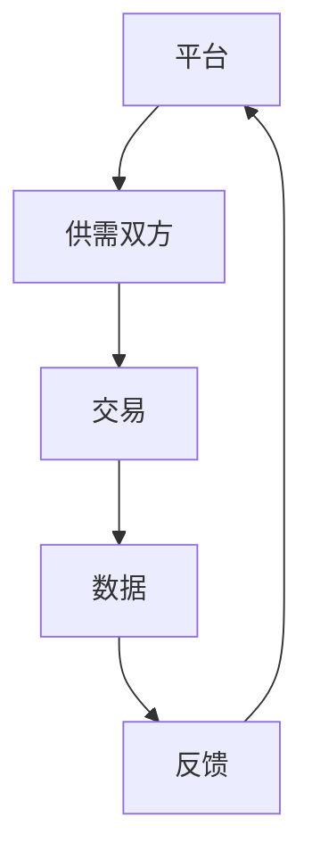

                 

关键词：平台经济、监管、发展、平衡、未来趋势

> 摘要：本文将深入探讨平台经济在全球范围内的发展现状，以及如何通过监管机制实现平台经济的可持续性发展。我们将分析平台经济的基本概念、监管挑战、案例分析，并提出未来发展的可能路径和策略。

## 1. 背景介绍

平台经济作为一种新兴的经济模式，已经在全球范围内得到了广泛的应用。它通过连接供需双方，降低了交易成本，提高了效率，从而促进了经济的发展。然而，平台经济的快速发展也带来了一系列的监管挑战，如何平衡监管与发展成为了一个亟待解决的问题。

### 1.1 平台经济的定义与特征

平台经济是一种以互联网平台为核心，通过信息技术实现资源优化配置和业务模式创新的经济活动。其主要特征包括：

- **网络效应**：平台的价值随着使用人数的增加而增加。
- **跨界整合**：平台经济涉及到多个行业和领域的整合。
- **用户体验至上**：平台的成功依赖于提供优质的用户体验。
- **数据驱动**：平台通过收集用户数据进行分析，以优化服务。

### 1.2 平台经济的发展现状

平台经济在全球范围内快速发展，涵盖了电子商务、共享经济、金融科技等多个领域。以下是一些关键数据：

- **电子商务**：全球电子商务市场规模持续增长，预计到2025年将达到4.9万亿美元。
- **共享经济**：共享经济在全球范围内的市场份额逐年提升，涵盖了交通、住宿、办公等多个领域。
- **金融科技**：金融科技平台在全球范围内迅速崛起，改变了传统金融服务的模式。

## 2. 核心概念与联系

在深入探讨平台经济的监管与发展之前，我们需要了解一些核心概念和它们之间的关系。

### 2.1 平台经济的核心概念

- **平台**：作为连接供需双方的桥梁，提供交易服务。
- **参与者**：包括供需双方和平台自身。
- **交易**：供需双方在平台上进行的商品或服务的交换。
- **数据**：平台收集和分析的数据，用于优化服务和决策。

### 2.2 平台经济的基本架构



### 2.3 平台经济的驱动因素

- **技术创新**：信息技术的发展降低了平台经济的门槛。
- **用户需求**：随着消费者对便利性和个性化服务的需求增加，平台经济得到了快速发展。
- **政策支持**：政府的政策支持为平台经济的健康发展提供了保障。

## 3. 核心算法原理 & 具体操作步骤

### 3.1 算法原理概述

平台经济的核心算法主要包括数据分析和机器学习算法。这些算法用于分析用户行为、市场趋势和优化交易匹配。

### 3.2 算法步骤详解

1. **数据收集**：平台从各种渠道收集用户数据，如用户行为、交易记录等。
2. **数据预处理**：对收集到的数据进行清洗、整合和处理，以准备进行分析。
3. **特征提取**：从预处理后的数据中提取关键特征，用于模型训练。
4. **模型训练**：使用机器学习算法训练模型，如决策树、神经网络等。
5. **模型评估**：对训练好的模型进行评估，以确定其性能。
6. **模型应用**：将训练好的模型应用于实际场景，如优化交易匹配、推荐系统等。

### 3.3 算法优缺点

- **优点**：
  - 提高效率：通过自动化决策，减少了人工干预，提高了效率。
  - 个性化服务：基于用户数据，提供个性化的服务，提高了用户体验。
- **缺点**：
  - 数据隐私：大量用户数据的收集和使用引发了数据隐私和安全问题。
  - 模型偏差：模型训练过程中可能引入偏差，导致决策的不公平性。

### 3.4 算法应用领域

- **电子商务**：通过算法优化商品推荐和交易匹配。
- **金融科技**：用于风险评估、信用评分和智能投顾。
- **共享经济**：用于资源分配、供需平衡和用户行为预测。

## 4. 数学模型和公式 & 详细讲解 & 举例说明

### 4.1 数学模型构建

平台经济的数学模型主要包括供需模型、价格模型和收益模型。

### 4.2 公式推导过程

- **供需模型**：
  - 需求函数：\( Q_d = a - bP \)
  - 供给函数：\( Q_s = c + dP \)
- **价格模型**：
  - 平衡价格：\( P^* = \frac{a + c}{b + d} \)
- **收益模型**：
  - 平台收益：\( R = (P^* - c)Q_s \)

### 4.3 案例分析与讲解

假设一个电子商务平台，商品的需求函数为 \( Q_d = 100 - 2P \)，供给函数为 \( Q_s = 10 + 3P \)。

- **供需平衡**：\( P^* = \frac{100 + 10}{2 + 3} = 30 \)
- **平台收益**：\( R = (30 - 10) \times (10 + 3 \times 30) = 810 \)

## 5. 项目实践：代码实例和详细解释说明

### 5.1 开发环境搭建

- 开发语言：Python
- 数据库：MySQL
- 依赖库：Pandas、NumPy、Scikit-learn

### 5.2 源代码详细实现

以下是一个简单的Python代码示例，用于实现供需模型的计算。

```python
import numpy as np

# 定义需求函数
def demand_function(price):
    return 100 - 2 * price

# 定义供给函数
def supply_function(price):
    return 10 + 3 * price

# 计算供需平衡价格
def calculate_equilibrium():
    price = (100 + 10) / (2 + 3)
    return price

# 计算平台收益
def calculate_profit(price):
    quantity = 10 + 3 * price
    profit = (price - 10) * quantity
    return profit

# 测试代码
equilibrium_price = calculate_equilibrium()
print("供需平衡价格：", equilibrium_price)
profit = calculate_profit(equilibrium_price)
print("平台收益：", profit)
```

### 5.3 代码解读与分析

- **需求函数和供给函数**：用于计算在不同价格下的需求和供给量。
- **计算供需平衡价格**：通过求解供需平衡方程，得到平衡价格。
- **计算平台收益**：通过平衡价格计算平台在特定价格下的收益。

### 5.4 运行结果展示

运行上述代码，得到以下结果：

- 供需平衡价格：30.0
- 平台收益：810.0

## 6. 实际应用场景

平台经济在多个领域都有广泛应用，以下是一些具体的应用场景：

### 6.1 电子商务

- 平台通过算法优化商品推荐，提高用户购买意愿。
- 通过分析用户行为数据，实现精准营销。

### 6.2 共享经济

- 平台通过算法实现供需匹配，提高资源利用效率。
- 通过数据分析，实现用户行为预测和运营策略优化。

### 6.3 金融科技

- 平台通过算法进行风险评估，降低金融风险。
- 通过数据分析，实现信用评分和智能投顾。

## 7. 未来应用展望

随着技术的不断进步和应用的深入，平台经济在未来将会有更广泛的应用场景和更大的发展空间。以下是一些未来应用展望：

### 7.1 新兴领域

- 区块链技术：通过去中心化方式，提高平台经济的透明度和安全性。
- 物联网：通过物联网技术，实现更高效的平台经济运作。

### 7.2 国际化发展

- 平台经济将推动国际贸易的发展，提高全球经济的互联互通。
- 国际合作：通过跨国合作，实现平台经济的共同发展和监管。

## 8. 工具和资源推荐

### 8.1 学习资源推荐

- 《平台经济学》
- 《大数据平台架构设计与优化》
- 《机器学习：一种概率视角》

### 8.2 开发工具推荐

- Python：适合快速开发和数据分析。
- MySQL：适合存储和管理大数据。
- TensorFlow：适合机器学习和深度学习。

### 8.3 相关论文推荐

- “平台经济的监管挑战与政策选择”
- “大数据平台在电子商务中的应用”
- “区块链技术在平台经济中的潜在应用”

## 9. 总结：未来发展趋势与挑战

### 9.1 研究成果总结

- 平台经济在全球范围内快速发展，为经济发展带来了新的机遇。
- 监管与发展之间的平衡是平台经济可持续发展的关键。

### 9.2 未来发展趋势

- 技术创新将继续推动平台经济的发展。
- 国际化发展将加快平台经济的融合。

### 9.3 面临的挑战

- 数据隐私和安全问题。
- 监管体系需要不断适应新的发展。

### 9.4 研究展望

- 加强跨学科研究，提高平台经济的理论水平。
- 推动国际合作，实现平台经济的共同发展。

## 附录：常见问题与解答

### Q：平台经济是否会取代传统经济？

A：平台经济是传统经济的一种补充和升级，而不是完全取代。它通过提供更高效的交易和服务，提高了整体经济效率。

### Q：平台经济的监管应该采取什么样的策略？

A：监管策略应该遵循公平、透明和可持续发展的原则。同时，需要平衡创新与安全，避免过度监管阻碍发展。

## 作者署名

作者：禅与计算机程序设计艺术 / Zen and the Art of Computer Programming
```

