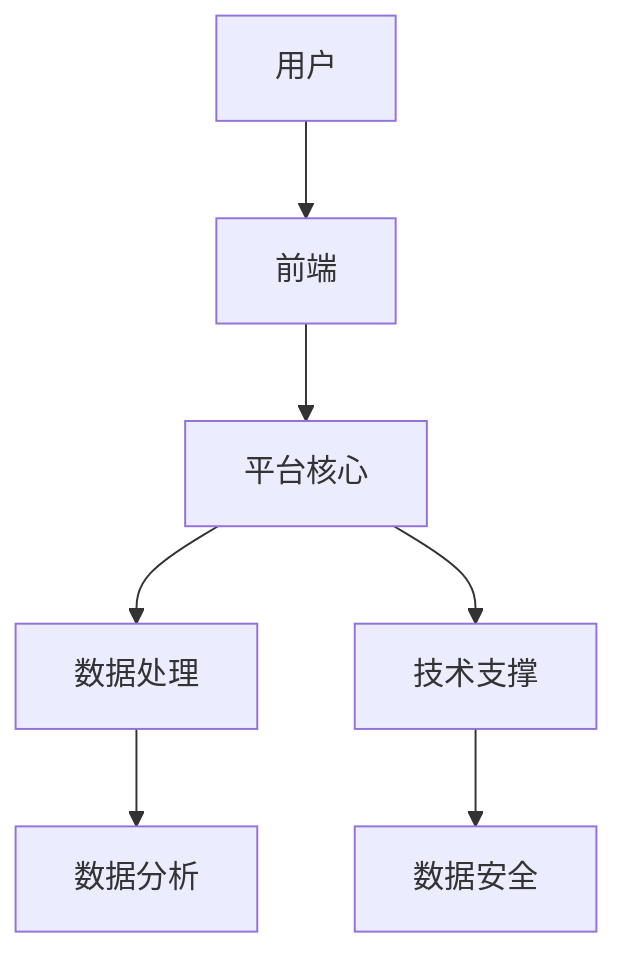

                 

关键词：平台经济、数字化、商业模式、技术发展、用户体验、可持续发展

> 摘要：本文探讨了平台经济的现状及其未来发展，分析了数字化浪潮对商业模式的影响，探讨了平台技术发展的趋势，以及如何通过优化用户体验和实现可持续发展来塑造平台经济的未来。本文旨在为企业和创业者提供有价值的洞见，以适应和引领这一不断变化的商业环境。

## 1. 背景介绍

### 平台经济的定义与现状

平台经济是指通过搭建中间平台，连接供需双方，实现资源共享和交易的一种新型商业模式。自互联网兴起以来，平台经济在全球范围内迅速发展，改变了传统商业的运行方式。

### 数字化浪潮的推动

随着大数据、云计算、人工智能等数字技术的迅猛发展，平台经济进入了新的发展阶段。数字化技术不仅提升了平台的运营效率，还拓展了商业模式的边界。

### 商业模式创新的挑战

在数字化浪潮的推动下，商业模式创新成为平台经济发展的重要驱动力。然而，创新也带来了新的挑战，如数据安全、隐私保护、市场垄断等问题。

## 2. 核心概念与联系

### 平台架构

平台经济的核心是平台架构，它包括前端用户体验、后端数据处理和技术支撑等关键组成部分。



### 用户体验

用户体验是平台经济的核心要素之一。优秀的用户体验能够提高用户粘性和忠诚度，进而推动平台的发展。

### 数据驱动

数据是平台经济的命脉。通过数据驱动，平台能够更精准地满足用户需求，优化运营策略，实现可持续发展。

### 技术支撑

技术是平台经济持续发展的基石。从云计算到人工智能，各种技术的进步为平台经济提供了无限可能。

## 3. 核心算法原理 & 具体操作步骤

### 算法原理概述

平台经济的核心算法主要涉及推荐系统、数据挖掘和机器学习等方面。

### 算法步骤详解

1. 用户行为数据采集：通过前端收集用户的行为数据，如浏览记录、购买历史等。
2. 数据清洗与预处理：对采集到的数据进行清洗和预处理，以提高数据质量。
3. 特征工程：提取关键特征，如用户兴趣、行为模式等。
4. 模型训练：使用机器学习算法，如协同过滤、深度学习等，对特征进行建模。
5. 推荐结果生成：根据训练好的模型，生成个性化的推荐结果。
6. 评估与优化：对推荐结果进行评估，并根据用户反馈进行优化。

### 算法优缺点

优点：提高用户满意度，提升平台活跃度，增强用户忠诚度。

缺点：数据隐私问题，模型复杂度高，可能产生冷启动问题。

### 算法应用领域

应用广泛，包括电子商务、社交媒体、内容推荐等领域。

## 4. 数学模型和公式 & 详细讲解 & 举例说明

### 数学模型构建

平台经济的数学模型主要涉及用户行为分析、推荐算法优化等方面。

### 公式推导过程

$$
R(u, i) = f(u, i) + e(u, i)
$$

其中，$R(u, i)$表示用户$u$对项目$i$的推荐分数，$f(u, i)$表示基于特征的用户和项目相似度，$e(u, i)$表示误差项。

### 案例分析与讲解

以电子商务平台为例，通过分析用户购买历史，为用户提供个性化的商品推荐。

## 5. 项目实践：代码实例和详细解释说明

### 开发环境搭建

环境：Python 3.8，Scikit-learn，Numpy

### 源代码详细实现

```python
from sklearn.metrics.pairwise import cosine_similarity
from sklearn.model_selection import train_test_split
import numpy as np

# 数据预处理
def preprocess_data(data):
    # 数据清洗和特征提取
    pass

# 协同过滤算法
def collaborative_filter(data, user_id):
    # 计算用户和项目的相似度
    # 生成推荐结果
    pass

# 主函数
def main():
    # 读取数据
    # 预处理数据
    # 训练模型
    # 生成推荐结果
    pass

if __name__ == "__main__":
    main()
```

### 代码解读与分析

代码主要分为数据预处理、协同过滤算法和主函数三个部分。

### 运行结果展示

运行代码后，将得到个性化的商品推荐结果，并根据用户反馈进行优化。

## 6. 实际应用场景

### 社交媒体

通过推荐算法，为用户提供个性化的内容推荐，提高用户活跃度和粘性。

### 电子商务

通过用户行为分析，为用户提供个性化的商品推荐，提升销售额。

### 内容平台

通过推荐算法，为用户提供个性化的内容推荐，提高用户满意度和留存率。

## 7. 未来应用展望

### 新兴领域

随着技术的不断发展，平台经济将在更多新兴领域得到应用，如物联网、区块链等。

### 跨界融合

平台经济与其他行业的融合将创造新的商业模式和增长点。

### 社会责任

平台经济将越来越注重社会责任，如数据隐私保护、环境保护等。

## 8. 工具和资源推荐

### 学习资源推荐

- 《平台战略：构建竞争优势的新范式》
- 《数据科学实战》

### 开发工具推荐

- Jupyter Notebook
- PyCharm

### 相关论文推荐

- 《基于协同过滤的推荐系统》
- 《大数据时代下的平台经济发展》

## 9. 总结：未来发展趋势与挑战

### 研究成果总结

平台经济在数字化浪潮的推动下，呈现出蓬勃发展的态势。通过推荐系统、数据挖掘等技术手段，平台经济实现了商业模式的创新和用户需求的精准满足。

### 未来发展趋势

- 技术驱动：随着人工智能、大数据等技术的进步，平台经济将实现更高效、更智能的发展。
- 跨界融合：平台经济将与其他行业深度融合，创造新的商业模式和价值。
- 社会责任：平台经济将越来越注重社会责任，如数据隐私保护、环境保护等。

### 面临的挑战

- 数据安全与隐私：在数字化时代，数据安全和隐私保护成为平台经济发展的重要挑战。
- 市场竞争：随着平台经济的快速发展，市场竞争将日益激烈。
- 法律法规：平台经济需要遵守相关法律法规，如反垄断法等。

### 研究展望

未来，平台经济将在技术创新、商业模式创新和社会责任等方面继续取得突破，为经济发展和社会进步做出更大贡献。

## 10. 附录：常见问题与解答

### 问题1：平台经济是否会导致市场垄断？

解答：平台经济确实可能引发市场垄断问题，但通过合理的监管和市场竞争，可以缓解这一问题。

### 问题2：平台经济的可持续发展如何实现？

解答：平台经济的可持续发展需要关注数据安全、环境保护等方面，同时通过技术创新和商业模式创新来提升竞争力。

作者：禅与计算机程序设计艺术 / Zen and the Art of Computer Programming
----------------------------------------------------------------

文章撰写完毕，接下来我们将对文章进行审阅和修改，确保内容完整、结构清晰、语言准确。请等待下一步指示。

