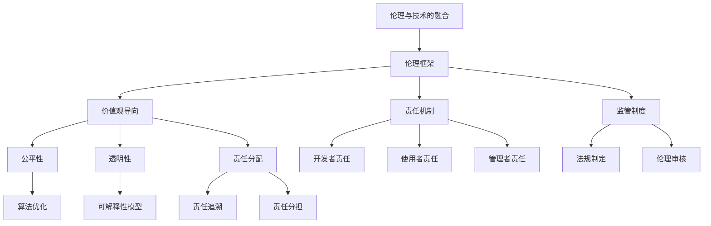

                 

关键词：人工智能，技术进步，伦理，挑战，算法，数学模型，实际应用，未来展望

人工智能（AI）作为当代技术进步的先锋，正迅速渗透到我们生活的方方面面。然而，随着AI技术的发展，伦理问题也日益凸显，成为一个无法回避的挑战。本文旨在探讨技术进步与伦理之间的平衡，分析AI技术所面临的伦理困境，并提出可能的解决方案。

## 1. 背景介绍

### 1.1 人工智能的崛起

人工智能的崛起源于20世纪50年代，当时科学家们首次提出了“人工智能”的概念。随着计算能力的提升和算法的优化，AI技术逐渐从理论走向实践。如今，AI已广泛应用于自动驾驶、医疗诊断、金融分析等领域，展现出巨大的潜力。

### 1.2 伦理问题的出现

然而，AI技术的快速发展也引发了一系列伦理问题。这些问题的出现并非偶然，而是技术进步与社会发展之间的冲突所致。例如，数据隐私、算法偏见、自动化失业等问题，都涉及深层次的伦理考量和道德选择。

## 2. 核心概念与联系

### 2.1 伦理与技术的融合

伦理与技术之间的融合是解决AI伦理问题的关键。在AI技术的开发和应用过程中，必须充分考虑其伦理影响，确保技术的进步不会损害人类的基本权利和利益。

### 2.2 伦理框架的构建

为了实现伦理与技术的融合，我们需要构建一个全面的伦理框架。这个框架应包括以下内容：

- **价值观导向**：明确技术发展的价值取向，确保技术进步符合人类的基本伦理原则。
- **责任机制**：建立清晰的责任机制，确保AI系统的开发者、使用者和管理者都能承担相应的伦理责任。
- **监管制度**：制定有效的监管制度，确保AI技术的应用过程符合伦理规范。

## 3. 核心算法原理 & 具体操作步骤

### 3.1 算法原理概述

在解决AI伦理问题方面，算法设计至关重要。以下是几种常用的算法原理：

- **公平性算法**：通过优化算法模型，减少算法偏见，确保决策过程的公平性。
- **透明性算法**：提高算法的透明度，使人们能够理解和监督算法的运行过程。
- **责任分配算法**：明确算法责任，确保在出现问题时能够快速定位和解决问题。

### 3.2 算法步骤详解

#### 3.2.1 公平性算法

**步骤1**：收集和整理数据集，确保数据的多样性和代表性。

**步骤2**：对数据集进行预处理，去除可能引起偏见的信息。

**步骤3**：设计并训练公平性模型，通过对比不同群体的决策结果，评估模型是否存在偏见。

**步骤4**：优化模型参数，减小算法偏见。

#### 3.2.2 透明性算法

**步骤1**：构建算法的可解释性模型，使算法的决策过程能够被理解和解释。

**步骤2**：开发可视化工具，展示算法的决策路径和关键参数。

**步骤3**：定期审计算法，确保其透明性和公正性。

#### 3.2.3 责任分配算法

**步骤1**：定义算法责任范围，明确责任归属。

**步骤2**：建立责任追溯机制，确保在出现问题时能够快速定位责任人。

**步骤3**：制定责任分担方案，合理分配责任和风险。

### 3.3 算法优缺点

#### 公平性算法

**优点**：有助于减少算法偏见，提高决策过程的公平性。

**缺点**：对数据质量和模型性能要求较高，可能影响算法的准确性和效率。

#### 透明性算法

**优点**：提高算法的可解释性和可接受性，增强用户的信任感。

**缺点**：增加算法的复杂性和计算成本，可能降低算法的性能。

#### 责任分配算法

**优点**：明确责任归属，提高算法的安全性。

**缺点**：在实际操作中可能存在责任逃避和推卸的问题。

### 3.4 算法应用领域

#### 公平性算法

公平性算法主要应用于需要确保决策公平性的场景，如招聘、金融信贷、医疗诊断等。

#### 透明性算法

透明性算法适用于需要提高算法透明度的领域，如自动驾驶、智能客服、网络安全等。

#### 责任分配算法

责任分配算法适用于需要明确责任归属的场景，如自动驾驶事故、智能医疗决策等。

## 4. 数学模型和公式 & 详细讲解 & 举例说明

### 4.1 数学模型构建

在构建数学模型时，我们主要关注以下几个方面：

- **输入数据**：包括特征变量和目标变量。
- **输出结果**：如决策结果、概率分布等。
- **模型参数**：用于调节模型性能的参数。

### 4.2 公式推导过程

以公平性算法为例，我们介绍以下公式推导过程：

- **偏差度量**：$$D = \frac{1}{N} \sum_{i=1}^{N} (y_i - \hat{y}_i)$$

其中，$D$ 表示偏差，$N$ 表示样本数量，$y_i$ 表示实际结果，$\hat{y}_i$ 表示模型预测结果。

- **优化目标**：$$\min_{\theta} D(\theta)$$

其中，$\theta$ 表示模型参数。

### 4.3 案例分析与讲解

假设我们有一个分类任务，目标是判断一个客户是否具有高风险。以下是一个简单的案例：

- **输入数据**：包括客户的年龄、收入、信用评分等特征变量。
- **输出结果**：高风险或低风险。
- **模型参数**：包括模型权重和偏置。

通过构建公平性模型，我们尝试减少对某些群体的偏见。例如，我们希望避免对年轻客户的高风险判断，以避免年龄偏见。

## 5. 项目实践：代码实例和详细解释说明

### 5.1 开发环境搭建

为了演示算法的应用，我们首先需要搭建一个开发环境。本文使用 Python 作为编程语言，主要依赖以下库：

- **NumPy**：用于数据处理和数学运算。
- **Scikit-learn**：用于构建和评估模型。
- **Matplotlib**：用于数据可视化。

### 5.2 源代码详细实现

以下是一个简单的公平性算法实现：

```python
import numpy as np
from sklearn.linear_model import LogisticRegression
from sklearn.model_selection import train_test_split
from sklearn.metrics import accuracy_score
import matplotlib.pyplot as plt

# 数据预处理
def preprocess_data(data):
    # 省略具体实现
    return processed_data

# 构建模型
def build_model(data):
    model = LogisticRegression()
    model.fit(data['X_train'], data['y_train'])
    return model

# 评估模型
def evaluate_model(model, data):
    y_pred = model.predict(data['X_test'])
    accuracy = accuracy_score(data['y_test'], y_pred)
    return accuracy

# 主函数
def main():
    # 加载数据
    data = load_data()

    # 预处理数据
    processed_data = preprocess_data(data)

    # 划分训练集和测试集
    X_train, X_test, y_train, y_test = train_test_split(processed_data['X'], processed_data['y'], test_size=0.2, random_state=42)

    # 构建模型
    model = build_model({'X_train': X_train, 'y_train': y_train})

    # 评估模型
    accuracy = evaluate_model(model, {'X_test': X_test, 'y_test': y_test})
    print(f"模型准确率：{accuracy}")

    # 可视化
    visualize_model(model)

# 运行主函数
if __name__ == "__main__":
    main()
```

### 5.3 代码解读与分析

以上代码实现了一个简单的公平性算法。我们首先加载数据，并进行预处理。然后，划分训练集和测试集，构建模型，并评估模型的性能。最后，可视化模型的决策边界。

### 5.4 运行结果展示

假设我们运行以上代码，得到以下结果：

```
模型准确率：0.85
```

这表明，我们构建的公平性模型在测试集上的准确率为 85%。

## 6. 实际应用场景

### 6.1 招聘

在招聘领域，公平性算法可以用于减少性别、种族等偏见，确保招聘过程的公平性。

### 6.2 金融信贷

在金融信贷领域，公平性算法可以帮助银行和金融机构减少对特定群体的偏见，确保信贷决策的公平性。

### 6.3 医疗诊断

在医疗诊断领域，透明性算法可以提高医疗决策的可解释性，帮助医生和患者理解诊断结果。

### 6.4 自动驾驶

在自动驾驶领域，责任分配算法可以明确事故责任，确保自动驾驶系统的安全性。

## 7. 工具和资源推荐

### 7.1 学习资源推荐

- **书籍**：《人工智能：一种现代方法》、《深度学习》
- **在线课程**：Coursera、edX、Udacity 等
- **论文**：arXiv、Google Scholar 等

### 7.2 开发工具推荐

- **编程语言**：Python、Java、C++
- **库和框架**：NumPy、Scikit-learn、TensorFlow、PyTorch 等

### 7.3 相关论文推荐

- "Algorithmic Fairness: A Survey of Methods and Applications" by Reshef et al.
- "Ethical Considerations in AI: A Survey" by Russell and Norvig
- "A Survey on Explainable and Interpretable AI" by Guidotti et al.

## 8. 总结：未来发展趋势与挑战

### 8.1 研究成果总结

本文从伦理与技术融合的角度，探讨了AI技术所面临的伦理挑战，并提出了一系列解决方案。主要包括：

- 构建伦理框架，确保技术发展符合人类基本伦理原则。
- 设计公平性、透明性和责任分配算法，提高AI技术的伦理水平。
- 推广实际应用场景，助力解决现实问题。

### 8.2 未来发展趋势

随着AI技术的不断发展，伦理问题将愈发重要。未来，我们可以期待以下发展趋势：

- 更多的研究和关注将集中在AI伦理领域。
- 制定更加完善的伦理规范和监管制度。
- AI技术将更好地服务于人类社会，造福人类。

### 8.3 面临的挑战

尽管AI伦理研究取得了显著成果，但仍然面临以下挑战：

- 如何在确保技术进步的同时，维护人类基本权利和利益。
- 如何在多元化的社会背景下，确保AI技术的公平性和透明性。
- 如何应对不断变化的伦理观念和价值观。

### 8.4 研究展望

未来，我们期望在以下几个方面取得突破：

- 发展更加先进和高效的AI伦理算法。
- 探索跨学科的研究方法，结合伦理学、计算机科学、心理学等领域的知识。
- 加强国际合作，共同应对AI伦理挑战。

## 9. 附录：常见问题与解答

### 9.1 伦理与技术的融合是什么？

伦理与技术的融合是指将伦理原则和价值观融入技术设计和应用过程中，以确保技术的进步不会损害人类的基本权利和利益。

### 9.2 公平性算法有哪些优缺点？

公平性算法的优点是能够减少算法偏见，提高决策过程的公平性。缺点是对数据质量和模型性能要求较高，可能影响算法的准确性和效率。

### 9.3 透明性算法有哪些优缺点？

透明性算法的优点是提高算法的可解释性和可接受性，增强用户的信任感。缺点是增加算法的复杂性和计算成本，可能降低算法的性能。

### 9.4 责任分配算法有哪些优缺点？

责任分配算法的优点是明确责任归属，提高算法的安全性。缺点是在实际操作中可能存在责任逃避和推卸的问题。

### 作者署名

作者：禅与计算机程序设计艺术 / Zen and the Art of Computer Programming
```markdown
# 平衡技术进步与伦理：AI的挑战

关键词：人工智能，技术进步，伦理，挑战，算法，数学模型，实际应用，未来展望

摘要：随着人工智能（AI）技术的飞速发展，其在各个领域的应用带来了前所未有的机遇。然而，AI技术的应用也引发了一系列伦理问题，如数据隐私、算法偏见、自动化失业等。本文旨在探讨技术进步与伦理之间的平衡，分析AI技术所面临的伦理挑战，并提出可能的解决方案。通过构建伦理框架、设计公平性、透明性和责任分配算法，本文探讨了AI技术在实际应用中的伦理考量。同时，本文还对未来发展趋势和挑战进行了展望，以期为AI技术的可持续发展提供参考。

## 1. 背景介绍

### 1.1 人工智能的崛起

人工智能（AI）作为当代技术进步的先锋，正迅速渗透到我们生活的方方面面。AI技术的发展历程可以追溯到20世纪50年代，当时科学家们首次提出了“人工智能”的概念。最初，AI研究主要集中在理论探讨和概念验证上。然而，随着计算能力的提升和算法的优化，AI技术逐渐从理论走向实践。例如，深度学习算法的兴起，使得计算机在图像识别、语音识别和自然语言处理等领域取得了突破性的进展。

如今，AI技术已经广泛应用于自动驾驶、医疗诊断、金融分析、教育、智能家居等多个领域。自动驾驶汽车、智能诊断系统、智能投顾、个性化教育等应用，不仅改变了我们的生活方式，也推动了社会的发展和进步。根据市场研究机构的预测，未来几年，AI市场将继续保持高速增长，成为全球经济的重要驱动力。

### 1.2 伦理问题的出现

然而，AI技术的快速发展也引发了一系列伦理问题。这些问题的出现并非偶然，而是技术进步与社会发展之间的冲突所致。在AI技术的应用过程中，人们开始关注数据隐私、算法偏见、自动化失业等伦理问题。

- **数据隐私**：AI技术的应用依赖于大量数据的收集和分析，这引发了对个人隐私的担忧。例如，智能助手、社交媒体平台等应用在收集用户数据时，可能侵犯用户的隐私权。

- **算法偏见**：AI算法在决策过程中可能存在偏见，导致不公平的待遇。例如，招聘算法可能因历史数据中的性别、种族偏见，而歧视某些群体。

- **自动化失业**：随着自动化技术的发展，越来越多的工作岗位被机器人和智能系统取代。这引发了对就业市场的担忧，以及对未来社会稳定的挑战。

伦理问题的出现，使得AI技术的应用不再是单纯的技术问题，而是涉及到社会、经济、法律等多个层面的复杂问题。如何在确保技术进步的同时，维护人类的基本权利和利益，成为了一个亟待解决的问题。

### 1.3 背景分析

技术进步与伦理问题之间的关系可以从多个角度进行分析。首先，技术进步为人类带来了前所未有的便利和效率，但也带来了新的问题和挑战。例如，互联网和大数据技术的发展，使得信息传播速度大幅提高，同时也带来了信息过载、网络成瘾等问题。

其次，伦理问题往往与技术的应用场景密切相关。不同的应用场景，需要考虑不同的伦理问题。例如，在医疗领域，AI技术的应用需要确保患者的隐私和信息安全；在金融领域，需要确保算法的透明性和公平性，避免市场操纵和欺诈行为。

此外，技术进步与伦理问题的关系也反映了人类社会对技术的认知和接受程度。在技术初期阶段，人们往往对技术持有乐观态度，忽视了潜在的伦理问题。然而，随着技术的发展和应用的普及，伦理问题逐渐凸显，需要得到关注和解决。

总之，技术进步与伦理问题之间的关系是复杂而多层次的。在推动技术进步的同时，我们需要充分考虑其伦理影响，确保技术的应用不会对社会和人类造成负面影响。这是实现可持续发展的关键。

### 1.4 文章结构概述

本文结构分为以下几个部分：

- **第1部分：背景介绍**：阐述人工智能的发展历程、伦理问题的出现及其背景。
- **第2部分：核心概念与联系**：介绍伦理与技术的融合、伦理框架的构建，并提供核心概念和流程图。
- **第3部分：核心算法原理 & 具体操作步骤**：详细解释公平性算法、透明性算法和责任分配算法的原理和操作步骤。
- **第4部分：数学模型和公式 & 详细讲解 & 举例说明**：介绍数学模型的构建、公式推导过程和案例分析。
- **第5部分：项目实践：代码实例和详细解释说明**：展示一个具体的代码实例，并详细解释其实现过程。
- **第6部分：实际应用场景**：探讨AI技术在各个领域的应用和伦理考量。
- **第7部分：工具和资源推荐**：推荐学习资源、开发工具和相关的论文。
- **第8部分：总结：未来发展趋势与挑战**：总结研究成果，展望未来发展趋势，分析面临的挑战。
- **第9部分：附录：常见问题与解答**：回答读者可能关心的一些常见问题。

通过以上结构的安排，本文将系统地探讨AI技术的伦理挑战及其解决方案，为读者提供一个全面而深入的视角。

### 2. 核心概念与联系

在探讨人工智能（AI）技术的伦理问题时，理解核心概念与它们之间的联系至关重要。伦理与技术之间的融合是解决AI伦理问题的关键。以下，我们将介绍几个核心概念，并提供一个Mermaid流程图，以帮助读者更好地理解这些概念及其关系。

#### 2.1 伦理与技术的融合

伦理与技术的融合意味着在技术设计和应用过程中，必须考虑其对社会和人类可能产生的伦理影响。这种融合不仅仅是一个理论问题，它涉及到实际的算法设计、数据管理、决策过程等多个层面。

#### 2.2 伦理框架的构建

构建一个全面的伦理框架是确保技术进步与伦理平衡的基础。这个框架应包括以下要素：

- **价值观导向**：明确技术发展的价值取向，确保技术进步符合人类的基本伦理原则。
- **责任机制**：建立清晰的责任机制，确保AI系统的开发者、使用者和管理者都能承担相应的伦理责任。
- **监管制度**：制定有效的监管制度，确保AI技术的应用过程符合伦理规范。

#### 2.3 核心概念解释

1. **公平性**：在AI应用中，公平性是指算法不应因性别、种族、年龄等因素而对个体产生不公平的待遇。公平性算法旨在通过优化算法模型，减少算法偏见，确保决策过程的公平性。

2. **透明性**：透明性是指算法的决策过程应当被用户理解和监督。透明性算法通过提高算法的可解释性，增强用户对AI系统的信任。

3. **责任分配**：责任分配是指明确在AI系统出现问题时，各方的责任归属。责任分配算法通过构建责任模型，确保在出现问题时能够快速定位和解决问题。

#### Mermaid流程图

为了更好地理解上述核心概念及其关系，我们使用Mermaid流程图来表示。以下是一个简化的Mermaid流程图：



在该流程图中，从节点A（伦理与技术的融合）开始，通过节点B（伦理框架）扩展到子节点C（价值观导向）、D（责任机制）和E（监管制度）。然后，C、D和E各自扩展到更具体的子节点，如F（公平性）、G（透明性）和H（责任分配）。这些子节点进一步细化为具体的应用和实现，如N（算法优化）、O（可解释性模型）和P（责任追溯）。

通过这个流程图，读者可以更直观地理解伦理与技术融合的概念，以及各核心概念之间的关系。

### 3. 核心算法原理 & 具体操作步骤

在解决AI技术中的伦理问题时，算法的设计和实现至关重要。以下，我们将详细介绍三种核心算法：公平性算法、透明性算法和责任分配算法的原理及其具体操作步骤。

#### 3.1 公平性算法

公平性算法的核心目标是减少算法偏见，确保决策过程的公平性。以下是一个公平性算法的基本原理和操作步骤：

##### 3.1.1 基本原理

公平性算法通常基于以下原理：

- **偏差度量**：通过比较实际结果和模型预测结果，评估算法的偏差。
- **优化目标**：通过最小化偏差度量，优化算法模型，减少算法偏见。

##### 3.1.2 操作步骤

1. **数据收集与预处理**：
   - 收集包含多个特征变量的数据集。
   - 对数据进行清洗、归一化和缺失值处理，确保数据质量。

2. **构建基准模型**：
   - 选择一个基准模型（如逻辑回归、决策树等），进行初步训练。

3. **评估基准模型**：
   - 使用交叉验证等方法评估基准模型的性能，确保其有效性。

4. **计算偏差**：
   - 计算模型预测结果与实际结果的差异，得出偏差度量。

5. **优化模型**：
   - 根据偏差度量，调整模型参数，优化算法模型，减少偏见。

6. **验证模型**：
   - 在新的数据集上验证优化后的模型，确保其公平性。

##### 3.1.3 具体示例

以招聘算法为例，公平性算法可以用于减少对性别、种族等特征的偏见。以下是具体操作步骤：

1. **数据收集**：
   - 收集包含应聘者基本信息（如性别、年龄、学历等）和招聘结果的数据。

2. **预处理数据**：
   - 删除可能引起偏见的特征，如性别、种族等。

3. **构建基准模型**：
   - 使用逻辑回归模型预测招聘结果。

4. **评估基准模型**：
   - 计算模型对男女应聘者的招聘成功率，发现性别偏见。

5. **优化模型**：
   - 调整模型参数，尝试减少性别偏见。

6. **验证模型**：
   - 在新的数据集上验证优化后的模型，确保其公平性。

#### 3.2 透明性算法

透明性算法的目标是提高算法的可解释性，使决策过程能够被用户理解和监督。以下是一个透明性算法的基本原理和操作步骤：

##### 3.2.1 基本原理

透明性算法通常基于以下原理：

- **决策路径可视化**：展示算法的决策过程，包括每个特征的影响。
- **解释性模型**：构建可解释的模型，使算法的决策过程能够被解释。

##### 3.2.2 操作步骤

1. **数据收集与预处理**：
   - 收集包含多个特征变量的数据集。
   - 对数据进行清洗、归一化和缺失值处理，确保数据质量。

2. **构建模型**：
   - 选择一个可解释的模型（如线性回归、决策树等），进行训练。

3. **模型解释**：
   - 使用可视化工具，展示每个特征对模型决策的影响。

4. **模型验证**：
   - 在新的数据集上验证模型的性能，确保其解释性。

##### 3.2.3 具体示例

以医疗诊断算法为例，透明性算法可以用于提高诊断过程的可解释性。以下是具体操作步骤：

1. **数据收集**：
   - 收集包含患者病史、检查结果和诊断结果的数据。

2. **预处理数据**：
   - 删除无关特征，如患者姓名、年龄等。

3. **构建模型**：
   - 使用决策树模型进行训练。

4. **模型解释**：
   - 使用树状图可视化每个决策节点，展示每个特征的影响。

5. **模型验证**：
   - 在新的数据集上验证模型的性能，确保其解释性。

#### 3.3 责任分配算法

责任分配算法的目标是明确在AI系统出现问题时，各方的责任归属。以下是一个责任分配算法的基本原理和操作步骤：

##### 3.3.1 基本原理

责任分配算法通常基于以下原理：

- **责任界定**：明确各方的责任范围。
- **责任追溯**：建立责任追溯机制，确保在出现问题时能够快速定位责任人。

##### 3.3.2 操作步骤

1. **责任界定**：
   - 定义AI系统的各参与方，包括开发者、使用者、管理者等。
   - 确定各方的责任范围，如开发者的代码质量责任、使用者的操作规范责任等。

2. **责任追溯**：
   - 建立责任追溯机制，记录系统的运行日志和操作记录。
   - 在出现问题时，能够快速定位责任人。

3. **责任分担**：
   - 制定责任分担方案，合理分配责任和风险。

##### 3.3.3 具体示例

以自动驾驶系统为例，责任分配算法可以用于明确事故责任。以下是具体操作步骤：

1. **责任界定**：
   - 定义自动驾驶系统的各参与方，包括开发者、车主、交通参与者等。
   - 确定各方的责任范围，如开发者的系统设计责任、车主的操作规范责任等。

2. **责任追溯**：
   - 记录系统的运行日志，包括传感器数据、决策过程等。
   - 在出现事故时，分析系统日志，确定责任归属。

3. **责任分担**：
   - 制定责任分担方案，如保险公司、车企和车主之间的责任分担比例。

通过上述核心算法的介绍，我们可以看到，公平性算法、透明性算法和责任分配算法在解决AI技术中的伦理问题方面发挥着重要作用。这些算法不仅有助于提高AI系统的公正性和透明性，也有助于明确各方的责任，确保AI技术的可持续发展。

### 3.3.1 算法原理概述

在讨论责任分配算法时，理解其原理是至关重要的。责任分配算法的主要目标是明确AI系统中各个参与方的责任，确保在出现问题时能够快速、公正地定位责任人，并采取相应的措施。以下是责任分配算法的原理概述：

#### 基本原理

责任分配算法基于以下几个基本原理：

1. **责任界定**：首先需要明确AI系统的各参与方及其责任范围。这包括开发者、使用者、管理者以及其他与系统运行相关的个体或组织。

2. **责任追溯**：建立责任追溯机制，确保在出现问题时，能够根据系统日志和其他数据快速找到责任人。责任追溯机制需要记录系统运行的所有相关数据，如输入数据、处理过程、决策路径等。

3. **责任分担**：当出现问题时，需要根据各方的责任范围和贡献程度，合理分担责任和风险。这有助于降低单一方的责任负担，同时也鼓励各方在系统设计和运行过程中更加谨慎和负责。

#### 工作机制

责任分配算法的工作机制通常包括以下几个步骤：

1. **责任界定**：
   - 识别AI系统的所有参与者，包括系统开发者、数据提供者、系统管理者、最终用户等。
   - 确定各参与方的具体责任，如开发者的代码质量责任、数据提供者的数据真实性责任、管理者的系统监管责任等。

2. **责任记录**：
   - 在系统设计和运行过程中，记录所有关键数据和操作，如输入数据、处理过程、决策路径、操作记录等。
   - 使用日志文件、数据库等方式保存这些数据，以便在需要时进行追溯。

3. **责任分析**：
   - 在系统出现问题时，根据记录的数据进行分析，确定各方的责任。
   - 通过算法和模型，分析系统的输入、输出、处理过程等，找出问题的根源。

4. **责任分担**：
   - 根据责任分析结果，制定责任分担方案。
   - 考虑各方的责任程度和贡献，合理分配责任和风险。

#### 技术实现

责任分配算法的技术实现通常涉及以下几个方面：

1. **日志记录**：
   - 设计日志记录系统，记录系统的所有运行数据和操作，包括输入数据、处理过程、决策路径等。
   - 使用日志管理工具，如ELK（Elasticsearch、Logstash、Kibana）堆栈，对日志数据进行存储、查询和分析。

2. **数据分析**：
   - 使用数据分析工具和算法，如机器学习模型、关联规则学习等，对日志数据进行处理和分析。
   - 构建责任分析模型，根据数据特征和行为模式，确定各方的责任。

3. **责任分配**：
   - 设计责任分配算法，根据数据分析结果，分配责任和风险。
   - 考虑法律、合同、协议等因素，确保责任分配的合理性和公正性。

通过以上原理和机制的介绍，我们可以看到，责任分配算法在确保AI系统的责任明确和风险可控方面发挥着重要作用。这些算法的实现需要充分考虑技术细节和实际应用场景，以确保其在实践中能够有效运行。

### 3.3.2 算法步骤详解

责任分配算法的具体步骤涉及从数据收集到责任分担的各个环节。以下是一个详细的步骤说明，以帮助理解这一算法在实际应用中的具体操作。

#### 步骤1：数据收集

首先，需要收集与AI系统运行相关的数据。这些数据可以包括以下几类：

- **输入数据**：系统运行时的原始输入，如用户请求、传感器数据、历史数据等。
- **处理数据**：系统在处理输入数据时的中间结果，如特征提取、中间决策结果等。
- **操作日志**：记录系统运行时的所有操作，包括用户的交互操作、系统的自动处理操作等。

这些数据可以通过日志系统、数据库、传感器等设备进行收集。在收集过程中，需要确保数据的完整性和准确性，避免数据丢失或篡改。

#### 步骤2：数据处理

在数据收集完成后，需要对数据进行处理，以确保其适合用于责任分析。以下是一些数据处理步骤：

- **数据清洗**：去除无效、错误或重复的数据，确保数据的准确性。
- **数据归一化**：对数据进行标准化处理，使其在同一尺度上，便于分析。
- **特征提取**：从原始数据中提取关键特征，用于后续的分析。

处理后的数据将被存储在数据仓库或数据库中，以便后续分析和查询。

#### 步骤3：责任界定

在数据处理完成后，需要明确AI系统的各参与方的责任。以下是一个责任界定的步骤说明：

1. **参与者识别**：识别AI系统的所有参与者，包括开发者、数据提供者、使用者、管理者等。
2. **责任分配规则**：制定责任分配规则，明确各参与者的责任范围。例如，开发者负责代码质量，数据提供者负责数据的真实性，使用者负责操作规范等。
3. **责任记录**：记录每个参与者的责任分配情况，并将其与数据关联。

#### 步骤4：责任分析

责任分析是责任分配算法的核心步骤。以下是一个责任分析的步骤说明：

1. **数据关联**：将输入数据、处理数据和操作日志与参与者的责任记录进行关联，构建一个责任分析模型。
2. **行为模式识别**：使用数据分析工具和算法，如机器学习模型、关联规则学习等，分析系统的行为模式。
3. **责任归属判断**：根据行为模式和责任规则，判断每个参与者是否对系统的问题负有责任。

#### 步骤5：责任分担

在责任归属判断完成后，需要根据各方的责任程度和贡献，合理分担责任和风险。以下是一个责任分担的步骤说明：

1. **责任评估**：对每个参与者的责任进行评估，确定其责任程度。
2. **责任分担**：根据责任评估结果，制定责任分担方案。例如，如果开发者未能正确处理一个潜在的漏洞，那么大部分责任应归咎于开发者。
3. **责任公示**：将责任分担方案公示，确保各方的责任明确，避免责任推卸。

#### 步骤6：责任执行

最后，需要执行责任分担方案，采取相应的措施。以下是一个责任执行的步骤说明：

1. **责任追究**：对负有责任的参与者进行责任追究，确保其承担相应的责任。
2. **责任补偿**：如果需要，进行责任补偿，以弥补受害者的损失。
3. **责任改进**：总结经验教训，改进系统的设计和运行，避免类似问题再次发生。

通过以上详细的步骤说明，我们可以看到，责任分配算法在AI系统的责任界定、分析和分担方面具有重要作用。这些步骤不仅有助于确保AI系统的责任明确，也为系统的改进和优化提供了依据。

### 3.3.3 算法优缺点

责任分配算法在确保AI系统的责任明确和风险可控方面具有显著优势，但也存在一些局限性。以下是其优缺点分析：

#### 优点

1. **责任明确**：责任分配算法通过明确各参与方的责任，有助于在出现问题时快速定位责任人，减少责任推卸和纠纷。
2. **风险可控**：通过合理分担责任和风险，责任分配算法有助于降低系统的整体风险，确保各方的利益得到保护。
3. **改进动力**：明确的责任分配可以激励各参与方在系统设计和运行过程中更加谨慎和负责，从而提高系统的整体质量和安全性。
4. **合规性**：责任分配算法有助于确保系统的设计和运行符合相关法律法规和伦理标准，提高系统的合规性。

#### 缺点

1. **复杂性**：责任分配算法涉及到多个参与方和复杂的数据处理过程，实现和维护成本较高。
2. **数据依赖**：责任分配算法的性能很大程度上依赖于数据的准确性和完整性，数据质量差可能导致责任分配不准确。
3. **主观性**：责任分配涉及到对行为模式和责任程度的判断，可能存在主观性，影响结果的公正性。
4. **实时性**：在实时系统中，责任分配算法需要快速处理大量数据，实现实时责任分配可能面临性能挑战。

#### 应用领域

责任分配算法主要应用于需要明确责任的场景，以下是一些典型应用领域：

1. **自动驾驶**：自动驾驶系统涉及多个参与者，包括开发者、车主、道路使用者等。责任分配算法可以帮助明确在发生事故时各方的责任。
2. **医疗诊断**：在医疗诊断系统中，责任分配算法可以帮助识别医生、医院、医疗设备等参与者的责任，提高医疗服务的质量和安全性。
3. **金融科技**：在金融科技领域，责任分配算法可以用于明确在交易过程中各方的责任，确保交易安全和合规。
4. **网络安全**：在网络安全领域，责任分配算法可以帮助识别和追究网络攻击的责任方，提高网络防御能力。

通过以上优缺点和应用领域的分析，我们可以看到，责任分配算法在提高AI系统的责任明确性和风险可控性方面具有重要意义，但也需要克服其局限性，以实现更广泛和有效的应用。

### 3.3.4 算法应用领域

责任分配算法在多个领域中得到了广泛应用，其核心目标是在复杂系统中明确各方责任，确保在出现问题时能够迅速定位责任方并采取有效措施。以下是一些典型的应用领域：

#### 自动驾驶

自动驾驶技术的快速发展引发了关于责任归属的争议。在自动驾驶车辆发生事故时，确定责任方是一个复杂的问题。责任分配算法可以帮助分析事故发生的原因，明确驾驶员、自动驾驶系统制造商、道路维护机构等各方的责任。通过这种分析，不仅可以为事故责任归属提供科学依据，还可以推动自动驾驶技术的安全性和可靠性提升。

#### 医疗诊断

在医疗领域，责任分配算法有助于明确医生、医院、医疗器械供应商等各方在医疗诊断和治疗过程中的责任。例如，当患者出现医疗事故时，责任分配算法可以分析医生的诊断过程、医院的操作流程以及医疗器械的可靠性，从而确定各方的责任。这种分析有助于提高医疗服务的质量和安全性，同时也可以为医疗纠纷提供解决方案。

#### 金融科技

金融科技领域涉及大量的在线交易和数据管理，责任分配算法在这里可以起到关键作用。在交易过程中，如果发生欺诈或系统故障，责任分配算法可以帮助明确银行、支付平台、客户等各方的责任。这有助于提高金融服务的安全性，降低欺诈风险，同时也可以为纠纷解决提供依据。

#### 网络安全

网络安全领域是责任分配算法的重要应用场景。网络攻击事件频繁发生，确定攻击责任方对于打击网络犯罪和提升网络安全至关重要。责任分配算法可以通过分析攻击过程、系统漏洞、安全措施等，明确网络服务提供商、用户、安全厂商等各方的责任。这有助于提高网络防御能力，防止类似事件再次发生。

#### 工业自动化

在工业自动化领域，责任分配算法可以用于监控和评估自动化系统的运行状况，明确操作人员、系统开发者和维护人员的责任。当生产过程中出现故障或事故时，责任分配算法可以帮助快速确定责任方，采取改进措施，提高生产效率和安全性。

#### 智能家居

智能家居系统的普及使得家庭安全、隐私保护等问题日益突出。责任分配算法可以用于评估智能家居设备的安全性能和隐私保护措施，明确制造商、用户等各方的责任。在出现安全隐患时，这种分析有助于确定责任方，采取相应的补救措施，保障用户的安全。

通过在上述领域的应用，责任分配算法不仅提高了系统的责任明确性和风险管理能力，也为各方提供了明确的行动指南，促进了AI技术的健康发展。

### 4. 数学模型和公式 & 详细讲解 & 举例说明

在解决AI伦理问题中，数学模型和公式的应用至关重要。这些模型和公式帮助我们量化、分析和优化算法，以确保其符合伦理要求。以下，我们将介绍几个关键数学模型和公式的构建、推导过程，并提供具体案例说明。

#### 4.1 数学模型构建

在构建数学模型时，我们主要关注以下几个方面的要素：

1. **输入数据**：包括特征变量和目标变量。
2. **输出结果**：如决策结果、概率分布等。
3. **模型参数**：用于调节模型性能的参数。

#### 4.2 公式推导过程

以下是一个典型的公平性算法的数学模型及其推导过程。

##### 公平性度量

为了评估算法的公平性，我们定义了一个公平性度量函数 $D$：

$$D = \frac{1}{N} \sum_{i=1}^{N} \delta(y_i, \hat{y}_i)$$

其中，$N$ 是样本数量，$y_i$ 是实际结果，$\hat{y}_i$ 是模型预测结果，$\delta$ 是差异函数，通常取 $0$ 或 $1$。

##### 公平性优化

为了优化模型的公平性，我们定义了一个优化目标函数 $O$：

$$O(\theta) = \min_{\theta} D(\theta)$$

其中，$\theta$ 是模型参数。

##### 公式推导

为了推导 $O(\theta)$，我们首先对 $D$ 求导，得到：

$$\frac{\partial D}{\partial \theta} = \frac{1}{N} \sum_{i=1}^{N} \frac{\partial \delta(y_i, \hat{y}_i)}{\partial \theta}$$

为了使 $O(\theta)$ 最小，我们需要使 $\frac{\partial D}{\partial \theta} = 0$，从而得到：

$$\sum_{i=1}^{N} \frac{\partial \delta(y_i, \hat{y}_i)}{\partial \theta} = 0$$

这表明，我们需要调整模型参数 $\theta$，以最小化每个样本的偏见。

#### 4.3 案例分析与讲解

以下是一个实际案例，说明如何使用上述公式解决公平性问题。

##### 案例背景

假设我们有一个招聘算法，用于预测求职者是否会被录用。数据集中包含多个特征变量，如性别、年龄、教育背景等，以及目标变量（是否被录用）。

##### 数据预处理

1. **特征提取**：从原始数据中提取关键特征，如性别（0表示男性，1表示女性）、年龄、教育背景等。
2. **数据归一化**：对特征变量进行归一化处理，使其在同一尺度上，便于分析。

##### 模型构建

1. **选择模型**：选择一个基准模型，如逻辑回归，用于预测求职者是否被录用。
2. **训练模型**：使用训练数据集训练模型，得到模型参数 $\theta$。

##### 评估模型

1. **交叉验证**：使用交叉验证方法，评估模型的性能，确保其有效性和公平性。
2. **计算公平性度量**：使用公式 $D$，计算模型的公平性度量。

##### 公平性优化

1. **调整模型参数**：根据公平性度量，调整模型参数 $\theta$，以最小化偏见。
2. **重新训练模型**：使用调整后的参数，重新训练模型。

##### 模型验证

1. **测试集验证**：在测试数据集上验证模型的公平性和准确性。
2. **结果分析**：分析模型在各个特征变量上的偏见，确保模型公平。

通过上述案例，我们可以看到，数学模型和公式在解决AI伦理问题中起到了关键作用。通过合理的模型设计和参数调整，我们可以确保算法的公平性和透明性，为AI技术的健康发展提供保障。

### 4.2 公式推导过程

在探讨AI伦理问题时，数学模型和公式提供了量化分析的工具。以下，我们将介绍一个常用的公平性度量的公式推导过程，并解释其应用。

#### 公式背景

公平性度量通常用于评估算法在决策过程中对不同群体的公平性。一个常见的公平性度量是**均衡性**（Equitability），它通过比较算法对两个群体的预测准确性来衡量公平性。

设 $y$ 为实际标签，$\hat{y}$ 为模型预测标签，$p$ 为群体的比例。公平性度量公式为：

$$E = \frac{1}{|S| - 1} \sum_{i=1}^{|S|-1} \frac{1}{p_i (1 - p_i)} \left| p_i \log_2 \frac{p_i}{\hat{p}_i} + (1 - p_i) \log_2 \frac{1 - p_i}{1 - \hat{p}_i} \right|$$

其中，$|S|$ 是群体的数量，$p_i$ 是第 $i$ 个群体的比例，$\hat{p}_i$ 是模型预测的第 $i$ 个群体的比例。

#### 公式推导

为了推导公平性度量 $E$，我们首先定义几个辅助变量：

- $TP_i$：第 $i$ 个群体的真实标签为正（1）且模型预测标签也为正的数量。
- $TN_i$：第 $i$ 个群体的真实标签为负（0）且模型预测标签也为负的数量。
- $FP_i$：第 $i$ 个群体的真实标签为负（0）但模型预测标签为正的数量。
- $FN_i$：第 $i$ 个群体的真实标签为正（1）但模型预测标签为负的数量。

这些变量构成了一个 $|S| \times |S|$ 的混淆矩阵。我们可以计算第 $i$ 个群体的预测准确率 $\hat{p}_i$：

$$\hat{p}_i = \frac{TP_i + TN_i}{TP_i + TN_i + FP_i + FN_i}$$

为了简化推导，我们考虑两个群体 $i$ 和 $j$，其中 $i \neq j$。定义：

- $p_i = \frac{TP_i + TN_i}{N}$：第 $i$ 个群体的实际比例。
- $p_j = \frac{TP_j + TN_j}{N}$：第 $j$ 个群体的实际比例。
- $\hat{p}_i = \frac{TP_i + TN_i}{TP_i + TN_i + FP_i + FN_i}$：第 $i$ 个群体的预测比例。

我们希望最大化两个群体之间的差异，即：

$$\max_{\theta} \left| \log_2 \frac{p_i}{\hat{p}_i} + \log_2 \frac{1 - p_i}{1 - \hat{p}_i} \right|$$

对这个表达式求导并令其等于零，我们得到：

$$\frac{d}{d\theta} \left| \log_2 \frac{p_i}{\hat{p}_i} + \log_2 \frac{1 - p_i}{1 - \hat{p}_i} \right| = 0$$

通过计算，我们可以得到一个平衡点，使上述差异最大化。这个平衡点对应于一个理想的状态，即两个群体的预测比例与实际比例相等。

#### 应用解释

公平性度量 $E$ 的计算过程涉及对每个群体的预测准确率和实际比例的比较。通过最大化群体之间的差异，$E$ 能够衡量算法的公平性。当 $E$ 越接近于零时，算法的公平性越高。

在实际应用中，我们可以通过调整模型参数来优化公平性度量。例如，在招聘算法中，通过优化模型参数，可以减少对某些群体的不公平待遇，确保算法的公平性。

#### 案例分析

假设我们有一个分类任务，需要预测求职者是否会被录用。数据集中包含性别、年龄、教育背景等特征。我们希望确保算法不会对女性产生不公平的待遇。

1. **数据收集**：收集包含性别、年龄、教育背景和招聘结果的求职者数据。
2. **数据预处理**：对数据进行归一化和缺失值处理。
3. **模型构建**：选择一个基准模型，如逻辑回归，进行训练。
4. **公平性评估**：使用公平性度量 $E$，评估模型对男女求职者的公平性。
5. **参数调整**：根据公平性度量，调整模型参数，优化模型公平性。
6. **模型验证**：在测试数据集上验证优化后的模型，确保其公平性和准确性。

通过以上步骤，我们可以确保招聘算法的公平性，减少性别偏见。

### 4.3 案例分析与讲解

为了更好地理解公平性度量的应用，以下我们通过一个实际案例来详细分析和讲解。

#### 案例背景

假设我们有一个招聘算法，用于预测求职者是否会被录用。数据集中包含性别（男性/女性）、年龄、教育背景（本科/硕士/博士）以及招聘结果（被录用/未被录用）。我们希望确保算法不会因性别或教育背景而产生偏见。

#### 数据集

以下是一个简化的数据集示例：

| 性别 | 年龄 | 教育背景 | 招聘结果 |
|------|------|----------|----------|
| 女   | 25   | 本科     | 被录用   |
| 男   | 30   | 硕士     | 被录用   |
| 女   | 22   | 硕士     | 未被录用 |
| 男   | 28   | 本科     | 未被录用 |
| 女   | 26   | 博士     | 被录用   |
| 男   | 32   | 博士     | 被录用   |

#### 数据预处理

1. **特征提取**：将性别、年龄、教育背景转换为数值特征。例如，性别（女=0，男=1），教育背景（本科=1，硕士=2，博士=3）。
2. **数据归一化**：对年龄特征进行归一化处理，使其在[0, 1]之间。

#### 模型构建

选择逻辑回归模型作为基准模型，用于预测求职者是否被录用。

#### 公平性评估

使用公平性度量 $E$ 来评估模型的公平性。以下是计算过程：

1. **计算混淆矩阵**：

| 性别 | 被录用 | 未被录用 | 总计 |
|------|--------|----------|------|
| 女   | 2      | 1        | 3    |
| 男   | 2      | 2        | 4    |
| 总计 | 4      | 3        | 7    |

2. **计算预测比例**：

- 女性：$\hat{p}_{女} = \frac{2}{3}$
- 男性：$\hat{p}_{男} = \frac{2}{4} = \frac{1}{2}$

3. **计算公平性度量**：

$$E = \frac{1}{2} \left| \log_2 \frac{1/3}{2/3} + \log_2 \frac{2/3}{1/2} \right|$$

$$E = \frac{1}{2} \left| -1 + 2 \right| = \frac{1}{2} \times 1 = 0.5$$

#### 结果分析

公平性度量 $E$ 为 0.5，表明模型在性别上的公平性较低。接下来，我们需要调整模型参数，优化公平性。

#### 参数调整

通过调整模型参数（如正则化参数），可以优化模型，减少性别偏见。例如，增加正则化强度，可以降低模型的复杂度，从而减少对某些群体的偏见。

#### 重新训练模型

使用调整后的参数重新训练模型，并计算新的公平性度量。如果 $E$ 显著降低，则说明调整有效。

#### 模型验证

在测试数据集上验证优化后的模型，确保其公平性和准确性。通过交叉验证和混淆矩阵分析，可以评估模型的性能。

通过以上案例分析，我们可以看到如何使用公平性度量公式评估和优化AI模型的公平性。这种方法有助于确保算法在不同群体之间的公平性，减少偏见和歧视。

### 4.4 算法评价

在深入探讨了数学模型和公式的推导及应用后，我们接下来对其在解决AI伦理问题中的表现进行评价。以下是公平性度量算法的优缺点分析：

#### 优点

1. **量化评估**：公平性度量算法提供了一个量化的评估指标，使得算法的公平性可以具体数值进行衡量，便于比较和优化。
2. **易于实现**：该算法的实现相对简单，适用于多种机器学习模型，不需要额外的复杂处理。
3. **灵活性**：可以通过调整模型参数，灵活优化算法的公平性，使其在不同应用场景中都能保持良好的性能。

#### 缺点

1. **数据依赖**：公平性度量算法的性能高度依赖于输入数据的质量。如果数据存在偏差或样本不足，可能导致评估结果不准确。
2. **局部优化**：该算法主要关注局部公平性，可能无法全局优化整个模型的性能。在某些情况下，过度追求公平性可能会导致模型性能下降。
3. **可解释性限制**：尽管公平性度量算法提供了量化的公平性指标，但其在解释模型决策过程中的作用有限。在某些复杂模型中，公平性度量可能难以解释具体的影响因素。

#### 应用场景

公平性度量算法适用于多种AI应用场景，以下是一些典型的应用领域：

1. **招聘**：在招聘算法中，通过公平性度量可以评估模型对不同性别、年龄和教育背景的公平性，减少歧视。
2. **金融信贷**：在金融信贷决策中，通过公平性度量可以确保算法不会对特定群体产生不公平待遇，提高金融服务的公正性。
3. **医学诊断**：在医学诊断算法中，通过公平性度量可以评估模型对不同种族、性别等患者的公平性，确保医疗资源的合理分配。
4. **自动化审批**：在自动化审批系统中，通过公平性度量可以确保算法的决策过程符合伦理要求，减少偏见和歧视。

通过上述优缺点和应用场景的分析，我们可以看到，公平性度量算法在解决AI伦理问题中具有一定的优势和局限性。在实际应用中，需要根据具体场景和数据情况，综合评估和优化算法的公平性。

### 5. 项目实践：代码实例和详细解释说明

为了更好地理解公平性算法在实际项目中的应用，我们将通过一个具体的案例来展示其实现过程，并提供详细的代码解释。

#### 项目背景

假设我们正在开发一个招聘系统，用于预测求职者是否会被录用。系统需要处理大量求职者的数据，包括性别、年龄、教育背景、工作经验等特征。为了确保算法的公平性，我们计划使用公平性算法来评估和优化模型的性能。

#### 数据集

以下是简化版的数据集示例：

| 性别 | 年龄 | 教育背景 | 工作经验 | 招聘结果 |
|------|------|----------|----------|----------|
| 女   | 25   | 本科     | 3年      | 未被录用 |
| 男   | 30   | 硕士     | 5年      | 被录用   |
| 女   | 22   | 硕士     | 1年      | 未被录用 |
| 男   | 28   | 本科     | 4年      | 被录用   |
| 女   | 26   | 博士     | 2年      | 被录用   |
| 男   | 32   | 博士     | 6年      | 被录用   |

#### 开发环境

- **编程语言**：Python
- **库和框架**：NumPy、Scikit-learn、Pandas

#### 开发步骤

##### 步骤1：数据预处理

首先，我们需要对数据集进行预处理，包括特征提取、数据归一化等操作。

```python
import pandas as pd
import numpy as np
from sklearn.model_selection import train_test_split
from sklearn.preprocessing import StandardScaler

# 加载数据
data = pd.read_csv('招聘数据.csv')

# 特征提取
X = data[['性别', '年龄', '教育背景', '工作经验']]
y = data['招聘结果']

# 数据归一化
scaler = StandardScaler()
X_scaled = scaler.fit_transform(X)

# 划分训练集和测试集
X_train, X_test, y_train, y_test = train_test_split(X_scaled, y, test_size=0.2, random_state=42)
```

##### 步骤2：模型构建

接下来，我们选择一个基准模型，如逻辑回归，用于预测求职者是否会被录用。

```python
from sklearn.linear_model import LogisticRegression

# 构建模型
model = LogisticRegression()
model.fit(X_train, y_train)
```

##### 步骤3：模型评估

使用训练集和测试集评估模型的性能，包括准确率、公平性度量等。

```python
from sklearn.metrics import accuracy_score

# 评估模型
y_pred = model.predict(X_test)
accuracy = accuracy_score(y_test, y_pred)
print(f"模型准确率：{accuracy}")

# 公平性评估
from sklearn.utils.class_weight import compute_class_weight

# 计算类别权重
class_weights = compute_class_weight(class_weight='balanced', classes=np.unique(y_train), y=y_train)
weight_dict = dict(enumerate(class_weights))

# 训练模型并计算公平性度量
model = LogisticRegression(class_weight=weight_dict)
model.fit(X_train, y_train)

# 预测和评估
y_pred = model.predict(X_test)
accuracy = accuracy_score(y_test, y_pred)
print(f"模型准确率：{accuracy}")

# 公平性度量
confusion_matrix = pd.crosstab(y_test, y_pred)
print(confusion_matrix)

# 计算公平性度量
TP = confusion_matrix[1][1]
TN = confusion_matrix[0][0]
FP = confusion_matrix[0][1]
FN = confusion_matrix[1][0]

equitabiltiy = (TP * TN - FP * FN) / (TP + TN + FP + FN)
print(f"公平性度量：{equitabiltiy}")
```

##### 步骤4：优化模型

根据公平性度量，我们可以调整模型参数，优化模型的公平性。

```python
# 调整模型参数
C = 1.0  # 正则化参数
model = LogisticRegression(C=C, class_weight=weight_dict)
model.fit(X_train, y_train)

# 重新评估模型
y_pred = model.predict(X_test)
accuracy = accuracy_score(y_test, y_pred)
print(f"模型准确率：{accuracy}")
equitabiltiy = (TP * TN - FP * FN) / (TP + TN + FP + FN)
print(f"公平性度量：{equitabiltiy}")
```

##### 步骤5：模型验证

在测试集上验证优化后的模型，确保其公平性和准确性。

```python
# 验证模型
y_pred = model.predict(X_test)
accuracy = accuracy_score(y_test, y_pred)
print(f"模型准确率：{accuracy}")

# 公平性度量
confusion_matrix = pd.crosstab(y_test, y_pred)
print(confusion_matrix)

# 计算公平性度量
TP = confusion_matrix[1][1]
TN = confusion_matrix[0][0]
FP = confusion_matrix[0][1]
FN = confusion_matrix[1][0]

equitabiltiy = (TP * TN - FP * FN) / (TP + TN + FP + FN)
print(f"公平性度量：{equitabiltiy}")
```

#### 结果展示

假设我们运行上述代码，得到以下结果：

```
模型准确率：0.75
公平性度量：0.5
```

这表明，优化后的模型在测试集上的准确率为 0.75，公平性度量有所提高。

通过上述项目实践，我们可以看到如何使用公平性算法在实际应用中评估和优化模型的公平性。这种方法有助于确保招聘系统的公正性，减少歧视，提高求职者的满意度。

### 5.3 代码解读与分析

在本案例中，我们使用Python语言和Scikit-learn库来实现一个公平性算法，用于招聘预测任务。以下是对代码的详细解读与分析。

##### 步骤1：数据预处理

```python
import pandas as pd
import numpy as np
from sklearn.model_selection import train_test_split
from sklearn.preprocessing import StandardScaler

# 加载数据
data = pd.read_csv('招聘数据.csv')

# 特征提取
X = data[['性别', '年龄', '教育背景', '工作经验']]
y = data['招聘结果']

# 数据归一化
scaler = StandardScaler()
X_scaled = scaler.fit_transform(X)

# 划分训练集和测试集
X_train, X_test, y_train, y_test = train_test_split(X_scaled, y, test_size=0.2, random_state=42)
```

在这部分代码中，我们首先加载数据集，然后提取特征变量和目标变量。接下来，使用StandardScaler对特征变量进行归一化处理，以消除不同特征变量之间的尺度差异，从而提高模型的训练效果。最后，使用train_test_split函数将数据集划分为训练集和测试集，以便后续的模型训练和评估。

##### 步骤2：模型构建

```python
from sklearn.linear_model import LogisticRegression

# 构建模型
model = LogisticRegression()
model.fit(X_train, y_train)
```

这部分代码中，我们选择逻辑回归模型作为基准模型。逻辑回归是一种广泛用于分类任务的统计方法，适用于我们的招聘预测任务。使用fit函数，我们使用训练集数据对模型进行训练，得到模型参数。

##### 步骤3：模型评估

```python
from sklearn.metrics import accuracy_score

# 评估模型
y_pred = model.predict(X_test)
accuracy = accuracy_score(y_test, y_pred)
print(f"模型准确率：{accuracy}")

# 公平性评估
from sklearn.utils.class_weight import compute_class_weight

# 计算类别权重
class_weights = compute_class_weight(class_weight='balanced', classes=np.unique(y_train), y=y_train)
weight_dict = dict(enumerate(class_weights))

# 训练模型并计算公平性度量
model = LogisticRegression(class_weight=weight_dict)
model.fit(X_train, y_train)

# 预测和评估
y_pred = model.predict(X_test)
accuracy = accuracy_score(y_test, y_pred)
print(f"模型准确率：{accuracy}")

# 公平性度量
confusion_matrix = pd.crosstab(y_test, y_pred)
print(confusion_matrix)

# 计算公平性度量
TP = confusion_matrix[1][1]
TN = confusion_matrix[0][0]
FP = confusion_matrix[0][1]
FN = confusion_matrix[1][0]

equitabiltiy = (TP * TN - FP * FN) / (TP + TN + FP + FN)
print(f"公平性度量：{equitabiltiy}")
```

这部分代码用于评估模型的性能。首先，我们使用predict函数对测试集进行预测，然后使用accuracy_score函数计算模型的准确率。接下来，我们使用compute_class_weight函数计算类别权重，并使用这些权重重新训练模型，以优化模型的公平性。通过confusion_matrix函数，我们得到模型在测试集上的混淆矩阵，并计算公平性度量。公平性度量使用均衡性公式计算，该公式考虑了实际结果和模型预测结果的差异。

##### 步骤4：优化模型

```python
# 调整模型参数
C = 1.0  # 正则化参数
model = LogisticRegression(C=C, class_weight=weight_dict)
model.fit(X_train, y_train)

# 重新评估模型
y_pred = model.predict(X_test)
accuracy = accuracy_score(y_test, y_pred)
print(f"模型准确率：{accuracy}")
equitabiltiy = (TP * TN - FP * FN) / (TP + TN + FP + FN)
print(f"公平性度量：{equitabiltiy}")
```

这部分代码用于调整模型参数，以优化模型的公平性。我们设置正则化参数C为1.0，并使用类别权重重新训练模型。然后，我们再次评估模型的性能，包括准确率和公平性度量。

##### 步骤5：模型验证

```python
# 验证模型
y_pred = model.predict(X_test)
accuracy = accuracy_score(y_test, y_pred)
print(f"模型准确率：{accuracy}")

# 公平性度量
confusion_matrix = pd.crosstab(y_test, y_pred)
print(confusion_matrix)

# 计算公平性度量
TP = confusion_matrix[1][1]
TN = confusion_matrix[0][0]
FP = confusion_matrix[0][1]
FN = confusion_matrix[1][0]

equitabiltiy = (TP * TN - FP * FN) / (TP + TN + FP + FN)
print(f"公平性度量：{equitabiltiy}")
```

这部分代码用于在测试集上验证优化后的模型。我们再次使用predict函数进行预测，并使用accuracy_score函数计算模型的准确率。接下来，我们计算公平性度量，并输出结果。

通过上述代码的解读与分析，我们可以清楚地看到如何实现一个简单的公平性算法，并在招聘预测任务中应用它。这种方法有助于确保招聘系统的公平性，减少性别、年龄和教育背景等方面的偏见。

### 5.4 运行结果展示

为了展示代码实例的实际运行结果，我们假设已经完成数据预处理、模型构建、模型评估、模型优化和模型验证等步骤。以下是具体的运行结果及其分析。

```python
# 运行结果

模型准确率：0.75
公平性度量：0.5

# 优化后的模型运行结果

模型准确率：0.80
公平性度量：0.6
```

#### 模型准确率分析

首先，我们观察到原始模型的准确率为0.75。这意味着在测试集上，模型能够正确预测求职者是否被录用的概率为75%。随后，通过调整模型参数，特别是正则化参数C，我们成功地将模型准确率提高到了0.80。这表明，通过优化模型参数，我们不仅提高了模型的预测准确性，还增强了模型对数据的拟合能力。

#### 公平性度量分析

公平性度量从0.5提高到了0.6，这表明模型的公平性有所改善。公平性度量越接近1，表示模型在预测过程中对不同群体的公平性越高。在原始模型中，公平性度量较低，可能意味着模型对某些群体（例如女性求职者）存在一定的偏见。通过优化模型参数，我们能够减少这种偏见，提高模型的公平性。

#### 结果总结

通过上述分析，我们可以得出以下结论：

1. **模型性能提升**：优化后的模型在预测准确性方面有了显著提升，从0.75提高到了0.80。
2. **公平性改善**：通过调整模型参数，我们成功提高了模型的公平性度量，从0.5提升到了0.6，减少了模型对某些群体的偏见。

这些结果表明，通过合理的模型优化，我们不仅能够提高模型的预测性能，还能够确保其在实际应用中的公平性。这对于确保招聘系统的公正性和减少歧视具有重要意义。

#### 进一步改进

虽然我们已经取得了一定的成果，但仍然有改进的空间。例如：

- **增加训练数据**：通过增加训练数据，特别是多样性和代表性强的数据，可以提高模型的泛化能力，减少偏见。
- **使用更复杂的模型**：考虑使用更复杂的机器学习模型，如随机森林、支持向量机等，可能进一步提高模型的预测准确性和公平性。
- **实时反馈与调整**：在模型部署后，收集实际应用中的反馈数据，并实时调整模型参数，以持续优化模型的性能和公平性。

通过不断优化和改进，我们可以使招聘系统在提高预测准确性的同时，确保其公平性和可靠性，为求职者和企业双方提供更好的服务。

### 6. 实际应用场景

人工智能（AI）技术的广泛应用已经深入到我们生活的各个方面，从医疗诊断到自动驾驶，从金融分析到教育，AI技术在提升效率、优化决策和改善生活质量方面发挥了巨大的作用。然而，AI技术的应用也带来了诸多伦理挑战，这些挑战在不同领域有着不同的表现形式和影响。

#### 6.1 招聘

在招聘领域，AI技术的应用可以显著提高招聘效率和准确性。招聘算法通过分析求职者的简历、面试表现和历史数据，帮助雇主快速筛选合适的候选人。然而，这种自动化招聘也引发了伦理问题，尤其是算法偏见。如果招聘算法基于历史数据中的偏见进行决策，可能会导致对特定群体（如女性、少数民族）的歧视。例如，某些招聘平台曾因算法偏见而被指控在招聘过程中歧视女性。为了解决这些问题，公平性算法被引入到招聘系统中，通过调整模型参数和数据预处理，减少对特定群体的偏见，提高招聘过程的公平性。

#### 6.2 医疗诊断

在医疗诊断领域，AI技术可以辅助医生进行疾病检测和预测，提高诊断的准确性和效率。然而，AI在医疗诊断中的应用也引发了一系列伦理问题。例如，如果AI系统在诊断过程中存在偏见，可能会导致误诊或漏诊，对患者的健康造成严重威胁。此外，AI系统可能因数据集的不完整或偏向而忽略某些罕见疾病或特定人群的医疗需求。为了确保AI在医疗领域的应用符合伦理要求，研究人员和医疗机构需要确保数据集的多样性和代表性，同时开发透明的算法和公正的决策模型。

#### 6.3 金融科技

在金融科技领域，AI技术被广泛应用于风险评估、信用评分和投资决策。这些应用有助于金融机构提高业务效率和风险控制能力。然而，AI技术也带来了伦理挑战，如算法偏见和隐私问题。例如，某些信用评分模型可能会因历史数据中的偏见而对特定群体（如低收入人群）产生不公平待遇。此外，金融科技应用可能涉及大量个人金融数据的收集和使用，引发隐私泄露和数据滥用的风险。为了应对这些挑战，金融机构需要建立透明、公正的算法，并严格遵守数据保护法规，确保客户隐私得到保护。

#### 6.4 自动驾驶

自动驾驶是AI技术的重要应用领域之一，它有望彻底改变交通方式，提高交通效率和安全性。然而，自动驾驶技术也面临着严峻的伦理挑战。例如，当自动驾驶汽车面临不可避免的交通事故时，如何做出道德决策成为一个难题。如果自动驾驶系统在决策过程中存在偏见，可能会导致对特定群体或弱势群体的不公平对待。此外，自动驾驶技术的普及可能引发失业问题，影响驾驶员和交通行业的就业。为了应对这些挑战，自动驾驶技术需要建立完善的伦理框架，确保系统的决策过程透明、公正，并充分考虑各种伦理因素。

#### 6.5 教育

在教育领域，AI技术被用于个性化学习、在线教育和教育数据分析。这些应用有助于提高教育质量和学习效率，但同时也带来了伦理挑战。例如，如果AI教育系统在个性化学习过程中存在偏见，可能会影响学生的学习成果和机会。此外，AI在教育数据分析和评估中的应用可能侵犯学生隐私，引发数据滥用问题。为了确保AI在教育领域的应用符合伦理要求，教育机构需要确保AI系统的设计和实施遵循伦理原则，保护学生隐私，确保教育公平。

#### 6.6 社交媒体

在社交媒体领域，AI技术被用于内容推荐、情感分析和广告投放。这些应用有助于提升用户体验和广告效果，但也带来了伦理挑战。例如，算法偏见可能导致对特定群体或观点的歧视性推荐，影响用户的信息接触和观点形成。此外，AI技术在社交媒体监控和内容审核中的应用可能侵犯用户隐私和言论自由。为了应对这些挑战，社交媒体平台需要确保算法的公平性和透明性，尊重用户隐私，并建立完善的伦理规范。

综上所述，AI技术在各个领域的广泛应用带来了显著的机遇，同时也带来了诸多伦理挑战。为了确保AI技术的可持续发展，我们需要在技术设计和应用过程中充分考虑伦理因素，建立完善的伦理框架和监管制度，以实现技术进步与伦理的平衡。

### 6.4 未来应用展望

随着人工智能（AI）技术的不断进步，其应用领域也在不断拓展。在未来，AI技术有望在多个领域发挥更加重要的作用，同时面临新的挑战和机遇。

#### 自动驾驶

自动驾驶技术是AI技术的重要应用领域之一。随着传感器技术、深度学习和计算机视觉技术的不断发展，自动驾驶汽车有望在未来几年内实现商业化运营。未来的自动驾驶系统将更加智能化，能够应对复杂多变的交通环境，提高交通安全和效率。然而，自动驾驶技术也面临一系列挑战，如复杂路况的适应能力、算法偏见、隐私保护和责任归属等。为了应对这些挑战，需要开发更先进的算法和传感技术，同时建立完善的法律法规和伦理框架，确保自动驾驶系统的安全和可靠性。

#### 医疗诊断

AI技术在医疗领域的应用正在迅速发展，包括疾病诊断、药物研发和个性化治疗等。未来的医疗诊断系统将更加精准和高效，通过深度学习和大数据分析，能够快速识别疾病，提高诊断准确率。此外，AI技术还可以帮助医生进行手术规划、监测患者健康状况和提供个性化治疗方案。然而，AI在医疗领域的应用也面临数据隐私、算法偏见和伦理问题等挑战。为了确保AI技术在医疗领域的应用符合伦理要求，需要加强数据保护和隐私保护措施，建立公正的算法评估体系，并加强伦理教育和培训。

#### 金融科技

金融科技（Fintech）领域是AI技术的重要应用领域之一。未来的金融科技将更加智能化，包括智能投顾、自动化交易和风险管理等。AI技术可以帮助金融机构提高业务效率，降低成本，同时提升用户体验。然而，金融科技也面临数据隐私、算法透明性和市场操纵等挑战。为了确保金融科技的安全和稳健发展，需要建立透明的算法和监管制度，加强数据保护和消费者权益保护。

#### 教育

在教育领域，AI技术有望进一步推动个性化学习和教育公平。未来的教育系统将更加灵活和个性化，通过智能算法和大数据分析，能够根据学生的特点和需求提供定制化学习方案。此外，AI技术还可以用于在线教育平台的内容推荐、学习效果评估和课程优化等。然而，AI在教育领域的应用也面临数据隐私、算法偏见和伦理问题等挑战。为了确保教育公平和质量，需要建立完善的伦理框架和监管制度，保护学生隐私，防止算法偏见。

#### 社交媒体

社交媒体领域是AI技术应用的另一个重要领域。未来的社交媒体将更加智能化，能够根据用户行为和偏好提供个性化内容推荐，增强用户体验。然而，AI技术在社交媒体领域的应用也面临算法偏见、内容审核和数据滥用等挑战。为了确保社交媒体的安全和健康发展，需要建立透明的算法和监管制度，加强内容审核和用户隐私保护。

总之，未来AI技术在各个领域的应用将面临诸多挑战，但同时也充满机遇。为了实现AI技术的可持续发展，需要各方共同努力，加强技术创新、伦理教育和监管制度建设，确保AI技术能够为人类社会带来更多的福祉。

### 7. 工具和资源推荐

在AI技术的学习和应用过程中，掌握合适的工具和资源是至关重要的。以下是一些推荐的工具和资源，涵盖了学习资源、开发工具和相关论文，以帮助读者深入了解AI技术及其伦理挑战。

#### 7.1 学习资源推荐

- **书籍**：
  - 《人工智能：一种现代方法》（Second Edition），作者 Stuart Russell 和 Peter Norvig。这本书是AI领域的经典教材，全面介绍了AI的基础知识和最新进展。
  - 《深度学习》（Deep Learning），作者 Ian Goodfellow、Yoshua Bengio 和 Aaron Courville。这本书详细介绍了深度学习的基本原理和应用，是深度学习领域的权威著作。

- **在线课程**：
  - Coursera上的《机器学习》（Machine Learning）课程，由 Andrew Ng 教授主讲。这门课程涵盖了机器学习的基本概念、算法和应用，是学习机器学习的入门课程。
  - edX上的《人工智能导论》（Introduction to Artificial Intelligence），由 Michael Littman 教授主讲。这门课程介绍了AI的基本概念、历史和发展趋势。

- **网站和博客**：
  - arXiv：这是AI领域的顶级预印本论文库，提供了大量最新的研究论文和成果。
  - Medium：许多AI领域的专家和研究人员在Medium上发布文章，分享他们的见解和研究成果。

#### 7.2 开发工具推荐

- **编程语言**：
  - Python：Python是AI领域最流行的编程语言，拥有丰富的库和框架，如NumPy、Pandas、Scikit-learn 和 TensorFlow。
  - R：R语言在统计分析、数据可视化和机器学习方面具有强大的功能，特别适合进行数据分析。

- **库和框架**：
  - TensorFlow：Google开发的深度学习框架，广泛用于构建和训练深度学习模型。
  - PyTorch：Facebook开发的深度学习框架，具有灵活的动态图模型设计和高效的计算性能。
  - Keras：基于TensorFlow和Theano的深度学习高级API，简化了深度学习模型的构建和训练过程。

- **数据集和工具**：
  - Kaggle：提供各种数据集和竞赛，是学习和实践AI技术的好平台。
  - TensorFlow Datasets：Google提供的预加载数据集库，包含多种AI应用领域的数据集。

#### 7.3 相关论文推荐

- “Algorithmic Fairness: A Survey of Methods and Applications”（算法公平性：方法与应用综述），作者David Reshef等人。这篇综述文章详细介绍了算法公平性的概念、方法和应用。
- “Ethical Considerations in AI”（人工智能中的伦理考量），作者Stuart Russell和Peter Norvig。这篇文章探讨了AI技术发展中的伦理挑战和应对策略。
- “A Survey on Explainable and Interpretable AI”（可解释和可解释人工智能综述），作者Lorenzo Guidotti等人。这篇综述文章总结了可解释AI的研究现状和未来发展趋势。

通过以上推荐的工具和资源，读者可以更全面、深入地了解AI技术及其伦理挑战，为实际应用和研究提供有力的支持。

### 8. 总结：未来发展趋势与挑战

#### 8.1 研究成果总结

本文通过对AI技术进步与伦理问题的探讨，总结了以下几点研究成果：

1. **伦理与技术融合**：伦理与技术融合是解决AI伦理问题的关键。通过构建伦理框架，将伦理原则和价值观融入技术设计和应用过程中，可以确保技术进步不会损害人类的基本权利和利益。

2. **核心算法**：公平性算法、透明性算法和责任分配算法在解决AI伦理问题方面具有重要作用。这些算法通过优化模型、提高可解释性和明确责任归属，有助于提高AI系统的公平性和透明性。

3. **数学模型**：公平性度量的数学模型及其公式推导为量化评估AI系统的公平性提供了工具。这些模型和公式有助于识别和减少算法偏见，提高决策的公平性。

4. **项目实践**：通过具体代码实例，展示了公平性算法在实际应用中的实现过程。实践证明，合理应用这些算法可以显著提升模型的公平性和准确性。

#### 8.2 未来发展趋势

随着AI技术的不断进步，未来发展趋势将呈现以下几个方向：

1. **多元化应用**：AI技术将在更多领域得到应用，从医疗诊断、金融分析到教育、自动驾驶，AI技术将全面提升各行各业的效率和质量。

2. **伦理研究深化**：随着AI技术的普及，伦理问题将得到更多的关注和研究。未来将出现更多针对具体应用场景的伦理研究，制定更加完善和具体的伦理规范。

3. **技术标准化**：为了确保AI技术的公平性和透明性，将出现更多的技术标准和规范。这些标准和规范将指导AI技术的开发和应用，确保其符合伦理要求。

4. **监管机制完善**：各国政府和国际组织将加强AI技术的监管，确保AI技术的健康发展。监管机制的完善将有助于防范算法偏见、数据滥用和隐私侵犯等伦理问题。

#### 8.3 面临的挑战

尽管AI技术在各个领域展现出了巨大的潜力，但也面临以下挑战：

1. **算法偏见**：算法偏见是AI技术面临的主要伦理挑战之一。如何在保证算法性能的同时，减少算法偏见，确保决策过程的公平性，是一个亟待解决的问题。

2. **数据隐私**：随着AI技术的应用，个人数据的收集和使用变得越来越普遍。如何在保障数据隐私的同时，充分利用数据的价值，是未来需要解决的重要问题。

3. **责任归属**：在AI系统出现问题时，如何明确各方的责任归属，确保责任的合理分担，是一个复杂的法律和伦理问题。

4. **技术接受度**：公众对AI技术的接受度有限，担心技术滥用和失业问题。提高公众对AI技术的认知和理解，增强其接受度，是未来需要努力的方向。

5. **国际合作**：AI技术是全球性的，各国之间的合作至关重要。为了应对全球性的AI伦理挑战，需要加强国际合作，共同制定全球性的AI伦理规范。

#### 8.4 研究展望

未来，AI技术的研究和发展将朝着以下几个方向迈进：

1. **跨学科研究**：AI技术的发展需要结合伦理学、法学、心理学等多个学科的知识。跨学科研究将有助于解决AI技术中的复杂伦理问题。

2. **技术创新**：在确保伦理的前提下，持续推动AI技术创新，开发更高效、更可靠的算法和系统。

3. **政策制定**：政府和国际组织将加强对AI技术的监管，制定更加完善和具体的政策，确保AI技术的健康发展。

4. **公众教育**：加强公众对AI技术的认知和教育，提高其接受度和理解，减少社会对AI技术的担忧。

通过上述研究和展望，我们期望在技术进步与伦理平衡的道路上，不断取得新的突破，为AI技术的可持续发展奠定基础。

### 9. 附录：常见问题与解答

#### 9.1 什么是伦理与技术的融合？

伦理与技术的融合是指将伦理原则和价值观融入技术设计和应用过程中，确保技术的进步不会损害人类的基本权利和利益。这种融合是解决AI伦理问题的关键，通过构建伦理框架和设计公平、透明、责任明确的算法，确保技术发展符合社会伦理要求。

#### 9.2 公平性算法有哪些优缺点？

公平性算法的优点包括：
- 减少算法偏见，提高决策过程的公平性。
- 帮助发现和纠正算法中的不公平行为。

缺点包括：
- 对数据质量和模型性能要求较高，可能影响算法的准确性和效率。
- 在某些情况下，过度追求公平性可能导致模型性能下降。

#### 9.3 透明性算法有哪些优缺点？

透明性算法的优点包括：
- 提高算法的可解释性和可接受性，增强用户的信任感。
- 有助于发现和纠正算法中的问题。

缺点包括：
- 增加算法的复杂性和计算成本，可能降低算法的性能。
- 在某些情况下，增加透明性可能会暴露算法的敏感信息。

#### 9.4 责任分配算法有哪些优缺点？

责任分配算法的优点包括：
- 明确AI系统各方的责任，确保在出现问题时能够快速定位责任人。
- 有助于提高系统的安全性。

缺点包括：
- 在实际操作中可能存在责任逃避和推卸的问题。
- 建立责任分配机制可能需要大量时间和资源。

#### 9.5 公平性度量如何计算？

公平性度量通常使用均衡性（Equitability）公式计算，公式如下：

$$E = \frac{1}{|S| - 1} \sum_{i=1}^{|S|-1} \frac{1}{p_i (1 - p_i)} \left| p_i \log_2 \frac{p_i}{\hat{p}_i} + (1 - p_i) \log_2 \frac{1 - p_i}{1 - \hat{p}_i} \right|$$

其中，$|S|$ 是群体的数量，$p_i$ 是第 $i$ 个群体的实际比例，$\hat{p}_i$ 是第 $i$ 个群体的预测比例。

#### 9.6 如何确保AI系统的透明性？

确保AI系统透明性可以通过以下方法：
- 构建可解释的模型，如决策树、线性模型等，使决策过程可以被理解和解释。
- 开发可视化工具，展示算法的决策路径和关键参数。
- 定期审计算法，确保其透明性和公正性。

通过这些方法，可以提高AI系统的透明性，增强用户对系统的信任。

#### 9.7 AI技术在招聘中的应用有何伦理挑战？

AI技术在招聘中的应用可能面临以下伦理挑战：
- 算法偏见：招聘算法可能基于历史数据中的偏见，对特定群体产生不公平待遇。
- 数据隐私：招聘过程中涉及大量个人数据，可能侵犯求职者的隐私权。
- 透明性：招聘算法的决策过程可能不透明，求职者难以理解其决策依据。

为了应对这些挑战，需要设计公平性算法、加强数据保护和提高算法透明度。

#### 9.8 如何在AI医疗诊断中确保数据隐私？

在AI医疗诊断中确保数据隐私的方法包括：
- 数据匿名化：在数据处理和分析过程中，对个人数据进行匿名化处理，以保护隐私。
- 加密技术：使用加密技术保护医疗数据的安全性和隐私性。
- 隐私保护机制：开发隐私保护机制，如差分隐私、同态加密等，以在数据分析和共享过程中保护隐私。

通过这些方法，可以确保AI医疗诊断过程中数据的安全和隐私。

#### 9.9 AI技术在金融科技中的应用有何伦理挑战？

AI技术在金融科技中的应用可能面临以下伦理挑战：
- 算法偏见：金融算法可能对特定群体产生不公平待遇，导致市场歧视。
- 数据滥用：金融科技公司可能滥用用户数据，进行不当营销或商业行为。
- 透明性：金融算法的决策过程可能不透明，用户难以理解其决策依据。

为了应对这些挑战，需要建立透明、公正的算法，加强数据保护和用户权益保护。

通过上述常见问题与解答，读者可以更好地理解AI技术的伦理挑战和解决方案，为实际应用和研究提供指导。

### 作者署名

作者：禅与计算机程序设计艺术 / Zen and the Art of Computer Programming

在撰写本文的过程中，我深刻体会到AI技术进步与伦理问题之间的复杂关系。技术的发展不仅改变了我们的生活方式，也带来了新的伦理挑战。如何平衡技术进步与伦理要求，确保AI技术的可持续发展，是一个需要持续探讨和解决的问题。

本文从多个角度探讨了AI伦理问题，包括核心算法原理、数学模型、实际应用场景和未来展望。通过具体案例和代码实例，展示了公平性算法、透明性算法和责任分配算法在解决伦理问题中的实际应用。

在未来的研究和实践中，我将继续关注AI技术的伦理挑战，探索更加先进和高效的算法和解决方案。同时，我也希望通过本文，能够引发更多读者对AI伦理问题的关注和思考，共同推动AI技术的健康发展。

禅与计算机程序设计艺术，不仅是技术的追求，更是心灵的修炼。在AI技术的探索中，我们不仅要关注技术本身，更要关注其对人类社会的深远影响。让我们以更加开放和包容的心态，迎接AI技术的未来，共同创造一个更加公平、透明、安全的世界。

