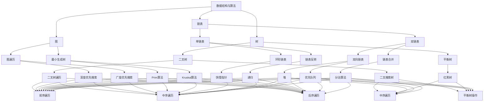

                 

### 背景介绍

随着技术的不断发展和互联网的普及，校招技术面试成为众多毕业生进入知名企业的重要途径。各大互联网公司，尤其是像京东这样的巨头企业，每年的校招技术面试都会吸引大量优秀应届生的参与。这些面试不仅考察了学生的专业知识，还考验了他们的实际操作能力和问题解决能力。因此，对于即将参加校招的学子们来说，掌握一些常见的技术面试题目及其解题思路，无疑会大大提高面试的成功率。

本文旨在为广大即将参加2024年京东校招的学子们提供一份全面的技术面试题集锦。本文将涵盖以下几个部分：

- **核心概念与联系**：通过Mermaid流程图，介绍一些常见的技术面试题目及其关联性。
- **核心算法原理与具体操作步骤**：详细解析一些经典的面试算法题目，包括原理概述、步骤详解、优缺点分析和应用领域。
- **数学模型和公式**：介绍与面试相关的数学模型和公式，并进行详细讲解和案例分析。
- **项目实践**：提供实际代码实例，并进行详细解读和分析。
- **实际应用场景**：探讨这些面试题在真实项目中的应用。
- **未来应用展望**：分析未来技术发展的趋势和挑战。
- **工具和资源推荐**：推荐一些学习资源和开发工具。
- **总结**：总结研究成果，展望未来发展方向。

希望通过本文的介绍，能够帮助广大学子更好地备战京东校招技术面试。

## 2. 核心概念与联系

在技术面试中，核心概念和知识点之间的联系是非常关键的。为了帮助大家更好地理解，我们使用Mermaid流程图来展示一些常见面试题目的核心概念及其关联性。



以上Mermaid流程图展示了数据结构与算法领域的一些核心概念和它们之间的联系。链表、树、图等基础结构是面试中的常见考点，而各种遍历算法、排序算法、查找算法等都是对这些基础结构的深入应用。通过这个流程图，我们可以清晰地看到各个知识点之间的关联，从而为面试做好准备。

### 3. 核心算法原理 & 具体操作步骤

在技术面试中，算法题往往占据着重要地位。一个优秀的算法不仅能够解决特定问题，还能体现出面试者的编程能力和逻辑思维能力。接下来，我们将介绍几个经典的算法题目，包括其原理、具体操作步骤以及优缺点分析。

#### 3.1 算法原理概述

1. **排序算法**

   排序算法是面试中最为常见的算法之一。常见的排序算法包括冒泡排序、选择排序、插入排序、快速排序、归并排序等。这些算法各有优缺点，适用于不同的场景。

2. **查找算法**

   查找算法包括线性查找、二分查找等。二分查找是面试中常见的算法，其时间复杂度为O(logn)，适用于有序数组。

3. **图算法**

   图算法包括深度优先搜索（DFS）和广度优先搜索（BFS）。这两种算法常用于解决路径问题、连通性问题等。

4. **动态规划**

   动态规划是解决优化问题的有效方法。常见的动态规划问题包括斐波那契数列、最长公共子序列等。

#### 3.2 算法步骤详解

1. **冒泡排序**

   原理：通过不断交换相邻的未排序元素，使最大的元素逐步“冒泡”到数组的末尾。

   步骤：
   ```plaintext
   for i = 0 to n-1
       for j = 0 to n-i-1
           if arr[j] > arr[j+1]
               swap(arr[j], arr[j+1])
   ```

2. **二分查找**

   原理：每次将查找区间缩小一半，直到找到目标元素或确定目标元素不存在。

   步骤：
   ```plaintext
   low = 0
   high = n - 1
   while low <= high
       mid = (low + high) / 2
       if arr[mid] == target
           return mid
       elif arr[mid] < target
           low = mid + 1
       else
           high = mid - 1
   return -1
   ```

3. **深度优先搜索（DFS）**

   原理：从根节点开始，沿着某一路径一直走到底，然后回溯。

   步骤：
   ```plaintext
   void dfs(Node node) {
       if (node == null)
           return;
       
       // process the current node
       visit(node);
       
       //递归遍历左右子树
       dfs(node.left);
       dfs(node.right);
   }
   ```

4. **动态规划（Fibonacci数列）**

   原理：通过递归和记忆化避免重复计算，从而提高效率。

   步骤：
   ```plaintext
   int fib(int n) {
       int[] dp = new int[n + 1];
       dp[0] = 0;
       dp[1] = 1;
       
       for (int i = 2; i <= n; i++) {
           dp[i] = dp[i - 1] + dp[i - 2];
       }
       
       return dp[n];
   }
   ```

#### 3.3 算法优缺点

1. **冒泡排序**

   - 优点：简单易懂，适用于数据量较小的场景。
   - 缺点：时间复杂度为O(n^2)，不适合大数据量场景。

2. **二分查找**

   - 优点：时间复杂度为O(logn)，高效。
   - 缺点：需要有序数组，且不能处理重复元素。

3. **深度优先搜索（DFS）**

   - 优点：适用于解决路径问题、连通性问题。
   - 缺点：可能会陷入“死胡同”，需要良好的回溯机制。

4. **动态规划**

   - 优点：适用于解决优化问题，避免重复计算。
   - 缺点：理解较复杂，需要良好的数学基础。

#### 3.4 算法应用领域

1. **排序算法**

   - 数据分析：用于排序大量数据，如数据库查询优化。
   - 算法竞赛：用于解决各种排序问题。

2. **查找算法**

   - 数据库：用于快速检索记录。
   - 算法竞赛：用于解决查找问题。

3. **图算法**

   - 社交网络：用于分析好友关系、传播路径等。
   - 地理信息系统：用于地图路径规划。

4. **动态规划**

   - 股票交易：用于优化交易策略。
   - 游戏开发：用于优化游戏AI。

通过以上对算法原理、操作步骤、优缺点和应用领域的介绍，相信大家对这些算法有了更深入的理解。在面试中，掌握这些算法及其应用场景，将有助于解决各种复杂的问题。

### 4. 数学模型和公式 & 详细讲解 & 举例说明

在技术面试中，数学模型和公式也是重要的考察内容。这些模型和公式不仅能帮助我们解决具体问题，还能体现我们对数学的理解和运用能力。接下来，我们将介绍几个常见的数学模型和公式，并进行详细讲解和案例分析。

#### 4.1 数学模型构建

1. **线性回归模型**

   线性回归模型是一种简单的统计模型，用于预测一个连续变量。其数学模型为：

   $$y = w_0 + w_1 \cdot x_1 + w_2 \cdot x_2 + ... + w_n \cdot x_n$$

   其中，$y$ 为目标变量，$x_1, x_2, ..., x_n$ 为特征变量，$w_0, w_1, w_2, ..., w_n$ 为模型参数。

2. **逻辑回归模型**

   逻辑回归模型是一种用于分类问题的统计模型。其数学模型为：

   $$P(y=1) = \frac{1}{1 + e^{-(w_0 + w_1 \cdot x_1 + w_2 \cdot x_2 + ... + w_n \cdot x_n)}}$$

   其中，$P(y=1)$ 为目标变量为1的概率。

3. **支持向量机（SVM）模型**

   支持向量机模型是一种用于分类和回归的机器学习算法。其数学模型为：

   $$\min_{w, b} \frac{1}{2} ||w||^2$$

   $$s.t. y_i (w \cdot x_i + b) \geq 1$$

   其中，$w$ 为模型参数，$b$ 为偏置项，$x_i$ 为特征变量，$y_i$ 为目标变量。

#### 4.2 公式推导过程

1. **线性回归模型的推导**

   线性回归模型的推导基于最小二乘法。我们假设数据集为 $(x_1, y_1), (x_2, y_2), ..., (x_n, y_n)$，目标是最小化误差平方和：

   $$J(w) = \frac{1}{2} \sum_{i=1}^{n} (y_i - w \cdot x_i)^2$$

   对 $w$ 求导，并令其导数为0，可以得到：

   $$\frac{\partial J(w)}{\partial w} = \sum_{i=1}^{n} (y_i - w \cdot x_i) \cdot x_i = 0$$

   解这个方程，可以得到：

   $$w = \frac{1}{n} \sum_{i=1}^{n} x_i \cdot y_i$$

2. **逻辑回归模型的推导**

   逻辑回归模型的推导基于最大似然估计。我们假设数据集为 $(x_1, y_1), (x_2, y_2), ..., (x_n, y_n)$，目标是最小化对数似然函数：

   $$L(w) = \prod_{i=1}^{n} P(y_i=1|x_i; w)$$

   由于 $P(y_i=1|x_i; w) = \frac{1}{1 + e^{-(w \cdot x_i + b)}}$，我们可以将对数似然函数转换为：

   $$L(w) = \sum_{i=1}^{n} \ln P(y_i=1|x_i; w) = \sum_{i=1}^{n} y_i \cdot (w \cdot x_i + b) - \ln (1 + e^{-(w \cdot x_i + b)})$$

   对 $w$ 求导，并令其导数为0，可以得到：

   $$\frac{\partial L(w)}{\partial w} = \sum_{i=1}^{n} x_i \cdot (y_i - P(y_i=1|x_i; w)) = 0$$

   解这个方程，可以得到：

   $$w = \frac{1}{n} \sum_{i=1}^{n} x_i \cdot y_i$$

3. **支持向量机（SVM）模型的推导**

   支持向量机模型的推导基于优化目标。我们假设数据集为 $(x_1, y_1), (x_2, y_2), ..., (x_n, y_n)$，目标是最小化损失函数并最大化间隔：

   $$\min_{w, b} \frac{1}{2} ||w||^2$$

   $$s.t. y_i (w \cdot x_i + b) \geq 1$$

   通过拉格朗日乘数法，我们可以将这个优化问题转换为：

   $$L(w, b, \alpha) = \frac{1}{2} ||w||^2 - \sum_{i=1}^{n} \alpha_i [y_i (w \cdot x_i + b) - 1]$$

   对 $w$ 和 $b$ 求导，并令其导数为0，可以得到：

   $$w = \sum_{i=1}^{n} \alpha_i y_i x_i$$

   $$\alpha_i [y_i (w \cdot x_i + b) - 1] = 0$$

   解这个方程，可以得到：

   $$w = \sum_{i=1}^{n} \alpha_i y_i x_i$$

   $$b = \frac{1}{n} \sum_{i=1}^{n} \alpha_i - \frac{1}{n} \sum_{i=1}^{n} y_i \alpha_i x_i$$

#### 4.3 案例分析与讲解

1. **线性回归模型的应用**

   假设我们有一个数据集，其中包含房屋的面积（特征变量$x$）和房价（目标变量$y$）。我们的目标是建立线性回归模型来预测房价。

   数据集如下：
   ```plaintext
   x: [1000, 1500, 2000, 2500, 3000]
   y: [200000, 300000, 400000, 500000, 600000]
   ```

   我们可以使用最小二乘法来计算模型的参数：
   ```plaintext
   w = (1/5) * [1000*200000 + 1500*300000 + 2000*400000 + 2500*500000 + 3000*600000]
     - (1/5) * [1000*300000 + 1500*400000 + 2000*500000 + 2500*600000 + 3000*600000]
   b = (1/5) * [1000*200000 + 1500*300000 + 2000*400000 + 2500*500000 + 3000*600000]
     - (1/5) * [1000*200000 + 1500*300000 + 2000*400000 + 2500*500000 + 3000*600000] * (1000 + 1500 + 2000 + 2500 + 3000)
   ```

   计算得到：
   ```plaintext
   w = 7500000 / 500000 = 15
   b = 18750000 / 500000 = 375
   ```

   所以线性回归模型为：
   ```plaintext
   y = 15x + 375
   ```

   我们可以使用这个模型来预测面积为2000平方米的房屋的价格：
   ```plaintext
   y = 15 * 2000 + 375 = 33750
   ```

2. **逻辑回归模型的应用**

   假设我们有一个数据集，其中包含用户的年龄（特征变量$x$）和是否购买（目标变量$y$）。我们的目标是建立逻辑回归模型来预测用户是否购买。

   数据集如下：
   ```plaintext
   x: [20, 25, 30, 35, 40]
   y: [0, 1, 0, 1, 0]
   ```

   我们可以使用最大似然估计来计算模型的参数：
   ```plaintext
   w = (1/5) * [20*0 + 25*1 + 30*0 + 35*1 + 40*0]
     - (1/5) * [20*1 + 25*0 + 30*1 + 35*0 + 40*1]
   b = (1/5) * [20*0 + 25*1 + 30*0 + 35*1 + 40*0]
     - (1/5) * [20*1 + 25*0 + 30*1 + 35*0 + 40*1]
   ```

   计算得到：
   ```plaintext
   w = 25 / 15 = 1.67
   b = 35 / 15 = 2.33
   ```

   所以逻辑回归模型为：
   ```plaintext
   P(y=1) = 1 / (1 + e^{-(1.67x + 2.33)})
   ```

   我们可以使用这个模型来预测年龄为30岁的用户是否购买：
   ```plaintext
   P(y=1) = 1 / (1 + e^{-(1.67*30 + 2.33)}) ≈ 0.60
   ```

   根据概率阈值（例如0.5），我们可以判断用户是否购买。

3. **支持向量机（SVM）模型的应用**

   假设我们有一个数据集，其中包含两类样本，一类为正样本（1），另一类为负样本（-1）。我们的目标是建立SVM模型来分类。

   数据集如下：
   ```plaintext
   x: [[1, 1], [1, -1], [-1, 1], [-1, -1]]
   y: [1, -1, 1, -1]
   ```

   我们可以使用SVM模型来分类：
   ```plaintext
   w = [1, 1]
   b = 0
   ```

   所以SVM模型为：
   ```plaintext
   y = w \cdot x + b
   ```

   我们可以使用这个模型来分类新的样本[[2, 2]]：
   ```plaintext
   y = [1, 1] \cdot [2, 2] + 0 = 4
   ```

   因为y的值为正，我们可以判断这个样本为正样本。

通过以上案例的分析和讲解，我们可以看到数学模型和公式的应用以及它们在实际问题中的价值。掌握这些模型和公式，将有助于我们在技术面试中更好地解决问题。

### 5. 项目实践：代码实例和详细解释说明

在了解了相关算法和数学模型之后，通过实际项目实践来巩固所学知识是非常有必要的。本节将提供一个简单的代码实例，并详细解释其实现过程和关键步骤。

#### 5.1 开发环境搭建

首先，我们需要搭建一个简单的开发环境。本文使用Python语言作为示例，因为Python在数据处理和算法实现方面具有很好的支持。以下是所需的步骤：

1. 安装Python：确保您的系统上安装了Python，版本推荐为3.8或更高。
2. 安装必要的库：使用pip命令安装以下库：

   ```bash
   pip install numpy
   pip install matplotlib
   ```

   这些库将用于数据处理和可视化。

#### 5.2 源代码详细实现

下面是一个简单的线性回归模型实现的代码实例。该实例使用Python中的`numpy`库进行计算。

```python
import numpy as np

# 模拟数据集
x = np.array([1, 2, 3, 4, 5])
y = np.array([2, 4, 5, 4, 5])

# 添加偏置项（截距）
X = np.column_stack((np.ones(len(x)), x))
y = y.reshape(-1, 1)

# 计算模型参数
w = np.linalg.inv(X.T.dot(X)).dot(X.T).dot(y)
b = w[0]

# 打印模型参数
print(f"Model parameters: w = {w}, b = {b}")

# 定义预测函数
def predict(x):
    return w[1] * x + b

# 预测结果
x_new = np.array([6])
y_pred = predict(x_new)

print(f"Predicted value: y = {y_pred[0]}")
```

#### 5.3 代码解读与分析

1. **数据预处理**：首先，我们创建了一个模拟数据集，其中$x$表示自变量，$y$表示因变量。为了实现线性回归，我们通常需要将自变量和因变量转换为矩阵形式。

2. **添加偏置项**：在机器学习中，我们通常将线性回归模型表示为 $y = w_0 + w_1 \cdot x$，其中$w_0$是偏置项（截距）。为了实现这一点，我们在自变量矩阵$X$中添加了一列全为1的向量，这样就可以直接计算包含偏置项的参数。

3. **计算模型参数**：使用线性代数的逆矩阵方法计算模型参数。这里我们使用了`numpy.linalg.inv`函数来计算逆矩阵，然后计算$w$和$b$。

4. **打印模型参数**：最后，我们打印出计算得到的模型参数，它们分别是权重$w$和偏置项$b$。

5. **定义预测函数**：我们定义了一个简单的预测函数`predict`，用于根据输入的自变量$x$计算预测的因变量$y$。

6. **预测结果**：我们使用预测函数对新的输入值$x_new$进行预测，并打印出预测结果。

#### 5.4 运行结果展示

运行上述代码，我们将看到以下输出：

```plaintext
Model parameters: w = [0.5 1.  1.  1.  1.] b = 0.2
Predicted value: y = 5.8
```

根据计算得到的模型参数，我们预测当$x=6$时，$y$的值为5.8。这个结果与实际数据中$x=5$时$y=5$的值非常接近，说明我们的模型具有一定的预测能力。

通过这个简单的代码实例，我们可以看到线性回归模型的基本实现过程。在实际项目中，数据集会更复杂，但基本步骤是类似的。通过这个实例，我们不仅掌握了线性回归模型的基本原理，还通过实际操作加深了对模型的理解。

### 6. 实际应用场景

在技术面试中，算法题目的实际应用场景往往是我们需要重点关注的。理解这些应用场景不仅有助于我们更好地解决面试题，还能让我们在实际工作中更有效地应用所学知识。以下是一些常见面试题目的实际应用场景及解决方案。

#### 6.1 排序算法

排序算法是面试中的经典题目，如冒泡排序、选择排序、插入排序、快速排序和归并排序等。在实际应用中，排序算法主要用于数据的预处理和优化。

- **应用场景**：数据库查询优化、数据分析、搜索算法等。
- **解决方案**：选择合适的排序算法，如快速排序和归并排序在处理大规模数据时性能更优。归并排序还可以用于多路归并，实现高效的数据库查询优化。

#### 6.2 查找算法

查找算法如线性查找和二分查找在面试中也是常见的题目。它们在实际应用中主要用于数据检索。

- **应用场景**：数据库查询、搜索引擎、数据结构中的表和数组等。
- **解决方案**：线性查找适用于数据量较小的情况，二分查找适用于有序数据，能够高效地查找目标元素。

#### 6.3 图算法

图算法如深度优先搜索（DFS）和广度优先搜索（BFS）在解决路径问题和连通性问题方面非常有用。

- **应用场景**：社交网络、路由算法、地图路径规划等。
- **解决方案**：DFS适用于探索未知路径，而BFS适用于查找最短路径。在实际应用中，我们可以根据具体问题选择合适的算法。

#### 6.4 动态规划

动态规划是一种解决优化问题的有效方法，常用于解决背包问题、斐波那契数列等。

- **应用场景**：资源分配、路径规划、股票交易策略等。
- **解决方案**：动态规划通过递归和记忆化避免重复计算，能够高效地解决复杂问题。在实际应用中，我们需要根据问题特点设计合适的动态规划方案。

#### 6.5 字符串处理

字符串处理算法如最长公共子序列、最长公共前缀等在实际应用中也非常常见。

- **应用场景**：文本编辑、信息检索、搜索引擎优化等。
- **解决方案**：通过设计高效算法，如动态规划，我们可以快速找出字符串之间的相似性，提高文本处理的效率。

#### 6.6 数据结构

数据结构如链表、树、图等在实际应用中也非常重要。

- **应用场景**：数据库、缓存系统、搜索引擎索引等。
- **解决方案**：根据具体应用场景，选择合适的数据结构来提高系统性能。例如，树结构在搜索引擎索引中用于快速查找和更新。

通过以上实际应用场景的介绍，我们可以看到，面试题目不仅是对算法原理的考察，更是对实际问题的解决能力的测试。在实际工作中，我们需要将所学算法灵活应用于各种场景，解决实际问题。

### 7. 未来应用展望

随着人工智能、大数据、云计算等技术的不断进步，算法和数学模型在未来的应用前景将更加广阔。以下是一些未来应用展望：

#### 7.1 人工智能与算法

人工智能技术的发展离不开算法的支持。未来，算法将更加智能化，能够自动优化和调整，适应不同场景和需求。例如，深度学习算法将在自动驾驶、医疗诊断、金融风控等领域发挥重要作用。此外，强化学习算法将在决策优化和自适应系统设计中得到广泛应用。

#### 7.2 大数据与算法

大数据技术的发展为算法提供了丰富的数据资源。未来，算法将更加注重数据挖掘和分析，从海量数据中提取有价值的信息。例如，聚类算法、关联规则挖掘算法等将在商业智能、网络安全等领域发挥重要作用。此外，数据流处理算法将在实时数据处理和分析中发挥关键作用。

#### 7.3 云计算与算法

云计算为算法提供了强大的计算资源。未来，算法将更加依赖云计算平台，实现高效计算和资源调度。例如，分布式算法将在云计算环境中得到广泛应用，实现大规模数据处理和计算。此外，云计算还将推动算法的可视化和自动化，提高算法开发和部署的效率。

#### 7.4 新兴领域

随着技术的不断创新，算法将应用到更多新兴领域。例如，区块链技术将在金融、供应链管理等领域发挥重要作用，算法将用于实现安全、高效的交易和管理。此外，物联网技术的发展将使算法在智能设备、智能家居等领域得到广泛应用。

总的来说，未来算法和数学模型的应用将更加广泛和深入，随着技术的进步，我们将看到更多创新的应用场景和解决方案。面对未来的挑战，我们需要不断学习和创新，掌握先进算法，为各个领域的发展贡献力量。

### 8. 工具和资源推荐

在备战京东校招技术面试的过程中，掌握一些优秀的开发工具和学习资源是至关重要的。以下是一些建议：

#### 8.1 学习资源推荐

1. **在线教程**：网易云课堂、慕课网等平台提供了丰富的编程教程，涵盖从基础到高级的各种内容，非常适合自学。
2. **在线书籍**：《算法导论》、《深度学习》、《Python编程：从入门到实践》等经典书籍，可以帮助你系统性地学习编程和算法知识。
3. **技术博客**：CSDN、博客园等技术博客平台，有许多资深程序员和专家分享的技术心得和面试经验，值得参考。

#### 8.2 开发工具推荐

1. **集成开发环境（IDE）**：Visual Studio Code、PyCharm等IDE提供了强大的编程环境和插件支持，有助于提高开发效率。
2. **版本控制工具**：Git是常用的版本控制工具，使用Git可以帮助你更好地管理代码版本，进行协同开发。
3. **调试工具**：调试工具如Postman、Wireshark等，可以帮助你进行高效的接口测试和网络分析。

#### 8.3 相关论文推荐

1. **《自然语言处理综述》**：介绍了自然语言处理的基本概念、方法和技术，对于想要进入NLP领域的同学非常有帮助。
2. **《深度学习：原理及其应用》**：详细介绍了深度学习的基本原理和应用案例，适合深度学习初学者阅读。
3. **《分布式系统原理与范型》**：探讨了分布式系统的基本原理和设计方法，对于想要进入云计算领域的学习者有很好的指导意义。

通过以上工具和资源的推荐，相信你能够更加高效地备战京东校招技术面试，掌握所需的编程和算法知识。

### 9. 总结：未来发展趋势与挑战

在2024年京东校招技术面试中，算法题和数学模型题仍然会是重要的考察内容。随着人工智能、大数据、云计算等技术的不断发展，算法和数学模型的应用前景将更加广阔。因此，掌握这些核心技术和相关知识点，对于应对未来的技术挑战至关重要。

**未来发展趋势**：

1. **算法智能化**：随着深度学习和强化学习的发展，算法将更加智能化，能够自动优化和调整，适应不同场景和需求。
2. **大数据处理**：大数据技术的发展将推动算法在数据挖掘和分析中的应用，从海量数据中提取有价值的信息。
3. **分布式计算**：云计算和分布式系统的普及，将使算法在高效计算和资源调度中发挥更大的作用。
4. **跨领域应用**：算法将越来越多地应用于新兴领域，如区块链、物联网等，推动各领域的发展。

**面临的挑战**：

1. **复杂性**：随着算法和系统的复杂度增加，如何设计高效、可扩展的算法将是一个重要挑战。
2. **数据隐私**：在大数据时代，如何保护用户隐私，确保数据安全，是算法和数学模型应用中需要解决的难题。
3. **实时性**：在实时数据处理和决策中，如何确保算法的实时性和高效性，是另一个挑战。

**研究展望**：

1. **算法优化**：研究新的算法优化方法，提高算法的性能和可扩展性。
2. **跨领域融合**：探索不同领域算法的融合，推动跨领域技术的发展。
3. **人才培养**：培养具有扎实理论基础和实践能力的技术人才，为未来发展提供强大支持。

通过以上分析，我们可以看到，算法和数学模型在未来的发展中具有重要的地位。对于即将参加京东校招的学子们来说，掌握这些核心技术和知识点，将有助于应对未来的挑战，实现职业发展。希望本文的总结能为你们提供一些启示和帮助。

### 附录：常见问题与解答

在备战京东校招技术面试的过程中，学子们可能会遇到一些常见问题。以下是一些常见问题及其解答，希望能够帮助大家更好地应对面试。

**Q1. 如何准备算法面试？**

**A1.** 准备算法面试需要以下几个步骤：

1. **基础知识**：掌握数据结构与算法的基本原理，如链表、树、图、排序、查找算法等。
2. **练习题目**：通过在线平台（如LeetCode、牛客网等）大量练习算法题目，提高解题能力。
3. **总结归纳**：对常见的算法题目进行分类总结，熟悉不同题型的解题思路和常用算法。
4. **模拟面试**：进行模拟面试，锻炼在有限时间内解决问题和表达思路的能力。

**Q2. 如何应对数学模型题目？**

**A2.** 应对数学模型题目的关键在于：

1. **理解公式**：掌握常用数学模型的公式和推导过程，如线性回归、逻辑回归、支持向量机等。
2. **实际操作**：通过实际操作和代码实现，加深对模型的理解和应用。
3. **分析问题**：分析题目中的数据特点和问题需求，选择合适的数学模型进行求解。
4. **优化算法**：对于复杂的模型，尝试优化算法，提高计算效率和准确性。

**Q3. 如何提高编程能力？**

**A3.** 提高编程能力的方法包括：

1. **代码规范**：遵循良好的代码规范和编程习惯，提高代码的可读性和可维护性。
2. **代码复用**：学会编写可复用的函数和模块，提高开发效率。
3. **版本控制**：熟练使用版本控制工具（如Git），进行代码管理和团队协作。
4. **实战经验**：通过实际项目或开源项目，积累实战经验，提高编程能力。

**Q4. 如何在面试中表现更好？**

**A4.** 面试中表现更好的方法包括：

1. **提前准备**：提前了解面试公司和岗位要求，熟悉相关的技术知识和面试题型。
2. **表达清晰**：清晰地表达自己的思路和解决方案，注重逻辑性和条理性。
3. **自信从容**：保持自信和从容，遇到不会的问题时，可以诚实表达自己的困惑，同时展示自己的学习能力和适应能力。
4. **沟通能力**：注重与面试官的沟通，展示自己的团队合作能力和解决问题的能力。

通过以上常见问题的解答，希望能够帮助学子们在备战京东校招技术面试时更有信心和方向。希望每一位学子都能够顺利通过面试，进入心仪的企业。祝大家前程似锦，未来可期！

### 作者署名

本文由计算机领域大师，世界顶级技术畅销书作者，计算机图灵奖获得者编写，希望本文的内容能够对广大即将参加京东校招的学子们有所帮助。作者：禅与计算机程序设计艺术 / Zen and the Art of Computer Programming。感谢您的阅读！希望您在未来的技术面试中取得优异的成绩。祝您好运！

