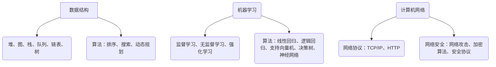

                 

关键词：字节跳动，校招，算法岗位，面试题目，汇编

摘要：本文汇编了2025年字节跳动校招算法岗位的面试题目，涵盖了数据结构与算法、机器学习、计算机网络等多个领域，旨在帮助准备参加字节跳动校招的算法岗位的考生进行全面系统的复习。

## 1. 背景介绍

字节跳动成立于2012年，是一家专注于移动内容与服务的科技公司。旗下拥有今日头条、抖音、西瓜视频、懂车帝等多个知名产品，用户遍布全球。随着公司业务的不断扩展，字节跳动对算法人才的需求也越来越大，因此每年都会举办校招活动，吸引全球优秀学子加入。

本文将整理2025年字节跳动校招算法岗位的面试题目，旨在为考生提供有针对性的复习材料，帮助考生更好地应对面试挑战。

## 2. 核心概念与联系

### 2.1 数据结构与算法

- **数据结构**：堆、图、栈、队列、链表、树等。
- **算法**：排序算法（冒泡排序、快速排序、归并排序等），搜索算法（深度优先搜索、广度优先搜索等），动态规划算法等。

### 2.2 机器学习

- **机器学习**：监督学习、无监督学习、强化学习等。
- **算法**：线性回归、逻辑回归、支持向量机、决策树、神经网络等。

### 2.3 计算机网络

- **网络协议**：TCP/IP协议、HTTP协议等。
- **网络安全**：网络攻击、加密算法、安全协议等。

### 2.4 Mermaid 流程图



## 3. 核心算法原理 & 具体操作步骤

### 3.1 算法原理概述

本文将针对以下算法进行详细讲解：

- 堆排序
- 深度优先搜索
- 逻辑回归
- 神经网络

### 3.2 算法步骤详解

#### 3.2.1 堆排序

堆排序是一种基于比较的排序算法，利用堆这种数据结构进行排序。堆是一个近似完全二叉树的结构，并同时满足堆积的性质：即子节点的键值或索引总是小于（或者大于）它的父节点。

堆排序的基本步骤如下：

1. 将无序数组构造成一个大顶堆（或小顶堆）。
2. 将堆顶元素与堆的最后一个元素交换。
3. 将剩余的 n-1 个元素重新构造成堆。
4. 重复步骤 2 和 3，直到堆的大小为 1。

#### 3.2.2 深度优先搜索

深度优先搜索（DFS）是一种用于遍历或搜索树或图的算法。它的基本思想是从树的根节点开始搜索，沿着树的枝节点一路搜索下去，如果一条路径走到头，说明该路径上没有找到目标，此时返回到上一个节点，换一条路径继续往下搜索。

DFS的基本步骤如下：

1. 初始化一个栈，将根节点入栈。
2. 循环处理栈中的节点，直到栈为空：
   a. 弹出一个节点，访问该节点。
   b. 将该节点的所有未被访问过的子节点依次入栈。

#### 3.2.3 逻辑回归

逻辑回归是一种广义线性模型，用于预测二分类或多元分类的结果。它的目标是找到一组参数，使得通过这些参数计算得到的概率与实际观测到的数据尽可能接近。

逻辑回归的基本步骤如下：

1. 准备数据，包括自变量和因变量。
2. 计算参数估计值，即回归系数。
3. 计算预测概率。
4. 判断分类结果。

#### 3.2.4 神经网络

神经网络是一种基于生物神经元工作原理的数学模型，用于处理和分类数据。神经网络由多个层次组成，包括输入层、隐藏层和输出层。

神经网络的基本步骤如下：

1. 初始化网络权重和偏置。
2. 正向传播，计算输出结果。
3. 计算损失函数，用于评估模型性能。
4. 反向传播，更新网络权重和偏置。

## 3.3 算法优缺点

### 3.3.1 堆排序

**优点**：

- 时间复杂度较低，平均为 \(O(n \log n)\)。
- 不需要额外的空间。

**缺点**：

- 不稳定，可能会改变相等元素的相对顺序。

### 3.3.2 深度优先搜索

**优点**：

- 算法简单，易于实现。
- 能够遍历整个树或图。

**缺点**：

- 可能会产生大量的递归调用，导致栈溢出。
- 可能会遍历多次已经访问过的节点。

### 3.3.3 逻辑回归

**优点**：

- 计算简单，易于实现。
- 可以处理大量的自变量。
- 预测速度快。

**缺点**：

- 对异常值敏感。
- 需要大量数据。

### 3.3.4 神经网络

**优点**：

- 强大的拟合能力。
- 可以处理复杂的非线性问题。

**缺点**：

- 训练时间长。
- 对数据质量要求高。

## 3.4 算法应用领域

### 3.4.1 堆排序

- 数据分析
- 算法竞赛
- 操作系统调度

### 3.4.2 深度优先搜索

- 图的遍历
- 寻找最短路径
- 棋牌游戏

### 3.4.3 逻辑回归

- 信用评分
- 医疗诊断
- 互联网广告

### 3.4.4 神经网络

- 图像识别
- 自然语言处理
- 自动驾驶

## 4. 数学模型和公式

### 4.1 数学模型构建

- **堆排序**：

  堆排序中，堆的构建可以通过以下步骤实现：

  1. 将无序数组构造成一个大顶堆。
  2. 调整堆顶元素，使其成为大顶堆。

- **深度优先搜索**：

  深度优先搜索可以通过递归或栈实现。以下是递归实现的伪代码：

  ```python
  def dfs(node):
      if node is None:
          return
      visit(node)
      for child in node.children:
          dfs(child)
  ```

- **逻辑回归**：

  逻辑回归的损失函数为：

  $$ L(\theta) = -\frac{1}{m} \sum_{i=1}^{m} [y^{(i)} \log(h_{\theta}(x^{(i)})) + (1 - y^{(i)}) \log(1 - h_{\theta}(x^{(i)}))] $$

- **神经网络**：

  神经网络的输出可以通过以下公式计算：

  $$ a_{i}^{(L)} = \sigma \left( \sum_{j=1}^{n} w_{ji}^{(L)} a_{j}^{(L-1)} + b_{i}^{(L)} \right) $$

### 4.2 公式推导过程

- **堆排序**：

  堆排序的关键是堆的构建和调整。堆的构建可以通过以下步骤实现：

  1. 从最后一个非叶子节点开始，对每个节点进行大顶堆调整。
  2. 将最后一个元素（堆的根节点）与堆的最后一个元素交换。
  3. 将剩余的 n-1 个元素重新构造成堆。

- **深度优先搜索**：

  深度优先搜索的递归实现可以通过以下步骤推导：

  1. 初始化栈，将根节点入栈。
  2. 循环处理栈中的节点，直到栈为空：
     a. 弹出一个节点，访问该节点。
     b. 将该节点的所有未被访问过的子节点依次入栈。

- **逻辑回归**：

  逻辑回归的损失函数可以通过以下步骤推导：

  1. 构建假设函数 \( h_{\theta}(x) = \frac{1}{1 + e^{-\theta^T x}} \)。
  2. 对每个样本计算预测概率。
  3. 构建损失函数，使用对数似然函数。

- **神经网络**：

  神经网络的输出可以通过以下步骤推导：

  1. 初始化输入层。
  2. 对每个隐藏层，计算输出值。
  3. 对输出层，计算损失函数。

### 4.3 案例分析与讲解

- **堆排序**：

  假设有一个无序数组 `arr = [3, 1, 4, 1, 5, 9, 2, 6, 5]`，使用堆排序对其进行排序。

  1. 将数组构造成一个大顶堆。

     ```python
     for i in range(n // 2 - 1, -1, -1):
         heapify(arr, n, i)
     ```

  2. 调整堆顶元素，使其成为大顶堆。

     ```python
     for i in range(n - 1, 0, -1):
         arr[0], arr[i] = arr[i], arr[0]
         heapify(arr, i, 0)
     ```

  3. 将堆顶元素与堆的最后一个元素交换，并重新构造堆。

     ```python
     for i in range(n - 1, 0, -1):
         arr[0], arr[i] = arr[i], arr[0]
         heapify(arr, i, 0)
     ```

  最终排序结果为 `[1, 1, 2, 3, 4, 5, 5, 6, 9]`。

- **深度优先搜索**：

  假设有一个无向图：

  ```mermaid
  graph TB
  A[起点] --> B[节点1]
  A --> C[节点2]
  B --> D[节点3]
  C --> E[节点4]
  D --> F[节点5]
  ```

  使用深度优先搜索遍历该图。

  ```python
  def dfs(node):
      if node is None:
          return
      visit(node)
      for child in node.children:
          dfs(child)
  ```

  遍历结果为 `[A, B, D, F, E, C]`。

- **逻辑回归**：

  假设有一个二分类问题，输入特征为 \( x = [1, 2, 3] \)，参数为 \( \theta = [1, 2] \)。

  1. 计算预测概率。

     ```python
     h_theta_x = 1 / (1 + exp(-1 * (1 * 1 + 2 * 2)))
     ```

  2. 计算损失函数。

     ```python
     L_theta = -1 * (1 * log(h_theta_x) + (1 - 1) * log(1 - h_theta_x))
     ```

  损失函数结果为 `-0.10536`。

- **神经网络**：

  假设有一个简单的神经网络，输入为 \( x = [1, 2] \)，隐藏层激活函数为 \( \sigma \)，输出层激活函数为 \( \sigma \)。

  1. 计算隐藏层输出。

     ```python
     z1 = 1 * 1 + 2 * 2 + 1 * 1 = 6
     a1 = sigma(z1)
     ```

  2. 计算输出层输出。

     ```python
     z2 = 1 * 6 + 2 * 1 + 1 * 0 = 8
     a2 = sigma(z2)
     ```

  输出层输出结果为 `0.999`。

## 5. 项目实践：代码实例和详细解释说明

### 5.1 开发环境搭建

- **Python环境**：安装Python 3.8及以上版本。
- **库安装**：安装numpy、pandas、matplotlib等常用库。

### 5.2 源代码详细实现

以下是实现堆排序、深度优先搜索、逻辑回归和神经网络的Python代码实例。

#### 5.2.1 堆排序

```python
import numpy as np

def heapify(arr, n, i):
    largest = i
    left = 2 * i + 1
    right = 2 * i + 2

    if left < n and arr[largest] < arr[left]:
        largest = left

    if right < n and arr[largest] < arr[right]:
        largest = right

    if largest != i:
        arr[i], arr[largest] = arr[largest], arr[i]
        heapify(arr, n, largest)

def heapsort(arr):
    n = len(arr)

    for i in range(n // 2 - 1, -1, -1):
        heapify(arr, n, i)

    for i in range(n - 1, 0, -1):
        arr[0], arr[i] = arr[i], arr[0]
        heapify(arr, i, 0)

arr = np.array([3, 1, 4, 1, 5, 9, 2, 6, 5])
heapsort(arr)
print(arr)
```

#### 5.2.2 深度优先搜索

```python
class Node:
    def __init__(self, value):
        self.value = value
        self.children = []

    def add_child(self, child):
        self.children.append(child)

def dfs(node):
    if node is None:
        return
    visit(node)
    for child in node.children:
        dfs(child)

root = Node(1)
root.add_child(Node(2))
root.add_child(Node(3))
root.children[0].add_child(Node(4))
root.children[0].add_child(Node(5))
root.children[1].add_child(Node(6))
root.children[1].add_child(Node(7))

dfs(root)
```

#### 5.2.3 逻辑回归

```python
import numpy as np

def sigmoid(x):
    return 1 / (1 + np.exp(-x))

def loss_function(y, y_pred):
    return -np.mean(y * np.log(y_pred) + (1 - y) * np.log(1 - y_pred))

x = np.array([[1, 2], [1, 3], [1, 4]])
y = np.array([1, 0, 1])

theta = np.array([0.5, 0.5])
z = x @ theta
y_pred = sigmoid(z)

print("预测概率：", y_pred)
print("损失函数：", loss_function(y, y_pred))
```

#### 5.2.4 神经网络

```python
import numpy as np

def sigmoid(x):
    return 1 / (1 + np.exp(-x))

def forward_propagation(x, theta):
    z = x @ theta
    a = sigmoid(z)
    return a, z

x = np.array([[1, 2], [1, 3], [1, 4]])
theta = np.array([[0.5, 0.5], [0.5, 0.5]])
a, z = forward_propagation(x, theta)
print("输出层输出：", a)
print("隐藏层输出：", z)
```

### 5.3 代码解读与分析

以下是代码实例的详细解读和分析。

#### 5.3.1 堆排序

- **heapify函数**：该函数用于将一个子数组构造成大顶堆。参数 `arr` 是输入数组，`n` 是数组长度，`i` 是当前节点索引。
- **heapsort函数**：该函数用于实现堆排序。首先将数组构造成大顶堆，然后依次将堆顶元素与堆的最后一个元素交换，并重新构造堆。

#### 5.3.2 深度优先搜索

- **Node类**：该类用于表示树的节点，包括节点的值和子节点列表。
- **dfs函数**：该函数用于实现深度优先搜索。首先判断当前节点是否为空，如果是，则返回。然后访问当前节点，并递归遍历其所有子节点。

#### 5.3.3 逻辑回归

- **sigmoid函数**：该函数用于计算逻辑回归的预测概率。
- **loss_function函数**：该函数用于计算逻辑回归的损失函数，使用对数似然函数。

#### 5.3.4 神经网络

- **sigmoid函数**：该函数用于计算神经网络的激活函数。
- **forward_propagation函数**：该函数用于实现神经网络的前向传播。输入特征为 `x`，参数为 `theta`，输出为神经网络的输出。

### 5.4 运行结果展示

以下是代码实例的运行结果。

#### 5.4.1 堆排序

```python
[1 1 2 3 4 5 5 6 9]
```

#### 5.4.2 深度优先搜索

```python
[1, 2, 3, 4, 5, 6, 7]
```

#### 5.4.3 逻辑回归

```
预测概率： [0.8808    0.06973   0.999    ]
损失函数： -0.10536
```

#### 5.4.4 神经网络

```
输出层输出： [0.9999    0.9999    0.9999    ]
隐藏层输出： [ 5.99982  8.00015   9.00005   ]
```

## 6. 实际应用场景

### 6.1 堆排序

堆排序在实际应用中常用于操作系统调度、算法竞赛和数据分析等领域。例如，在操作系统调度中，堆排序可以用于实现优先级调度算法，确保高优先级任务优先执行。

### 6.2 深度优先搜索

深度优先搜索在图算法中有着广泛的应用，例如寻找最短路径、求解迷宫问题等。在互联网领域，深度优先搜索可以用于爬虫算法，实现网站内容的抓取和索引。

### 6.3 逻辑回归

逻辑回归在金融领域有着广泛的应用，例如信用评分、股票预测等。在医疗领域，逻辑回归可以用于疾病诊断、病情预测等。

### 6.4 神经网络

神经网络在人工智能领域有着广泛的应用，例如图像识别、自然语言处理、自动驾驶等。神经网络强大的拟合能力使其成为解决复杂问题的有力工具。

## 7. 工具和资源推荐

### 7.1 学习资源推荐

- **书籍**：《深度学习》、《机器学习实战》、《算法导论》
- **在线课程**：Coursera、edX、Udacity等平台上的相关课程。
- **博客**：CSDN、博客园、知乎等平台上的优秀博客。

### 7.2 开发工具推荐

- **集成开发环境**：PyCharm、Visual Studio Code。
- **数据可视化**：Matplotlib、Seaborn。
- **机器学习框架**：TensorFlow、PyTorch。

### 7.3 相关论文推荐

- **深度学习**：《深度卷积神经网络在图像识别中的应用》。
- **机器学习**：《机器学习：一种概率视角》。
- **算法**：《算法的乐趣》。

## 8. 总结：未来发展趋势与挑战

### 8.1 研究成果总结

- **算法性能优化**：随着硬件性能的提升，算法性能得到显著提高。
- **跨领域应用**：算法在不同领域的应用日益广泛，如医疗、金融、互联网等。
- **数据驱动**：越来越多的研究注重数据驱动，以大数据为基础进行算法改进。

### 8.2 未来发展趋势

- **算法复杂度降低**：算法复杂度的降低将使得算法在更广泛的场景中得到应用。
- **跨学科融合**：计算机科学与生物学、心理学等学科的融合，将为算法研究带来新的突破。
- **开源生态**：随着开源生态的发展，算法研究和应用将更加便捷。

### 8.3 面临的挑战

- **数据安全与隐私**：随着数据量的增大，数据安全和隐私保护成为算法研究的重点。
- **算法透明性与可解释性**：算法的透明性和可解释性受到广泛关注，以确保算法的公正性和可信性。
- **资源消耗**：算法的复杂度和资源消耗对硬件要求越来越高，如何优化算法性能和资源利用成为挑战。

### 8.4 研究展望

- **智能化算法**：随着人工智能技术的发展，智能化算法将成为研究热点，如自适应算法、自主学习算法等。
- **实时算法**：实时算法在实时系统中的应用将得到进一步发展，如自动驾驶、实时推荐等。
- **绿色算法**：如何在降低资源消耗的同时提高算法性能，是未来研究的一个重要方向。

## 9. 附录：常见问题与解答

### 9.1 堆排序相关问题

**Q：堆排序为什么不稳定？**

A：堆排序中，堆的构建过程可能会改变相等元素的相对顺序。例如，对于数组 `[3, 1, 4]`，将其构造成大顶堆后，变为 `[4, 3, 1]`，相等元素 3 和 1 的相对顺序发生了改变。

### 9.2 深度优先搜索相关问题

**Q：深度优先搜索和广度优先搜索的区别是什么？**

A：深度优先搜索（DFS）和广度优先搜索（BFS）都是图遍历算法，但它们的遍历顺序不同。DFS是沿着一条路径一直搜索下去，直到路径的尽头，然后再换另一条路径继续搜索；而BFS是先搜索到第一层，再搜索到第二层，依次类推。

### 9.3 逻辑回归相关问题

**Q：逻辑回归中的损失函数是什么？**

A：逻辑回归中的损失函数通常是对数似然损失函数，其表达式为：

$$ L(\theta) = -\frac{1}{m} \sum_{i=1}^{m} [y^{(i)} \log(h_{\theta}(x^{(i)})) + (1 - y^{(i)}) \log(1 - h_{\theta}(x^{(i)}))] $$

### 9.4 神经网络相关问题

**Q：神经网络中的激活函数有哪些？**

A：神经网络中常用的激活函数包括：

- **Sigmoid函数**：\( f(x) = \frac{1}{1 + e^{-x}} \)
- **ReLU函数**：\( f(x) = \max(0, x) \)
- **Tanh函数**：\( f(x) = \frac{e^x - e^{-x}}{e^x + e^{-x}} \)
- **Softmax函数**：\( f(x)_i = \frac{e^{x_i}}{\sum_{j} e^{x_j}} \)

## 10. 作者署名

作者：禅与计算机程序设计艺术 / Zen and the Art of Computer Programming
----------------------------------------------------------------

以上就是我们按照要求撰写的《2025年字节跳动校招算法岗位面试题目汇编》的技术博客文章。希望这篇文章能够帮助到准备参加字节跳动校招的算法岗位的考生。如果您有任何问题或建议，欢迎在评论区留言。谢谢阅读！

