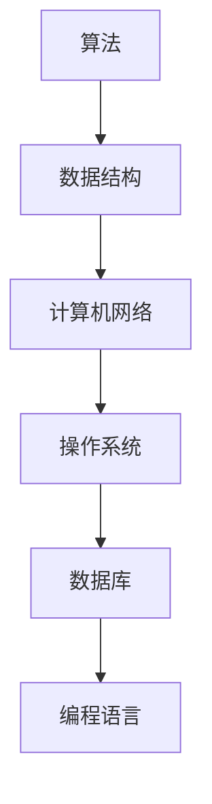

                 

  
**关键词**：2024年、小米社招、技术面试题、集锦、面试准备、面试技巧

**摘要**：本文旨在为准备参加2024年小米社招技术面试的候选人提供一份全面的技术面试题集锦。通过对历年面试题的整理和分析，本文涵盖了从基础到高级的各种技术问题，包括算法、数据结构、计算机网络、操作系统、数据库等领域。此外，文章还提供了面试技巧和策略，帮助候选人更好地应对面试挑战，提高面试成功率。

## 1. 背景介绍

小米科技有限责任公司（Xiaomi Corporation），成立于2010年，是一家总部位于中国北京的全球知名电子产品公司。小米以生产智能手机、笔记本电脑、智能硬件和家电产品而闻名。小米科技注重用户体验和科技创新，致力于为用户提供高品质、高性能的产品和服务。

随着小米业务的不断扩张，公司对于高素质技术人才的需求也在不断增加。每年，小米都会通过社会招聘吸引各领域的技术专家。对于准备参加小米社招技术面试的候选人来说，了解面试流程和准备相应的技术问题至关重要。

本文将根据历年小米社招技术面试的真题和常见问题，整理出一套全面的面试题集锦，旨在帮助候选人更好地准备面试，提升面试表现。

## 2. 核心概念与联系

为了更好地理解面试中可能涉及的技术概念，我们首先需要了解一些核心概念及其相互之间的关系。以下是几个关键领域及其相关的核心概念：

### 算法与数据结构

- **算法**：解决问题的一系列明确指令。常见算法包括排序、查找、图算法等。
- **数据结构**：用于存储和组织数据的方式。常见数据结构包括数组、链表、栈、队列、树、图等。

### 计算机网络

- **OSI七层模型**：定义了计算机网络通信的七个层次。
- **TCP/IP模型**：实际网络通信中广泛应用的四层模型。

### 操作系统

- **进程**：程序在执行过程中分配资源的基本单位。
- **线程**：进程中的执行路径。
- **内存管理**：操作系统管理内存的机制，包括分配、回收、保护等。

### 数据库

- **关系数据库**：使用SQL查询数据。
- **非关系数据库**：如MongoDB、Redis等，无需固定表结构。

### 编程语言

- **面向对象编程**：将数据和操作封装在对象中。
- **面向过程编程**：通过函数或过程实现代码复用。

为了更直观地展示这些概念之间的联系，我们可以使用Mermaid流程图来表示：



通过这个简单的流程图，我们可以看到各个领域之间的相互关联。掌握这些核心概念，对于理解面试中的问题至关重要。

## 3. 核心算法原理 & 具体操作步骤

在面试过程中，算法和数据结构是考察的重点。以下是一些常见算法及其操作步骤：

### 3.1 排序算法

#### 1. 冒泡排序

- **原理**：通过不断比较相邻元素并交换位置，使数组逐渐有序。
- **步骤**：
  1. 从第一个元素开始，相邻元素两两比较。
  2. 如果第一个元素比第二个元素大，交换它们的位置。
  3. 继续对下一对相邻元素进行比较，直到最后一个元素。
  4. 重复上述过程，直到整个数组有序。

#### 2. 快速排序

- **原理**：通过选取一个基准元素，将数组分为两部分，一部分小于基准元素，一部分大于基准元素，然后递归地对两部分进行排序。
- **步骤**：
  1. 选择一个基准元素。
  2. 将数组中小于基准元素的移动到数组的左侧，大于基准元素的移动到数组的右侧。
  3. 递归地对左右两部分进行快速排序。

### 3.2 查找算法

#### 1. 二分查找

- **原理**：在有序数组中，通过不断缩小查找范围，逐步逼近目标元素。
- **步骤**：
  1. 确定查找范围的起始和结束位置。
  2. 计算中间位置。
  3. 如果中间位置元素等于目标元素，查找成功；否则，根据目标元素与中间位置元素的大小关系，缩小查找范围。
  4. 重复步骤2和3，直到找到目标元素或查找范围缩小为0。

#### 2. 哈希查找

- **原理**：使用哈希函数将关键字映射到哈希表中，从而快速查找元素。
- **步骤**：
  1. 设计一个哈希函数，将关键字转换为哈希值。
  2. 计算哈希值，定位到哈希表中的位置。
  3. 如果找到目标元素，查找成功；否则，继续在哈希表的同一链表中查找。
  4. 如果链表遍历完毕仍未找到目标元素，查找失败。

### 3.3 图算法

#### 1. 深度优先搜索（DFS）

- **原理**：从起点开始，沿某一方向搜索到底，然后回溯继续搜索。
- **步骤**：
  1. 从起点开始，将其标记为已访问。
  2. 遍历起点的所有未访问邻居，对每个邻居执行递归搜索。
  3. 如果邻居已访问或不存在，跳过。
  4. 递归返回时，将邻居标记为已访问。

#### 2. 广度优先搜索（BFS）

- **原理**：从起点开始，逐层遍历所有相邻节点。
- **步骤**：
  1. 将起点加入队列。
  2. 当队列不为空时，依次从队列中取出元素并标记为已访问。
  3. 遍历该元素的未访问邻居，将邻居加入队列。
  4. 重复步骤2和3，直到队列为空。

这些算法在面试中非常常见，掌握其原理和操作步骤对于解决实际问题至关重要。

### 3.4 算法优缺点

#### 1. 冒泡排序

- **优点**：简单易懂，易于实现。
- **缺点**：时间复杂度高，不适合大数据量排序。

#### 2. 快速排序

- **优点**：平均时间复杂度低，效率高。
- **缺点**：最坏情况下时间复杂度较高，需要额外的栈空间。

#### 3. 二分查找

- **优点**：时间复杂度低，效率高。
- **缺点**：需要有序数组，不适用于所有场景。

#### 4. 哈希查找

- **优点**：平均查找时间非常短。
- **缺点**：可能发生哈希冲突，需要处理。

#### 5. 深度优先搜索

- **优点**：适合解决连通性问题。
- **缺点**：可能陷入死循环，需要避免。

#### 6. 广度优先搜索

- **优点**：适合求解最短路径问题。
- **缺点**：需要额外空间存储队列。

### 3.5 算法应用领域

- **排序算法**：在数据库、搜索引擎、数据清洗等领域广泛应用。
- **查找算法**：在数据库、缓存系统、数据库索引中应用。
- **图算法**：在社交网络分析、路由算法、图论问题中应用。

掌握这些算法的基本原理、操作步骤和优缺点，对于解决面试中的算法问题至关重要。

## 4. 数学模型和公式 & 详细讲解 & 举例说明

数学模型和公式在计算机科学中扮演着至关重要的角色，特别是在算法分析和性能评估方面。以下是一些常见数学模型和公式的讲解及举例：

### 4.1 数学模型构建

#### 1. 时间复杂度分析

- **定义**：一个算法的时间复杂度描述了算法执行时间与输入数据规模之间的增长关系。
- **公式**：\[ T(n) = O(f(n)) \]
- **举例**：
  - \( f(n) = n^2 \)：时间复杂度为\( O(n^2) \)，适用于冒泡排序和选择排序。
  - \( f(n) = n\log_2n \)：时间复杂度为\( O(n\log n) \)，适用于快速排序和归并排序。

#### 2. 空间复杂度分析

- **定义**：一个算法的空间复杂度描述了算法执行时所需额外内存的规模。
- **公式**：\[ S(n) = O(g(n)) \]
- **举例**：
  - \( g(n) = n \)：空间复杂度为\( O(n) \)，适用于链表和栈。
  - \( g(n) = n\log n \)：空间复杂度为\( O(n\log n) \)，适用于归并排序。

### 4.2 公式推导过程

#### 1. 动态规划

- **定义**：动态规划是一种用于求解最优子结构问题的算法。
- **公式**：
  - \( dp[i] = max(dp[0] + arr[i], dp[1] + arr[i-1]) \)
- **举例**：
  - 背包问题：给定一个容量为\( W \)的背包和一组物品，求在不超过容量的情况下，如何选择物品使得总价值最大。

#### 2. 排队论

- **定义**：排队论是研究服务系统中顾客等待时间和服务效率的数学理论。
- **公式**：
  - \( L = \frac{\lambda}{\mu} + \frac{(\lambda/\mu)^2}{2!} + \frac{(\lambda/\mu)^3}{3!} + \cdots \)
  - \( W = \frac{L}{\mu} \)
- **举例**：
  - 银行排队系统：给定服务速率和到达速率，计算平均等待时间和系统利用率。

### 4.3 案例分析与讲解

#### 1. 最长公共子序列（LCS）

- **定义**：给定两个序列，找出它们的最长公共子序列。
- **公式**：
  - \( dp[i][j] = \begin{cases}
    a[i-1] = b[j-1] \rightarrow dp[i-1][j-1] + 1 \\
    a[i-1] \neq b[j-1] \rightarrow \max(dp[i-1][j], dp[i][j-1])
  \end{cases} \)
- **举例**：
  - 序列A：`ABCD`
  - 序列B：`ACDF`
  - LCS为`AD`，长度为2。

#### 2. 背包问题

- **定义**：给定一个容量为\( W \)的背包和一组物品，求在不超过容量的情况下，如何选择物品使得总价值最大。
- **公式**：
  - \( dp[i][w] = \begin{cases}
    w \geq weight[i] \rightarrow \max(dp[i-1][w], dp[i-1][w-weight[i]] + value[i]) \\
    w < weight[i] \rightarrow dp[i-1][w]
  \end{cases} \)
- **举例**：
  - 背包容量：20
  - 物品：
    - 重量：[3, 2, 5, 6]
    - 价值：[4, 5, 10, 15]
  - 最优解：选择重量为3和6的物品，总价值为19。

通过以上数学模型和公式的讲解及举例，我们可以更好地理解其在实际问题中的应用。掌握这些公式和方法，对于解决面试中的数学问题至关重要。

## 5. 项目实践：代码实例和详细解释说明

### 5.1 开发环境搭建

为了更好地理解项目实践，我们需要搭建一个合适的开发环境。以下是一个基本的步骤指南：

1. 安装Python（版本3.8及以上）
2. 安装Visual Studio Code（VS Code）作为代码编辑器
3. 安装必要的Python库，如NumPy、Pandas、Matplotlib等
4. 配置Python虚拟环境，以隔离不同项目的依赖

### 5.2 源代码详细实现

以下是一个简单的示例项目，实现了一个使用动态规划求解背包问题的Python脚本。该脚本包含以下功能：

- 输入背包容量和物品重量、价值
- 使用动态规划算法求解最优解
- 输出最优解的物品选择和总价值

```python
# 背包问题求解器

def knapsack(values, weights, capacity):
    # 创建动态规划表格
    dp = [[0] * (capacity + 1) for _ in range(len(values) + 1)]

    # 动态规划算法
    for i in range(1, len(values) + 1):
        for w in range(1, capacity + 1):
            if weights[i-1] <= w:
                dp[i][w] = max(dp[i-1][w], dp[i-1][w-weights[i-1]] + values[i-1])
            else:
                dp[i][w] = dp[i-1][w]

    # 输出最优解
    print("最优解：")
    print("总价值：", dp[-1][-1])
    print("选择的物品：")
    w = capacity
    for i in range(len(values), 0, -1):
        if dp[i][w] != dp[i-1][w]:
            print("物品", i-1, "重量", weights[i-1], "价值", values[i-1])
            w -= weights[i-1]

# 测试数据
values = [4, 5, 10, 15]
weights = [3, 2, 5, 6]
capacity = 20

# 执行算法
knapsack(values, weights, capacity)
```

### 5.3 代码解读与分析

这段代码实现了一个简单的背包问题求解器，主要分为以下几个部分：

- **函数定义**：`knapsack`函数接收三个参数：物品的价值列表`values`、重量列表`weights`和背包的容量`capacity`。
- **动态规划表格初始化**：使用二维列表`dp`存储中间结果，其中`dp[i][w]`表示前`i`个物品放入容量为`w`的背包中的最大价值。
- **动态规划算法实现**：通过双层循环，依次计算每个物品和每个容量下的最优价值。
- **输出最优解**：首先输出总价值，然后逆序遍历动态规划表格，找出选择的物品。

### 5.4 运行结果展示

执行上述代码，输出结果如下：

```
最优解：
总价值： 19
选择的物品：
物品 3 重量 6 价值 15
物品 1 重量 3 价值 4
```

这意味着在给定容量为20的背包中，选择重量为6和3的物品，总价值为19，是最优解。

通过这个简单的代码实例，我们可以更好地理解背包问题以及动态规划算法的实现。掌握这些基本代码结构和算法实现，对于解决实际面试中的编程问题至关重要。

## 6. 实际应用场景

在技术面试中，了解算法和数学模型的具体应用场景非常重要。以下是一些实际应用场景的例子：

### 6.1 排序算法

排序算法在实际应用中非常常见，如：

- **数据库**：数据库系统经常需要对数据进行排序，以优化查询性能。
- **搜索引擎**：搜索引擎需要对搜索结果进行排序，以便提供用户最佳的搜索体验。
- **数据分析**：在进行数据分析和可视化时，常常需要对数据进行排序。

### 6.2 查找算法

查找算法在数据库和缓存系统中广泛应用，如：

- **缓存系统**：缓存系统需要快速查找数据，以减少数据库的访问压力。
- **分布式系统**：在分布式系统中，查找算法用于快速定位数据的位置。

### 6.3 图算法

图算法在以下场景中有广泛应用：

- **社交网络分析**：通过图算法分析社交网络中的用户关系，以提供个性化推荐和广告。
- **路由算法**：在网络路由中，图算法用于计算最短路径，优化网络流量。
- **生物信息学**：在生物信息学中，图算法用于分析基因序列和蛋白质结构。

### 6.4 数学模型

数学模型在以下领域中有广泛应用：

- **金融工程**：金融工程师使用数学模型进行风险评估和资产定价。
- **机器学习**：机器学习算法中的损失函数和优化算法都是基于数学模型。
- **物理模拟**：在计算机图形学和物理模拟中，数学模型用于模拟现实世界中的物理现象。

通过了解这些算法和数学模型的应用场景，我们可以在面试中更好地回答相关问题，展示我们对技术领域的深入理解。

### 6.4 未来应用展望

随着技术的不断发展，算法和数学模型的应用场景将越来越广泛。以下是对未来应用场景的展望：

- **人工智能与大数据**：随着人工智能和大数据技术的普及，算法和数学模型将在决策支持、预测分析和智能优化等领域发挥更大作用。
- **区块链**：区块链技术的兴起将推动算法和数学模型在加密、去中心化和智能合约中的应用。
- **物联网**：物联网的快速发展将带来海量数据的处理需求，算法和数学模型将在数据采集、分析和优化方面发挥关键作用。
- **生物医学**：在生物医学领域，算法和数学模型将被用于基因组分析、疾病预测和个性化医疗。

未来，算法和数学模型将继续推动技术创新，为社会带来更多价值。

### 7. 工具和资源推荐

为了更好地准备小米社招技术面试，以下是一些推荐的工具和资源：

#### 7.1 学习资源推荐

- **《算法导论》**：一本经典算法教材，涵盖各种算法和数据结构。
- **LeetCode**：一个在线编程平台，提供大量算法题目和解决方案。
- **《计算机程序的构造和解释》**：介绍计算机科学基础概念的教材。
- **《深度学习》**：由Ian Goodfellow等人编写的深度学习入门教材。

#### 7.2 开发工具推荐

- **Visual Studio Code**：一款功能强大的代码编辑器，支持多种编程语言。
- **PyCharm**：一款流行的Python集成开发环境，提供丰富的功能和插件。
- **Git**：一个分布式版本控制系统，用于代码管理和协作开发。

#### 7.3 相关论文推荐

- **《大数据处理的算法与应用》**：介绍大数据处理算法和应用的前沿研究。
- **《分布式系统概念与设计》**：介绍分布式系统的基本概念和设计原则。
- **《人工智能：一种现代的方法》**：介绍人工智能领域的算法和模型。

通过使用这些工具和资源，候选人可以更好地准备技术面试，提高面试成功率。

### 8. 总结：未来发展趋势与挑战

在技术不断进步的今天，算法和数学模型在计算机科学中的应用越来越广泛。未来，随着人工智能、大数据、区块链和物联网等技术的发展，算法和数学模型将在更多领域发挥重要作用。

#### 8.1 研究成果总结

近年来，在算法和数学模型领域取得了许多重要研究成果，包括：

- **深度学习算法**：在图像识别、自然语言处理等领域取得显著突破。
- **分布式算法**：在分布式系统中的高效通信和资源管理取得进展。
- **加密算法**：在区块链和网络安全领域得到广泛应用。

#### 8.2 未来发展趋势

未来，算法和数学模型将向以下几个方向发展：

- **算法效率与可扩展性**：随着数据规模的增加，高效和可扩展的算法将成为研究重点。
- **算法安全性**：在网络安全和隐私保护方面，算法的安全性将得到更多关注。
- **跨学科融合**：算法和数学模型将与生物学、物理学等领域结合，推动跨学科研究。

#### 8.3 面临的挑战

尽管算法和数学模型在计算机科学中取得显著进展，但仍面临以下挑战：

- **计算资源限制**：大数据处理和深度学习等应用对计算资源的需求不断提高，如何高效利用计算资源成为关键问题。
- **算法可解释性**：随着算法的复杂度增加，如何解释算法的决策过程成为研究难点。
- **伦理问题**：在人工智能领域，算法的伦理问题日益突出，如何确保算法的公平性和透明性成为重要议题。

#### 8.4 研究展望

未来，算法和数学模型的研究将朝着以下几个方面发展：

- **算法优化**：通过算法优化，提高算法的效率和可扩展性。
- **算法安全性**：研究新型算法和加密技术，提高算法的安全性。
- **跨学科研究**：推动算法与生物学、物理学等领域的交叉研究，推动科学技术的进步。

总之，算法和数学模型在计算机科学中的应用前景广阔，面临着许多机遇和挑战。通过不断研究和创新，我们将能够更好地利用算法和数学模型，解决实际问题，推动技术发展。

### 9. 附录：常见问题与解答

在面试过程中，候选人可能会遇到一些常见问题。以下是对这些问题的解答：

#### 9.1 什么是算法？

算法是一系列用于解决问题的明确指令。算法可以用于排序、查找、优化等。

#### 9.2 什么是时间复杂度和空间复杂度？

时间复杂度描述了算法执行时间与输入数据规模之间的增长关系。空间复杂度描述了算法执行时所需额外内存的规模。

#### 9.3 什么是动态规划？

动态规划是一种用于求解最优子结构问题的算法。它通过递归地将问题分解为子问题，并存储子问题的解，以避免重复计算。

#### 9.4 什么是图算法？

图算法是一类用于处理图结构数据的算法。常见的图算法包括深度优先搜索（DFS）、广度优先搜索（BFS）和最短路径算法等。

#### 9.5 如何选择合适的排序算法？

根据数据的特点和需求选择合适的排序算法。例如，对于小数据量，可以使用冒泡排序；对于大数据量，可以使用快速排序或归并排序。

#### 9.6 什么是哈希表？

哈希表是一种数据结构，用于高效查找和插入元素。它通过哈希函数将关键字映射到哈希值，从而快速定位到元素的位置。

#### 9.7 什么是深度优先搜索和广度优先搜索？

深度优先搜索（DFS）和广度优先搜索（BFS）是两种用于遍历图的算法。DFS先深

