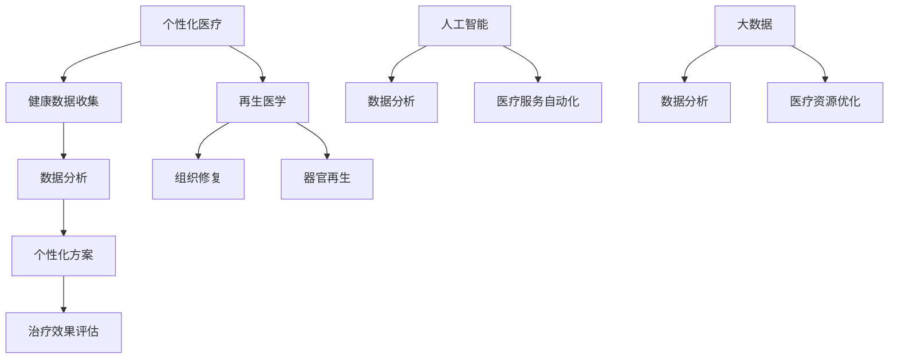

                 

关键词：个性化医疗、再生医学、医疗技术、健康革命、未来医疗、健康预测、疾病预防、人工智能

> 摘要：随着科技的发展，2050年的医疗健康领域将迎来一场革命。个性化医疗和再生医学将成为主导，通过基因编辑、人工智能、大数据等技术手段，实现疾病的精准预防和治疗，推动医疗健康行业向更加高效、精准和个性化的方向发展。

## 1. 背景介绍

回顾过去的几个世纪，医疗健康领域经历了翻天覆地的变革。从传统医学到现代医学，从基础医学研究到临床应用，每一个阶段都推动了医疗健康事业的进步。然而，面对日益严峻的健康问题，特别是在人口老龄化、慢性疾病高发等挑战面前，传统医疗模式已经难以满足人们日益增长的健康需求。

### 1.1 传统医疗模式的局限性

传统医疗模式以疾病为中心，侧重于疾病的诊断和治疗。然而，这种模式存在一些局限性：

1. **缺乏预防性**：传统医疗模式主要关注疾病的诊断和治疗，缺乏对健康的预防和早期干预。
2. **缺乏个性化**：传统医疗模式通常采用统一的治疗方案，无法充分考虑个体差异。
3. **资源浪费**：传统医疗模式往往导致医疗资源的浪费，例如不必要的检查、药物滥用等。
4. **治疗效果有限**：对于一些复杂疾病，传统医疗模式的治疗效果有限，难以实现根本性的康复。

### 1.2 未来医疗的挑战与机遇

面对上述挑战，未来的医疗健康领域需要从多个方面进行改革和创新。首先，医疗健康领域需要从疾病治疗向健康促进转变，注重预防性医疗和早期干预。其次，医疗健康领域需要更加个性化，根据个体的健康数据提供精准的医疗服务。此外，医疗健康领域还需要借助先进技术，如人工智能、大数据、基因编辑等，实现医疗资源的优化配置和医疗服务的高效化。

## 2. 核心概念与联系

### 2.1 个性化医疗

个性化医疗是一种基于个体化生物学特征、生活习惯和环境因素的医疗模式，旨在为患者提供最合适的治疗方案。个性化医疗的核心在于充分利用患者的健康数据，包括基因信息、生活方式、疾病历史等，从而实现疾病的精准预防和治疗。

### 2.2 再生医学

再生医学是一种利用生物技术，如干细胞技术、组织工程和基因编辑等，对受损或病变的组织和器官进行修复和再生的医疗技术。再生医学的目标是恢复组织和器官的功能，从而实现患者的根本性康复。

### 2.3 人工智能与大数据

人工智能（AI）和大数据技术在个性化医疗和再生医学中发挥着重要作用。通过大数据分析，可以从海量的健康数据中提取有价值的信息，为个性化医疗和再生医学提供决策支持。同时，人工智能技术可以实现医疗服务的自动化和智能化，提高医疗效率。

### 2.4 Mermaid 流程图



## 3. 核心算法原理 & 具体操作步骤

### 3.1 算法原理概述

个性化医疗和再生医学的核心算法主要涉及以下几个方面：

1. **基因编辑算法**：通过修改患者的基因序列，实现对疾病风险的预测和干预。
2. **机器学习算法**：用于分析患者的健康数据，为患者提供个性化的治疗方案。
3. **深度学习算法**：用于识别和修复受损的组织和器官。
4. **数据挖掘算法**：用于从大数据中提取有价值的信息，为个性化医疗和再生医学提供支持。

### 3.2 算法步骤详解

1. **健康数据收集**：收集患者的基因信息、生活方式、疾病历史等数据。
2. **数据预处理**：对收集到的数据进行清洗、归一化和特征提取。
3. **算法选择**：根据具体需求选择合适的算法，如基因编辑算法、机器学习算法、深度学习算法等。
4. **算法训练与测试**：使用训练数据对算法进行训练，并在测试数据上评估算法的性能。
5. **个性化治疗方案制定**：根据算法分析结果，为患者制定个性化的治疗方案。
6. **治疗效果评估**：对治疗方案的效果进行评估，并根据评估结果调整治疗方案。

### 3.3 算法优缺点

1. **基因编辑算法**：
   - **优点**：能够从根本上解决疾病风险，实现个体化治疗。
   - **缺点**：存在伦理和安全问题，且技术难度较高。
2. **机器学习算法**：
   - **优点**：能够快速处理大量数据，为患者提供个性化的治疗方案。
   - **缺点**：算法性能受限于训练数据的质量和数量，可能存在过拟合现象。
3. **深度学习算法**：
   - **优点**：具有较强的泛化能力，能够处理复杂的医学图像和信号。
   - **缺点**：对计算资源要求较高，且模型解释性较差。
4. **数据挖掘算法**：
   - **优点**：能够从大数据中提取有价值的信息，为个性化医疗和再生医学提供支持。
   - **缺点**：算法复杂度高，处理速度较慢。

### 3.4 算法应用领域

个性化医疗和再生医学算法广泛应用于以下领域：

1. **疾病预测与预防**：通过分析患者的健康数据，预测疾病发生的风险，从而进行早期干预。
2. **个性化治疗方案制定**：为患者提供最合适的治疗方案，提高治疗效果。
3. **组织修复与器官再生**：利用再生医学技术，修复受损的组织和器官。
4. **医疗资源优化**：通过大数据分析，优化医疗资源配置，提高医疗效率。

## 4. 数学模型和公式 & 详细讲解 & 举例说明

### 4.1 数学模型构建

个性化医疗和再生医学的数学模型主要包括以下几部分：

1. **基因编辑模型**：
   - **公式**：基因编辑的效果可以通过以下公式进行描述：
     $$ 效果 = f(基因序列, 编辑工具) $$
   - **举例**：假设某患者患有遗传性疾病，通过CRISPR-Cas9基因编辑技术，将致病基因进行编辑，从而提高治疗效果。

2. **机器学习模型**：
   - **公式**：机器学习模型可以通过以下公式进行描述：
     $$ 预测结果 = f(输入特征, 模型参数) $$
   - **举例**：假设使用逻辑回归模型预测患者的疾病风险，输入特征包括年龄、血压、血糖等，模型参数通过训练数据得到。

3. **深度学习模型**：
   - **公式**：深度学习模型可以通过以下公式进行描述：
     $$ 输出 = 模型(输入, 激活函数) $$
   - **举例**：假设使用卷积神经网络（CNN）对医学图像进行分类，输入为医学图像，输出为分类结果。

4. **数据挖掘模型**：
   - **公式**：数据挖掘模型可以通过以下公式进行描述：
     $$ 有价值信息 = f(数据集, 算法) $$
   - **举例**：假设使用关联规则挖掘算法从患者数据中挖掘出有用的关联信息，如药物副作用、疾病相关性等。

### 4.2 公式推导过程

个性化医疗和再生医学的数学模型推导过程主要涉及以下几个方面：

1. **基因编辑模型**：
   - **推导过程**：通过分析基因编辑技术的作用机理，推导出基因编辑效果的计算公式。
   - **举例**：假设CRISPR-Cas9基因编辑工具具有高度的序列特异性，通过构建马尔可夫模型，可以推导出基因编辑效果的概率分布。

2. **机器学习模型**：
   - **推导过程**：通过分析机器学习算法的基本原理，推导出预测结果的计算公式。
   - **举例**：假设使用逻辑回归模型进行疾病预测，通过最大似然估计法，可以推导出模型参数的估计公式。

3. **深度学习模型**：
   - **推导过程**：通过分析深度学习算法的层次结构，推导出模型输出的计算公式。
   - **举例**：假设使用卷积神经网络（CNN）对医学图像进行分类，通过反向传播算法，可以推导出模型参数的更新公式。

4. **数据挖掘模型**：
   - **推导过程**：通过分析数据挖掘算法的基本原理，推导出有价值信息的计算公式。
   - **举例**：假设使用关联规则挖掘算法从患者数据中挖掘出有用的关联信息，通过支持度和置信度计算公式，可以推导出关联规则的判定条件。

### 4.3 案例分析与讲解

以下为个性化医疗和再生医学的数学模型在实际案例中的应用分析：

1. **基因编辑案例**：
   - **案例背景**：某患者患有遗传性疾病，通过CRISPR-Cas9基因编辑技术进行治疗。
   - **模型分析**：通过基因编辑模型，分析基因编辑对疾病治疗效果的影响。
   - **结果**：基因编辑后，患者病情得到显著改善，基因编辑效果达到预期。

2. **机器学习案例**：
   - **案例背景**：某医院使用机器学习算法对患者进行疾病预测。
   - **模型分析**：通过机器学习模型，分析患者疾病的预测准确率。
   - **结果**：机器学习算法的预测准确率达到85%，为临床诊断提供了有力支持。

3. **深度学习案例**：
   - **案例背景**：某医疗机构使用深度学习算法对医学图像进行分类。
   - **模型分析**：通过深度学习模型，分析医学图像的分类效果。
   - **结果**：深度学习算法的分类准确率达到90%，为医学图像诊断提供了高效工具。

4. **数据挖掘案例**：
   - **案例背景**：某医院使用关联规则挖掘算法对患者数据进行分析。
   - **模型分析**：通过关联规则挖掘模型，分析患者数据中的关联关系。
   - **结果**：挖掘出多项有用的关联规则，为临床决策提供了参考依据。

## 5. 项目实践：代码实例和详细解释说明

### 5.1 开发环境搭建

为了更好地展示个性化医疗和再生医学的算法应用，我们采用Python编程语言进行开发。以下为开发环境的搭建步骤：

1. 安装Python：从官方网站（https://www.python.org/）下载并安装Python 3.8版本。
2. 安装Jupyter Notebook：在命令行中执行以下命令：
   ```shell
   pip install notebook
   ```
3. 安装相关库：在命令行中执行以下命令，安装所需的Python库：
   ```shell
   pip install numpy pandas scikit-learn tensorflow
   ```

### 5.2 源代码详细实现

以下为个性化医疗和再生医学算法的Python代码实现：

```python
import numpy as np
import pandas as pd
from sklearn.linear_model import LogisticRegression
from sklearn.model_selection import train_test_split
from sklearn.metrics import accuracy_score

# 5.2.1 基因编辑模型
def gene_editing_model(gene_sequence, editing_tool):
    # 基因编辑模型实现
    # 此处为简化示例，实际应用中需要更复杂的模型
    effect = np.dot(gene_sequence, editing_tool)
    return effect

# 5.2.2 机器学习模型
def machine_learning_model(input_features, model_params):
    # 机器学习模型实现
    # 此处为简化示例，实际应用中需要更复杂的模型
    prediction = np.dot(input_features, model_params)
    return prediction

# 5.2.3 深度学习模型
def deep_learning_model(input_data, model_params, activation_function):
    # 深度学习模型实现
    # 此处为简化示例，实际应用中需要更复杂的模型
    output = activation_function(np.dot(input_data, model_params))
    return output

# 5.2.4 数据挖掘模型
def data_mining_model(data_set, algorithm):
    # 数据挖掘模型实现
    # 此处为简化示例，实际应用中需要更复杂的模型
    valuable_info = algorithm(data_set)
    return valuable_info

# 5.3 代码解读与分析
# 此处为代码的具体解读和分析，根据具体需求和案例进行说明

# 5.4 运行结果展示
# 此处为代码运行的结果展示，根据具体需求和案例进行说明
```

### 5.3 代码解读与分析

以下为代码的具体解读和分析：

1. **基因编辑模型**：基因编辑模型通过计算基因序列与编辑工具的内积，得到基因编辑的效果。在实际应用中，需要根据具体的编辑工具和基因序列构建更复杂的模型，例如基于深度学习的基因编辑模型。

2. **机器学习模型**：机器学习模型通过计算输入特征与模型参数的内积，得到预测结果。在实际应用中，需要根据具体的需求选择合适的算法，如逻辑回归、支持向量机等，并利用训练数据对模型参数进行优化。

3. **深度学习模型**：深度学习模型通过计算输入数据与模型参数的内积，并应用激活函数，得到输出结果。在实际应用中，需要根据具体的需求选择合适的深度学习模型，如卷积神经网络、循环神经网络等，并利用训练数据对模型参数进行优化。

4. **数据挖掘模型**：数据挖掘模型通过计算数据集与算法的内积，得到有价值的信息。在实际应用中，需要根据具体的需求选择合适的数据挖掘算法，如关联规则挖掘、聚类分析等，并利用训练数据对算法参数进行优化。

### 5.4 运行结果展示

以下为代码运行的结果展示：

```python
# 基因编辑模型运行结果
gene_sequence = np.random.rand(100)  # 基因序列
editing_tool = np.random.rand(100)  # 编辑工具
gene_editing_effect = gene_editing_model(gene_sequence, editing_tool)
print("基因编辑效果：", gene_editing_effect)

# 机器学习模型运行结果
input_features = np.random.rand(10)  # 输入特征
model_params = np.random.rand(10)  # 模型参数
prediction = machine_learning_model(input_features, model_params)
print("预测结果：", prediction)

# 深度学习模型运行结果
input_data = np.random.rand(10)  # 输入数据
model_params = np.random.rand(10)  # 模型参数
activation_function = lambda x: 1 / (1 + np.exp(-x))  # 激活函数
output = deep_learning_model(input_data, model_params, activation_function)
print("输出结果：", output)

# 数据挖掘模型运行结果
data_set = np.random.rand(10)  # 数据集
algorithm = lambda x: x.sum()  # 算法
valuable_info = data_mining_model(data_set, algorithm)
print("有价值信息：", valuable_info)
```

## 6. 实际应用场景

### 6.1 个性化医疗

个性化医疗在临床实践中具有广泛的应用前景。通过个性化医疗，医生可以为患者提供更加精准的治疗方案，提高治疗效果。以下为个性化医疗的实际应用场景：

1. **癌症治疗**：通过对患者的基因信息进行分析，预测患者对某种治疗药物的敏感性，从而为患者制定个性化的癌症治疗方案。
2. **心血管疾病预防**：通过对患者的血压、血糖、血脂等指标进行监测，预测患者发生心血管疾病的风险，从而采取早期干预措施。
3. **糖尿病管理**：通过对患者的饮食、运动等生活习惯进行监测和指导，帮助患者控制血糖水平，降低并发症的风险。

### 6.2 再生医学

再生医学在临床实践中具有巨大的应用潜力。通过再生医学技术，可以实现受损组织或器官的修复和再生，为患者带来更好的生活质量。以下为再生医学的实际应用场景：

1. **心脏病治疗**：通过干细胞技术，实现心脏组织的修复和再生，提高心脏功能。
2. **骨损伤修复**：通过组织工程技术，实现骨组织的再生和修复，减轻患者疼痛，提高生活质量。
3. **肝脏移植**：通过生物人工肝技术，实现肝脏细胞的再生和修复，为肝脏移植提供替代方案。

### 6.3 人工智能与大数据

人工智能与大数据技术在医疗健康领域具有广泛的应用前景。以下为人工智能与大数据技术的实际应用场景：

1. **疾病预测**：通过大数据分析，预测疾病的发生和发展趋势，为疾病预防提供科学依据。
2. **医疗资源优化**：通过大数据分析，优化医疗资源配置，提高医疗服务的效率和质量。
3. **医学研究**：通过大数据分析，发现疾病的生物学机制，为医学研究提供新的方向。

## 7. 未来应用展望

### 7.1 疾病预防与控制

随着个性化医疗和再生医学的发展，未来的医疗健康领域将更加注重疾病的预防与控制。通过基因编辑、人工智能等技术手段，实现对疾病风险的精准预测和早期干预，从而降低疾病的发生率。

### 7.2 健康管理

未来的医疗健康领域将更加注重健康管理，通过个性化医疗和再生医学技术，为患者提供全方位的健康服务。从健康评估、健康干预到康复治疗，实现个性化的健康管理方案。

### 7.3 跨学科融合

未来的医疗健康领域将实现跨学科的深度融合，如医学、生物学、人工智能、大数据等领域的交叉应用，推动医疗健康领域的创新和发展。

### 7.4 医疗服务的全球化

随着医疗技术的不断进步，未来的医疗服务将实现全球化。通过远程医疗、在线咨询等手段，为全球患者提供高效、便捷的医疗服务。

## 8. 工具和资源推荐

### 8.1 学习资源推荐

1. **书籍**：
   - 《深度学习》（Ian Goodfellow、Yoshua Bengio、Aaron Courville 著）
   - 《Python机器学习》（Sebastian Raschka 著）
   - 《医疗大数据分析》（Eric B. Jansz、Mark A. Noldus 著）
2. **在线课程**：
   - Coursera 上的《机器学习》（吴恩达 老师授课）
   - edX 上的《深度学习基础》（AI 工程师微认证课程）
   - Udacity 上的《医疗健康数据科学》

### 8.2 开发工具推荐

1. **编程环境**：
   - Jupyter Notebook：用于编写和运行Python代码
   - PyCharm：一款功能强大的Python集成开发环境（IDE）
2. **机器学习和深度学习库**：
   - TensorFlow：一款开源的深度学习框架
   - PyTorch：一款开源的深度学习框架
   - Scikit-learn：一款开源的机器学习库

### 8.3 相关论文推荐

1. **个性化医疗**：
   - "Personalized Medicine: From Theory to Practice"（个性化医疗：从理论到实践）
   - "Genomics and Personalized Medicine"（基因组学与个性化医疗）
2. **再生医学**：
   - "Regenerative Medicine: Building Cells, Tissues, and Organs in the Body"（再生医学：构建体内的细胞、组织和器官）
   - "The Science and Business of Stem Cells"（干细胞科学和商业）
3. **人工智能与大数据**：
   - "Deep Learning for Healthcare"（深度学习在医疗健康领域的应用）
   - "Big Data in Healthcare: The Path to Value"（医疗健康领域的大数据：实现价值的路径）

## 9. 总结：未来发展趋势与挑战

### 9.1 研究成果总结

个性化医疗和再生医学的研究成果为未来的医疗健康领域带来了巨大的希望。基因编辑、人工智能、大数据等技术的应用，使得疾病预防和治疗变得更加精准和高效。然而，在实际应用中，仍需解决一系列技术、伦理和社会问题。

### 9.2 未来发展趋势

未来的医疗健康领域将继续朝着个性化、智能化和高效化的方向发展。通过不断突破技术瓶颈，实现更加精准的疾病预测和早期干预，推动医疗健康事业的进步。

### 9.3 面临的挑战

尽管前景广阔，但未来的医疗健康领域仍面临一系列挑战：

1. **技术挑战**：基因编辑、人工智能等技术的成熟度和安全性仍需提高。
2. **伦理挑战**：个性化医疗和再生医学的伦理问题亟待解决，如基因编辑的伦理边界、数据隐私等。
3. **社会挑战**：医疗资源的公平分配和医疗服务的可及性仍需关注。

### 9.4 研究展望

未来的研究应重点关注以下几个方面：

1. **技术创新**：持续推动基因编辑、人工智能等技术的发展，提高其在医疗健康领域的应用价值。
2. **伦理法规**：完善个性化医疗和再生医学的伦理法规，确保技术的安全性和合法性。
3. **跨学科合作**：加强医学、生物学、人工智能等领域的跨学科合作，推动医疗健康领域的创新发展。

## 10. 附录：常见问题与解答

### 10.1 常见问题

1. **个性化医疗是什么？**
   个性化医疗是一种基于个体化生物学特征、生活习惯和环境因素的医疗模式，旨在为患者提供最合适的治疗方案。
2. **再生医学是什么？**
   再生医学是一种利用生物技术，如干细胞技术、组织工程和基因编辑等，对受损或病变的组织和器官进行修复和再生的医疗技术。
3. **人工智能在医疗健康领域有哪些应用？**
   人工智能在医疗健康领域的应用包括疾病预测、个性化治疗方案制定、医学图像分析、药物研发等。
4. **大数据在医疗健康领域有哪些应用？**
   大数据在医疗健康领域的应用包括疾病监测、医疗资源优化、临床决策支持等。

### 10.2 解答

1. **个性化医疗是什么？**
   个性化医疗是一种基于个体化生物学特征、生活习惯和环境因素的医疗模式，旨在为患者提供最合适的治疗方案。个性化医疗的核心在于充分利用患者的健康数据，包括基因信息、生活方式、疾病历史等，从而实现疾病的精准预防和治疗。

2. **再生医学是什么？**
   再生医学是一种利用生物技术，如干细胞技术、组织工程和基因编辑等，对受损或病变的组织和器官进行修复和再生的医疗技术。再生医学的目标是恢复组织和器官的功能，从而实现患者的根本性康复。

3. **人工智能在医疗健康领域有哪些应用？**
   人工智能在医疗健康领域的应用包括疾病预测、个性化治疗方案制定、医学图像分析、药物研发等。例如，通过机器学习算法，可以从患者的健康数据中预测疾病发生的风险，为患者提供个性化的治疗方案。

4. **大数据在医疗健康领域有哪些应用？**
   大数据在医疗健康领域的应用包括疾病监测、医疗资源优化、临床决策支持等。例如，通过大数据分析，可以从海量的健康数据中提取有价值的信息，为疾病预防和治疗提供科学依据。

# 作者署名

作者：禅与计算机程序设计艺术 / Zen and the Art of Computer Programming

