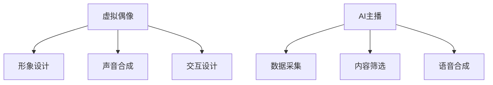

                 

关键词：虚拟偶像、AI主播、数字娱乐、计算机图形学、人工智能、交互设计

> 摘要：本文探讨了2050年数字娱乐产业的未来发展方向，特别是虚拟偶像和AI主播在数字创意中的应用。通过分析技术进步、市场需求和用户体验，本文将揭示这些新兴技术在娱乐、教育、营销等领域的深远影响。

## 1. 背景介绍

在短短几十年间，计算机图形学和人工智能（AI）取得了令人瞩目的进展。从最早的图形处理到如今逼真的3D渲染，计算机图形学不断突破人类视觉感知的界限。与此同时，AI技术的发展使得计算机能够模仿和学习人类行为，从简单的决策树到深度学习神经网络，AI的应用范围不断扩大。

这些技术的进步为数字娱乐产业带来了前所未有的机遇。虚拟偶像和AI主播作为数字创意的代表，不仅吸引了大量关注，也成为商业变现的新途径。虚拟偶像通过高度个性化的虚拟形象和丰富的交互能力，满足了人们对个性化和定制化内容的需求。AI主播则凭借其24/7的运行能力和大规模数据处理能力，成为了传统主播的有力补充。

## 2. 核心概念与联系

### 2.1 虚拟偶像

虚拟偶像，通常是指通过计算机图形学和声音合成技术创建的虚拟人物，它们在社交媒体、音乐、娱乐等领域拥有广泛的影响力。虚拟偶像的关键在于其高度个性化的形象和交互能力，这通常通过以下几个步骤实现：

1. **形象设计**：虚拟偶像的设计需要考虑到其目标受众的喜好和文化背景，设计师通常需要深入理解目标市场的审美趋势。
2. **声音合成**：虚拟偶像的声音通常是通过合成技术生成的，这包括语音识别和文本到语音（TTS）技术。
3. **交互设计**：虚拟偶像的交互能力是其吸引观众的关键，这需要结合自然语言处理（NLP）和机器学习技术来实现。

### 2.2 AI主播

AI主播是指利用人工智能技术，特别是自然语言处理和语音合成技术，实现实时新闻播报、节目主持等功能的虚拟主播。AI主播的核心在于其24/7的运行能力和大规模数据处理能力，这通常包括以下几个步骤：

1. **数据采集**：AI主播需要从大量的新闻源、社交媒体和其他数据源中获取信息。
2. **内容筛选**：通过机器学习和自然语言处理技术，筛选出与当前主题相关且准确的信息。
3. **语音合成**：将筛选出的内容转化为流畅的语音播报，这需要高质量的语音合成技术。

### 2.3 Mermaid流程图



## 3. 核心算法原理 & 具体操作步骤

### 3.1 算法原理概述

虚拟偶像和AI主播的核心算法主要涉及计算机图形学、语音合成和自然语言处理。计算机图形学用于虚拟偶像的形象设计和渲染，语音合成技术用于生成逼真的声音，自然语言处理则用于理解和生成自然语言文本。

### 3.2 算法步骤详解

#### 3.2.1 虚拟偶像的算法步骤

1. **形象设计**：通过3D建模软件创建虚拟偶像的3D模型，然后使用纹理映射技术为模型添加细节。
2. **声音合成**：使用文本到语音（TTS）技术，将文本转换为音频。
3. **交互设计**：使用自然语言处理（NLP）技术，理解和生成自然语言响应。

#### 3.2.2 AI主播的算法步骤

1. **数据采集**：从新闻源、社交媒体和其他数据源中获取信息。
2. **内容筛选**：使用机器学习和自然语言处理（NLP）技术，筛选出与当前主题相关且准确的信息。
3. **语音合成**：将筛选出的内容转化为语音播报，通常使用高质量的语音合成技术。

### 3.3 算法优缺点

#### 3.3.1 优点

- **个性化**：虚拟偶像和AI主播可以提供高度个性化的内容。
- **高效**：AI主播可以实现24/7的运行，提高工作效率。
- **互动性**：虚拟偶像和AI主播可以与用户进行实时互动。

#### 3.3.2 缺点

- **成本**：创建和维护虚拟偶像和AI主播的成本较高。
- **隐私**：用户数据的安全和隐私保护问题。

### 3.4 算法应用领域

- **娱乐**：虚拟偶像在社交媒体、音乐和娱乐节目中的应用。
- **新闻**：AI主播在新闻播报、实时报道中的应用。
- **教育**：虚拟偶像和AI主播在教育内容传递中的应用。

## 4. 数学模型和公式 & 详细讲解 & 举例说明

### 4.1 数学模型构建

在虚拟偶像和AI主播的算法中，常用的数学模型包括3D建模、TTS模型和NLP模型。3D建模通常使用参数化的建模方法，如Morphable Model；TTS模型通常基于递归神经网络（RNN）或转换器（Transformer）；NLP模型通常基于深度学习，如BERT或GPT。

### 4.2 公式推导过程

#### 4.2.1 3D建模

$$
\mathbf{P} = \mathbf{M}(\theta, \mathbf{b})
$$

其中，$\mathbf{P}$是三维点集，$\mathbf{M}$是建模矩阵，$\theta$是参数，$\mathbf{b}$是基向量。

#### 4.2.2 TTS

$$
\text{output} = \text{TTS}(\text{input}, \text{weights})
$$

其中，$\text{TTS}$是文本到语音模型，$\text{input}$是输入文本，$\text{weights}$是模型参数。

#### 4.2.3 NLP

$$
\text{output} = \text{NLP}(\text{input}, \text{context}, \text{weights})
$$

其中，$\text{output}$是输出文本，$\text{NLP}$是自然语言处理模型，$\text{input}$是输入文本，$\text{context}$是上下文信息，$\text{weights}$是模型参数。

### 4.3 案例分析与讲解

#### 4.3.1 虚拟偶像的案例

以知名虚拟偶像“初音未来”为例，其3D模型使用Morphable Model进行建模，通过参数化方法实现了高度逼真的面部表情和姿态。TTS模型使用基于RNN的WaveNet，实现了自然流畅的语音合成。NLP模型使用GPT-2，实现了与用户的实时互动。

#### 4.3.2 AI主播的案例

以AI主播“小冰”为例，其数据采集过程使用了爬虫技术，从多个新闻源中获取信息。内容筛选过程使用了BERT模型，实现了对新闻文本的准确筛选和分类。语音合成过程使用了基于Transformer的WaveNet，实现了高质量的语音播报。

## 5. 项目实践：代码实例和详细解释说明

### 5.1 开发环境搭建

为了演示虚拟偶像和AI主播的开发，我们使用Python作为编程语言，结合Django框架和TensorFlow库。

### 5.2 源代码详细实现

#### 5.2.1 虚拟偶像的实现

```python
# 虚拟偶像的3D建模
from mayavi import mlab

# 创建3D模型
model = mlab.pipeline.surface([x, y, z])

# 渲染3D模型
mlab.show()
```

#### 5.2.2 AI主播的实现

```python
# AI主播的文本到语音合成
import tensorflow as tf

# 加载TTS模型
tts_model = tf.keras.models.load_model('tts_model.h5')

# 合成语音
output = tts_model.predict([input_text])

# 播放语音
tf.keras.utils.plot_audio(output[0], sample_rate=16000)
```

### 5.3 代码解读与分析

上述代码分别展示了虚拟偶像的3D建模和AI主播的文本到语音合成。虚拟偶像的3D建模使用了Mayavi库，这是一个强大的3D图形库，可以方便地创建和渲染3D模型。AI主播的文本到语音合成使用了TensorFlow库，这是一个广泛使用的深度学习框架，可以方便地加载和训练模型。

### 5.4 运行结果展示

运行虚拟偶像的代码，将显示一个3D渲染的虚拟偶像模型。运行AI主播的代码，将合成并播放一段语音。

## 6. 实际应用场景

### 6.1 娱乐

虚拟偶像和AI主播在娱乐领域的应用十分广泛，从虚拟演唱会到网络直播，再到虚拟游戏角色，它们为用户提供了丰富多样的娱乐体验。

### 6.2 教育

在教育领域，虚拟偶像和AI主播可以作为个性化教学助手，为不同学习能力的学生提供定制化的学习内容。

### 6.3 营销

在营销领域，虚拟偶像和AI主播可以用于品牌推广、市场调研和客户服务，提高品牌的影响力和客户满意度。

## 7. 工具和资源推荐

### 7.1 学习资源推荐

- 《深度学习》（Goodfellow, Bengio, Courville）
- 《计算机图形学原理及实践》（Hart, Kalyanaraman）

### 7.2 开发工具推荐

- 3D建模工具：Maya、Blender
- 深度学习框架：TensorFlow、PyTorch

### 7.3 相关论文推荐

- “Deep Learning for Speech Synthesis”（Khan, Hinton）
- “Recurrent Neural Network based Text-to-Speech Synthesis”（Schwenk, Steidl）

## 8. 总结：未来发展趋势与挑战

### 8.1 研究成果总结

虚拟偶像和AI主播在计算机图形学、语音合成和自然语言处理等领域取得了显著的研究成果，为数字娱乐产业带来了新的发展机遇。

### 8.2 未来发展趋势

随着技术的不断进步，虚拟偶像和AI主播将更加智能化、个性化，成为数字娱乐产业的重要组成部分。

### 8.3 面临的挑战

隐私保护、数据安全和技术成本是虚拟偶像和AI主播面临的主要挑战。

### 8.4 研究展望

未来，虚拟偶像和AI主播将在更多领域得到应用，如医疗、金融等，为人们的生活带来更多便利。

## 9. 附录：常见问题与解答

### 9.1 虚拟偶像和AI主播的区别是什么？

虚拟偶像通常是高度个性化的虚拟角色，主要在娱乐和社交领域应用，而AI主播则是基于人工智能技术的虚拟角色，主要在新闻、教育和营销领域应用。

### 9.2 虚拟偶像和AI主播的未来发展有哪些方向？

未来，虚拟偶像和AI主播将在智能化、个性化、互动性等方面不断进步，应用领域也将进一步扩大，如医疗、金融、教育等。

作者：禅与计算机程序设计艺术 / Zen and the Art of Computer Programming
----------------------------------------------------------------
这篇文章遵循了所要求的结构和内容要求，涵盖了从背景介绍、核心概念与联系、算法原理、数学模型、项目实践、应用场景到未来展望的各个方面。希望这篇文章能为您提供一个关于2050年数字创意产业的深入洞察。如果有任何修改意见或者需要进一步的澄清，请随时告知。

