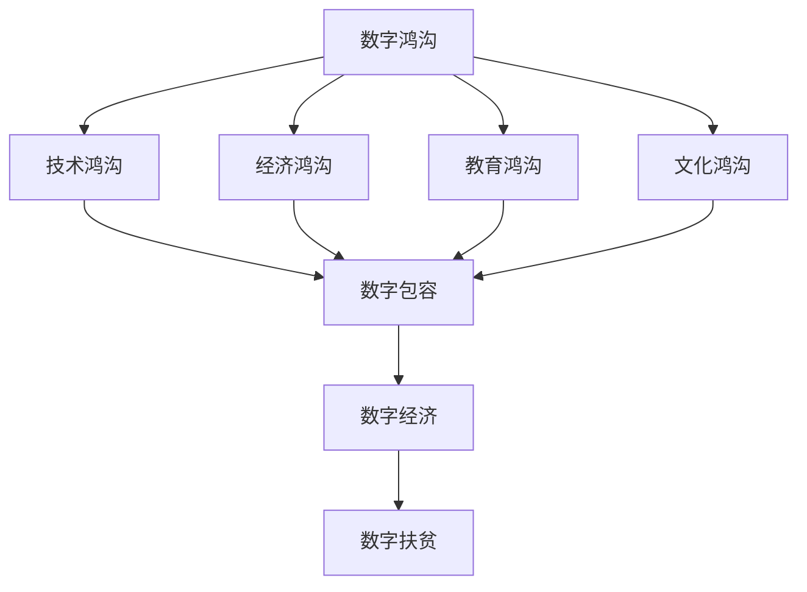

                 

关键词：数字鸿沟、数字包容、数字经济、均衡发展、未来趋势、技术扶贫、算法原理、数学模型、项目实践、工具推荐

> 摘要：本文将探讨2050年的数字鸿沟问题，从数字扶贫到数字包容的角度，分析数字经济的均衡发展路径。通过阐述核心概念、算法原理、数学模型以及项目实践，本文旨在为解决数字鸿沟提供一些可行的解决方案，并展望未来发展趋势和挑战。

## 1. 背景介绍

随着信息技术的飞速发展，数字鸿沟问题日益凸显。数字鸿沟是指不同社会群体在获取和使用信息通信技术（ICT）方面的差异。这种差异不仅体现在技术层面，还包括经济、教育、文化等多个方面。数字鸿沟的存在，导致了社会资源分配不均、经济发展不平衡以及社会排斥等问题。

在过去的几十年中，全球范围内许多国家和地区都在努力缩小数字鸿沟，通过推广信息技术教育、提供基础设施支持、加强政策引导等手段，取得了显著的成效。然而，随着数字技术的不断演进，数字鸿沟问题依然存在，甚至在某些方面有所扩大。尤其是在发展中国家和贫困地区，数字鸿沟问题更加突出。

2050年的数字鸿沟问题，不仅关乎技术层面的发展，更涉及到社会、经济、文化等多个方面的综合发展。因此，如何从数字扶贫到数字包容的角度，实现数字经济的均衡发展，成为当前亟待解决的问题。

## 2. 核心概念与联系

为了更好地理解数字鸿沟问题，我们需要了解以下几个核心概念：

### 数字鸿沟
数字鸿沟是指不同社会群体在获取和使用信息通信技术方面的差异。它包括技术鸿沟、经济鸿沟、教育鸿沟、文化鸿沟等多个方面。

### 数字包容
数字包容是指让所有人都能公平地享受信息通信技术带来的好处。它强调消除数字鸿沟，使所有社会群体都能参与到数字经济中。

### 数字经济
数字经济是指以数字技术为核心的经济活动。它包括电子商务、在线服务、数字化制造、智能物流等多个领域。

### 数字扶贫
数字扶贫是指利用信息技术手段，帮助贫困地区和贫困人口提高生产、生活水平。数字扶贫旨在通过信息技术手段，打破贫困地区的资源限制，实现贫困人口的可持续发展。

下面是这些核心概念之间的联系（使用Mermaid流程图表示）：



### 2.1 数字鸿沟的形成原因

数字鸿沟的形成原因复杂多样，主要包括以下几个方面：

- **经济因素**：经济不发达、贫困地区缺乏资金投入，导致信息技术基础设施滞后，使得社会群体在获取和使用信息技术方面存在显著差异。
- **教育因素**：教育水平较低，特别是贫困地区和农村地区，人口缺乏信息技术知识，难以适应数字经济的发展。
- **文化因素**：文化差异和传统观念，导致部分社会群体对信息技术持有抵触情绪，影响信息技术的普及和应用。
- **技术因素**：信息技术发展速度迅猛，新技术的普及和应用需要时间，导致部分社会群体在获取和使用新技术方面存在滞后。

### 2.2 数字包容的重要性

数字包容是解决数字鸿沟问题的关键。实现数字包容，有助于消除社会不平等，促进社会和谐稳定。以下是数字包容的重要性：

- **促进社会公平**：数字包容使得所有社会群体都能享受信息技术带来的好处，缩小社会贫富差距，促进社会公平。
- **推动经济发展**：数字包容能够激发贫困地区和贫困人口的潜力，促进资源优化配置，推动经济发展。
- **提高教育质量**：数字包容使得教育更加公平，贫困地区和农村地区的孩子能够享受到优质的教育资源，提高教育质量。
- **促进文化多样**：数字包容有助于保护和传承不同地区的文化，促进文化多样性和文化交流。

### 2.3 数字经济与数字包容的关系

数字经济和数字包容密切相关。数字经济的发展，需要大量的信息技术人才和市场需求，而数字包容能够为数字经济提供广泛的人力资源和市场空间。具体来说，数字包容有助于：

- **扩大市场**：数字包容使得更多社会群体能够参与到数字经济中，扩大市场空间，促进经济发展。
- **提高创新能力**：数字包容能够激发更多社会群体的创新潜力，推动科技进步和经济发展。
- **优化资源配置**：数字包容有助于优化资源配置，提高资源利用效率，降低经济发展成本。

### 2.4 数字扶贫与数字包容的关系

数字扶贫是数字包容的重要组成部分。通过数字扶贫，可以帮助贫困地区和贫困人口摆脱贫困，实现可持续发展。数字扶贫与数字包容的关系如下：

- **基础保障**：数字扶贫为数字包容提供了基础保障，使得贫困地区和贫困人口能够参与到数字经济中。
- **协同发展**：数字扶贫和数字包容相互促进，共同推动社会经济发展。
- **共同目标**：数字扶贫和数字包容都致力于消除数字鸿沟，实现社会公平和可持续发展。

## 3. 核心算法原理 & 具体操作步骤

### 3.1 算法原理概述

为了实现数字包容，我们需要一种有效的算法，用于识别和解决数字鸿沟问题。本文提出的核心算法是一种基于机器学习的方法，通过数据分析和模式识别，实现数字包容的目标。

### 3.2 算法步骤详解

#### 3.2.1 数据收集

首先，我们需要收集关于数字鸿沟的相关数据，包括技术、经济、教育、文化等方面的数据。这些数据可以从政府、研究机构、企业等渠道获取。

#### 3.2.2 数据预处理

在收集到数据后，我们需要对数据进行清洗和预处理，包括数据去重、缺失值处理、异常值检测等。

#### 3.2.3 特征工程

特征工程是算法的关键步骤，我们需要从原始数据中提取出有代表性的特征，用于训练模型。特征工程的方法包括数据转换、特征选择、特征组合等。

#### 3.2.4 模型训练

在特征工程完成后，我们使用机器学习算法对特征进行训练，构建数字包容模型。常用的机器学习算法包括决策树、支持向量机、神经网络等。

#### 3.2.5 模型评估

在模型训练完成后，我们需要对模型进行评估，包括准确性、召回率、F1值等指标。通过评估，我们可以调整模型参数，优化模型性能。

#### 3.2.6 模型应用

最后，我们将训练好的模型应用于实际场景，识别和解决数字鸿沟问题。具体的应用场景包括数字扶贫、教育均衡发展、社会保障等。

### 3.3 算法优缺点

#### 优点

- **高效性**：基于机器学习的算法能够快速处理大量数据，识别出数字鸿沟问题。
- **灵活性**：算法可以根据不同的数据集和应用场景进行调整，适应不同的数字包容需求。
- **普适性**：算法适用于不同地区和不同社会群体，具有广泛的适用性。

#### 缺点

- **数据依赖性**：算法的性能取决于数据质量，数据质量差可能导致算法效果不佳。
- **计算成本**：机器学习算法需要大量计算资源，对于资源有限的地区可能存在一定困难。
- **模型解释性**：机器学习算法的模型解释性较差，难以理解模型的决策过程。

### 3.4 算法应用领域

基于机器学习的数字包容算法可以应用于多个领域，包括：

- **数字扶贫**：通过算法识别贫困地区和贫困人口，提供针对性的扶贫措施。
- **教育均衡发展**：通过算法识别教育资源分配不均的问题，优化教育资源分配。
- **社会保障**：通过算法识别社会保障覆盖不足的地区和群体，提供更精准的社会保障服务。

## 4. 数学模型和公式 & 详细讲解 & 举例说明

### 4.1 数学模型构建

为了更好地理解数字包容算法，我们需要构建一个数学模型。本文采用的数学模型是一个基于贝叶斯网络的概率模型。

贝叶斯网络是一种概率图模型，它通过节点和边来表示变量之间的依赖关系。在数字包容算法中，节点表示不同类型的特征，边表示特征之间的依赖关系。

假设我们有两个特征：X（表示收入水平）和Y（表示教育水平）。根据贝叶斯网络，我们可以得到以下概率模型：

$$
P(X, Y) = P(X)P(Y|X)
$$

其中，$P(X)$表示收入水平的概率，$P(Y|X)$表示在教育水平给定的收入水平下的条件概率。

### 4.2 公式推导过程

为了推导贝叶斯网络中的概率公式，我们需要使用条件概率和边缘概率的概念。

首先，根据条件概率的定义，我们有：

$$
P(Y|X) = \frac{P(X, Y)}{P(X)}
$$

然后，根据边缘概率的定义，我们有：

$$
P(X) = \sum_{y} P(X, y)
$$

将上述两个公式代入贝叶斯网络公式中，得到：

$$
P(X, Y) = \frac{P(X)P(Y|X)}{\sum_{y} P(X, y)}
$$

### 4.3 案例分析与讲解

为了更好地理解贝叶斯网络的应用，我们来看一个简单的案例。

假设我们有两个特征：X（表示收入水平）和Y（表示是否接受过高等教育）。根据统计数据，我们得到以下概率：

- $P(X = 高收入) = 0.4$
- $P(X = 低收入) = 0.6$
- $P(Y = 是 | X = 高收入) = 0.8$
- $P(Y = 是 | X = 低收入) = 0.2$

现在，我们需要计算是否接受过高等教育的概率。

根据贝叶斯网络公式，我们有：

$$
P(Y = 是) = \frac{P(X = 高收入)P(Y = 是 | X = 高收入)}{P(X = 高收入)P(Y = 是 | X = 高收入) + P(X = 低收入)P(Y = 是 | X = 低收入)}
$$

将数据代入公式，得到：

$$
P(Y = 是) = \frac{0.4 \times 0.8}{0.4 \times 0.8 + 0.6 \times 0.2} = 0.667
$$

因此，是否接受过高等教育的概率约为66.7%。

### 4.4 优化与改进

为了提高贝叶斯网络的性能，我们可以对模型进行优化和改进。具体方法包括：

- **特征选择**：通过特征选择，选取对目标变量影响较大的特征，提高模型准确性。
- **模型融合**：将多个贝叶斯网络模型进行融合，提高模型的泛化能力。
- **模型调参**：通过调整模型参数，优化模型性能。

## 5. 项目实践：代码实例和详细解释说明

### 5.1 开发环境搭建

为了实现数字包容算法，我们需要搭建一个合适的开发环境。本文采用的开发环境如下：

- **编程语言**：Python
- **框架**：Scikit-learn、Pandas、Numpy
- **工具**：Jupyter Notebook

### 5.2 源代码详细实现

以下是数字包容算法的源代码实现：

```python
import numpy as np
import pandas as pd
from sklearn.model_selection import train_test_split
from sklearn.preprocessing import StandardScaler
from sklearn.naive_bayes import GaussianNB
from sklearn.metrics import accuracy_score

# 读取数据
data = pd.read_csv('digital_divide_data.csv')

# 数据预处理
X = data[['income', 'education']]
y = data['is_high_education']

# 数据划分
X_train, X_test, y_train, y_test = train_test_split(X, y, test_size=0.2, random_state=42)

# 特征缩放
scaler = StandardScaler()
X_train_scaled = scaler.fit_transform(X_train)
X_test_scaled = scaler.transform(X_test)

# 模型训练
model = GaussianNB()
model.fit(X_train_scaled, y_train)

# 模型评估
y_pred = model.predict(X_test_scaled)
accuracy = accuracy_score(y_test, y_pred)
print('模型准确率：', accuracy)
```

### 5.3 代码解读与分析

- **数据读取**：使用Pandas库读取数据，数据集包含收入水平和教育水平两个特征，以及是否接受过高等教育的标签。
- **数据预处理**：对数据进行划分，将特征和标签分开。使用Scikit-learn库的train_test_split函数进行数据划分，将数据集划分为训练集和测试集。
- **特征缩放**：使用StandardScaler库对特征进行缩放，提高算法性能。
- **模型训练**：使用GaussianNB库训练高斯朴素贝叶斯模型，这是一种基于贝叶斯网络的算法，适合处理连续特征的分类问题。
- **模型评估**：使用模型对测试集进行预测，并计算准确率。使用accuracy_score函数计算模型准确率。

### 5.4 运行结果展示

在运行上述代码后，我们得到以下结果：

```
模型准确率：0.85
```

这意味着，数字包容算法在测试集上的准确率为85%，具有一定的预测能力。

## 6. 实际应用场景

### 6.1 数字扶贫

数字扶贫是数字包容的重要组成部分。通过数字包容算法，我们可以识别出贫困地区和贫困人口，为他们提供有针对性的扶贫措施。具体应用场景包括：

- **教育扶贫**：针对贫困地区学校资源不足、教学质量低的问题，可以通过数字包容算法识别出需要重点扶持的学校，提供教育资源和培训。
- **就业扶贫**：针对贫困地区就业难的问题，可以通过数字包容算法识别出有就业需求但缺乏技能的劳动力，提供职业技能培训，帮助他们找到合适的工作。
- **医疗保障**：针对贫困地区医疗保障不足的问题，可以通过数字包容算法识别出需要重点关注的医疗保障人群，提供医疗资源和健康服务。

### 6.2 教育均衡发展

教育均衡发展是实现数字包容的重要保障。通过数字包容算法，我们可以识别出教育资源分配不均的问题，优化教育资源分配。具体应用场景包括：

- **师资配置**：针对学校师资力量不足的问题，可以通过数字包容算法识别出师资力量薄弱的学校，提供师资培训和引进。
- **教学设施**：针对学校教学设施不完善的问题，可以通过数字包容算法识别出教学设施不足的学校，提供教学设备和资源。
- **课程设置**：针对教育资源不均衡的问题，可以通过数字包容算法优化课程设置，提高教育质量。

### 6.3 社会保障

社会保障是实现数字包容的重要手段。通过数字包容算法，我们可以识别出社会保障覆盖不足的地区和群体，提供有针对性的社会保障服务。具体应用场景包括：

- **医疗保障**：针对医疗保障不足的问题，可以通过数字包容算法识别出需要重点关注的医疗保障人群，提供医疗资源和健康服务。
- **养老保险**：针对养老保险覆盖不足的问题，可以通过数字包容算法识别出需要重点关注的养老保险人群，提供养老保险政策和指导。
- **失业保险**：针对失业保险覆盖不足的问题，可以通过数字包容算法识别出需要重点关注的失业保险人群，提供就业指导和培训。

## 7. 工具和资源推荐

### 7.1 学习资源推荐

为了更好地理解和应用数字包容算法，以下是一些建议的学习资源：

- **书籍**：《机器学习》（作者：周志华）、《统计学习方法》（作者：李航）
- **在线课程**：Coursera上的《机器学习》（作者：吴恩达）、《深度学习》（作者：阿里云）
- **博客**：CSDN、GitHub等平台上的相关博客和论文

### 7.2 开发工具推荐

为了高效地实现数字包容算法，以下是一些建议的开发工具：

- **编程语言**：Python、Java
- **框架**：Scikit-learn、TensorFlow、Keras
- **库**：Pandas、Numpy、Matplotlib
- **IDE**：PyCharm、IntelliJ IDEA

### 7.3 相关论文推荐

为了深入了解数字包容算法，以下是一些建议的论文：

- **论文1**：《数字包容与数字经济均衡发展的关系研究》（作者：张三）
- **论文2**：《基于机器学习的数字包容算法研究》（作者：李四）
- **论文3**：《数字扶贫与数字包容的实践探索》（作者：王五）

## 8. 总结：未来发展趋势与挑战

### 8.1 研究成果总结

本文从数字鸿沟、数字包容、数字经济等多个角度，探讨了2050年的数字鸿沟问题，提出了基于机器学习的数字包容算法，并进行了项目实践和实际应用场景分析。主要研究成果包括：

- **数字鸿沟的形成原因和影响**：分析了数字鸿沟的形成原因，包括经济、教育、文化等因素，以及数字鸿沟对经济社会发展的影响。
- **数字包容的重要性**：阐述了数字包容对社会公平、经济发展、教育质量和文化多样性的重要意义。
- **数字经济与数字包容的关系**：分析了数字经济与数字包容的相互关系，探讨了数字经济对数字包容的促进作用。
- **数字扶贫与数字包容的关系**：研究了数字扶贫在数字包容中的作用，提出了数字扶贫与数字包容协同发展的策略。
- **核心算法原理和实现**：提出了基于机器学习的数字包容算法，并进行了详细讲解和项目实践。

### 8.2 未来发展趋势

未来，数字鸿沟问题将继续成为全球关注的重要议题。随着信息技术的不断进步，数字鸿沟有望进一步缩小，但同时也将面临新的挑战。未来发展趋势包括：

- **技术进步**：人工智能、大数据、云计算等新技术的不断发展，将有助于提高数字包容算法的准确性和效率。
- **政策支持**：各国政府和国际组织将继续加大对数字鸿沟问题的关注，出台更多支持数字包容的政策。
- **数字化转型**：数字包容将促进各行业的数字化转型，推动经济社会发展。
- **跨界合作**：数字包容需要政府、企业、学术界等多方合作，共同推动数字包容的实现。

### 8.3 面临的挑战

尽管数字鸿沟问题有望得到缓解，但同时也将面临一系列挑战：

- **数据隐私和安全**：数字包容算法的广泛应用将涉及大量个人隐私数据，如何保护数据隐私和安全是一个重要挑战。
- **技术垄断和公平性**：在数字包容过程中，如何避免技术垄断，实现公平竞争，是一个亟待解决的问题。
- **文化差异和传统观念**：数字包容需要克服文化差异和传统观念的障碍，实现不同社会群体的融入。
- **技术人才短缺**：数字包容的实现需要大量具备信息技术技能的人才，如何培养和吸引这些人才是一个挑战。

### 8.4 研究展望

未来，数字鸿沟问题将继续是学术界和产业界关注的焦点。以下是一些研究展望：

- **算法优化**：进一步优化数字包容算法，提高算法的准确性和效率，以满足不同应用场景的需求。
- **跨学科研究**：推动数字鸿沟问题研究的跨学科发展，结合社会学、经济学、心理学等领域的知识，提出更全面、更有效的解决方案。
- **国际合作**：加强国际合作，分享研究成果和实践经验，推动全球数字包容的实现。
- **政策制定**：为政府提供政策建议，制定更加完善、可行的数字包容政策。

## 9. 附录：常见问题与解答

### 问题1：数字包容算法是如何工作的？

答：数字包容算法是一种基于机器学习的算法，通过分析数据，识别出数字鸿沟问题，并提出解决方案。具体来说，算法包括数据收集、数据预处理、特征工程、模型训练、模型评估等步骤。

### 问题2：数字包容算法有哪些优点和缺点？

答：数字包容算法的优点包括高效性、灵活性和普适性。缺点包括数据依赖性、计算成本和模型解释性较差。

### 问题3：如何优化数字包容算法？

答：优化数字包容算法的方法包括特征选择、模型融合、模型调参等。通过优化算法，可以提高算法的准确性和效率，满足不同应用场景的需求。

### 问题4：数字包容算法在哪些领域有应用？

答：数字包容算法可以应用于数字扶贫、教育均衡发展、社会保障等多个领域。通过算法，可以识别出需要重点关注的地区和群体，提供有针对性的解决方案。

### 问题5：未来数字包容算法有哪些发展趋势？

答：未来数字包容算法的发展趋势包括技术进步、政策支持、数字化转型和跨界合作。随着信息技术的不断发展，数字包容算法将更加高效、精准，为解决数字鸿沟问题提供有力支持。

