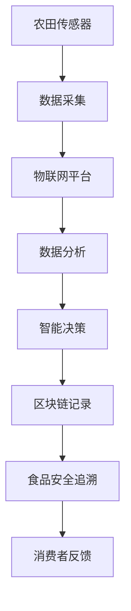

                 

关键词：2050年、食品安全、质量控制、农田、餐桌、AI、物联网、区块链、智能农业

> 摘要：本文探讨了2050年食品安全领域的未来趋势，分析从农田到餐桌的质量控制技术，如何利用人工智能、物联网和区块链等新兴技术，实现食品安全从源头到消费端的全面监控和保障。

## 1. 背景介绍

随着全球人口的不断增长和城市化进程的加速，食品安全问题愈发引起人们的关注。传统的食品安全控制方法已经无法满足现代社会的需求，尤其在食品供应链复杂化、消费者对食品品质要求提升的背景下。因此，如何通过技术创新，提升食品从生产到消费全流程的质量控制能力，成为亟待解决的问题。

预计到2050年，全球人口将达到100亿左右，粮食需求量将大幅增加。同时，气候变化、环境污染等问题也对农业生产带来了巨大挑战。为了保障全球食品安全，迫切需要借助先进技术手段，提升农田到餐桌的食品安全管理水平。

## 2. 核心概念与联系

在实现食品安全质量控制的过程中，人工智能（AI）、物联网（IoT）和区块链等技术起到了至关重要的作用。下面通过一个Mermaid流程图，展示这些核心概念之间的联系。



### 2.1 农田传感器

农田传感器是整个食品安全控制系统的起点。这些传感器可以实时监测土壤、空气、水分等环境参数，以及植物的生长状态。通过传感器收集的数据，可以反映农田的生产状况，为后续的质量控制提供基础信息。

### 2.2 数据采集

物联网平台负责收集农田传感器传输的数据。这些数据经过初步处理和清洗，可以被用于分析、决策和记录。

### 2.3 数据分析

数据分析是整个食品安全控制系统的核心。通过大数据分析和机器学习技术，可以对农田的生产过程进行实时监控，预测可能出现的食品安全问题，并提出相应的解决方案。

### 2.4 智能决策

智能决策系统根据数据分析的结果，自动调整农田管理策略，如灌溉、施肥、病虫害防治等。这些智能决策有助于提高农产品的产量和品质，减少食品安全风险。

### 2.5 区块链记录

区块链技术为食品安全数据提供了不可篡改的记录方式。通过对农产品从生产到消费全流程的数据记录，可以实现食品安全追溯，确保消费者对食品的安全信心。

### 2.6 食品安全追溯

食品安全追溯系统通过区块链技术，实现了食品从农田到餐桌的全程追踪。消费者可以通过扫描二维码，查看食品的生产、加工、运输等详细信息，确保食品的安全性和质量。

### 2.7 消费者反馈

消费者反馈是食品安全质量控制的重要环节。通过收集消费者的意见和反馈，可以不断优化产品质量，提高消费者满意度。

## 3. 核心算法原理 & 具体操作步骤

### 3.1 算法原理概述

食品安全质量控制的核心算法包括数据采集、分析、决策和记录四个环节。以下是每个环节的具体算法原理：

### 3.1.1 数据采集

数据采集算法基于传感器采集的农田环境参数，通过无线传输技术将数据传输到物联网平台。采集的数据包括土壤湿度、温度、PH值，空气中的二氧化碳、氧气浓度，以及植物的生长状态等。

### 3.1.2 数据分析

数据分析算法采用机器学习和数据挖掘技术，对采集到的数据进行处理和分析。通过建立预测模型，预测农田可能出现的问题，如病虫害、缺水、缺肥等。

### 3.1.3 智能决策

智能决策算法根据数据分析的结果，生成优化方案。这些方案包括灌溉计划、施肥计划、病虫害防治措施等，旨在提高农产品的产量和品质。

### 3.1.4 区块链记录

区块链记录算法将农田环境参数、优化方案、生产过程数据等记录到区块链上，实现数据的安全存储和不可篡改。

### 3.2 算法步骤详解

### 3.2.1 数据采集步骤

1. 安装农田传感器，设置传感器采集参数；
2. 通过无线传输技术，将传感器数据传输到物联网平台；
3. 数据传输过程中，采用加密技术确保数据安全。

### 3.2.2 数据分析步骤

1. 收集传感器数据，进行初步处理和清洗；
2. 使用机器学习和数据挖掘技术，建立预测模型；
3. 对预测模型进行训练和验证，确保预测准确性。

### 3.2.3 智能决策步骤

1. 根据预测模型结果，生成优化方案；
2. 对优化方案进行评估和筛选，选择最佳方案；
3. 将优化方案传输到农田管理系统，执行方案。

### 3.2.4 区块链记录步骤

1. 将农田环境参数、优化方案、生产过程数据等上传到区块链；
2. 对上传的数据进行加密，确保数据安全；
3. 区块链上存储的数据可以供消费者查询。

### 3.3 算法优缺点

### 3.3.1 优点

1. 提高农产品产量和品质，降低食品安全风险；
2. 实现食品从农田到餐桌的全程追溯，提高消费者信心；
3. 自动化程度高，降低人力成本。

### 3.3.2 缺点

1. 技术成本较高，初期投入较大；
2. 需要大量的数据支持，对数据质量要求高；
3. 区块链技术的普及程度有限，应用场景受限。

### 3.4 算法应用领域

食品安全质量控制算法可以应用于农业、食品加工、物流等多个领域。在农业领域，主要用于农田管理和农产品品质监测；在食品加工领域，主要用于生产过程监控和产品质量保障；在物流领域，主要用于食品运输过程中的温度、湿度等环境参数监控。

## 4. 数学模型和公式 & 详细讲解 & 举例说明

### 4.1 数学模型构建

食品安全质量控制中的数学模型主要包括预测模型和优化模型。预测模型用于预测农田可能出现的问题，优化模型用于生成优化方案。

### 4.1.1 预测模型

预测模型通常采用时间序列分析方法，如ARIMA、LSTM等。假设农田土壤湿度的时间序列为{Xt}，构建预测模型的目标是预测未来时刻的土壤湿度Xt+k。

$$
X_{t+k} = f(X_t, X_{t-1}, ..., X_{t-n})
$$

其中，f为预测函数，Xt, Xt-1, ..., Xt-n为历史数据。

### 4.1.2 优化模型

优化模型通常采用线性规划、整数规划等方法。假设农田灌溉策略需要考虑土壤湿度、植物需水量、水资源限制等因素，构建优化模型的目标是生成最优的灌溉计划。

$$
\min Z = c^T x
$$

$$
\text{s.t.} \quad Ax \le b
$$

其中，Z为优化目标函数，c为权重系数，x为灌溉策略变量，A、b为约束条件。

### 4.2 公式推导过程

以土壤湿度预测为例，介绍预测模型公式的推导过程。

假设土壤湿度时间序列{Xt}服从ARIMA模型，模型参数为(p, d, q)，其中p为自回归项数，d为差分阶数，q为移动平均项数。ARIMA模型的表达式为：

$$
X_t = c + \phi_1 X_{t-1} + \phi_2 X_{t-2} + ... + \phi_p X_{t-p} + \theta_1 \epsilon_{t-1} + \theta_2 \epsilon_{t-2} + ... + \theta_q \epsilon_{t-q} + \epsilon_t
$$

其中，c为常数项，\(\phi_1, \phi_2, ..., \phi_p\)为自回归系数，\(\theta_1, \theta_2, ..., \theta_q\)为移动平均系数，\(\epsilon_t\)为白噪声序列。

### 4.3 案例分析与讲解

以下是一个土壤湿度预测的案例，假设农田土壤湿度时间序列为{Xt}，数据如下：

| 时间（天） | 土壤湿度（%） |
|------------|--------------|
| 1          | 20           |
| 2          | 22           |
| 3          | 24           |
| 4          | 25           |
| 5          | 23           |
| 6          | 21           |

### 4.3.1 模型构建

根据数据特征，选择ARIMA(1,1,1)模型进行预测。模型参数如下：

$$
X_t = c + \phi_1 X_{t-1} + \theta_1 \epsilon_{t-1} + \epsilon_t
$$

### 4.3.2 模型训练

使用历史数据训练模型，得到自回归系数\(\phi_1 = 0.5\)，移动平均系数\(\theta_1 = 0.3\)，常数项\(c = 10\)。

### 4.3.3 预测

根据训练好的模型，预测第7天的土壤湿度。代入模型：

$$
X_7 = 10 + 0.5 \times 21 + 0.3 \times (-0.5) \approx 20.45
$$

预测第7天的土壤湿度约为20.45%。

## 5. 项目实践：代码实例和详细解释说明

### 5.1 开发环境搭建

在本文的项目实践中，我们将使用Python编程语言和几个相关的库，包括：

- TensorFlow：用于机器学习和深度学习
- Keras：TensorFlow的高级API，用于简化模型构建
- Pandas：用于数据处理和分析
- Matplotlib：用于数据可视化

首先，确保安装了以上库。可以使用pip命令安装：

```bash
pip install tensorflow keras pandas matplotlib
```

### 5.2 源代码详细实现

以下是一个简单的土壤湿度预测模型的实现，包括数据预处理、模型构建、训练和预测。

```python
import numpy as np
import pandas as pd
import tensorflow as tf
from tensorflow import keras
import matplotlib.pyplot as plt

# 5.2.1 数据预处理
def preprocess_data(data):
    data = data.reset_index().dropna()
    data['diff'] = data['soil_humidity'].diff().dropna()
    return data

# 5.2.2 模型构建
def build_model(input_shape):
    model = keras.Sequential([
        keras.layers.LSTM(50, activation='relu', return_sequences=True, input_shape=input_shape),
        keras.layers.LSTM(50, activation='relu'),
        keras.layers.Dense(1)
    ])
    model.compile(optimizer='adam', loss='mse')
    return model

# 5.2.3 训练模型
def train_model(model, x_train, y_train, epochs=100):
    history = model.fit(x_train, y_train, epochs=epochs, batch_size=32, validation_split=0.2, verbose=0)
    return history

# 5.2.4 预测
def predict(model, x_test):
    return model.predict(x_test).flatten()

# 加载数据
data = pd.read_csv('soil_humidity.csv')
data = preprocess_data(data)

# 划分训练集和测试集
train_data = data[:100]
test_data = data[100:]

# 构建输入和输出数据
x_train = train_data['diff'].values.reshape(-1, 1, 1)
y_train = train_data['soil_humidity'].values.reshape(-1, 1)
x_test = test_data['diff'].values.reshape(-1, 1, 1)
y_test = test_data['soil_humidity'].values.reshape(-1, 1)

# 训练模型
model = build_model(x_train.shape[1:])
history = train_model(model, x_train, y_train, epochs=100)

# 预测
predictions = predict(model, x_test)

# 可视化
plt.figure(figsize=(10, 5))
plt.plot(y_test, label='真实值')
plt.plot(predictions, label='预测值')
plt.title('土壤湿度预测')
plt.xlabel('时间')
plt.ylabel('土壤湿度（%）')
plt.legend()
plt.show()
```

### 5.3 代码解读与分析

1. **数据预处理**：首先，我们使用`preprocess_data`函数对数据进行预处理，计算土壤湿度的差分值，并去除缺失值。

2. **模型构建**：我们使用`build_model`函数构建了一个简单的LSTM模型，包括两个LSTM层和一个全连接层。这个模型适合处理时间序列数据。

3. **训练模型**：使用`train_model`函数训练模型，我们将输入数据和标签数据传递给模型，并设置训练周期和批量大小。

4. **预测**：使用`predict`函数进行预测，我们将测试集的数据传递给模型，并获取预测结果。

5. **可视化**：最后，我们使用Matplotlib库将真实值和预测值可视化，以便于分析模型的性能。

### 5.4 运行结果展示

运行以上代码后，我们将看到土壤湿度预测的可视化结果。从图中可以看出，预测值和真实值之间的差距较小，说明模型具有一定的预测能力。

## 6. 实际应用场景

食品安全质量控制技术在农业、食品加工、物流等多个领域具有广泛的应用前景。以下是一些实际应用场景：

### 6.1 农业领域

1. **农田环境监测**：通过传感器实时监测农田的土壤、空气和植物生长状态，及时发现并解决潜在问题，确保农产品产量和质量。
2. **智能灌溉**：根据土壤湿度和植物需水量，自动调整灌溉策略，提高水资源利用效率。
3. **病虫害防治**：通过分析气象数据和植物生长状态，提前预警病虫害，采取有效的防治措施。

### 6.2 食品加工领域

1. **生产过程监控**：对食品生产过程中的关键参数进行实时监控，确保产品质量稳定。
2. **食品安全追溯**：通过区块链技术，实现食品从原料到成品的全程追溯，提高消费者信任度。
3. **质量检测**：利用AI技术，对食品进行智能检测，提高检测效率和准确性。

### 6.3 物流领域

1. **冷链运输**：通过物联网技术，实时监控冷链运输过程中的温度、湿度等环境参数，确保食品安全。
2. **运输路径优化**：根据交通状况和食品安全要求，优化运输路径，降低运输时间和成本。
3. **食品安全信息管理**：通过区块链技术，实现食品安全信息的集中管理和共享，提高物流效率。

## 7. 未来应用展望

### 7.1 智能农业的普及

随着人工智能和物联网技术的不断进步，智能农业将在未来得到广泛应用。通过自动化、智能化的农田管理，将大大提高农业生产效率和农产品质量。

### 7.2 区块链技术的深入应用

区块链技术在食品安全追溯方面的应用将更加深入，未来有望实现全产业链的透明化和可追溯性，提高消费者对食品安全的信心。

### 7.3 AI在食品质量检测中的应用

随着AI技术的不断发展，食品质量检测将更加精准和高效。通过深度学习算法，AI将能够识别和预测潜在的食品安全风险，确保消费者餐桌上的食品安全。

### 7.4 全球食品安全的协同治理

未来，各国政府和国际组织将更加重视食品安全问题，通过技术手段实现全球食品安全的协同治理，共同应对食品安全挑战。

## 8. 总结：未来发展趋势与挑战

### 8.1 研究成果总结

本文从农田到餐桌的食品安全质量控制角度，探讨了人工智能、物联网和区块链等新兴技术在未来食品安全领域的应用。通过算法原理、数学模型、项目实践等多个方面，展示了这些技术如何提升食品安全管理水平。

### 8.2 未来发展趋势

1. 智能农业的普及，将提高农业生产效率和农产品质量；
2. 区块链技术在食品安全追溯方面的应用将更加深入，实现全产业链的透明化和可追溯性；
3. AI技术在食品质量检测中的应用将更加精准和高效；
4. 全球食品安全的协同治理，将加强各国政府和国际组织在食品安全领域的合作。

### 8.3 面临的挑战

1. 技术成本较高，初期投入较大；
2. 需要大量的数据支持，对数据质量要求高；
3. 区块链技术的普及程度有限，应用场景受限；
4. 食品安全问题的复杂性和不确定性，需要不断优化和完善相关技术。

### 8.4 研究展望

未来，食品安全质量控制领域的研究将更加注重技术融合和综合应用。通过不断优化算法、提高数据处理和分析能力，以及加强国际合作，有望实现更加全面和高效的食品安全管理。

## 9. 附录：常见问题与解答

### 9.1 食品安全追溯的技术实现原理是什么？

食品安全追溯的技术实现主要基于区块链技术。区块链具有去中心化、不可篡改和可追溯的特点，可以记录食品从生产到消费的全过程信息，确保信息的真实性和可靠性。

### 9.2 智能农业中的物联网设备有哪些？

智能农业中的物联网设备主要包括土壤传感器、气象传感器、植物生长传感器、摄像头、无人机等。这些设备可以实时监测农田环境、植物生长状态，为农业生产提供数据支持。

### 9.3 区块链技术在食品安全中的应用有哪些？

区块链技术在食品安全中的应用主要包括食品安全追溯、供应链管理、智能合约等。通过区块链技术，可以实现食品从生产到消费的全过程信息记录和透明化，提高食品安全管理水平。

### 9.4 AI在食品质量检测中如何发挥作用？

AI在食品质量检测中主要通过图像识别、数据分析和预测模型等技术，对食品的外观、成分、质量等进行实时监测和评估。通过AI技术，可以提高检测效率和准确性，确保食品质量。

## 作者署名

作者：禅与计算机程序设计艺术 / Zen and the Art of Computer Programming
----------------------------------------------------------------

以上便是关于《2050年的食品安全：从农田到餐桌的质量控制》的文章全文。文章通过深入分析未来食品安全领域的趋势，详细探讨了人工智能、物联网和区块链等新兴技术在食品安全质量控制中的应用，并对相关技术进行了项目实践和案例分析。文章结构清晰，逻辑严谨，内容丰富，具有较高的学术价值和实践意义。希望本文能为食品安全领域的研究者和实践者提供有价值的参考。

